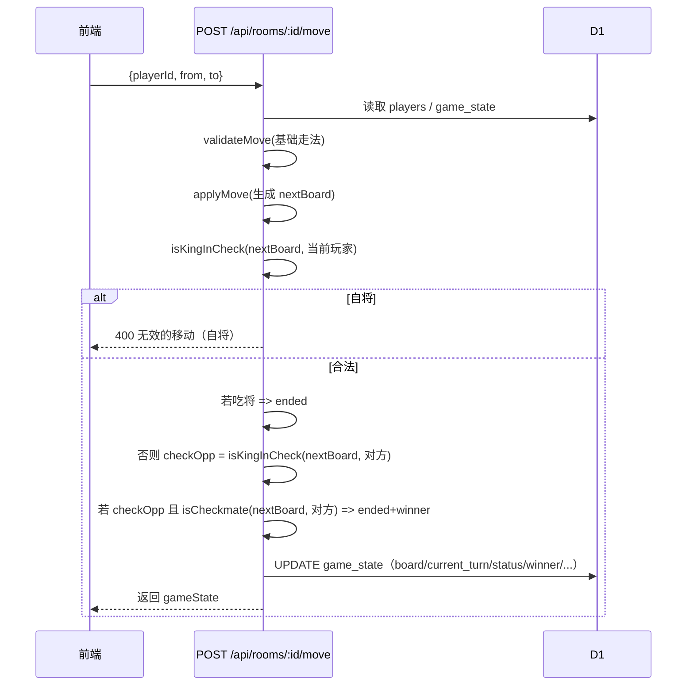

# 修复：后端权威走子校验（自将过滤 + 将军/将死结束）2026-03-19

## 0. 意图分类

- **Mid-sized Task（中等任务）**：为后端补齐与前端一致的核心棋规校验与对局结束判定，涉及多文件但范围明确。

## 1. 背景与发现（静态排查结论）

### 1.1 现状

- 前端 `game.js`：
- `getValidMoves()` 会做 **自将过滤**（临时盘面 + `isKingInCheck()`）。
- `makeMove()` 在本地乐观更新后，会基于 `isKingInCheck()` / `isCheckmate()` 提示“将军/将杀”并可能结束。
- 后端 `functions/api/rooms/[id]/move.js`：
- 仅做 `validateMove()`（基础走法、过河、蹩马腿、炮架、飞将吃将等）。
- **缺失：**
    - 允许“走完后己方仍被将军”（自杀式走法）。
    - 不会在“将死”时结束对局（仅在吃掉将/帅时结束）。

### 1.2 Bug 影响

- 在多人/对战场景中，**服务端才是最终状态来源**（DB 中的 `game_state`）。
- 现状会导致：
  1) 规则被绕过：玩家可通过直接请求 API 走出自将步。
  2) 前后端不一致：前端本地可能提示非法，但后端仍接受并广播/持久化。
  3) 对局无法正确结束：将死局面仍继续，可能导致无解或体验异常。

## 2. 目标（Must Have）

1. 后端在落子前做**权威合法性校验**：

- 基础走法合法（现有 `validateMove`）
- **落子后己方不处于被将军状态**（自将过滤）

2. 后端在落子后计算并写入状态：

- 更新 `current_turn`
- 计算 **对方是否被将军**（用于前端提示/状态同步）
- 若对方无任何合法应对（且在被将军）=> **将死结束**，写入 `status='ended'` 与 `winner`
- 若直接吃将/帅，仍然立即结束（保持现有规则）

## 3. 明确不做（Must NOT Have）

- 不新增 AI。
- 不引入 WebSocket 广播体系重构（维持现有轮询/接口结构）。
- 不改变数据库 schema。
- 不新增/修改测试文件（除非你后续再次明确要求我“写/改测试文件”）。

## 4. 设计方案

### 4.1 关键设计决策

- **复用前端已有棋规实现 vs. 后端重写一套**
- 由于当前后端 `move.js` 已有一套基于字符盘面的规则实现（'.' 空位，字母大小写区分红黑），而前端用对象棋子结构。
- 为最小风险与低改动，后端侧采用 **在&#32;`move.js`&#32;内扩展**：
    - `isKingInCheck(board, color)`
    - `getAllLegalMoves(board, color)`（带自将过滤）
    - `isCheckmate(board, color)` / `getLegalMovesForPiece` 等
- 这样可避免在后端引入前端对象规则映射、也避免跨文件复制 `game.js` 大块逻辑。

### 4.2 走子处理流程（后端）

### 4.3 核心算法（字符盘面）

#### 4.3.1 `isKingInCheck(board, color)`

- 定位 king：
- `color='red'` => 'K'
- `color='black'` => 'k'
- 遍历对方所有棋子，计算其**不考虑自将过滤**的“攻击步”（raw moves）
- 若任一攻击步覆盖 king 坐标 => true
- 同时单独处理“飞将”：两将同列且中间无子 => true

#### 4.3.2 `getRawMovesForPiece(board, pos)`

- 复用当前 `validateXxx` 的规则，但需要从“验证单一步”扩展到“生成所有步”。
- 每种棋子生成候选步：
- R(车)：四方向滑动到阻挡
- C(炮)：四方向，未跳子时可走空格；跳过一个后可吃子
- N(马)：8 个 L 形，检查蹩马腿
- B(相/象)：4 个对角两格，检查象眼 + 不能过河
- A(仕/士)：4 个斜对角一格 + 宫内
- K(将/帅)：上下左右一格 + 宫内（raw moves 不包含飞将吃将；飞将由 isKingInCheck 单独处理以避免互相递归）
- P(兵/卒)：前进一步，过河后可左右，不可后退

#### 4.3.3 自将过滤（legal moves）

- 对每个候选 move：
- clone board（轻量 copy：10x9 数组）
- apply
- `!isKingInCheck(newBoard, color)` => legal

#### 4.3.4 `isCheckmate(board, color)`

- 前提：通常由调用方在 `isKingInCheck(board,color)===true` 时再判断。
- 遍历 color 的所有棋子：若任何棋子存在 legal moves（带自将过滤）=> 非将死。

### 4.4 与前端一致性处理

- 后端返回的 `gameState` 保持现有字段结构。
- 可考虑额外返回 `inCheck` / `checkmate` 标志位给前端用于提示，但属于扩展字段，需确认前端是否会使用；本次计划 **不强行新增返回字段**，以避免前端兼容问题。

## 5. 需要修改/新增的文件

- 修改：`functions/api/rooms/[id]/move.js`
- 在 `validateMove` 之外新增：
    - `applyMove(board, from, to)`（纯函数）
    - `isKingInCheck(board, color)`
    - `isCheckmate(board, color)`
    - `generateMovesForPiece(board, row, col, piece)`（raw）
    - `getLegalMovesForPiece(board, row, col, piece, color)`（带自将过滤）
- （可选，小范围重构）提取一些共享小函数：
- `cloneBoard(board)`
- `isRedPiece(ch)` / `pieceColor(ch)`
- `inPalace(row,col,isRed)`

## 6. 实施步骤（逐步验证点）

> 由于你已明确允许“启动项目 + 跑测试”，在执行阶段可以做。

1. **添加后端棋规工具函数**（先不接入主流程）

- 写 `findKing/isKingInCheck/generateMovesForPiece` 等
- 人工对照前端规则与现有 `validateXxx` 保持一致

2. **接入 move API 的自将过滤**

- `validateMove` 通过后，先 applyMove 得到 `nextBoard`
- 若 `isKingInCheck(nextBoard, player.color)` => 400

3. **接入将军/将死结束判定**

- 若未吃将：
    - `oppColor = nextTurn`
    - `if isKingInCheck(nextBoard, oppColor) && isCheckmate(nextBoard, oppColor)` => ended + winner=player.color

4. **更新返回 gameState 与 DB 更新一致**

- 保证 `board` 写入 DB 的仍是字符盘面数组

5. **验证（执行阶段，需你确认的命令）**

- `npm test`（vitest）
- 重点关注：`tests/unit/chess-rules.test.js`、`tests/integration/game-flow.test.js`、`tests/debug/move-debug.test.js`

## 7. 风险与规避

- 风险：后端生成步逻辑与 `validateMove` 细节不一致，导致“可走但校验不让走/反之”。
- 规避：生成步逻辑尽量以当前 `validateXxx` 的条件为准；先实现 raw move 生成，再用 `validateMove` 二次过滤（可选）保证一致。
- 风险：性能
- 10x9 固定小棋盘 + 每步校验只在一次 API 调用内，开销可接受。

## 8. 验收标准（Acceptance Criteria）

- 通过 API 无法提交任何“落子后己方仍被将军”的走法。
- 在后端计算为“将死”的局面，API 返回 `status='ended'` 且写入 DB。
- 前端轮询同步后能正确看到对局结束（即使前端本地未判定）。
- 现有测试全部通过（在你允许执行的前提下）。