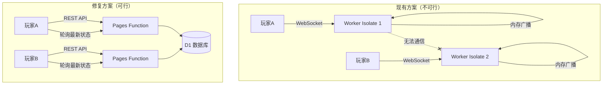
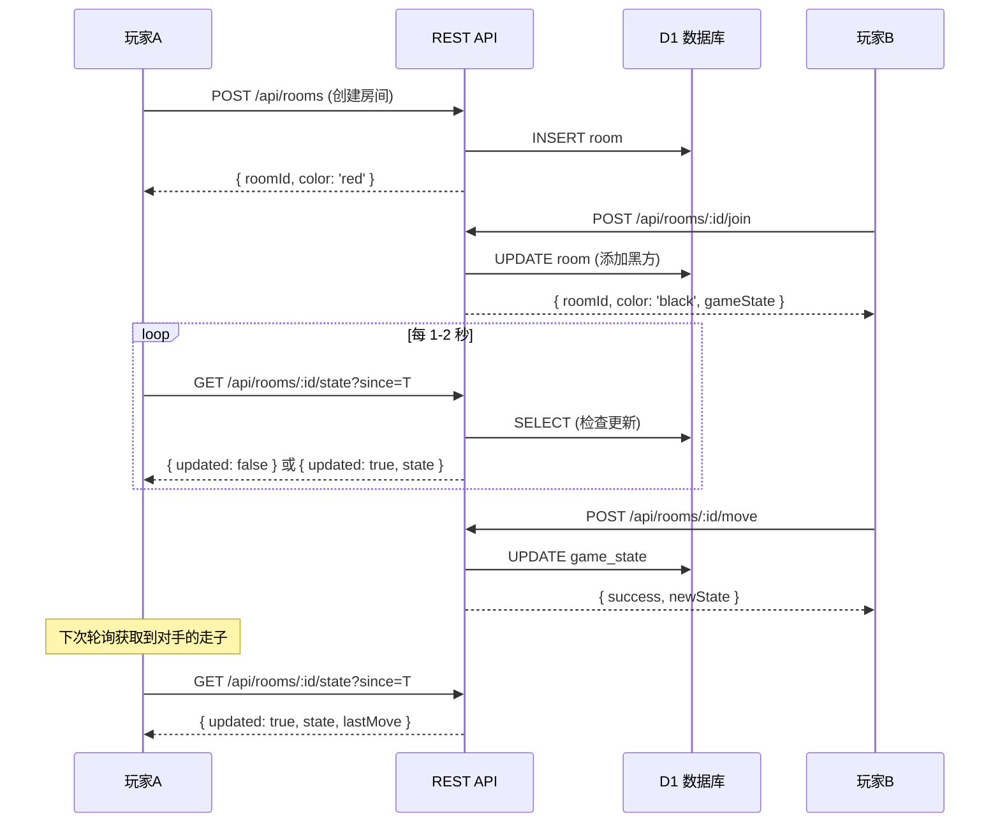

# 修复中国象棋 Cloudflare Pages 部署 - 全面修复计划

## 问题概述

通过全面代码审查，发现项目在 Cloudflare Pages 上**完全无法工作**，涉及多个层面的严重 Bug。

---

## 发现的所有 Bug（按严重程度排列）

### 🔴 致命 Bug（导致完全不能工作）

#### Bug #1: Cloudflare Pages Functions 架构模式错误 — `_worker.js` 放置位置不兼容

**问题**: 项目在 `functions/_worker.js` 中使用了 Advanced Mode（`_worker.js`），但这种写法在 **通过 Dashboard（Git 集成）部署** 时存在严重问题。

Cloudflare Pages 有两种 Functions 模式:

- **File-based routing**: `functions/` 目录下按路径命名文件（如 `functions/api/hello.js` → `/api/hello`）
- **Advanced Mode**: `_worker.js` 放在**构建输出目录根部**（即 `public/_worker.js`），或通过 wrangler CLI 部署

当前代码将 `_worker.js` 放在 `functions/` 目录下，但通过 Dashboard 部署时:

- Cloudflare 会将 `functions/` 视为 file-based routing 模式
- `_worker.js` 在 `functions/` 内会被当作路由文件处理，而非 Advanced Mode 入口
- 导致所有请求路由都不正确，WebSocket 和 API 端点无法工作

**修复**: 将 `_worker.js` 的部署改为正确的方式 —— 在 Vite 构建时将其复制到 `public/` 输出目录，或改用 file-based routing。

#### Bug #2: WebSocket 多人对战在无状态 Serverless 环境下完全无法工作

**问题**: `_worker.js` 使用 `const rooms = new Map()` 在内存中存储 WebSocket 连接和房间状态。但 Cloudflare Workers/Pages Functions 是**无状态的**：

- 每个请求可能命中不同的 isolate（隔离实例）
- 两个玩家的 WebSocket 连接几乎不可能落在同一个 isolate 上
- 即使幸运地在同一个 isolate 上，`broadcastToRoom()` 无法将消息发送到另一个 isolate 的 WebSocket 连接

这意味着：**创建房间后，另一个玩家加入时看不到房间；走子后对手收不到消息。**

**修复**: 放弃纯 WebSocket 广播方案，改用 **REST API + 前端轮询** 架构。所有游戏状态通过 D1 数据库持久化，前端通过定时轮询获取最新状态。这是在不使用 Durable Objects 的情况下唯一可行的方案。

#### Bug #3: Vite 构建配置缺失 — 入口文件未正确处理

**问题**: `vite.config.js` 设置了 `publicDir: false`，且没有配置 `build.rollupOptions.input`。Vite 默认会从项目根目录的 `index.html` 作为入口，但 `game.js` 和 `style.css` 通过相对路径引用。构建后的 `index.html` 会引用 `assets/game.js`，但没有配置确保这些静态文件被正确复制和引用。

此外，`publicDir: false` 意味着不会自动复制任何静态资源到 `public/` 目录。

### 🟡 高危 Bug（导致核心功能失败）

#### Bug #4: 前端 `joinRoom()` 使用了不存在的 REST API 端点验证

**问题**: `joinRoom()` 方法先调用 `fetch('/api/room/lookup?name=...')` 查询房间，但在 file-based routing 模式下该端点不会自动可用。即使切换到正确的部署模式，REST API 端点也需要与 WebSocket 端点分开正确配置。

#### Bug #5: 服务端 `validateMove()` 验证过于宽松

**问题**: 服务端的 `validateMove()` 函数只检查了基本的边界和颜色，**没有验证棋子的合法走法规则**（将/帅、马、车等的移动规则）。任何移动只要不是移动到己方棋子上都会通过验证。

#### Bug #6: `handleWebSocketClose` 立即清除玩家数据

**问题**: 当 WebSocket 断开时，`handleWebSocketClose` 立即从数据库中删除玩家记录并将房间的对应颜色设为 NULL。这意味着短暂的网络波动就会导致玩家丢失房间位置，重连后无法恢复。

### 🟢 中等 Bug（影响用户体验）

#### Bug #7: 棋盘坐标计算不一致

**问题**: `createPieceElement` 中棋子位置使用 `col * 44 + 10` 和 `row * 44 + 10`，而 `valid-move` 指示器使用 `col * 44 + 30` 和 `row * 44 + 30`（且通过 CSS `translate(-50%, -50%)` 居中）。由于棋子宽度 40px，中心应在 `col * 44 + 30`，所以 valid-move 是对的，但棋子位置没有居中于交叉点上。

#### Bug #8: 响应式布局时棋盘尺寸缩放但 JS 坐标是硬编码的

**问题**: CSS 媒体查询改变了 `#chessBoard` 的尺寸和 `.chess-piece` 的大小，但 JavaScript 中所有位置计算都使用硬编码的 `44px` 间距。在小屏幕上，CSS 改变了棋盘尺寸，但 JS 仍然按照大尺寸计算位置，导致棋子位置错位。

#### Bug #9: `createRoom` 生成的 roomId 包含 `room-` 前缀

**问题**: `createRoom()` 使用 `crypto.randomUUID()` 生成 ID 并加上 `room-` 前缀。但在 `joinRoom()` 中，用户输入的 Room ID 可能不包含这个前缀，也可能输入的是房间名而非 ID，导致匹配失败。

#### Bug #10: `lobby-message` 和 `game-message` 元素始终显示

**问题**: 消息容器始终可见（有背景色和边框），即使内容为空也占据空间，视觉上不够整洁。

---

## 修复架构方案

### 核心改造：从 WebSocket 广播改为 REST + 轮询

### 新 API 设计

| 方法 | 路径 | 功能 |
|------|------|------|
| POST | `/api/rooms` | 创建房间 |
| GET | `/api/rooms/:id` | 获取房间信息和游戏状态 |
| POST | `/api/rooms/:id/join` | 加入房间 |
| POST | `/api/rooms/:id/move` | 走子 |
| GET | `/api/rooms/:id/state?since=<timestamp>` | 轮询游戏状态（长轮询或普通轮询） |
| POST | `/api/rooms/:id/leave` | 离开房间 |

### 前端轮询策略

---

## 详细实现步骤

### Step 1: 重构后端 — 改为 file-based routing REST API

**删除**: `functions/_worker.js`

**创建以下文件**:

#### `functions/api/rooms.js`

- `onRequestPost()` — 创建房间
- 生成 roomId (UUID)
- 生成 playerId (UUID)
- INSERT 到 rooms 表和 game\_state 表
- 返回 `{ roomId, playerId, color: 'red' }`

#### `functions/api/rooms/[id].js`

- `onRequestGet()` — 获取房间详情
- 查询 rooms + game\_state
- 返回完整游戏状态

#### `functions/api/rooms/[id]/join.js`

- `onRequestPost()` — 加入房间
- 检查房间是否存在且未满
- 分配黑方
- 返回 `{ playerId, color: 'black', gameState }`

#### `functions/api/rooms/[id]/move.js`

- `onRequestPost()` — 走子
- 验证 playerId 和回合
- 执行基础走法验证
- 更新 game\_state
- 返回新状态

#### `functions/api/rooms/[id]/state.js`

- `onRequestGet()` — 轮询状态
- 接收 `since` 参数
- 如有更新则返回最新状态，否则返回 `{ updated: false }`

#### `functions/api/rooms/[id]/leave.js`

- `onRequestPost()` — 离开房间

### Step 2: 更新数据库 Schema

在 `players` 表中添加 `name` 字段。确保 `game_state` 中的 `updated_at` 用于轮询比较。

### Step 3: 重写前端 `game.js`

**主要改动**:

1. 移除所有 WebSocket 相关代码（`connectWebSocket`, `heartbeat`, `reconnect` 等）
2. 添加 `ApiClient` 类封装 REST API 调用
3. 添加轮询机制：

- 等待对手加入：每 2 秒轮询房间信息
- 对手回合时：每 1.5 秒轮询游戏状态
- 自己回合时：停止轮询（走子后立即发送 POST 请求）

4. `createRoom()` → POST `/api/rooms`
5. `joinRoom()` → POST `/api/rooms/:id/join`
6. `makeMove()` → POST `/api/rooms/:id/move`
7. 简化连接状态管理（不需要 WebSocket 状态）

### Step 4: 修复 Vite 构建配置

- 确保 `vite.config.js` 正确处理入口文件
- 移除 `publicDir: false` 或正确配置静态资源目录
- 验证构建输出包含 `index.html` 和所有资源

### Step 5: 修复棋盘渲染 Bug

1. **统一坐标计算**: 棋子和 valid-move 使用一致的定位逻辑
2. **移除 CSS 响应式硬编码**: 使用 JS 动态计算或 CSS 变量统一管理棋盘尺寸
3. **修复&#32;`lobby-message`&#32;空白显示**: 仅在有消息时显示

### Step 6: 改进用户体验

1. 房间创建后显示 Room ID，方便分享
2. 加入房间支持通过房间名称或 ID
3. 添加加载状态指示器

---

## 文件变更清单

| 操作 | 文件 | 说明 |
|------|------|------|
| 删除 | `functions/_worker.js` | 移除不工作的 WebSocket worker |
| 创建 | `functions/api/rooms.js` | 创建房间 API |
| 创建 | `functions/api/rooms/[id].js` | 获取房间信息 |
| 创建 | `functions/api/rooms/[id]/join.js` | 加入房间 API |
| 创建 | `functions/api/rooms/[id]/move.js` | 走子 API |
| 创建 | `functions/api/rooms/[id]/state.js` | 轮询状态 API |
| 创建 | `functions/api/rooms/[id]/leave.js` | 离开房间 API |
| 创建 | `functions/_middleware.js` | 全局中间件（初始化 DB） |
| 重写 | `game.js` | 移除 WebSocket，改用 REST + 轮询 |
| 修改 | `style.css` | 修复样式 Bug |
| 修改 | `vite.config.js` | 修复构建配置 |
| 修改 | `index.html` | 添加 Room ID 显示区域 |
| 修改 | `schema.sql` | 添加 player\_name 字段 |

---

## Must NOT Include（不做的事情）

- ❌ 不使用 Durable Objects（需要额外付费和配置）
- ❌ 不引入新的框架或库
- ❌ 不改变游戏规则逻辑（将/帅、马、炮等的走法保持不变）
- ❌ 不添加用户认证系统
- ❌ 不添加聊天功能
- ❌ 不修改或删除文档文件

---

## 验证方法

1. `npm run build` 成功输出到 `public/` 目录
2. `public/index.html` 存在且正确引用资源
3. `functions/api/` 目录包含所有 API 路由文件
4. 本地通过 `wrangler pages dev public` 测试 API 端点
5. 部署到 Cloudflare Pages 后能正常加载页面
6. 能创建房间、加入房间、走子、看到对手的走子