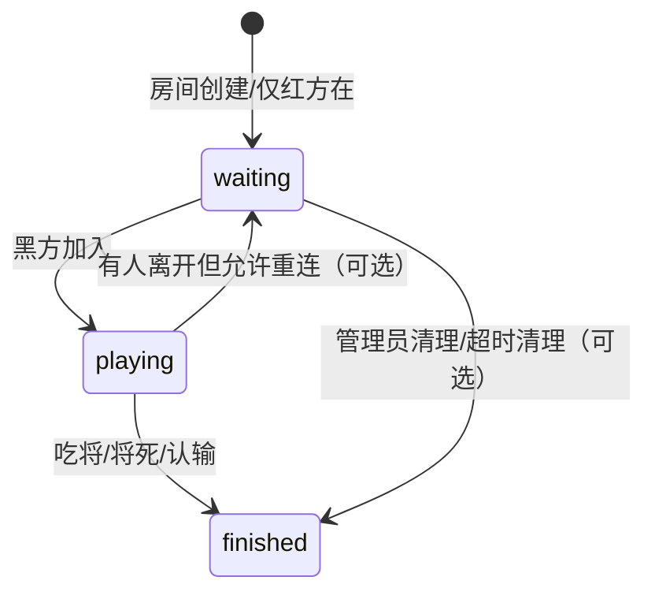

# 全项目更彻底逻辑巡检与修复计划（含已落地修复）2026-03-19

> 说明：本计划覆盖前端、REST API、WebSocket、DB 一致性与状态迁移。
> 你已授权：允许改高风险点、允许跑测试/构建/启动本地、必要时中等重构。

## 0. 意图分类

- **Refactoring + Mid-sized Task 混合**：
- 部分为确定 bug 修复（行为缺陷）
- 部分为状态机一致性重构（有行为语义调整，但目标是消除系统内矛盾）

## 1. 已发现的问题与已实施修复（本次会话已改）

### 1.1 后端权威走子校验缺失（高危）

- 位置：`functions/api/rooms/[id]/move.js`
- 问题：允许自将、无法在将死时结束（仅吃将才结束）。
- 修复：已补齐
- 自将过滤：落子后 `isKingInCheck(nextBoard, player.color)` => 400
- 将死结束：对方被将军且 `isCheckmate(nextBoard, opponent)` => ended + winner

### 1.2 前端与后端状态不一致风险（高危）

- 位置：`game.js` 的 `makeMove()`
- 问题：请求成功后未用服务端返回强制覆盖本地（只更新 `lastUpdatedAt`，仅 ended 时置 `gameOver`），存在：
- 本地乐观提示将军/将杀与服务端结果不一致
- 服务端因并发/拒绝/回滚导致盘面分歧
- 修复：已落地折中方案：成功后 `this.loadGameState(data.gameState)` 全量以服务端为准。

### 1.3 rooms/game\_state 状态机不一致（高危）

- 位置：`functions/api/rooms.js`、`functions/api/rooms/[id]/join.js`、`schema.sql`
- 问题：创建房间时 `rooms.status='waiting'`，但 `game_state.status='playing'`（与 schema 注释 `waiting/playing/finished` 也冲突）
- 修复：已落地
- `functions/api/rooms.js` 创建时写 `game_state.status='waiting'`
- `functions/api/rooms/[id]/join.js` 第二名玩家加入（房间满员/进入对局）时将 `game_state.status='playing'`
- `schema.sql` 中 `game_state.status` 默认值改为 `'waiting'`（与 rooms 对齐）

### 1.4 验证结果（已执行）

- `npm test`：252/252 全通过。
- `npm run build`：构建成功，但 Vite 提示：`index.html` 中 ``

## 3. 状态机一致性定义（拟定）

## 4. 实施步骤（后续执行清单）

1. **统一 REST 与 WS 的规则实现**

- 抽取 chess rules 模块
- REST `move.js` 与 WS move handler 复用

2. **补齐 leave/rejoin 状态迁移**

- leave 时同步 `game_state.status`
- 明确“离开=断开”还是“离开=退出”

3. **实现并发保护（如需要）**

- REST move 引入 move\_count 乐观锁（与 WS 对齐）

4. **修复 Vite 警告**

- `index.html` script 改 module

5. **验证**

- `npm test`
- `npm run build`
- （可选）`npm run dev:local` 用 wrangler 在本地验证 D1 + Pages

## 5. 边界（Must NOT）

- 不引入新框架/新依赖（除非现有依赖已包含）。
- 不做 UI 大改。
- 不扩展新玩法（悔棋、观战等）。

## 6. 风险与回滚

- 状态机语义调整属于“行为变化”：
- 建议通过 D1 数据迁移脚本/兼容读取来渐进（如果线上已有数据）。
- 目前改动集中在 create/join 默认值层面，风险可控。