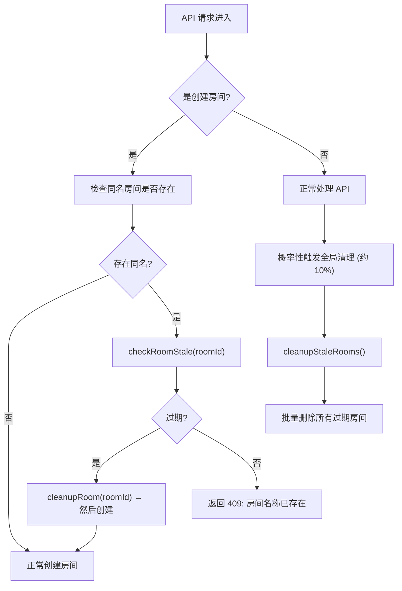

# 过期房间自动清理方案

## 问题分析

当前 `functions/api/rooms.js` 在创建房间时，如果发现同名房间已存在，直接返回 `409` 错误（`房间名称已存在`），**没有检查该房间是否已经过期**。

同时，`leave.js` 只是将玩家标记为 `connected = 0`，不会删除房间记录。这导致：

- 玩家离开后，废弃房间永远留在数据库中
- 无法用相同名称创建新房间
- 数据库中废弃记录不断堆积

## 解决方案

### 核心逻辑：过期房间判定

一个房间被视为**过期（stale）**的条件：

- 房间没有任何玩家记录，**或者**
- 所有玩家都满足：`connected = 0` **且** `last_seen` 超过 5 分钟

### 实现方式

两层清理机制：



### 修改文件清单

| 文件 | 修改内容 |
|------|---------|
| `functions/api/rooms.js` | 创建房间时检测并清理同名过期房间 |
| `functions/_middleware.js` | 在全局中间件中概率性触发过期房间批量清理 |

### 不涉及的修改

- 不修改前端代码
- 不修改 `join.js` / `leave.js` / `move.js` / `state.js`
- 不修改数据库 schema
- 不创建新文件

---

## 详细实现步骤

### Step 1: 修改 `functions/api/rooms.js` — 创建时清理同名过期房间

当发现同名房间已存在时，查询该房间的玩家状态，判断是否过期。若过期则先删除旧房间，再创建新房间。

```js
// 常量
const STALE_ROOM_TIMEOUT = 5 * 60 * 1000; // 5 分钟

// 在 if (existing) 分支中，替换直接返回 409 的逻辑：
if (existing) {
  const isStale = await checkRoomStale(existing.id, db);
  if (isStale) {
    await cleanupRoom(existing.id, db);
    // 继续创建新房间
  } else {
    return Response.json({ error: '房间名称已存在' }, { status: 409 });
  }
}
```

辅助函数 `checkRoomStale(roomId, db)`:

- 查询 `players` 表中该房间的玩家总数、在线玩家数、最近活跃玩家数
- 无玩家 → 过期
- 所有玩家都断线且超过 5 分钟无活动 → 过期

辅助函数 `cleanupRoom(roomId, db)`:

- 使用 `db.batch()` 批量删除 `players`、`game_state`、`rooms` 中该房间的记录

### Step 2: 修改 `functions/_middleware.js` — 全局概率性清理

在 `onRequest` 函数中，对非 OPTIONS 请求以约 10% 概率触发全局过期房间清理（使用 `Math.random()`）。

```js
// 在 onRequest 中，DB 初始化之后、路由处理之前
if (env.DB && Math.random() < 0.1) {
  // 异步执行，不阻塞当前请求
  context.waitUntil(cleanupAllStaleRooms(env.DB));
}
```

辅助函数 `cleanupAllStaleRooms(db)`:

- 查询所有在 `rooms` 表中，且所有关联玩家均断线且最后活跃超过 5 分钟的房间
- 对每个过期房间调用 `cleanupRoom`
- 用 try-catch 包裹，确保清理失败不影响正常请求

---

## 验证方法

1. 创建房间 → 离开 → 等待超过 5 分钟 → 用同名再创建 → 应成功（旧房间被自动清理）
2. 创建房间 → 不离开 → 用同名再创建 → 应返回 409
3. 多次创建和废弃房间后，全局清理应在后续请求中概率性触发，清除所有过期记录