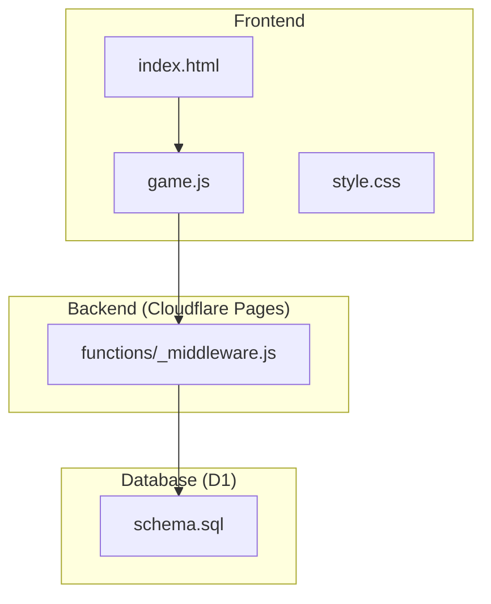
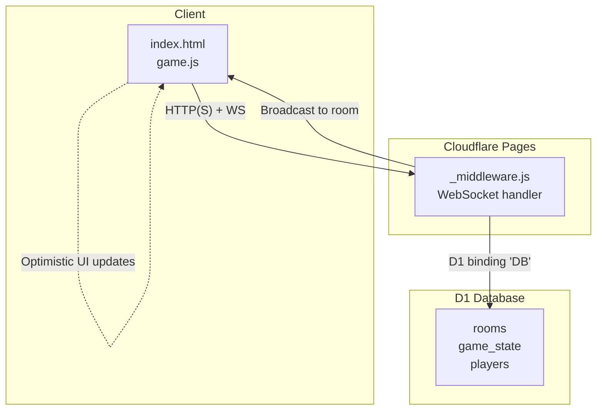
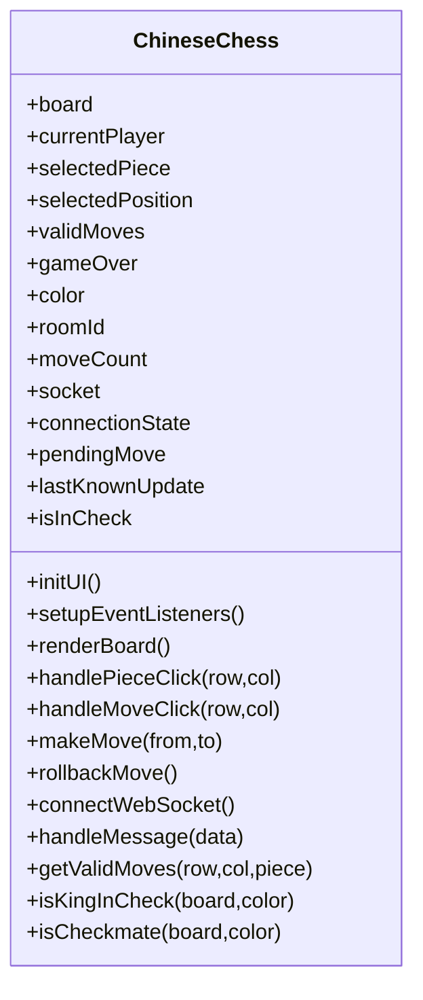
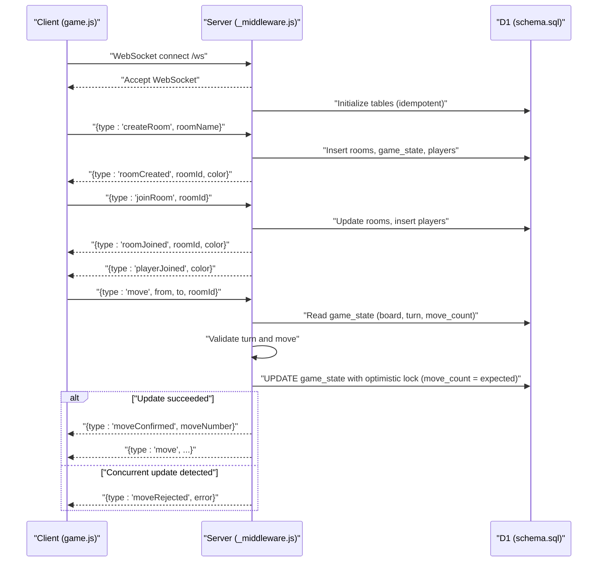
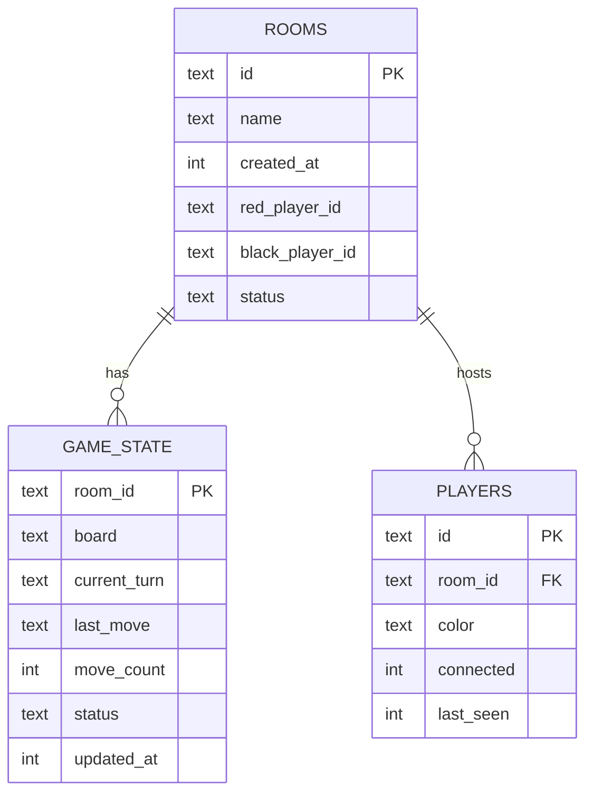
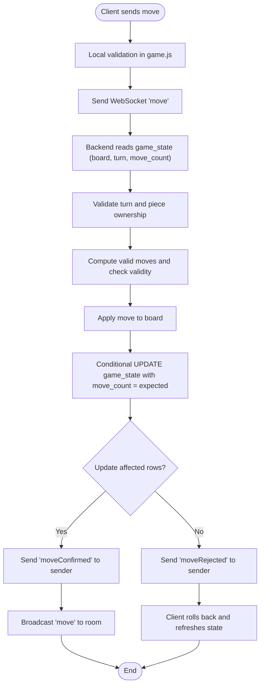
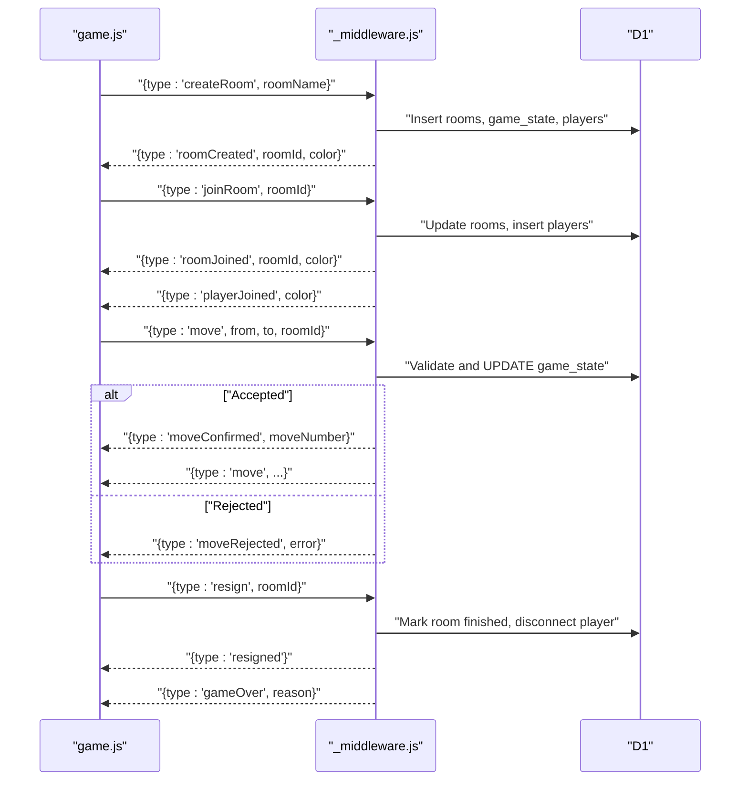
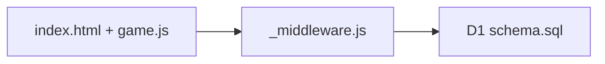

# Architecture and Design

<cite>
**Referenced Files in This Document**
- [README.md](file://README.md)
- [package.json](file://package.json)
- [wrangler.toml](file://wrangler.toml)
- [index.html](file://index.html)
- [game.js](file://game.js)
- [schema.sql](file://schema.sql)
- [functions/_middleware.js](file://functions/_middleware.js)
- [tests/integration/websocket.test.js](file://tests/integration/websocket.test.js)
- [tests/integration/database.test.js](file://tests/integration/database.test.js)
</cite>

## Table of Contents
1. [Introduction](#introduction)
2. [Project Structure](#project-structure)
3. [Core Components](#core-components)
4. [Architecture Overview](#architecture-overview)
5. [Detailed Component Analysis](#detailed-component-analysis)
6. [Dependency Analysis](#dependency-analysis)
7. [Performance Considerations](#performance-considerations)
8. [Troubleshooting Guide](#troubleshooting-guide)
9. [Conclusion](#conclusion)
10. [Appendices](#appendices)

## Introduction
This document describes the architecture and design of the Chinese Chess Online system. It explains the separation between the frontend (HTML/CSS/JavaScript), backend (Cloudflare Pages Functions with WebSocket support), and the database (Cloudflare D1). It documents the real-time communication model, optimistic concurrency control, and stateless server design. It also covers component interactions between the frontend game logic and backend WebSocket handlers, and presents system context diagrams showing data flows from user input to WebSocket messages and database operations. Finally, it outlines the cloud-native deployment model using Cloudflare Pages and D1, along with technical decisions, event-driven patterns, and scalability considerations for multiplayer gaming.

## Project Structure
The project is organized into frontend assets, backend Cloudflare Pages Functions, and database schema and tests:
- Frontend: index.html, game.js, style.css
- Backend: functions/_middleware.js (entrypoint for Pages Functions)
- Database: schema.sql
- Deployment: wrangler.toml, package.json scripts
- Tests: integration and unit tests under tests/

**Diagram sources**
- [index.html](file://index.html)
- [game.js](file://game.js)
- [functions/_middleware.js](file://functions/_middleware.js)
- [schema.sql](file://schema.sql)

**Section sources**
- [README.md](file://README.md)
- [package.json](file://package.json)
- [wrangler.toml](file://wrangler.toml)

## Core Components
- Frontend (HTML/CSS/JavaScript)
  - index.html: Main page with lobby and game screens, and module script entry.
  - game.js: Implements the complete Chinese chess game logic, UI rendering, move validation, check/checkmate detection, WebSocket client, reconnection, heartbeat, and optimistic move application.
- Backend (Cloudflare Pages Functions)
  - functions/_middleware.js: Handles HTTP requests, upgrades to WebSocket, manages connections, heartbeats, and routes messages to room/game handlers. Uses D1 bindings for persistence.
- Database (Cloudflare D1)
  - schema.sql: Defines rooms, game_state, and players tables with appropriate indexes and foreign keys.

Key responsibilities:
- Frontend: User interaction, local move validation, optimistic UI updates, WebSocket messaging, reconnection and heartbeat.
- Backend: WebSocket lifecycle, room management, game state validation, optimistic concurrency control, broadcasting, and database transactions.
- Database: Persistent storage of rooms, game state, and player presence.

**Section sources**
- [index.html](file://index.html)
- [game.js](file://game.js)
- [functions/_middleware.js](file://functions/_middleware.js)
- [schema.sql](file://schema.sql)

## Architecture Overview
The system follows a stateless server design with event-driven WebSocket handlers and a D1-backed datastore. The frontend is a single-page application that communicates with the backend via WebSocket messages. The backend maintains per-connection state in memory and persists game state to D1. Real-time updates are broadcast to both players in a room.

**Diagram sources**
- [functions/_middleware.js](file://functions/_middleware.js)
- [game.js](file://game.js)
- [schema.sql](file://schema.sql)

## Detailed Component Analysis

### Frontend Game Logic (game.js)
Responsibilities:
- Game state: board representation, current player, selected piece, valid moves, game over flag, move count.
- UI: renders board, pieces, valid moves, check indicators, and screen switching (lobby vs game).
- Rules engine: computes valid moves per piece type, enforces palace/river constraints, flying general rule, and generates pseudo-moves for check detection.
- WebSocket client: connects to /ws, handles open/message/close/error, manages heartbeat, reconnection attempts, and sends/receives messages.
- Optimistic updates: applies moves locally immediately upon user action, with rollback capability if server rejects.
- Reconnection and resilience: reconnect attempts with exponential delay, heartbeat monitoring, and rejoin on reconnect.

**Diagram sources**
- [game.js](file://game.js)

**Section sources**
- [game.js](file://game.js)
- [index.html](file://index.html)

### Backend WebSocket Handler (_middleware.js)
Responsibilities:
- Request routing: serves static content and upgrades to WebSocket at /ws.
- Connection lifecycle: accepts WebSocketPair, tracks connections in memory, sets up heartbeat timers, and cleans up on close.
- Message routing: dispatches messages by type (createRoom, joinRoom, move, ping, rejoin, resign, etc.).
- Room management: creates/joins rooms, updates player presence, broadcasts events, and cleans up stale rooms.
- Game logic: validates moves against current game state, applies rules, and performs optimistic concurrency control.
- Broadcasting: sends updates to all room participants except the sender.
- Error handling: standardized error codes and messages for invalid messages, unknown types, database issues, room/game/player errors, and connection failures.

**Diagram sources**
- [functions/_middleware.js](file://functions/_middleware.js)
- [schema.sql](file://schema.sql)
- [game.js](file://game.js)

**Section sources**
- [functions/_middleware.js](file://functions/_middleware.js)
- [schema.sql](file://schema.sql)

### Database Schema (D1)
Tables and relationships:
- rooms: stores room metadata, player IDs, and status.
- game_state: stores serialized board, current turn, last move, move count, status, and timestamps.
- players: stores player connections, colors, and last seen timestamps.
- Indexes: optimize lookups by name/status, room_id, and updated_at.

**Diagram sources**
- [schema.sql](file://schema.sql)

**Section sources**
- [schema.sql](file://schema.sql)

### WebSocket Message Flow and Optimistic Concurrency Control
- Frontend sends move after validating locally; backend re-validates and applies with optimistic concurrency using move_count.
- Backend reads expected move_count, executes move, and updates with a conditional UPDATE that only succeeds if move_count still matches.
- If another move was applied concurrently, the UPDATE affects zero rows, and the frontend receives a rejection message; it can then reconcile state.

**Diagram sources**
- [game.js](file://game.js)
- [functions/_middleware.js](file://functions/_middleware.js)
- [schema.sql](file://schema.sql)

**Section sources**
- [game.js](file://game.js)
- [functions/_middleware.js](file://functions/_middleware.js)
- [schema.sql](file://schema.sql)

### Component Interactions Between Frontend and Backend
- Lobby actions: createRoom/joinRoom trigger WebSocket messages; backend responds with roomCreated/roomJoined and playerJoined.
- Gameplay: move triggers validation and optimistic update; backend confirms or rejects; frontend may roll back.
- Resign: backend marks room finished and broadcasts game over.
- Heartbeat: backend pings; frontend responds; timeouts lead to closure and reconnection.

**Diagram sources**
- [game.js](file://game.js)
- [functions/_middleware.js](file://functions/_middleware.js)
- [schema.sql](file://schema.sql)

**Section sources**
- [game.js](file://game.js)
- [functions/_middleware.js](file://functions/_middleware.js)
- [schema.sql](file://schema.sql)

## Dependency Analysis
- Frontend depends on:
  - game.js for logic and WebSocket client.
  - index.html for DOM and UI structure.
- Backend depends on:
  - functions/_middleware.js for request routing, WebSocket handling, room/game logic, and D1 operations.
  - D1 schema for persistent state.
- Database depends on:
  - schema.sql for table definitions and indexes.

**Diagram sources**
- [index.html](file://index.html)
- [game.js](file://game.js)
- [functions/_middleware.js](file://functions/_middleware.js)
- [schema.sql](file://schema.sql)

**Section sources**
- [index.html](file://index.html)
- [game.js](file://game.js)
- [functions/_middleware.js](file://functions/_middleware.js)
- [schema.sql](file://schema.sql)

## Performance Considerations
- Statelessness: The backend does not persist connection state beyond heartbeat timestamps and minimal in-memory maps. This enables horizontal scaling across Cloudflare’s edge.
- Optimistic UI: Immediate feedback reduces perceived latency; server-side validation prevents inconsistencies.
- Conditional updates: Optimistic concurrency control minimizes conflicts and avoids expensive locks.
- Indexes: Proper indexing on rooms(name), rooms(status), players(room_id), and game_state(updated_at) improves query performance.
- Heartbeat: Keeps stale connections clean and ensures timely reconnection.
- Batch writes: Room creation uses batched D1 statements to reduce round-trips.

[No sources needed since this section provides general guidance]

## Troubleshooting Guide
Common issues and remedies:
- Database not configured: Verify D1 binding in wrangler.toml and ensure DB initialization runs on first request.
- Room not found or full: Ensure correct room ID/name; stale rooms are cleaned up automatically.
- Move rejected: Indicates concurrent move; client should refresh state and retry if appropriate.
- Connection drops: Heartbeat and reconnection logic will attempt to restore; check network and server logs.
- Stale rooms: The backend detects and cleans rooms where all players are disconnected and inactive.

**Section sources**
- [functions/_middleware.js](file://functions/_middleware.js)
- [tests/integration/websocket.test.js](file://tests/integration/websocket.test.js)
- [tests/integration/database.test.js](file://tests/integration/database.test.js)

## Conclusion
The Chinese Chess Online system employs a clean separation of concerns: a lightweight frontend, a stateless backend with event-driven WebSocket handlers, and a D1-backed datastore. Real-time gameplay is achieved through WebSocket messaging, with optimistic UI updates and robust optimistic concurrency control to maintain consistency. The cloud-native deployment model leverages Cloudflare Pages and D1 for global availability, low-latency edge execution, and simplified operational overhead. The design supports multiplayer gaming with strong reliability through heartbeat, reconnection, and conflict resolution mechanisms.

[No sources needed since this section summarizes without analyzing specific files]

## Appendices

### Cloudflare Deployment Model
- Pages hosting: Static assets built by Vite and served by Cloudflare Pages.
- Functions: Single entrypoint in functions/_middleware.js handles HTTP and WebSocket traffic.
- D1 binding: Configured in wrangler.toml with a named binding for database access.
- Scripts: npm scripts automate local development, DB initialization, and deployment.

**Section sources**
- [package.json](file://package.json)
- [wrangler.toml](file://wrangler.toml)
- [README.md](file://README.md)