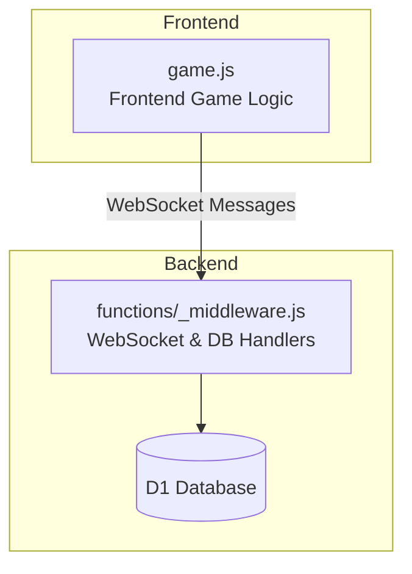
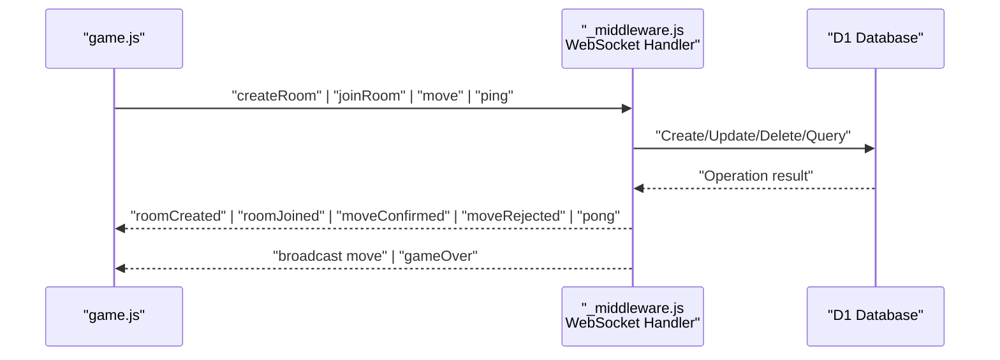
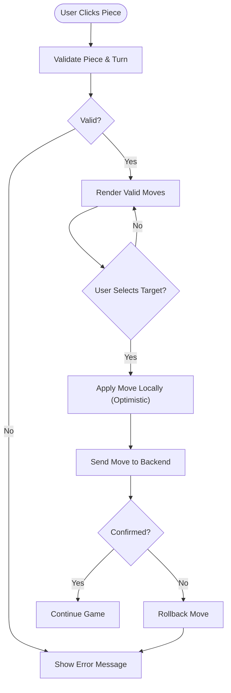
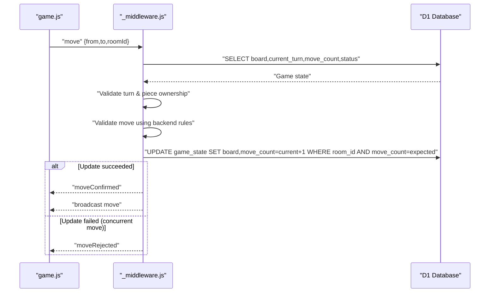
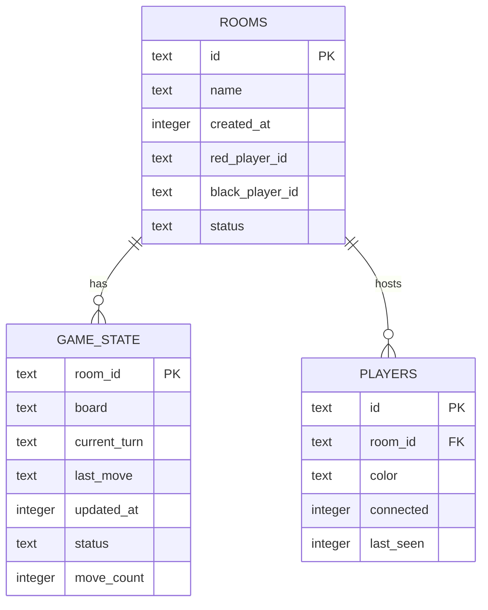
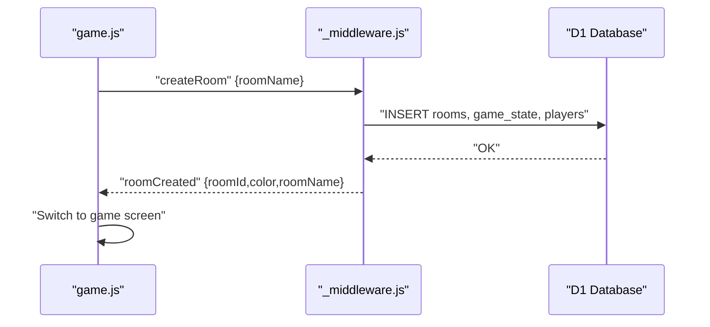
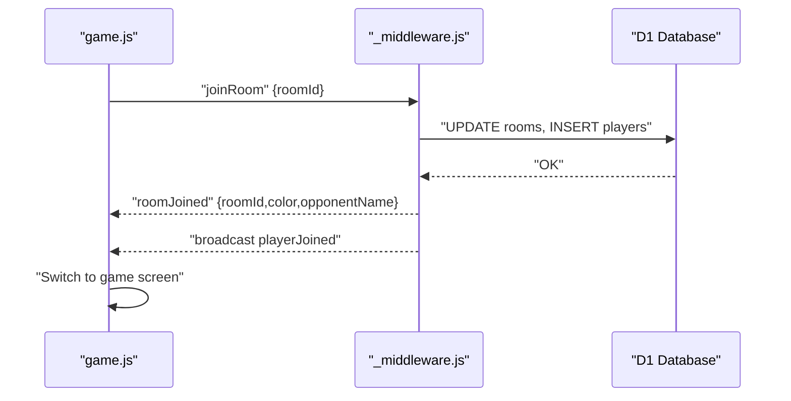
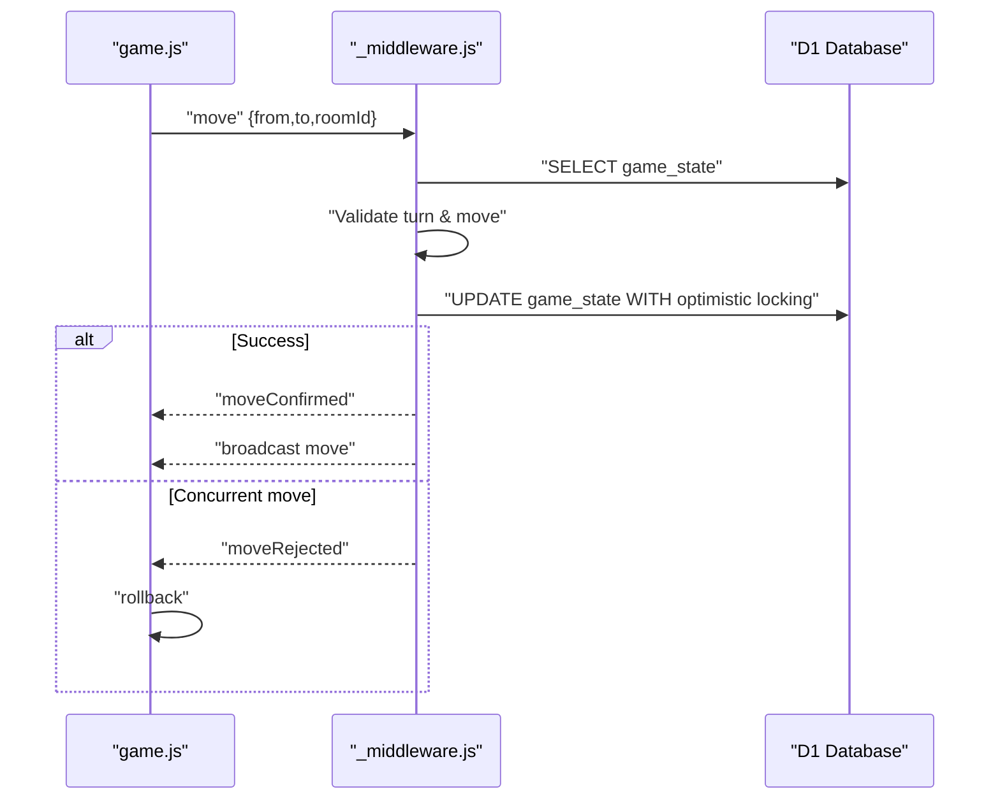
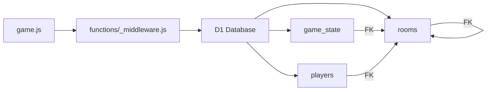

# Component Relationships

<cite>
**Referenced Files in This Document**
- [game.js](file://game.js)
- [_middleware.js](file://functions/_middleware.js)
- [schema.sql](file://schema.sql)
- [websocket.test.js](file://tests/integration/websocket.test.js)
- [game-flow.test.js](file://tests/integration/game-flow.test.js)
- [chess-rules.test.js](file://tests/unit/chess-rules.test.js)
- [README.md](file://README.md)
</cite>

## Table of Contents
1. [Introduction](#introduction)
2. [Project Structure](#project-structure)
3. [Core Components](#core-components)
4. [Architecture Overview](#architecture-overview)
5. [Detailed Component Analysis](#detailed-component-analysis)
6. [Dependency Analysis](#dependency-analysis)
7. [Performance Considerations](#performance-considerations)
8. [Troubleshooting Guide](#troubleshooting-guide)
9. [Conclusion](#conclusion)

## Introduction
This document explains the component relationships in the Chinese Chess system, focusing on how the frontend game logic interacts with the backend WebSocket handlers, the database schema and constraints, and the optimistic concurrency control mechanism. It also covers error propagation and state synchronization across components.

## Project Structure
The system consists of:
- A frontend game module that manages UI, user interactions, and WebSocket messaging.
- A backend Cloudflare Pages Functions middleware that handles WebSocket upgrades, message routing, and database operations.
- A D1 SQLite schema defining rooms, game_state, and players with foreign key constraints.
- A test suite validating WebSocket flows, game rules, and optimistic locking.

**Diagram sources**
- [game.js:1075-1141](file://game.js#L1075-L1141)
- [_middleware.js:131-185](file://functions/_middleware.js#L131-L185)
- [schema.sql:5-35](file://schema.sql#L5-L35)

**Section sources**
- [README.md:162-175](file://README.md#L162-L175)

## Core Components
- Frontend game logic (game.js): Manages UI, user actions, WebSocket lifecycle, heartbeat, optimistic move application, and polling for state synchronization.
- Backend middleware (_middleware.js): Handles WebSocket upgrade, message routing, room management, game logic validation, optimistic locking, broadcasting, and database operations.
- Database schema (schema.sql): Defines rooms, game_state, and players with foreign keys and indexes.

Key responsibilities:
- Frontend: user interactions, optimistic UI updates, WebSocket message sending/receiving, heartbeat, polling, and error display.
- Backend: enforce turn order, validate moves, apply optimistic locking, broadcast updates, manage rooms, and persist state.

**Section sources**
- [game.js:4-51](file://game.js#L4-L51)
- [_middleware.js:104-122](file://functions/_middleware.js#L104-L122)
- [schema.sql:5-35](file://schema.sql#L5-L35)

## Architecture Overview
The frontend and backend communicate over WebSocket with JSON messages. The backend validates moves and applies optimistic concurrency control using a move_count field. The frontend applies moves optimistically and rolls back if rejected.

**Diagram sources**
- [game.js:1075-1141](file://game.js#L1075-L1141)
- [_middleware.js:242-276](file://functions/_middleware.js#L242-L276)
- [schema.sql:15-25](file://schema.sql#L15-L25)

## Detailed Component Analysis

### Frontend Game Logic (game.js)
Responsibilities:
- Initialize board, UI, and event listeners.
- Manage WebSocket connection, heartbeat, reconnection, and polling.
- Apply moves optimistically and roll back on rejection.
- Handle incoming messages to update UI and synchronize state.

Key behaviors:
- Optimistic move application: immediately update the board and UI upon a valid local move, then await confirmation.
- Move rejection handling: rollback to the previous state and show an error message.
- Heartbeat: periodically send ping and track missed heartbeats to trigger reconnection.
- Polling: periodically check for opponent presence and new moves to recover from network gaps.

**Diagram sources**
- [game.js:283-379](file://game.js#L283-L379)
- [game.js:888-937](file://game.js#L888-L937)

**Section sources**
- [game.js:103-144](file://game.js#L103-L144)
- [game.js:842-882](file://game.js#L842-L882)
- [game.js:888-937](file://game.js#L888-L937)
- [game.js:1075-1141](file://game.js#L1075-L1141)

### Backend WebSocket Handlers (_middleware.js)
Responsibilities:
- Upgrade HTTP requests to WebSocket, manage connections, and route messages.
- Room management: create, join, leave, stale cleanup.
- Game logic: validate turns, validate moves, apply optimistic locking, broadcast updates.
- Heartbeat: send ping, track timeouts, and close stale connections.
- Broadcasting: notify room members of events.

Message routing:
- createRoom, joinRoom, leaveRoom, move, ping, rejoin, checkOpponent, checkMoves, getGameState, resign.

Optimistic concurrency control:
- The backend reads the current move_count and updates only if it matches the expected value, preventing conflicts from concurrent moves.

**Diagram sources**
- [_middleware.js:242-276](file://functions/_middleware.js#L242-L276)
- [_middleware.js:522-683](file://functions/_middleware.js#L522-L683)

**Section sources**
- [_middleware.js:131-185](file://functions/_middleware.js#L131-L185)
- [_middleware.js:231-276](file://functions/_middleware.js#L231-L276)
- [_middleware.js:522-683](file://functions/_middleware.js#L522-L683)

### Database Schema and Foreign Keys (schema.sql)
The schema defines three tables with foreign key constraints and indexes:
- rooms: primary key id; references to red/black player ids; status defaults to waiting.
- game_state: primary key room_id referencing rooms(id) with ON DELETE CASCADE; stores board, current_turn, last_move, move_count, status, updated_at.
- players: primary key id; foreign key room_id referencing rooms(id) with ON DELETE CASCADE; tracks color, connected, last_seen.

Indexes:
- rooms(name), rooms(status)
- players(room_id)
- game_state(updated_at)

**Diagram sources**
- [schema.sql:5-35](file://schema.sql#L5-L35)

**Section sources**
- [schema.sql:5-42](file://schema.sql#L5-L42)

### Typical User Workflows

#### Room Creation

**Diagram sources**
- [game.js:1075-1098](file://game.js#L1075-L1098)
- [_middleware.js:282-351](file://functions/_middleware.js#L282-L351)

#### Player Joining

**Diagram sources**
- [game.js:1100-1123](file://game.js#L1100-L1123)
- [_middleware.js:353-443](file://functions/_middleware.js#L353-L443)

#### Game Moves

**Diagram sources**
- [game.js:319-379](file://game.js#L319-L379)
- [_middleware.js:522-683](file://functions/_middleware.js#L522-L683)

### Optimistic Concurrency Control
Mechanism:
- Frontend applies moves optimistically and sends them to the backend.
- Backend reads the current move_count and updates only if it equals the expected value.
- If the update fails (changes == 0), the backend rejects the move and informs the client to rollback.

Benefits:
- Low latency for the local player.
- Prevents race conditions by ensuring only one move is accepted per expected sequence.

Validation:
- Tests demonstrate that optimistic locking rejects updates when move_count mismatches and accepts when it matches.

**Section sources**
- [_middleware.js:619-634](file://functions/_middleware.js#L619-L634)
- [game-flow.test.js:500-555](file://tests/integration/game-flow.test.js#L500-L555)

### Error Propagation and State Synchronization
Error propagation:
- Backend sends error messages with code and message fields.
- Frontend displays error messages and attempts reconnection on connection failures.

State synchronization:
- Frontend polls for opponent presence and new moves when needed.
- Backend broadcasts move updates and game over events.
- Frontend applies opponent moves and updates UI accordingly.

**Section sources**
- [_middleware.js:1254-1261](file://functions/_middleware.js#L1254-L1261)
- [game.js:888-937](file://game.js#L888-L937)
- [websocket.test.js:307-342](file://tests/integration/websocket.test.js#L307-L342)

## Dependency Analysis
- Frontend depends on WebSocket APIs and local state management.
- Backend depends on Cloudflare Pages Functions runtime, WebSocketPair, and D1 database bindings.
- Database schema enforces referential integrity between rooms, game_state, and players.

**Diagram sources**
- [game.js:740-808](file://game.js#L740-L808)
- [_middleware.js:131-185](file://functions/_middleware.js#L131-L185)
- [schema.sql:5-35](file://schema.sql#L5-L35)

**Section sources**
- [schema.sql:5-42](file://schema.sql#L5-L42)

## Performance Considerations
- Indexes: rooms(name), rooms(status), players(room_id), game_state(updated_at) improve query performance.
- Optimistic locking reduces contention by allowing immediate UI updates while deferring persistence until validation passes.
- Heartbeat and polling help recover from transient network issues without requiring full reconnection.

## Troubleshooting Guide
Common issues and remedies:
- Connection failures: frontend attempts exponential backoff reconnection; backend closes stale connections after heartbeat timeout.
- Move rejected: indicates concurrent move; frontend rolls back and prompts user to retry.
- Stale rooms: backend cleans up rooms with no recent activity.
- Opponent disconnection: backend notifies remaining player and schedules cleanup.

**Section sources**
- [game.js:810-836](file://game.js#L810-L836)
- [_middleware.js:191-218](file://functions/_middleware.js#L191-L218)
- [_middleware.js:479-516](file://functions/_middleware.js#L479-L516)
- [_middleware.js:1213-1240](file://functions/_middleware.js#L1213-L1240)

## Conclusion
The Chinese Chess system integrates a responsive frontend with robust backend WebSocket handlers and a normalized D1 schema. Optimistic concurrency control ensures smooth gameplay while maintaining data consistency. The design balances low-latency user interactions with strong validation and error handling, enabling reliable multiplayer experiences.