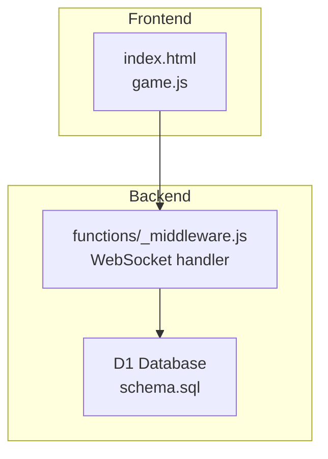
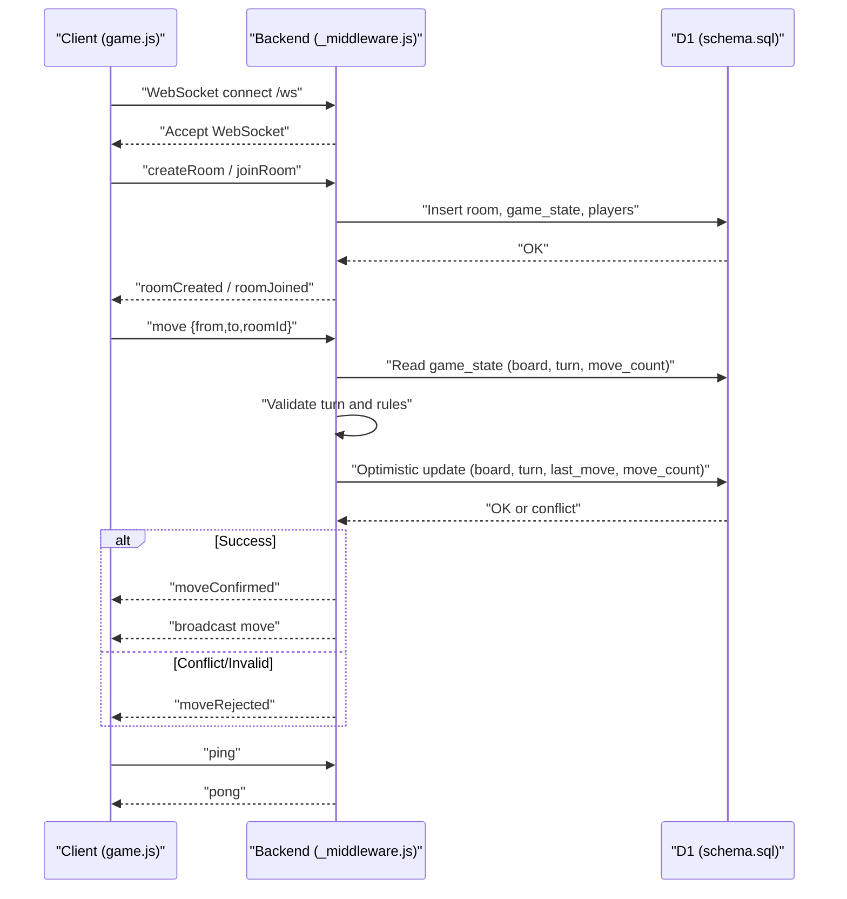
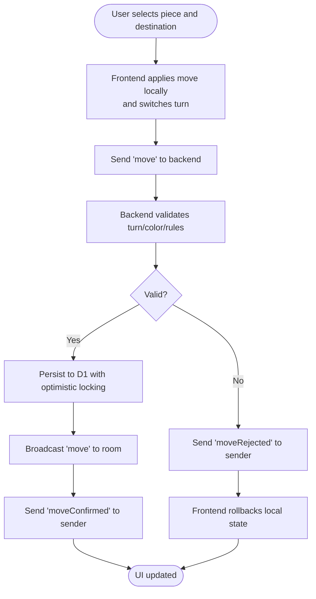
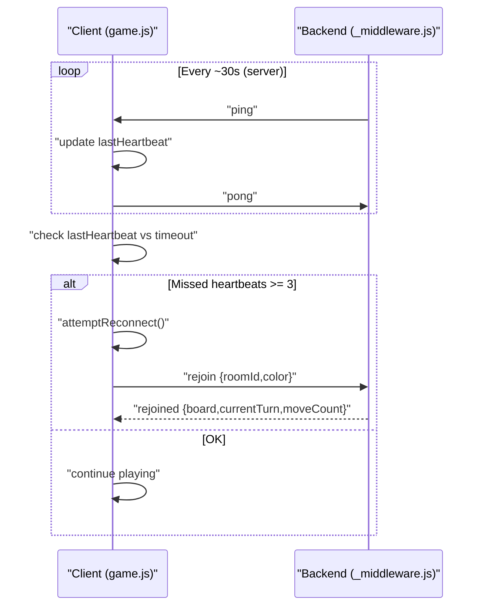
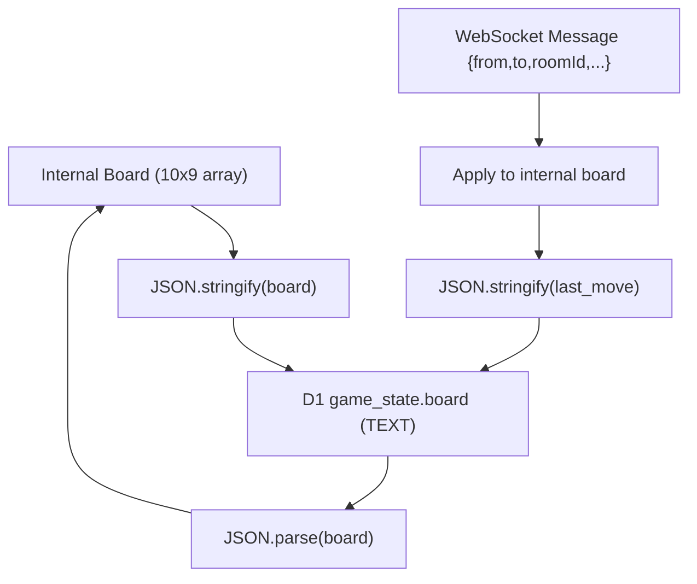
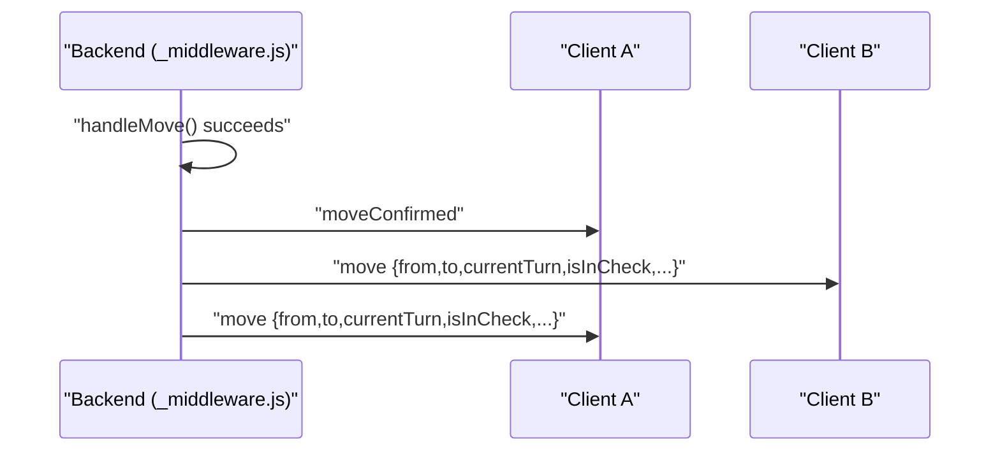
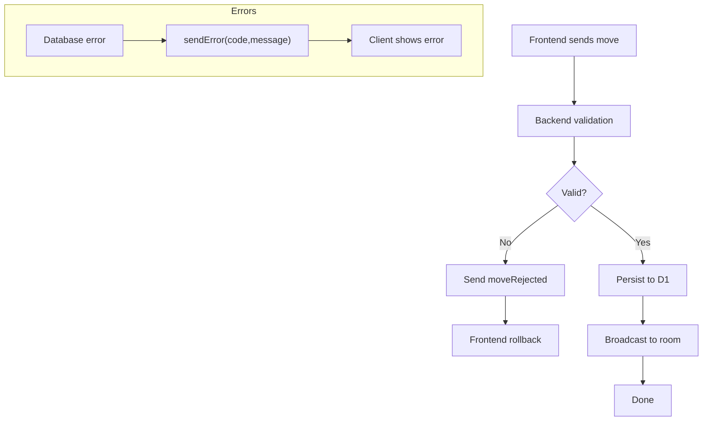
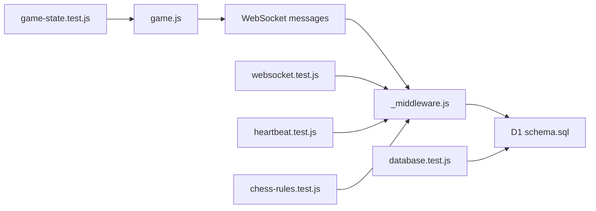

# Data Flow Patterns

<cite>
**Referenced Files in This Document**
- [README.md](file://README.md)
- [index.html](file://index.html)
- [game.js](file://game.js)
- [_middleware.js](file://functions/_middleware.js)
- [schema.sql](file://schema.sql)
- [websocket.test.js](file://tests/integration/websocket.test.js)
- [database.test.js](file://tests/integration/database.test.js)
- [heartbeat.test.js](file://tests/unit/heartbeat.test.js)
- [chess-rules.test.js](file://tests/unit/chess-rules.test.js)
- [game-state.test.js](file://tests/unit/game-state.test.js)
</cite>

## Table of Contents
1. [Introduction](#introduction)
2. [Project Structure](#project-structure)
3. [Core Components](#core-components)
4. [Architecture Overview](#architecture-overview)
5. [Detailed Component Analysis](#detailed-component-analysis)
6. [Dependency Analysis](#dependency-analysis)
7. [Performance Considerations](#performance-considerations)
8. [Troubleshooting Guide](#troubleshooting-guide)
9. [Conclusion](#conclusion)

## Introduction
This document explains the complete data flow for the Chinese Chess system, covering user input, WebSocket messaging, backend validation and persistence, and real-time broadcast to all room participants. It documents the optimistic update pattern used for immediate UI feedback, the heartbeat and reconnection mechanisms, data transformation between JSON and internal representations, and the broadcast pattern for synchronized updates. Error handling and rollback strategies for failed operations are also included.

## Project Structure
The system comprises:
- Frontend: HTML/CSS/JavaScript single-page app with a WebSocket client
- Backend: Cloudflare Pages Function handling WebSocket upgrades and game logic
- Database: Cloudflare D1 (SQLite) storing rooms, game state, and players
- Tests: Integration and unit tests validating WebSocket behavior, database operations, heartbeat, and chess rules

**Diagram sources**
- [index.html:1-58](file://index.html#L1-L58)
- [game.js:1-1319](file://game.js#L1-L1319)
- [_middleware.js:104-122](file://functions/_middleware.js#L104-L122)
- [schema.sql:1-42](file://schema.sql#L1-L42)

**Section sources**
- [README.md:1-187](file://README.md#L1-L187)
- [index.html:1-58](file://index.html#L1-L58)
- [schema.sql:1-42](file://schema.sql#L1-L42)

## Core Components
- Frontend client (game.js): Manages UI, user interactions, optimistic move application, heartbeat, polling, and reconnection
- Backend WebSocket handler (_middleware.js): Accepts WebSocket connections, manages rooms, validates moves, persists state, and broadcasts updates
- Database (D1): Stores rooms, game state, and players with indexes for performance
- Tests: Validate WebSocket behavior, database operations, heartbeat, and chess rules

Key responsibilities:
- Optimistic updates: Frontend applies moves immediately, backend confirms or rejects
- Heartbeat: Periodic ping/pong to monitor connectivity
- Broadcasting: Updates sent to all room participants
- Persistence: JSON-serialized board and metadata stored in D1
- Rollback: Frontend reverts invalid moves upon rejection

**Section sources**
- [game.js:319-398](file://game.js#L319-L398)
- [_middleware.js:252-683](file://functions/_middleware.js#L252-L683)
- [schema.sql:5-42](file://schema.sql#L5-L42)

## Architecture Overview
The system uses a WebSocket-based real-time architecture:
- Clients connect to /ws and exchange JSON messages
- Backend validates moves against chess rules and game state
- Successful moves are persisted to D1 with optimistic locking
- Updates are broadcast to all room participants
- Heartbeat ensures liveness and triggers reconnection on failure

**Diagram sources**
- [_middleware.js:131-185](file://functions/_middleware.js#L131-L185)
- [_middleware.js:242-276](file://functions/_middleware.js#L242-L276)
- [_middleware.js:282-351](file://functions/_middleware.js#L282-L351)
- [_middleware.js:353-443](file://functions/_middleware.js#L353-L443)
- [_middleware.js:522-683](file://functions/_middleware.js#L522-L683)
- [schema.sql:5-25](file://schema.sql#L5-L25)

## Detailed Component Analysis

### Optimistic Update Pattern
- Frontend applies move immediately to local board and switches turn
- Frontend sends move via WebSocket to backend
- Backend validates turn, piece ownership, and rules
- On success, backend persists with optimistic locking and broadcasts
- On rejection, backend sends moveRejected; frontend rolls back local state

**Diagram sources**
- [game.js:319-398](file://game.js#L319-L398)
- [_middleware.js:522-683](file://functions/_middleware.js#L522-L683)

**Section sources**
- [game.js:319-398](file://game.js#L319-L398)
- [_middleware.js:522-683](file://functions/_middleware.js#L522-L683)

### Heartbeat and Reconnection
- Backend sends ping periodically; expects pong within timeout threshold
- Client tracks last heartbeat and triggers reconnection after consecutive misses
- On disconnect, backend marks player as disconnected and notifies opponents
- Client attempts exponential backoff reconnection and resends rejoin request

**Diagram sources**
- [_middleware.js:191-225](file://functions/_middleware.js#L191-L225)
- [game.js:842-882](file://game.js#L842-L882)
- [_middleware.js:1086-1146](file://functions/_middleware.js#L1086-L1146)

**Section sources**
- [_middleware.js:191-225](file://functions/_middleware.js#L191-L225)
- [game.js:842-882](file://game.js#L842-L882)
- [_middleware.js:1213-1240](file://functions/_middleware.js#L1213-L1240)
- [heartbeat.test.js:117-145](file://tests/unit/heartbeat.test.js#L117-L145)

### Data Transformation: JSON ↔ Internal Representation
- Internal representation: 10x9 array of piece objects
- Persistence: Board serialized as JSON string in D1 game_state.board
- Messages: Frontend sends/receives JSON {type, payload}; backend parses and serializes for storage
- Move records: last_move stored as JSON with metadata

**Diagram sources**
- [_middleware.js:610-622](file://functions/_middleware.js#L610-L622)
- [_middleware.js:685-707](file://functions/_middleware.js#L685-L707)
- [game.js:369-378](file://game.js#L369-L378)

**Section sources**
- [_middleware.js:610-622](file://functions/_middleware.js#L610-L622)
- [_middleware.js:685-707](file://functions/_middleware.js#L685-L707)
- [game.js:369-378](file://game.js#L369-L378)

### Broadcast Pattern for Room Updates
- Backend maintains in-memory connections map per instance
- broadcastToRoom iterates connections in the same room and sends messages
- Excludes sender by ID to avoid self-broadcast
- Used for move notifications, game over, and player events

**Diagram sources**
- [_middleware.js:1242-1252](file://functions/_middleware.js#L1242-L1252)
- [_middleware.js:653-672](file://functions/_middleware.js#L653-L672)

**Section sources**
- [_middleware.js:1242-1252](file://functions/_middleware.js#L1242-L1252)
- [_middleware.js:653-672](file://functions/_middleware.js#L653-L672)

### Error Handling and Rollback
- Frontend rollback: Restores previous board, turn, and check state
- Backend rejection: Returns moveRejected with error details
- Database errors: sendError with structured error codes
- Stale room cleanup: Detects and removes rooms with no active players

**Diagram sources**
- [game.js:381-398](file://game.js#L381-L398)
- [_middleware.js:674-682](file://functions/_middleware.js#L674-L682)
- [_middleware.js:1254-1261](file://functions/_middleware.js#L1254-L1261)

**Section sources**
- [game.js:381-398](file://game.js#L381-L398)
- [_middleware.js:674-682](file://functions/_middleware.js#L674-L682)
- [_middleware.js:1254-1261](file://functions/_middleware.js#L1254-L1261)

## Dependency Analysis
- game.js depends on WebSocket APIs and local state; it communicates with backend via JSON messages
- _middleware.js depends on D1 bindings and WebSocketPair APIs; it orchestrates rooms, game logic, and broadcasting
- schema.sql defines the D1 schema and indexes used by backend queries
- Tests validate integration (WebSocket, database), heartbeat, and chess rules

**Diagram sources**
- [game.js:1-1319](file://game.js#L1-L1319)
- [_middleware.js:104-122](file://functions/_middleware.js#L104-L122)
- [schema.sql:1-42](file://schema.sql#L1-L42)
- [websocket.test.js:1-404](file://tests/integration/websocket.test.js#L1-L404)
- [database.test.js:1-371](file://tests/integration/database.test.js#L1-L371)
- [heartbeat.test.js:1-467](file://tests/unit/heartbeat.test.js#L1-L467)
- [chess-rules.test.js:1-670](file://tests/unit/chess-rules.test.js#L1-L670)
- [game-state.test.js:1-311](file://tests/unit/game-state.test.js#L1-L311)

**Section sources**
- [game.js:1-1319](file://game.js#L1-L1319)
- [_middleware.js:104-122](file://functions/_middleware.js#L104-L122)
- [schema.sql:1-42](file://schema.sql#L1-L42)
- [websocket.test.js:1-404](file://tests/integration/websocket.test.js#L1-L404)
- [database.test.js:1-371](file://tests/integration/database.test.js#L1-L371)
- [heartbeat.test.js:1-467](file://tests/unit/heartbeat.test.js#L1-L467)
- [chess-rules.test.js:1-670](file://tests/unit/chess-rules.test.js#L1-L670)
- [game-state.test.js:1-311](file://tests/unit/game-state.test.js#L1-L311)

## Performance Considerations
- Database indexes: rooms(name), rooms(status), players(room_id), game_state(updated_at) improve query performance
- Batch operations: Backend uses db.batch for atomic room creation
- Optimistic locking: move_count prevents concurrent move conflicts during persistence
- Polling fallback: Frontend polls for opponent presence and latest move updates when WebSocket is unavailable

[No sources needed since this section provides general guidance]

## Troubleshooting Guide
Common issues and remedies:
- Connection drops: Heartbeat detects missed pongs; client reconnects with exponential backoff; backend marks player disconnected
- Invalid move: Backend rejects with moveRejected; frontend rolls back local state
- Concurrent move conflicts: Optimistic locking checks move_count; if mismatch, backend rejects and suggests refreshing state
- Database errors: Backend responds with structured error codes; frontend displays user-friendly messages
- Stale rooms: Backend cleans up rooms with no active players

**Section sources**
- [game.js:810-836](file://game.js#L810-L836)
- [_middleware.js:619-634](file://functions/_middleware.js#L619-L634)
- [_middleware.js:1254-1261](file://functions/_middleware.js#L1254-L1261)
- [_middleware.js:479-516](file://functions/_middleware.js#L479-L516)

## Conclusion
The Chinese Chess system implements a robust real-time architecture with optimistic updates, reliable heartbeat monitoring, and comprehensive error handling. Frontend responsiveness is achieved through immediate UI updates while backend ensures correctness via validation, optimistic locking, and broadcast synchronization. The design balances user experience with data integrity, supported by D1 persistence and thorough test coverage.