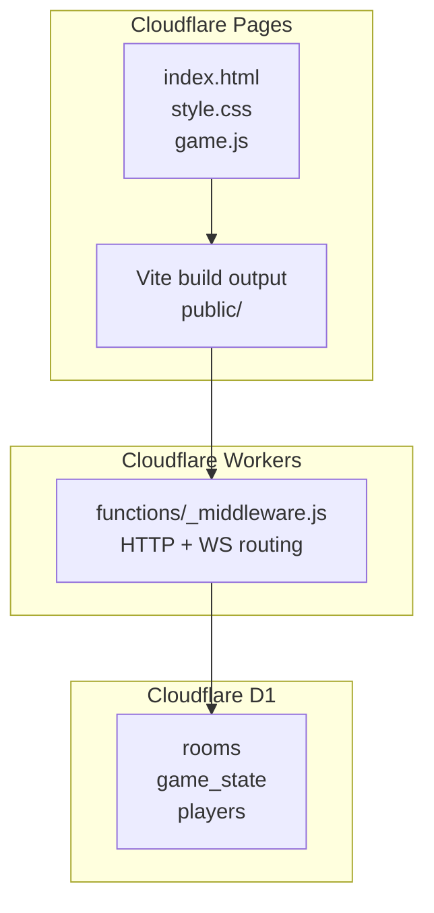
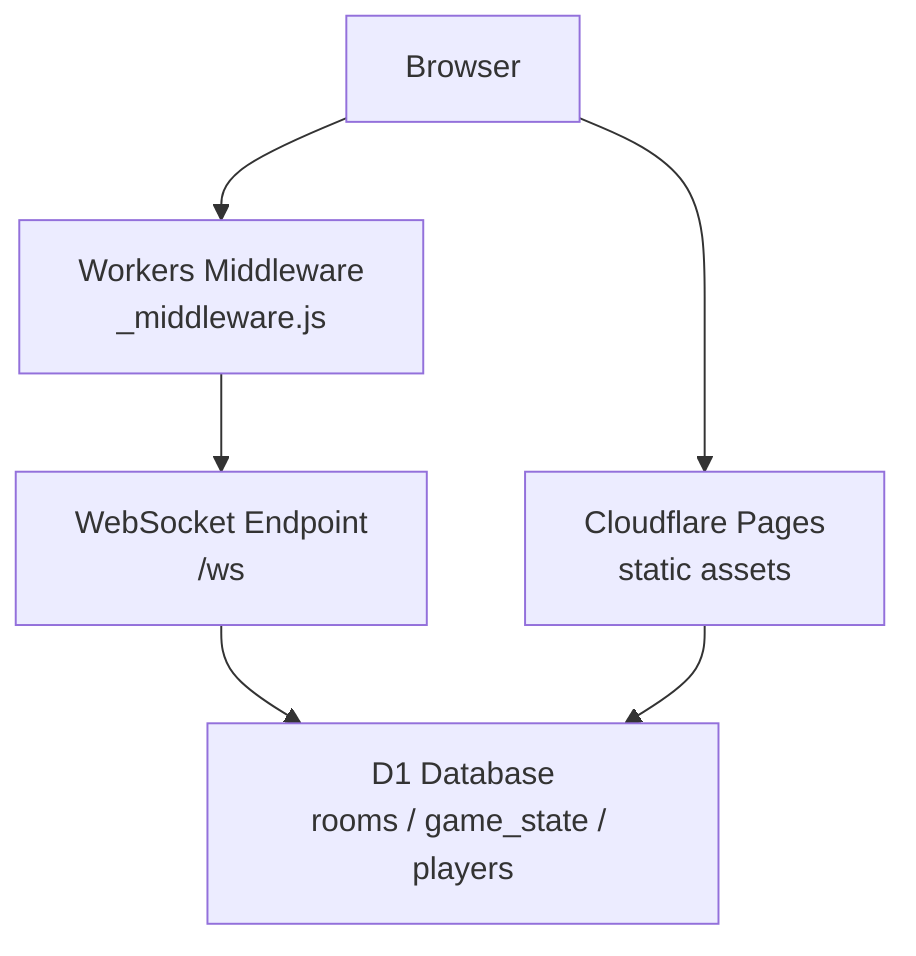
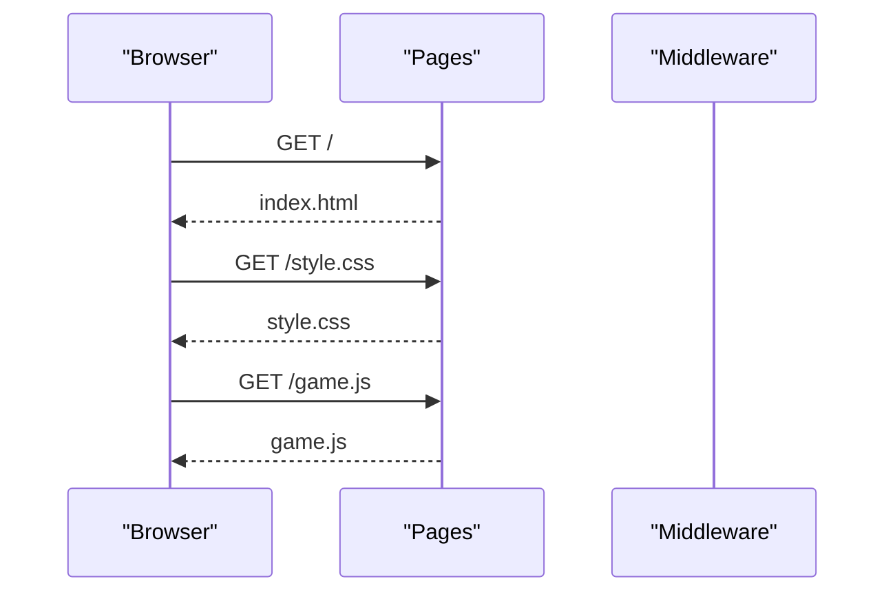
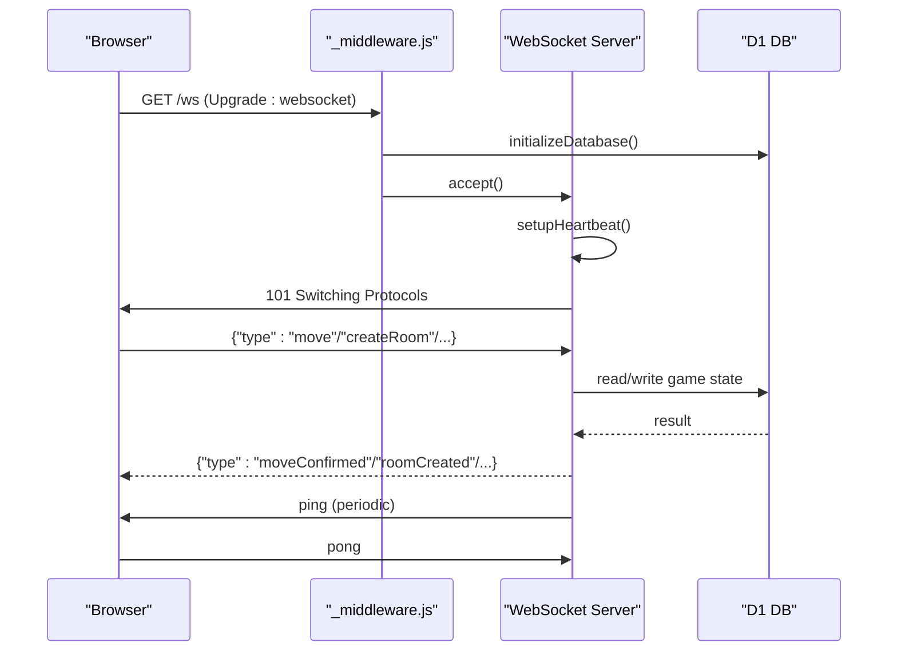
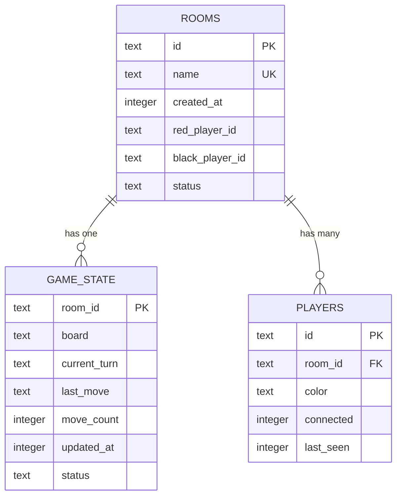
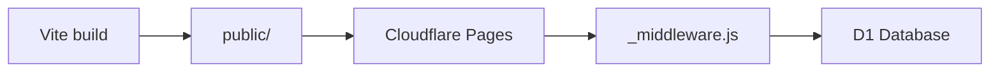

# Deployment Topology

<cite>
**Referenced Files in This Document**
- [wrangler.toml](file://wrangler.toml)
- [functions/_middleware.js](file://functions/_middleware.js)
- [schema.sql](file://schema.sql)
- [index.html](file://index.html)
- [style.css](file://style.css)
- [package.json](file://package.json)
- [vite.config.js](file://vite.config.js)
- [DEPLOYMENT.md](file://DEPLOYMENT.md)
- [SETUP_D1.md](file://SETUP_D1.md)
- [FIX_D1_BINDING.md](file://FIX_D1_BINDING.md)
</cite>

## Table of Contents
1. [Introduction](#introduction)
2. [Project Structure](#project-structure)
3. [Core Components](#core-components)
4. [Architecture Overview](#architecture-overview)
5. [Detailed Component Analysis](#detailed-component-analysis)
6. [Dependency Analysis](#dependency-analysis)
7. [Performance Considerations](#performance-considerations)
8. [Troubleshooting Guide](#troubleshooting-guide)
9. [Conclusion](#conclusion)
10. [Appendices](#appendices)

## Introduction
This document describes the deployment topology for the Chinese Chess system built on Cloudflare Pages and Cloudflare Workers. It explains how the middleware routes WebSocket connections and HTTP requests, how D1 database tables and relationships persist game state, how static assets are delivered via Pages, and how to configure environment bindings and secrets. It also covers scaling considerations for WebSocket connections and concurrent game sessions, and outlines monitoring and logging strategies for production.

## Project Structure
The project is organized into:
- Static frontend assets (HTML, CSS, JS) built to the public directory
- Cloudflare Pages configuration and D1 database binding
- Edge middleware that handles HTTP and WebSocket traffic
- Database schema defining rooms, game state, and players

**Diagram sources**
- [index.html](file://index.html)
- [style.css](file://style.css)
- [vite.config.js](file://vite.config.js)
- [wrangler.toml](file://wrangler.toml)
- [functions/_middleware.js](file://functions/_middleware.js)
- [schema.sql](file://schema.sql)

**Section sources**
- [vite.config.js](file://vite.config.js)
- [wrangler.toml](file://wrangler.toml)

## Core Components
- Cloudflare Pages: Hosts static assets and serves the game frontend. The build output directory is public/, and the Pages configuration is defined in wrangler.toml.
- Cloudflare Workers Middleware: The functions/_middleware.js file handles incoming HTTP requests and WebSocket upgrades. It initializes the D1 database on each request and manages WebSocket connections and heartbeats.
- D1 Database: The schema.sql defines three tables (rooms, game_state, players) with foreign keys and indexes. The middleware uses a DB binding to access the database.
- Frontend Assets: index.html links to style.css and game.js. These files are served statically by Pages.

**Section sources**
- [wrangler.toml](file://wrangler.toml)
- [functions/_middleware.js](file://functions/_middleware.js)
- [schema.sql](file://schema.sql)
- [index.html](file://index.html)
- [style.css](file://style.css)

## Architecture Overview
The deployment architecture combines static hosting with edge routing and persistent storage:

**Diagram sources**
- [wrangler.toml](file://wrangler.toml)
- [functions/_middleware.js](file://functions/_middleware.js)
- [schema.sql](file://schema.sql)

## Detailed Component Analysis

### Cloudflare Pages and Static Delivery
- Build configuration: Vite builds to public/. The Pages output directory is configured accordingly.
- Asset serving: index.html references style.css and game.js. These are served as static assets by Pages.
- Routing: Non-/ws requests pass through the middleware stack and are served as static assets by Pages.

**Diagram sources**
- [index.html](file://index.html)
- [style.css](file://style.css)
- [vite.config.js](file://vite.config.js)

**Section sources**
- [vite.config.js](file://vite.config.js)
- [index.html](file://index.html)

### Middleware Routing and WebSocket Handling
- HTTP requests: The middleware initializes the D1 database and forwards non-/ws requests to Pages for static asset serving.
- WebSocket upgrade: Requests to /ws are upgraded to WebSocketPair connections. Heartbeats are managed per connection, and messages are parsed and dispatched to handlers.

**Diagram sources**
- [functions/_middleware.js](file://functions/_middleware.js)

**Section sources**
- [functions/_middleware.js](file://functions/_middleware.js)

### D1 Database Integration and Schema
- Binding: The wrangler.toml file binds a D1 database to the variable DB.
- Initialization: The middleware attempts to initialize tables and indexes on each request if the DB binding exists.
- Schema: The schema defines:
  - rooms: room metadata and player identifiers
  - game_state: board state, turn, last move, counters, timestamps
  - players: connection identifiers, colors, connectivity, and timestamps
- Relationships: game_state.room_id and players.room_id reference rooms.id with cascade delete.

**Diagram sources**
- [schema.sql](file://schema.sql)

**Section sources**
- [wrangler.toml](file://wrangler.toml)
- [functions/_middleware.js](file://functions/_middleware.js)
- [schema.sql](file://schema.sql)

### Environment Configuration and Secrets
- D1 binding: Configure the DB binding in wrangler.toml and ensure it is bound in the Pages Functions settings.
- Scripts: package.json includes commands for local development with D1 and deploying via Wrangler.
- Secrets: The project does not currently define environment variables in wrangler.toml. For production, consider adding environment variables for API keys or feature flags via the Cloudflare dashboard or CLI.

**Section sources**
- [wrangler.toml](file://wrangler.toml)
- [package.json](file://package.json)
- [FIX_D1_BINDING.md](file://FIX_D1_BINDING.md)

### Scaling Considerations for WebSocket and Games
- In-memory connections: The middleware maintains an in-memory Map of WebSocket connections per instance. This is suitable for development and light usage but does not persist across instances.
- Recommendations for production:
  - Use Durable Objects for stateful per-room sessions to ensure persistence and scalability across instances.
  - Consider rate limiting and connection caps to manage resource usage.
  - Monitor WebSocket connection counts and memory usage per instance.

**Section sources**
- [functions/_middleware.js](file://functions/_middleware.js)
- [DEPLOYMENT.md](file://DEPLOYMENT.md)

## Dependency Analysis
The deployment depends on:
- Pages for static asset delivery
- Workers Middleware for routing and WebSocket handling
- D1 for persistent game state
- Vite for building static assets

**Diagram sources**
- [vite.config.js](file://vite.config.js)
- [wrangler.toml](file://wrangler.toml)
- [functions/_middleware.js](file://functions/_middleware.js)
- [schema.sql](file://schema.sql)

**Section sources**
- [vite.config.js](file://vite.config.js)
- [wrangler.toml](file://wrangler.toml)

## Performance Considerations
- Database writes: Optimistic locking with move_count reduces conflicts during concurrent moves.
- WebSocket latency: Heartbeats ensure liveness; broadcasting occurs after successful database updates.
- Static delivery: Pages delivers index.html, CSS, and JS efficiently from edge locations.
- Recommendations:
  - Use Durable Objects for stateful rooms to avoid in-memory limitations.
  - Add indexes and consider partitioning strategies if rooms grow large.
  - Monitor database query times and WebSocket connection metrics.

[No sources needed since this section provides general guidance]

## Troubleshooting Guide
Common issues and resolutions:
- Database not configured: Ensure the D1 binding is configured in Pages Functions settings and that the binding name matches DB.
- WebSocket connection fails: Verify the /ws route is handled by the middleware and that the upgrade header is correct.
- Build failures: Confirm the build command and output directory match the Pages configuration.
- Room creation/join errors: Check database initialization and that schema.sql was executed.

**Section sources**
- [FIX_D1_BINDING.md](file://FIX_D1_BINDING.md)
- [DEPLOYMENT.md](file://DEPLOYMENT.md)
- [SETUP_D1.md](file://SETUP_D1.md)

## Conclusion
The Chinese Chess system leverages Cloudflare Pages for static delivery, Workers Middleware for HTTP and WebSocket routing, and D1 for persistent game state. For production, bind the D1 database correctly, consider Durable Objects for scalable stateful sessions, and monitor logs and analytics to maintain reliability and performance.

[No sources needed since this section summarizes without analyzing specific files]

## Appendices

### Environment and Secrets Management
- D1 binding: Configure in wrangler.toml and bind in Pages Functions settings.
- Scripts: Use package.json scripts for local development and deployment.
- Optional environment variables: Add via Cloudflare dashboard or CLI for API keys and feature flags.

**Section sources**
- [wrangler.toml](file://wrangler.toml)
- [package.json](file://package.json)
- [FIX_D1_BINDING.md](file://FIX_D1_BINDING.md)

### Monitoring and Logging
- Use Cloudflare Dashboard to review analytics and logs for Workers and Pages.
- Enable Web Analytics to track real users.
- Monitor WebSocket connection drops and database query performance.

**Section sources**
- [DEPLOYMENT.md](file://DEPLOYMENT.md)