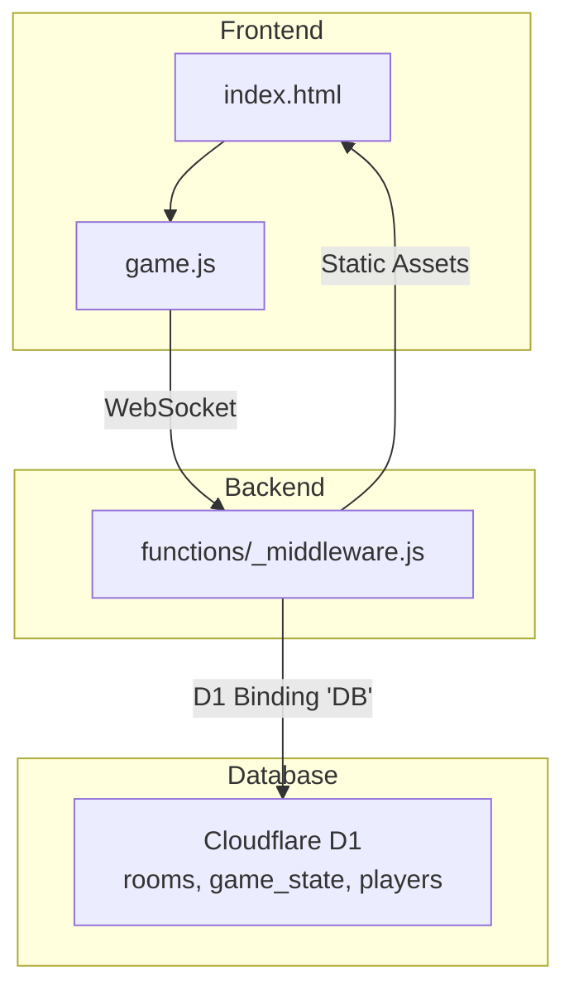
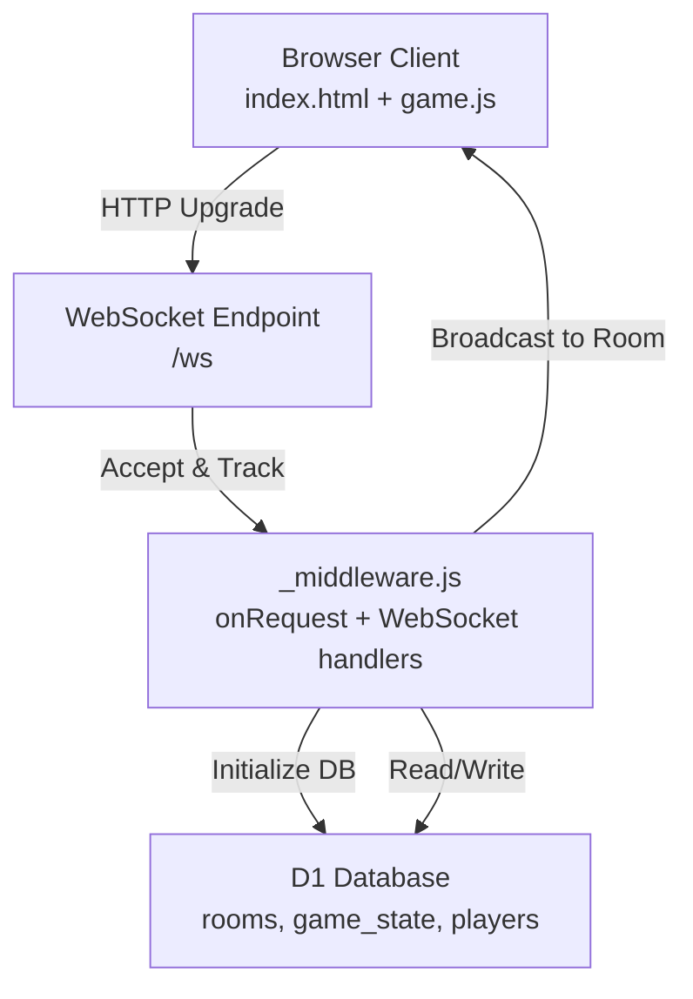
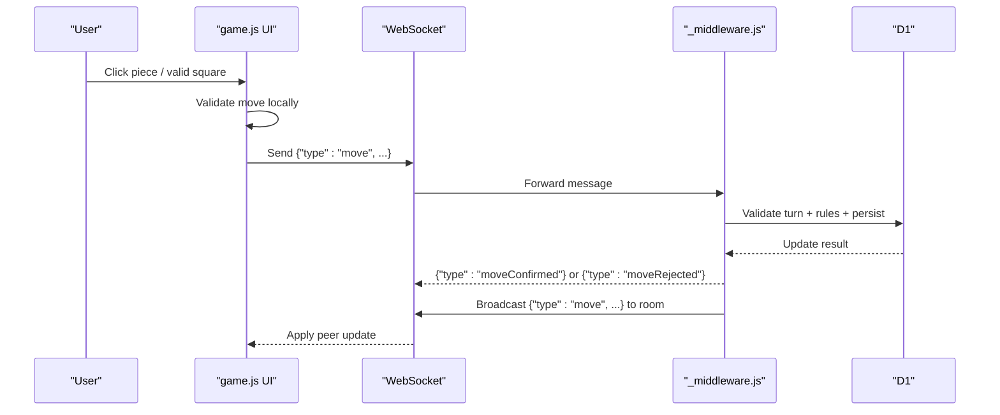
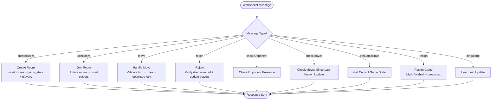
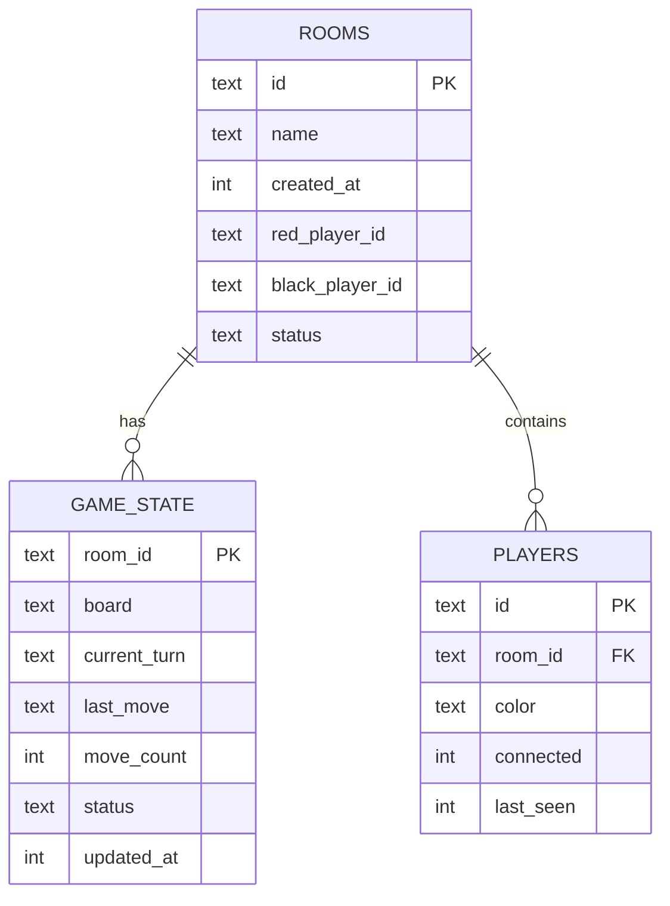
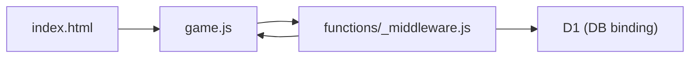

# System Overview

<cite>
**Referenced Files in This Document**
- [README.md](file://README.md)
- [package.json](file://package.json)
- [index.html](file://index.html)
- [game.js](file://game.js)
- [schema.sql](file://schema.sql)
- [wrangler.toml](file://wrangler.toml)
- [_middleware.js](file://functions/_middleware.js)
</cite>

## Table of Contents
1. [Introduction](#introduction)
2. [Project Structure](#project-structure)
3. [Core Components](#core-components)
4. [Architecture Overview](#architecture-overview)
5. [Detailed Component Analysis](#detailed-component-analysis)
6. [Dependency Analysis](#dependency-analysis)
7. [Performance Considerations](#performance-considerations)
8. [Troubleshooting Guide](#troubleshooting-guide)
9. [Conclusion](#conclusion)

## Introduction
This document provides a comprehensive system overview of the Chinese Chess Online platform. It explains the three-tier architecture separating frontend (HTML/CSS/JavaScript), backend (Cloudflare Workers via Pages Functions), and database (Cloudflare D1). It describes the real-time multiplayer architecture using WebSocket communication, the cloud-native deployment model leveraging Cloudflare Pages for static hosting and D1 for database operations, and the stateless server design principles that enable horizontal scaling for multiplayer gaming scenarios. The document also outlines system boundaries, component responsibilities, and the high-level data flow from user interactions through WebSocket messages to database persistence.

## Project Structure
The repository follows a clear separation of concerns:
- Frontend assets and logic: index.html, style.css, and game.js
- Backend logic: functions/_middleware.js implementing WebSocket handling and game logic
- Database schema: schema.sql defining rooms, game_state, and players tables
- Deployment configuration: wrangler.toml for Pages and D1 bindings
- Scripts and metadata: package.json, README.md, and deployment-related notes

**Diagram sources**
- [index.html:1-58](file://index.html#L1-L58)
- [game.js:1-800](file://game.js#L1-L800)
- [_middleware.js:104-122](file://functions/_middleware.js#L104-L122)
- [schema.sql:1-42](file://schema.sql#L1-L42)
- [wrangler.toml:14-17](file://wrangler.toml#L14-L17)

**Section sources**
- [README.md:162-175](file://README.md#L162-L175)
- [package.json:1-28](file://package.json#L1-28)
- [wrangler.toml:1-33](file://wrangler.toml#L1-L33)

## Core Components
- Frontend (index.html + game.js): Provides the lobby and game UI, handles user interactions, renders the board, validates moves locally, and communicates with the backend via WebSocket.
- Backend (_middleware.js): Implements WebSocket upgrade handling, connection lifecycle management, heartbeat, room management, game move validation and persistence, broadcasting updates, and graceful disconnection handling.
- Database (D1): Stores rooms, game_state, and players with appropriate indexes for performance and consistency.

Responsibilities:
- Frontend: UI rendering, user input handling, optimistic move application, WebSocket messaging, and reconnection logic.
- Backend: WebSocket connection management, message routing, game rule enforcement, database transactions, and broadcasting to room peers.
- Database: Persistent storage of room metadata, game state, and player presence with atomic updates and optimistic concurrency.

**Section sources**
- [index.html:10-58](file://index.html#L10-L58)
- [game.js:4-51](file://game.js#L4-L51)
- [_middleware.js:128-185](file://functions/_middleware.js#L128-L185)
- [schema.sql:5-42](file://schema.sql#L5-L42)

## Architecture Overview
The system is designed as a stateless server that scales horizontally. The backend is implemented as a Cloudflare Pages Function that upgrades HTTP requests to WebSocket connections. The frontend is served statically from Cloudflare Pages. D1 provides a managed SQLite-compatible database bound to the worker under the DB binding.

**Diagram sources**
- [index.html:55](file://index.html#L55)
- [game.js:740-800](file://game.js#L740-L800)
- [_middleware.js:115-122](file://functions/_middleware.js#L115-L122)
- [_middleware.js:131-185](file://functions/_middleware.js#L131-L185)
- [wrangler.toml:14-17](file://wrangler.toml#L14-L17)

## Detailed Component Analysis

### Frontend: index.html and game.js
- index.html defines the lobby and game screens, WebSocket connection status indicators, and the chess board container.
- game.js manages:
  - Game state (board, current player, selected piece, valid moves)
  - UI rendering and event listeners
  - Local move validation and optimistic rendering
  - WebSocket lifecycle (connect, reconnect, heartbeat, error handling)
  - Broadcasting move actions to the backend and applying updates received from peers

**Diagram sources**
- [index.html:10-58](file://index.html#L10-L58)
- [game.js:283-379](file://game.js#L283-L379)
- [_middleware.js:252-683](file://functions/_middleware.js#L252-L683)

**Section sources**
- [index.html:10-58](file://index.html#L10-L58)
- [game.js:4-51](file://game.js#L4-L51)
- [game.js:283-379](file://game.js#L283-L379)

### Backend: _middleware.js
- onRequest: Initializes D1 schema safely and serves static assets; upgrades to WebSocket for /ws.
- WebSocket handling: Accepts connections, tracks per-instance connections, sets up heartbeat timers, and routes messages by type.
- Room management: createRoom, joinRoom, leaveRoom, cleanup stale rooms.
- Game logic: handleMove with optimistic locking using move_count, broadcasting updates, and game over conditions.
- Utility: handleRejoin, handleCheckOpponent, handleCheckMoves, handleDisconnect, broadcastToRoom, and helpers for chess rules.

**Diagram sources**
- [_middleware.js:242-276](file://functions/_middleware.js#L242-L276)
- [_middleware.js:282-351](file://functions/_middleware.js#L282-L351)
- [_middleware.js:353-443](file://functions/_middleware.js#L353-L443)
- [_middleware.js:522-683](file://functions/_middleware.js#L522-L683)
- [_middleware.js:1086-1146](file://functions/_middleware.js#L1086-L1146)
- [_middleware.js:1148-1211](file://functions/_middleware.js#L1148-L1211)
- [_middleware.js:685-707](file://functions/_middleware.js#L685-L707)
- [_middleware.js:709-749](file://functions/_middleware.js#L709-L749)
- [_middleware.js:238-240](file://functions/_middleware.js#L238-L240)

**Section sources**
- [_middleware.js:104-122](file://functions/_middleware.js#L104-L122)
- [_middleware.js:131-185](file://functions/_middleware.js#L131-L185)
- [_middleware.js:231-276](file://functions/_middleware.js#L231-L276)
- [_middleware.js:522-683](file://functions/_middleware.js#L522-L683)

### Database: schema.sql and wrangler.toml
- schema.sql defines:
  - rooms: identifiers, name, timestamps, player assignments, and status
  - game_state: board JSON, current_turn, last_move JSON, move_count, status, updated_at
  - players: id, room_id, color, connected flag, last_seen
  - indexes for performance on name, status, room_id, and updated_at
- wrangler.toml binds D1 database to the worker under binding DB and configures Pages build output.

**Diagram sources**
- [schema.sql:5-42](file://schema.sql#L5-L42)

**Section sources**
- [schema.sql:5-42](file://schema.sql#L5-L42)
- [wrangler.toml:14-17](file://wrangler.toml#L14-L17)

## Dependency Analysis
- Frontend depends on:
  - game.js for logic and WebSocket connectivity
  - index.html for DOM structure and styles
- Backend depends on:
  - _middleware.js for WebSocket handling and game logic
  - D1 for persistent state
- Database depends on:
  - schema.sql for table definitions and indexes
  - wrangler.toml for binding configuration

**Diagram sources**
- [index.html:55](file://index.html#L55)
- [game.js:740-800](file://game.js#L740-L800)
- [_middleware.js:115-122](file://functions/_middleware.js#L115-L122)
- [_middleware.js:131-185](file://functions/_middleware.js#L131-L185)
- [wrangler.toml:14-17](file://wrangler.toml#L14-L17)

**Section sources**
- [package.json:7-18](file://package.json#L7-L18)
- [wrangler.toml:14-17](file://wrangler.toml#L14-L17)

## Performance Considerations
- Optimistic concurrency: The backend uses move_count to detect concurrent moves and rejects conflicting updates atomically.
- Indexes: Strategic indexes on rooms(name), rooms(status), players(room_id), and game_state(updated_at) improve query performance.
- Heartbeat: Periodic ping/pong keeps connections alive and enables timely cleanup of stale sessions.
- Stateless design: No session affinity is required; workers can scale horizontally without shared state.

[No sources needed since this section provides general guidance]

## Troubleshooting Guide
Common areas to inspect:
- WebSocket connectivity: Verify frontend attempts to connect to the correct host and protocol, and that the backend upgrades /ws.
- Database binding: Ensure the D1 binding DB is configured in wrangler.toml and that initialization runs on each request.
- Room lifecycle: Check for stale room cleanup and proper broadcasting on join/leave/rejoin.
- Move conflicts: Investigate optimistic lock failures and peer re-synchronization via move polling.

**Section sources**
- [game.js:740-800](file://game.js#L740-L800)
- [_middleware.js:115-122](file://functions/_middleware.js#L115-L122)
- [_middleware.js:191-225](file://functions/_middleware.js#L191-L225)
- [_middleware.js:619-634](file://functions/_middleware.js#L619-L634)

## Conclusion
The Chinese Chess Online system is architected for scalability and reliability using a stateless backend, real-time WebSocket communication, and a managed database. The frontend is minimal and responsive, delegating game logic and persistence to the backend and D1. The design supports horizontal scaling, robust reconnection, and efficient multiplayer interactions through careful use of optimistic concurrency and targeted database indexing.