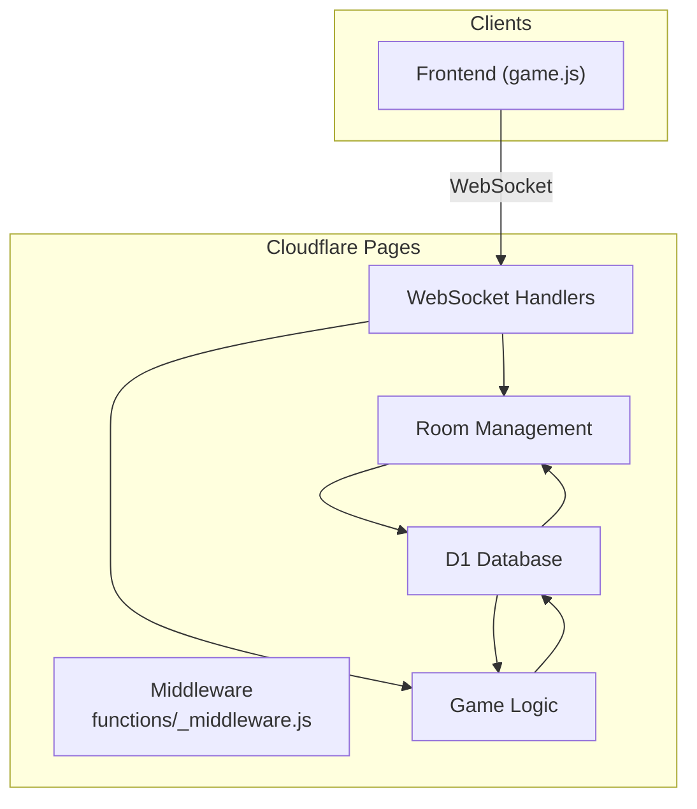
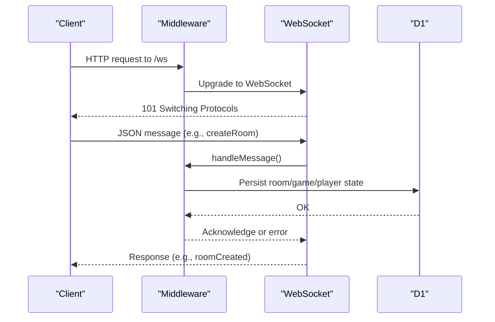
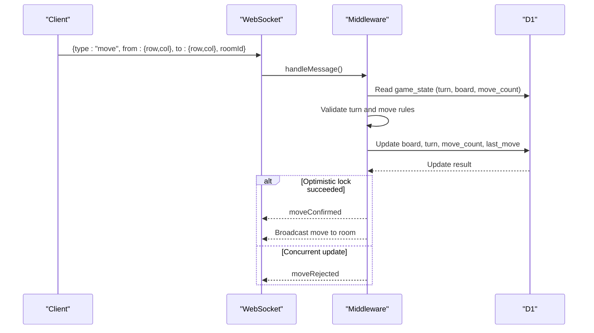
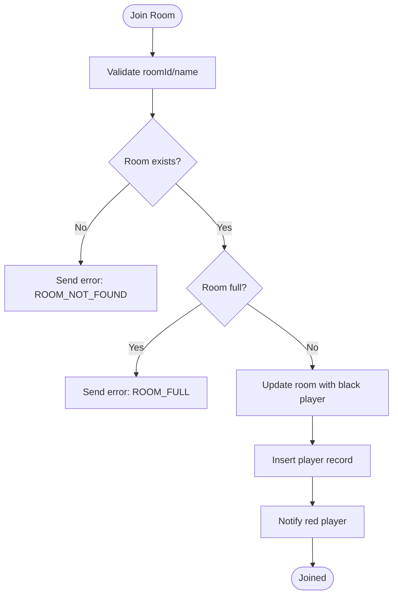
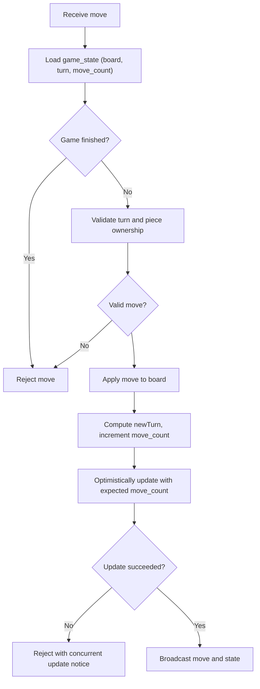
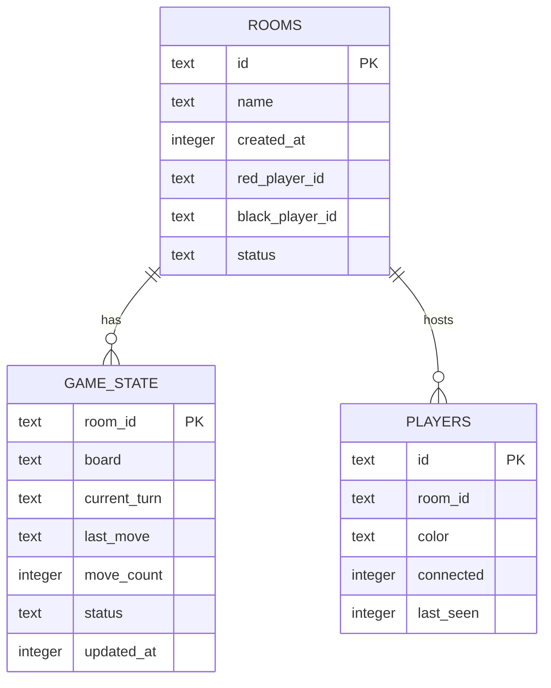
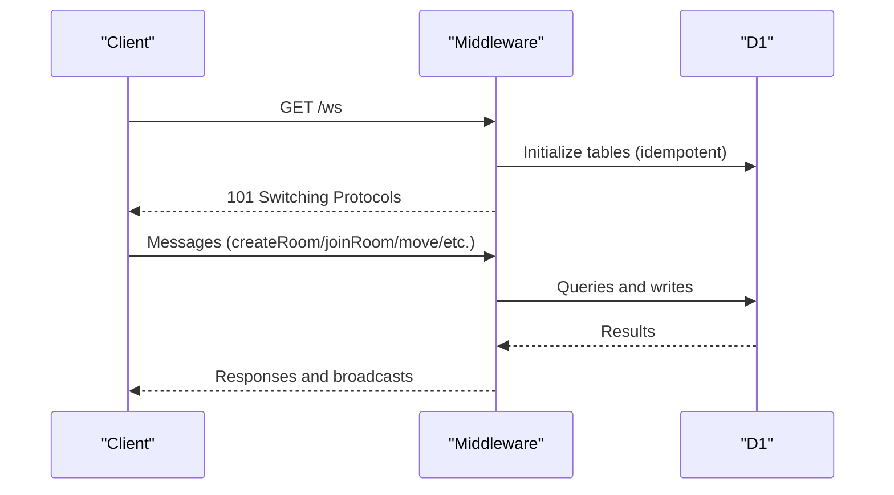
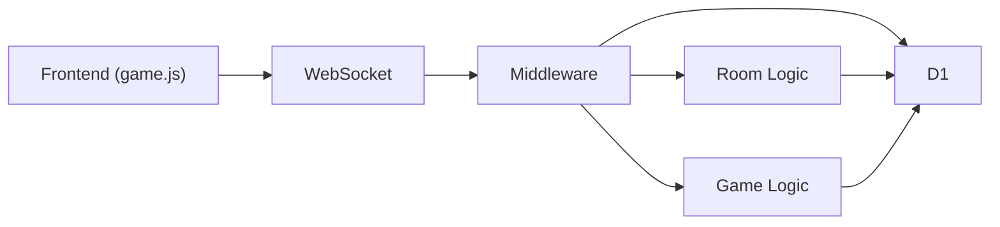

# Backend Services

<cite>
**Referenced Files in This Document**
- [functions/_middleware.js](file://functions/_middleware.js)
- [game.js](file://game.js)
- [schema.sql](file://schema.sql)
- [wrangler.toml](file://wrangler.toml)
- [README.md](file://README.md)
- [tests/integration/websocket.test.js](file://tests/integration/websocket.test.js)
- [tests/integration/database.test.js](file://tests/integration/database.test.js)
- [tests/unit/chess-rules.test.js](file://tests/unit/chess-rules.test.js)
- [tests/setup.js](file://tests/setup.js)
</cite>

## Table of Contents
1. [Introduction](#introduction)
2. [Project Structure](#project-structure)
3. [Core Components](#core-components)
4. [Architecture Overview](#architecture-overview)
5. [Detailed Component Analysis](#detailed-component-analysis)
6. [Dependency Analysis](#dependency-analysis)
7. [Performance Considerations](#performance-considerations)
8. [Troubleshooting Guide](#troubleshooting-guide)
9. [Conclusion](#conclusion)
10. [Appendices](#appendices)

## Introduction
This document describes the backend services powering the Cloudflare Workers-based Chinese Chess implementation. It covers the WebSocket server, room management, game logic, database integration with D1, middleware and request processing, and operational guidance for performance and scalability.

## Project Structure
The backend is implemented as a Cloudflare Pages Functions middleware that handles:
- WebSocket upgrade and message routing
- Room lifecycle (creation, joining, leaving)
- Game state persistence and optimistic concurrency
- Chess rules validation and move enforcement
- Heartbeat and disconnection handling
- Broadcasting updates to room participants

**Diagram sources**
- [functions/_middleware.js:104-122](file://functions/_middleware.js#L104-L122)
- [functions/_middleware.js:131-185](file://functions/_middleware.js#L131-L185)
- [functions/_middleware.js:282-351](file://functions/_middleware.js#L282-L351)
- [functions/_middleware.js:522-683](file://functions/_middleware.js#L522-L683)
- [schema.sql:6-42](file://schema.sql#L6-L42)

**Section sources**
- [README.md:162-175](file://README.md#L162-L175)
- [wrangler.toml:14-17](file://wrangler.toml#L14-L17)

## Core Components
- Middleware and WebSocket server: Handles upgrades, message parsing, heartbeat, and dispatches to handlers.
- Room management: Creates rooms, joins players, tracks presence, and cleans up stale rooms.
- Game logic: Validates moves, enforces turn order, detects check/checkmate, persists state with optimistic locking.
- Database integration: D1-backed schema, batch operations, and indexes for performance.
- Frontend integration: WebSocket protocol and reconnection logic.

**Section sources**
- [functions/_middleware.js:104-122](file://functions/_middleware.js#L104-L122)
- [functions/_middleware.js:282-351](file://functions/_middleware.js#L282-L351)
- [functions/_middleware.js:522-683](file://functions/_middleware.js#L522-L683)
- [schema.sql:6-42](file://schema.sql#L6-L42)

## Architecture Overview
The backend is a single-file middleware that:
- Initializes D1 tables on every request
- Upgrades HTTP requests to WebSocket
- Maintains an in-memory connection registry per instance
- Routes messages to room/game handlers
- Persists state to D1 and broadcasts updates

**Diagram sources**
- [functions/_middleware.js:104-122](file://functions/_middleware.js#L104-L122)
- [functions/_middleware.js:131-185](file://functions/_middleware.js#L131-L185)
- [functions/_middleware.js:231-276](file://functions/_middleware.js#L231-L276)

## Detailed Component Analysis

### WebSocket Server and Message Protocol
- Upgrade handling: Validates Upgrade header and accepts WebSocketPair.
- Heartbeat: Periodic ping/pong with timeouts; disconnects idle clients.
- Message routing: Dispatches to handlers based on message type.
- Error handling: Sends structured error responses with codes and messages.

Supported message types (as exercised by tests and implemented handlers):
- createRoom: Create a new room with a unique name.
- joinRoom: Join an existing room by ID or name.
- leaveRoom: Leave a room and clean up if empty.
- move: Submit a move with from/to coordinates; validated and persisted.
- ping/pong: Heartbeat exchange.
- rejoin: Reconnect to a room after disconnection.
- checkOpponent: Query opponent presence.
- checkMoves: Poll for last move updates.
- getGameState: Fetch current board state.
- resign: Resign the game.

**Diagram sources**
- [functions/_middleware.js:231-276](file://functions/_middleware.js#L231-L276)
- [functions/_middleware.js:522-683](file://functions/_middleware.js#L522-L683)

**Section sources**
- [functions/_middleware.js:131-185](file://functions/_middleware.js#L131-L185)
- [functions/_middleware.js:191-225](file://functions/_middleware.js#L191-L225)
- [functions/_middleware.js:231-276](file://functions/_middleware.js#L231-L276)
- [tests/integration/websocket.test.js:69-125](file://tests/integration/websocket.test.js#L69-L125)

### Room Management
- Creation: Generates room ID, initializes board, sets first player as red, inserts records for rooms, game_state, and players.
- Joining: Assigns second player as black, updates room status to playing, notifies opponent.
- Leaving: Marks player disconnected, notifies opponent, cleans up empty rooms.
- Stale room detection: Removes rooms with no players or only disconnected/inactive players.

**Diagram sources**
- [functions/_middleware.js:353-443](file://functions/_middleware.js#L353-L443)

**Section sources**
- [functions/_middleware.js:282-351](file://functions/_middleware.js#L282-L351)
- [functions/_middleware.js:353-443](file://functions/_middleware.js#L353-L443)
- [functions/_middleware.js:479-516](file://functions/_middleware.js#L479-L516)

### Game Logic and State Persistence
- Turn validation: Ensures the moving piece color matches the current turn.
- Move validation: Computes valid moves per piece and filters out moves that leave the king in check.
- Persistence: Uses optimistic locking via move_count to prevent lost updates.
- Broadcasting: After a successful move, broadcasts the move and game state to the room.

**Diagram sources**
- [functions/_middleware.js:522-683](file://functions/_middleware.js#L522-L683)

**Section sources**
- [functions/_middleware.js:522-683](file://functions/_middleware.js#L522-L683)
- [functions/_middleware.js:755-789](file://functions/_middleware.js#L755-L789)
- [tests/unit/chess-rules.test.js:57-322](file://tests/unit/chess-rules.test.js#L57-L322)

### Database Integration (D1)
- Schema: rooms, game_state, players with foreign keys and indexes.
- Batch operations: Used for atomic room creation and cleanup.
- Indexes: Improve lookups by name/status and timestamps.
- Optimistic locking: move_count field ensures concurrent move safety.

**Diagram sources**
- [schema.sql:6-42](file://schema.sql#L6-L42)

**Section sources**
- [schema.sql:6-42](file://schema.sql#L6-L42)
- [functions/_middleware.js:322-329](file://functions/_middleware.js#L322-L329)
- [functions/_middleware.js:499-505](file://functions/_middleware.js#L499-L505)
- [functions/_middleware.js:619-634](file://functions/_middleware.js#L619-L634)

### Middleware and Request Processing Pipeline
- onRequest: Initializes D1, serves static files, and routes WebSocket upgrades.
- Connection lifecycle: Tracks connections, heartbeats, and cleanup on close.
- Broadcasting: Sends messages to all room participants except the sender.

**Diagram sources**
- [functions/_middleware.js:104-122](file://functions/_middleware.js#L104-L122)
- [functions/_middleware.js:1213-1240](file://functions/_middleware.js#L1213-L1240)

**Section sources**
- [functions/_middleware.js:104-122](file://functions/_middleware.js#L104-L122)
- [functions/_middleware.js:1213-1240](file://functions/_middleware.js#L1213-L1240)

## Dependency Analysis
- Middleware depends on D1 for persistence and on in-memory maps for connection tracking.
- Room and game logic depend on D1 for state and on chess rules for validation.
- Frontend depends on WebSocket protocol and reconnection logic.

**Diagram sources**
- [functions/_middleware.js:104-122](file://functions/_middleware.js#L104-L122)
- [functions/_middleware.js:282-351](file://functions/_middleware.js#L282-L351)
- [functions/_middleware.js:522-683](file://functions/_middleware.js#L522-L683)

**Section sources**
- [functions/_middleware.js:104-122](file://functions/_middleware.js#L104-L122)
- [functions/_middleware.js:282-351](file://functions/_middleware.js#L282-L351)
- [functions/_middleware.js:522-683](file://functions/_middleware.js#L522-L683)

## Performance Considerations
- Connection model: Uses per-instance in-memory connections map; consider scaling across instances and using a shared pub/sub or external state store for multi-instance deployments.
- Database batching: Uses batch operations for room creation and cleanup to reduce round-trips.
- Indexes: Existing indexes on rooms(name), rooms(status), players(room_id), and game_state(updated_at) improve query performance.
- Optimistic locking: move_count prevents lost updates under contention.
- Heartbeat: Prevents resource leaks from idle connections.

[No sources needed since this section provides general guidance]

## Troubleshooting Guide
Common error categories and likely causes:
- Unknown error, invalid message, unknown message type: Parsing or protocol mismatch.
- Database not configured, database error, initialization failed: D1 binding missing or schema not initialized.
- Room not found, room full, room name exists, room creation failed: Room lifecycle issues.
- Not in room, not your turn, invalid move, game over, piece not found: Game state or validation errors.
- Connection failed, rejoin failed: Disconnection/reconnection or stale room conditions.

Operational checks:
- Verify D1 binding in configuration and that tables exist.
- Ensure WebSocket upgrade succeeds and heartbeat pings/pongs are exchanged.
- Confirm room creation and join operations succeed and broadcast updates occur.
- Validate move submissions and optimistic lock behavior.

**Section sources**
- [functions/_middleware.js:13-40](file://functions/_middleware.js#L13-L40)
- [functions/_middleware.js:1086-1146](file://functions/_middleware.js#L1086-L1146)
- [tests/integration/websocket.test.js:307-342](file://tests/integration/websocket.test.js#L307-L342)

## Conclusion
The backend provides a robust foundation for real-time Chinese Chess on Cloudflare Workers. It integrates WebSocket messaging, room orchestration, and D1-backed state with optimistic concurrency. While the current implementation uses in-memory connection tracking per instance, the modular design supports future enhancements for multi-instance scaling and improved state management.

## Appendices

### WebSocket Message Protocol Summary
- Types: createRoom, joinRoom, leaveRoom, move, ping, pong, rejoin, checkOpponent, checkMoves, getGameState, resign, gameOver, moveConfirmed, moveRejected, playerJoined, playerLeft, opponentDisconnected, gameState, error.
- Fields: from/to coordinates, room identifiers, player colors, board snapshots, move counts, last moves, turn indicators, winners, reasons.

**Section sources**
- [tests/integration/websocket.test.js:69-125](file://tests/integration/websocket.test.js#L69-L125)
- [tests/integration/websocket.test.js:228-277](file://tests/integration/websocket.test.js#L228-L277)
- [tests/integration/websocket.test.js:344-377](file://tests/integration/websocket.test.js#L344-L377)

### Database Schema Reference
- rooms: id, name, created_at, red_player_id, black_player_id, status
- game_state: room_id, board, current_turn, last_move, move_count, status, updated_at
- players: id, room_id, color, connected, last_seen

**Section sources**
- [schema.sql:6-42](file://schema.sql#L6-L42)

### Deployment and Environment
- D1 binding configured in wrangler.toml; ensure database ID and name match your D1 instance.
- Use provided scripts for local development and database initialization.

**Section sources**
- [wrangler.toml:14-17](file://wrangler.toml#L14-L17)
- [README.md:25-89](file://README.md#L25-L89)