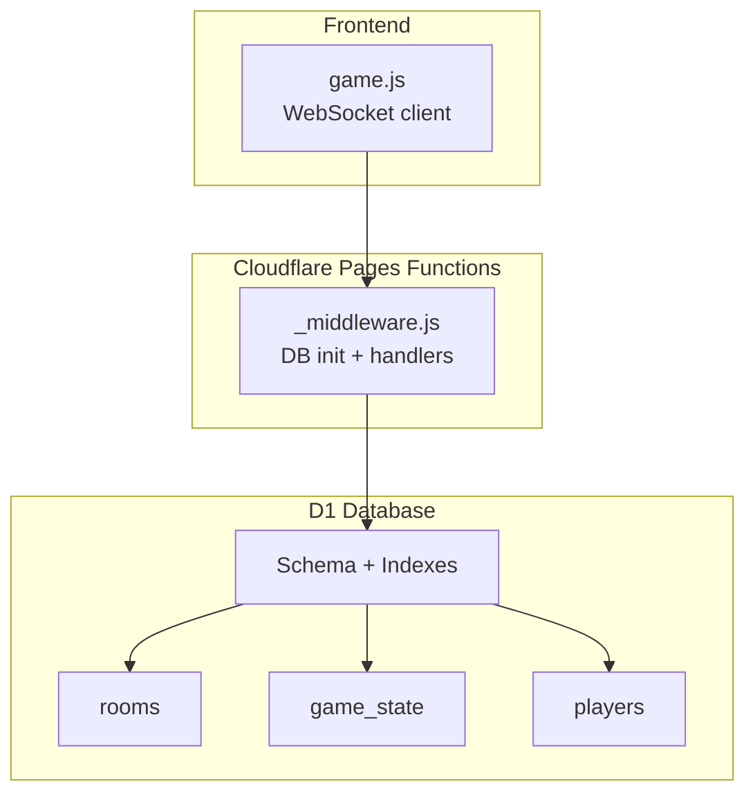
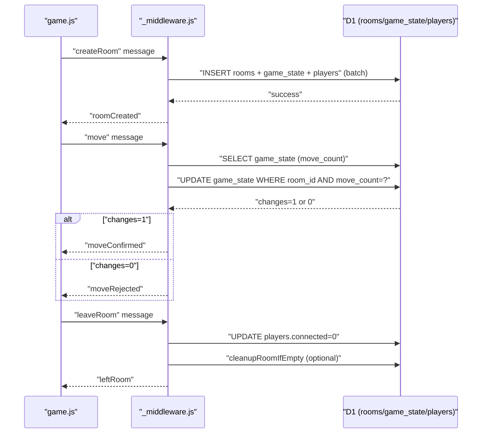
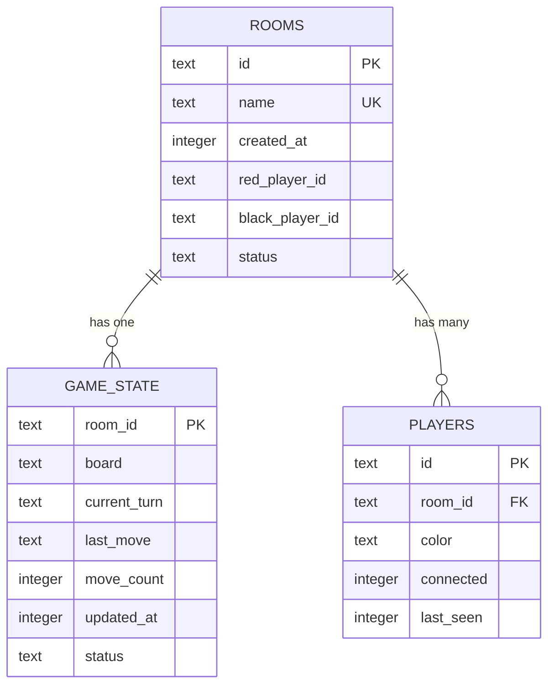
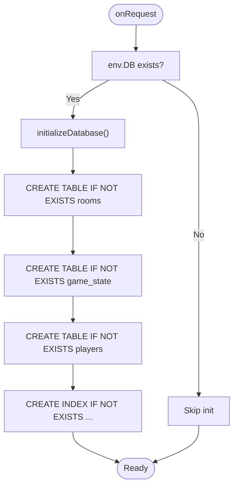
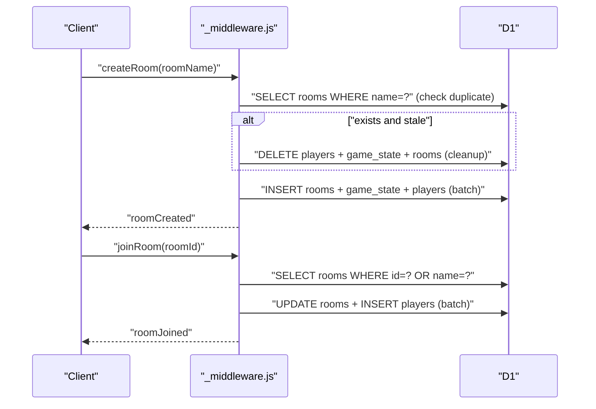
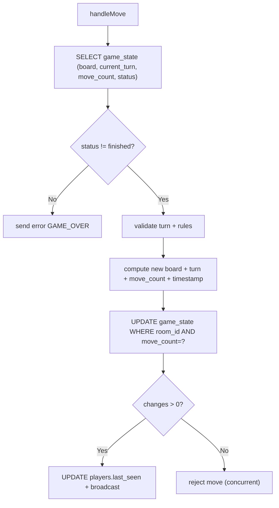
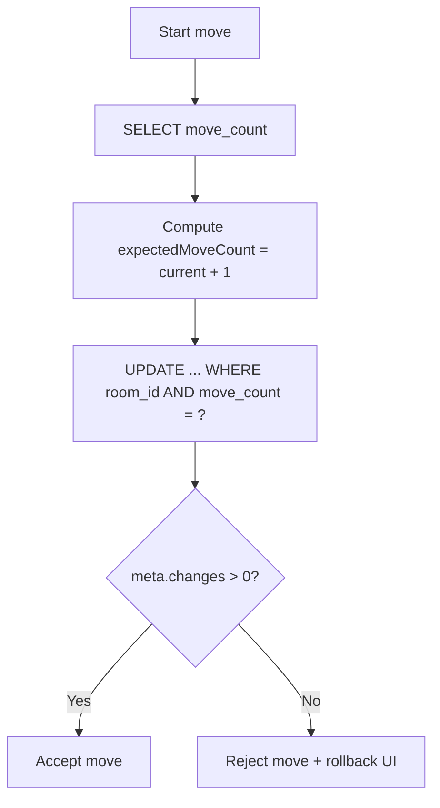
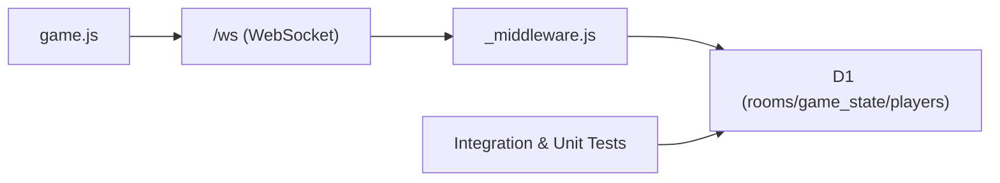

# Database Integration

<cite>
**Referenced Files in This Document**
- [schema.sql](file://schema.sql)
- [functions/_middleware.js](file://functions/_middleware.js)
- [game.js](file://game.js)
- [SETUP_D1.md](file://SETUP_D1.md)
- [TROUBLESHOOTING.md](file://TROUBLESHOOTING.md)
- [wrangler.toml](file://wrangler.toml)
- [tests/integration/database.test.js](file://tests/integration/database.test.js)
- [tests/unit/middleware-validation.test.js](file://tests/unit/middleware-validation.test.js)
</cite>

## Table of Contents
1. [Introduction](#introduction)
2. [Project Structure](#project-structure)
3. [Core Components](#core-components)
4. [Architecture Overview](#architecture-overview)
5. [Detailed Component Analysis](#detailed-component-analysis)
6. [Dependency Analysis](#dependency-analysis)
7. [Performance Considerations](#performance-considerations)
8. [Troubleshooting Guide](#troubleshooting-guide)
9. [Conclusion](#conclusion)
10. [Appendices](#appendices)

## Introduction
This document explains the D1 database integration for the Chinese Chess game. It covers the schema design, initialization and idempotent table/index creation, room and player lifecycle, game state persistence, cleanup procedures, transaction handling with batch operations, optimistic locking for concurrent moves, query optimization, connection pooling considerations, performance monitoring, migration strategies, and troubleshooting connectivity issues.

## Project Structure
The database integration spans several areas:
- Database schema definition and indexes
- Pages Functions middleware that initializes D1 and handles WebSocket messages
- Frontend game client that communicates with the backend via WebSocket
- Deployment configuration for D1 binding
- Tests validating database operations and optimistic locking behavior

**Diagram sources**
- [functions/_middleware.js:46-98](file://functions/_middleware.js#L46-L98)
- [schema.sql:6-42](file://schema.sql#L6-L42)
- [game.js:740-808](file://game.js#L740-L808)

**Section sources**
- [schema.sql:1-42](file://schema.sql#L1-L42)
- [functions/_middleware.js:46-122](file://functions/_middleware.js#L46-L122)
- [wrangler.toml:14-17](file://wrangler.toml#L14-L17)

## Core Components
- Database schema: rooms, game_state, players with foreign keys and indexes
- Middleware initialization: idempotent table/index creation on every request
- Room management: create, join, leave, stale room cleanup
- Game state persistence: board, turn, last move, move count, timestamps
- Player management: connection tracking, last seen, color
- Batch operations: atomic room creation and cleanup
- Optimistic locking: move_count field and conditional updates
- WebSocket integration: real-time move broadcasting and heartbeat

**Section sources**
- [schema.sql:6-42](file://schema.sql#L6-L42)
- [functions/_middleware.js:46-98](file://functions/_middleware.js#L46-L98)
- [functions/_middleware.js:282-351](file://functions/_middleware.js#L282-L351)
- [functions/_middleware.js:353-443](file://functions/_middleware.js#L353-L443)
- [functions/_middleware.js:445-516](file://functions/_middleware.js#L445-L516)
- [functions/_middleware.js:522-683](file://functions/_middleware.js#L522-L683)
- [functions/_middleware.js:685-707](file://functions/_middleware.js#L685-L707)
- [functions/_middleware.js:709-749](file://functions/_middleware.js#L709-L749)

## Architecture Overview
The system uses D1 as the persistent state store across multiple Pages Functions instances. The middleware initializes D1 on each request, handles WebSocket messages, and performs database operations. The frontend client connects via WebSocket to receive real-time updates.

**Diagram sources**
- [functions/_middleware.js:322-329](file://functions/_middleware.js#L322-L329)
- [functions/_middleware.js:533-622](file://functions/_middleware.js#L533-L622)
- [functions/_middleware.js:453-455](file://functions/_middleware.js#L453-L455)
- [functions/_middleware.js:500-504](file://functions/_middleware.js#L500-L504)

## Detailed Component Analysis

### Database Schema Design
- rooms: stores room metadata, player IDs, and status
- game_state: stores board JSON, current turn, last move JSON, move_count, timestamps, and status
- players: tracks connection IDs, room membership, color, connection state, and last_seen
- Indexes: name, status on rooms; room_id on players; updated_at on game_state

**Diagram sources**
- [schema.sql:6-42](file://schema.sql#L6-L42)

**Section sources**
- [schema.sql:6-42](file://schema.sql#L6-L42)

### Initialization and Idempotent Setup
- On every request, the middleware runs idempotent table/index creation using IF NOT EXISTS
- Ensures schema presence even if deployed without manual schema execution
- Indexes are created for performance on name/status and room_id

**Diagram sources**
- [functions/_middleware.js:104-122](file://functions/_middleware.js#L104-L122)
- [functions/_middleware.js:46-98](file://functions/_middleware.js#L46-L98)

**Section sources**
- [functions/_middleware.js:46-98](file://functions/_middleware.js#L46-L98)
- [functions/_middleware.js:104-122](file://functions/_middleware.js#L104-L122)

### Room Creation, Player Management, and Cleanup
- Create room: inserts into rooms, game_state, and players in a batch; sets connection state
- Join room: validates existence, checks capacity and status, updates room and inserts player
- Leave room: marks player disconnected, notifies opponent, cleans up empty rooms
- Stale room detection: counts connected/recent players to decide cleanup
- Cleanup: deletes players, game_state, and rooms in a batch

**Diagram sources**
- [functions/_middleware.js:282-351](file://functions/_middleware.js#L282-L351)
- [functions/_middleware.js:353-443](file://functions/_middleware.js#L353-L443)
- [functions/_middleware.js:445-516](file://functions/_middleware.js#L445-L516)

**Section sources**
- [functions/_middleware.js:282-351](file://functions/_middleware.js#L282-L351)
- [functions/_middleware.js:353-443](file://functions/_middleware.js#L353-L443)
- [functions/_middleware.js:445-516](file://functions/_middleware.js#L445-L516)

### Game State Persistence and Retrieval
- Persist move: update board JSON, current_turn, last_move, move_count, updated_at, status
- Retrieve state: fetch board, current_turn, move_count, last_move
- Resign: mark room finished and player disconnected

**Diagram sources**
- [functions/_middleware.js:522-683](file://functions/_middleware.js#L522-L683)

**Section sources**
- [functions/_middleware.js:522-683](file://functions/_middleware.js#L522-L683)
- [functions/_middleware.js:685-707](file://functions/_middleware.js#L685-L707)
- [functions/_middleware.js:709-749](file://functions/_middleware.js#L709-L749)

### Transaction Handling and Batch Operations
- Batch operations are used for atomic room creation and cleanup
- Batch ensures either all inserts/deletes succeed or none do
- In-memory connection map is per instance; D1 persists state across instances

**Section sources**
- [functions/_middleware.js:322-329](file://functions/_middleware.js#L322-L329)
- [functions/_middleware.js:499-504](file://functions/_middleware.js#L499-L504)

### Optimistic Locking for Concurrent Moves
- The move_count field acts as a version counter
- On move, select current move_count, compute expected value, and update only if it matches
- If changes=0, the move was rejected due to concurrent modification
- Frontend rolls back its optimistic UI update and informs the user

**Diagram sources**
- [functions/_middleware.js:533-622](file://functions/_middleware.js#L533-L622)
- [tests/unit/middleware-validation.test.js:200-241](file://tests/unit/middleware-validation.test.js#L200-L241)

**Section sources**
- [functions/_middleware.js:533-622](file://functions/_middleware.js#L533-L622)
- [tests/unit/middleware-validation.test.js:200-241](file://tests/unit/middleware-validation.test.js#L200-L241)

### Query Optimization and Indexing Strategies
- Indexes:
  - rooms(name) and rooms(status): efficient room lookup by name and filtering by status
  - players(room_id): fast player enumeration per room
  - game_state(updated_at): supports time-based queries for stale rooms and updates
- Queries leverage prepared statements with bound parameters for safety and performance

**Section sources**
- [schema.sql:37-42](file://schema.sql#L37-L42)
- [functions/_middleware.js:300-302](file://functions/_middleware.js#L300-L302)
- [functions/_middleware.js:375-377](file://functions/_middleware.js#L375-L377)
- [functions/_middleware.js:482-488](file://functions/_middleware.js#L482-L488)

### Connection Pooling and Performance Monitoring
- D1 is accessed via the Pages Functions runtime; pooling is managed by Cloudflare
- The middleware initializes D1 on each request to ensure schema availability
- Frontend monitors WebSocket connection state and heartbeat to detect disconnections
- Backend logs errors and timeouts for diagnostics

**Section sources**
- [functions/_middleware.js:108-113](file://functions/_middleware.js#L108-L113)
- [functions/_middleware.js:191-218](file://functions/_middleware.js#L191-L218)
- [game.js:842-882](file://game.js#L842-L882)

### Migration Strategies
- Manual schema execution via wrangler CLI
- Idempotent initialization in middleware for robustness
- Local development with local D1 database for testing

**Section sources**
- [SETUP_D1.md:46-52](file://SETUP_D1.md#L46-L52)
- [SETUP_D1.md:141-151](file://SETUP_D1.md#L141-L151)
- [functions/_middleware.js:46-98](file://functions/_middleware.js#L46-L98)

## Dependency Analysis
- Frontend depends on WebSocket endpoint for real-time updates
- Middleware depends on D1 bindings and exposes WebSocket upgrade
- D1 schema defines foreign keys and indexes used by middleware operations
- Tests validate database operations and optimistic locking behavior

**Diagram sources**
- [game.js:740-808](file://game.js#L740-L808)
- [functions/_middleware.js:115-185](file://functions/_middleware.js#L115-L185)
- [tests/integration/database.test.js:12-44](file://tests/integration/database.test.js#L12-L44)

**Section sources**
- [game.js:740-808](file://game.js#L740-L808)
- [functions/_middleware.js:115-185](file://functions/_middleware.js#L115-L185)
- [tests/integration/database.test.js:12-44](file://tests/integration/database.test.js#L12-L44)

## Performance Considerations
- Database writes: expected to be fast (<100ms) for typical moves
- WebSocket broadcast: near-instantaneous
- Use indexes to minimize scans on hot queries (name/status, room_id, updated_at)
- Batch operations reduce round-trips during room creation/cleanup
- Monitor Cloudflare logs for latency spikes and error rates

[No sources needed since this section provides general guidance]

## Troubleshooting Guide
Common issues and resolutions:
- D1 not configured: verify wrangler.toml database binding and Pages D1 binding
- Tables missing: run schema initialization or rely on middleware idempotent setup
- Room not found: check room ID/name correctness and database connectivity
- Moves not syncing: inspect database write success and WebSocket connection health
- Stale rooms: backend detects and cleans up rooms with no players or inactive players

**Section sources**
- [TROUBLESHOOTING.md:58-110](file://TROUBLESHOOTING.md#L58-L110)
- [TROUBLESHOOTING.md:111-153](file://TROUBLESHOOTING.md#L111-L153)
- [functions/_middleware.js:479-497](file://functions/_middleware.js#L479-L497)

## Conclusion
The D1 integration provides a robust, scalable foundation for the Chinese Chess game. The schema, middleware, and frontend work together to ensure consistent state, real-time synchronization, and resilience against concurrent modifications. Idempotent initialization, batch operations, and optimistic locking deliver reliability and performance.

[No sources needed since this section summarizes without analyzing specific files]

## Appendices

### Appendix A: Database Operations Reference
- Room creation: batch insert into rooms, game_state, players
- Room join: select by ID/name, validate status, batch update room and insert player
- Move handling: select current state, validate turn/rules, optimistic update with move_count
- Cleanup: delete players/game_state/rooms when room becomes empty

**Section sources**
- [functions/_middleware.js:322-329](file://functions/_middleware.js#L322-L329)
- [functions/_middleware.js:399-404](file://functions/_middleware.js#L399-L404)
- [functions/_middleware.js:533-622](file://functions/_middleware.js#L533-L622)
- [functions/_middleware.js:499-504](file://functions/_middleware.js#L499-L504)

### Appendix B: Test Coverage Highlights
- Database initialization creates expected tables
- Room operations insert/update/delete with proper constraints
- Game state operations persist board and last move
- Batch operations execute atomically
- Optimistic locking rejects concurrent moves

**Section sources**
- [tests/integration/database.test.js:54-81](file://tests/integration/database.test.js#L54-L81)
- [tests/integration/database.test.js:83-145](file://tests/integration/database.test.js#L83-L145)
- [tests/integration/database.test.js:147-201](file://tests/integration/database.test.js#L147-L201)
- [tests/integration/database.test.js:268-305](file://tests/integration/database.test.js#L268-L305)
- [tests/unit/middleware-validation.test.js:200-241](file://tests/unit/middleware-validation.test.js#L200-L241)