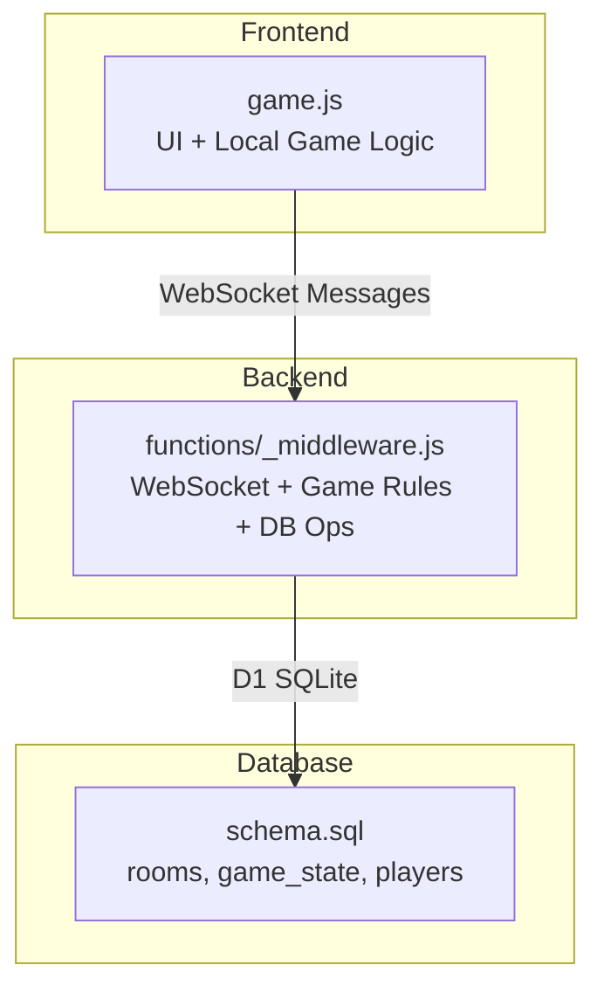
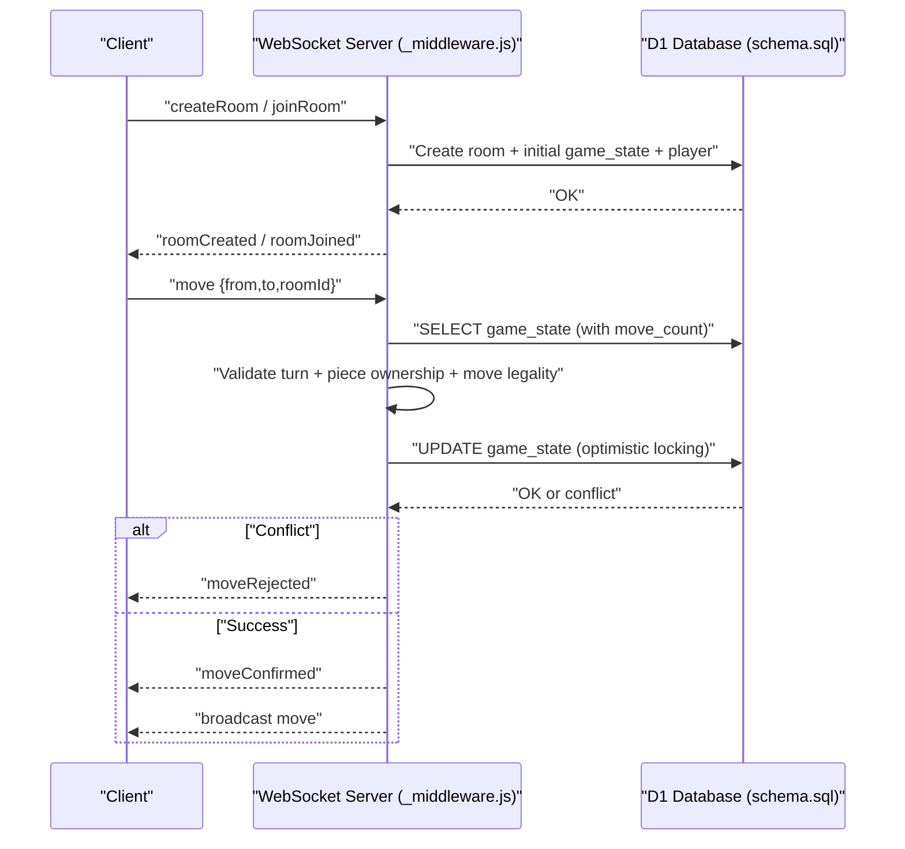
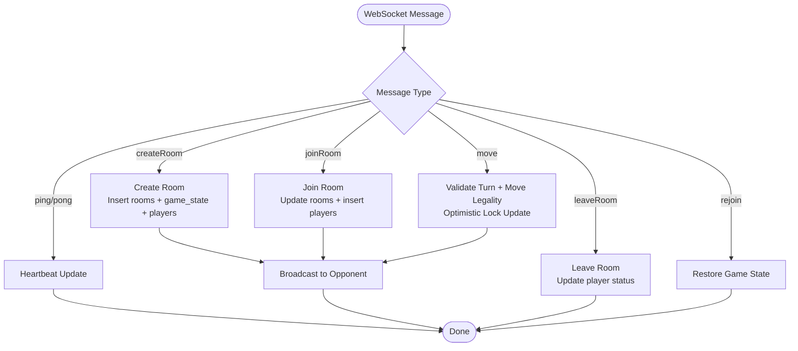
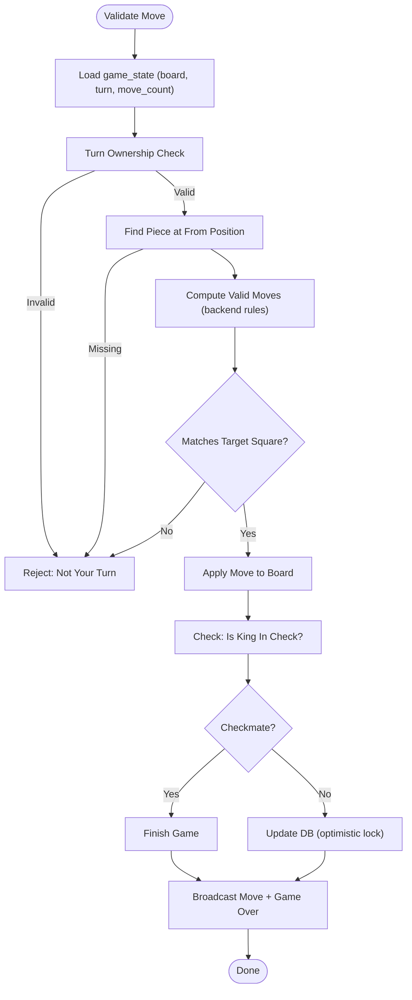
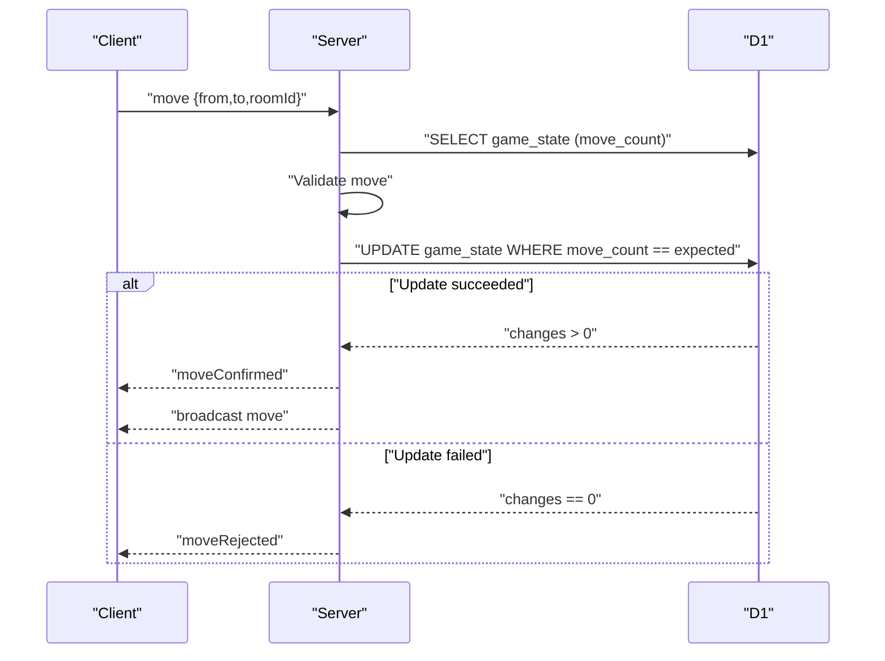
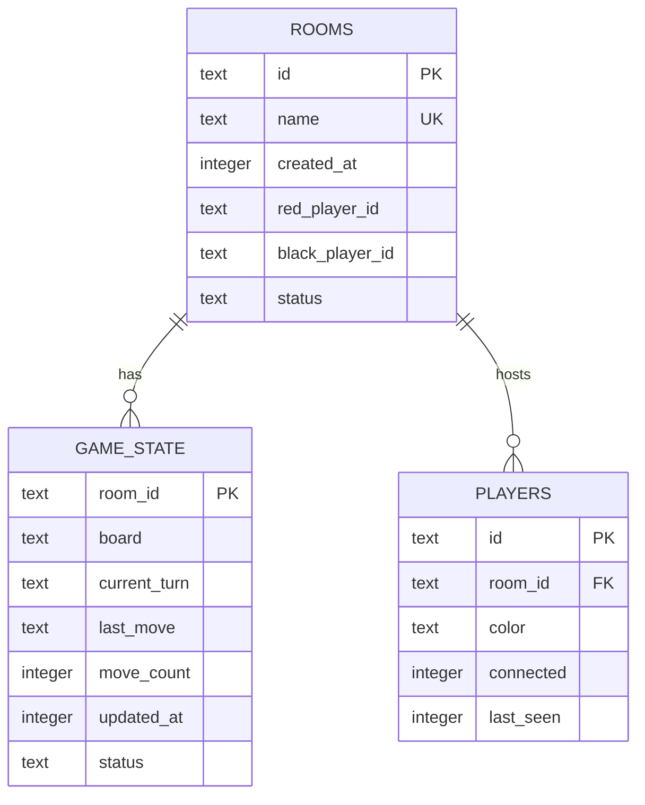
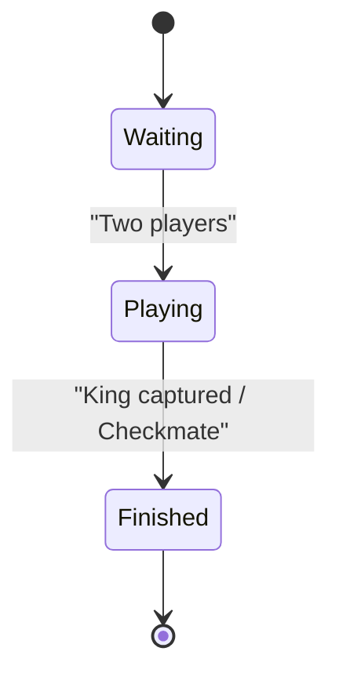
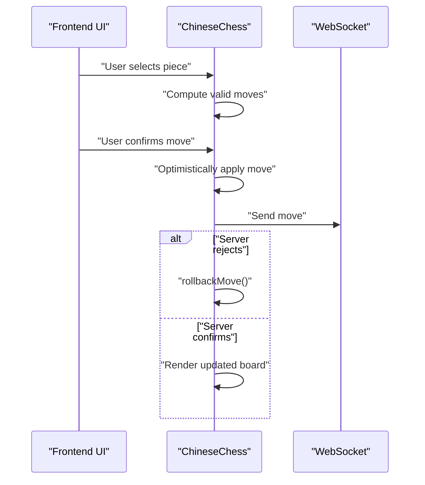
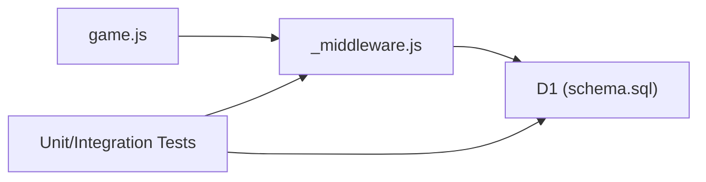

# Game Logic Engine

<cite>
**Referenced Files in This Document**
- [game.js](file://game.js)
- [_middleware.js](file://functions/_middleware.js)
- [schema.sql](file://schema.sql)
- [README.md](file://README.md)
- [chess-rules.test.js](file://tests/unit/chess-rules.test.js)
- [game-state.test.js](file://tests/unit/game-state.test.js)
- [database.test.js](file://tests/integration/database.test.js)
- [websocket.test.js](file://tests/integration/websocket.test.js)
- [move-debug.test.js](file://tests/debug/move-debug.test.js)
- [setup.js](file://tests/setup.js)
</cite>

## Table of Contents
1. [Introduction](#introduction)
2. [Project Structure](#project-structure)
3. [Core Components](#core-components)
4. [Architecture Overview](#architecture-overview)
5. [Detailed Component Analysis](#detailed-component-analysis)
6. [Dependency Analysis](#dependency-analysis)
7. [Performance Considerations](#performance-considerations)
8. [Troubleshooting Guide](#troubleshooting-guide)
9. [Conclusion](#conclusion)
10. [Appendices](#appendices)

## Introduction
This document describes the backend game logic engine for a Chinese Chess (Xiangqi) multiplayer game hosted on Cloudflare Pages. It covers the complete rule enforcement, including piece movement validation, special rules such as flying general and river crossing, check and checkmate detection, optimistic concurrency control, and database operations for game state persistence and player activity tracking. It also includes examples of complex scenarios, edge cases, and performance optimization techniques.

## Project Structure
The project is organized into:
- Frontend game logic and UI rendering in a single JavaScript module
- Backend Cloudflare Pages Functions handling WebSocket connections, room management, move validation, and database operations
- Database schema for rooms, game state, and players
- Comprehensive test suite covering unit, integration, and WebSocket behavior

**Diagram sources**
- [game.js:1-800](file://game.js#L1-L800)
- [_middleware.js:104-122](file://functions/_middleware.js#L104-L122)
- [schema.sql:1-42](file://schema.sql#L1-L42)

**Section sources**
- [README.md:162-175](file://README.md#L162-L175)
- [schema.sql:1-42](file://schema.sql#L1-L42)

## Core Components
- ChineseChess class (frontend): initializes board, handles UI, validates moves, and manages optimistic updates and reconnection
- Backend WebSocket handler (_middleware.js): manages rooms, player connections, move validation, check/checkmate detection, optimistic concurrency, and broadcasting
- Database schema: rooms, game_state, players with indexes for performance
- Tests: unit rules, game state, database operations, WebSocket behavior, and move debugging

Key backend responsibilities:
- Room lifecycle: create, join, leave, stale cleanup
- Move validation: piece-specific rules, check filtering, turn validation
- Concurrency control: optimistic locking with move_count
- Broadcasting: move updates, game over, reconnection restoration

**Section sources**
- [game.js:4-51](file://game.js#L4-L51)
- [_middleware.js:282-683](file://functions/_middleware.js#L282-L683)
- [schema.sql:5-41](file://schema.sql#L5-L41)

## Architecture Overview
The system uses a WebSocket-based real-time multiplayer architecture with Cloudflare Pages Functions and D1 SQLite.

**Diagram sources**
- [_middleware.js:242-276](file://functions/_middleware.js#L242-L276)
- [_middleware.js:522-683](file://functions/_middleware.js#L522-L683)
- [schema.sql:15-25](file://schema.sql#L15-L25)

## Detailed Component Analysis

### Backend WebSocket and Room Management
- Handles WebSocket upgrade and heartbeat management
- Supports room creation, joining, leaving, and stale room cleanup
- Validates room existence, capacity, and status
- Persists room metadata, initial game state, and player records

**Diagram sources**
- [_middleware.js:131-185](file://functions/_middleware.js#L131-L185)
- [_middleware.js:242-276](file://functions/_middleware.js#L242-L276)
- [_middleware.js:522-683](file://functions/_middleware.js#L522-L683)

**Section sources**
- [_middleware.js:128-185](file://functions/_middleware.js#L128-L185)
- [_middleware.js:282-477](file://functions/_middleware.js#L282-L477)
- [_middleware.js:479-516](file://functions/_middleware.js#L479-L516)

### Move Validation and Rule Enforcement
- Piece movement rules implemented per backend logic:
  - King (jiang), Advisor (shi), Elephant (xiang), Horse (ma), Chariot (ju), Cannon (pao), Pawn (zu)
- Special rules:
  - Flying general: Kings cannot face each other without intervening pieces
  - River crossing: Elephants cannot cross river; Pawns gain sideways after crossing
  - Blocked moves: Horses’ “leg blocking” (象眼/蹩马腿)
- Check detection: scans opponent threats and filters moves that would leave own king in check
- Checkmate detection: no legal moves remain for the king’s color

**Diagram sources**
- [_middleware.js:522-683](file://functions/_middleware.js#L522-L683)
- [_middleware.js:755-789](file://functions/_middleware.js#L755-L789)
- [_middleware.js:1019-1080](file://functions/_middleware.js#L1019-L1080)

**Section sources**
- [_middleware.js:755-1017](file://functions/_middleware.js#L755-L1017)
- [_middleware.js:1019-1080](file://functions/_middleware.js#L1019-L1080)
- [chess-rules.test.js:328-632](file://tests/unit/chess-rules.test.js#L328-L632)

### Optimistic Concurrency Control and Conflict Resolution
- The backend stores a move_count in game_state and uses it as a version stamp
- On move submission, the backend reads the current move_count
- After validating the move, it attempts to update the board and increment move_count with a WHERE clause matching the expected move_count
- If the update affects zero rows, another client beat it to the update; the move is rejected and the client is instructed to refresh state

**Diagram sources**
- [_middleware.js:532-548](file://functions/_middleware.js#L532-L548)
- [_middleware.js:619-634](file://functions/_middleware.js#L619-L634)

**Section sources**
- [_middleware.js:532-634](file://functions/_middleware.js#L532-L634)

### Database Operations and Persistence
- rooms: room metadata, player assignments, status
- game_state: board JSON, current_turn, last_move JSON, move_count, updated_at
- players: player presence, color, connected flag, last_seen
- Indexes: rooms(name), rooms(status), players(room_id), game_state(updated_at)

**Diagram sources**
- [schema.sql:5-41](file://schema.sql#L5-L41)

**Section sources**
- [schema.sql:5-41](file://schema.sql#L5-L41)
- [database.test.js:12-44](file://tests/integration/database.test.js#L12-L44)
- [database.test.js:155-201](file://tests/integration/database.test.js#L155-L201)

### Game State Management
- Turn tracking: alternates between red/black
- Move counting: increments on each successful move
- Game status: playing until king captured or checkmate
- Player activity: last_seen timestamps and connected flags

**Diagram sources**
- [schema.sql:11-12](file://schema.sql#L11-L12)
- [_middleware.js:598-608](file://functions/_middleware.js#L598-L608)

**Section sources**
- [_middleware.js:598-608](file://functions/_middleware.js#L598-L608)
- [game-state.test.js:56-119](file://tests/unit/game-state.test.js#L56-L119)

### Frontend Game Logic and Optimistic Updates
- Initializes board and UI
- Validates moves locally and optimistically applies them
- Tracks pending move for rollback
- Sends move via WebSocket and handles reconnection

**Diagram sources**
- [game.js:283-398](file://game.js#L283-L398)
- [game.js:319-379](file://game.js#L319-L379)

**Section sources**
- [game.js:4-51](file://game.js#L4-L51)
- [game.js:283-398](file://game.js#L283-L398)

## Dependency Analysis
- Frontend depends on WebSocket for real-time updates and D1 for persistence (via backend)
- Backend depends on D1 for rooms, game_state, and players
- Tests depend on mock WebSocket and D1 to validate behavior without external systems

**Diagram sources**
- [game.js:740-800](file://game.js#L740-L800)
- [_middleware.js:104-122](file://functions/_middleware.js#L104-L122)
- [schema.sql:1-42](file://schema.sql#L1-L42)

**Section sources**
- [game.js:740-800](file://game.js#L740-L800)
- [_middleware.js:104-122](file://functions/_middleware.js#L104-L122)

## Performance Considerations
- Database indexes: rooms(name), rooms(status), players(room_id), game_state(updated_at) improve query performance
- Optimistic locking with move_count avoids contention and reduces round trips
- Batch operations for room creation reduce write amplification
- Heartbeat intervals and timeouts prevent stale connections from consuming resources
- Frontend optimistic updates improve perceived responsiveness; server-side validation ensures correctness

[No sources needed since this section provides general guidance]

## Troubleshooting Guide
Common issues and resolutions:
- Move rejected due to concurrent update: refresh game state and retry
  - Cause: Optimistic lock mismatch
  - Action: Client receives moveRejected and should fetch latest state
- Not your turn: ensure turn ownership checks pass
  - Cause: Incorrect player color or stale state
  - Action: Rejoin room and verify color assignment
- Room not found or full: verify room ID/name and status
  - Action: Recreate or wait for opponent to join
- Stale room cleanup: rooms with no players or disconnected inactive players are removed
  - Action: Expect cleanup after inactivity threshold

**Section sources**
- [_middleware.js:619-634](file://functions/_middleware.js#L619-L634)
- [_middleware.js:379-497](file://functions/_middleware.js#L379-L497)
- [websocket.test.js:307-342](file://tests/integration/websocket.test.js#L307-L342)

## Conclusion
The backend engine enforces Chinese Chess rules rigorously, supports real-time multiplayer via WebSocket, and persists state reliably using D1. Optimistic concurrency control prevents conflicts while maintaining responsiveness. The comprehensive test suite validates rules, database operations, and WebSocket behavior, ensuring robustness across scenarios.

[No sources needed since this section summarizes without analyzing specific files]

## Appendices

### Rule Edge Cases and Examples
- Flying general: Kings can capture each other if unblocked and facing each other on the same file
- River crossing: Elephants cannot cross river; Pawns gain sideways movement after crossing
- Blocked moves: Horses cannot leap over adjacent pieces (“leg blocking”)
- Check and checkmate: No legal moves to escape check; game ends immediately

**Section sources**
- [_middleware.js:813-830](file://functions/_middleware.js#L813-L830)
- [_middleware.js:859-887](file://functions/_middleware.js#L859-L887)
- [_middleware.js:890-922](file://functions/_middleware.js#L890-L922)
- [chess-rules.test.js:360-377](file://tests/unit/chess-rules.test.js#L360-L377)
- [chess-rules.test.js:435-442](file://tests/unit/chess-rules.test.js#L435-L442)
- [chess-rules.test.js:463-471](file://tests/unit/chess-rules.test.js#L463-L471)

### Move Validation Examples
- Red pawn initial forward move from (6,0) to (5,0) is valid
- Red chariot at (9,0) can move to (8,0) along the edge
- These validations are computed by backend rules and verified in tests

**Section sources**
- [move-debug.test.js:129-163](file://tests/debug/move-debug.test.js#L129-L163)
- [move-debug.test.js:167-200](file://tests/debug/move-debug.test.js#L167-L200)
- [move-debug.test.js:221-239](file://tests/debug/move-debug.test.js#L221-L239)
- [move-debug.test.js:241-259](file://tests/debug/move-debug.test.js#L241-L259)

### Test Utilities and Mocks
- MockWebSocket simulates WebSocket behavior for tests
- MockD1Database provides in-memory D1-like operations
- setupDOM prepares minimal DOM for frontend tests

**Section sources**
- [setup.js:7-62](file://tests/setup.js#L7-L62)
- [setup.js:64-170](file://tests/setup.js#L64-L170)
- [setup.js:179-231](file://tests/setup.js#L179-L231)