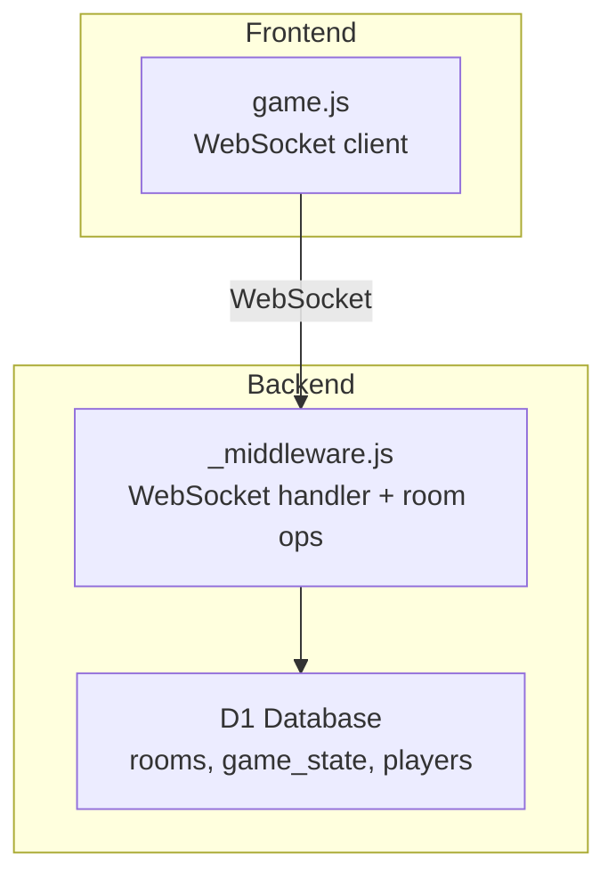
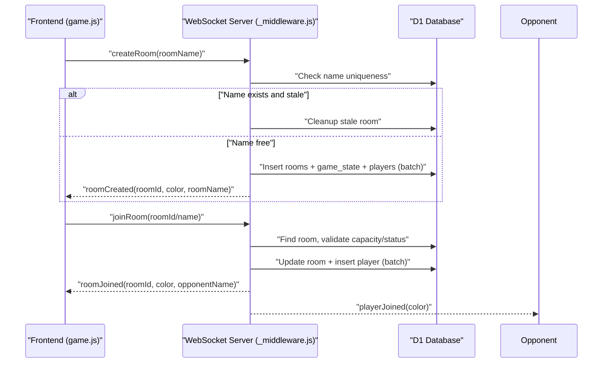
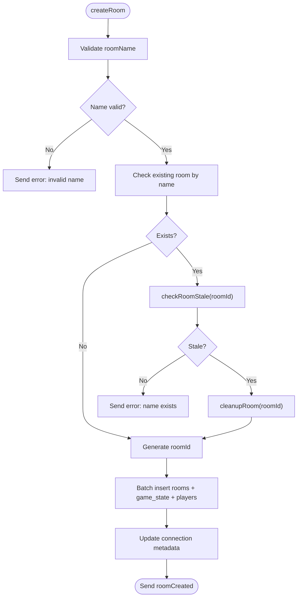
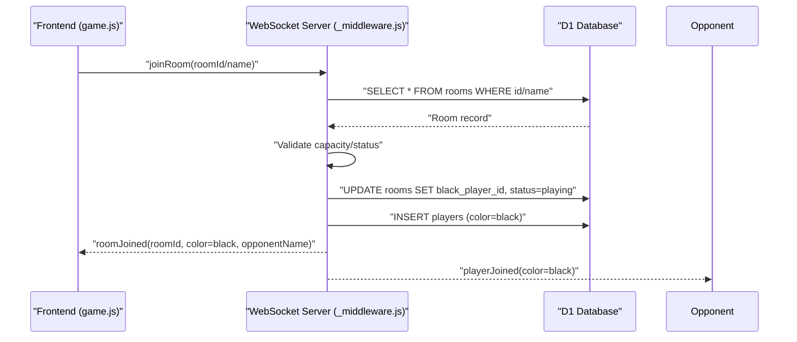
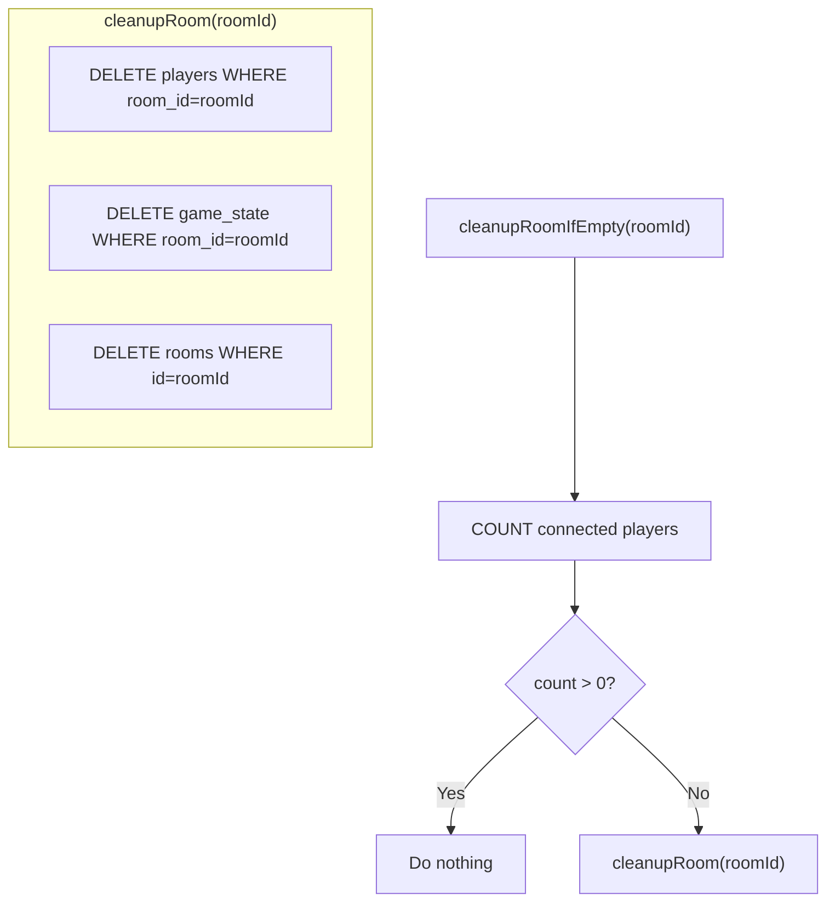
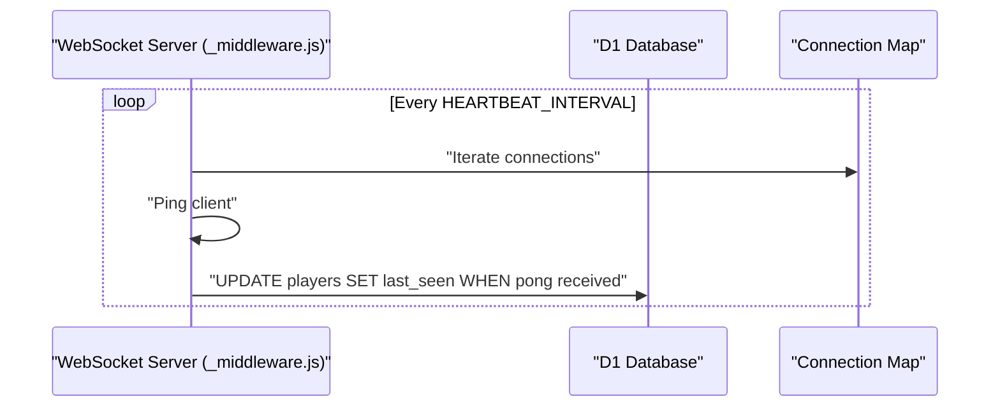
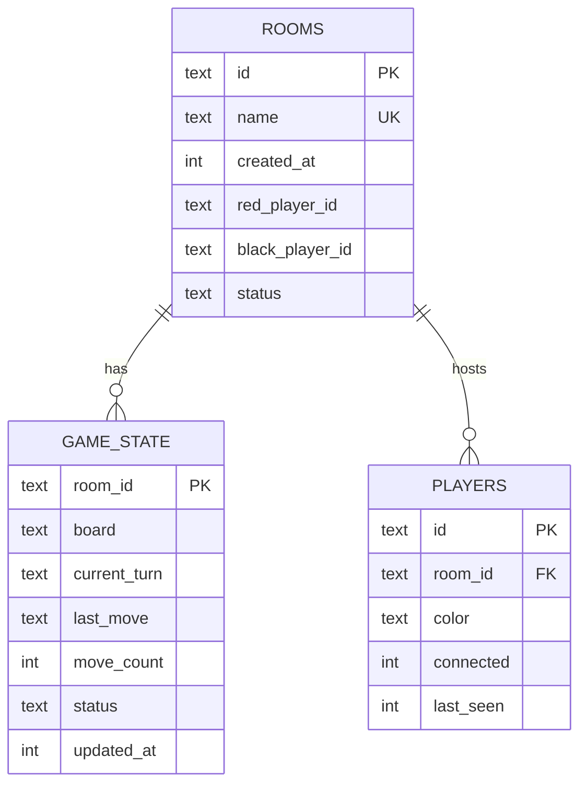
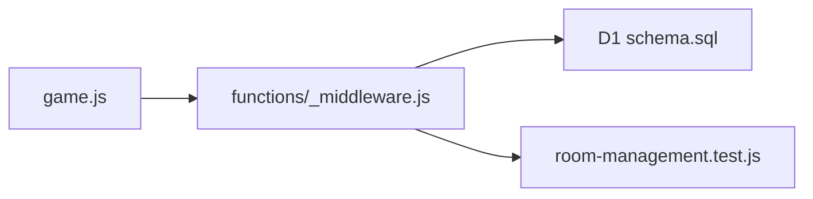

# Room Management System

<cite>
**Referenced Files in This Document**
- [_middleware.js](file://functions/_middleware.js)
- [schema.sql](file://schema.sql)
- [room-management.test.js](file://tests/unit/room-management.test.js)
- [game.js](file://game.js)
</cite>

## Table of Contents
1. [Introduction](#introduction)
2. [Project Structure](#project-structure)
3. [Core Components](#core-components)
4. [Architecture Overview](#architecture-overview)
5. [Detailed Component Analysis](#detailed-component-analysis)
6. [Dependency Analysis](#dependency-analysis)
7. [Performance Considerations](#performance-considerations)
8. [Troubleshooting Guide](#troubleshooting-guide)
9. [Conclusion](#conclusion)

## Introduction
This document describes the room management system for the Chinese Chess game hosted on Cloudflare Workers with D1 database. It covers room creation (validation, uniqueness, initial game state), joining logic (player assignment, color allocation, room status), cleanup (stale detection, automatic cleanup, empty room removal), state synchronization (player presence, connection status), and database operations (persistence, coordination). It also includes lifecycle examples, concurrent operations, and error handling.

## Project Structure
The room management logic is implemented in the backend middleware and supported by the D1 schema and unit tests. The frontend integrates via WebSocket messages to create/join rooms and receive updates.

**Diagram sources**
- [game.js:740-800](file://game.js#L740-L800)
- [_middleware.js:131-185](file://functions/_middleware.js#L131-L185)
- [schema.sql:6-42](file://schema.sql#L6-L42)

**Section sources**
- [schema.sql:6-42](file://schema.sql#L6-L42)
- [functions/_middleware.js:104-122](file://functions/_middleware.js#L104-L122)

## Core Components
- Room creation: Validates name, checks uniqueness, cleans stale rooms, inserts room, initial game state, and player record.
- Room joining: Resolves room by ID or name, enforces capacity and status, assigns color, updates state, notifies opponent.
- Room cleanup: Detects stale rooms (no players or all disconnected/inactive), deletes associated records.
- Player presence/connection: Tracks connected flag and last_seen timestamps; updates on activity and heartbeat.
- Database operations: DDL initialization, batched writes, optimistic locking for moves, cascade deletion.

**Section sources**
- [_middleware.js:282-351](file://functions/_middleware.js#L282-L351)
- [_middleware.js:353-443](file://functions/_middleware.js#L353-L443)
- [_middleware.js:479-516](file://functions/_middleware.js#L479-L516)
- [schema.sql:6-42](file://schema.sql#L6-L42)

## Architecture Overview
The WebSocket endpoint routes messages to handlers that manage rooms and game state. Room operations are transactional via batched D1 statements and rely on database constraints for referential integrity.

**Diagram sources**
- [_middleware.js:242-276](file://functions/_middleware.js#L242-L276)
- [_middleware.js:282-351](file://functions/_middleware.js#L282-L351)
- [_middleware.js:353-443](file://functions/_middleware.js#L353-L443)

## Detailed Component Analysis

### Room Creation Process
- Validation and uniqueness:
  - Rejects empty/whitespace-only names and truncates to a reasonable length.
  - Checks for existing room by name; if found, determines staleness and either reports conflict or cleans stale room.
- Initial state setup:
  - Generates unique room ID, initializes board, sets first player as red, and inserts records for rooms, game_state, and players.
- Connection mapping:
  - Updates in-memory connection metadata (roomId, playerId, color).

**Diagram sources**
- [_middleware.js:282-351](file://functions/_middleware.js#L282-L351)
- [_middleware.js:479-505](file://functions/_middleware.js#L479-L505)

**Section sources**
- [_middleware.js:282-351](file://functions/_middleware.js#L282-L351)
- [schema.sql:6-25](file://schema.sql#L6-L25)

### Room Joining Logic
- Resolution:
  - Accepts room ID or name; trims and caps length.
- Validation:
  - Ensures room exists, is not full, and not finished.
- Assignment and status:
  - Assigns color black to joining player, updates room with black player and status to playing.
- Notifications:
  - Sends roomJoined to the new player and playerJoined to the opponent.

**Diagram sources**
- [_middleware.js:353-443](file://functions/_middleware.js#L353-L443)

**Section sources**
- [_middleware.js:353-443](file://functions/_middleware.js#L353-L443)

### Room Cleanup Mechanisms
- Stale detection:
  - A room is stale if no players exist OR all players are both disconnected AND inactive beyond a timeout.
- Automatic cleanup:
  - During creation, if a conflicting room is found and stale, it is removed before proceeding.
  - On player leave, if no connected players remain, the room is deleted.
- Empty room removal:
  - cleanupRoomIfEmpty checks connected players and invokes cleanupRoom to remove players, game_state, and rooms entries.

**Diagram sources**
- [_middleware.js:479-516](file://functions/_middleware.js#L479-L516)

**Section sources**
- [_middleware.js:479-516](file://functions/_middleware.js#L479-L516)
- [room-management.test.js:44-84](file://tests/unit/room-management.test.js#L44-L84)

### Room State Synchronization and Presence Tracking
- Connection status:
  - Heartbeat pings are sent periodically; clients respond with pong. Last heartbeat is tracked per connection.
- Player presence:
  - Players table tracks connected flag and last_seen timestamp. Updates occur on activity and heartbeat.
- Room status:
  - Rooms table maintains waiting/playing/finished statuses. Status transitions occur during join and game end.

**Diagram sources**
- [_middleware.js:191-225](file://functions/_middleware.js#L191-L225)
- [_middleware.js:636-638](file://functions/_middleware.js#L636-L638)

**Section sources**
- [_middleware.js:191-225](file://functions/_middleware.js#L191-L225)
- [_middleware.js:636-638](file://functions/_middleware.js#L636-L638)
- [schema.sql:28-35](file://schema.sql#L28-L35)

### Database Operations and Schema
- Schema:
  - rooms: unique name, player IDs, status, timestamps.
  - game_state: board JSON, current turn, last move JSON, move count, status, timestamps.
  - players: room_id foreign key, color, connected flag, last_seen.
  - Indexes optimize lookups by name, status, room_id, and updated_at.
- Initialization:
  - Idempotent table creation and index creation on every request.
- Constraints:
  - Foreign keys with ON DELETE CASCADE ensure cascading cleanup.

**Diagram sources**
- [schema.sql:6-42](file://schema.sql#L6-L42)

**Section sources**
- [schema.sql:6-42](file://schema.sql#L6-L42)
- [_middleware.js:46-98](file://functions/_middleware.js#L46-L98)

### Examples and Scenarios

- Room lifecycle example:
  - Create room -> first player joins automatically -> second player joins -> status transitions to playing -> game proceeds -> finish -> status becomes finished -> cleanup triggers when empty.
- Concurrent room operations:
  - Optimistic locking prevents race conditions on moves by checking move_count before updating game_state.
- Error scenarios and resolutions:
  - Room name exists: resolve by waiting or retrying; if stale, stale room is cleaned and creation proceeds.
  - Room full: prompt user to select another room.
  - Game over: notify and prevent further moves.
  - Connection lost: heartbeat timeout closes connection; frontend attempts reconnection and rejoin.

**Section sources**
- [_middleware.js:282-351](file://functions/_middleware.js#L282-L351)
- [_middleware.js:353-443](file://functions/_middleware.js#L353-L443)
- [_middleware.js:522-683](file://functions/_middleware.js#L522-L683)
- [room-management.test.js:290-343](file://tests/unit/room-management.test.js#L290-L343)

## Dependency Analysis
Room management depends on:
- WebSocket message routing and connection lifecycle.
- D1 schema and indexes for efficient queries.
- Frontend client for initiating room actions and receiving updates.

**Diagram sources**
- [game.js:740-800](file://game.js#L740-L800)
- [_middleware.js:104-122](file://functions/_middleware.js#L104-L122)
- [schema.sql:6-42](file://schema.sql#L6-L42)
- [room-management.test.js:1-446](file://tests/unit/room-management.test.js#L1-L446)

**Section sources**
- [_middleware.js:104-122](file://functions/_middleware.js#L104-L122)
- [schema.sql:6-42](file://schema.sql#L6-L42)
- [room-management.test.js:1-446](file://tests/unit/room-management.test.js#L1-L446)

## Performance Considerations
- Use indexes on rooms(name), rooms(status), players(room_id), and game_state(updated_at) to speed up lookups and stale detection.
- Batched writes reduce round-trips during room creation and join.
- Optimistic locking avoids contention on game state updates.
- Heartbeat intervals balance responsiveness and overhead.

## Troubleshooting Guide
- Room creation fails with “name exists”:
  - Verify staleness logic; if stale, stale room should be cleaned before reuse.
- Join fails with “room full”:
  - Ensure room status allows joining and that black player slot is available.
- Stale room not cleaned:
  - Confirm checkRoomStale logic evaluates both connected and recent activity thresholds.
- Connection drops frequently:
  - Adjust heartbeat interval/timeout and ensure client responds to ping messages.
- Move rejected due to concurrency:
  - Client should refresh state and retry move after rejection.

**Section sources**
- [_middleware.js:282-351](file://functions/_middleware.js#L282-L351)
- [_middleware.js:353-443](file://functions/_middleware.js#L353-L443)
- [_middleware.js:479-516](file://functions/_middleware.js#L479-L516)
- [_middleware.js:620-634](file://functions/_middleware.js#L620-L634)

## Conclusion
The room management system provides robust room lifecycle handling with strong validation, unique name enforcement, and resilient cleanup of stale and empty rooms. Player presence and connection status are tracked via heartbeat and database updates. The D1 schema and indexes enable efficient operations, while optimistic locking ensures consistency under concurrent play. Together, these components deliver a reliable foundation for multiplayer Chinese Chess.