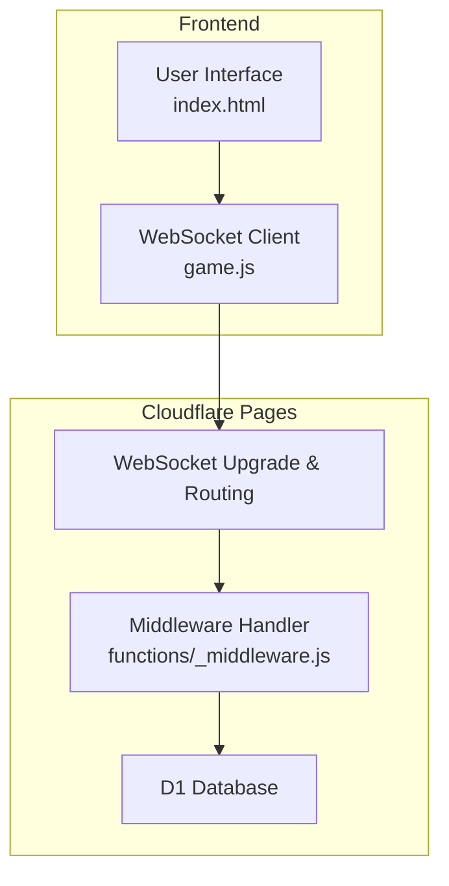
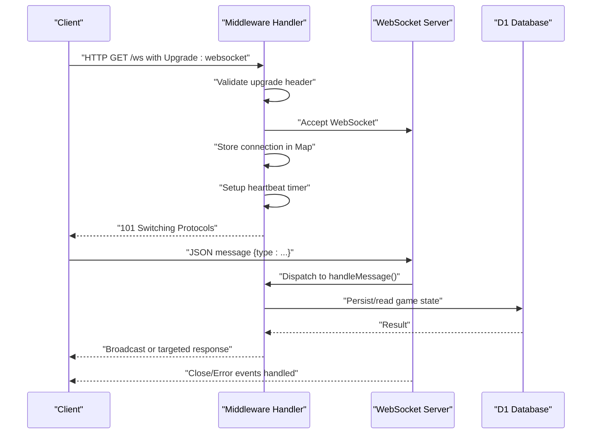
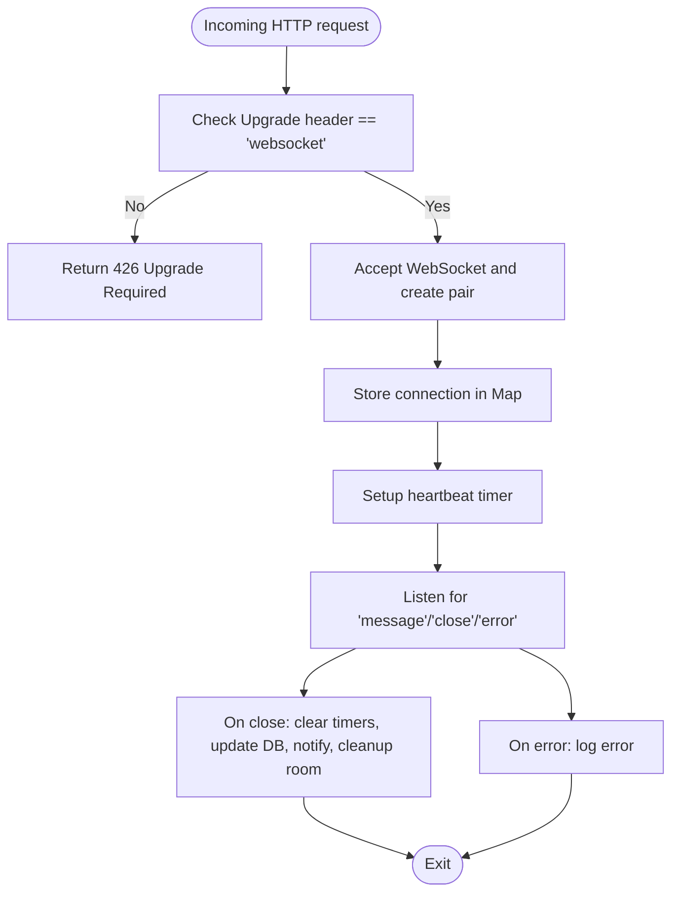
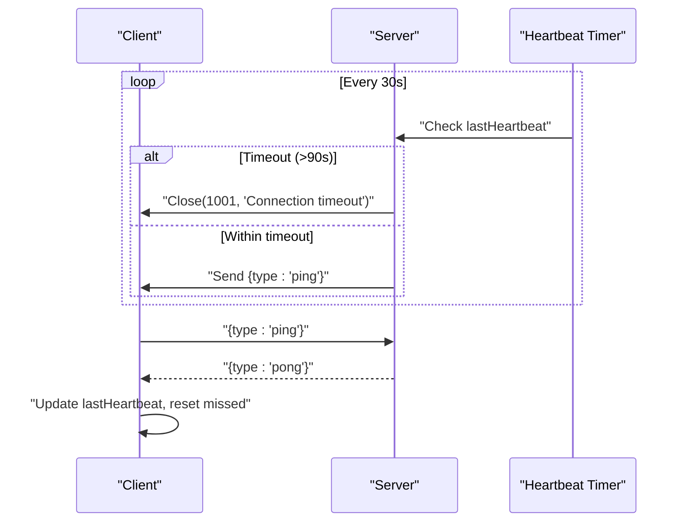
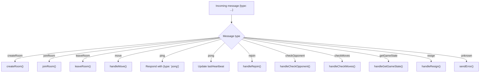
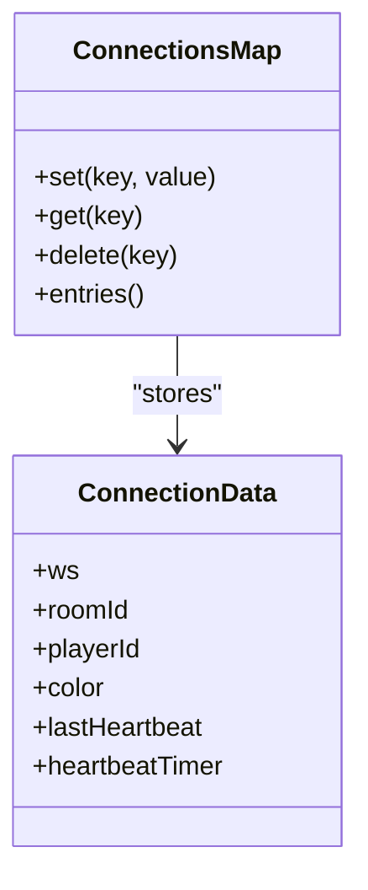
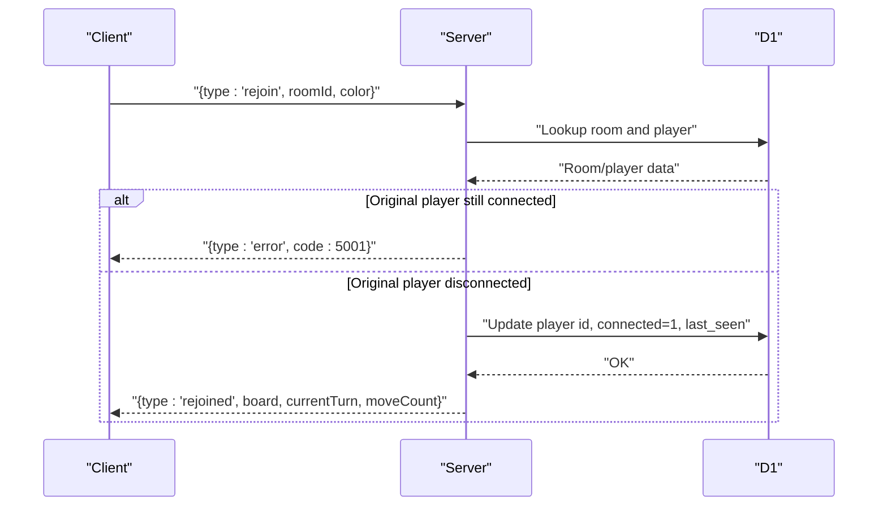
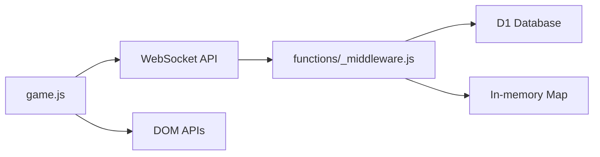

# WebSocket Server

<cite>
**Referenced Files in This Document**
- [functions/_middleware.js](file://functions/_middleware.js)
- [game.js](file://game.js)
- [index.html](file://index.html)
- [tests/integration/websocket.test.js](file://tests/integration/websocket.test.js)
- [tests/unit/heartbeat.test.js](file://tests/unit/heartbeat.test.js)
- [tests/unit/reconnection.test.js](file://tests/unit/reconnection.test.js)
- [tests/setup.js](file://tests/setup.js)
- [TROUBLESHOOTING.md](file://TROUBLESHOOTING.md)
</cite>

## Table of Contents
1. [Introduction](#introduction)
2. [Project Structure](#project-structure)
3. [Core Components](#core-components)
4. [Architecture Overview](#architecture-overview)
5. [Detailed Component Analysis](#detailed-component-analysis)
6. [Dependency Analysis](#dependency-analysis)
7. [Performance Considerations](#performance-considerations)
8. [Troubleshooting Guide](#troubleshooting-guide)
9. [Conclusion](#conclusion)
10. [Appendices](#appendices)

## Introduction
This document provides comprehensive documentation for the WebSocket server implementation powering real-time multiplayer Chinese Chess. It covers the connection lifecycle (upgrade, acceptance, cleanup), heartbeat and timeout handling, message routing for room and game actions, connection pooling and in-memory tracking, error handling, state management, and graceful shutdown. Practical communication patterns and troubleshooting guidance are included to help developers and operators deploy and operate the system reliably.

## Project Structure
The WebSocket server is implemented as a Cloudflare Pages Function handler that upgrades HTTP requests to WebSocket connections. The frontend client maintains a WebSocket connection, manages heartbeats, and handles reconnection and polling fallbacks. Tests validate the handshake, message routing, heartbeat behavior, and reconnection logic.

**Diagram sources**
- [functions/_middleware.js:104-185](file://functions/_middleware.js#L104-L185)
- [game.js:740-808](file://game.js#L740-L808)
- [index.html:10-58](file://index.html#L10-L58)

**Section sources**
- [functions/_middleware.js:104-185](file://functions/_middleware.js#L104-L185)
- [game.js:740-808](file://game.js#L740-L808)
- [index.html:10-58](file://index.html#L10-L58)

## Core Components
- Middleware handler: Implements WebSocket upgrade, connection acceptance, heartbeat, message routing, and cleanup.
- In-memory connection pool: Tracks active connections per instance using a Map keyed by connection IDs.
- Message router: Dispatches incoming messages to specific handlers based on type.
- Heartbeat: Periodic ping/pong with timeout detection and automatic disconnection.
- Room and game logic: Handles room creation/joining, move validation, broadcasting, and state persistence via D1.
- Frontend client: Manages WebSocket lifecycle, heartbeat, reconnection, and UI updates.

**Section sources**
- [functions/_middleware.js:128-185](file://functions/_middleware.js#L128-L185)
- [functions/_middleware.js:191-225](file://functions/_middleware.js#L191-L225)
- [functions/_middleware.js:231-276](file://functions/_middleware.js#L231-L276)
- [functions/_middleware.js:1213-1240](file://functions/_middleware.js#L1213-L1240)
- [game.js:842-882](file://game.js#L842-L882)
- [game.js:888-937](file://game.js#L888-L937)

## Architecture Overview
The WebSocket server follows a request-to-upgrade pattern. On upgrade, the server accepts the WebSocket, stores connection metadata in memory, sets up heartbeat timers, registers message and close/error handlers, and returns a 101 switching protocols response to the client. Subsequent messages are routed to handlers that coordinate with D1 for persistence and broadcast updates to other room participants.

**Diagram sources**
- [functions/_middleware.js:131-185](file://functions/_middleware.js#L131-L185)
- [functions/_middleware.js:231-276](file://functions/_middleware.js#L231-L276)
- [functions/_middleware.js:1213-1240](file://functions/_middleware.js#L1213-L1240)

## Detailed Component Analysis

### Connection Lifecycle
- Upgrade handling: Validates the Upgrade header and rejects non-WebSocket requests.
- Connection acceptance: Uses a WebSocketPair to accept the connection and returns the client socket to the caller.
- In-memory tracking: Stores connection metadata (WebSocket, room/player info, heartbeat timestamps) in a Map keyed by connection ID.
- Cleanup: Clears heartbeat timers, updates player status, notifies opponents, and schedules room cleanup if empty.

**Diagram sources**
- [functions/_middleware.js:131-185](file://functions/_middleware.js#L131-L185)
- [functions/_middleware.js:1213-1240](file://functions/_middleware.js#L1213-L1240)

**Section sources**
- [functions/_middleware.js:131-185](file://functions/_middleware.js#L131-L185)
- [functions/_middleware.js:1213-1240](file://functions/_middleware.js#L1213-L1240)

### Heartbeat Mechanism
- Server heartbeat: Periodically sends ping messages and checks elapsed time against a timeout threshold; closes stale connections.
- Client heartbeat: Sends ping and expects pong; tracks missed heartbeats and triggers reconnection if threshold exceeded.
- Bidirectional synchronization: Pong updates last heartbeat on both sides; ping/pong messages are handled explicitly.

**Diagram sources**
- [functions/_middleware.js:191-225](file://functions/_middleware.js#L191-L225)
- [game.js:842-882](file://game.js#L842-L882)
- [tests/unit/heartbeat.test.js:117-145](file://tests/unit/heartbeat.test.js#L117-L145)

**Section sources**
- [functions/_middleware.js:191-225](file://functions/_middleware.js#L191-L225)
- [game.js:842-882](file://game.js#L842-L882)
- [tests/unit/heartbeat.test.js:147-207](file://tests/unit/heartbeat.test.js#L147-L207)
- [tests/unit/heartbeat.test.js:209-269](file://tests/unit/heartbeat.test.js#L209-L269)

### Message Routing System
Supported message types and handlers:
- createRoom: Creates a new room, initializes game state, assigns color, and responds with roomCreated.
- joinRoom: Joins an existing room, assigns color, notifies opponent, and broadcasts playerJoined.
- leaveRoom: Updates player status, notifies opponent, clears connection info, and cleans up empty rooms.
- move: Validates turn and move legality, applies optimistic locking, confirms move, broadcasts updates, and handles game over.
- ping/pong: Heartbeat exchange; pong updates last heartbeat.
- rejoin: Restores connection for disconnected players, validates disconnection, updates DB, and returns game state.
- checkOpponent: Queries opponent presence in a room.
- checkMoves: Polls for move updates since last known update.
- getGameState: Requests current game state snapshot.
- resign: Resigns the game and declares winner.

**Diagram sources**
- [functions/_middleware.js:242-276](file://functions/_middleware.js#L242-L276)
- [functions/_middleware.js:282-351](file://functions/_middleware.js#L282-L351)
- [functions/_middleware.js:353-443](file://functions/_middleware.js#L353-L443)
- [functions/_middleware.js:445-477](file://functions/_middleware.js#L445-L477)
- [functions/_middleware.js:522-683](file://functions/_middleware.js#L522-L683)
- [functions/_middleware.js:1086-1146](file://functions/_middleware.js#L1086-L1146)
- [functions/_middleware.js:1148-1211](file://functions/_middleware.js#L1148-L1211)
- [functions/_middleware.js:1254-1261](file://functions/_middleware.js#L1254-L1261)

**Section sources**
- [functions/_middleware.js:242-276](file://functions/_middleware.js#L242-L276)
- [functions/_middleware.js:282-351](file://functions/_middleware.js#L282-L351)
- [functions/_middleware.js:353-443](file://functions/_middleware.js#L353-L443)
- [functions/_middleware.js:445-477](file://functions/_middleware.js#L445-L477)
- [functions/_middleware.js:522-683](file://functions/_middleware.js#L522-L683)
- [functions/_middleware.js:1086-1146](file://functions/_middleware.js#L1086-L1146)
- [functions/_middleware.js:1148-1211](file://functions/_middleware.js#L1148-L1211)
- [functions/_middleware.js:1254-1261](file://functions/_middleware.js#L1254-L1261)

### Connection Pooling and In-Memory Tracking
- Per-instance connection pool: A Map keyed by connection ID holds WebSocket instances and metadata (room/player/color, last heartbeat, heartbeat timer).
- Broadcast: Iterates over connections to deliver messages to room members, excluding the sender.
- Cleanup: Clears timers, updates player status, notifies opponents, and schedules room cleanup if empty.

**Diagram sources**
- [functions/_middleware.js:128-156](file://functions/_middleware.js#L128-L156)
- [functions/_middleware.js:1242-1252](file://functions/_middleware.js#L1242-L1252)
- [functions/_middleware.js:1213-1240](file://functions/_middleware.js#L1213-L1240)

**Section sources**
- [functions/_middleware.js:128-156](file://functions/_middleware.js#L128-L156)
- [functions/_middleware.js:1242-1252](file://functions/_middleware.js#L1242-L1252)
- [functions/_middleware.js:1213-1240](file://functions/_middleware.js#L1213-L1240)

### Error Handling Strategies
- Unknown message type: Responds with an error message containing a standardized error code and message.
- Malformed JSON: Catches parse errors and sends an INVALID_MESSAGE error.
- Database errors: Wraps operations with try/catch and sends DATABASE_ERROR with details.
- Room errors: Specific codes for room not found, room full, name conflicts, creation failures.
- Connection errors: Codes for connection failures and rejoin failures.
- Graceful shutdown: On close, timers are cleared, player status updated, opponent notified, and cleanup scheduled.

**Section sources**
- [functions/_middleware.js:13-40](file://functions/_middleware.js#L13-L40)
- [functions/_middleware.js:162-170](file://functions/_middleware.js#L162-L170)
- [functions/_middleware.js:1254-1261](file://functions/_middleware.js#L1254-L1261)
- [functions/_middleware.js:1213-1240](file://functions/_middleware.js#L1213-L1240)

### Connection State Management and Reconnection
- Frontend reconnection: Exponential backoff with jitter, max attempts, and UI feedback.
- Rejoin logic: Validates room existence, ensures original player is disconnected, updates DB, and restores game state.
- Race condition prevention: Checks player’s connected flag before allowing reconnection.

**Diagram sources**
- [functions/_middleware.js:1086-1146](file://functions/_middleware.js#L1086-L1146)
- [tests/unit/reconnection.test.js:139-278](file://tests/unit/reconnection.test.js#L139-L278)

**Section sources**
- [game.js:810-836](file://game.js#L810-L836)
- [functions/_middleware.js:1086-1146](file://functions/_middleware.js#L1086-L1146)
- [tests/unit/reconnection.test.js:139-278](file://tests/unit/reconnection.test.js#L139-L278)

### Practical Communication Patterns
- Room creation: Client sends createRoom; server responds with roomCreated and assigns color.
- Room joining: Client sends joinRoom; server responds with roomJoined and broadcasts playerJoined.
- Move submission: Client sends move; server validates, applies, confirms, and broadcasts.
- Heartbeat: Client periodically sends ping; server responds with pong; client resets missed count.
- Reconnection: Client sends rejoin; server validates and restores state.

**Section sources**
- [tests/integration/websocket.test.js:33-177](file://tests/integration/websocket.test.js#L33-L177)
- [tests/integration/websocket.test.js:228-277](file://tests/integration/websocket.test.js#L228-L277)
- [tests/integration/websocket.test.js:279-305](file://tests/integration/websocket.test.js#L279-L305)
- [tests/integration/websocket.test.js:344-377](file://tests/integration/websocket.test.js#L344-L377)

## Dependency Analysis
- Middleware depends on:
  - WebSocketPair for upgrade acceptance.
  - D1 for room, game state, and player persistence.
  - In-memory Map for connection tracking.
- Frontend depends on:
  - WebSocket API for transport.
  - DOM APIs for UI updates.
  - Exponential backoff for reconnection.

**Diagram sources**
- [functions/_middleware.js:131-185](file://functions/_middleware.js#L131-L185)
- [game.js:740-808](file://game.js#L740-L808)

**Section sources**
- [functions/_middleware.js:131-185](file://functions/_middleware.js#L131-L185)
- [game.js:740-808](file://game.js#L740-L808)

## Performance Considerations
- Heartbeat intervals: Server pings every 30 seconds; client considers dead after 3 missed heartbeats (60 seconds).
- Optimistic locking: Move updates use a monotonic move_count to prevent race conditions.
- Broadcasting: Iterate over connections to send room updates; consider scaling if rooms grow large.
- Database writes: Batch operations for room creation; ensure D1 availability and low latency.

[No sources needed since this section provides general guidance]

## Troubleshooting Guide
Common issues and resolutions:
- WebSocket connection fails: Check browser console for errors, verify Pages Functions deployment, and confirm D1 binding configuration.
- Room creation fails: Ensure D1 database is created and tables initialized; verify database ID in wrangler.toml and Pages settings.
- Moves not syncing: Confirm both players are connected, check Cloudflare logs for database errors, and verify room ID correctness.
- Heartbeat timeouts: Investigate network stability; client will attempt reconnection after multiple missed heartbeats.
- Reconnection race condition: Ensure original player is marked disconnected before allowing rejoin.

**Section sources**
- [TROUBLESHOOTING.md:126-252](file://TROUBLESHOOTING.md#L126-L252)
- [tests/unit/heartbeat.test.js:271-313](file://tests/unit/heartbeat.test.js#L271-L313)
- [tests/unit/reconnection.test.js:191-239](file://tests/unit/reconnection.test.js#L191-L239)

## Conclusion
The WebSocket server provides a robust foundation for real-time multiplayer Chinese Chess with clear separation of concerns: upgrade handling, connection pooling, heartbeat monitoring, message routing, and database-backed persistence. The frontend client complements this with resilient reconnection and heartbeat management. Together, these components enable reliable gameplay with graceful degradation and recovery.

[No sources needed since this section summarizes without analyzing specific files]

## Appendices

### Appendix A: Message Types and Handlers Reference
- createRoom: Room creation and initial game state.
- joinRoom: Room joining and opponent notification.
- leaveRoom: Player departure and room cleanup.
- move: Move validation, optimistic locking, and broadcast.
- ping/pong: Heartbeat exchange.
- rejoin: Reconnection restoration.
- checkOpponent: Opponent presence check.
- checkMoves: Move update polling.
- getGameState: Game state snapshot.
- resign: Resignation and game over.

**Section sources**
- [functions/_middleware.js:242-276](file://functions/_middleware.js#L242-L276)
- [functions/_middleware.js:282-351](file://functions/_middleware.js#L282-L351)
- [functions/_middleware.js:353-443](file://functions/_middleware.js#L353-L443)
- [functions/_middleware.js:445-477](file://functions/_middleware.js#L445-L477)
- [functions/_middleware.js:522-683](file://functions/_middleware.js#L522-L683)
- [functions/_middleware.js:1086-1146](file://functions/_middleware.js#L1086-L1146)
- [functions/_middleware.js:1148-1211](file://functions/_middleware.js#L1148-L1211)
- [functions/_middleware.js:1254-1261](file://functions/_middleware.js#L1254-L1261)

### Appendix B: Test Coverage Highlights
- WebSocket integration tests validate connection, message handling, room creation/joining, move synchronization, heartbeat, error handling, reconnection, and disconnection scenarios.
- Unit tests validate heartbeat timing constants, server/client heartbeat management, timeout triggers, and reconnection race condition fixes.

**Section sources**
- [tests/integration/websocket.test.js:33-404](file://tests/integration/websocket.test.js#L33-L404)
- [tests/unit/heartbeat.test.js:117-467](file://tests/unit/heartbeat.test.js#L117-L467)
- [tests/unit/reconnection.test.js:139-594](file://tests/unit/reconnection.test.js#L139-L594)
- [tests/setup.js:7-231](file://tests/setup.js#L7-L231)