# Data Access Patterns

<cite>
**Referenced Files in This Document**
- [_middleware.js](file://functions/_middleware.js)
- [schema.sql](file://schema.sql)
- [game.js](file://game.js)
- [database.test.js](file://tests/integration/database.test.js)
- [room-management.test.js](file://tests/unit/room-management.test.js)
- [setup.js](file://tests/setup.js)
</cite>

## Table of Contents
1. [Introduction](#introduction)
2. [Project Structure](#project-structure)
3. [Core Components](#core-components)
4. [Architecture Overview](#architecture-overview)
5. [Detailed Component Analysis](#detailed-component-analysis)
6. [Dependency Analysis](#dependency-analysis)
7. [Performance Considerations](#performance-considerations)
8. [Troubleshooting Guide](#troubleshooting-guide)
9. [Conclusion](#conclusion)

## Introduction
This document explains the database access patterns and query strategies used by the application. It covers CRUD operations across rooms, game state, and players; transaction handling via batch operations; optimistic concurrency control; and query patterns for common tasks such as room discovery, game state retrieval, player connection updates, and cleanup of stale sessions. It also documents how the frontend polls for updates and how the backend ensures consistency under concurrent access.

## Project Structure
The backend is implemented as a Cloudflare Pages Function that exposes a WebSocket endpoint and serves static assets. Database operations are executed against a Cloudflare D1 SQLite-compatible database. The schema defines three primary tables with supporting indexes. Tests validate database operations and concurrency control.

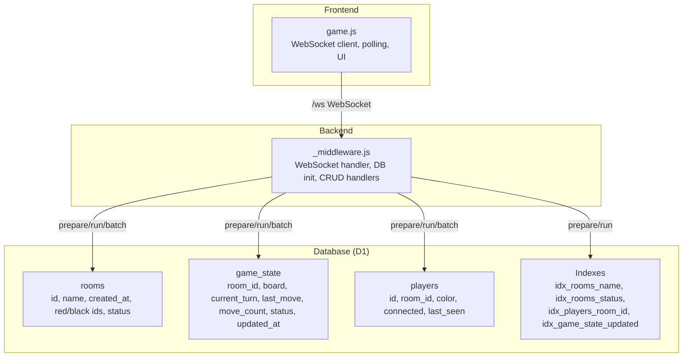

**Diagram sources**
- [_middleware.js:46-98](file://functions/_middleware.js#L46-L98)
- [schema.sql:5-41](file://schema.sql#L5-L41)
- [game.js:740-808](file://game.js#L740-L808)

**Section sources**
- [_middleware.js:104-122](file://functions/_middleware.js#L104-L122)
- [schema.sql:5-41](file://schema.sql#L5-L41)

## Core Components
- Database initialization and indexing: The middleware initializes tables and indexes on every request to ensure idempotency and performance.
- Room lifecycle: Create room, join room, leave room, and cleanup of stale/empty rooms.
- Game state management: Retrieve, validate, and update game state with optimistic concurrency control.
- Player connection tracking: Track connected status and last activity timestamps.
- Frontend polling: Periodic polling for opponent presence and move updates.

Key implementation references:
- Database initialization and indexes: [initializeDatabase:46-98](file://functions/_middleware.js#L46-L98)
- Room creation: [createRoom:282-351](file://functions/_middleware.js#L282-L351)
- Room join: [joinRoom:353-443](file://functions/_middleware.js#L353-L443)
- Room leave and cleanup: [leaveRoom:445-477](file://functions/_middleware.js#L445-L477), [cleanupRoom:499-505](file://functions/_middleware.js#L499-L505), [cleanupRoomIfEmpty:507-516](file://functions/_middleware.js#L507-L516)
- Game state retrieval: [handleGetGameState:685-707](file://functions/_middleware.js#L685-L707)
- Move handling with optimistic locking: [handleMove:522-683](file://functions/_middleware.js#L522-L683)
- Player connection updates: [handleMove:636-638](file://functions/_middleware.js#L636-L638), [leaveRoom:452-455](file://functions/_middleware.js#L452-L455)
- Frontend polling: [startOpponentPolling:1170-1194](file://game.js#L1170-L1194), [startMovePolling:1203-1227](file://game.js#L1203-L1227)

**Section sources**
- [_middleware.js:282-351](file://functions/_middleware.js#L282-L351)
- [_middleware.js:353-443](file://functions/_middleware.js#L353-L443)
- [_middleware.js:445-477](file://functions/_middleware.js#L445-L477)
- [_middleware.js:499-516](file://functions/_middleware.js#L499-L516)
- [_middleware.js:522-683](file://functions/_middleware.js#L522-L683)
- [_middleware.js:685-707](file://functions/_middleware.js#L685-L707)
- [game.js:1170-1227](file://game.js#L1170-L1227)

## Architecture Overview
The backend uses a single-threaded Pages Function per request plus per-instance in-memory connection map for WebSocket clients. Database operations are executed synchronously per request or within a batch. Optimistic concurrency control is enforced at the game state table using a monotonically increasing counter.

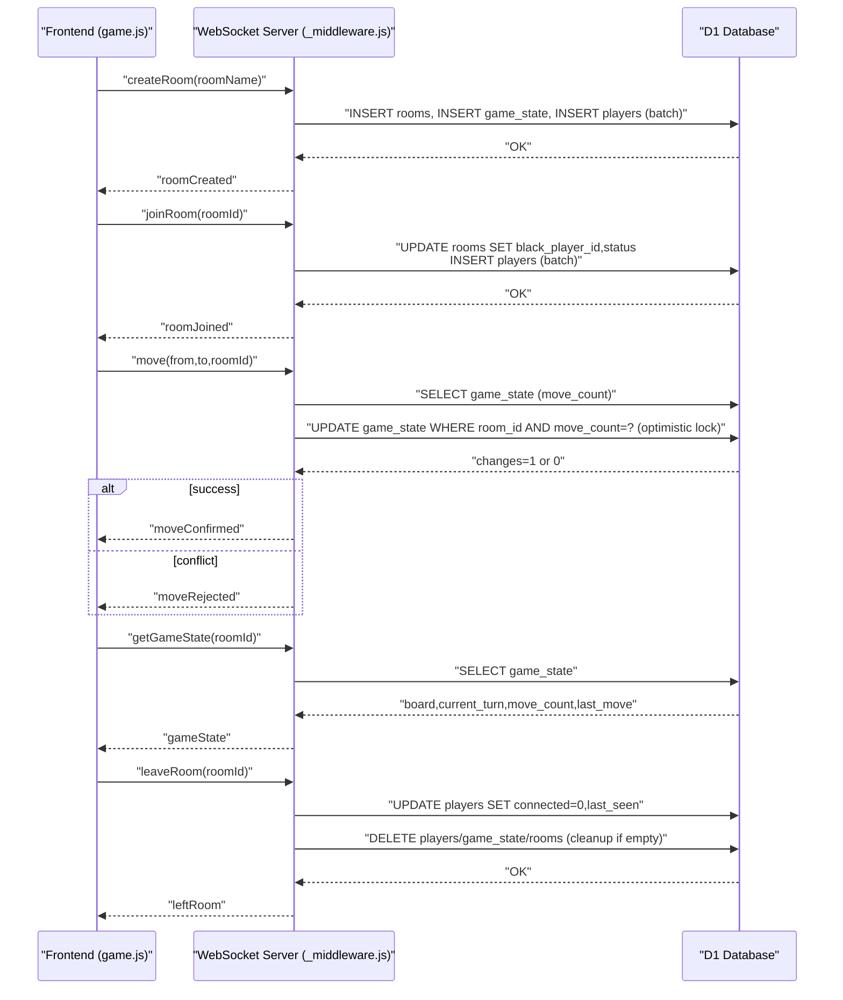

**Diagram sources**
- [_middleware.js:282-351](file://functions/_middleware.js#L282-L351)
- [_middleware.js:353-443](file://functions/_middleware.js#L353-L443)
- [_middleware.js:522-683](file://functions/_middleware.js#L522-L683)
- [_middleware.js:685-707](file://functions/_middleware.js#L685-L707)
- [_middleware.js:445-477](file://functions/_middleware.js#L445-L477)
- [_middleware.js:499-516](file://functions/_middleware.js#L499-L516)

## Detailed Component Analysis

### Database Schema and Indexes
- rooms: Unique room name, timestamps, player IDs, and status.
- game_state: Board representation, turn, last move, move count, status, and updated timestamp.
- players: Player-to-room foreign key, color, connection state, and last seen.
- Indexes: Name/status on rooms, room_id on players, updated_at on game_state.

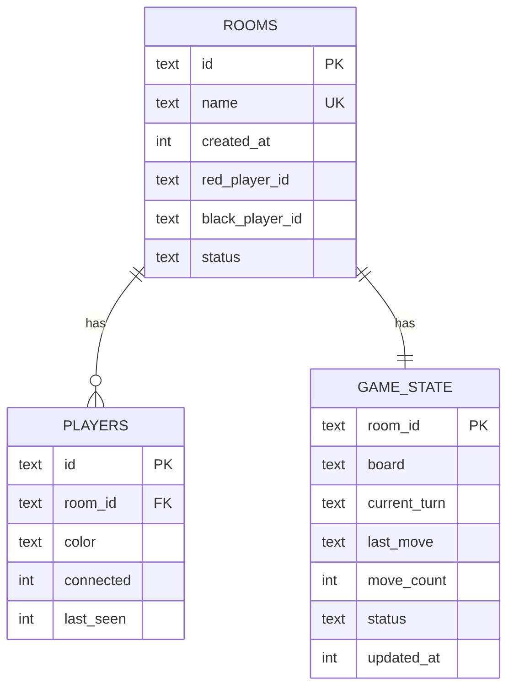

**Diagram sources**
- [schema.sql:5-41](file://schema.sql#L5-L41)

**Section sources**
- [schema.sql:5-41](file://schema.sql#L5-L41)

### Room Creation (CRUD)
- Validates room name, checks for duplicates, cleans stale rooms if needed, and inserts three records atomically using a batch.
- Sets initial game state with an empty board and move count zero.

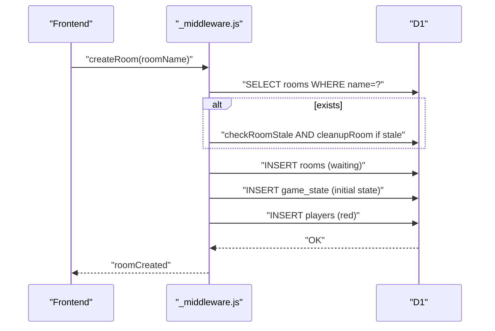

**Diagram sources**
- [_middleware.js:282-351](file://functions/_middleware.js#L282-L351)
- [_middleware.js:479-497](file://functions/_middleware.js#L479-L497)
- [_middleware.js:499-505](file://functions/_middleware.js#L499-L505)

**Section sources**
- [_middleware.js:282-351](file://functions/_middleware.js#L282-L351)
- [_middleware.js:479-516](file://functions/_middleware.js#L479-L516)

### Room Join (CRUD)
- Finds room by ID or name, validates capacity and status, then updates room with black player and inserts player record in a batch.
- Notifies the first player and broadcasts to the room.

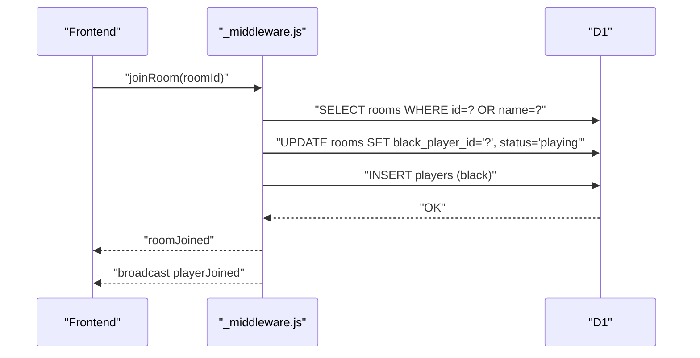

**Diagram sources**
- [_middleware.js:353-443](file://functions/_middleware.js#L353-L443)

**Section sources**
- [_middleware.js:353-443](file://functions/_middleware.js#L353-L443)

### Room Leave and Cleanup (CRUD)
- Marks player as disconnected and updates last seen.
- Broadcasts departure and triggers cleanup if no connected players remain.

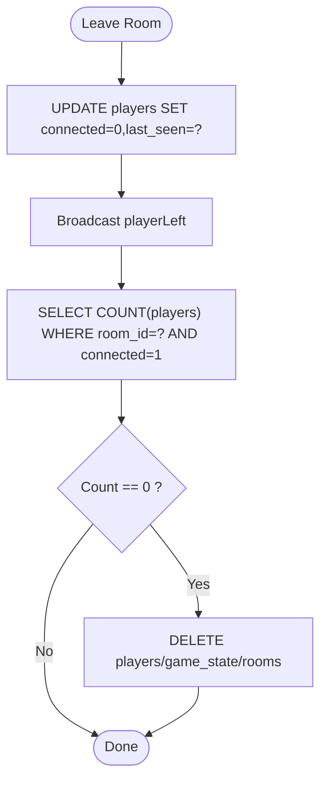

**Diagram sources**
- [_middleware.js:445-477](file://functions/_middleware.js#L445-L477)
- [_middleware.js:507-516](file://functions/_middleware.js#L507-L516)

**Section sources**
- [_middleware.js:445-477](file://functions/_middleware.js#L445-L477)
- [_middleware.js:507-516](file://functions/_middleware.js#L507-L516)

### Game State Retrieval (Read)
- Retrieves board, current turn, move count, and last move for a room.

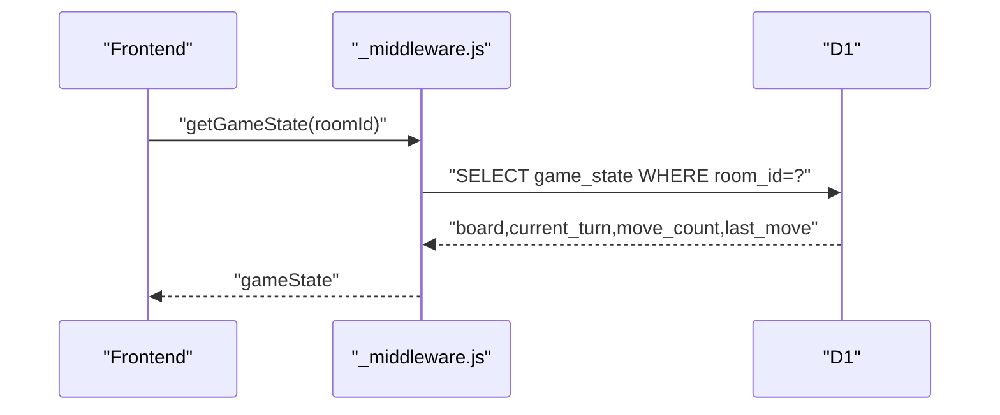

**Diagram sources**
- [_middleware.js:685-707](file://functions/_middleware.js#L685-L707)

**Section sources**
- [_middleware.js:685-707](file://functions/_middleware.js#L685-L707)

### Move Handling and Optimistic Concurrency Control
- Reads current game state including move_count.
- Validates turn and move legality.
- Updates board, turn, last_move, status, move_count, and updated_at.
- Uses a conditional UPDATE with WHERE clause matching the expected move_count to detect conflicts.
- On conflict, rejects the move and instructs the client to refresh.

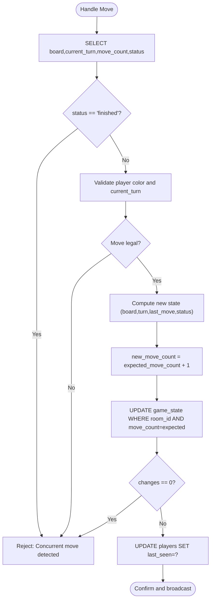

**Diagram sources**
- [_middleware.js:522-683](file://functions/_middleware.js#L522-L683)

**Section sources**
- [_middleware.js:522-683](file://functions/_middleware.js#L522-L683)

### Player Connection Updates
- On move: update last_seen for the moving player.
- On leave: mark player disconnected and update last_seen.

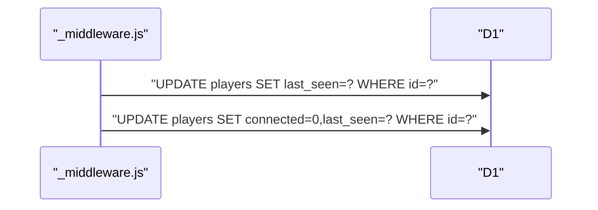

**Diagram sources**
- [_middleware.js:636-638](file://functions/_middleware.js#L636-L638)
- [_middleware.js:452-455](file://functions/_middleware.js#L452-L455)

**Section sources**
- [_middleware.js:636-638](file://functions/_middleware.js#L636-L638)
- [_middleware.js:452-455](file://functions/_middleware.js#L452-L455)

### Stale Room Detection and Cleanup
- A room is stale if it has no players or if all players are both disconnected and inactive beyond a timeout threshold.
- Cleanup removes all related records for the room.

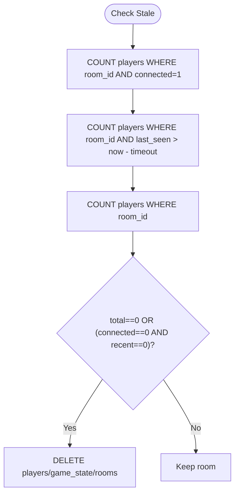

**Diagram sources**
- [_middleware.js:479-497](file://functions/_middleware.js#L479-L497)
- [_middleware.js:499-505](file://functions/_middleware.js#L499-L505)

**Section sources**
- [_middleware.js:479-497](file://functions/_middleware.js#L479-L497)
- [_middleware.js:499-505](file://functions/_middleware.js#L499-L505)

### Frontend Real-time Update Strategies
- Heartbeat: periodic ping/pong to keep the connection alive.
- Polling: periodically checks for opponent presence and pending moves when WebSocket is unavailable or lagging.
- Rejoin: re-establishes state after reconnection.

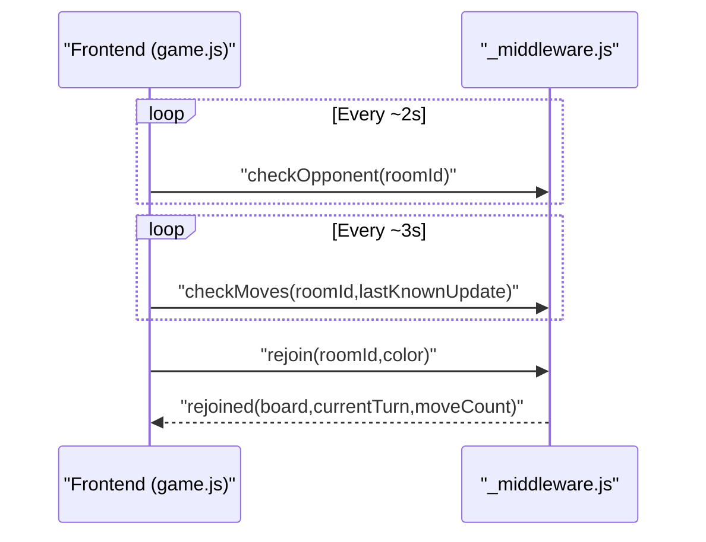

**Diagram sources**
- [game.js:1170-1227](file://game.js#L1170-L1227)
- [_middleware.js:282-351](file://functions/_middleware.js#L282-L351)

**Section sources**
- [game.js:842-882](file://game.js#L842-L882)
- [game.js:1170-1227](file://game.js#L1170-L1227)
- [_middleware.js:282-351](file://functions/_middleware.js#L282-L351)

## Dependency Analysis
- The middleware depends on D1 for all persistence operations and uses prepared statements with bound parameters.
- Batch operations are used to maintain atomicity for multi-table inserts during room creation/join.
- The frontend depends on the WebSocket endpoint for real-time updates and falls back to polling when needed.

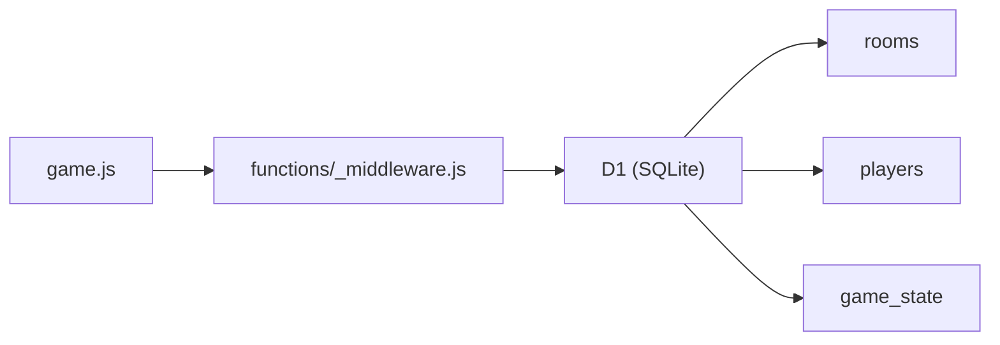

**Diagram sources**
- [_middleware.js:282-351](file://functions/_middleware.js#L282-L351)
- [schema.sql:5-41](file://schema.sql#L5-L41)

**Section sources**
- [_middleware.js:282-351](file://functions/_middleware.js#L282-L351)
- [schema.sql:5-41](file://schema.sql#L5-L41)

## Performance Considerations
- Indexes: Name/status on rooms, room_id on players, updated_at on game_state improve query performance for frequent lookups.
- Prepared statements: All queries use parameter binding to avoid SQL injection and enable plan reuse.
- Batch writes: Multi-table inserts are grouped to reduce round-trips.
- Stale room cleanup: Prevents accumulation of orphaned data.

[No sources needed since this section provides general guidance]

## Troubleshooting Guide
Common issues and resolutions:
- Database not configured: Ensure the D1 binding is present in the environment.
- Room creation failure: Validate room name uniqueness and staleness checks.
- Move rejected due to concurrency: Client should refresh state and retry.
- Stale room not cleaned: Verify stale detection logic and timeouts.
- Polling fallback: Enable polling when WebSocket is unavailable.

**Section sources**
- [_middleware.js:13-40](file://functions/_middleware.js#L13-L40)
- [_middleware.js:282-351](file://functions/_middleware.js#L282-L351)
- [_middleware.js:522-683](file://functions/_middleware.js#L522-L683)
- [_middleware.js:479-516](file://functions/_middleware.js#L479-L516)
- [game.js:1170-1227](file://game.js#L1170-L1227)

## Conclusion
The application employs straightforward, parameterized SQL with prepared statements and batch operations to maintain consistency. Optimistic concurrency control prevents race conditions on game state updates. Stale room detection and cleanup keep the database tidy. The frontend uses a combination of WebSocket events and polling to achieve robust real-time behavior.