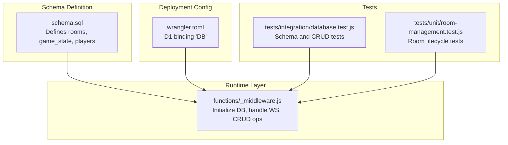
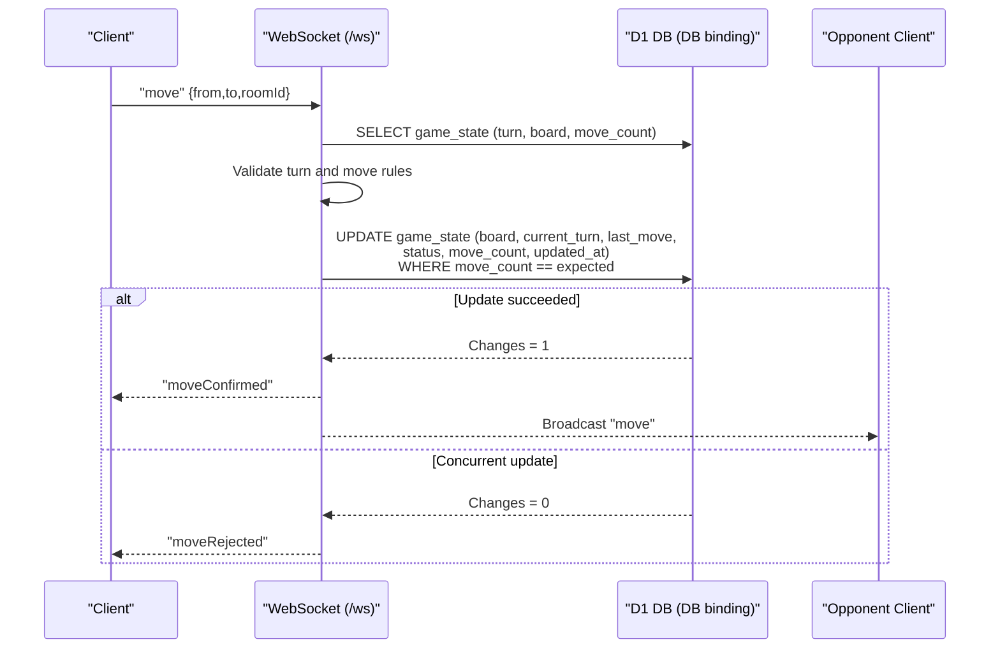
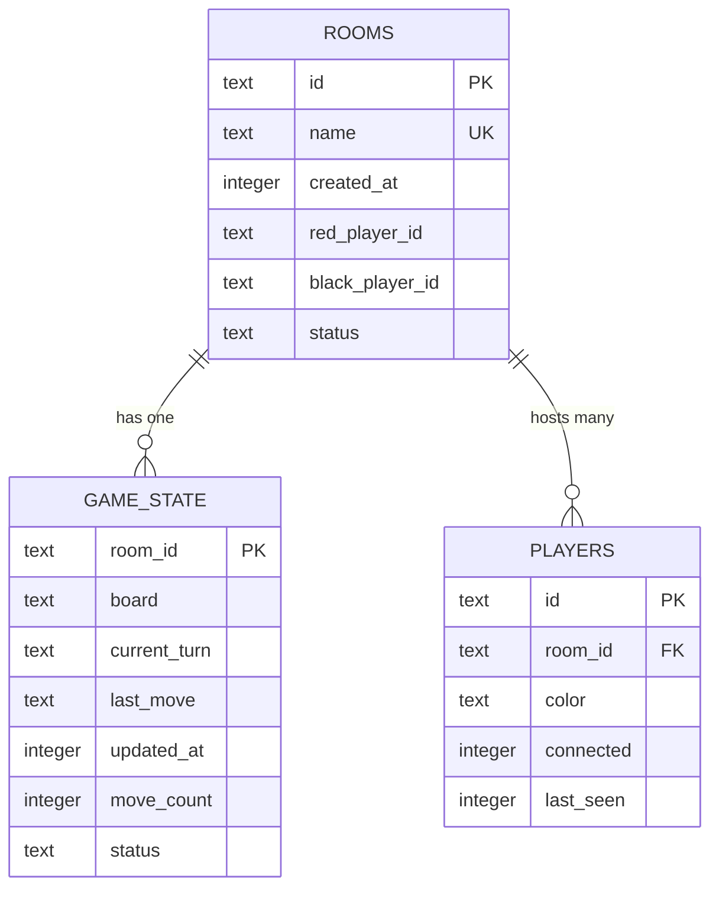
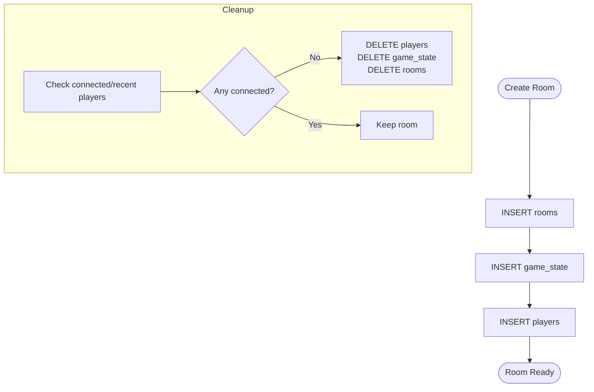
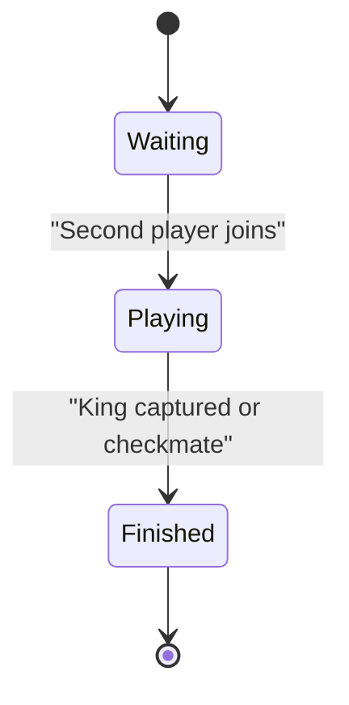
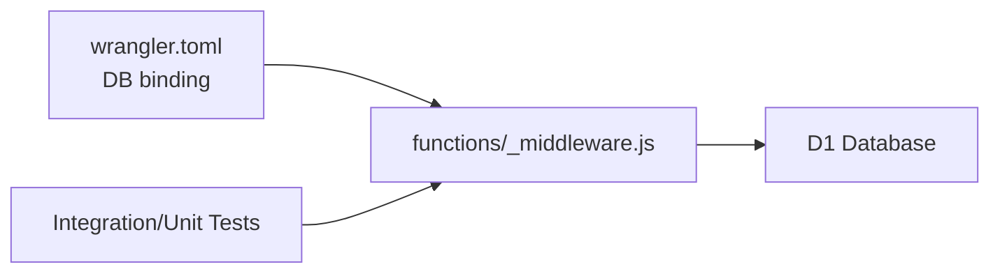

# Database Design

<cite>
**Referenced Files in This Document**
- [schema.sql](file://schema.sql)
- [functions/_middleware.js](file://functions/_middleware.js)
- [tests/integration/database.test.js](file://tests/integration/database.test.js)
- [tests/unit/room-management.test.js](file://tests/unit/room-management.test.js)
- [SETUP_D1.md](file://SETUP_D1.md)
- [SETUP_D1_DASHBOARD.md](file://SETUP_D1_DASHBOARD.md)
- [wrangler.toml](file://wrangler.toml)
- [README.md](file://README.md)
</cite>

## Table of Contents
1. [Introduction](#introduction)
2. [Project Structure](#project-structure)
3. [Core Components](#core-components)
4. [Architecture Overview](#architecture-overview)
5. [Detailed Component Analysis](#detailed-component-analysis)
6. [Dependency Analysis](#dependency-analysis)
7. [Performance Considerations](#performance-considerations)
8. [Troubleshooting Guide](#troubleshooting-guide)
9. [Conclusion](#conclusion)
10. [Appendices](#appendices)

## Introduction
This document provides comprehensive database design documentation for the D1 database schema used by the Chinese Chess online game. It covers the relational schema, entity relationships, indexing strategy, data access patterns, transaction handling, data lifecycle, validation rules, and operational guidance for migrations and backups. The schema is implemented as SQLite via Cloudflare D1 and is accessed through Pages Functions.

## Project Structure
The database schema is defined declaratively and is complemented by runtime initialization and operations in the backend middleware. Integration tests validate the schema and typical operations.

**Diagram sources**
- [schema.sql:1-42](file://schema.sql#L1-L42)
- [functions/_middleware.js:46-98](file://functions/_middleware.js#L46-L98)
- [wrangler.toml:14-17](file://wrangler.toml#L14-L17)
- [tests/integration/database.test.js:12-44](file://tests/integration/database.test.js#L12-L44)
- [tests/unit/room-management.test.js:290-330](file://tests/unit/room-management.test.js#L290-L330)

**Section sources**
- [schema.sql:1-42](file://schema.sql#L1-L42)
- [functions/_middleware.js:46-98](file://functions/_middleware.js#L46-L98)
- [wrangler.toml:14-17](file://wrangler.toml#L14-L17)
- [tests/integration/database.test.js:54-81](file://tests/integration/database.test.js#L54-L81)
- [tests/unit/room-management.test.js:290-330](file://tests/unit/room-management.test.js#L290-L330)

## Core Components
- rooms: Central room metadata and state, with foreign keys to player connections.
- game_state: Persistent game state per room, including board representation, turn, move count, and timestamps.
- players: Per-room player connection records with connectivity and activity tracking.

Key constraints and defaults:
- rooms.id is the primary key; name is unique and not null; status defaults to waiting.
- game_state.room_id is the primary key and a foreign key to rooms.id with cascade delete.
- players.room_id is a foreign key to rooms.id with cascade delete; color indicates side; connected defaults to 1; last_seen tracks activity.

**Section sources**
- [schema.sql:6-13](file://schema.sql#L6-L13)
- [schema.sql:16-25](file://schema.sql#L16-L25)
- [schema.sql:28-35](file://schema.sql#L28-L35)

## Architecture Overview
The backend initializes the schema on every request and orchestrates multiplayer operations via WebSocket. Moves are validated locally and persisted atomically with optimistic concurrency checks.

**Diagram sources**
- [functions/_middleware.js:522-683](file://functions/_middleware.js#L522-L683)

**Section sources**
- [functions/_middleware.js:522-683](file://functions/_middleware.js#L522-L683)

## Detailed Component Analysis

### Entity Relationship Model

Notes:
- The rooms.name is unique (enforced by UNIQUE constraint).
- game_state.room_id is both PK and FK to rooms.id with ON DELETE CASCADE.
- players.room_id is FK to rooms.id with ON DELETE CASCADE.

**Diagram sources**
- [schema.sql:6-13](file://schema.sql#L6-L13)
- [schema.sql:16-25](file://schema.sql#L16-L25)
- [schema.sql:28-35](file://schema.sql#L28-L35)

**Section sources**
- [schema.sql:6-13](file://schema.sql#L6-L13)
- [schema.sql:16-25](file://schema.sql#L16-L25)
- [schema.sql:28-35](file://schema.sql#L28-L35)

### Indexing Strategy
Indexes are created to optimize frequent queries:
- idx_rooms_name: Speeds up lookup by room name.
- idx_rooms_status: Supports filtering rooms by status.
- idx_players_room_id: Efficiently lists players per room.
- idx_game_state_updated: Optimizes queries ordering by last update.

These indexes align with observed usage patterns in room discovery, player enumeration, and stale room cleanup.

**Section sources**
- [schema.sql:38-41](file://schema.sql#L38-L41)
- [functions/_middleware.js:482-496](file://functions/_middleware.js#L482-L496)

### Data Access Patterns and Transactions
- Initialization: The middleware creates tables and indexes idempotently on every request to ensure schema availability.
- Batch operations: Room creation and join operations use batched statements to maintain atomicity across rooms, game_state, and players.
- Optimistic concurrency: Move updates include a condition on move_count to avoid overwriting concurrent changes.
- Cleanup: Stale rooms are removed by cascading deletes from rooms to related entries.

**Diagram sources**
- [functions/_middleware.js:322-329](file://functions/_middleware.js#L322-L329)
- [functions/_middleware.js:499-505](file://functions/_middleware.js#L499-L505)
- [functions/_middleware.js:479-497](file://functions/_middleware.js#L479-L497)

**Section sources**
- [functions/_middleware.js:46-98](file://functions/_middleware.js#L46-L98)
- [functions/_middleware.js:322-329](file://functions/_middleware.js#L322-L329)
- [functions/_middleware.js:499-505](file://functions/_middleware.js#L499-L505)
- [functions/_middleware.js:479-497](file://functions/_middleware.js#L479-L497)

### CRUD Operations
- Rooms
  - Create: Insert into rooms, game_state, and players in a batch.
  - Read: Lookup by id or name; filter by status.
  - Update: Change status and player assignments.
  - Delete: Cascade cleanup via rooms deletion.
- Game State
  - Read: Retrieve board, turn, last_move, move_count.
  - Update: Persist new board, turn, last_move, status, move_count, updated_at with optimistic lock.
- Players
  - Create: Insert player record with room_id and color.
  - Update: Toggle connected flag and update last_seen.
  - Delete: Cascaded on room removal.

**Section sources**
- [functions/_middleware.js:282-351](file://functions/_middleware.js#L282-L351)
- [functions/_middleware.js:353-443](file://functions/_middleware.js#L353-L443)
- [functions/_middleware.js:522-683](file://functions/_middleware.js#L522-L683)
- [tests/integration/database.test.js:91-144](file://tests/integration/database.test.js#L91-L144)
- [tests/integration/database.test.js:155-201](file://tests/integration/database.test.js#L155-L201)
- [tests/integration/database.test.js:211-266](file://tests/integration/database.test.js#L211-L266)

### Data Lifecycle
- Room creation: Initializes rooms, game_state, and the first player.
- Player join: Adds the second player, transitions room to playing, and notifies opponents.
- Move lifecycle: Validates turn and rules, applies optimistic concurrency, updates last_move, and broadcasts.
- Cleanup: Detects stale rooms (no players or all disconnected/inactive) and removes all related data.

**Diagram sources**
- [functions/_middleware.js:353-443](file://functions/_middleware.js#L353-L443)
- [functions/_middleware.js:522-683](file://functions/_middleware.js#L522-L683)
- [functions/_middleware.js:479-516](file://functions/_middleware.js#L479-L516)

**Section sources**
- [functions/_middleware.js:353-443](file://functions/_middleware.js#L353-L443)
- [functions/_middleware.js:522-683](file://functions/_middleware.js#L522-L683)
- [functions/_middleware.js:479-516](file://functions/_middleware.js#L479-L516)

### Data Validation and Integrity
- Constraints enforced by schema:
  - rooms.name is unique and not null.
  - game_state.room_id references rooms.id with cascade delete.
  - players.room_id references rooms.id with cascade delete.
- Runtime validations:
  - Room name uniqueness checked before creation; stale room cleanup attempted if conflict arises.
  - Turn validation ensures only the current side can move.
  - Optimistic concurrency prevents overwrites when multiple clients attempt simultaneous moves.
  - Status transitions enforce valid room states (waiting, playing, finished).

**Section sources**
- [schema.sql:8](file://schema.sql#L8)
- [schema.sql:24](file://schema.sql#L24)
- [schema.sql:34](file://schema.sql#L34)
- [functions/_middleware.js:291-315](file://functions/_middleware.js#L291-L315)
- [functions/_middleware.js:550-574](file://functions/_middleware.js#L550-L574)
- [functions/_middleware.js:619-634](file://functions/_middleware.js#L619-L634)

### Examples of Common Queries
- Create a room and initial state:
  - Insert into rooms, game_state, and players.
- Join a room:
  - Update rooms with black player and insert player record.
- Get game state:
  - SELECT board, current_turn, move_count, last_move from game_state by room_id.
- Update game state:
  - UPDATE game_state with optimistic lock on move_count.
- Cleanup stale room:
  - DELETE from players, game_state, rooms by room_id.

**Section sources**
- [functions/_middleware.js:322-329](file://functions/_middleware.js#L322-L329)
- [functions/_middleware.js:399-404](file://functions/_middleware.js#L399-L404)
- [functions/_middleware.js:685-707](file://functions/_middleware.js#L685-L707)
- [functions/_middleware.js:619-622](file://functions/_middleware.js#L619-L622)
- [functions/_middleware.js:499-505](file://functions/_middleware.js#L499-L505)

### Data Migration Procedures
- Schema evolution:
  - Add new columns with defaults or NOT NULL with migration steps.
  - Recreate indexes if column selection changes.
- Backward compatibility:
  - Ensure new columns are optional and default to safe values.
- Zero-downtime:
  - Use idempotent initialization to avoid breaking existing deployments.

[No sources needed since this section provides general guidance]

### Backup Strategies
- D1 native backup:
  - Use Cloudflare’s D1 backup and restore capabilities via dashboard or CLI.
- Export/import:
  - Periodically export schema and data snapshots for off-site retention.
- Disaster recovery:
  - Maintain a documented procedure to recreate schema and restore latest snapshot.

[No sources needed since this section provides general guidance]

## Dependency Analysis
- Backend depends on D1 binding named DB.
- Middleware initializes schema and performs all CRUD operations.
- Tests validate schema presence and typical operations.

**Diagram sources**
- [wrangler.toml:14-17](file://wrangler.toml#L14-L17)
- [functions/_middleware.js:46-98](file://functions/_middleware.js#L46-L98)
- [tests/integration/database.test.js:54-81](file://tests/integration/database.test.js#L54-L81)

**Section sources**
- [wrangler.toml:14-17](file://wrangler.toml#L14-L17)
- [functions/_middleware.js:46-98](file://functions/_middleware.js#L46-L98)
- [tests/integration/database.test.js:54-81](file://tests/integration/database.test.js#L54-L81)

## Performance Considerations
- Indexes:
  - Maintain idx_rooms_name, idx_rooms_status, idx_players_room_id, idx_game_state_updated.
- Query patterns:
  - Prefer indexed columns in WHERE clauses (name, status, room_id, updated_at).
- Concurrency:
  - Optimistic locking reduces contention; monitor rejected moves and retry client-side.
- Storage:
  - game_state.board is stored as JSON; keep serialized size reasonable to minimize I/O.

[No sources needed since this section provides general guidance]

## Troubleshooting Guide
- Database not configured:
  - Verify D1 binding variable name is DB and points to the correct database.
- Table does not exist:
  - Ensure schema initialization ran; confirm tables appear in sqlite_master.
- Room not found or join fails:
  - Check rooms existence and status; ensure room is not finished.
- Move rejected:
  - Indicates concurrent move; client should refresh state and retry.

**Section sources**
- [SETUP_D1.md:121-140](file://SETUP_D1.md#L121-L140)
- [SETUP_D1_DASHBOARD.md:126-153](file://SETUP_D1_DASHBOARD.md#L126-L153)
- [functions/_middleware.js:522-683](file://functions/_middleware.js#L522-L683)

## Conclusion
The D1 schema for the Chinese Chess game is compact, normalized, and optimized for real-time multiplayer operations. The backend enforces referential integrity, handles concurrency carefully, and maintains a clean separation between persistent state and transient WebSocket connections. With proper indexing and operational hygiene, the system supports scalable multiplayer gameplay.

## Appendices

### Appendix A: Schema Definitions
- rooms: id (PK), name (UNIQUE, NOT NULL), created_at (NOT NULL), red_player_id, black_player_id, status (DEFAULT 'waiting').
- game_state: room_id (PK, FK to rooms.id, ON DELETE CASCADE), board (NOT NULL), current_turn (NOT NULL), last_move, updated_at (NOT NULL), move_count (DEFAULT 0), status (DEFAULT 'playing').
- players: id (PK), room_id (FK to rooms.id, ON DELETE CASCADE), color (NOT NULL), connected (DEFAULT 1), last_seen (NOT NULL).

**Section sources**
- [schema.sql:6-13](file://schema.sql#L6-L13)
- [schema.sql:16-25](file://schema.sql#L16-L25)
- [schema.sql:28-35](file://schema.sql#L28-L35)

### Appendix B: Initialization and Deployment
- Initialize schema via wrangler CLI or dashboard console.
- Ensure D1 binding 'DB' is configured in wrangler.toml.
- Verify tables exist post-deployment.

**Section sources**
- [SETUP_D1.md:46-66](file://SETUP_D1.md#L46-L66)
- [SETUP_D1_DASHBOARD.md:68-84](file://SETUP_D1_DASHBOARD.md#L68-L84)
- [wrangler.toml:14-17](file://wrangler.toml#L14-L17)