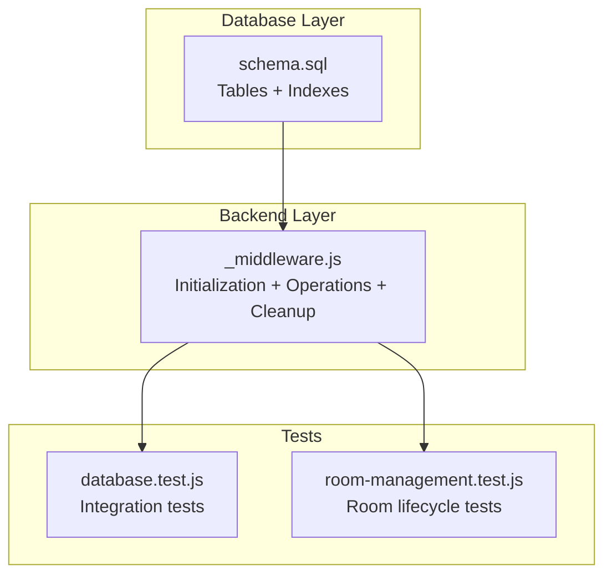
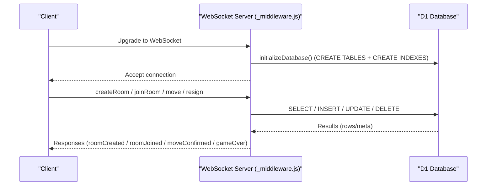
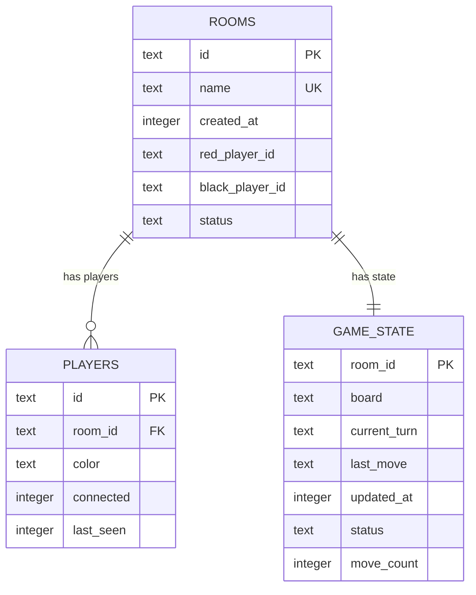
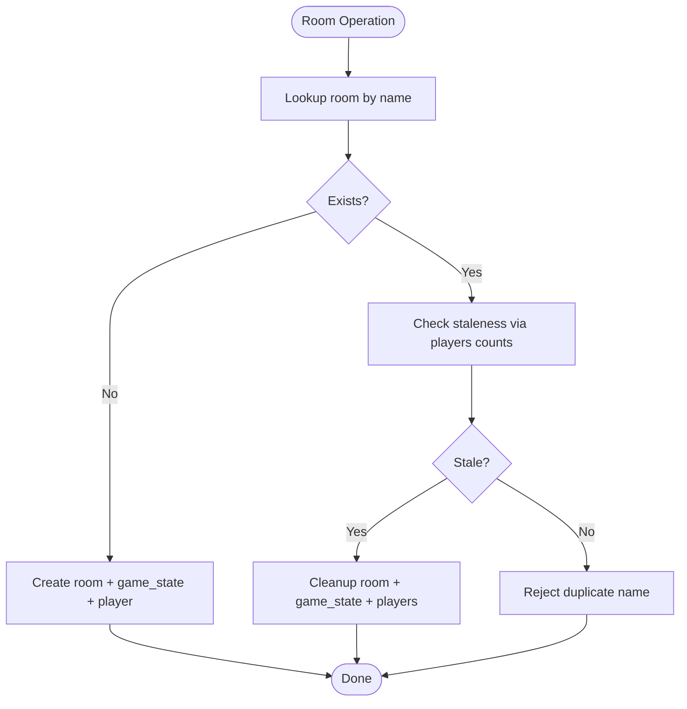
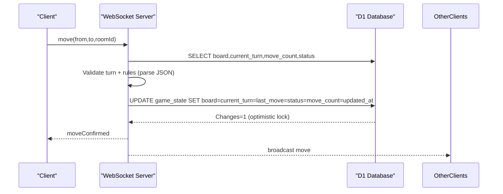
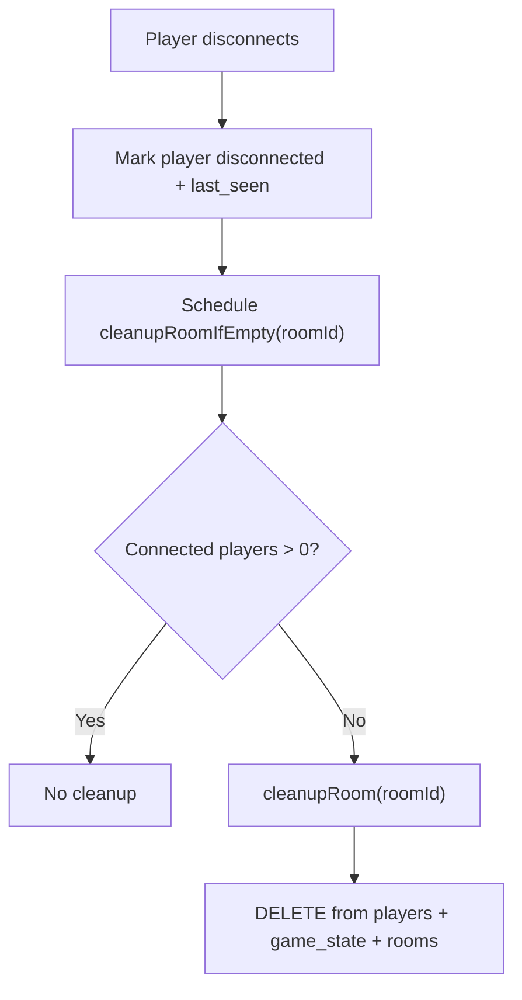
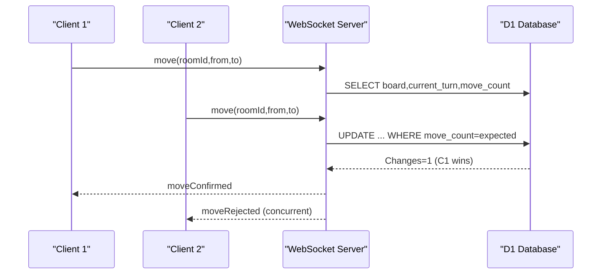
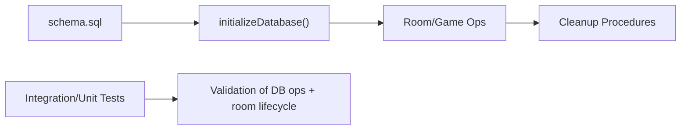

# Performance Optimization

<cite>
**Referenced Files in This Document**
- [schema.sql](file://schema.sql)
- [_middleware.js](file://functions/_middleware.js)
- [database.test.js](file://tests/integration/database.test.js)
- [room-management.test.js](file://tests/unit/room-management.test.js)
- [README.md](file://README.md)
</cite>

## Table of Contents
1. [Introduction](#introduction)
2. [Project Structure](#project-structure)
3. [Core Components](#core-components)
4. [Architecture Overview](#architecture-overview)
5. [Detailed Component Analysis](#detailed-component-analysis)
6. [Dependency Analysis](#dependency-analysis)
7. [Performance Considerations](#performance-considerations)
8. [Troubleshooting Guide](#troubleshooting-guide)
9. [Conclusion](#conclusion)

## Introduction
This document analyzes the database performance optimization strategies implemented in the Chinese Chess game’s schema and application code. It explains the purpose and benefits of each index, how they support the application’s query patterns, and details the JSON storage approach for board state and its performance implications. It also documents the timestamp-based cleanup procedures that prevent database bloat, the indexing strategy for optimal room search and player lookup efficiency, and provides recommendations for monitoring performance, identifying bottlenecks, and scaling considerations. Memory usage patterns and how JSON-based board storage optimizes for frequent updates are covered.

## Project Structure
The performance-critical parts of the system are:
- Database schema and indexes defined in the schema file
- Backend middleware that initializes tables and indexes, performs room and game operations, and manages cleanup
- Integration and unit tests that validate database operations and room lifecycle

**Diagram sources**
- [schema.sql:37-42](file://schema.sql#L37-L42)
- [_middleware.js:46-98](file://functions/_middleware.js#L46-L98)
- [database.test.js:12-44](file://tests/integration/database.test.js#L12-L44)
- [room-management.test.js:290-343](file://tests/unit/room-management.test.js#L290-L343)

**Section sources**
- [README.md:162-175](file://README.md#L162-L175)
- [schema.sql:1-42](file://schema.sql#L1-L42)
- [_middleware.js:104-122](file://functions/_middleware.js#L104-L122)

## Core Components
- Rooms table: stores room metadata and status, enabling room search by name and filtering by status.
- Game state table: stores serialized board state as JSON, current turn, last move, updated timestamp, and move count.
- Players table: tracks player membership in rooms, connection state, and last seen timestamps.
- Indexes: optimize common queries for room name lookup, room status filtering, player room association, and game state timestamp scanning.

These components underpin the application’s real-time multiplayer gameplay and require efficient reads/writes to maintain responsiveness.

**Section sources**
- [schema.sql:6-13](file://schema.sql#L6-L13)
- [schema.sql:16-25](file://schema.sql#L16-L25)
- [schema.sql:28-35](file://schema.sql#L28-L35)
- [schema.sql:37-42](file://schema.sql#L37-L42)

## Architecture Overview
The backend initializes database tables and indexes on every request (idempotent), handles WebSocket connections, and executes room and game operations. Timestamp-based cleanup removes stale rooms and related data to prevent bloat.

**Diagram sources**
- [_middleware.js:104-122](file://functions/_middleware.js#L104-L122)
- [_middleware.js:46-98](file://functions/_middleware.js#L46-L98)
- [_middleware.js:282-351](file://functions/_middleware.js#L282-L351)
- [_middleware.js:353-443](file://functions/_middleware.js#L353-L443)
- [_middleware.js:522-683](file://functions/_middleware.js#L522-L683)

## Detailed Component Analysis

### Index Strategy and Query Patterns
The schema defines four indexes to accelerate common operations:
- idx_rooms_name: supports fast room lookup by name during creation and joining.
- idx_rooms_status: enables filtering rooms by status (e.g., waiting vs playing).
- idx_players_room_id: accelerates player queries by room and cleanup scans.
- idx_game_state_updated: supports timestamp-based polling and cleanup.

**Diagram sources**
- [schema.sql:6-13](file://schema.sql#L6-L13)
- [schema.sql:16-25](file://schema.sql#L16-L25)
- [schema.sql:28-35](file://schema.sql#L28-L35)

**Section sources**
- [schema.sql:37-42](file://schema.sql#L37-L42)
- [_middleware.js:86-90](file://functions/_middleware.js#L86-L90)

### Room Search and Player Lookup Efficiency
- Room search by name: The backend queries rooms by name to prevent duplicates and to find existing rooms. The index on rooms(name) ensures O(log N) lookup cost.
- Room status filtering: The index on rooms(status) allows efficient filtering of available rooms (e.g., waiting).
- Player room association: The index on players(room_id) supports counting connected players, detecting stale rooms, and cleaning up empty rooms.

**Diagram sources**
- [_middleware.js:299-315](file://functions/_middleware.js#L299-L315)
- [_middleware.js:479-497](file://functions/_middleware.js#L479-L497)
- [_middleware.js:499-505](file://functions/_middleware.js#L499-L505)

**Section sources**
- [_middleware.js:299-315](file://functions/_middleware.js#L299-L315)
- [_middleware.js:374-382](file://functions/_middleware.js#L374-L382)
- [_middleware.js:479-497](file://functions/_middleware.js#L479-L497)
- [_middleware.js:499-505](file://functions/_middleware.js#L499-L505)

### JSON Storage Approach for Board State and Performance Implications
- The board state is stored as a JSON string in the game_state table. This simplifies writes by serializing the entire board on each move, avoiding complex column updates.
- Reads parse the JSON to render the UI and validate moves. This balances simplicity with acceptable performance for typical move frequencies.
- The approach reduces schema complexity and minimizes write contention compared to updating individual piece positions.

**Diagram sources**
- [_middleware.js:522-683](file://functions/_middleware.js#L522-L683)
- [_middleware.js:685-707](file://functions/_middleware.js#L685-L707)

**Section sources**
- [schema.sql:16-25](file://schema.sql#L16-L25)
- [_middleware.js:522-683](file://functions/_middleware.js#L522-L683)

### Timestamp-Based Cleanup Procedures
- Stale room detection: A room is considered stale if there are no connected players and no recent activity within a timeout window.
- Cleanup: When a room is empty or stale, the backend deletes associated records from players, game_state, and rooms in a batch to prevent orphaned data.
- Disconnection handling: On WebSocket close, the backend marks the player as disconnected and schedules cleanup after a delay to allow reconnection.

**Diagram sources**
- [_middleware.js:1213-1240](file://functions/_middleware.js#L1213-L1240)
- [_middleware.js:507-516](file://functions/_middleware.js#L507-L516)
- [_middleware.js:499-505](file://functions/_middleware.js#L499-L505)

**Section sources**
- [_middleware.js:1213-1240](file://functions/_middleware.js#L1213-L1240)
- [_middleware.js:507-516](file://functions/_middleware.js#L507-L516)
- [_middleware.js:499-505](file://functions/_middleware.js#L499-L505)

### Optimistic Locking and Concurrency Control
- The backend uses move_count as a version field to implement optimistic locking. Updates succeed only if the stored move_count matches the expected value.
- This prevents race conditions when multiple clients attempt moves concurrently, reducing conflicts and retries.

**Diagram sources**
- [_middleware.js:532-549](file://functions/_middleware.js#L532-L549)
- [_middleware.js:619-634](file://functions/_middleware.js#L619-L634)

**Section sources**
- [_middleware.js:532-549](file://functions/_middleware.js#L532-L549)
- [_middleware.js:619-634](file://functions/_middleware.js#L619-L634)

### Monitoring Database Performance and Identifying Bottlenecks
- Monitor query patterns: Track queries on rooms(name), rooms(status), players(room_id), and game_state(updated_at) to ensure indexes are used effectively.
- Measure latency: Use Cloudflare Workers logs and D1 metrics to observe slow queries and long-running transactions.
- Observe cleanup effectiveness: Validate that stale rooms are removed promptly and that database size remains bounded.

[No sources needed since this section provides general guidance]

### Recommendations for Scaling Considerations
- Connection pooling and batching: Use batch operations for room creation and updates to reduce overhead.
- Index coverage: Ensure all commonly filtered/sorted columns are indexed; monitor for index-only scans.
- JSON size awareness: As games progress, JSON size grows. Consider compression or partitioning strategies if needed.
- Horizontal scaling: Offload read-heavy operations (e.g., polling last_move updates) to cache layers or CDN-backed static snapshots.

[No sources needed since this section provides general guidance]

## Dependency Analysis
The backend depends on the schema for table definitions and indexes. The middleware orchestrates initialization, operations, and cleanup. Tests validate database operations and room lifecycle.

**Diagram sources**
- [schema.sql:46-90](file://schema.sql#L46-L90)
- [_middleware.js:46-98](file://functions/_middleware.js#L46-L98)
- [database.test.js:54-81](file://tests/integration/database.test.js#L54-L81)
- [room-management.test.js:290-343](file://tests/unit/room-management.test.js#L290-L343)

**Section sources**
- [schema.sql:46-90](file://schema.sql#L46-L90)
- [_middleware.js:46-98](file://functions/_middleware.js#L46-L98)
- [database.test.js:54-81](file://tests/integration/database.test.js#L54-L81)
- [room-management.test.js:290-343](file://tests/unit/room-management.test.js#L290-L343)

## Performance Considerations
- Index selection: The four indexes align with the application’s primary query patterns—room name lookup, status filtering, player room association, and timestamp scanning.
- Write amplification: JSON serialization on each move simplifies updates but increases write volume; consider periodic compaction or snapshotting if needed.
- Cleanup cadence: Stale room detection and cleanup prevent unbounded growth; tune timeouts based on expected user behavior.
- Memory usage: Frontend parses JSON for rendering and validation; ensure efficient parsing and avoid unnecessary deep copies.

[No sources needed since this section provides general guidance]

## Troubleshooting Guide
- Duplicate room names: If a room exists with the same name, the backend checks staleness and cleans it up if stale; otherwise, it rejects the creation.
- Stale rooms: Rooms with no connected players and no recent activity are cleaned up automatically.
- Cleanup failures: Ensure batch deletions are executed in the correct order to respect foreign key constraints.

**Section sources**
- [_middleware.js:299-315](file://functions/_middleware.js#L299-L315)
- [_middleware.js:479-497](file://functions/_middleware.js#L479-L497)
- [_middleware.js:499-505](file://functions/_middleware.js#L499-L505)

## Conclusion
The Chinese Chess game employs targeted indexing, JSON-based board storage, and timestamp-driven cleanup to achieve efficient room search, player lookup, and game state persistence. The optimistic locking mechanism ensures consistency under concurrency. Together, these strategies balance simplicity, performance, and scalability for a real-time multiplayer experience on Cloudflare Pages with D1.