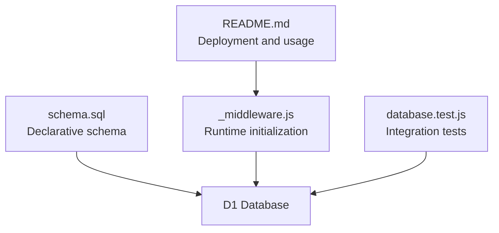
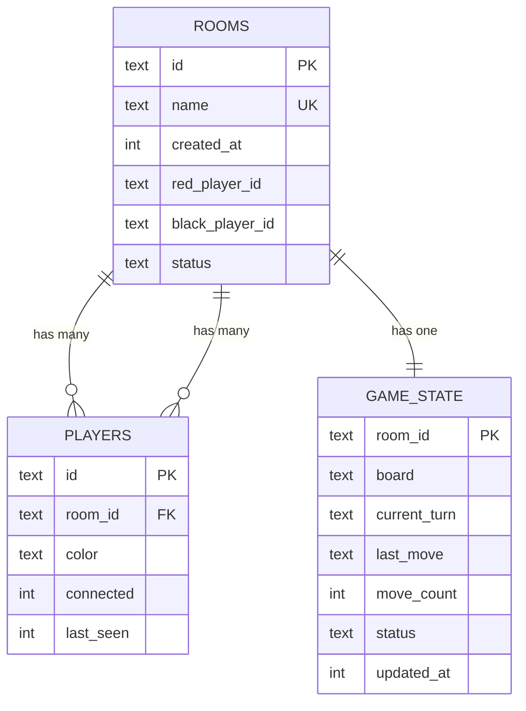
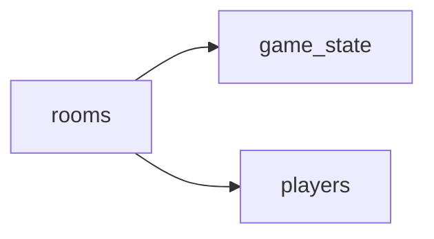

# Schema Overview

<cite>
**Referenced Files in This Document**
- [schema.sql](file://schema.sql)
- [_middleware.js](file://functions/_middleware.js)
- [database.test.js](file://tests/integration/database.test.js)
- [README.md](file://README.md)
</cite>

## Table of Contents
1. [Introduction](#introduction)
2. [Project Structure](#project-structure)
3. [Core Components](#core-components)
4. [Architecture Overview](#architecture-overview)
5. [Detailed Component Analysis](#detailed-component-analysis)
6. [Dependency Analysis](#dependency-analysis)
7. [Performance Considerations](#performance-considerations)
8. [Troubleshooting Guide](#troubleshooting-guide)
9. [Conclusion](#conclusion)

## Introduction
This document provides a comprehensive schema overview for the Chinese Chess database design. The system uses a simple three-table structure (rooms, game_state, players) to model a real-time multiplayer game hosted on Cloudflare Pages with D1 (SQLite). The design emphasizes simplicity, referential integrity via foreign keys, and efficient query patterns for room discovery, game state retrieval, and player tracking.

## Project Structure
The database schema is defined declaratively and is also programmatically created during request handling. Supporting tests mirror the schema for verification.

**Diagram sources**
- [schema.sql:1-42](file://schema.sql#L1-L42)
- [_middleware.js:46-98](file://functions/_middleware.js#L46-L98)
- [database.test.js:12-44](file://tests/integration/database.test.js#L12-L44)
- [README.md:162-175](file://README.md#L162-L175)

**Section sources**
- [schema.sql:1-42](file://schema.sql#L1-L42)
- [_middleware.js:46-98](file://functions/_middleware.js#L46-L98)
- [database.test.js:12-44](file://tests/integration/database.test.js#L12-L44)
- [README.md:162-175](file://README.md#L162-L175)

## Core Components
The schema consists of three tables:

- rooms: Stores room metadata, player assignments, and room lifecycle status.
- game_state: Stores per-room game state, including the board layout, turn indicator, last move, counts, and timestamps.
- players: Tracks player identities, their assigned room, color assignment, connectivity, and recency.

Key design characteristics:
- All identifiers (ids) are stored as TEXT to align with Cloudflare Pages/D1 string-based IDs and to avoid integer overflow concerns.
- Timestamps are stored as INTEGER (epoch milliseconds) for simplicity and portability across platforms.
- Complex data (board state, last move) is stored as JSON strings in TEXT columns to minimize schema complexity and leverage application-side validation.
- Foreign keys enforce referential integrity with cascading deletes to keep related data consistent.

**Section sources**
- [schema.sql:6-13](file://schema.sql#L6-L13)
- [schema.sql:16-25](file://schema.sql#L16-L25)
- [schema.sql:28-35](file://schema.sql#L28-L35)

## Architecture Overview
The three-table architecture enforces a strict one-to-one relationship between rooms and game_state, and a one-to-many relationship between rooms and players. The foreign keys ensure that deleting a room automatically cleans up associated game_state and players records.

**Diagram sources**
- [schema.sql:6-13](file://schema.sql#L6-L13)
- [schema.sql:16-25](file://schema.sql#L16-L25)
- [schema.sql:28-35](file://schema.sql#L28-L35)

## Detailed Component Analysis

### rooms table
Purpose:
- Encapsulates room metadata and lifecycle.
- Tracks player assignments for red and black sides.
- Maintains room status for UI and game logic.

Primary key and uniqueness:
- id is the primary key.
- name is unique to simplify discovery and reduce ambiguity.

Foreign keys:
- None in rooms; it is the parent entity.

Indexes:
- Name lookup is supported by an index on name.
- Status is indexed to support filtering by room availability.

Data types rationale:
- id and player ids as TEXT to match runtime identifiers.
- created_at as INTEGER for timestamps.
- status as TEXT for simple state enumeration.

**Section sources**
- [schema.sql:6-13](file://schema.sql#L6-L13)
- [schema.sql:38-39](file://schema.sql#L38-L39)

### game_state table
Purpose:
- Stores the canonical game state for each room.
- Holds the serialized board, turn indicator, last move, move count, and timestamps.

Primary key:
- room_id is the primary key and also a foreign key to rooms.

Foreign keys:
- room_id references rooms(id) with ON DELETE CASCADE to ensure cleanup.

Indexes:
- updated_at is indexed to support sorting or polling by recency.

Data types rationale:
- room_id as TEXT to match rooms.id.
- board and last_move as TEXT (JSON strings) to avoid complex nested schemas.
- current_turn and status as TEXT for enumerations.
- move_count as INTEGER for optimistic concurrency control.
- updated_at and move_count as INTEGER for timestamps and counters.

**Section sources**
- [schema.sql:16-25](file://schema.sql#L16-L25)
- [schema.sql:41-41](file://schema.sql#L41-L41)

### players table
Purpose:
- Tracks player identity, room membership, color, connectivity, and activity.

Primary key:
- id is the primary key.

Foreign keys:
- room_id references rooms(id) with ON DELETE CASCADE to clean up player records when a room is removed.

Indexes:
- room_id is indexed to efficiently list players in a room and to support room-scoped queries.

Data types rationale:
- id and room_id as TEXT to match runtime identifiers.
- color as TEXT for player color enumeration.
- connected and last_seen as INTEGER for booleans and timestamps.

**Section sources**
- [schema.sql:28-35](file://schema.sql#L28-L35)
- [schema.sql:40-40](file://schema.sql#L40-L40)

### Indexing Strategy
- idx_rooms_name: Optimizes room name lookups and discovery.
- idx_rooms_status: Supports filtering rooms by availability/status.
- idx_players_room_id: Efficiently lists players per room and supports room-scoped queries.
- idx_game_state_updated: Enables sorting or polling by last update time.

These indexes align with typical application patterns:
- Finding a room by name or filtering by status.
- Listing players in a room.
- Polling or sorting game states by recency.

**Section sources**
- [schema.sql:38-41](file://schema.sql#L38-L41)

## Dependency Analysis
The schema exhibits a clear hierarchical dependency:
- rooms is the root entity.
- game_state depends on rooms (one-to-one).
- players depends on rooms (one-to-many).

**Diagram sources**
- [schema.sql:24-24](file://schema.sql#L24-L24)
- [schema.sql:34-34](file://schema.sql#L34-L34)

**Section sources**
- [schema.sql:16-25](file://schema.sql#L16-L25)
- [schema.sql:28-35](file://schema.sql#L28-L35)

## Performance Considerations
- JSON-in-TEXT storage for board and last_move simplifies schema and reduces joins, trading schema normalization for query simplicity.
- INTEGER timestamps enable straightforward comparisons and indexing.
- Indexes target the most frequent query patterns (name, status, room_id, updated_at).
- Cascading deletes ensure data hygiene without manual cleanup overhead.

[No sources needed since this section provides general guidance]

## Troubleshooting Guide
Common issues and resolutions:
- Room creation fails due to duplicate name: Ensure name uniqueness is enforced; stale rooms may require cleanup logic.
- Stale rooms persist: Implement periodic cleanup based on player connectivity and last_seen thresholds.
- Move conflicts: Use optimistic locking via move_count to detect concurrent updates.
- Player disconnects: Track connected and last_seen to identify inactive players and clean up rooms when appropriate.

Operational checks:
- Verify tables exist (rooms, game_state, players).
- Confirm indexes exist for optimal performance.
- Validate foreign key constraints for referential integrity.

**Section sources**
- [_middleware.js:46-98](file://functions/_middleware.js#L46-L98)
- [_middleware.js:479-516](file://functions/_middleware.js#L479-L516)
- [database.test.js:54-81](file://tests/integration/database.test.js#L54-L81)
- [database.test.js:268-305](file://tests/integration/database.test.js#L268-L305)

## Conclusion
The Chinese Chess database design uses a minimal, normalized three-table schema optimized for Cloudflare D1 and real-time multiplayer gameplay. The design prioritizes simplicity, referential integrity, and efficient query patterns through strategic indexing. JSON-in-TEXT fields and INTEGER timestamps balance flexibility and performance, enabling robust room management, game state persistence, and player tracking.