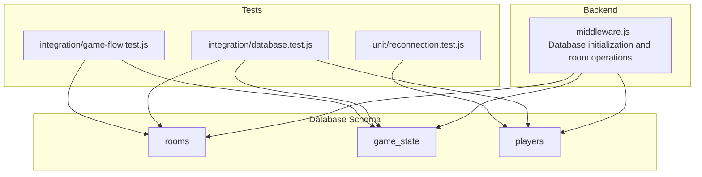
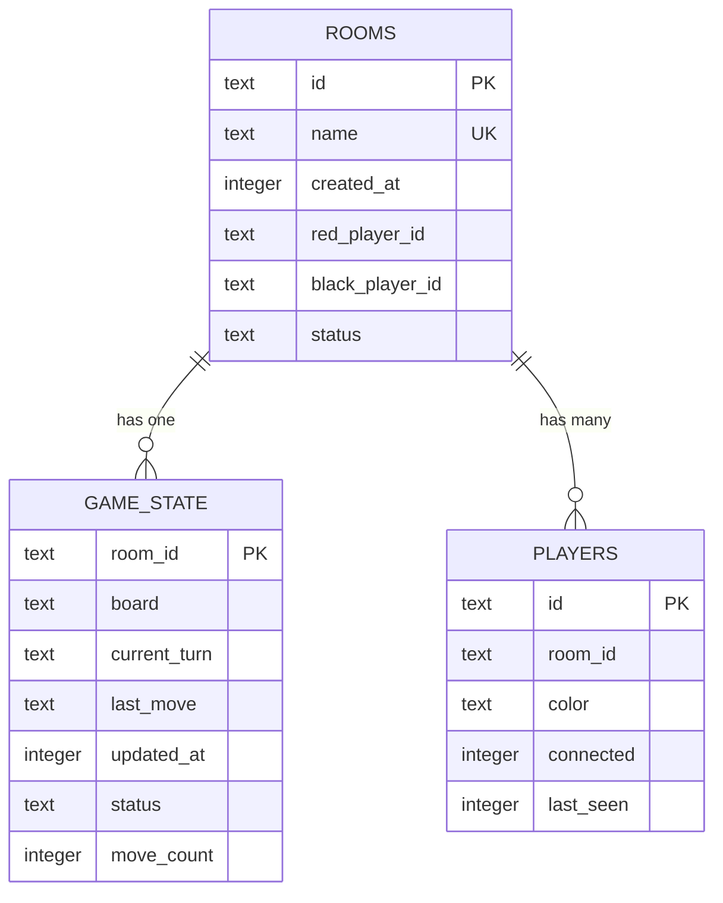
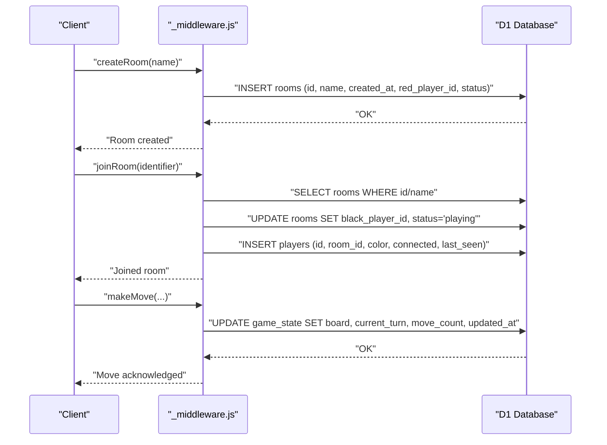
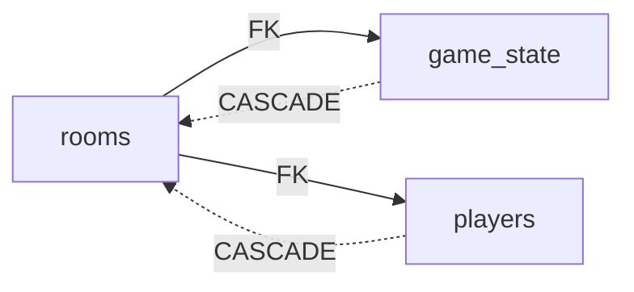

# Table Definitions

<cite>
**Referenced Files in This Document**
- [schema.sql](file://schema.sql)
- [functions/_middleware.js](file://functions/_middleware.js)
- [tests/integration/database.test.js](file://tests/integration/database.test.js)
- [tests/integration/game-flow.test.js](file://tests/integration/game-flow.test.js)
- [tests/unit/reconnection.test.js](file://tests/unit/reconnection.test.js)
- [_middleware.js](file://functions/_middleware.js)
</cite>

## Table of Contents
1. [Introduction](#introduction)
2. [Project Structure](#project-structure)
3. [Core Components](#core-components)
4. [Architecture Overview](#architecture-overview)
5. [Detailed Component Analysis](#detailed-component-analysis)
6. [Dependency Analysis](#dependency-analysis)
7. [Performance Considerations](#performance-considerations)
8. [Troubleshooting Guide](#troubleshooting-guide)
9. [Conclusion](#conclusion)

## Introduction
This document provides detailed definitions and explanations for the database schema used by the Chinese Chess online game. It focuses on three core tables: rooms, game_state, and players. For each table, we describe fields, data types, constraints, defaults, and the business logic behind each field. We also explain how these tables work together to represent the game state and support room-based multiplayer sessions.

## Project Structure
The database schema is defined in a single SQL file and is initialized during application startup. The backend logic handles room creation, joining, leaving, and reconnection, and persists state to the database. Integration tests demonstrate how the tables are used in practice.

**Diagram sources**
- [schema.sql:1-42](file://schema.sql#L1-L42)
- [functions/_middleware.js:46-88](file://functions/_middleware.js#L46-L88)
- [tests/integration/database.test.js:147-183](file://tests/integration/database.test.js#L147-L183)
- [tests/integration/game-flow.test.js:251-272](file://tests/integration/game-flow.test.js#L251-L272)
- [tests/unit/reconnection.test.js:446-497](file://tests/unit/reconnection.test.js#L446-L497)

**Section sources**
- [schema.sql:1-42](file://schema.sql#L1-L42)
- [functions/_middleware.js:46-88](file://functions/_middleware.js#L46-L88)

## Core Components
This section documents each table with field descriptions, data types, constraints, defaults, and business logic.

### rooms table
Purpose: Tracks game rooms, their metadata, and player assignments.

Fields and constraints:
- id: Text, primary key. Unique identifier for the room.
- name: Text, not null, unique. Human-readable room name. Enforced unique constraint prevents duplicates.
- created_at: Integer, not null. Unix timestamp indicating when the room was created.
- red_player_id: Text. Nullable foreign key referencing players.id. Assigns the red player to the room.
- black_player_id: Text. Nullable foreign key referencing players.id. Assigns the black player to the room.
- status: Text, default "waiting". Enumerated values: "waiting", "playing", "finished".

Business logic:
- A room starts with status "waiting".
- When a second player joins, the room transitions to "playing".
- When a game ends, the room status can be set to "finished".
- Player assignments are tracked via red_player_id and black_player_id. Either can be null depending on room state.

Typical data examples:
- Room with one player: id="ROOM001", name="Alpha", created_at=1700000000, red_player_id="PLAYER1", black_player_id=null, status="waiting".
- Room with both players: id="ROOM002", name="Beta", created_at=1700000000, red_player_id="PLAYER1", black_player_id="PLAYER2", status="playing".

Constraints and defaults:
- Primary key: id
- Unique constraint: name
- Default: status="waiting"
- Foreign keys: red_player_id and black_player_id reference players.id

Relationships:
- game_state.room_id references rooms.id with cascade delete.
- players.room_id references rooms.id with cascade delete.

**Section sources**
- [schema.sql:6-13](file://schema.sql#L6-L13)
- [functions/_middleware.js:282-352](file://functions/_middleware.js#L282-L352)
- [functions/_middleware.js:353-444](file://functions/_middleware.js#L353-L444)
- [tests/integration/database.test.js:350-370](file://tests/integration/database.test.js#L350-L370)

### game_state table
Purpose: Stores the live game state for each room, including board representation, turn tracking, move history, and metadata.

Fields and constraints:
- room_id: Text, primary key. References rooms.id; ensures one game state per room.
- board: Text, not null. JSON string representing the board state. Used to persist and restore the game board.
- current_turn: Text, not null. "red" or "black". Indicates whose turn it is.
- last_move: Text. Optional JSON string representing the last move made.
- updated_at: Integer, not null. Unix timestamp of the last update to the game state.
- status: Text, default "playing". Enumerated values: "playing", "finished".
- move_count: Integer, default 0. Tracks total number of moves made in the game.

Business logic:
- Board is serialized as JSON for storage and deserialized when loading the game.
- current_turn alternates after each legal move.
- last_move captures the most recent move for optional replay or analytics.
- updated_at is refreshed on each state change.
- move_count increments with each move.

Typical data examples:
- Initial state: room_id="ROOM001", board="...", current_turn="red", last_move=null, updated_at=1700000000, status="playing", move_count=0.
- After a move: room_id="ROOM001", board="...", current_turn="black", last_move="...", updated_at=1700000001, status="playing", move_count=1.

Constraints and defaults:
- Primary key: room_id
- Default: status="playing", move_count=0
- Foreign key: room_id references rooms.id with cascade delete

Relationships:
- game_state.room_id references rooms.id with cascade delete.

**Section sources**
- [schema.sql:16-25](file://schema.sql#L16-L25)
- [tests/integration/database.test.js:155-183](file://tests/integration/database.test.js#L155-L183)
- [tests/integration/game-flow.test.js:251-272](file://tests/integration/game-flow.test.js#L251-L272)
- [tests/unit/reconnection.test.js:480-497](file://tests/unit/reconnection.test.js#L480-L497)

### players table
Purpose: Tracks player identity, room membership, color assignment, connection status, and activity.

Fields and constraints:
- id: Text, primary key. Unique identifier for the player (typically a connection ID).
- room_id: Text, not null. Foreign key referencing rooms.id. Links the player to a room.
- color: Text, not null. "red" or "black". Assigns the player a side.
- connected: Integer, default 1. Boolean-like flag: 1 indicates connected, 0 indicates disconnected.
- last_seen: Integer, not null. Unix timestamp of the player's last activity.

Business logic:
- Players are created when joining a room and assigned a color ("red" or "black").
- connected tracks whether the player is currently connected; it is updated on disconnect and reconnection.
- last_seen is updated on activity and reconnection to enable stale room cleanup and presence indicators.
- Players are deleted or marked disconnected when they leave or disconnect.

Typical data examples:
- Player in a room: id="CONNECTION1", room_id="ROOM001", color="red", connected=1, last_seen=1700000000.
- Disconnected player: id="CONNECTION2", room_id="ROOM001", color="black", connected=0, last_seen=1699999000.

Constraints and defaults:
- Primary key: id
- Default: connected=1
- Foreign key: room_id references rooms.id with cascade delete

Relationships:
- players.room_id references rooms.id with cascade delete.

**Section sources**
- [schema.sql:27-35](file://schema.sql#L27-L35)
- [functions/_middleware.js:1086-1128](file://functions/_middleware.js#L1086-L1128)
- [tests/integration/database.test.js:225-266](file://tests/integration/database.test.js#L225-L266)
- [tests/unit/reconnection.test.js:446-497](file://tests/unit/reconnection.test.js#L446-L497)

## Architecture Overview
The database schema underpins the room-based multiplayer system. Rooms define the session boundaries, players define identities and sides, and game_state stores the evolving board and metadata. The backend initializes the schema and performs room operations, while tests validate database usage patterns.

**Diagram sources**
- [schema.sql:6-35](file://schema.sql#L6-L35)

**Section sources**
- [schema.sql:6-35](file://schema.sql#L6-L35)
- [functions/_middleware.js:46-88](file://functions/_middleware.js#L46-L88)

## Detailed Component Analysis

### rooms table: Room Management Fields
- id: Unique room identifier; primary key.
- name: Unique room name; enforced by unique constraint.
- created_at: Timestamp for room creation.
- red_player_id/black_player_id: Nullable foreign keys to players.id; assign sides to players.
- status: Enumerated state; default "waiting".

Business logic highlights:
- Room creation sets status to "waiting".
- Joining a room assigns the second player and transitions to "playing".
- Stale room cleanup removes rooms without players.

Example usage patterns:
- Create room with red player assigned.
- Join room; if black_player_id is null, assign and set status to "playing".
- Finish game; set status to "finished".

**Section sources**
- [schema.sql:6-13](file://schema.sql#L6-L13)
- [functions/_middleware.js:282-352](file://functions/_middleware.js#L282-L352)
- [functions/_middleware.js:353-444](file://functions/_middleware.js#L353-L444)

### game_state table: Board Representation and Turn Tracking
- board: JSON string of the board; persisted and restored.
- current_turn: "red" or "black"; alternates after each move.
- last_move: Optional JSON string of the last move.
- updated_at: Timestamp of last update.
- status: "playing" or "finished".
- move_count: Number of moves.

Business logic highlights:
- Board serialization/deserialization enables state persistence.
- Turn alternation and move counting support game progression.
- last_move can be used for move history or UI feedback.

Example usage patterns:
- Insert initial state with current_turn="red" and move_count=0.
- Update state after each move: swap current_turn, increment move_count, update board and last_move, refresh updated_at.

**Section sources**
- [schema.sql:16-25](file://schema.sql#L16-L25)
- [tests/integration/database.test.js:155-183](file://tests/integration/database.test.js#L155-L183)
- [tests/integration/game-flow.test.js:251-272](file://tests/integration/game-flow.test.js#L251-L272)

### players table: Player Identity and Activity
- id: Player/connection identifier; primary key.
- room_id: Foreign key to rooms.id; links player to room.
- color: "red" or "black"; side assignment.
- connected: 1 for connected, 0 for disconnected.
- last_seen: Timestamp of last activity.

Business logic highlights:
- Player creation on join; color assignment.
- Connection state maintained; last_seen updated on activity.
- Disconnection updates player state and triggers room cleanup scheduling.

Example usage patterns:
- Insert player with color and connected=1.
- On disconnect, set connected=0 and update last_seen.
- On reconnection, update connected=1 and last_seen.

**Section sources**
- [schema.sql:27-35](file://schema.sql#L27-L35)
- [functions/_middleware.js:1086-1128](file://functions/_middleware.js#L1086-L1128)
- [tests/integration/database.test.js:225-266](file://tests/integration/database.test.js#L225-L266)

### Cross-Table Workflows
How tables collaborate to represent game state:
- Room creation populates rooms with status "waiting".
- Player joins populate players and rooms with a second player; rooms.status becomes "playing".
- game_state is created per room with initial board and current_turn.
- Subsequent moves update game_state fields and persist to the database.
- Disconnect marks players as disconnected; cleanup removes stale rooms.

**Diagram sources**
- [functions/_middleware.js:282-352](file://functions/_middleware.js#L282-L352)
- [functions/_middleware.js:353-444](file://functions/_middleware.js#L353-L444)
- [functions/_middleware.js:1086-1128](file://functions/_middleware.js#L1086-L1128)
- [tests/integration/database.test.js:155-183](file://tests/integration/database.test.js#L155-L183)

## Dependency Analysis
Foreign key relationships and cascading behavior:
- game_state.room_id -> rooms.id (ON DELETE CASCADE)
- players.room_id -> rooms.id (ON DELETE CASCADE)

Index usage:
- Indexes on rooms.name and rooms.status improve room discovery and filtering.
- Indexes on players.room_id and game_state.updated_at optimize lookups and sorting.

**Diagram sources**
- [schema.sql:16-35](file://schema.sql#L16-L35)

**Section sources**
- [schema.sql:16-41](file://schema.sql#L16-L41)

## Performance Considerations
- Use indexes on frequently queried columns:
  - rooms.name and rooms.status for room listing and filtering.
  - players.room_id for player enumeration by room.
  - game_state.updated_at for recent games sorting.
- Store board as JSON string to simplify serialization; consider compression if storage is constrained.
- Batch operations (e.g., db.batch) reduce round-trips during room creation and reconnection.

## Troubleshooting Guide
Common issues and resolutions:
- Duplicate room name: The unique constraint on rooms.name prevents duplicates. Attempting to create a room with an existing name fails; backend cleans up stale rooms before reuse.
- Missing required fields: INSERT statements must include non-null fields (e.g., rooms.name, game_state.board, players.room_id). Omitting required fields causes errors.
- Invalid foreign keys: Ensure players.room_id references an existing room and players.id references an existing player. Cascading deletes remove dependent records.
- Stale rooms: Rooms without players are considered stale and cleaned up to prevent orphaned entries.

**Section sources**
- [tests/integration/database.test.js:350-370](file://tests/integration/database.test.js#L350-L370)
- [functions/_middleware.js:282-352](file://functions/_middleware.js#L282-L352)

## Conclusion
The rooms, game_state, and players tables form a cohesive schema for managing Chinese Chess rooms and game state. The rooms table defines session boundaries and player assignments; the game_state table persists board and turn metadata; and the players table tracks identities, sides, and connection status. Together with backend logic and tests, this schema supports robust room-based multiplayer gameplay with reconnection and state recovery.