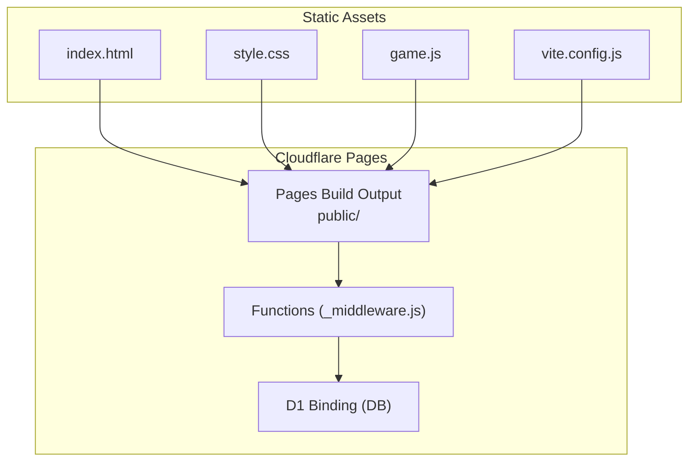
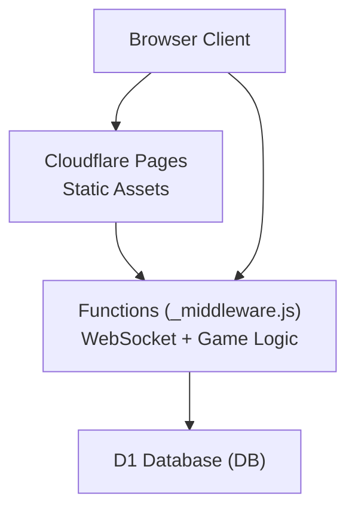
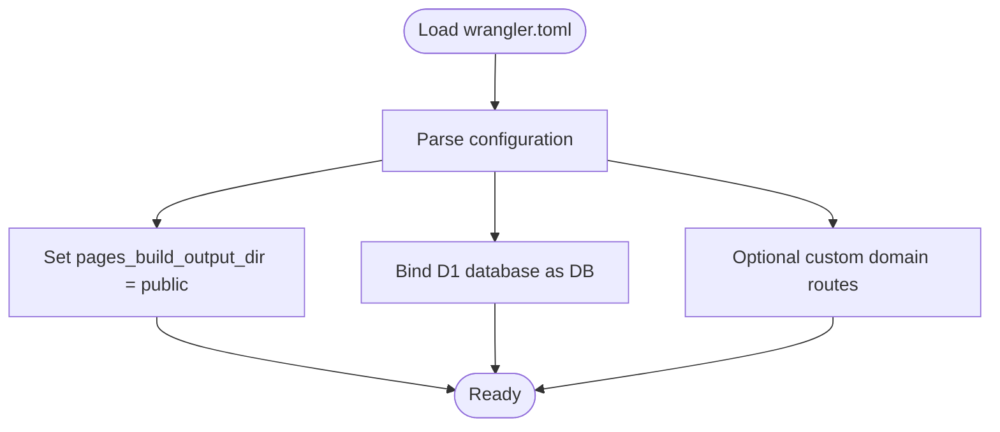
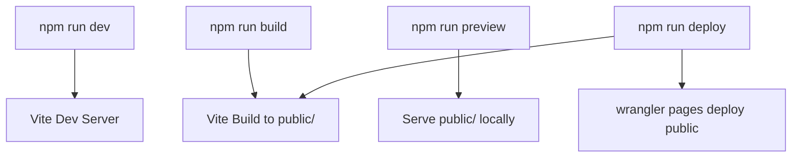
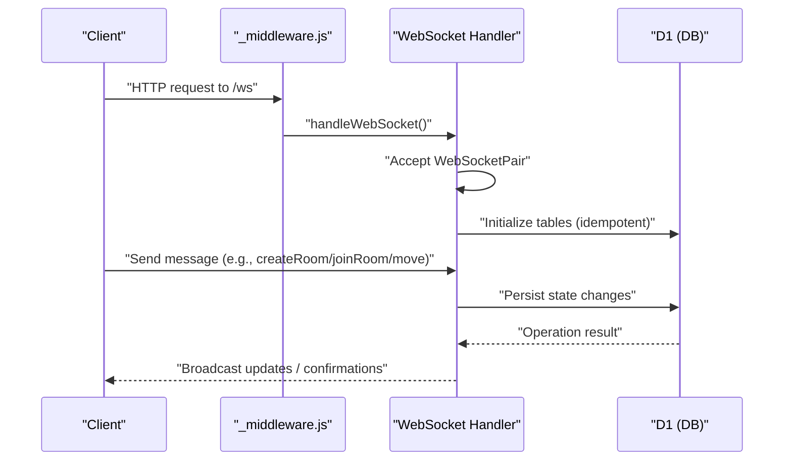
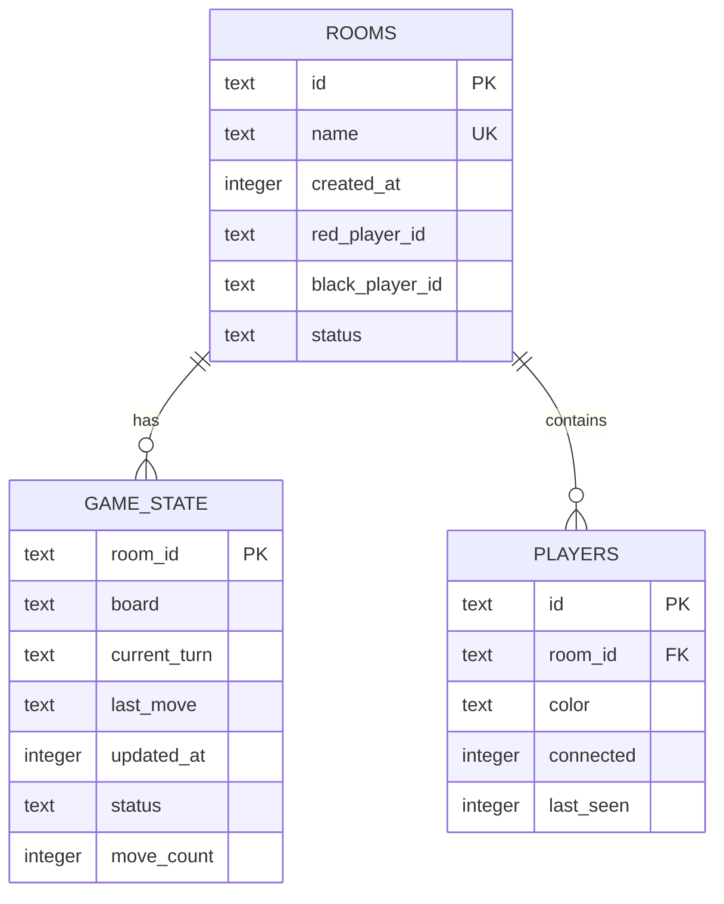
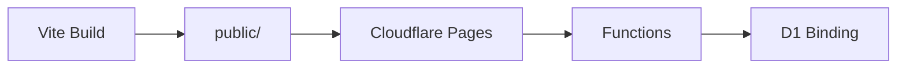

# Cloudflare Deployment

<cite>
**Referenced Files in This Document**
- [wrangler.toml](file://wrangler.toml)
- [package.json](file://package.json)
- [vite.config.js](file://vite.config.js)
- [DEPLOYMENT.md](file://DEPLOYMENT.md)
- [SETUP_D1.md](file://SETUP_D1.md)
- [TROUBLESHOOTING.md](file://TROUBLESHOOTING.md)
- [functions/_middleware.js](file://functions/_middleware.js)
- [index.html](file://index.html)
- [game.js](file://game.js)
- [style.css](file://style.css)
- [schema.sql](file://schema.sql)
</cite>

## Table of Contents
1. [Introduction](#introduction)
2. [Project Structure](#project-structure)
3. [Core Components](#core-components)
4. [Architecture Overview](#architecture-overview)
5. [Detailed Component Analysis](#detailed-component-analysis)
6. [Dependency Analysis](#dependency-analysis)
7. [Performance Considerations](#performance-considerations)
8. [Troubleshooting Guide](#troubleshooting-guide)
9. [Conclusion](#conclusion)
10. [Appendices](#appendices)

## Introduction
This document provides a complete Cloudflare deployment guide for the Chinese Chess game, covering configuration, build and deployment, environment differences, custom domains, SSL, CI/CD integration patterns, WebSocket worker configuration, and operational practices such as rollback and version management.

## Project Structure
The project is organized into:
- Static frontend assets (HTML, CSS, JS) built by Vite and served by Cloudflare Pages
- Cloudflare Pages Functions for WebSocket handling and game orchestration
- Wrangler configuration for Pages, D1 database binding, and optional routing
- Supporting documentation for deployment, D1 setup, and troubleshooting

**Diagram sources**
- [index.html](file://index.html)
- [style.css](file://style.css)
- [game.js](file://game.js)
- [vite.config.js](file://vite.config.js)
- [wrangler.toml](file://wrangler.toml)
- [functions/_middleware.js](file://functions/_middleware.js)

**Section sources**
- [index.html](file://index.html)
- [style.css](file://style.css)
- [game.js](file://game.js)
- [vite.config.js](file://vite.config.js)
- [wrangler.toml](file://wrangler.toml)

## Core Components
- Pages configuration and build output directory
- D1 database binding for persistent game state
- Functions routing for WebSocket connections
- Vite build pipeline for static assets
- Scripts for local development and deployment

**Section sources**
- [wrangler.toml](file://wrangler.toml)
- [package.json](file://package.json)
- [functions/_middleware.js](file://functions/_middleware.js)

## Architecture Overview
The system consists of:
- Static frontend served by Cloudflare Pages
- Functions layer handling WebSocket upgrades and game logic
- D1 database for persistent room, game state, and player data
- Optional custom domain and SSL managed by Cloudflare

**Diagram sources**
- [functions/_middleware.js](file://functions/_middleware.js)
- [wrangler.toml](file://wrangler.toml)

## Detailed Component Analysis

### Wrangler Configuration (Pages, D1, Routing)
- Project name and compatibility date
- Pages build output directory set to public
- D1 database binding named DB with database name and UUID
- Optional custom domain routing commented out

**Diagram sources**
- [wrangler.toml](file://wrangler.toml)

**Section sources**
- [wrangler.toml](file://wrangler.toml)

### Build Pipeline with Vite
- Vite server configured with host exposure and port
- Build output directory mapped to public
- Scripts for dev, build, preview, and deployment

**Diagram sources**
- [package.json](file://package.json)
- [vite.config.js](file://vite.config.js)

**Section sources**
- [package.json](file://package.json)
- [vite.config.js](file://vite.config.js)

### Worker Configuration for WebSocket Handling
- Middleware routes WebSocket requests to the WebSocket handler
- Accepts WebSocketPair connections and manages per-instance connections
- Implements heartbeat, error handling, and message routing
- Uses D1 binding for room creation, joins, moves, and state persistence

**Diagram sources**
- [functions/_middleware.js](file://functions/_middleware.js)
- [wrangler.toml](file://wrangler.toml)

**Section sources**
- [functions/_middleware.js](file://functions/_middleware.js)
- [wrangler.toml](file://wrangler.toml)

### Database Schema and Initialization
- Rooms table stores room metadata and player IDs
- Game state table persists board, turn, last move, and counters
- Players table tracks connection state and timestamps
- Indexes optimized for common queries

**Diagram sources**
- [schema.sql](file://schema.sql)

**Section sources**
- [schema.sql](file://schema.sql)

### Environment Differences: Development vs Production
- Local development uses wrangler pages dev with D1 binding and a dedicated port
- Production uses Pages build output (public/) deployed via wrangler pages deploy
- D1 binding is configured in wrangler.toml for production deployment

**Section sources**
- [package.json](file://package.json)
- [wrangler.toml](file://wrangler.toml)

### Custom Domain and SSL Management
- Custom domain setup is documented in the deployment guide
- SSL certificates are managed automatically by Cloudflare for custom domains

**Section sources**
- [DEPLOYMENT.md](file://DEPLOYMENT.md)

### CI/CD Integration Patterns
- Recommended approach: connect the repository to Cloudflare Pages for automated builds
- Alternatively, use the deploy script to build and push to Pages
- Keep wrangler.toml and D1 configuration synchronized across environments

**Section sources**
- [DEPLOYMENT.md](file://DEPLOYMENT.md)
- [package.json](file://package.json)

### Step-by-Step Deployment Procedures
- Option 1: Cloudflare Dashboard
  - Connect GitHub repository to Pages
  - Set framework preset to Vite, build command to npm run build, output directory to public
  - Save and deploy
- Option 2: Wrangler CLI
  - Install wrangler globally
  - Log in to Cloudflare
  - Create a Pages project
  - Build and deploy using the deploy script

**Section sources**
- [DEPLOYMENT.md](file://DEPLOYMENT.md)
- [package.json](file://package.json)

### Environment Variable Configuration
- The project does not currently define environment variables in wrangler.toml
- For production, consider adding variables for secrets and feature flags as needed

**Section sources**
- [wrangler.toml](file://wrangler.toml)

### Rollback and Version Management Strategies
- Cloudflare Pages supports versioning and rollback through the dashboard
- Use the deployment history to roll back to a previous successful build
- Maintain deterministic builds by pinning dependencies and using semantic versioning

**Section sources**
- [DEPLOYMENT.md](file://DEPLOYMENT.md)

## Dependency Analysis
- Frontend depends on Vite for building static assets
- Functions depend on D1 binding for persistence
- Deployment depends on wrangler CLI and Pages configuration

**Diagram sources**
- [package.json](file://package.json)
- [vite.config.js](file://vite.config.js)
- [wrangler.toml](file://wrangler.toml)
- [functions/_middleware.js](file://functions/_middleware.js)

**Section sources**
- [package.json](file://package.json)
- [vite.config.js](file://vite.config.js)
- [wrangler.toml](file://wrangler.toml)

## Performance Considerations
- D1 writes typically complete within tens of milliseconds
- WebSocket broadcast latency is minimal
- Combined latency for move synchronization remains under 100ms

**Section sources**
- [SETUP_D1.md](file://SETUP_D1.md)

## Troubleshooting Guide
Common issues and resolutions:
- Local development dependency errors: reinstall dependencies
- Local D1 database not working: reinitialize local database
- Port conflicts during local development: change port or kill the process
- Database not configured: verify D1 database creation, database_id in wrangler.toml, and Pages D1 binding
- Room not found: verify room ID/name and database connectivity
- WebSocket connection failures: check browser console and Cloudflare Functions logs
- Moves not syncing: verify database availability and WebSocket connection status

**Section sources**
- [TROUBLESHOOTING.md](file://TROUBLESHOOTING.md)

## Conclusion
This guide outlines a complete Cloudflare deployment pipeline for the Chinese Chess game, including Pages configuration, D1 binding, WebSocket handling, build and deployment steps, environment management, and operational practices. Following these procedures ensures reliable, scalable multiplayer gameplay with real-time synchronization.

## Appendices

### Appendix A: D1 Setup Checklist
- Install wrangler CLI and log in
- Create D1 database and copy database_id
- Update wrangler.toml with D1 binding
- Initialize schema remotely
- Deploy and verify tables exist

**Section sources**
- [SETUP_D1.md](file://SETUP_D1.md)
- [wrangler.toml](file://wrangler.toml)
- [schema.sql](file://schema.sql)

### Appendix B: Frontend Integration Notes
- The frontend connects to /ws via WebSocket
- UI screens include lobby and game board
- Styles are contained in a single stylesheet

**Section sources**
- [index.html](file://index.html)
- [game.js](file://game.js)
- [style.css](file://style.css)