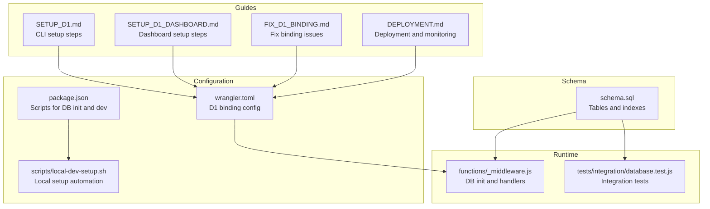
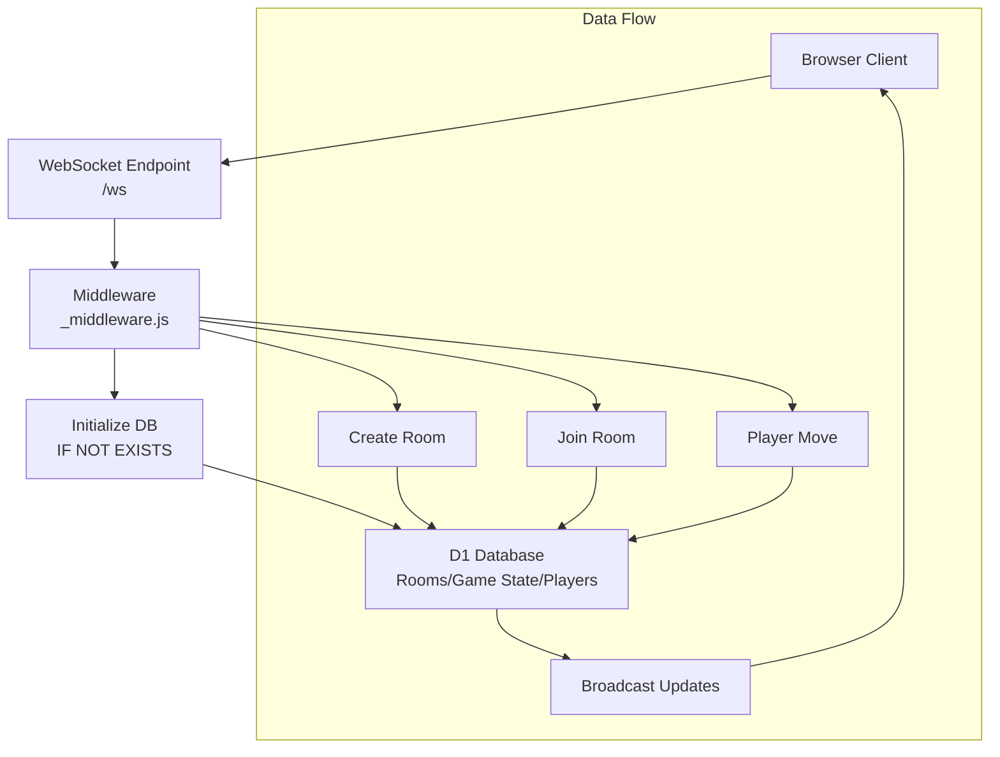
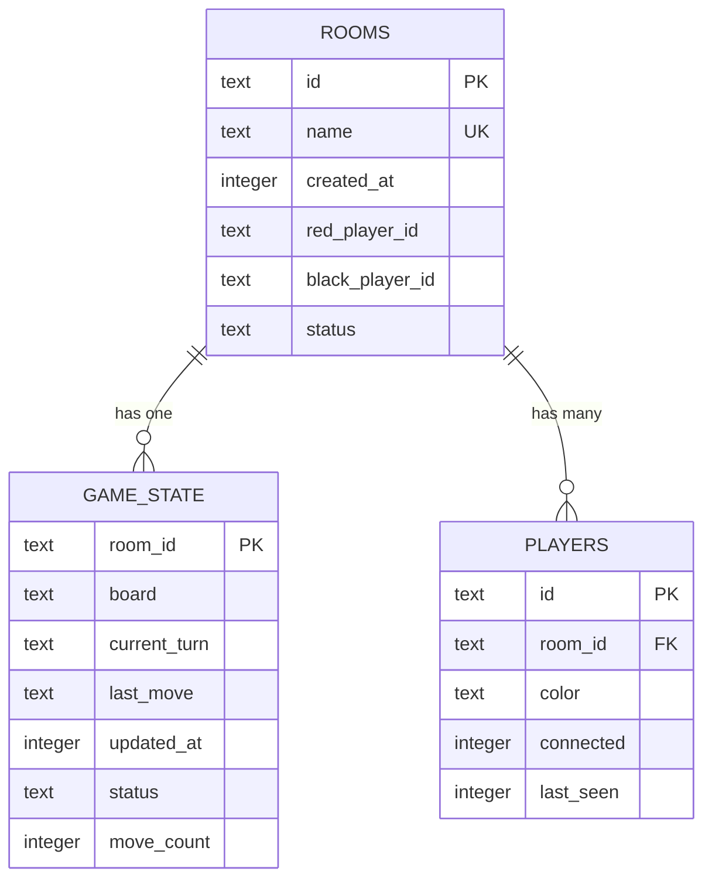
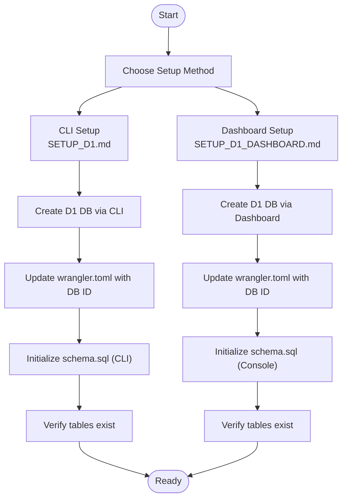
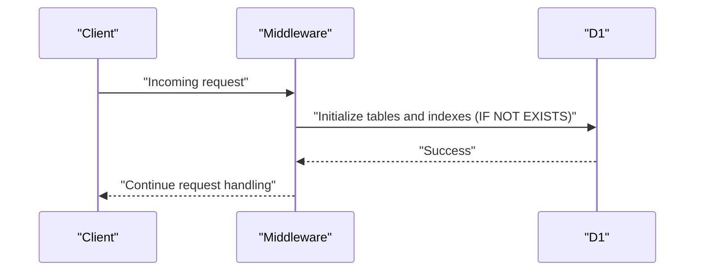
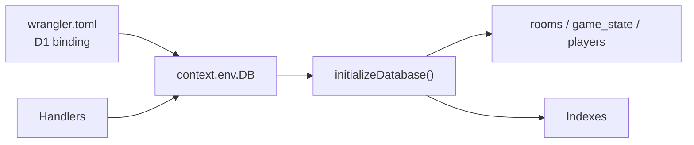

# Database Setup and Management

<cite>
**Referenced Files in This Document**
- [schema.sql](file://schema.sql)
- [wrangler.toml](file://wrangler.toml)
- [SETUP_D1.md](file://SETUP_D1.md)
- [SETUP_D1_DASHBOARD.md](file://SETUP_D1_DASHBOARD.md)
- [FIX_D1_BINDING.md](file://FIX_D1_BINDING.md)
- [DEPLOYMENT.md](file://DEPLOYMENT.md)
- [functions/_middleware.js](file://functions/_middleware.js)
- [tests/integration/database.test.js](file://tests/integration/database.test.js)
- [scripts/local-dev-setup.sh](file://scripts/local-dev-setup.sh)
- [package.json](file://package.json)
</cite>

## Table of Contents
1. [Introduction](#introduction)
2. [Project Structure](#project-structure)
3. [Core Components](#core-components)
4. [Architecture Overview](#architecture-overview)
5. [Detailed Component Analysis](#detailed-component-analysis)
6. [Dependency Analysis](#dependency-analysis)
7. [Performance Considerations](#performance-considerations)
8. [Troubleshooting Guide](#troubleshooting-guide)
9. [Conclusion](#conclusion)
10. [Appendices](#appendices)

## Introduction
This document provides comprehensive guidance for setting up and managing the Cloudflare D1 database used by the Chinese Chess game. It covers schema definition, database creation and binding, initialization procedures, migration and seeding strategies, monitoring and maintenance, and troubleshooting. It also explains how the database integrates with the backend functions and how to operate the Cloudflare D1 dashboard effectively.

## Project Structure
The D1 database integration relies on several key files:
- Database schema definition and indexes
- Wrangler configuration for D1 binding
- Setup guides for CLI and dashboard
- Middleware that initializes and uses the database
- Tests validating database operations
- Scripts and commands for local development and initialization

**Diagram sources**
- [wrangler.toml:13-17](file://wrangler.toml#L13-L17)
- [package.json:7-17](file://package.json#L7-L17)
- [schema.sql:5-41](file://schema.sql#L5-L41)
- [functions/_middleware.js:46-98](file://functions/_middleware.js#L46-L98)
- [tests/integration/database.test.js:12-44](file://tests/integration/database.test.js#L12-L44)
- [SETUP_D1.md:18-52](file://SETUP_D1.md#L18-L52)
- [SETUP_D1_DASHBOARD.md:11-84](file://SETUP_D1_DASHBOARD.md#L11-L84)
- [FIX_D1_BINDING.md:24-36](file://FIX_D1_BINDING.md#L24-L36)
- [DEPLOYMENT.md:35-80](file://DEPLOYMENT.md#L35-L80)

**Section sources**
- [wrangler.toml:13-17](file://wrangler.toml#L13-L17)
- [package.json:7-17](file://package.json#L7-L17)
- [schema.sql:5-41](file://schema.sql#L5-L41)
- [functions/_middleware.js:46-98](file://functions/_middleware.js#L46-L98)
- [tests/integration/database.test.js:12-44](file://tests/integration/database.test.js#L12-L44)
- [SETUP_D1.md:18-52](file://SETUP_D1.md#L18-L52)
- [SETUP_D1_DASHBOARD.md:11-84](file://SETUP_D1_DASHBOARD.md#L11-L84)
- [FIX_D1_BINDING.md:24-36](file://FIX_D1_BINDING.md#L24-L36)
- [DEPLOYMENT.md:35-80](file://DEPLOYMENT.md#L35-L80)

## Core Components
- D1 schema: Defines three tables (rooms, game_state, players) with primary keys, foreign keys, defaults, and indexes for performance.
- D1 binding: Configured in wrangler.toml with a binding variable name used by the runtime.
- Runtime initialization: The middleware initializes tables and indexes on every request if the binding is present.
- Commands and scripts: NPM scripts and shell script automate local initialization and development server startup.

Key implementation references:
- Schema definition and indexes: [schema.sql:5-41](file://schema.sql#L5-L41)
- D1 binding configuration: [wrangler.toml:13-17](file://wrangler.toml#L13-L17)
- Database initialization routine: [functions/_middleware.js:46-98](file://functions/_middleware.js#L46-L98)
- Scripts for DB init and dev: [package.json:7-17](file://package.json#L7-L17), [scripts/local-dev-setup.sh:52-61](file://scripts/local-dev-setup.sh#L52-L61)

**Section sources**
- [schema.sql:5-41](file://schema.sql#L5-L41)
- [wrangler.toml:13-17](file://wrangler.toml#L13-L17)
- [functions/_middleware.js:46-98](file://functions/_middleware.js#L46-L98)
- [package.json:7-17](file://package.json#L7-L17)
- [scripts/local-dev-setup.sh:52-61](file://scripts/local-dev-setup.sh#L52-L61)

## Architecture Overview
The D1 database serves as the persistent state store for rooms, game state, and player connections. The backend functions initialize the schema on demand and coordinate real-time updates via WebSocket connections.

**Diagram sources**
- [functions/_middleware.js:104-122](file://functions/_middleware.js#L104-L122)
- [functions/_middleware.js:282-351](file://functions/_middleware.js#L282-L351)
- [functions/_middleware.js:353-443](file://functions/_middleware.js#L353-L443)
- [functions/_middleware.js:522-683](file://functions/_middleware.js#L522-L683)

**Section sources**
- [functions/_middleware.js:104-122](file://functions/_middleware.js#L104-L122)
- [functions/_middleware.js:282-351](file://functions/_middleware.js#L282-L351)
- [functions/_middleware.js:353-443](file://functions/_middleware.js#L353-L443)
- [functions/_middleware.js:522-683](file://functions/_middleware.js#L522-L683)

## Detailed Component Analysis

### Schema Definition and Relationships
The schema defines three tables with explicit constraints and indexes:
- rooms: stores room metadata and player identifiers with a unique name and default status.
- game_state: stores per-room board state, turn indicator, last move, timestamps, and counts, with a foreign key to rooms and cascade delete.
- players: stores connection and color metadata with a foreign key to rooms and cascade delete.
- Indexes: optimize lookups by room name/status, player room association, and game state update time.

**Diagram sources**
- [schema.sql:6-25](file://schema.sql#L6-L25)
- [schema.sql:27-35](file://schema.sql#L27-L35)

**Section sources**
- [schema.sql:6-25](file://schema.sql#L6-L25)
- [schema.sql:27-35](file://schema.sql#L27-L35)

### D1 Database Creation and Binding
Two approaches are documented:
- CLI-based creation and initialization using Wrangler.
- Dashboard-based creation and schema execution via the D1 console.

Both require updating the wrangler.toml binding with the database ID and verifying table creation.

**Diagram sources**
- [SETUP_D1.md:18-74](file://SETUP_D1.md#L18-L74)
- [SETUP_D1_DASHBOARD.md:11-158](file://SETUP_D1_DASHBOARD.md#L11-L158)
- [wrangler.toml:13-17](file://wrangler.toml#L13-L17)

**Section sources**
- [SETUP_D1.md:18-74](file://SETUP_D1.md#L18-L74)
- [SETUP_D1_DASHBOARD.md:11-158](file://SETUP_D1_DASHBOARD.md#L11-L158)
- [wrangler.toml:13-17](file://wrangler.toml#L13-L17)

### Database Initialization Procedures
Initialization runs on every request if the DB binding is present, ensuring tables and indexes exist even on first access. The middleware performs idempotent creation using IF NOT EXISTS.

**Diagram sources**
- [functions/_middleware.js:104-122](file://functions/_middleware.js#L104-L122)
- [functions/_middleware.js:46-98](file://functions/_middleware.js#L46-L98)

**Section sources**
- [functions/_middleware.js:104-122](file://functions/_middleware.js#L104-L122)
- [functions/_middleware.js:46-98](file://functions/_middleware.js#L46-L98)

### Migration Strategies, Seeding, and Versioning
- Migration strategy: The schema is idempotent via IF NOT EXISTS, enabling safe repeated application of schema.sql without destructive changes.
- Seeding: The schema itself seeds the initial structure; no separate seed data is included in the repository.
- Versioning: No explicit version table or migration scripts are present; schema evolution should be managed by applying updated schema.sql and testing carefully.

Operational references:
- Idempotent schema application: [schema.sql:5-41](file://schema.sql#L5-L41)
- CLI migration via schema.sql: [SETUP_D1.md:46-52](file://SETUP_D1.md#L46-L52)
- Dashboard migration via console: [SETUP_D1_DASHBOARD.md:68-84](file://SETUP_D1_DASHBOARD.md#L68-L84)

**Section sources**
- [schema.sql:5-41](file://schema.sql#L5-L41)
- [SETUP_D1.md:46-52](file://SETUP_D1.md#L46-L52)
- [SETUP_D1_DASHBOARD.md:68-84](file://SETUP_D1_DASHBOARD.md#L68-L84)

### Database Monitoring, Backup, and Maintenance
- Monitoring: Use Cloudflare Pages analytics and logs to monitor traffic and errors.
- Backup: Backups are managed by Cloudflare; consult Cloudflare D1 documentation for backup policies and restore procedures.
- Maintenance: Routine checks include verifying table existence and indexes, and ensuring the binding remains configured.

References:
- Monitoring and logs: [DEPLOYMENT.md:157-162](file://DEPLOYMENT.md#L157-L162)
- Backup policy: Consult Cloudflare D1 documentation
- Verify tables exist: [SETUP_D1.md:54-60](file://SETUP_D1.md#L54-L60), [SETUP_D1_DASHBOARD.md:131-149](file://SETUP_D1_DASHBOARD.md#L131-L149)

**Section sources**
- [DEPLOYMENT.md:157-162](file://DEPLOYMENT.md#L157-L162)
- [SETUP_D1.md:54-60](file://SETUP_D1.md#L54-L60)
- [SETUP_D1_DASHBOARD.md:131-149](file://SETUP_D1_DASHBOARD.md#L131-L149)

### Database Dashboard Usage and Administrative Operations
- Access the dashboard and navigate to the D1 database.
- Use the Console to run SQL queries, inspect schema, and manage data.
- Configure bindings in Cloudflare Pages settings if using automated deployments.

References:
- Dashboard navigation and console: [SETUP_D1_DASHBOARD.md:197-207](file://SETUP_D1_DASHBOARD.md#L197-L207), [SETUP_D1_DASHBOARD.md:131-149](file://SETUP_D1_DASHBOARD.md#L131-L149)
- Pages binding configuration: [SETUP_D1_DASHBOARD.md:165-177](file://SETUP_D1_DASHBOARD.md#L165-L177)

**Section sources**
- [SETUP_D1_DASHBOARD.md:197-207](file://SETUP_D1_DASHBOARD.md#L197-L207)
- [SETUP_D1_DASHBOARD.md:131-149](file://SETUP_D1_DASHBOARD.md#L131-L149)
- [SETUP_D1_DASHBOARD.md:165-177](file://SETUP_D1_DASHBOARD.md#L165-L177)

### Query Optimization
- Indexes are pre-defined to optimize frequent queries:
  - rooms(name) and rooms(status) for filtering and lookup.
  - players(room_id) for player-to-room joins.
  - game_state(updated_at) for time-based queries.
- Use targeted queries in handlers to minimize overhead and leverage indexes.

References:
- Index definitions: [schema.sql:37-41](file://schema.sql#L37-L41)
- Handler queries: [functions/_middleware.js:299-302](file://functions/_middleware.js#L299-L302), [functions/_middleware.js:374-377](file://functions/_middleware.js#L374-L377), [functions/_middleware.js:533-535](file://functions/_middleware.js#L533-L535)

**Section sources**
- [schema.sql:37-41](file://schema.sql#L37-L41)
- [functions/_middleware.js:299-302](file://functions/_middleware.js#L299-L302)
- [functions/_middleware.js:374-377](file://functions/_middleware.js#L374-L377)
- [functions/_middleware.js:533-535](file://functions/_middleware.js#L533-L535)

## Dependency Analysis
The runtime depends on the D1 binding configured in wrangler.toml. The middleware conditionally initializes the database and coordinates WebSocket handlers.

**Diagram sources**
- [wrangler.toml:13-17](file://wrangler.toml#L13-L17)
- [functions/_middleware.js:104-122](file://functions/_middleware.js#L104-L122)
- [functions/_middleware.js:46-98](file://functions/_middleware.js#L46-L98)

**Section sources**
- [wrangler.toml:13-17](file://wrangler.toml#L13-L17)
- [functions/_middleware.js:104-122](file://functions/_middleware.js#L104-L122)
- [functions/_middleware.js:46-98](file://functions/_middleware.js#L46-L98)

## Performance Considerations
- Latency targets are optimized for real-time gameplay with database writes and WebSocket broadcasts.
- Use batch operations for related inserts/updates to reduce round trips.
- Keep queries simple and leverage indexes to avoid scans on large datasets.

References:
- Performance notes: [SETUP_D1.md:115-119](file://SETUP_D1.md#L115-L119)
- Batch usage in handlers: [functions/_middleware.js:322-329](file://functions/_middleware.js#L322-L329), [functions/_middleware.js:499-504](file://functions/_middleware.js#L499-L504)

**Section sources**
- [SETUP_D1.md:115-119](file://SETUP_D1.md#L115-L119)
- [functions/_middleware.js:322-329](file://functions/_middleware.js#L322-L329)
- [functions/_middleware.js:499-504](file://functions/_middleware.js#L499-L504)

## Troubleshooting Guide
Common issues and resolutions:
- Database not configured: Ensure the D1 binding variable name matches the expected name and that the Pages project has the binding configured.
- Table doesn't exist: Re-run schema initialization via CLI or dashboard console.
- Room not found when joining: Verify rooms table contents and indexes.
- Binding fixes: Follow the binding configuration steps and redeploy.

References:
- Binding fix steps: [FIX_D1_BINDING.md:24-36](file://FIX_D1_BINDING.md#L24-L36), [FIX_D1_BINDING.md:94-108](file://FIX_D1_BINDING.md#L94-L108)
- Table verification: [SETUP_D1.md:54-60](file://SETUP_D1.md#L54-L60), [SETUP_D1_DASHBOARD.md:131-149](file://SETUP_D1_DASHBOARD.md#L131-L149)
- Room lookup and join logic: [functions/_middleware.js:374-382](file://functions/_middleware.js#L374-L382), [functions/_middleware.js:396-404](file://functions/_middleware.js#L396-L404)

**Section sources**
- [FIX_D1_BINDING.md:24-36](file://FIX_D1_BINDING.md#L24-L36)
- [FIX_D1_BINDING.md:94-108](file://FIX_D1_BINDING.md#L94-L108)
- [SETUP_D1.md:54-60](file://SETUP_D1.md#L54-L60)
- [SETUP_D1_DASHBOARD.md:131-149](file://SETUP_D1_DASHBOARD.md#L131-L149)
- [functions/_middleware.js:374-382](file://functions/_middleware.js#L374-L382)
- [functions/_middleware.js:396-404](file://functions/_middleware.js#L396-L404)

## Conclusion
The D1 database integration provides a robust foundation for persistent multiplayer state in the Chinese Chess game. With idempotent schema initialization, clear binding configuration, and well-defined indexes, the system supports reliable real-time gameplay. Use the provided guides and scripts to set up, monitor, and troubleshoot the database, and follow the troubleshooting steps to resolve common issues quickly.

## Appendices

### Appendix A: Local Development Setup
- Install dependencies and initialize local D1 database using the provided script.
- Start the local development server with D1 binding enabled.

References:
- Local setup script: [scripts/local-dev-setup.sh:52-61](file://scripts/local-dev-setup.sh#L52-L61)
- Local dev command: [package.json:14](file://package.json#L14)

**Section sources**
- [scripts/local-dev-setup.sh:52-61](file://scripts/local-dev-setup.sh#L52-L61)
- [package.json:14](file://package.json#L14)

### Appendix B: Integration Tests Coverage
- Tests validate table creation and basic CRUD operations for rooms, game state, and players.
- Batch operations and cleanup routines are covered.

References:
- Table creation tests: [tests/integration/database.test.js:54-81](file://tests/integration/database.test.js#L54-L81)
- Room operations: [tests/integration/database.test.js:83-145](file://tests/integration/database.test.js#L83-L145)
- Game state operations: [tests/integration/database.test.js:147-201](file://tests/integration/database.test.js#L147-L201)
- Player operations: [tests/integration/database.test.js:203-266](file://tests/integration/database.test.js#L203-L266)
- Batch and cleanup: [tests/integration/database.test.js:268-305](file://tests/integration/database.test.js#L268-L305)

**Section sources**
- [tests/integration/database.test.js:54-81](file://tests/integration/database.test.js#L54-L81)
- [tests/integration/database.test.js:83-145](file://tests/integration/database.test.js#L83-L145)
- [tests/integration/database.test.js:147-201](file://tests/integration/database.test.js#L147-L201)
- [tests/integration/database.test.js:203-266](file://tests/integration/database.test.js#L203-L266)
- [tests/integration/database.test.js:268-305](file://tests/integration/database.test.js#L268-L305)