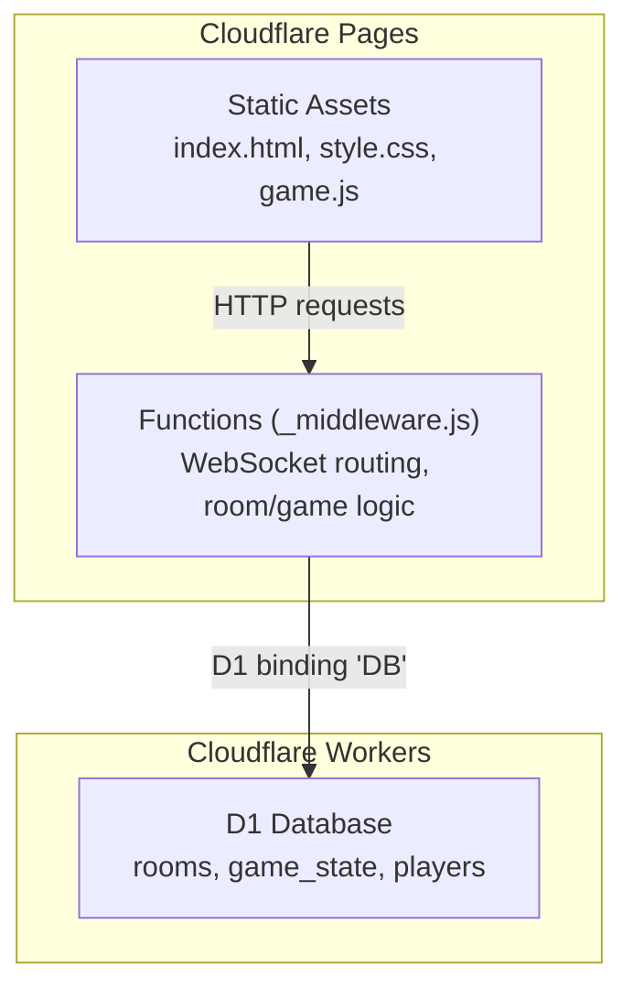
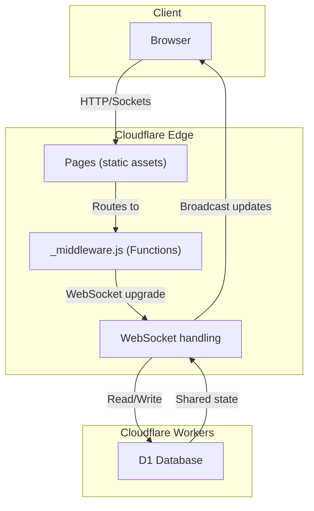
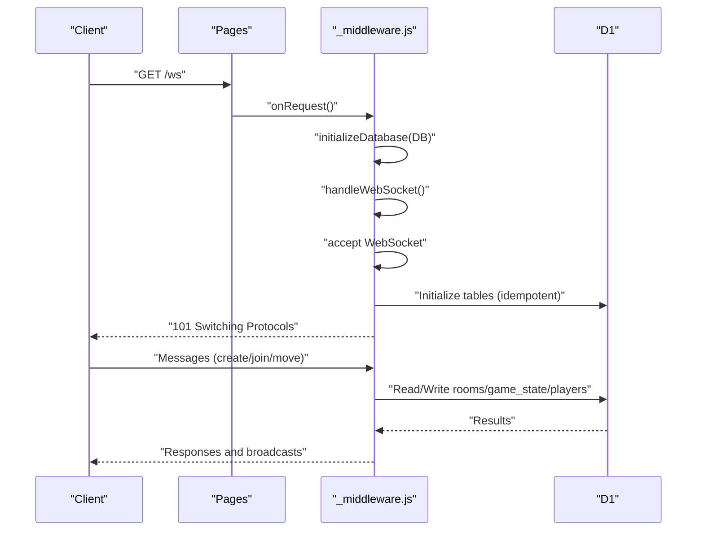
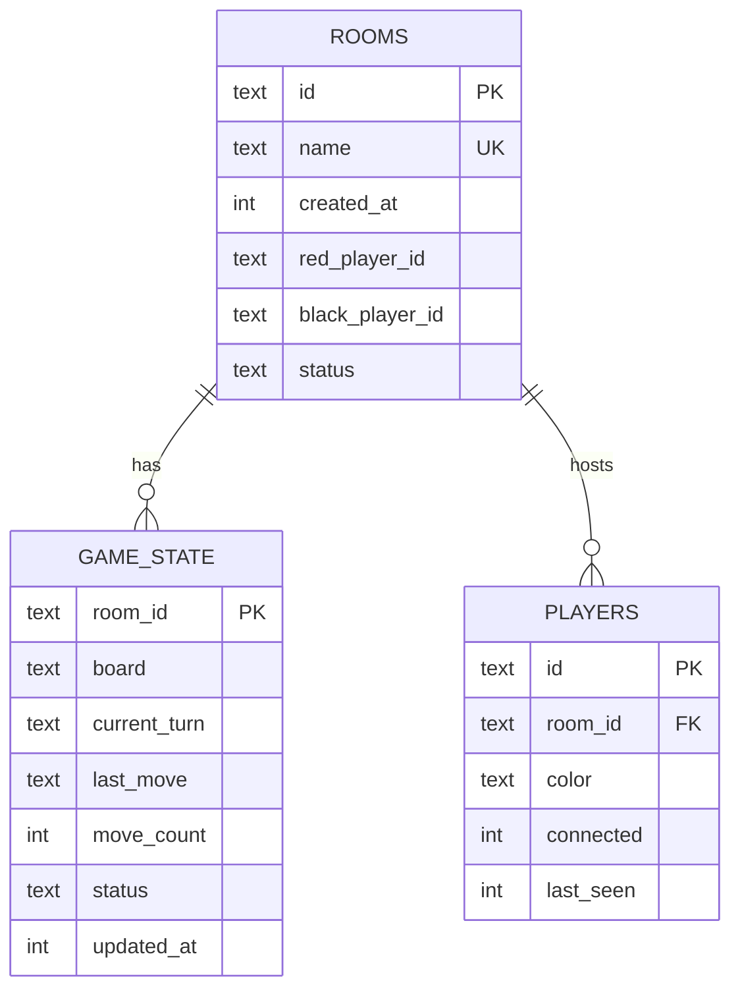
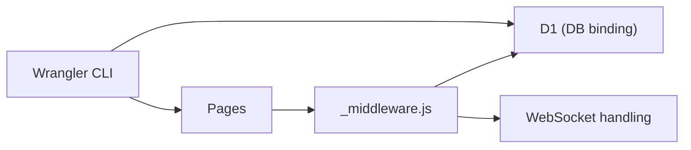

# Deployment and Operations

<cite>
**Referenced Files in This Document**
- [DEPLOYMENT.md](file://DEPLOYMENT.md)
- [SETUP_D1.md](file://SETUP_D1.md)
- [SETUP_D1_DASHBOARD.md](file://SETUP_D1_DASHBOARD.md)
- [FIX_D1_BINDING.md](file://FIX_D1_BINDING.md)
- [TROUBLESHOOTING.md](file://TROUBLESHOOTING.md)
- [wrangler.toml](file://wrangler.toml)
- [schema.sql](file://schema.sql)
- [package.json](file://package.json)
- [functions/_middleware.js](file://functions/_middleware.js)
</cite>

## Table of Contents
1. [Introduction](#introduction)
2. [Project Structure](#project-structure)
3. [Core Components](#core-components)
4. [Architecture Overview](#architecture-overview)
5. [Detailed Component Analysis](#detailed-component-analysis)
6. [Dependency Analysis](#dependency-analysis)
7. [Performance Considerations](#performance-considerations)
8. [Troubleshooting Guide](#troubleshooting-guide)
9. [Development Workflow and Staging](#development-workflow-and-staging)
10. [Security and Access Control](#security-and-access-control)
11. [Monitoring and Logging](#monitoring-and-logging)
12. [Rollback Procedures](#rollback-procedures)
13. [Operational Runbooks](#operational-runbooks)
14. [Conclusion](#conclusion)

## Introduction
This document provides comprehensive deployment and operations guidance for the Cloudflare-based deployment model of the Chinese Chess game. It covers environment configuration, D1 database setup, production deployment procedures, Cloudflare Pages integration, Worker configuration, routing setup, database initialization and schema migration, data seeding, monitoring and logging, troubleshooting, development workflow, staging, rollback procedures, security considerations, and operational runbooks.

## Project Structure
The repository is organized around a static frontend served by Cloudflare Pages and a Cloudflare Pages Functions backend that handles WebSocket connections and game logic. The deployment configuration and database setup are managed via Wrangler and D1.

**Diagram sources**
- [functions/_middleware.js](file://functions/_middleware.js)
- [wrangler.toml](file://wrangler.toml)

**Section sources**
- [DEPLOYMENT.md](file://DEPLOYMENT.md)
- [wrangler.toml](file://wrangler.toml)

## Core Components
- Cloudflare Pages: Hosts the static frontend assets and routes requests to Functions.
- Cloudflare Pages Functions: Implements WebSocket upgrade handling and game room management.
- D1 Database: Persistent storage for rooms, game state, and players.
- Wrangler CLI: Used for local development, D1 schema initialization, and Pages deployment.

Key responsibilities:
- Static asset delivery and caching.
- WebSocket connection lifecycle and heartbeat management.
- Room creation, joining, leaving, and cleanup.
- Move validation, state updates, and broadcasting.
- Database initialization and migrations.

**Section sources**
- [functions/_middleware.js](file://functions/_middleware.js)
- [schema.sql](file://schema.sql)
- [package.json](file://package.json)

## Architecture Overview
The system leverages Cloudflare’s edge computing to deliver a responsive multiplayer experience. The frontend communicates with the backend via WebSocket for real-time updates, while D1 provides persistent shared state across all server instances.

**Diagram sources**
- [DEPLOYMENT.md](file://DEPLOYMENT.md)
- [functions/_middleware.js](file://functions/_middleware.js)
- [wrangler.toml](file://wrangler.toml)

## Detailed Component Analysis

### Cloudflare Pages Functions and WebSocket Routing
The Functions runtime handles:
- Request routing to static assets or WebSocket upgrade.
- Database initialization per request.
- WebSocket connection acceptance, heartbeat, and message dispatch.
- Room lifecycle operations and game move processing.

**Diagram sources**
- [functions/_middleware.js](file://functions/_middleware.js)

**Section sources**
- [functions/_middleware.js](file://functions/_middleware.js)

### D1 Database Schema and Initialization
The schema defines three tables with appropriate indexes for performance:
- rooms: room metadata and player references.
- game_state: board state, turn, last move, counters, and timestamps.
- players: connection identifiers, room membership, color, connectivity, and timestamps.

Initialization is idempotent and performed on every request when a D1 binding is present.

**Diagram sources**
- [schema.sql](file://schema.sql)

**Section sources**
- [schema.sql](file://schema.sql)
- [functions/_middleware.js](file://functions/_middleware.js)

### Database Migration and Seeding
- Migration: Apply schema.sql to create tables and indexes.
- Seeding: Initial game state is inserted during room creation.

Operational steps:
- Initialize schema locally or remotely using Wrangler.
- Verify table existence via console or CLI.
- Deploy Pages project after schema is in place.

**Section sources**
- [SETUP_D1.md](file://SETUP_D1.md)
- [SETUP_D1_DASHBOARD.md](file://SETUP_D1_DASHBOARD.md)
- [schema.sql](file://schema.sql)

### Production Deployment Procedures
- Build and deploy via Wrangler CLI or integrate with Cloudflare Pages via GitHub.
- Configure Pages build settings (Vite preset, build command, output directory).
- Ensure D1 binding is configured in Pages settings.
- Monitor analytics and logs post-deployment.

**Section sources**
- [DEPLOYMENT.md](file://DEPLOYMENT.md)
- [wrangler.toml](file://wrangler.toml)

### Cloudflare Pages Integration and Routing
- Pages serves static assets from the configured output directory.
- Functions route WebSocket requests and static assets.
- Optional custom domain configuration is supported.

**Section sources**
- [DEPLOYMENT.md](file://DEPLOYMENT.md)
- [wrangler.toml](file://wrangler.toml)

## Dependency Analysis
The backend depends on:
- D1 binding named “DB” for database operations.
- WebSocketPair API for bidirectional real-time communication.
- Wrangler CLI for local development and deployment.

**Diagram sources**
- [wrangler.toml](file://wrangler.toml)
- [functions/_middleware.js](file://functions/_middleware.js)

**Section sources**
- [wrangler.toml](file://wrangler.toml)
- [functions/_middleware.js](file://functions/_middleware.js)

## Performance Considerations
- Database writes: ~10–50 ms; WebSocket broadcast: <5 ms; total latency <100 ms for move synchronization.
- Use indexes on frequently queried columns (room name/status, player room_id, game_state updated_at).
- Optimize move validation and broadcasting logic to minimize CPU usage.
- Monitor D1 query performance and adjust indexing as needed.

**Section sources**
- [SETUP_D1.md](file://SETUP_D1.md)
- [TROUBLESHOOTING.md](file://TROUBLESHOOTING.md)

## Troubleshooting Guide
Common issues and resolutions:
- D1 binding not configured: Configure Pages Functions D1 binding with variable name “DB”.
- Database not found or tables missing: Verify database ID in wrangler.toml and run schema initialization.
- WebSocket connection failures: Check upgrade headers, browser console, and Functions logs.
- Room creation/join errors: Validate room name uniqueness and room status.
- Moves not syncing: Inspect database write errors and WebSocket connectivity.

Diagnostic checklist:
- D1 database exists and binding configured.
- Tables created (rooms, game_state, players).
- Project deployed successfully.
- Browser console shows WebSocket connected.
- No errors in Cloudflare Functions logs.

**Section sources**
- [FIX_D1_BINDING.md](file://FIX_D1_BINDING.md)
- [TROUBLESHOOTING.md](file://TROUBLESHOOTING.md)
- [DEPLOYMENT.md](file://DEPLOYMENT.md)

## Development Workflow and Staging
- Local development: Use Wrangler Pages dev with D1 binding for local database.
- Staging: Deploy to Pages using a dedicated branch or preview deployment.
- CI/CD: Automate builds and deployments using GitHub Actions and Wrangler.
- Local D1 initialization: Use provided scripts to initialize local schema.

**Section sources**
- [package.json](file://package.json)
- [SETUP_D1.md](file://SETUP_D1.md)
- [DEPLOYMENT.md](file://DEPLOYMENT.md)

## Security and Access Control
- Authentication: Not implemented in current code; consider adding API keys or session tokens.
- Rate limiting: Enforce per-user rate limits for room creation and moves.
- Input sanitization: Validate and sanitize all WebSocket messages and room identifiers.
- Secrets management: Store sensitive configuration in Pages settings or environment variables.
- CORS and origin policies: Restrict WebSocket origins and enforce HTTPS.

[No sources needed since this section provides general guidance]

## Monitoring and Logging
- Browser console: Capture client-side errors and WebSocket events.
- Cloudflare Functions logs: Review logs for request handling, database operations, and errors.
- Analytics: Use Cloudflare Web Analytics to track traffic and engagement.
- D1 metrics: Monitor query performance and usage in the dashboard.

**Section sources**
- [DEPLOYMENT.md](file://DEPLOYMENT.md)
- [TROUBLESHOOTING.md](file://TROUBLESHOOTING.md)

## Rollback Procedures
- Version control: Tag releases and maintain a changelog.
- Blue/green deployments: Prefer Pages’ built-in deployment previews and safe rollbacks.
- Database safety: Keep schema migrations reversible; maintain backups if needed.
- Incident rollback: Re-deploy previous working commit; revert D1 schema changes if required.

[No sources needed since this section provides general guidance]

## Operational Runbooks

### Database Initialization Runbook
- Verify D1 database exists and binding is configured.
- Initialize schema using Wrangler CLI or dashboard console.
- Confirm table creation and indexes.
- Deploy Pages project and test room creation.

**Section sources**
- [SETUP_D1.md](file://SETUP_D1.md)
- [SETUP_D1_DASHBOARD.md](file://SETUP_D1_DASHBOARD.md)

### D1 Binding Fix Runbook
- Navigate to Pages project settings → Functions → D1 database bindings.
- Add binding with variable name “DB” and select the correct database.
- Save and deploy; test room creation.

**Section sources**
- [FIX_D1_BINDING.md](file://FIX_D1_BINDING.md)

### WebSocket Connectivity Runbook
- Confirm WebSocket upgrade headers are present.
- Check browser console for connection errors.
- Validate Functions logs for upgrade failures.
- Ensure D1 binding is configured to avoid initialization errors.

**Section sources**
- [DEPLOYMENT.md](file://DEPLOYMENT.md)
- [TROUBLESHOOTING.md](file://TROUBLESHOOTING.md)

### Move Synchronization Runbook
- Validate move payload and turn ownership.
- Check database write results and optimistic locking.
- Confirm both players are connected and broadcasting occurs.
- Investigate timeouts and stale room cleanup.

**Section sources**
- [functions/_middleware.js](file://functions/_middleware.js)
- [TROUBLESHOOTING.md](file://TROUBLESHOOTING.md)

## Conclusion
This guide consolidates the deployment and operations procedures for the Cloudflare-based Chinese Chess game. By following the outlined steps for environment configuration, D1 setup, Pages integration, and robust troubleshooting, teams can reliably operate the system in production. Adopting the recommended security, monitoring, and operational runbooks will further strengthen reliability and maintainability.