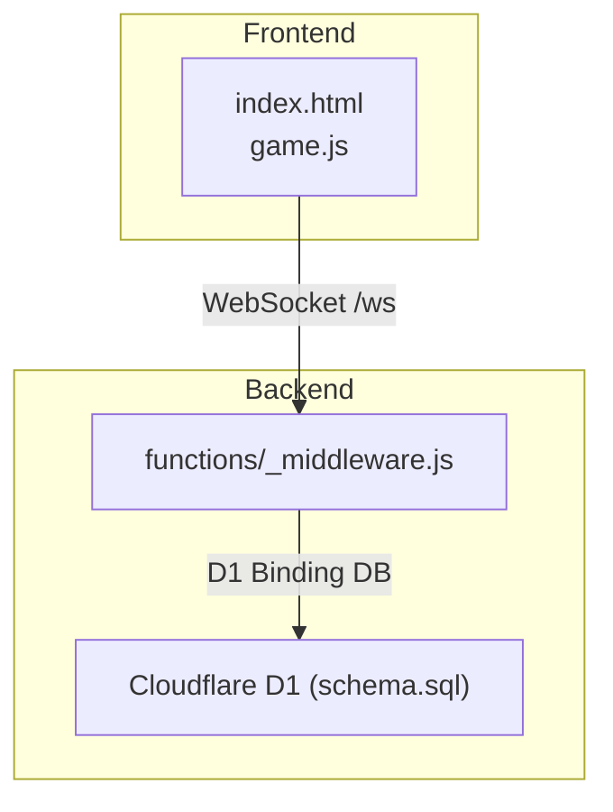
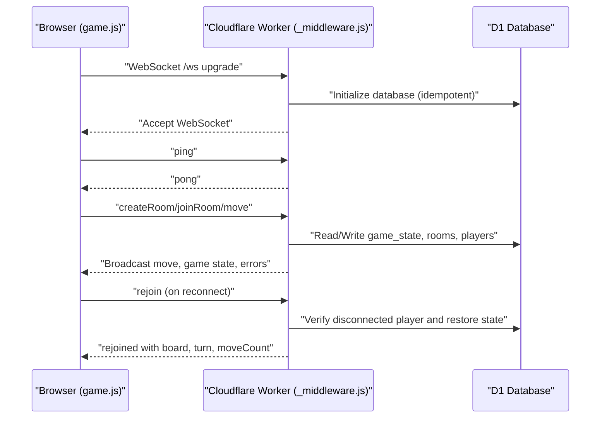
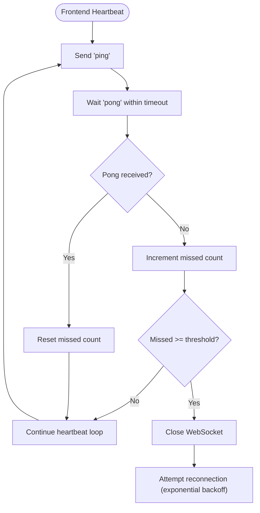
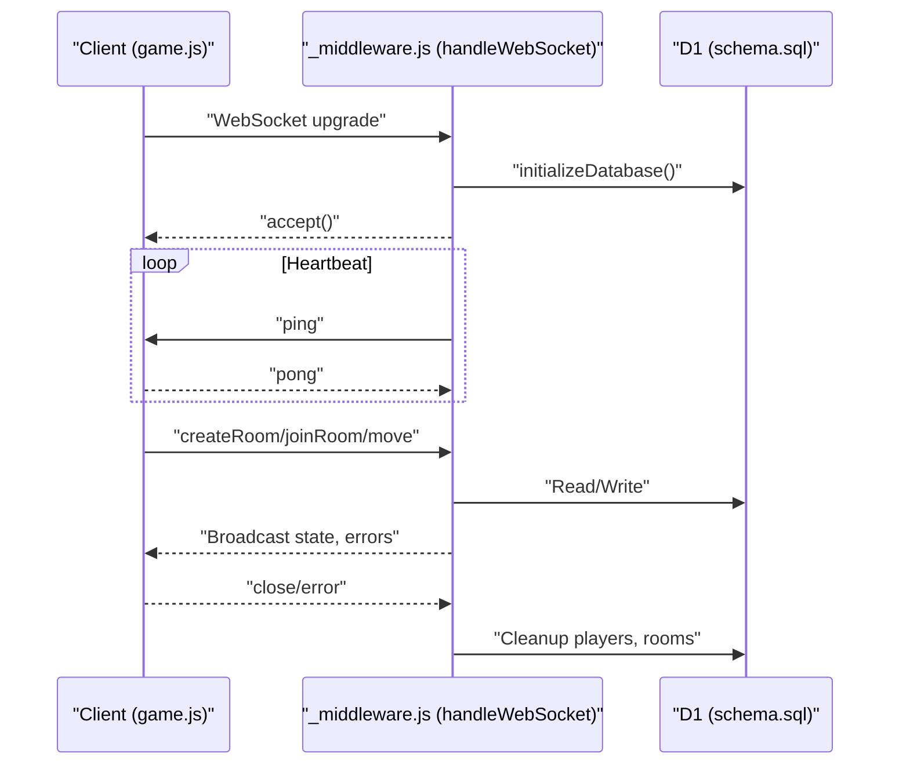
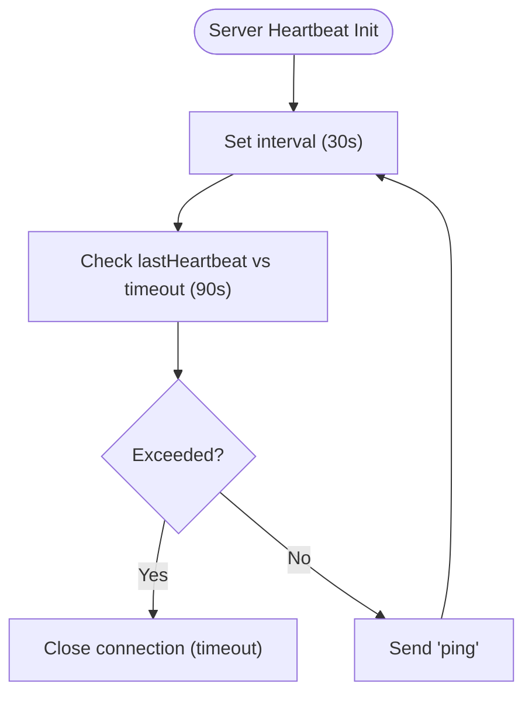
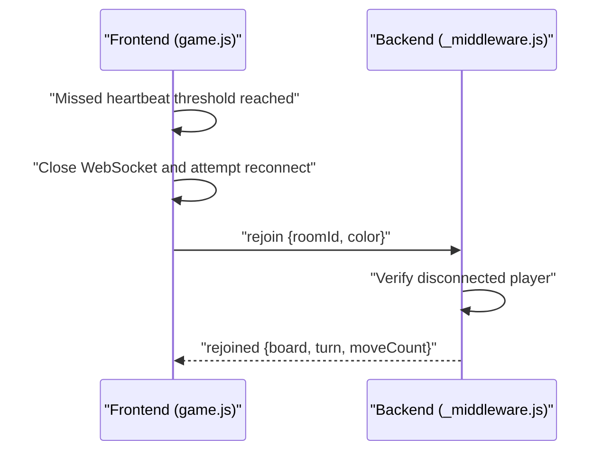
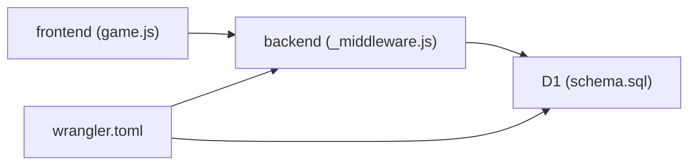

# Monitoring and Logging

<cite>
**Referenced Files in This Document**
- [README.md](file://README.md)
- [DEPLOYMENT.md](file://DEPLOYMENT.md)
- [TROUBLESHOOTING.md](file://TROUBLESHOOTING.md)
- [wrangler.toml](file://wrangler.toml)
- [functions/_middleware.js](file://functions/_middleware.js)
- [game.js](file://game.js)
- [index.html](file://index.html)
- [schema.sql](file://schema.sql)
- [tests/unit/heartbeat.test.js](file://tests/unit/heartbeat.test.js)
- [tests/unit/reconnection.test.js](file://tests/unit/reconnection.test.js)
- [tests/integration/websocket.test.js](file://tests/integration/websocket.test.js)
</cite>

## Table of Contents
1. [Introduction](#introduction)
2. [Project Structure](#project-structure)
3. [Core Components](#core-components)
4. [Architecture Overview](#architecture-overview)
5. [Detailed Component Analysis](#detailed-component-analysis)
6. [Dependency Analysis](#dependency-analysis)
7. [Performance Considerations](#performance-considerations)
8. [Troubleshooting Guide](#troubleshooting-guide)
9. [Conclusion](#conclusion)
10. [Appendices](#appendices)

## Introduction
This document provides comprehensive monitoring and logging guidance for the production environment of the Chinese Chess Online application. It covers logging strategies for both frontend and backend components, WebSocket connection monitoring, game state tracking, Cloudflare Workers logging capabilities, error tracking, performance metrics collection, heartbeat monitoring, connection health checks, automatic reconnection mechanisms, alerting strategies, log aggregation, debugging techniques, monitoring dashboards setup, key performance indicators (KPIs), operational metrics, troubleshooting workflows, and maintenance procedures.

## Project Structure
The project is structured with a static frontend (HTML/CSS/JavaScript) hosted on Cloudflare Pages and a Cloudflare Pages Function acting as a WebSocket server. The backend logic resides in a single middleware file that handles WebSocket upgrades, room management, game state, and database operations. The frontend implements robust heartbeat, reconnection, and polling mechanisms to ensure resilient multiplayer gameplay.

**Diagram sources**
- [index.html](file://index.html)
- [game.js](file://game.js)
- [functions/_middleware.js](file://functions/_middleware.js)
- [schema.sql](file://schema.sql)

**Section sources**
- [README.md](file://README.md)
- [DEPLOYMENT.md](file://DEPLOYMENT.md)
- [wrangler.toml](file://wrangler.toml)

## Core Components
- Frontend WebSocket client (game.js): Implements heartbeat, reconnection, polling, and UI state updates.
- Backend WebSocket server (_middleware.js): Manages connections, rooms, game state, database operations, and heartbeat enforcement.
- Database schema (schema.sql): Defines tables and indexes for rooms, game_state, and players.
- Deployment configuration (wrangler.toml): Defines Pages output directory and D1 binding.

Key monitoring touchpoints:
- Frontend logs: Browser console for connection state, errors, and heartbeat behavior.
- Backend logs: Server-side console logging for database initialization, room actions, move handling, and connection lifecycle events.
- Cloudflare Workers/D1: Platform logs and analytics for runtime visibility.

**Section sources**
- [game.js](file://game.js)
- [functions/_middleware.js](file://functions/_middleware.js)
- [schema.sql](file://schema.sql)
- [wrangler.toml](file://wrangler.toml)

## Architecture Overview
The system uses Cloudflare Pages for static hosting and Cloudflare Pages Functions for real-time WebSocket communication. The frontend connects to the backend via WebSocket, exchanges game state updates, and relies on heartbeat and reconnection logic for resilience. The backend persists game state and player metadata in D1.

**Diagram sources**
- [functions/_middleware.js](file://functions/_middleware.js)
- [game.js](file://game.js)
- [schema.sql](file://schema.sql)

**Section sources**
- [DEPLOYMENT.md](file://DEPLOYMENT.md)
- [functions/_middleware.js](file://functions/_middleware.js)
- [game.js](file://game.js)

## Detailed Component Analysis

### Frontend Monitoring and Logging (game.js)
- Connection state tracking: Maintains and displays connection status (connected, connecting, disconnected, reconnecting).
- Heartbeat monitoring: Sends periodic ping messages and expects pong responses; tracks missed heartbeats and triggers reconnection if threshold exceeded.
- Reconnection logic: Exponential backoff with capped delay; stops after maximum attempts.
- Polling fallbacks: Periodic polling for opponent presence and move updates when WebSocket is unavailable.
- Error handling: Graceful degradation on message parsing errors; displays user-friendly messages.

**Diagram sources**
- [game.js](file://game.js)

**Section sources**
- [game.js](file://game.js)
- [index.html](file://index.html)

### Backend Monitoring and Logging (functions/_middleware.js)
- Database initialization: Idempotent initialization on each request; logs success/failure.
- WebSocket lifecycle: Accepts connections, manages per-connection state, and cleans up on close.
- Heartbeat enforcement: Periodic ping sent to clients; connection timeout closes stale connections.
- Room management: Creates rooms, joins players, leaves rooms, and cleans up empty rooms.
- Game logic: Validates moves, applies optimistic locking, broadcasts updates, and handles resignations.
- Error handling: Centralized error codes and messages; logs detailed errors for diagnostics.

**Diagram sources**
- [functions/_middleware.js](file://functions/_middleware.js)
- [schema.sql](file://schema.sql)

**Section sources**
- [functions/_middleware.js](file://functions/_middleware.js)
- [schema.sql](file://schema.sql)

### Database Monitoring and Schema (schema.sql)
- Tables: rooms, game_state, players with appropriate foreign keys and indexes.
- Indexes: optimize lookups by name, status, room_id, and updated_at.
- Operational notes: D1 is used for persistence; ensure bindings are configured in wrangler.toml.

**Section sources**
- [schema.sql](file://schema.sql)
- [wrangler.toml](file://wrangler.toml)

### Cloudflare Workers Logging and Analytics
- Logs: Access via Cloudflare Dashboard under Pages -> Functions -> Logs for server-side errors and informational messages.
- Analytics: Use Cloudflare Web Analytics to observe real users and traffic.
- Troubleshooting: Cross-reference browser console logs with server logs for end-to-end diagnosis.

**Section sources**
- [DEPLOYMENT.md](file://DEPLOYMENT.md)
- [TROUBLESHOOTING.md](file://TROUBLESHOOTING.md)

### Heartbeat Monitoring and Health Checks
- Server-side heartbeat: Periodic ping with timeout-based disconnection.
- Client-side heartbeat: Missed heartbeat detection with reconnection trigger.
- Test coverage: Unit tests validate heartbeat intervals, timeout thresholds, and dead connection detection.

**Diagram sources**
- [functions/_middleware.js](file://functions/_middleware.js)
- [tests/unit/heartbeat.test.js](file://tests/unit/heartbeat.test.js)

**Section sources**
- [functions/_middleware.js](file://functions/_middleware.js)
- [tests/unit/heartbeat.test.js](file://tests/unit/heartbeat.test.js)

### Connection Health Checks and Automatic Reconnection
- Frontend reconnection: Exponential backoff with jitter; caps maximum delay; stops after max attempts.
- Backend reconnection: Supports rejoin with state recovery; prevents race conditions by verifying disconnected status.
- Polling fallbacks: Opponent presence and move polling ensure synchronization when WebSocket is unstable.

**Diagram sources**
- [game.js](file://game.js)
- [functions/_middleware.js](file://functions/_middleware.js)
- [tests/unit/reconnection.test.js](file://tests/unit/reconnection.test.js)

**Section sources**
- [game.js](file://game.js)
- [functions/_middleware.js](file://functions/_middleware.js)
- [tests/unit/reconnection.test.js](file://tests/unit/reconnection.test.js)

### Error Tracking and Logging Strategies
- Frontend: Console logging for connection state, heartbeat, and move operations; user-facing messages for errors.
- Backend: Structured console logs for database operations, room actions, move validation, and connection lifecycle; centralized error codes.
- Database errors: Logged with context; ensure D1 binding is configured to avoid "Database not configured" errors.

**Section sources**
- [game.js](file://game.js)
- [functions/_middleware.js](file://functions/_middleware.js)
- [TROUBLESHOOTING.md](file://TROUBLESHOOTING.md)

### Performance Metrics Collection
- Latency measurements: WebSocket round-trip time via heartbeat; database query latency via D1 performance.
- Throughput: Track number of rooms, active players, and move frequency.
- Availability: Monitor uptime, reconnection success rate, and error rates.

[No sources needed since this section provides general guidance]

### Alerting Strategies
- Threshold-based alerts: Heartbeat failure, excessive database errors, high reconnection rates, and long queue times.
- Log-based alerts: Parse server logs for error patterns and escalate on recurring issues.
- SLIs/SLOs: Define acceptable p95/p99 latencies for moves and room operations.

[No sources needed since this section provides general guidance]

### Log Aggregation and Debugging Techniques
- Browser console: Inspect WebSocket frames, connection state, and error messages.
- Server logs: Filter by prefixes such as [DB], [Room], [Game], [WS] for targeted debugging.
- D1 console: Validate schema and inspect tables for rooms, game_state, and players.
- Reproduce issues: Use test suites to simulate scenarios (heartbeat, reconnection, database errors).

**Section sources**
- [TROUBLESHOOTING.md](file://TROUBLESHOOTING.md)
- [tests/integration/websocket.test.js](file://tests/integration/websocket.test.js)

### Monitoring Dashboards and KPIs
- Dashboards: Use Cloudflare Dashboard analytics for traffic and performance insights.
- KPIs:
  - Connection success rate
  - Average heartbeat round-trip
  - Database query latency
  - Room creation/join success rate
  - Move acceptance rate
  - Reconnection attempts and success ratio

[No sources needed since this section provides general guidance]

## Dependency Analysis
The frontend depends on the backend WebSocket service and D1 for persistence. The backend depends on D1 for state and player metadata. The deployment configuration binds D1 to the worker.

**Diagram sources**
- [game.js](file://game.js)
- [functions/_middleware.js](file://functions/_middleware.js)
- [schema.sql](file://schema.sql)
- [wrangler.toml](file://wrangler.toml)

**Section sources**
- [wrangler.toml](file://wrangler.toml)
- [functions/_middleware.js](file://functions/_middleware.js)
- [schema.sql](file://schema.sql)

## Performance Considerations
- Optimize database queries: Use indexes on frequently queried columns (rooms.name, players.room_id, game_state.updated_at).
- Minimize payload sizes: Transmit compact move objects and JSON-encoded board snapshots.
- Reduce contention: Use optimistic locking for move updates to minimize conflicts.
- Network resilience: Rely on heartbeat and exponential backoff to handle transient failures.

[No sources needed since this section provides general guidance]

## Troubleshooting Guide
- WebSocket connection fails:
  - Verify middleware routes /ws and accepts WebSocket upgrades.
  - Check browser console for WebSocket errors.
- Database not configured:
  - Ensure D1 binding is configured in wrangler.toml and Pages settings.
  - Confirm database initialization logs.
- Room not found or full:
  - Validate room ID/name and status.
- Moves not syncing:
  - Check database write errors and WebSocket broadcast status.
- Heartbeat and reconnection:
  - Review frontend missed heartbeat thresholds and backend timeout settings.
  - Use test suites to simulate heartbeat and reconnection scenarios.

**Section sources**
- [TROUBLESHOOTING.md](file://TROUBLESHOOTING.md)
- [DEPLOYMENT.md](file://DEPLOYMENT.md)
- [tests/unit/heartbeat.test.js](file://tests/unit/heartbeat.test.js)
- [tests/unit/reconnection.test.js](file://tests/unit/reconnection.test.js)
- [tests/integration/websocket.test.js](file://tests/integration/websocket.test.js)

## Conclusion
The Chinese Chess Online application implements robust monitoring and logging across both frontend and backend components. The frontend’s heartbeat and reconnection logic ensures resilient gameplay, while the backend’s structured logging and database operations provide clear observability. By leveraging Cloudflare Workers logs, D1 analytics, and test-driven validation, operators can maintain high availability, quickly diagnose issues, and continuously improve performance and reliability.

[No sources needed since this section summarizes without analyzing specific files]

## Appendices

### Appendix A: Production Checklist
- Confirm D1 binding and database initialization.
- Validate WebSocket routing and heartbeat behavior.
- Enable Cloudflare Web Analytics for traffic insights.
- Set up log parsing for error prefixes and critical events.
- Monitor reconnection success and heartbeat failure rates.

**Section sources**
- [DEPLOYMENT.md](file://DEPLOYMENT.md)
- [TROUBLESHOOTING.md](file://TROUBLESHOOTING.md)