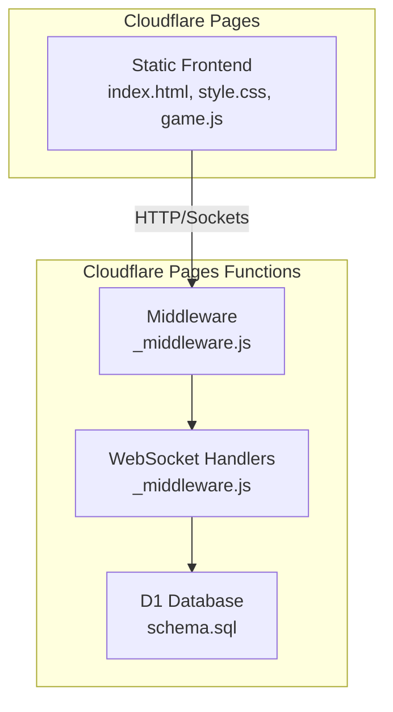
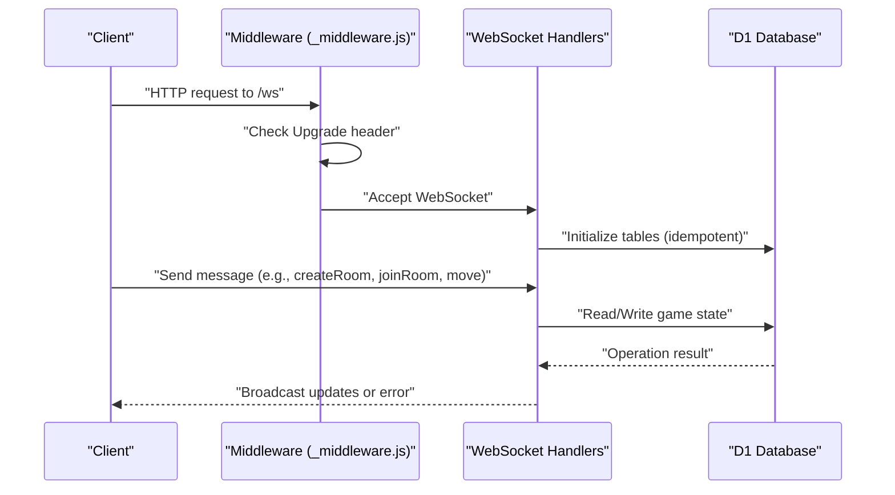
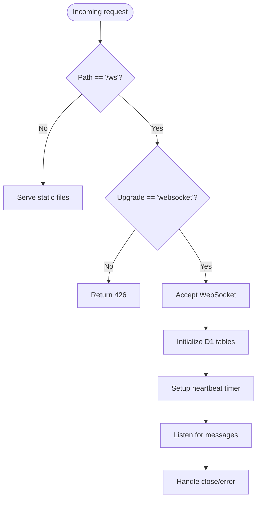
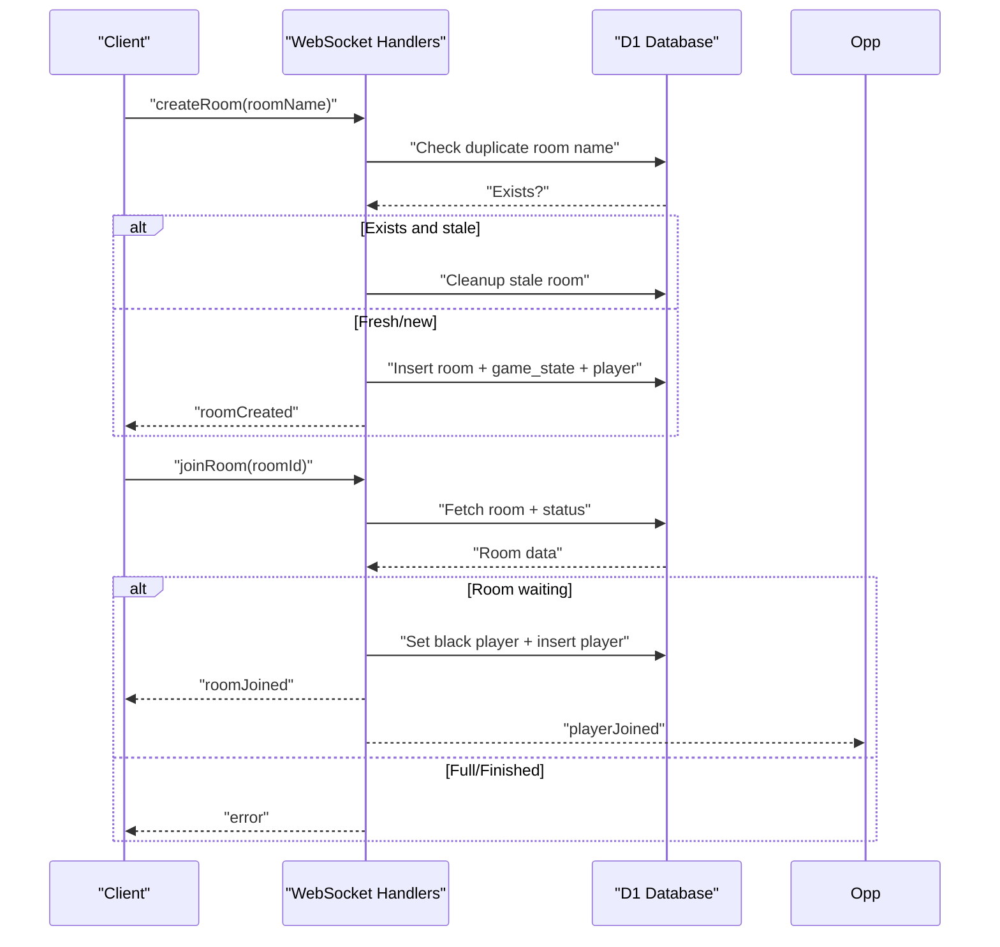
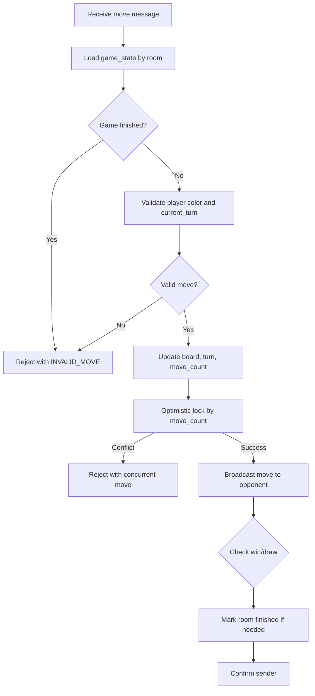
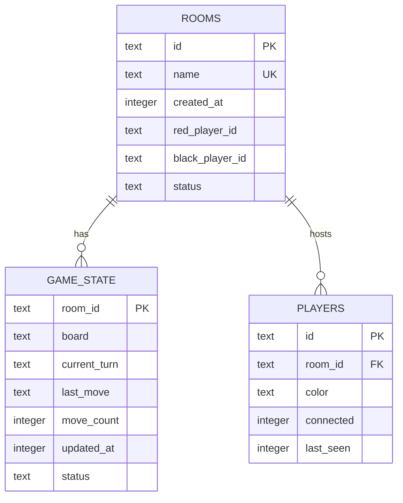
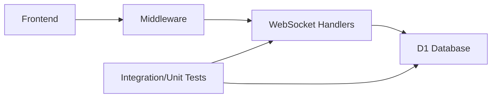
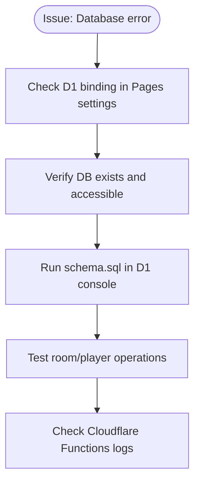
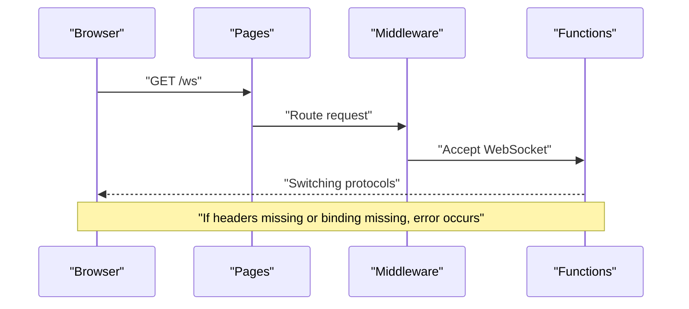
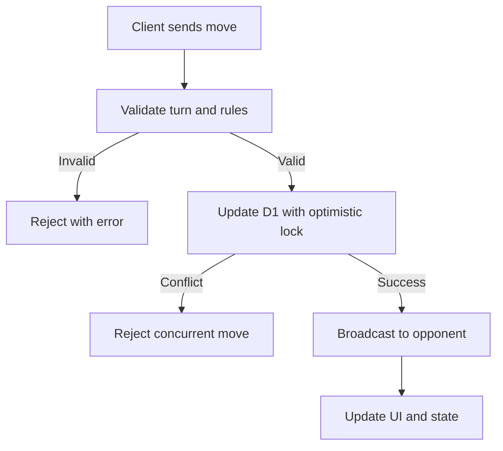

# Troubleshooting Guide

<cite>
**Referenced Files in This Document**
- [TROUBLESHOOTING.md](file://TROUBLESHOOTING.md)
- [DEPLOYMENT.md](file://DEPLOYMENT.md)
- [FIX_D1_BINDING.md](file://FIX_D1_BINDING.md)
- [SETUP_D1.md](file://SETUP_D1.md)
- [functions/_middleware.js](file://functions/_middleware.js)
- [schema.sql](file://schema.sql)
- [tests/integration/websocket.test.js](file://tests/integration/websocket.test.js)
- [tests/integration/database.test.js](file://tests/integration/database.test.js)
- [tests/unit/chess-rules.test.js](file://tests/unit/chess-rules.test.js)
- [tests/unit/game-state.test.js](file://tests/unit/game-state.test.js)
</cite>

## Table of Contents
1. [Introduction](#introduction)
2. [Project Structure](#project-structure)
3. [Core Components](#core-components)
4. [Architecture Overview](#architecture-overview)
5. [Detailed Component Analysis](#detailed-component-analysis)
6. [Dependency Analysis](#dependency-analysis)
7. [Performance Considerations](#performance-considerations)
8. [Troubleshooting Guide](#troubleshooting-guide)
9. [Conclusion](#conclusion)
10. [Appendices](#appendices)

## Introduction
This guide provides a comprehensive, step-by-step troubleshooting resource for deploying and operating the Chinese Chess multiplayer game on Cloudflare Pages with WebSockets and D1 database. It covers diagnosing WebSocket connection issues, database connectivity and initialization problems, performance bottlenecks, and operational pitfalls. It also explains debugging techniques for game state synchronization, move validation errors, and player matching failures, along with Cloudflare-specific workflows for D1 binding and routing configuration.

## Project Structure
The project is organized around a Cloudflare Pages front-end and Pages Functions backend. The backend routes WebSocket traffic and manages game logic, rooms, and database operations. D1 provides persistent storage for rooms, game state, and players. Tests validate WebSocket behavior, database operations, and chess rules.

**Diagram sources**
- [DEPLOYMENT.md:6-21](file://DEPLOYMENT.md#L6-L21)
- [functions/_middleware.js:104-122](file://functions/_middleware.js#L104-L122)
- [schema.sql:1-42](file://schema.sql#L1-L42)

**Section sources**
- [DEPLOYMENT.md:6-21](file://DEPLOYMENT.md#L6-L21)
- [functions/_middleware.js:104-122](file://functions/_middleware.js#L104-L122)
- [schema.sql:1-42](file://schema.sql#L1-L42)

## Core Components
- Middleware and WebSocket routing: Accepts WebSocket upgrades, manages connections, and routes messages.
- Room management: Creates/joins rooms, tracks players, and cleans up stale rooms.
- Game logic: Validates moves, applies rules, and synchronizes state across clients.
- Database: D1-backed schema for rooms, game_state, and players with indexes for performance.
- Error codes and logging: Centralized error codes and structured logging for diagnostics.

**Section sources**
- [functions/_middleware.js:13-40](file://functions/_middleware.js#L13-L40)
- [functions/_middleware.js:282-351](file://functions/_middleware.js#L282-L351)
- [functions/_middleware.js:522-683](file://functions/_middleware.js#L522-L683)
- [schema.sql:5-42](file://schema.sql#L5-L42)

## Architecture Overview
The system uses Cloudflare Pages for hosting, Pages Functions for WebSocket handling and game logic, and D1 for persistent storage. The middleware accepts WebSocket connections, validates messages, and coordinates database operations and broadcasting.

**Diagram sources**
- [functions/_middleware.js:115-185](file://functions/_middleware.js#L115-L185)
- [functions/_middleware.js:231-276](file://functions/_middleware.js#L231-L276)
- [functions/_middleware.js:46-98](file://functions/_middleware.js#L46-L98)

**Section sources**
- [functions/_middleware.js:115-185](file://functions/_middleware.js#L115-L185)
- [functions/_middleware.js:231-276](file://functions/_middleware.js#L231-L276)
- [functions/_middleware.js:46-98](file://functions/_middleware.js#L46-L98)

## Detailed Component Analysis

### WebSocket Connection Management
- Accepts WebSocket upgrades and sets up heartbeat timers.
- Tracks connections per instance and handles disconnections.
- Sends structured error messages using centralized error codes.

**Diagram sources**
- [functions/_middleware.js:104-122](file://functions/_middleware.js#L104-L122)
- [functions/_middleware.js:131-185](file://functions/_middleware.js#L131-L185)
- [functions/_middleware.js:191-225](file://functions/_middleware.js#L191-L225)

**Section sources**
- [functions/_middleware.js:104-122](file://functions/_middleware.js#L104-L122)
- [functions/_middleware.js:131-185](file://functions/_middleware.js#L131-L185)
- [functions/_middleware.js:191-225](file://functions/_middleware.js#L191-L225)

### Room Management and Player Matching
- Creates rooms with unique names and initializes game state.
- Joins rooms, assigns colors, and notifies opponents.
- Detects stale rooms and cleans up unused entries.

**Diagram sources**
- [functions/_middleware.js:282-351](file://functions/_middleware.js#L282-L351)
- [functions/_middleware.js:353-443](file://functions/_middleware.js#L353-L443)
- [functions/_middleware.js:479-516](file://functions/_middleware.js#L479-L516)

**Section sources**
- [functions/_middleware.js:282-351](file://functions/_middleware.js#L282-L351)
- [functions/_middleware.js:353-443](file://functions/_middleware.js#L353-L443)
- [functions/_middleware.js:479-516](file://functions/_middleware.js#L479-L516)

### Move Validation and Synchronization
- Validates turns and piece ownership.
- Applies move rules and checks for check/checkmate.
- Uses optimistic locking on game_state to prevent concurrent move conflicts.
- Broadcasts move updates to opponents.

**Diagram sources**
- [functions/_middleware.js:522-683](file://functions/_middleware.js#L522-L683)

**Section sources**
- [functions/_middleware.js:522-683](file://functions/_middleware.js#L522-L683)

### Database Schema and Initialization
- D1 schema defines rooms, game_state, and players with foreign keys and indexes.
- Middleware initializes tables idempotently on each request.

**Diagram sources**
- [schema.sql:5-42](file://schema.sql#L5-L42)
- [functions/_middleware.js:46-98](file://functions/_middleware.js#L46-L98)

**Section sources**
- [schema.sql:5-42](file://schema.sql#L5-L42)
- [functions/_middleware.js:46-98](file://functions/_middleware.js#L46-L98)

## Dependency Analysis
- Middleware depends on D1 bindings for database operations.
- WebSocket handlers depend on middleware for routing and initialization.
- Tests validate WebSocket behavior, database operations, and chess rules independently.

**Diagram sources**
- [functions/_middleware.js:104-122](file://functions/_middleware.js#L104-L122)
- [tests/integration/websocket.test.js:1-404](file://tests/integration/websocket.test.js#L1-L404)
- [tests/integration/database.test.js:1-371](file://tests/integration/database.test.js#L1-L371)

**Section sources**
- [functions/_middleware.js:104-122](file://functions/_middleware.js#L104-L122)
- [tests/integration/websocket.test.js:1-404](file://tests/integration/websocket.test.js#L1-L404)
- [tests/integration/database.test.js:1-371](file://tests/integration/database.test.js#L1-L371)

## Performance Considerations
- Database writes: ~10–50 ms; WebSocket broadcast: <5 ms; total move sync latency under 100 ms.
- Monitor Cloudflare dashboard for service health and latency.
- Use indexes on frequently queried columns (rooms.name, rooms.status, players.room_id, game_state.updated_at).

**Section sources**
- [SETUP_D1.md:115-120](file://SETUP_D1.md#L115-L120)

## Troubleshooting Guide

### Local Development Issues
- Dependency installation failures: Reinstall dependencies and rebuild.
- Local D1 not working: Remove local state and reinitialize.
- Port conflicts: Kill the process or change the port.
- Tests failing with module errors: Ensure dependencies are installed and run tests.

**Section sources**
- [TROUBLESHOOTING.md:15-54](file://TROUBLESHOOTING.md#L15-L54)

### Database Issues
- “Database not configured”: Verify D1 binding in Pages settings and redeploy.
- “Room name already exists”: Choose a unique room name.
- “Room not found” when joining: Confirm room ID/name and database availability.
- Auto-initialization failures: Manually run schema in D1 console; check initialization logs.

**Diagram sources**
- [FIX_D1_BINDING.md:24-42](file://FIX_D1_BINDING.md#L24-L42)
- [SETUP_D1.md:46-66](file://SETUP_D1.md#L46-L66)

**Section sources**
- [TROUBLESHOOTING.md:58-125](file://TROUBLESHOOTING.md#L58-L125)
- [FIX_D1_BINDING.md:24-42](file://FIX_D1_BINDING.md#L24-L42)
- [SETUP_D1.md:46-66](file://SETUP_D1.md#L46-L66)

### WebSocket Issues
- Connection fails: Ensure `/ws` route is handled by middleware and WebSocket upgrade headers are present.
- Stuck in connecting: Refresh, check network, and verify D1 binding.
- Console errors: Inspect browser DevTools and Cloudflare Functions logs for error prefixes.

**Diagram sources**
- [DEPLOYMENT.md:84-87](file://DEPLOYMENT.md#L84-L87)
- [functions/_middleware.js:115-140](file://functions/_middleware.js#L115-L140)

**Section sources**
- [TROUBLESHOOTING.md:126-152](file://TROUBLESHOOTING.md#L126-L152)
- [DEPLOYMENT.md:84-87](file://DEPLOYMENT.md#L84-L87)
- [functions/_middleware.js:115-140](file://functions/_middleware.js#L115-L140)

### Game Logic and Synchronization Problems
- Moves not syncing: Check database write errors and WebSocket broadcast; ensure both players are connected.
- Move validation errors (“Not your turn”, “Invalid move”): Validate turn ownership and rule compliance.
- Concurrent move conflicts: Optimistic locking rejects conflicting moves; instruct client to refresh state.

**Diagram sources**
- [functions/_middleware.js:522-683](file://functions/_middleware.js#L522-L683)

**Section sources**
- [functions/_middleware.js:522-683](file://functions/_middleware.js#L522-L683)
- [tests/unit/chess-rules.test.js:328-632](file://tests/unit/chess-rules.test.js#L328-L632)

### Player Matching Failures
- Room full or game finished: Inform user and suggest joining another room.
- Opponent not found: Use checkOpponent to verify presence; ensure both players are connected.

**Section sources**
- [functions/_middleware.js:353-443](file://functions/_middleware.js#L353-L443)
- [functions/_middleware.js:1148-1183](file://functions/_middleware.js#L1148-L1183)

### Cloudflare-Specific Issues
- D1 binding problems: Ensure variable name is exactly “DB” and binding targets the correct database; redeploy after changes.
- Routing configuration: Confirm `/ws` is routed to the middleware and WebSocket upgrade headers are preserved.

**Section sources**
- [FIX_D1_BINDING.md:77-108](file://FIX_D1_BINDING.md#L77-L108)
- [DEPLOYMENT.md:84-87](file://DEPLOYMENT.md#L84-L87)

### Logging and Diagnostics
- Browser console: Look for WebSocket errors and application messages.
- Cloudflare Functions logs: Search for prefixes like [createRoom], [joinRoom], [handleMove], [initializeDatabase].
- Test suites: Use integration and unit tests to validate WebSocket behavior and database operations.

**Section sources**
- [TROUBLESHOOTING.md:154-207](file://TROUBLESHOOTING.md#L154-L207)
- [tests/integration/websocket.test.js:1-404](file://tests/integration/websocket.test.js#L1-L404)
- [tests/integration/database.test.js:1-371](file://tests/integration/database.test.js#L1-L371)

### Step-by-Step Resolution Guides

- Resolve “Database not configured”
  1. Verify D1 binding in Pages settings (variable name “DB”).
  2. Confirm database exists and is accessible.
  3. Redeploy the project.
  4. Test room creation and joining.

- Resolve “Room not found” when joining
  1. Confirm room ID/name is correct.
  2. Check database tables exist.
  3. Verify D1 binding and redeploy if needed.

- Resolve WebSocket connection failures
  1. Ensure `/ws` route is handled by middleware.
  2. Verify WebSocket upgrade headers.
  3. Check browser console and Cloudflare logs.

- Resolve move synchronization issues
  1. Check database write logs for errors.
  2. Verify both players are connected.
  3. Ensure opponent has not disconnected.

- Resolve move validation errors
  1. Confirm turn ownership and current_turn.
  2. Validate move against chess rules.
  3. Handle “Not your turn” and “Invalid move” responses.

- Resolve concurrent move conflicts
  1. Expect moveRejected with concurrent conflict message.
  2. Instruct client to refresh game state and resend move.

**Section sources**
- [FIX_D1_BINDING.md:92-113](file://FIX_D1_BINDING.md#L92-L113)
- [TROUBLESHOOTING.md:111-152](file://TROUBLESHOOTING.md#L111-L152)
- [functions/_middleware.js:522-683](file://functions/_middleware.js#L522-L683)

### Escalation Procedures and Support Resources
- Before reporting: Use the quick diagnostic checklist and verify D1 setup.
- Collect logs: Browser console and Cloudflare Functions logs.
- Reproduce: Test with a fresh room and clean browser cache.
- Support: Use Cloudflare Dashboard for monitoring and logs; review deployment and D1 setup guides.

**Section sources**
- [TROUBLESHOOTING.md:173-207](file://TROUBLESHOOTING.md#L173-L207)
- [DEPLOYMENT.md:125-141](file://DEPLOYMENT.md#L125-L141)

## Conclusion
This guide consolidates practical troubleshooting workflows for WebSocket connectivity, database initialization and access, performance tuning, and game logic validation. By following the diagnostic steps, leveraging logs, and validating with tests, most issues can be resolved quickly. For persistent problems, escalate with collected logs and reproduction steps.

## Appendices

### Common Error Codes and Meanings
- DATABASE_NOT_CONFIGURED: D1 binding missing in Pages settings.
- ROOM_NAME_EXISTS: Duplicate room name during creation.
- ROOM_NOT_FOUND: Room does not exist or is finished.
- ROOM_FULL: Room already has two players.
- NOT_YOUR_TURN: Player attempted move out of turn.
- INVALID_MOVE: Move violated chess rules.
- DATABASE_ERROR: Generic database operation failure.

**Section sources**
- [functions/_middleware.js:13-40](file://functions/_middleware.js#L13-L40)