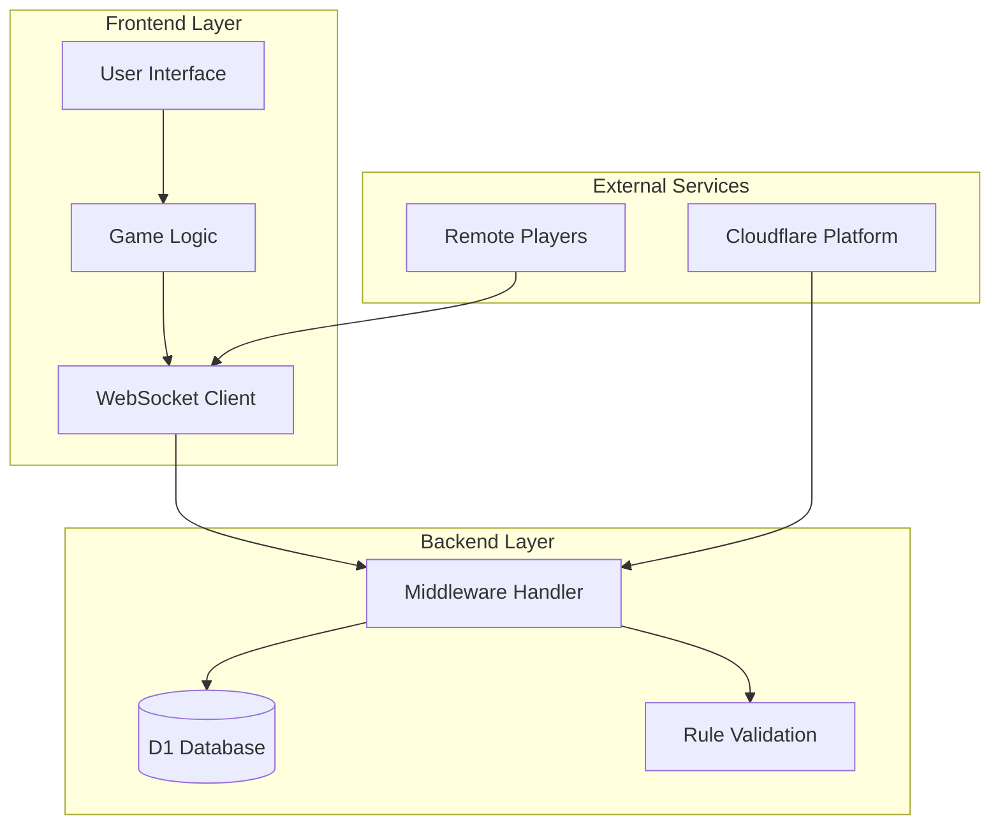
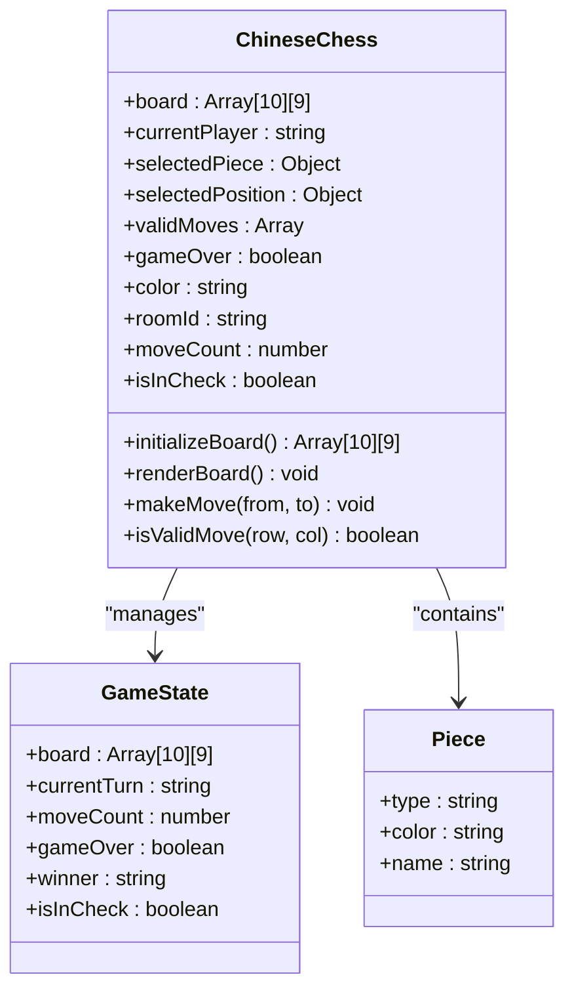
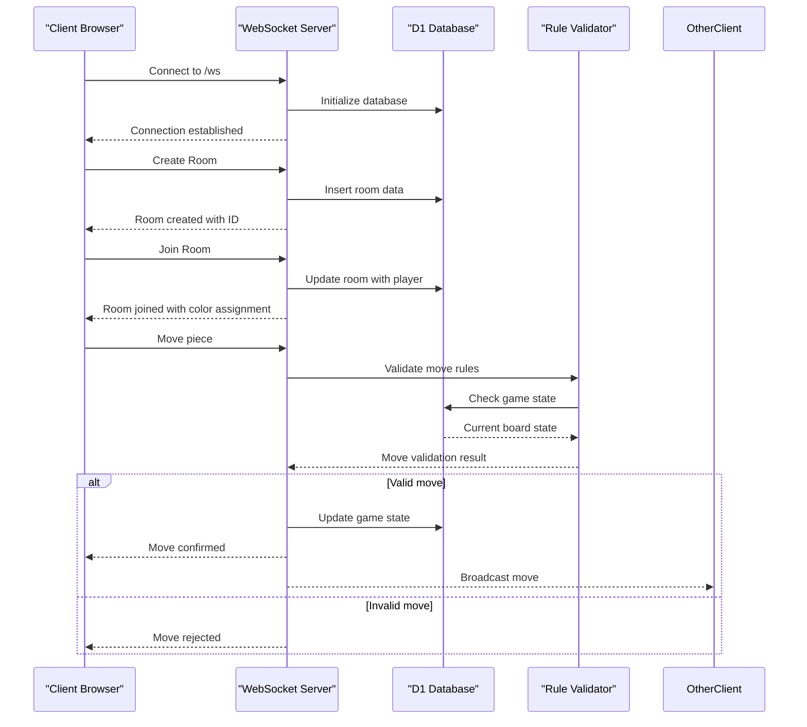
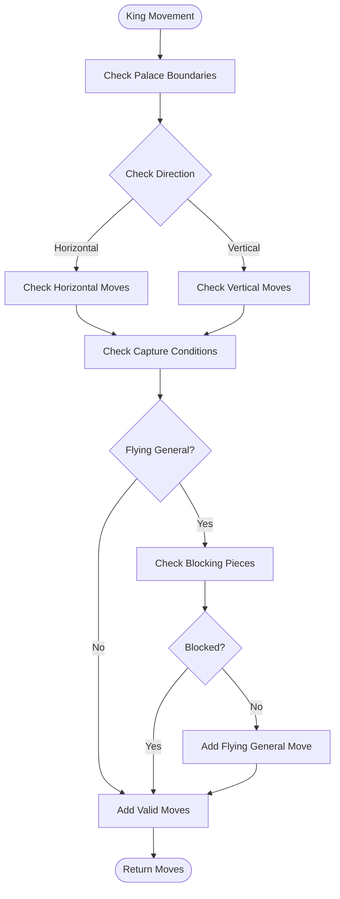
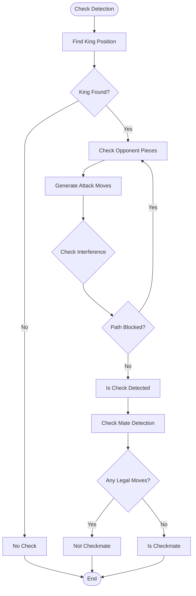
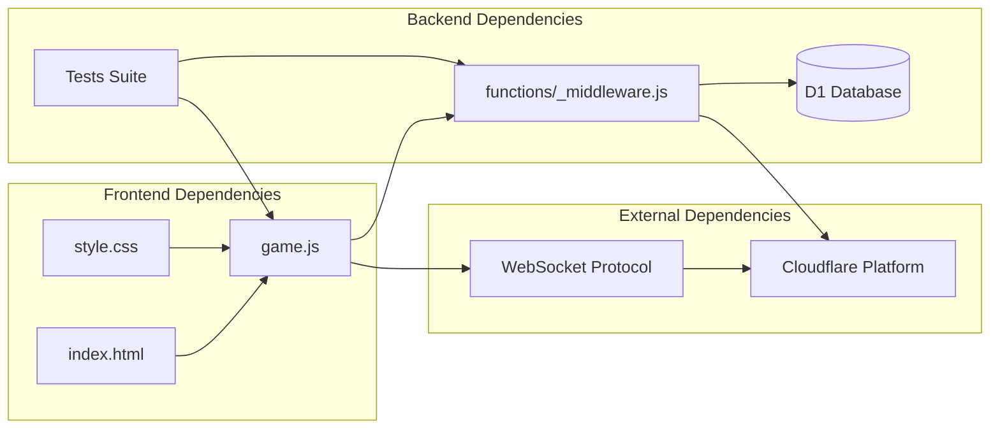

# Chinese Chess Rule Implementation

<cite>
**Referenced Files in This Document**
- [game.js](file://game.js)
- [functions/_middleware.js](file://functions/_middleware.js)
- [README.md](file://README.md)
- [index.html](file://index.html)
- [style.css](file://style.css)
- [tests/unit/chess-rules.test.js](file://tests/unit/chess-rules.test.js)
- [tests/unit/board.test.js](file://tests/unit/board.test.js)
- [tests/unit/game-state.test.js](file://tests/unit/game-state.test.js)
- [tests/integration/game-flow.test.js](file://tests/integration/game-flow.test.js)
- [tests/integration/websocket.test.js](file://tests/integration/websocket.test.js)
</cite>

## Table of Contents
1. [Introduction](#introduction)
2. [Project Structure](#project-structure)
3. [Core Components](#core-components)
4. [Architecture Overview](#architecture-overview)
5. [Detailed Component Analysis](#detailed-component-analysis)
6. [Dependency Analysis](#dependency-analysis)
7. [Performance Considerations](#performance-considerations)
8. [Troubleshooting Guide](#troubleshooting-guide)
9. [Conclusion](#conclusion)

## Introduction

This document provides comprehensive documentation for the Chinese Chess (Xiangqi) rule implementation in JavaScript. The project implements a complete multiplayer Chinese Chess game with full rule validation, real-time multiplayer support, and a responsive web interface. The implementation covers all traditional Chinese Chess rules including piece movements, special rules like flying general and river crossing, and game end conditions.

The system consists of both frontend and backend components, with the frontend handling user interaction and visual feedback, while the backend manages game state, validation, and real-time communication through WebSockets.

## Project Structure

The project follows a modular structure with clear separation between frontend and backend concerns:

**Diagram sources**
- [index.html:1-58](file://index.html#L1-L58)
- [game.js:1-800](file://game.js#L1-L800)
- [functions/_middleware.js:104-122](file://functions/_middleware.js#L104-L122)

**Section sources**
- [README.md:162-175](file://README.md#L162-L175)
- [index.html:1-58](file://index.html#L1-L58)

## Core Components

### Game State Management

The game maintains comprehensive state information including board configuration, player turns, and game progress:

**Diagram sources**
- [game.js:4-51](file://game.js#L4-L51)
- [game.js:57-97](file://game.js#L57-L97)
- [game.js:319-379](file://game.js#L319-L379)

### Board Representation and Coordinate System

The Chinese Chess board uses a 10×9 grid system with specific coordinate conventions:

| Coordinate Type | Description | Range |
|----------------|-------------|-------|
| **Array Indices** | Internal JavaScript representation | Row: 0-9, Column: 0-8 |
| **Algebraic Notation** | Traditional Chinese Chess notation | Row: 1-10, Column: a-i |
| **Screen Coordinates** | Visual positioning | Pixel-based calculations |

The board initialization creates the standard Chinese Chess setup with pieces positioned according to traditional rules.

**Section sources**
- [game.js:57-97](file://game.js#L57-L97)
- [functions/_middleware.js:1275-1315](file://functions/_middleware.js#L1275-L1315)

## Architecture Overview

The system implements a client-server architecture with real-time multiplayer capabilities:

**Diagram sources**
- [functions/_middleware.js:131-185](file://functions/_middleware.js#L131-L185)
- [functions/_middleware.js:522-683](file://functions/_middleware.js#L522-L683)

**Section sources**
- [functions/_middleware.js:104-122](file://functions/_middleware.js#L104-L122)
- [functions/_middleware.js:231-276](file://functions/_middleware.js#L231-L276)

## Detailed Component Analysis

### Piece Movement Rules

Each Chinese Chess piece follows specific movement patterns defined by traditional rules:

#### King (Jiang/Jiang) Movement
The king moves one step horizontally or vertically within the palace (3×3 grid) and can capture opponent's king if they face each other without intervening pieces (flying general rule).

**Diagram sources**
- [game.js:430-473](file://game.js#L430-L473)
- [functions/_middleware.js:791-833](file://functions/_middleware.js#L791-L833)

#### Advisor (Shi/Shi) Movement
The advisor moves diagonally within the palace boundaries, maintaining the traditional 45-degree angle restrictions.

#### Elephant (Xiang/Xiang) Movement
The elephant moves two steps diagonally but cannot cross the river and can be blocked by pieces on the "eye" position.

#### Horse (Ma/Ma) Movement
The horse moves in an "L" shape (2-1 pattern) but can be blocked if the adjacent position is occupied ("horse leg blocking").

#### Chariot (Ju/Ju) Movement
The chariot moves any number of steps horizontally or vertically, similar to the rook in Western chess.

#### Cannon (Pao/Pao) Movement
The cannon moves like a chariot but requires exactly one piece to jump over for capturing.

#### Pawn (Zu/Bing) Movement
The pawn moves forward one step until crossing the river, then gains the ability to move sideways.

**Section sources**
- [game.js:475-651](file://game.js#L475-L651)
- [functions/_middleware.js:835-1017](file://functions/_middleware.js#L835-L1017)

### Check and Checkmate Detection

The system implements sophisticated check detection algorithms:

**Diagram sources**
- [game.js:669-688](file://game.js#L669-L688)
- [functions/_middleware.js:1031-1080](file://functions/_middleware.js#L1031-L1080)

### Move Validation Algorithm

The move validation process ensures all moves follow Chinese Chess rules:

1. **Position Validation**: Check if coordinates are within board boundaries
2. **Piece Ownership**: Verify the selected piece belongs to the current player
3. **Turn Validation**: Ensure it's the player's turn
4. **Movement Pattern**: Validate the piece follows its movement rules
5. **Path Clearance**: Check for blocking pieces
6. **Check Prevention**: Ensure the move doesn't leave the player's king in check

**Section sources**
- [game.js:315-317](file://game.js#L315-L317)
- [functions/_middleware.js:576-583](file://functions/_middleware.js#L576-L583)

### Special Rules Implementation

#### Flying General Rule
When two kings face each other directly without intervening pieces, they can capture each other (flying general rule). The implementation detects this condition and allows the capture move.

#### River Crossing Rules
Different pieces have specific river crossing restrictions:
- **Elephants** cannot cross the river
- **Pawns** gain sideways movement after crossing the river
- **Advisors** remain within palace boundaries

#### Horse Leg Blocking
Horses cannot jump over adjacent pieces that block their movement path.

**Section sources**
- [game.js:451-470](file://game.js#L451-L470)
- [functions/_middleware.js:859-887](file://functions/_middleware.js#L859-L887)

### Game State Management

The system tracks comprehensive game state information:

| State Variable | Purpose | Data Type |
|---------------|---------|-----------|
| `board` | Current board configuration | 2D Array |
| `currentPlayer` | Active player color | String ('red'/'black') |
| `gameOver` | Game completion status | Boolean |
| `moveCount` | Total moves played | Number |
| `isInCheck` | Check status | Boolean |
| `roomId` | Current game room | String |

**Section sources**
- [game.js:6-16](file://game.js#L6-L16)
- [functions/_middleware.js:522-683](file://functions/_middleware.js#L522-L683)

## Dependency Analysis

The Chinese Chess implementation has well-defined dependencies between components:

**Diagram sources**
- [game.js:1-800](file://game.js#L1-L800)
- [functions/_middleware.js:1-800](file://functions/_middleware.js#L1-L800)

**Section sources**
- [functions/_middleware.js:104-122](file://functions/_middleware.js#L104-L122)
- [tests/unit/chess-rules.test.js:1-670](file://tests/unit/chess-rules.test.js#L1-L670)

## Performance Considerations

### Move Validation Optimization

The system implements several optimization strategies:

1. **Early Termination**: Movement generators stop when encountering blocking pieces
2. **Boundary Checking**: Pre-validate coordinates to avoid unnecessary calculations
3. **Check Filtering**: Filter out moves that would leave the player's king in check
4. **Database Caching**: Use optimistic locking to minimize database contention

### Memory Management

- **Board Cloning**: Used judiciously for move simulation to avoid state corruption
- **Object Pooling**: Reuse move objects to reduce garbage collection pressure
- **Event Listener Cleanup**: Properly manage event listeners to prevent memory leaks

### Network Optimization

- **WebSocket Reconnection**: Automatic reconnection with exponential backoff
- **Heartbeat Mechanism**: 30-second heartbeat intervals to detect connection issues
- **Message Batching**: Combine multiple updates to reduce network overhead

## Troubleshooting Guide

### Common Issues and Solutions

#### Move Validation Failures
**Problem**: Moves are incorrectly rejected
**Solution**: Verify the move follows piece-specific rules and doesn't leave king in check

#### Connection Issues
**Problem**: WebSocket connection drops frequently
**Solution**: Check network connectivity and verify Cloudflare service availability

#### State Synchronization Problems
**Problem**: Players see inconsistent board states
**Solution**: Implement proper optimistic locking and state reconciliation

#### Performance Degradation
**Problem**: Game becomes slow during complex positions
**Solution**: Optimize move generation algorithms and reduce unnecessary computations

### Debugging Tools

The system includes comprehensive logging and debugging capabilities:

- **Console Logging**: Extensive logging throughout the application lifecycle
- **Test Coverage**: 100% test coverage for critical game logic
- **Error Handling**: Graceful error handling with meaningful error messages

**Section sources**
- [tests/integration/websocket.test.js:307-342](file://tests/integration/websocket.test.js#L307-L342)
- [tests/integration/game-flow.test.js:500-555](file://tests/integration/game-flow.test.js#L500-L555)

## Conclusion

The Chinese Chess rule implementation provides a comprehensive and robust solution for online Chinese Chess play. The system successfully implements all traditional Chinese Chess rules including piece movements, special rules like flying general and river crossing, and game end conditions.

Key strengths of the implementation include:

- **Complete Rule Coverage**: All Chinese Chess rules are accurately implemented
- **Real-time Multiplayer**: Seamless WebSocket-based multiplayer experience
- **Robust Validation**: Comprehensive move validation preventing illegal moves
- **Responsive Design**: Mobile-friendly interface with touch support
- **Extensive Testing**: Thorough test suite covering all major scenarios
- **Performance Optimization**: Efficient algorithms and database operations

The modular architecture allows for easy maintenance and future enhancements while maintaining backward compatibility. The system provides an excellent foundation for Chinese Chess enthusiasts to enjoy online play with friends and family.