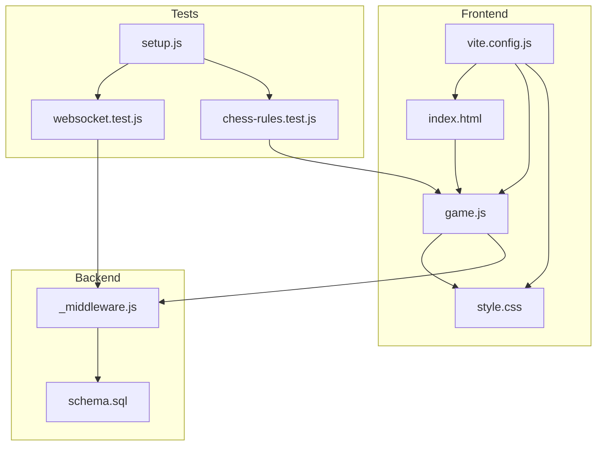
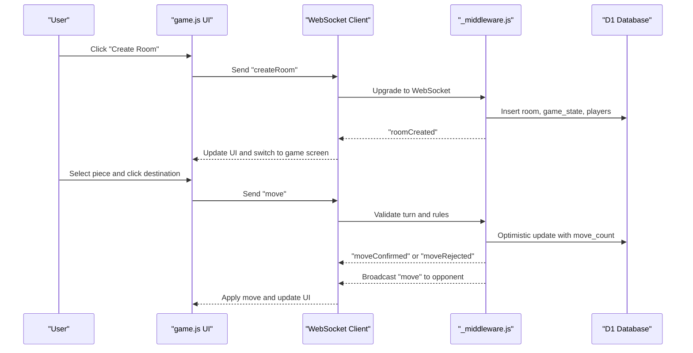
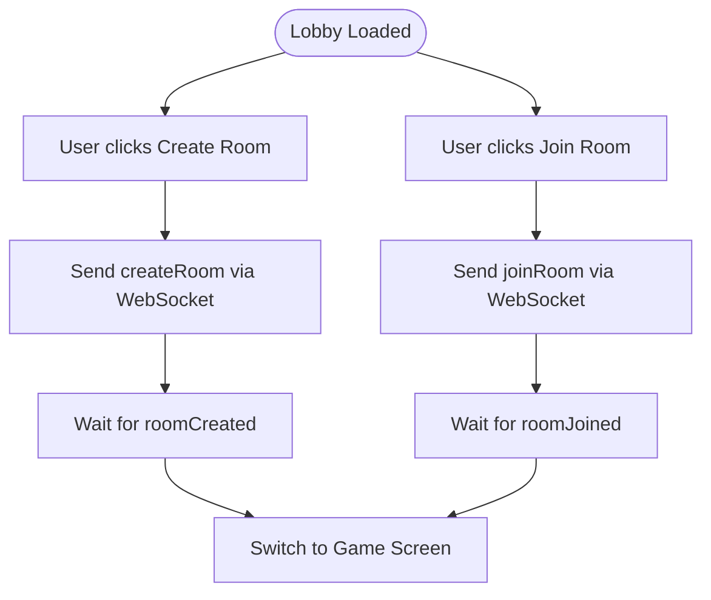
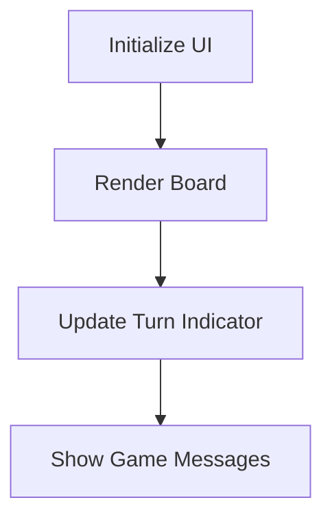
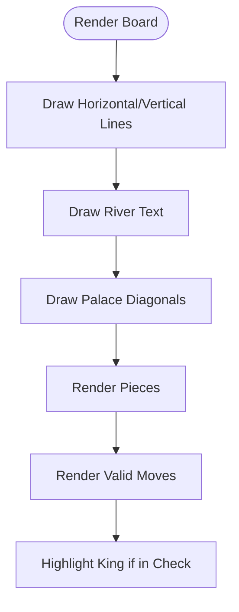
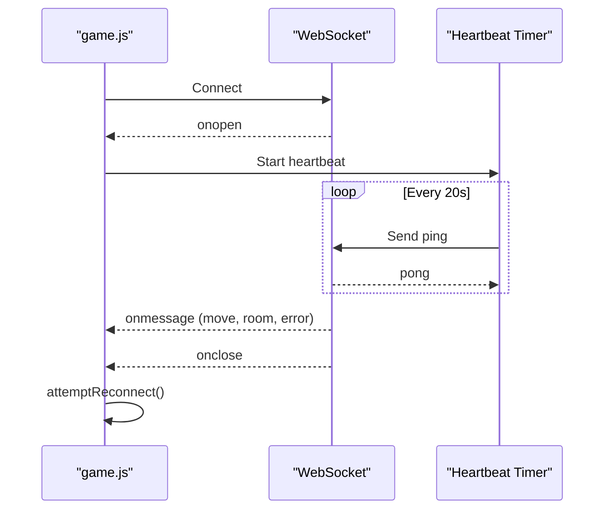
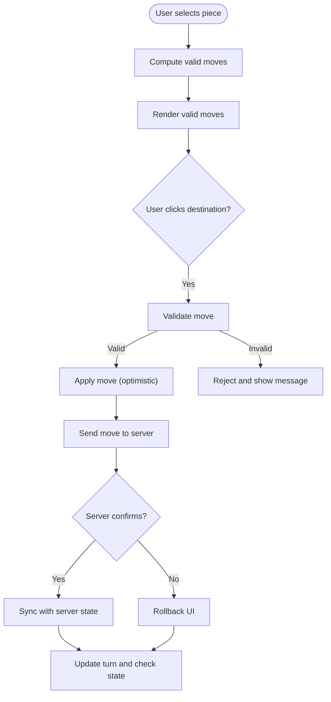
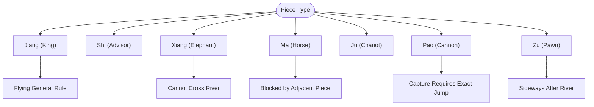
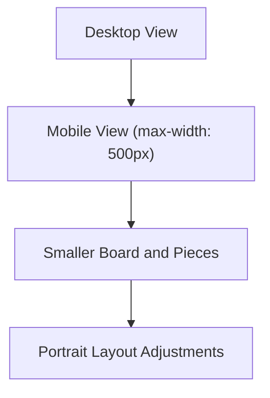
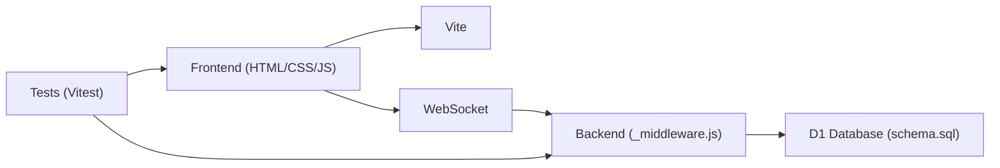

# Frontend Application

<cite>
**Referenced Files in This Document**
- [index.html](file://index.html)
- [game.js](file://game.js)
- [style.css](file://style.css)
- [README.md](file://README.md)
- [package.json](file://package.json)
- [vite.config.js](file://vite.config.js)
- [_middleware.js](file://functions/_middleware.js)
- [schema.sql](file://schema.sql)
- [websocket.test.js](file://tests/integration/websocket.test.js)
- [chess-rules.test.js](file://tests/unit/chess-rules.test.js)
- [setup.js](file://tests/setup.js)
</cite>

## Table of Contents
1. [Introduction](#introduction)
2. [Project Structure](#project-structure)
3. [Core Components](#core-components)
4. [Architecture Overview](#architecture-overview)
5. [Detailed Component Analysis](#detailed-component-analysis)
6. [Dependency Analysis](#dependency-analysis)
7. [Performance Considerations](#performance-considerations)
8. [Troubleshooting Guide](#troubleshooting-guide)
9. [Conclusion](#conclusion)
10. [Appendices](#appendices)

## Introduction
This document provides comprehensive documentation for the frontend application components of a Chinese Chess online game. It covers the user interface implementation (lobby and game screens), the game board and piece rendering, player information panels, the WebSocket client with reconnection and heartbeat logic, game state management, move validation and UI synchronization, responsive design for desktop and mobile, the complete Chinese Chess rule implementation in JavaScript, and the styling system with CSS architecture and visual feedback mechanisms. It also includes examples of DOM manipulation, event handling, and WebSocket communication patterns used in the frontend.

## Project Structure
The project follows a modular structure with a frontend built using HTML, CSS, and vanilla JavaScript, and a backend implemented as a Cloudflare Pages Function with WebSocket support and a D1 SQLite database. The frontend assets are built and served statically, while the backend handles real-time multiplayer logic and persistence.

**Diagram sources**
- [index.html](file://index.html)
- [game.js](file://game.js)
- [style.css](file://style.css)
- [vite.config.js](file://vite.config.js)
- [_middleware.js](file://functions/_middleware.js)
- [schema.sql](file://schema.sql)
- [websocket.test.js](file://tests/integration/websocket.test.js)
- [chess-rules.test.js](file://tests/unit/chess-rules.test.js)
- [setup.js](file://tests/setup.js)

**Section sources**
- [README.md](file://README.md)
- [package.json](file://package.json)
- [vite.config.js](file://vite.config.js)

## Core Components
- Lobby screen: Room creation and joining, connection status, and lobby messaging.
- Game screen: Player panels, turn indicator, game board, and game messages.
- Game logic: Board initialization, piece movement validation, check and checkmate detection, and game state synchronization.
- WebSocket client: Connection lifecycle, reconnection with exponential backoff, heartbeat monitoring, and message routing.
- Styling system: CSS architecture with responsive breakpoints and visual feedback.

**Section sources**
- [index.html](file://index.html)
- [game.js](file://game.js)
- [style.css](file://style.css)

## Architecture Overview
The frontend initializes the game state, renders the UI, and manages user interactions. It communicates with the backend via WebSocket for room management, move validation, and real-time updates. The backend persists game state in D1 and enforces Chinese Chess rules.

**Diagram sources**
- [game.js](file://game.js)
- [_middleware.js](file://functions/_middleware.js)
- [schema.sql](file://schema.sql)

## Detailed Component Analysis

### Lobby Interface
- Elements: Room creation input, join input, buttons, connection status, and lobby message area.
- Behavior: Creates or joins rooms via WebSocket, displays connection status, and shows lobby messages.

**Diagram sources**
- [index.html](file://index.html)
- [game.js](file://game.js)

**Section sources**
- [index.html](file://index.html)
- [game.js](file://game.js)

### Game Screen and Player Panels
- Player panels show player names and color indicators.
- Turn indicator reflects whose turn it is and whether the current player is in check.
- Game message area displays game events and notifications.

**Diagram sources**
- [index.html](file://index.html)
- [game.js](file://game.js)

**Section sources**
- [index.html](file://index.html)
- [game.js](file://game.js)

### Game Board and Piece Rendering
- Board rendering draws grid lines, river text, palace diagonals, and pieces.
- Pieces are clickable and visually highlighted when selected.
- Valid moves are indicated by small dots overlaying the board.

**Diagram sources**
- [game.js](file://game.js)

**Section sources**
- [game.js](file://game.js)

### Event Handling and DOM Manipulation
- Event listeners are attached to create/join/leave buttons.
- DOM elements are manipulated to switch screens, update messages, and reflect game state.

Examples (paths only):
- [Event listeners setup](file://game.js)
- [Switch to game screen](file://game.js)
- [Update turn indicator](file://game.js)
- [Show message](file://game.js)

**Section sources**
- [game.js](file://game.js)

### WebSocket Client Implementation
- Connection lifecycle: connect, handle open/close/error, and reconnection with exponential backoff.
- Heartbeat: periodic ping/pong with timeout-based reconnection.
- Message routing: dispatch to handlers for room actions, moves, and game state updates.

**Diagram sources**
- [game.js](file://game.js)

**Section sources**
- [game.js](file://game.js)

### Game State Management and Move Validation
- Move validation uses piece-specific movement rules and filters moves that would leave the king in check.
- UI state synchronization: optimistic UI updates with rollback on rejection, and authoritative updates from server broadcasts.

**Diagram sources**
- [game.js](file://game.js)

**Section sources**
- [game.js](file://game.js)

### Chinese Chess Rules Implementation
- Piece movement algorithms: general, advisor, elephant, horse, chariot, cannon, and pawn.
- Special rules: flying general, blocking, river crossing, and check/checkmate detection.

**Diagram sources**
- [game.js](file://game.js)
- [chess-rules.test.js](file://tests/unit/chess-rules.test.js)

**Section sources**
- [game.js](file://game.js)
- [chess-rules.test.js](file://tests/unit/chess-rules.test.js)

### Responsive Design
- CSS media queries adjust board size, line lengths, and font sizes for smaller screens.
- Flexbox layout adapts player info orientation on mobile.

**Diagram sources**
- [style.css](file://style.css)

**Section sources**
- [style.css](file://style.css)

### Styling System and Visual Feedback
- CSS architecture separates lobby, game header, board, pieces, and responsive styles.
- Visual feedback includes hover effects, selection highlighting, valid move indicators, and animated check warnings.

**Section sources**
- [style.css](file://style.css)

## Dependency Analysis
- Frontend depends on HTML/CSS/JS and Vite for building.
- Backend depends on Cloudflare Pages Functions, WebSocket, and D1 database.
- Tests depend on Vitest, mock DOM/WebSocket, and mock D1.

**Diagram sources**
- [vite.config.js](file://vite.config.js)
- [game.js](file://game.js)
- [_middleware.js](file://functions/_middleware.js)
- [schema.sql](file://schema.sql)
- [websocket.test.js](file://tests/integration/websocket.test.js)

**Section sources**
- [vite.config.js](file://vite.config.js)
- [package.json](file://package.json)

## Performance Considerations
- Optimistic UI updates reduce perceived latency; server confirms or rejects moves to maintain consistency.
- Heartbeat ensures timely detection of disconnections; exponential backoff prevents overload during reconnection storms.
- Efficient DOM updates: selective re-rendering of board and highlights; minimal DOM manipulation for valid moves and check indicators.
- Responsive scaling reduces layout thrashing on mobile devices.

[No sources needed since this section provides general guidance]

## Troubleshooting Guide
Common issues and resolutions:
- Connection problems: Check connection status indicator and reconnection attempts; verify WebSocket endpoint and network connectivity.
- Move rejection: Review move validation logs and UI messages; ensure it is your turn and the move complies with rules.
- Disconnection: Heartbeat timeouts trigger automatic reconnection; server notifies opponents on disconnect.
- Database errors: Backend returns structured error messages; verify D1 binding and schema initialization.

**Section sources**
- [game.js](file://game.js)
- [_middleware.js](file://functions/_middleware.js)
- [websocket.test.js](file://tests/integration/websocket.test.js)

## Conclusion
The frontend provides a robust, responsive, and interactive Chinese Chess experience with real-time multiplayer capabilities. It integrates WebSocket-based communication, comprehensive rule enforcement, and a clean, scalable styling system. The modular architecture and extensive tests ensure reliability and maintainability.

[No sources needed since this section summarizes without analyzing specific files]

## Appendices

### WebSocket Communication Patterns
- Room management: createRoom, joinRoom, leaveRoom, playerJoined, playerLeft, opponentDisconnected.
- Game actions: move, moveConfirmed, moveRejected, moveUpdate, gameOver.
- Health checks: ping/pong with heartbeat monitoring.
- Reconnection: rejoin with state restoration.

**Section sources**
- [game.js](file://game.js)
- [_middleware.js](file://functions/_middleware.js)
- [websocket.test.js](file://tests/integration/websocket.test.js)

### Database Schema Overview
- rooms: identifiers, names, statuses, and player assignments.
- game_state: board state, turn, last move, timestamps, and counters.
- players: connection status and last seen timestamps.

**Section sources**
- [schema.sql](file://schema.sql)