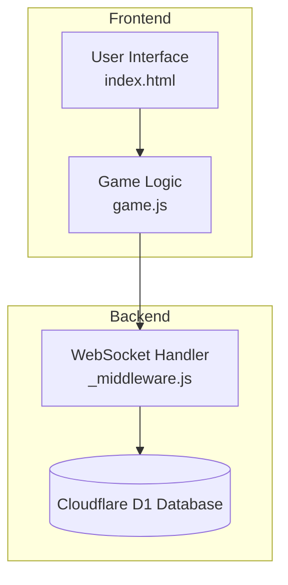
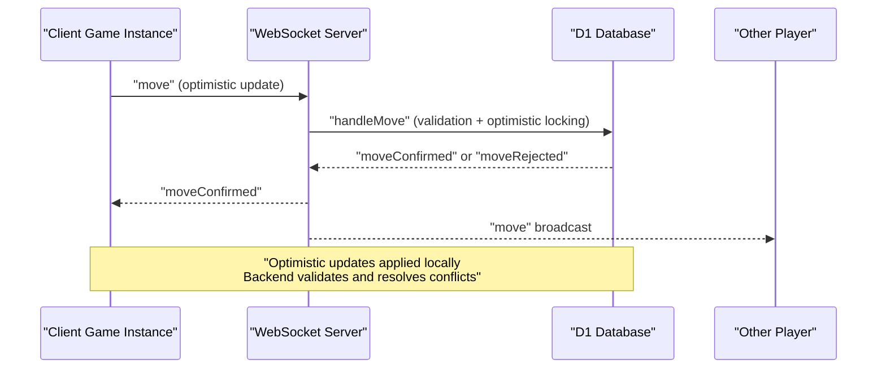
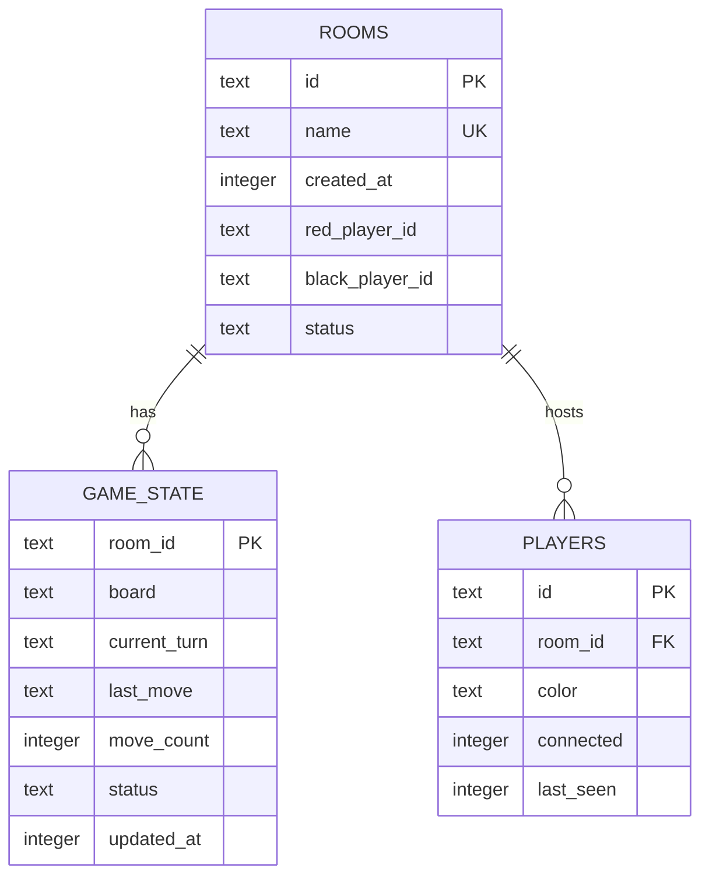
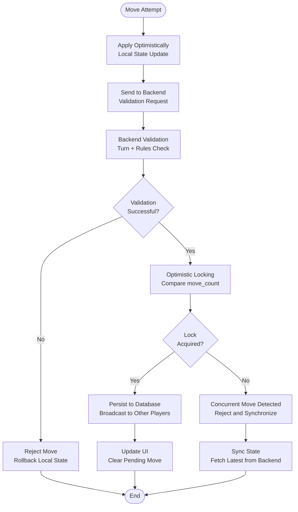
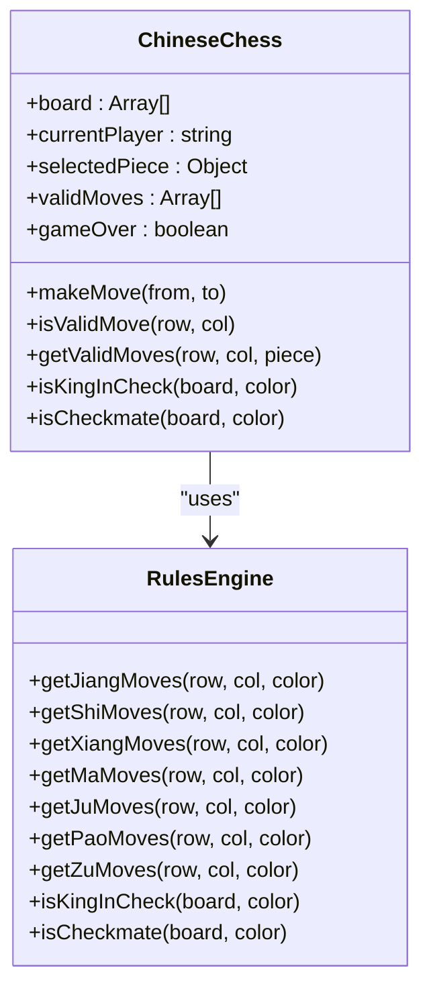
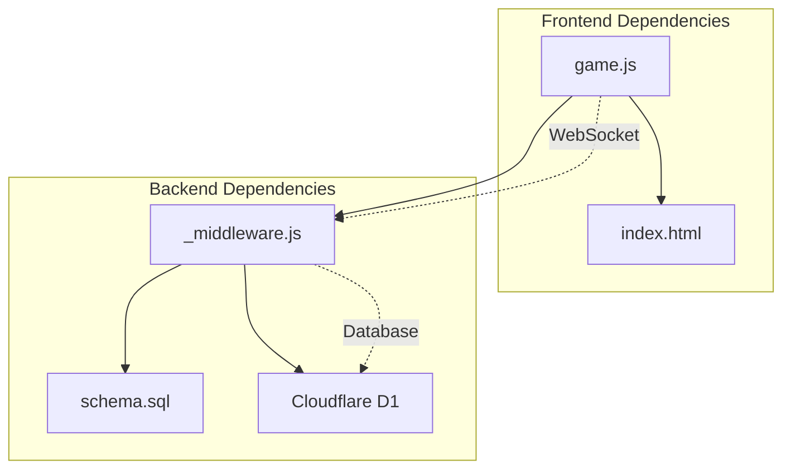

# Game State Management

<cite>
**Referenced Files in This Document**
- [game.js](file://game.js)
- [index.html](file://index.html)
- [_middleware.js](file://functions/_middleware.js)
- [schema.sql](file://schema.sql)
- [game-state.test.js](file://tests/unit/game-state.test.js)
- [chess-rules.test.js](file://tests/unit/chess-rules.test.js)
</cite>

## Table of Contents
1. [Introduction](#introduction)
2. [Project Structure](#project-structure)
3. [Core Components](#core-components)
4. [Architecture Overview](#architecture-overview)
5. [Detailed Component Analysis](#detailed-component-analysis)
6. [Dependency Analysis](#dependency-analysis)
7. [Performance Considerations](#performance-considerations)
8. [Troubleshooting Guide](#troubleshooting-guide)
9. [Conclusion](#conclusion)

## Introduction
This document provides comprehensive documentation for the Chinese Chess game state management system. It covers the frontend state representation, backend persistence, optimistic updates, conflict resolution, move validation, synchronization with the backend, and reconnection strategies. The system integrates a Chinese Chess rule engine to validate moves and enforce game rules.

## Project Structure
The project follows a frontend-first architecture with a Cloudflare Pages Functions backend. The frontend manages UI state and user interactions, while the backend handles room management, game state persistence, and move validation.

**Diagram sources**
- [index.html:1-58](file://index.html#L1-L58)
- [game.js:1-1319](file://game.js#L1-L1319)
- [_middleware.js:104-122](file://functions/_middleware.js#L104-L122)

**Section sources**
- [index.html:1-58](file://index.html#L1-L58)
- [game.js:1-1319](file://game.js#L1-L1319)
- [_middleware.js:104-122](file://functions/_middleware.js#L104-L122)

## Core Components
The game state management system consists of several interconnected components:

### Frontend State Representation
The frontend maintains a comprehensive game state including:
- Board positions with piece types, colors, and names
- Current player turn tracking
- Selected piece and valid moves highlighting
- Game metadata (move count, game over status)
- Player information (names, colors)
- Connection state and reconnection settings

### Backend Persistence Layer
The backend uses Cloudflare D1 database with three main tables:
- Rooms table: Tracks room creation, player assignments, and game status
- Game state table: Stores serialized board state, turn information, and metadata
- Players table: Manages player connections and presence

### WebSocket Communication
Real-time communication enables:
- Room creation and joining
- Move submission and validation
- State synchronization
- Heartbeat monitoring
- Reconnection handling

**Section sources**
- [game.js:4-51](file://game.js#L4-L51)
- [schema.sql:5-25](file://schema.sql#L5-L25)
- [_middleware.js:282-351](file://functions/_middleware.js#L282-L351)

## Architecture Overview
The system implements a hybrid architecture combining optimistic UI updates with authoritative backend validation and conflict resolution.

**Diagram sources**
- [game.js:319-379](file://game.js#L319-L379)
- [_middleware.js:522-683](file://functions/_middleware.js#L522-L683)

## Detailed Component Analysis

### State Representation and Data Model
The game state is represented through multiple coordinated structures:

#### Frontend Board State
The board is a 10x9 grid containing piece objects with properties:
- type: Piece type (jiang, shi, xiang, ma, ju, pao, zu)
- color: Player color ('red' or 'black')
- name: Chinese character representation

#### Game Metadata
- currentTurn: Active player color
- moveCount: Total moves in the game
- gameOver: Boolean indicating game completion
- isInCheck: Check state tracking
- pendingMove: Rollback buffer for optimistic updates

#### Backend Database Schema
The database schema enforces data integrity and provides efficient querying:

**Diagram sources**
- [schema.sql:5-42](file://schema.sql#L5-L42)

**Section sources**
- [game.js:57-97](file://game.js#L57-L97)
- [schema.sql:5-42](file://schema.sql#L5-L42)

### Optimistic Updates and Conflict Resolution
The system implements aggressive optimistic UI updates with robust conflict resolution:

#### Optimistic Move Application
When a player makes a move, the frontend immediately:
1. Applies the move to the local board state
2. Switches turns optimistically
3. Checks for game over conditions locally
4. Sends the move to the backend for validation

#### Backend Validation and Optimistic Locking
The backend performs comprehensive validation:
1. Validates turn ownership and piece ownership
2. Executes move validation using the integrated Chinese Chess rules
3. Uses optimistic locking with move_count comparison
4. Applies the move atomically if validation passes

#### Conflict Resolution Strategies
- Move rejection: When concurrent modifications occur, the backend rejects the conflicting move and triggers rollback
- State synchronization: The frontend polls for state updates when conflicts are detected
- Rollback mechanism: Local state can be restored to the last known good state

**Diagram sources**
- [game.js:319-398](file://game.js#L319-L398)
- [_middleware.js:522-683](file://functions/_middleware.js#L522-L683)

**Section sources**
- [game.js:319-398](file://game.js#L319-L398)
- [_middleware.js:522-683](file://functions/_middleware.js#L522-L683)

### Move Validation Logic and Rule Engine Integration
The system integrates a comprehensive Chinese Chess rule engine:

#### Piece Movement Rules
Each piece type follows specific movement patterns:
- King (jiang): Moves one step within palace, can capture face-to-face with opponent king
- Advisor (shi): Diagonal movement within palace boundaries
- Elephant (xiang): Diagonal movement with river restrictions and eye blocking
- Horse (ma): L-shaped movement with leg blocking ("蹩马腿")
- Chariot (ju): Straight-line movement any distance
- Cannon (pao): Straight-line movement until jump over exactly one piece
- Pawn (zu): Forward movement until crossing river, then sideways movement

#### Check and Checkmate Detection
The system implements sophisticated threat detection:
- King position scanning for attacks
- Piece-specific attack pattern calculation
- Move filtering to prevent self-check scenarios
- Checkmate validation by testing all possible moves

**Diagram sources**
- [game.js:404-734](file://game.js#L404-L734)
- [_middleware.js:755-1080](file://functions/_middleware.js#L755-L1080)

**Section sources**
- [game.js:404-734](file://game.js#L404-L734)
- [_middleware.js:755-1080](file://functions/_middleware.js#L755-L1080)

### State Synchronization and Real-time Updates
The system maintains state consistency through multiple synchronization mechanisms:

#### WebSocket Message Types
The backend supports comprehensive message types:
- Room management: createRoom, joinRoom, leaveRoom
- Game actions: move, resign, getGameState
- Status updates: ping/pong, playerJoined, opponentDisconnected
- Synchronization: moveUpdate, gameState

#### Polling Mechanisms
When WebSocket synchronization fails, the system employs polling:
- Opponent polling: Periodic checks for opponent presence
- Move polling: Fetches latest game state updates
- Heartbeat monitoring: Detects connection timeouts

#### UI State Updates
The frontend responds to various state changes:
- Board rendering with piece positions and valid moves
- Turn indicator updates
- Check state visualization
- Game over notifications

**Section sources**
- [game.js:888-1069](file://game.js#L888-L1069)
- [_middleware.js:231-276](file://functions/_middleware.js#L231-L276)

### Local State Caching and Persistence
The system implements layered persistence strategies:

#### Frontend Caching
- Local board state maintained in memory
- Pending move buffer for rollback capability
- Connection state tracking with exponential backoff
- UI state persistence during reconnection

#### Backend Persistence
- Atomic game state updates with optimistic locking
- Serialized board state storage
- Move history tracking
- Player connection management

#### Reconnection Strategy
The system handles network interruptions gracefully:
- Automatic reconnection attempts with exponential backoff
- State restoration upon reconnection
- Conflict resolution for concurrent moves
- Graceful degradation when offline

**Section sources**
- [game.js:810-836](file://game.js#L810-L836)
- [_middleware.js:1086-1146](file://functions/_middleware.js#L1086-L1146)

## Dependency Analysis
The game state management system exhibits well-structured dependencies:

**Diagram sources**
- [game.js:1-1319](file://game.js#L1-L1319)
- [_middleware.js:104-122](file://functions/_middleware.js#L104-L122)
- [schema.sql:1-42](file://schema.sql#L1-L42)

The system demonstrates low coupling between frontend and backend concerns, with clear separation of responsibilities:
- Frontend: UI state, user interactions, optimistic updates
- Backend: Game logic validation, persistence, real-time broadcasting
- Database: Immutable state storage with ACID properties

**Section sources**
- [game.js:1-1319](file://game.js#L1-L1319)
- [_middleware.js:104-122](file://functions/_middleware.js#L104-L122)
- [schema.sql:1-42](file://schema.sql#L1-L42)

## Performance Considerations
The system incorporates several performance optimization strategies:

### Database Optimization
- Indexes on frequently queried columns (rooms.name, rooms.status, players.room_id, game_state.updated_at)
- Efficient room cleanup with stale detection
- Batch operations for atomic state updates

### Network Efficiency
- Heartbeat mechanism prevents idle connection termination
- Optimistic updates reduce round-trip latency
- Polling fallback ensures reliability when WebSocket fails

### Memory Management
- Minimal state duplication between frontend and backend
- Efficient board serialization/deserialization
- Connection pooling for multiple rooms

## Troubleshooting Guide

### Common Issues and Solutions

#### Move Validation Failures
- **Symptom**: Moves rejected with "Invalid move" error
- **Cause**: Rule engine validation failed or move violates Chinese Chess rules
- **Solution**: Verify piece movement patterns and ensure no self-check scenarios

#### Concurrency Conflicts
- **Symptom**: "Concurrent move detected" error messages
- **Cause**: Two players attempting moves simultaneously
- **Solution**: System automatically rejects conflicting moves and synchronizes state

#### Connection Problems
- **Symptom**: Frequent reconnection attempts or "Not connected" status
- **Cause**: Network instability or server-side connection timeouts
- **Solution**: Check network connectivity and server logs

#### State Inconsistencies
- **Symptom**: UI shows inconsistent board state
- **Cause**: Race conditions or network delays
- **Solution**: Trigger state synchronization using polling mechanisms

**Section sources**
- [game.js:973-978](file://game.js#L973-L978)
- [_middleware.js:624-634](file://functions/_middleware.js#L624-L634)

## Conclusion
The Chinese Chess game state management system provides a robust, scalable solution for online multiplayer gaming. Its architecture successfully balances user experience with data integrity through optimistic updates, comprehensive validation, and intelligent conflict resolution. The integration of a full Chinese Chess rule engine ensures accurate game logic enforcement, while the dual-layer persistence strategy (frontend caching plus backend database) delivers both responsiveness and reliability.

Key strengths of the system include:
- Seamless optimistic UI updates with automatic conflict resolution
- Comprehensive Chinese Chess rule enforcement
- Reliable state synchronization through multiple mechanisms
- Graceful handling of network interruptions and reconnections
- Scalable backend architecture using Cloudflare D1

The modular design allows for easy extension and maintenance, making it suitable for future enhancements such as tournament modes, spectator features, or additional game variants.