# User Interface Components

<cite>
**Referenced Files in This Document**
- [index.html](file://index.html)
- [style.css](file://style.css)
- [game.js](file://game.js)
- [_middleware.js](file://functions/_middleware.js)
</cite>

## Table of Contents
1. [Introduction](#introduction)
2. [Project Structure](#project-structure)
3. [Core Components](#core-components)
4. [Architecture Overview](#architecture-overview)
5. [Detailed Component Analysis](#detailed-component-analysis)
6. [Dependency Analysis](#dependency-analysis)
7. [Performance Considerations](#performance-considerations)
8. [Troubleshooting Guide](#troubleshooting-guide)
9. [Conclusion](#conclusion)

## Introduction

This document provides comprehensive documentation for the user interface components of the Chinese Chess Online application. The UI consists of two primary screens: the lobby screen for room creation and joining, and the game screen for actual gameplay. The implementation demonstrates modern web development practices including responsive design, visual feedback systems, and robust DOM manipulation for screen transitions.

The application follows a clean separation of concerns with HTML providing the structure, CSS handling presentation and responsive behavior, and JavaScript managing interactive functionality and WebSocket communication.

## Project Structure

The user interface is organized around a modular architecture with clear separation between screens and styling:

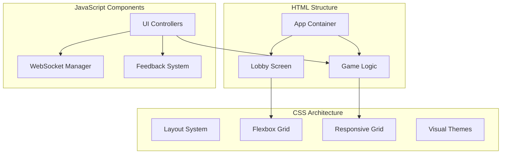

**Diagram sources**
- [index.html:11-53](file://index.html#L11-L53)
- [style.css:18-32](file://style.css#L18-L32)
- [game.js:4-51](file://game.js#L4-L51)

**Section sources**
- [index.html:1-58](file://index.html#L1-L58)
- [style.css:1-372](file://style.css#L1-L372)

## Core Components

### Lobby Screen Implementation

The lobby screen serves as the primary entry point for users, providing room creation and joining functionality with comprehensive input validation and form handling.

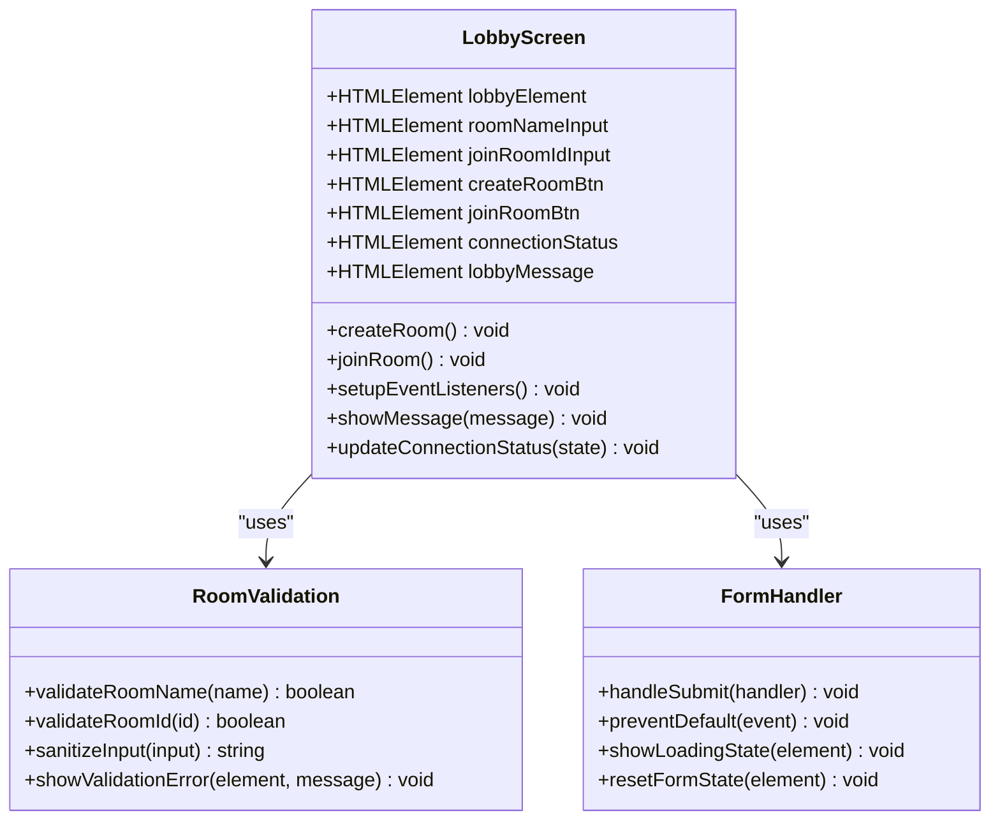

**Diagram sources**
- [index.html:13-30](file://index.html#L13-L30)
- [game.js:108-144](file://game.js#L108-L144)
- [game.js:1075-1123](file://game.js#L1075-L1123)

The lobby screen implements several key validation mechanisms:

- **Room Name Validation**: Maximum 20 character limit with trimming and sanitization
- **Room ID Validation**: Input sanitization and length constraints
- **Real-time Feedback**: Immediate visual feedback for invalid inputs
- **Connection State Display**: Dynamic connection status indicators

**Section sources**
- [index.html:13-30](file://index.html#L13-L30)
- [game.js:1075-1123](file://game.js#L1075-L1123)

### Game Screen Layout

The game screen provides a comprehensive chess interface with player information panels, turn indicators, and interactive game controls.

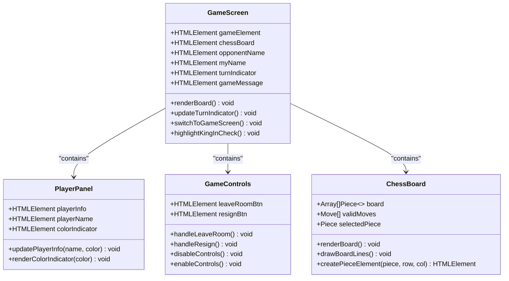

**Diagram sources**
- [index.html:33-52](file://index.html#L33-L52)
- [game.js:150-187](file://game.js#L150-L187)
- [game.js:1265-1284](file://game.js#L1265-L1284)

**Section sources**
- [index.html:33-52](file://index.html#L33-L52)
- [game.js:150-187](file://game.js#L150-L187)

## Architecture Overview

The user interface follows a layered architecture with clear separation between presentation, logic, and data management:

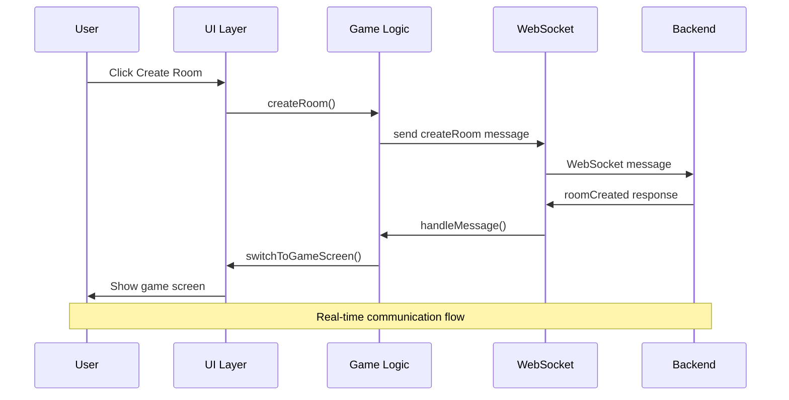

**Diagram sources**
- [game.js:1075-1098](file://game.js#L1075-L1098)
- [game.js:888-944](file://game.js#L888-L944)
- [functions/_middleware.js:242-351](file://functions/_middleware.js#L242-L351)

The architecture implements several key patterns:

- **Observer Pattern**: Event-driven UI updates through WebSocket messages
- **Command Pattern**: Room actions encapsulated in discrete methods
- **Strategy Pattern**: Different message handlers for various game states
- **State Machine**: Clear state transitions between lobby and game screens

**Section sources**
- [game.js:736-808](file://game.js#L736-L808)
- [functions/_middleware.js:231-276](file://functions/_middleware.js#L231-L276)

## Detailed Component Analysis

### Lobby Screen Component

The lobby screen implements a comprehensive room management system with robust validation and user feedback.

#### Input Validation System

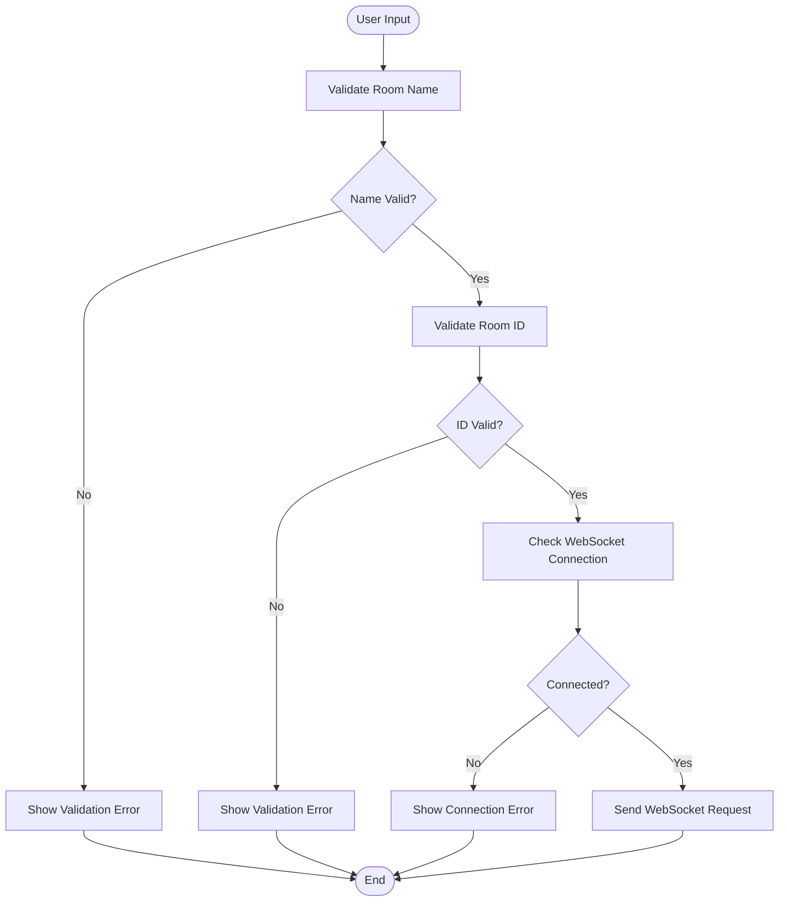

**Diagram sources**
- [game.js:1075-1123](file://game.js#L1075-L1123)
- [game.js:108-144](file://game.js#L108-L144)

#### Form Handling and Submission

The form handling system implements comprehensive error prevention and user feedback:

- **Prevent Default Behavior**: Stops form submission to handle via JavaScript
- **Input Sanitization**: Trims whitespace and limits input length
- **Real-time Validation**: Immediate feedback for invalid inputs
- **Loading States**: Visual indication during network requests
- **Error Recovery**: Graceful handling of network failures

**Section sources**
- [game.js:108-144](file://game.js#L108-L144)
- [game.js:1075-1123](file://game.js#L1075-L1123)

### Game Screen Component

The game screen provides a sophisticated chess interface with comprehensive visual feedback and interactive elements.

#### Board Rendering System

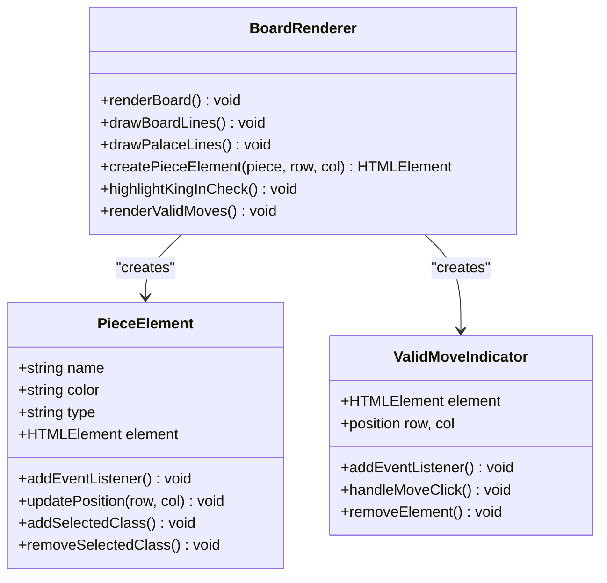

**Diagram sources**
- [game.js:150-187](file://game.js#L150-L187)
- [game.js:189-206](file://game.js#L189-L206)
- [game.js:208-229](file://game.js#L208-L229)

#### Turn Management and State Tracking

The game implements sophisticated turn management with comprehensive state tracking:

- **Current Player Tracking**: Maintains whose turn it is
- **Check Detection**: Automatic check and checkmate detection
- **Move Validation**: Client-side move validation with server confirmation
- **State Persistence**: Complete game state maintained across moves
- **Visual Turn Indicators**: Clear turn status display with color coding

**Section sources**
- [game.js:150-187](file://game.js#L150-L187)
- [game.js:283-398](file://game.js#L283-L398)
- [game.js:1265-1284](file://game.js#L1265-L1284)

### Responsive Design Implementation

The application implements a comprehensive responsive design system that adapts to various screen sizes and devices.

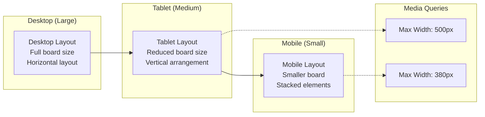

**Diagram sources**
- [style.css:293-371](file://style.css#L293-L371)

#### Breakpoint Strategy

The responsive design implements a tiered breakpoint system:

- **Primary Breakpoint (500px)**: Major layout adjustments for tablets
- **Secondary Breakpoint (380px)**: Further optimization for small mobile devices
- **Flexible Units**: Percentage-based sizing with fixed minimums
- **Fluid Typography**: Scalable font sizes that adapt to viewport

**Section sources**
- [style.css:293-371](file://style.css#L293-L371)

### CSS Architecture and Styling Patterns

The CSS architecture follows modern design principles with a focus on maintainability and scalability.

#### Layout System

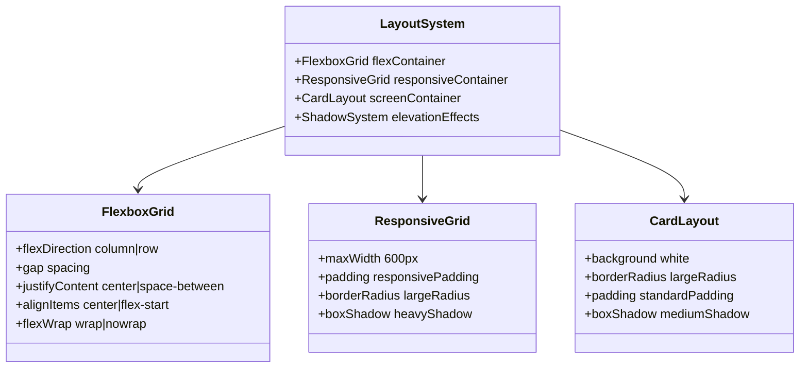

**Diagram sources**
- [style.css:18-28](file://style.css#L18-L28)
- [style.css:43-46](file://style.css#L43-L46)

#### Visual Feedback System

The application implements a comprehensive visual feedback system for different game states:

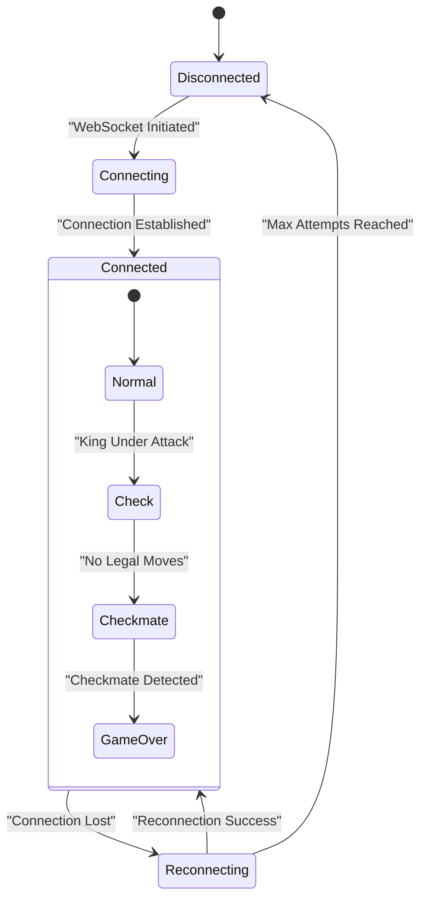

**Diagram sources**
- [game.js:1286-1300](file://game.js#L1286-L1300)
- [game.js:1265-1284](file://game.js#L1265-L1284)

**Section sources**
- [style.css:93-123](file://style.css#L93-L123)
- [style.css:125-291](file://style.css#L125-L291)

## Dependency Analysis

The user interface components have well-defined dependencies that support maintainability and extensibility.

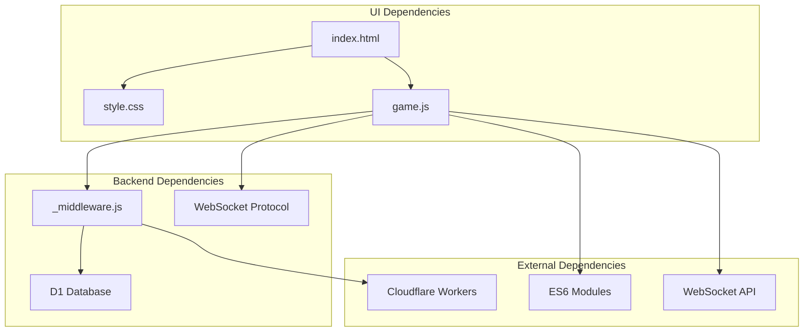

**Diagram sources**
- [index.html:8](file://index.html#L8)
- [game.js:1315-1318](file://game.js#L1315-L1318)
- [functions/_middleware.js:104-122](file://functions/_middleware.js#L104-L122)

### Component Coupling Analysis

The UI components demonstrate appropriate coupling levels:

- **Low Coupling**: UI components interact primarily through well-defined interfaces
- **High Cohesion**: Each component has a focused responsibility
- **Clear Contracts**: Well-defined input/output interfaces for all components
- **Event-Driven Communication**: Loose coupling through event listeners and WebSocket messages

**Section sources**
- [game.js:108-144](file://game.js#L108-L144)
- [functions/_middleware.js:231-276](file://functions/_middleware.js#L231-L276)

## Performance Considerations

The user interface is designed with performance optimization in mind across multiple dimensions:

### Rendering Performance

- **Efficient DOM Updates**: Batched DOM manipulations minimize reflows
- **Virtual DOM-like Approach**: State-driven rendering reduces unnecessary updates
- **Canvas Alternative**: Consideration for future canvas-based rendering for better performance
- **Memory Management**: Proper cleanup of event listeners and DOM elements

### Network Performance

- **Optimistic Updates**: Immediate UI feedback while waiting for server confirmation
- **Heartbeat System**: Efficient connection monitoring with configurable intervals
- **Reconnection Strategy**: Exponential backoff to prevent network congestion
- **Message Batching**: Consolidated updates to reduce network overhead

### Mobile Performance

- **Touch-Friendly Elements**: Sufficient touch targets for mobile interaction
- **Reduced Animations**: Performance-optimized animations for mobile devices
- **Lazy Loading**: Deferred loading of non-critical resources
- **Battery Optimization**: Minimized background processes to preserve battery life

## Troubleshooting Guide

### Common UI Issues and Solutions

#### Connection Status Problems

**Issue**: Connection status not updating properly
**Solution**: Check WebSocket connection state and implement manual refresh
**Debug Steps**:
1. Verify WebSocket URL construction
2. Check browser console for connection errors
3. Validate server availability
4. Implement manual reconnection triggers

#### Screen Transition Issues

**Issue**: Screens not switching properly
**Solution**: Ensure proper DOM element references and class manipulation
**Debug Steps**:
1. Verify element IDs exist in DOM
2. Check CSS class definitions
3. Validate event listener registration
4. Test with simplified DOM structure

#### Game State Synchronization

**Issue**: Game state inconsistencies between clients
**Solution**: Implement server-authoritative state management
**Debug Steps**:
1. Log all WebSocket messages
2. Verify move validation logic
3. Check for concurrent move conflicts
4. Implement optimistic update rollback

**Section sources**
- [game.js:810-836](file://game.js#L810-L836)
- [game.js:1240-1263](file://game.js#L1240-L1263)
- [functions/_middleware.js:619-634](file://functions/_middleware.js#L619-L634)

### Error Handling Patterns

The application implements comprehensive error handling across all UI components:

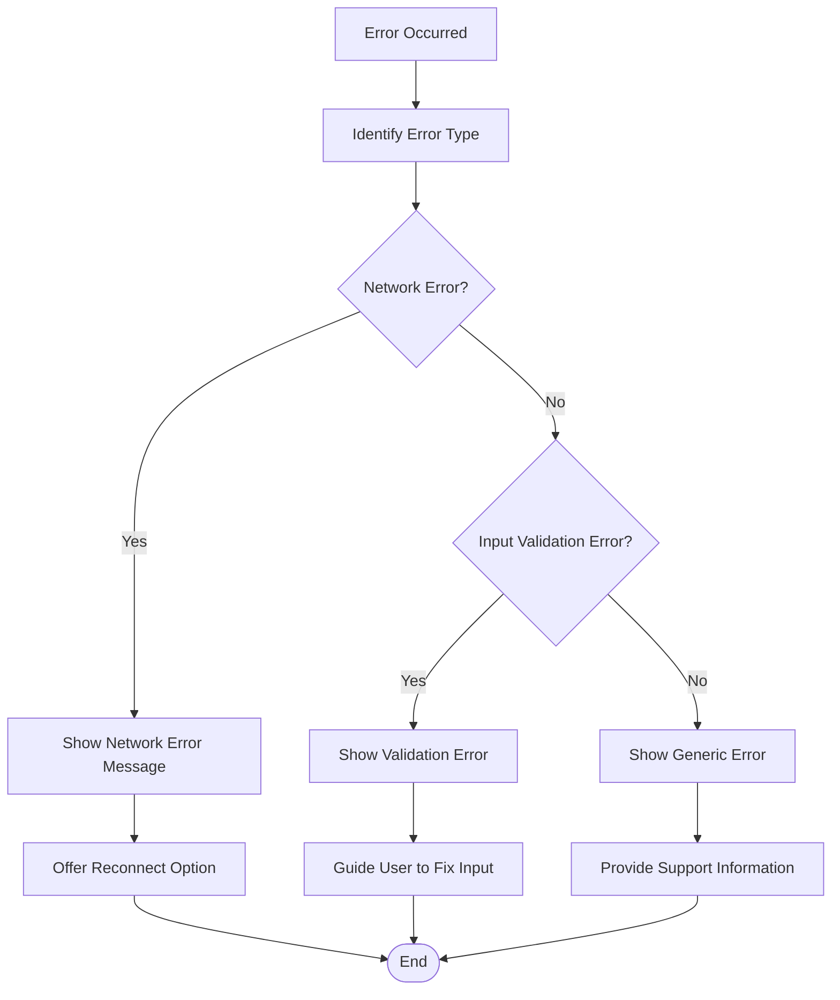

**Diagram sources**
- [game.js:1302-1312](file://game.js#L1302-L1312)
- [functions/_middleware.js:1254-1261](file://functions/_middleware.js#L1254-L1261)

## Conclusion

The user interface components demonstrate a mature, production-ready implementation of a real-time chess application. The architecture successfully balances functionality, performance, and user experience across multiple platforms and devices.

Key strengths of the implementation include:

- **Robust Architecture**: Clean separation of concerns with well-defined interfaces
- **Responsive Design**: Adaptive layout system supporting all device sizes
- **Comprehensive Error Handling**: Graceful degradation and user-friendly error messages
- **Performance Optimization**: Efficient rendering and network communication strategies
- **Extensible Design**: Modular components that can accommodate future enhancements

The implementation serves as an excellent example of modern web application development, combining traditional game interface patterns with contemporary web technologies and responsive design principles.