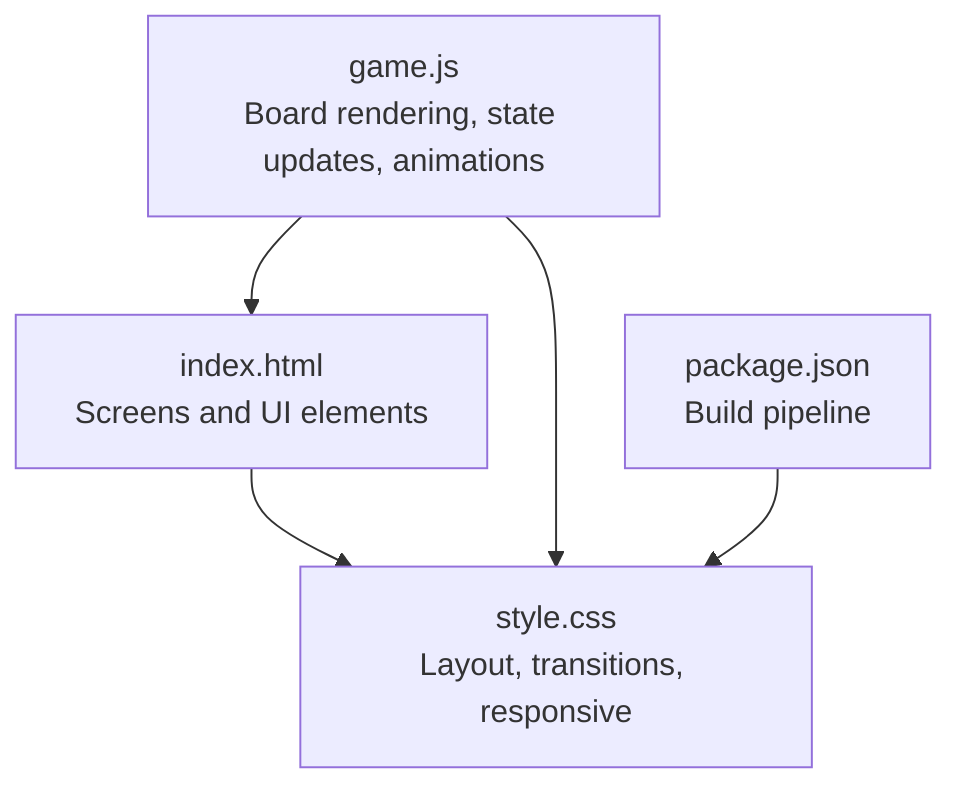
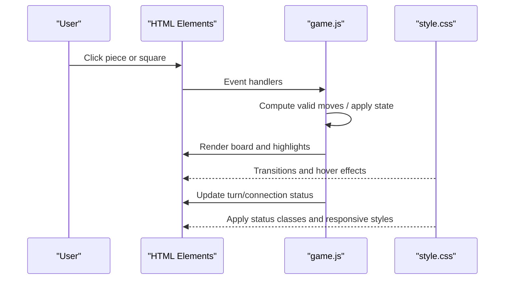
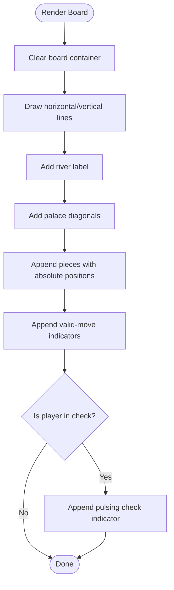
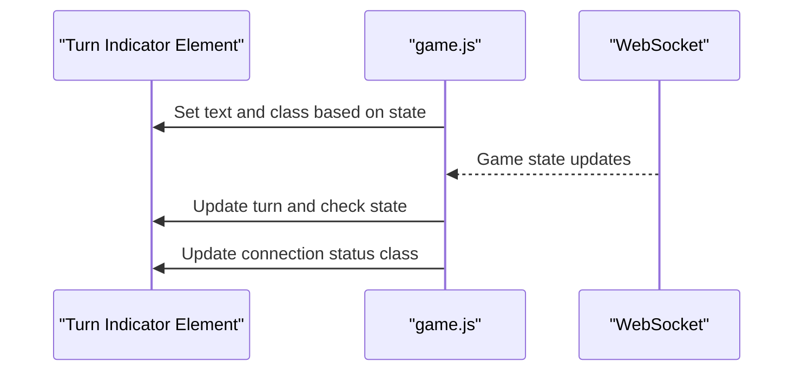
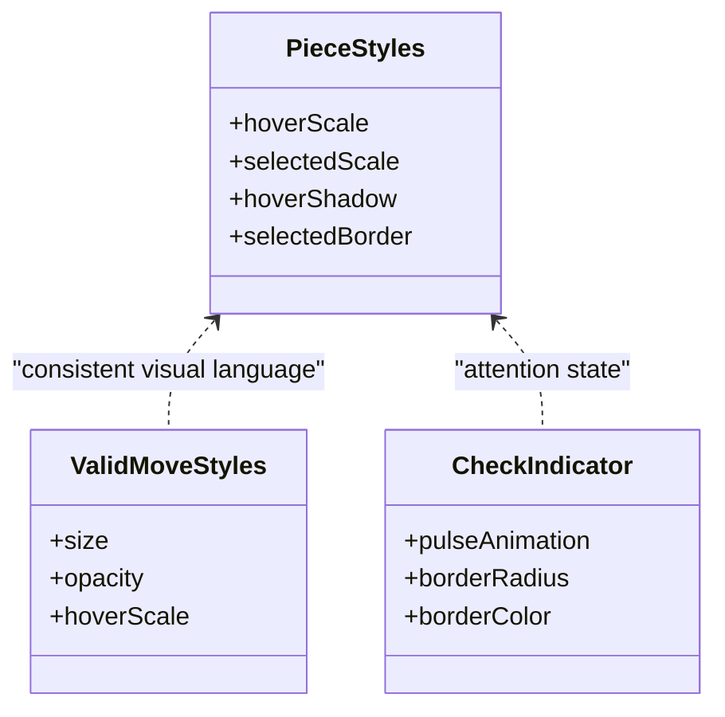
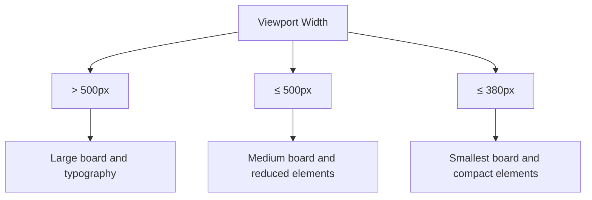
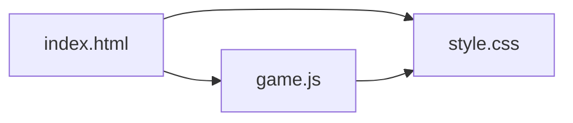

# Visual Feedback and Animations

<cite>
**Referenced Files in This Document**
- [index.html](file://index.html)
- [style.css](file://style.css)
- [game.js](file://game.js)
- [package.json](file://package.json)
</cite>

## Table of Contents
1. [Introduction](#introduction)
2. [Project Structure](#project-structure)
3. [Core Components](#core-components)
4. [Architecture Overview](#architecture-overview)
5. [Detailed Component Analysis](#detailed-component-analysis)
6. [Dependency Analysis](#dependency-analysis)
7. [Performance Considerations](#performance-considerations)
8. [Troubleshooting Guide](#troubleshooting-guide)
9. [Conclusion](#conclusion)

## Introduction
This document explains the visual feedback and animation system for the Chinese Chess game. It covers the CSS styling architecture, grid layout rendering, responsive design patterns, visual indicators for game states and connection status, and the JavaScript-driven animations for piece selection, valid move highlighting, and check indication. Accessibility considerations such as keyboard navigation, screen reader support, and high contrast modes are also addressed.

## Project Structure
The visual system spans three primary areas:
- HTML structure defines screens and interactive elements (lobby and game).
- CSS controls layout, typography, colors, transitions, and responsive breakpoints.
- JavaScript renders the board, applies visual feedback, and drives animations.

**Diagram sources**
- [index.html:10-57](file://index.html#L10-L57)
- [style.css:18-372](file://style.css#L18-L372)
- [game.js:103-187](file://game.js#L103-L187)
- [package.json:7-17](file://package.json#L7-L17)

**Section sources**
- [index.html:10-57](file://index.html#L10-L57)
- [style.css:18-372](file://style.css#L18-L372)
- [game.js:103-187](file://game.js#L103-L187)
- [package.json:7-17](file://package.json#L7-L17)

## Core Components
- Board rendering and grid layout: The JavaScript draws the board grid, palace diagonals, and river text, then positions chess pieces and valid move indicators absolutely.
- Piece visuals: Pieces use color classes and hover/selected states with transitions for scaling and shadow effects.
- Valid move indicators: Small translucent dots appear at legal destination squares.
- Check indication: A pulsing red ring appears around the king when in check.
- Turn and connection status: Dynamic text and classes reflect current turn and connection state.
- Responsive design: Media queries adjust board sizes and typography for small screens.

**Section sources**
- [game.js:150-187](file://game.js#L150-L187)
- [game.js:208-229](file://game.js#L208-L229)
- [style.css:183-278](file://style.css#L183-L278)
- [style.css:293-371](file://style.css#L293-L371)
- [game.js:1265-1284](file://game.js#L1265-L1284)
- [game.js:1286-1300](file://game.js#L1286-L1300)

## Architecture Overview
The visual feedback loop integrates HTML, CSS, and JavaScript as follows:
- HTML provides containers for lobby and game screens, plus placeholders for messages and turn status.
- CSS defines base styles, transitions, and responsive adjustments.
- JavaScript initializes the board, computes valid moves, renders pieces and highlights, and toggles visual states.

**Diagram sources**
- [index.html:32-52](file://index.html#L32-L52)
- [game.js:283-304](file://game.js#L283-L304)
- [game.js:150-187](file://game.js#L150-L187)
- [style.css:234-278](file://style.css#L234-L278)
- [game.js:1265-1284](file://game.js#L1265-L1284)
- [game.js:1286-1300](file://game.js#L1286-L1300)

## Detailed Component Analysis

### CSS Styling Architecture
- Base and layout
  - Body and app container center content and apply background gradients.
  - Screens use rounded corners, shadows, and padding for depth.
- Inputs and buttons
  - Focus states and hover/active transforms provide tactile feedback.
- Status indicators
  - Connection status uses distinct classes for connected/disconnected/reconnecting states.
- Game header and player info
  - Color indicators show player colors; turn indicator reflects current turn and check state.
- Board and pieces
  - Absolute positioning creates a precise grid; transitions enable smooth hover and selection effects.
  - Valid move indicators are small, semi-transparent circles.
- Responsive design
  - Media queries scale board dimensions, line lengths, river size, and piece sizes for smaller screens.

Examples of CSS classes for different states:
- Connection status: [style.css:93-108](file://style.css#L93-L108)
- Turn indicator: [style.css:158-168](file://style.css#L158-L168)
- Piece hover/selected: [style.css:253-262](file://style.css#L253-L262)
- Valid move indicator: [style.css:264-278](file://style.css#L264-L278)
- Responsive breakpoints: [style.css:293-371](file://style.css#L293-L371)

**Section sources**
- [style.css:8-32](file://style.css#L8-L32)
- [style.css:93-108](file://style.css#L93-L108)
- [style.css:158-168](file://style.css#L158-L168)
- [style.css:224-278](file://style.css#L224-L278)
- [style.css:293-371](file://style.css#L293-L371)

### Grid Layout and Board Rendering
- JavaScript draws:
  - Horizontal and vertical board lines.
  - River label centered between palace areas.
  - Palace diagonal lines via rotated elements.
- Pieces and valid moves are positioned absolutely using computed offsets aligned to the grid.
- Selected piece receives a special class for highlighting.

**Diagram sources**
- [game.js:150-187](file://game.js#L150-L187)
- [game.js:208-229](file://game.js#L208-L229)
- [style.css:192-222](file://style.css#L192-L222)

**Section sources**
- [game.js:231-277](file://game.js#L231-L277)
- [game.js:150-187](file://game.js#L150-L187)
- [style.css:183-222](file://style.css#L183-L222)

### Visual Indicators for Game States and Turns
- Turn indicator
  - Reflects “Your Turn”, “Opponent’s Turn”, “CHECK!” state, and “Game Over”.
  - Updated dynamically via class changes and text content.
- Connection status
  - Reflects connected/connecting/disconnected/reconnecting states with appropriate classes.
- Messages
  - Dedicated areas for lobby and game messages display game events and errors.

**Diagram sources**
- [game.js:1265-1284](file://game.js#L1265-L1284)
- [game.js:1286-1300](file://game.js#L1286-L1300)
- [index.html:39-41](file://index.html#L39-L41)

**Section sources**
- [game.js:1265-1284](file://game.js#L1265-L1284)
- [game.js:1286-1300](file://game.js#L1286-L1300)
- [index.html:26-28](file://index.html#L26-L28)
- [index.html:50-51](file://index.html#L50-L51)

### Animation Implementations
- Piece hover and selection
  - Smooth scaling and shadow transitions for hover and selected states.
- Valid move highlighting
  - Semi-transparent dots with hover scaling increase discoverability.
- Check indication
  - A pulsing red ring around the king uses a CSS animation applied via inline style.
- Transitions
  - Hover effects on buttons and pieces use short transition durations for snappy feedback.

**Diagram sources**
- [style.css:253-262](file://style.css#L253-L262)
- [style.css:264-278](file://style.css#L264-L278)
- [game.js:223-225](file://game.js#L223-L225)

**Section sources**
- [style.css:253-262](file://style.css#L253-L262)
- [style.css:264-278](file://style.css#L264-L278)
- [game.js:223-225](file://game.js#L223-L225)

### Responsive Breakpoints and Layout Patterns
- Breakpoints
  - Two media queries scale the board and related elements for narrow screens.
- Layout patterns
  - Flexbox used for game header and lobby containers.
  - Absolute positioning for board elements ensures precise alignment across breakpoints.

**Diagram sources**
- [style.css:293-371](file://style.css#L293-L371)

**Section sources**
- [style.css:293-371](file://style.css#L293-L371)

### Accessibility Features
- Keyboard navigation
  - Interactive elements (buttons, pieces) rely on click handlers; consider adding focus styles and keyboard activation for improved accessibility.
- Screen reader support
  - Status messages are programmatically updated; ensure announcements occur via ARIA live regions for assistive technologies.
- High contrast modes
  - Current theme uses light backgrounds; verify sufficient contrast for text and borders under OS high contrast settings.

Recommendations:
- Add explicit focus rings and visible focus states for interactive elements.
- Announce dynamic status updates using ARIA live regions.
- Test and adjust color contrasts for high contrast mode compatibility.

[No sources needed since this section provides general guidance]

## Dependency Analysis
- HTML depends on CSS for styling and on JavaScript for interactivity.
- CSS defines transitions and responsive rules consumed by both HTML and JavaScript-rendered elements.
- JavaScript depends on DOM APIs to update classes, content, and inline styles.

**Diagram sources**
- [index.html:10-57](file://index.html#L10-L57)
- [style.css:18-372](file://style.css#L18-L372)
- [game.js:103-187](file://game.js#L103-L187)

**Section sources**
- [index.html:10-57](file://index.html#L10-L57)
- [style.css:18-372](file://style.css#L18-L372)
- [game.js:103-187](file://game.js#L103-L187)

## Performance Considerations
- Efficient rendering
  - The board is fully re-rendered on each state change; consider diffing and targeted DOM updates for larger boards.
- Animation performance
  - Transitions and pulse animations are lightweight; avoid excessive reflows by batching DOM writes.
- Responsive scaling
  - Media queries reduce element sizes; keep calculations minimal to maintain smooth scrolling and interaction.

[No sources needed since this section provides general guidance]

## Troubleshooting Guide
- Turn indicator not updating
  - Verify the element exists and that the update method is called after state changes.
  - Check for typos in class names or missing conditions.
- Connection status not reflecting
  - Ensure the status element exists and the update method assigns the correct class.
- Pieces not appearing or misaligned
  - Confirm the board container exists and that absolute positions match grid indices.
- Valid move indicators not shown
  - Verify the valid moves array is populated and rendered during board updates.
- Check indicator not pulsing
  - Confirm the check state flag is set and the indicator element is appended with the pulse animation.

**Section sources**
- [game.js:1265-1284](file://game.js#L1265-L1284)
- [game.js:1286-1300](file://game.js#L1286-L1300)
- [game.js:150-187](file://game.js#L150-L187)
- [game.js:208-229](file://game.js#L208-L229)

## Conclusion
The visual feedback and animation system combines precise grid rendering, subtle transitions, and targeted state indicators to deliver a responsive and intuitive user experience. By leveraging CSS transitions and JavaScript-driven DOM updates, the interface clearly communicates game state, turn ownership, and connection health. Enhancing accessibility and optimizing rendering performance will further improve usability and responsiveness.