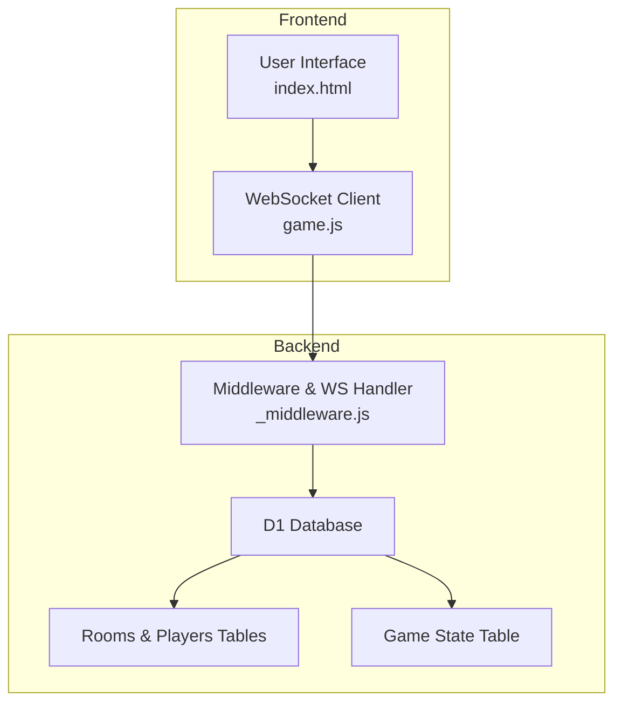
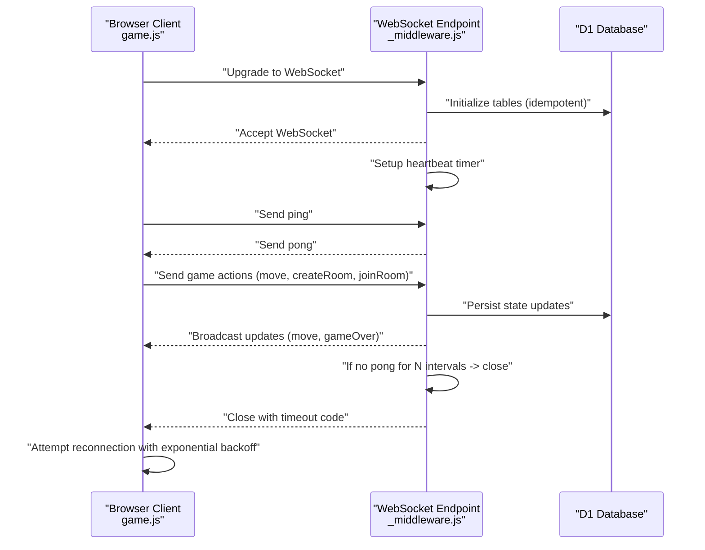
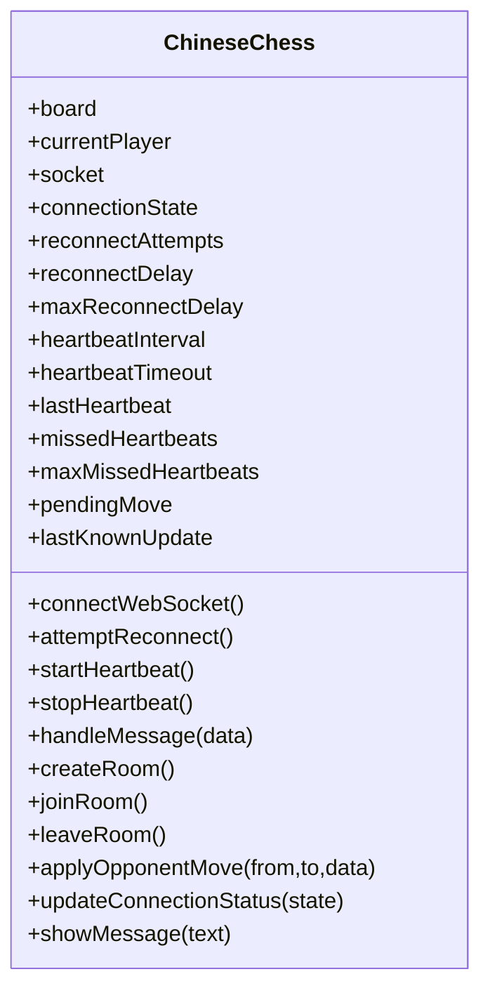
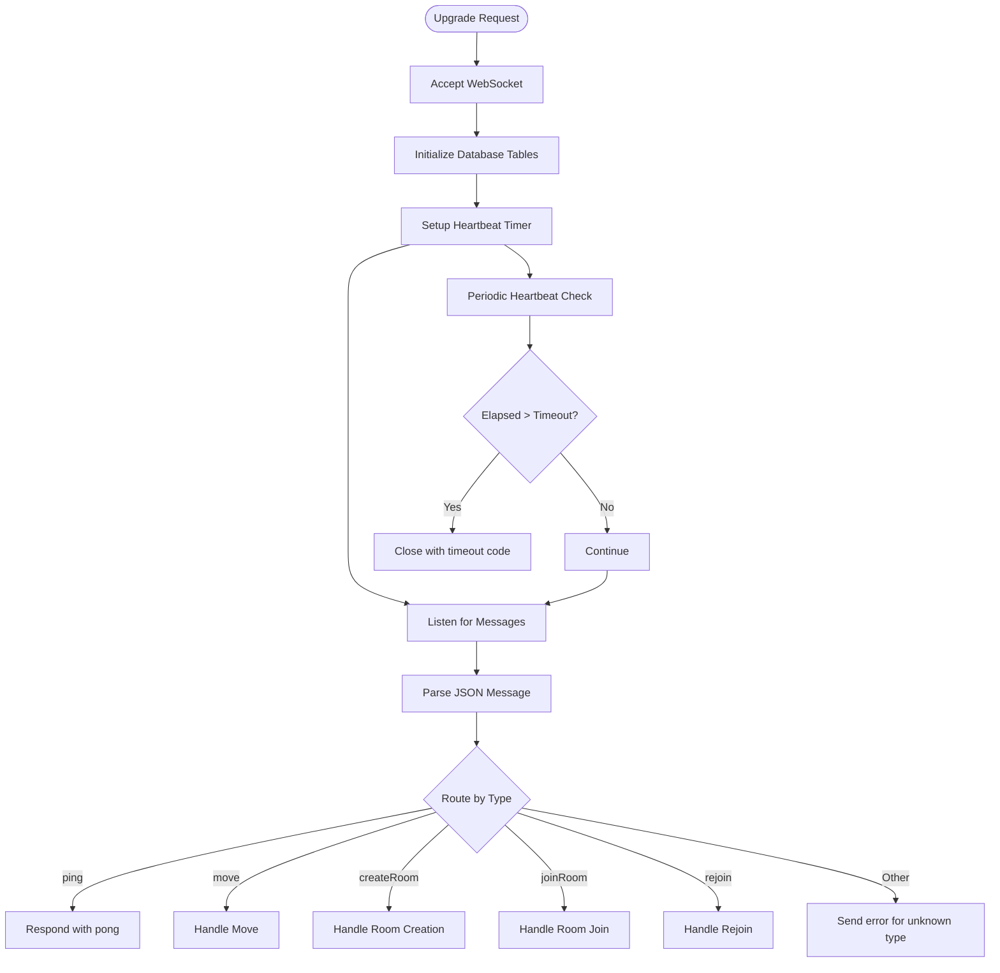
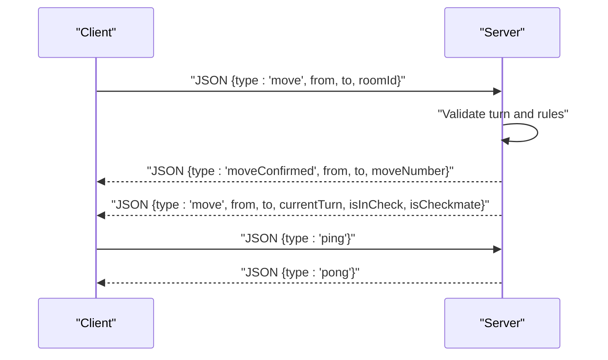
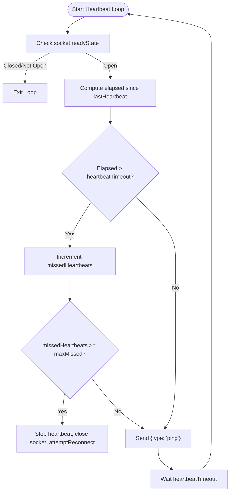
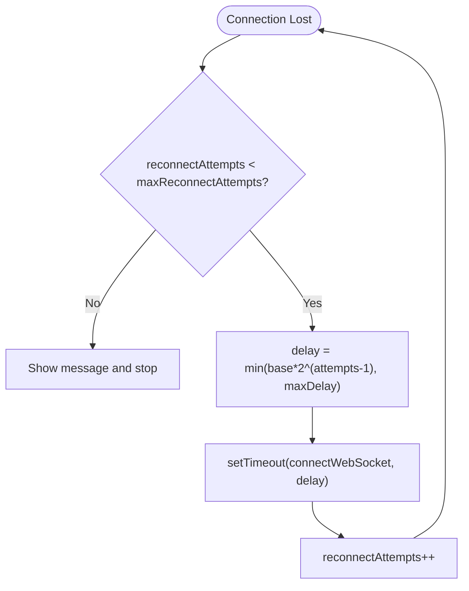
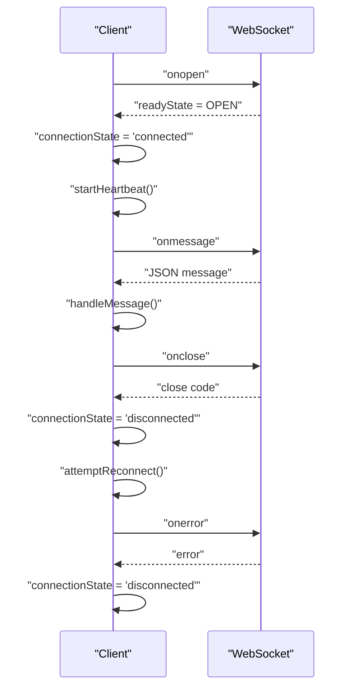
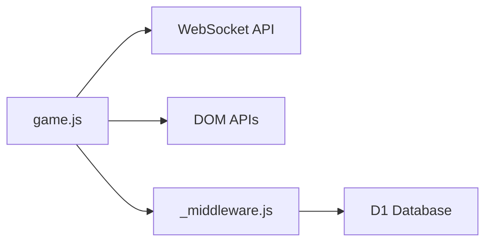

# WebSocket Client Implementation

<cite>
**Referenced Files in This Document**
- [index.html](file://index.html)
- [game.js](file://game.js)
- [_middleware.js](file://functions/_middleware.js)
- [websocket.test.js](file://tests/integration/websocket.test.js)
- [heartbeat.test.js](file://tests/unit/heartbeat.test.js)
- [reconnection.test.js](file://tests/unit/reconnection.test.js)
- [setup.js](file://tests/setup.js)
</cite>

## Table of Contents
1. [Introduction](#introduction)
2. [Project Structure](#project-structure)
3. [Core Components](#core-components)
4. [Architecture Overview](#architecture-overview)
5. [Detailed Component Analysis](#detailed-component-analysis)
6. [Dependency Analysis](#dependency-analysis)
7. [Performance Considerations](#performance-considerations)
8. [Troubleshooting Guide](#troubleshooting-guide)
9. [Conclusion](#conclusion)
10. [Appendices](#appendices)

## Introduction
This document provides a comprehensive guide to the WebSocket client implementation used by the Chinese Chess frontend. It explains how the client establishes connections, manages reconnections with exponential backoff, monitors heartbeats, and handles incoming/outgoing messages. It also documents the event listeners for open, message, error, and close events, and describes graceful degradation strategies during network loss. Real-time communication patterns and message serialization/deserialization are covered with references to the actual implementation.

## Project Structure
The WebSocket client lives in the browser and communicates with a Cloudflare Pages backend that upgrades HTTP requests to WebSocket connections. The frontend initializes the client, manages UI state, and coordinates reconnection and heartbeat logic. The backend maintains connection state, enforces timeouts, and broadcasts messages to connected clients.

**Diagram sources**
- [index.html:10-58](file://index.html#L10-L58)
- [game.js:740-808](file://game.js#L740-L808)
- [_middleware.js:104-122](file://functions/_middleware.js#L104-L122)
- [_middleware.js:131-185](file://functions/_middleware.js#L131-L185)

**Section sources**
- [index.html:10-58](file://index.html#L10-L58)
- [game.js:740-808](file://game.js#L740-L808)
- [_middleware.js:104-122](file://functions/_middleware.js#L104-L122)

## Core Components
- WebSocket Client (frontend): Establishes and maintains the WebSocket connection, handles events, performs reconnection with exponential backoff, and monitors heartbeats.
- Backend WebSocket Handler: Upgrades HTTP to WebSocket, manages connection lifecycle, enforces timeouts, and routes messages.
- Database Layer: Stores room metadata, player connections, and game state for persistence and reconnection recovery.

Key responsibilities:
- Connection establishment and teardown
- Automatic reconnection with exponential backoff
- Heartbeat monitoring and timeout detection
- Message routing and error propagation
- Graceful degradation and UI feedback

**Section sources**
- [game.js:21-42](file://game.js#L21-L42)
- [_middleware.js:128-185](file://functions/_middleware.js#L128-L185)

## Architecture Overview
The frontend client connects to the backend via a WebSocket endpoint. The backend accepts the upgrade, sets up heartbeat timers, and routes messages. The client sends pings and expects pongs; if the client does not receive pongs within a threshold, it triggers reconnection. The backend closes idle connections after a timeout and notifies opponents upon disconnection.

**Diagram sources**
- [game.js:740-808](file://game.js#L740-L808)
- [_middleware.js:131-185](file://functions/_middleware.js#L131-L185)
- [_middleware.js:191-218](file://functions/_middleware.js#L191-L218)
- [_middleware.js:231-276](file://functions/_middleware.js#L231-L276)

## Detailed Component Analysis

### WebSocket Client (Frontend)
The client encapsulates connection state, reconnection logic, heartbeat monitoring, and message handling.

- Connection establishment
  - Determines protocol (wss vs ws) based on current page protocol.
  - Creates a WebSocket to the backend endpoint.
  - Sets up event handlers for open, message, close, and error.

- Reconnection with exponential backoff
  - Tracks attempts and computes delay using exponential growth up to a maximum cap.
  - Prevents multiple concurrent reconnection attempts.
  - Stops heartbeat and polling during reconnection.

- Heartbeat monitoring
  - Sends periodic ping messages.
  - Tracks elapsed time since last pong; increments missed heartbeats.
  - Triggers reconnection after exceeding a threshold of missed heartbeats.

- Message handling
  - Parses incoming JSON messages and dispatches to dedicated handlers.
  - Handles room creation/joining, move synchronization, game state, errors, and reconnection responses.
  - Responds to ping with pong and updates heartbeat counters.

- UI integration
  - Updates connection status indicators.
  - Displays messages and game state changes.
  - Manages screen transitions between lobby and game.

**Diagram sources**
- [game.js:4-51](file://game.js#L4-L51)
- [game.js:740-808](file://game.js#L740-L808)
- [game.js:810-836](file://game.js#L810-L836)
- [game.js:842-882](file://game.js#L842-L882)
- [game.js:888-937](file://game.js#L888-L937)

**Section sources**
- [game.js:740-808](file://game.js#L740-L808)
- [game.js:810-836](file://game.js#L810-L836)
- [game.js:842-882](file://game.js#L842-L882)
- [game.js:888-937](file://game.js#L888-L937)

### Backend WebSocket Handler
The backend accepts WebSocket upgrades, manages connection lifecycle, and enforces timeouts.

- Upgrade and acceptance
  - Validates upgrade header and accepts WebSocketPair.
  - Initializes database tables and sets up heartbeat.

- Heartbeat enforcement
  - Periodically sends ping messages.
  - Closes connections that exceed the timeout threshold.

- Message routing
  - Parses incoming JSON and routes to appropriate handlers (room, move, rejoin, etc.).
  - Responds with pong to ping messages.

- Disconnection handling
  - Marks player as disconnected.
  - Broadcasts disconnection to opponent.
  - Schedules cleanup for empty rooms.

**Diagram sources**
- [_middleware.js:131-185](file://functions/_middleware.js#L131-L185)
- [_middleware.js:191-218](file://functions/_middleware.js#L191-L218)
- [_middleware.js:231-276](file://functions/_middleware.js#L231-L276)
- [_middleware.js:1213-1240](file://functions/_middleware.js#L1213-L1240)

**Section sources**
- [_middleware.js:131-185](file://functions/_middleware.js#L131-L185)
- [_middleware.js:191-218](file://functions/_middleware.js#L191-L218)
- [_middleware.js:231-276](file://functions/_middleware.js#L231-L276)
- [_middleware.js:1213-1240](file://functions/_middleware.js#L1213-L1240)

### Message Serialization and Protocol
Messages are JSON-encoded objects with a type field. The client and backend exchange standardized messages for room management, game actions, and heartbeat.

Common message types:
- Room management: createRoom, roomCreated, joinRoom, roomJoined, leaveRoom, leftRoom
- Game actions: move, moveConfirmed, moveRejected, moveUpdate, gameOver, resign, resigned
- Heartbeat: ping, pong
- Reconnection: rejoin, rejoined
- Errors: error with code and message

Serialization/deserialization:
- Outgoing: JSON.stringify({ type: "...", ... })
- Incoming: JSON.parse(event.data)

**Diagram sources**
- [game.js:368-378](file://game.js#L368-L378)
- [game.js:902-910](file://game.js#L902-L910)
- [game.js:927-933](file://game.js#L927-L933)
- [_middleware.js:252-276](file://functions/_middleware.js#L252-L276)

**Section sources**
- [game.js:368-378](file://game.js#L368-L378)
- [game.js:902-910](file://game.js#L902-L910)
- [game.js:927-933](file://game.js#L927-L933)
- [_middleware.js:252-276](file://functions/_middleware.js#L252-L276)

### Heartbeat Monitoring System
The client and server coordinate heartbeat exchanges to detect dead connections.

- Client behavior
  - Sends ping periodically.
  - Resets missed heartbeat counter on pong.
  - Closes socket and attempts reconnection after missing multiple heartbeats.

- Server behavior
  - Sends ping periodically.
  - Closes connection if no pong received within timeout.
  - Updates last heartbeat timestamp on any message.

**Diagram sources**
- [game.js:842-882](file://game.js#L842-L882)
- [_middleware.js:191-218](file://functions/_middleware.js#L191-L218)

**Section sources**
- [game.js:842-882](file://game.js#L842-L882)
- [_middleware.js:191-218](file://functions/_middleware.js#L191-L218)
- [heartbeat.test.js:65-111](file://tests/unit/heartbeat.test.js#L65-L111)

### Reconnection Strategies and Exponential Backoff
The client implements exponential backoff with jitter-like behavior to avoid thundering herd.

- Parameters
  - Initial delay: configurable base delay
  - Growth factor: 2^(attempts-1)
  - Maximum delay: capped to prevent excessive waits
  - Maximum attempts: stops attempting after reaching limit

- Behavior
  - Prevents overlapping reconnection attempts.
  - Resets counters on successful connection.
  - Rejoins room automatically if previously in one.

**Diagram sources**
- [game.js:810-836](file://game.js#L810-L836)

**Section sources**
- [game.js:810-836](file://game.js#L810-L836)
- [reconnection.test.js:58-106](file://tests/unit/reconnection.test.js#L58-L106)

### Event Listeners and Connection State Management
The client registers event listeners for WebSocket events and updates UI accordingly.

- onopen
  - Sets state to connected.
  - Resets counters and starts heartbeat.
  - Optionally rejoin room if previously connected.

- onmessage
  - Parses JSON and delegates to message handler.
  - Handles room, move, game, error, and heartbeat messages.

- onclose
  - Sets state to disconnected.
  - Stops heartbeat and polling.
  - Initiates reconnection unless intentional close codes.

- onerror
  - Logs error and marks state as disconnected.

**Diagram sources**
- [game.js:756-800](file://game.js#L756-L800)
- [game.js:888-937](file://game.js#L888-L937)

**Section sources**
- [game.js:756-800](file://game.js#L756-L800)
- [game.js:888-937](file://game.js#L888-L937)

### Graceful Degradation and Timeout Handling
- UI feedback
  - Connection status indicators reflect connecting, connected, disconnected, and reconnecting states.
  - Messages inform users about reconnection attempts and errors.

- Timeout handling
  - Client closes socket and reconnects after missing heartbeats.
  - Backend closes idle connections after a timeout and notifies opponents.

- Network loss scenarios
  - On unexpected close codes, the client attempts reconnection.
  - On intentional closures (e.g., 1000, 1001), the client avoids unnecessary reconnection.

**Section sources**
- [game.js:1286-1300](file://game.js#L1286-L1300)
- [game.js:785-799](file://game.js#L785-L799)
- [_middleware.js:205-209](file://functions/_middleware.js#L205-L209)

## Dependency Analysis
The frontend client depends on:
- WebSocket API for transport
- Browser DOM for UI updates
- Local state for game and connection management

The backend depends on:
- Cloudflare Pages runtime for request handling
- D1 for persistent storage
- WebSocketPair for connection upgrade

**Diagram sources**
- [game.js:740-808](file://game.js#L740-L808)
- [_middleware.js:104-122](file://functions/_middleware.js#L104-L122)

**Section sources**
- [game.js:740-808](file://game.js#L740-L808)
- [_middleware.js:104-122](file://functions/_middleware.js#L104-L122)

## Performance Considerations
- Heartbeat intervals balance responsiveness with overhead. The client checks every heartbeatTimeout; the server sends pings every HEARTBEAT_INTERVAL.
- Exponential backoff prevents flooding the server during transient failures.
- Optimistic move confirmation reduces perceived latency; the server validates and can reject if conflicts arise.
- Polling mechanisms (opponent presence and move updates) are used sparingly to reduce load.

[No sources needed since this section provides general guidance]

## Troubleshooting Guide
Common issues and resolutions:
- Frequent reconnections
  - Cause: Missed heartbeats due to network instability.
  - Action: Verify network connectivity; check server logs for timeouts.

- Stuck in reconnecting state
  - Cause: Reached maximum attempts or server unreachable.
  - Action: Refresh the page; inspect console for errors.

- Moves not synchronized
  - Cause: Client sent move while disconnected; server rejected due to concurrency.
  - Action: Client rolls back move; retry after reconnection.

- Opponent appears disconnected
  - Cause: Client timed out; server notified opponent.
  - Action: Wait briefly; client may auto-reconnect.

**Section sources**
- [game.js:810-836](file://game.js#L810-L836)
- [game.js:973-978](file://game.js#L973-L978)
- [game.js:1008-1018](file://game.js#L1008-L1018)
- [_middleware.js:1213-1240](file://functions/_middleware.js#L1213-L1240)

## Conclusion
The WebSocket client implementation provides robust real-time communication with automatic reconnection, heartbeat monitoring, and graceful degradation. The frontend and backend collaborate through a well-defined message protocol, enabling responsive multiplayer gameplay with reliable state synchronization.

[No sources needed since this section summarizes without analyzing specific files]

## Appendices

### Message Types Reference
- Room management: createRoom, roomCreated, joinRoom, roomJoined, leaveRoom, leftRoom
- Game actions: move, moveConfirmed, moveRejected, moveUpdate, gameOver, resign, resigned
- Heartbeat: ping, pong
- Reconnection: rejoin, rejoined
- Errors: error with code and message

**Section sources**
- [websocket.test.js:76-125](file://tests/integration/websocket.test.js#L76-L125)
- [websocket.test.js:127-226](file://tests/integration/websocket.test.js#L127-L226)
- [websocket.test.js:228-277](file://tests/integration/websocket.test.js#L228-L277)
- [websocket.test.js:279-305](file://tests/integration/websocket.test.js#L279-L305)
- [websocket.test.js:307-342](file://tests/integration/websocket.test.js#L307-L342)
- [websocket.test.js:344-377](file://tests/integration/websocket.test.js#L344-L377)
- [websocket.test.js:379-403](file://tests/integration/websocket.test.js#L379-L403)