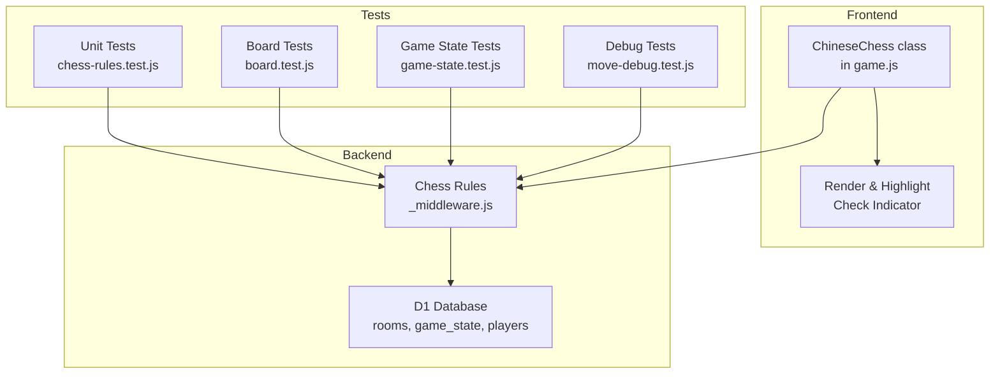
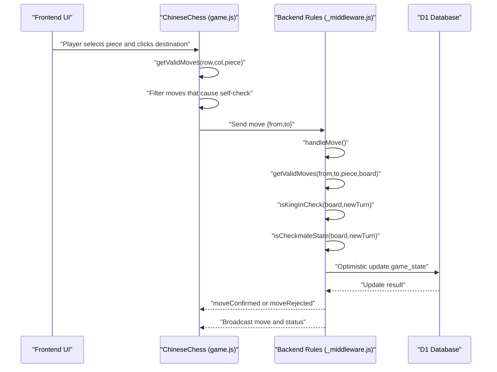
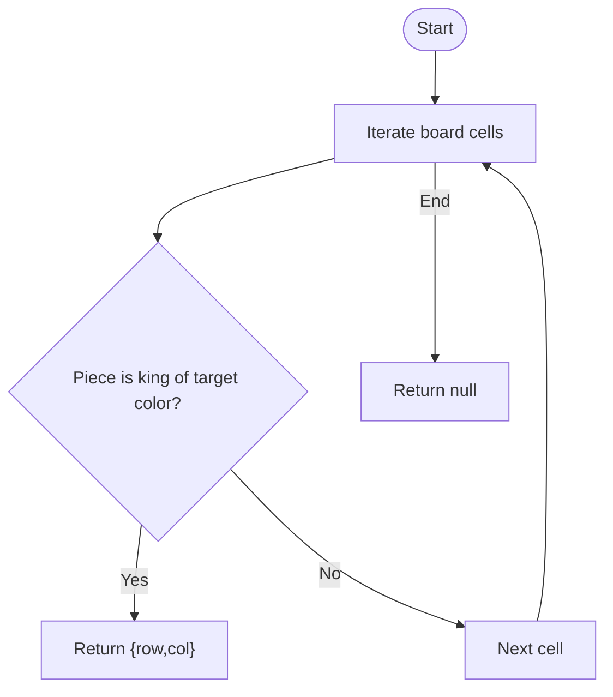
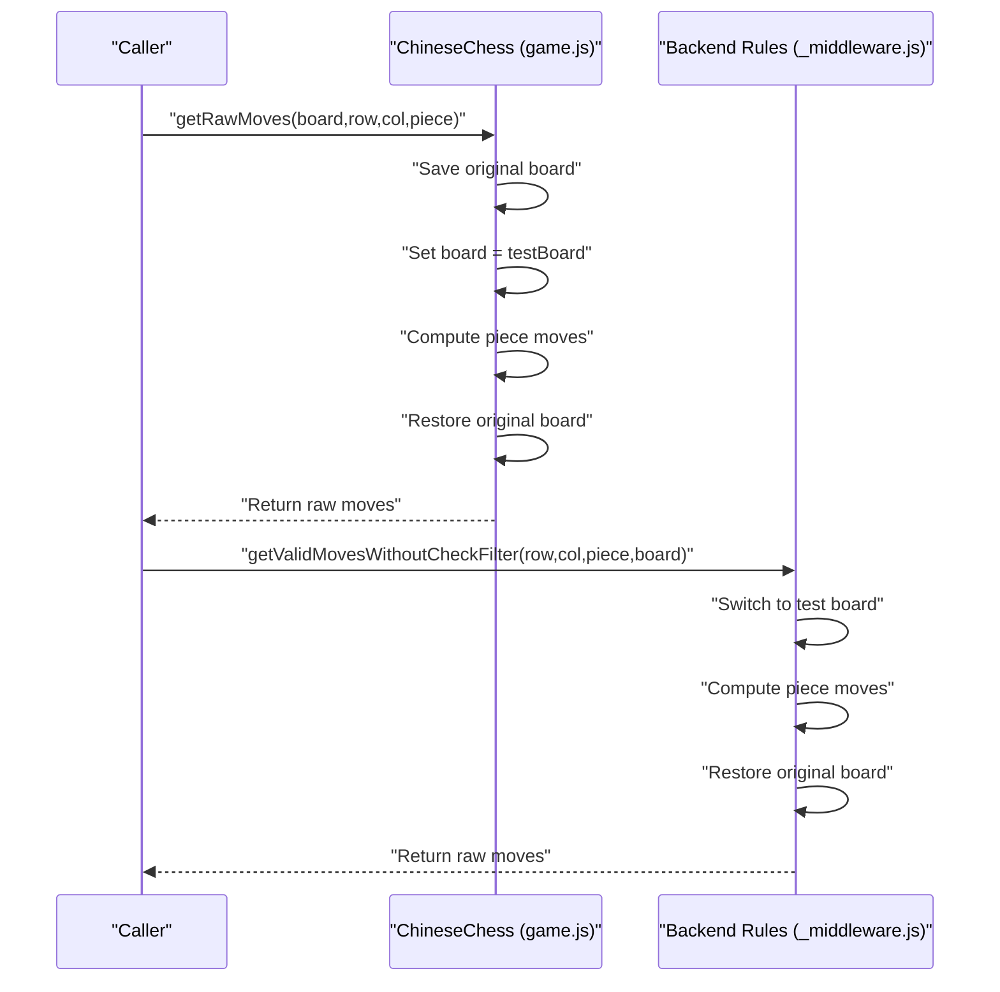
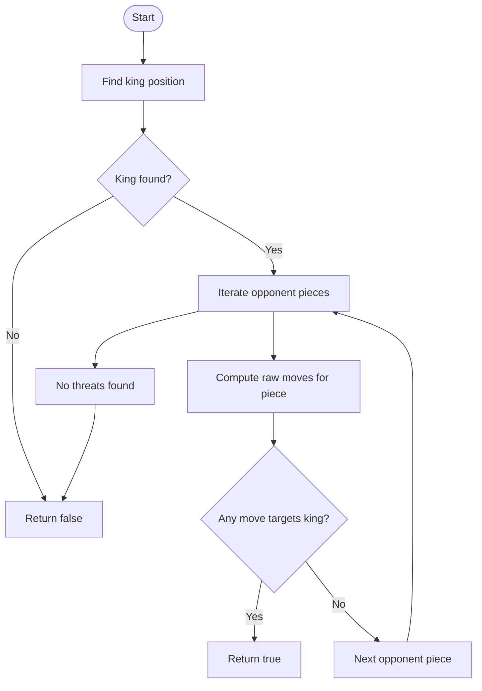
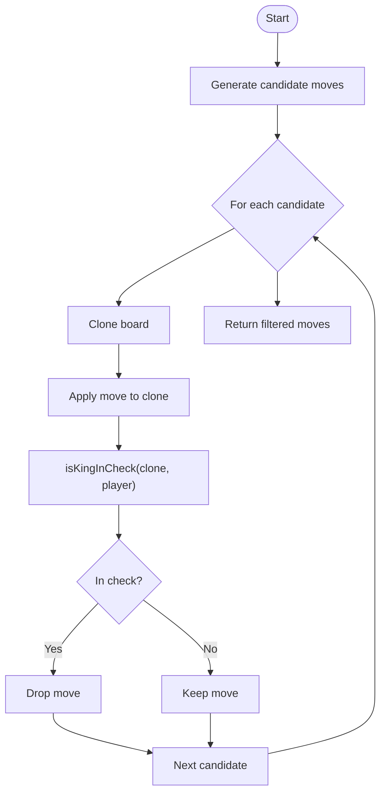
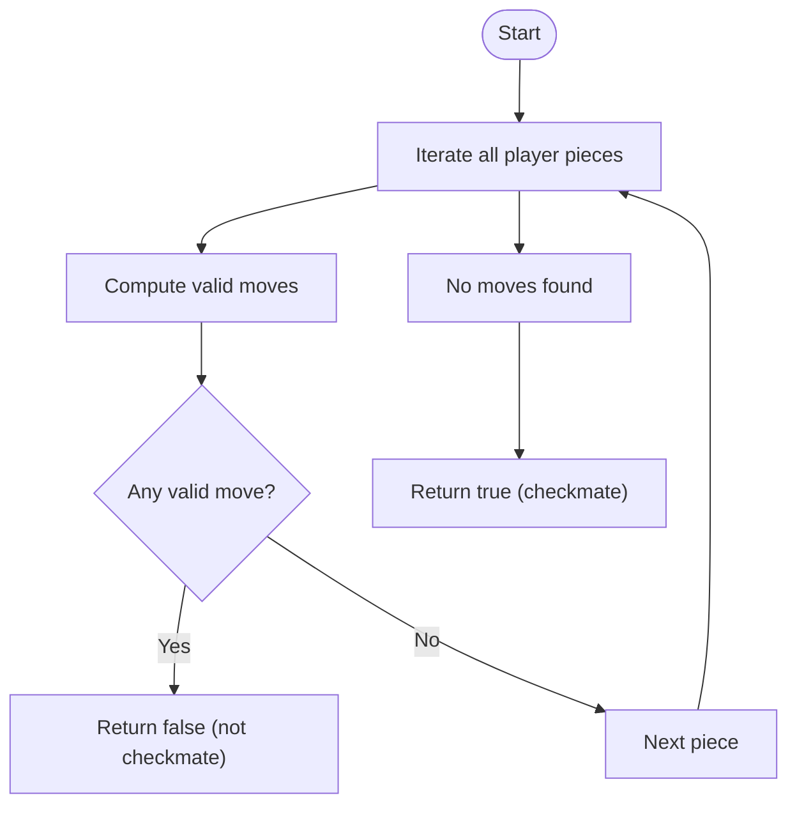
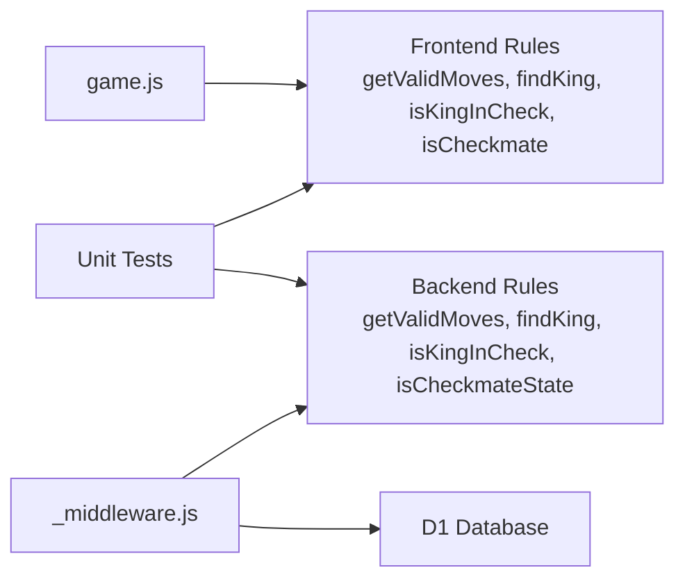

# Check and Checkmate Detection

<cite>
**Referenced Files in This Document**
- [game.js](file://game.js)
- [_middleware.js](file://functions/_middleware.js)
- [chess-rules.test.js](file://tests/unit/chess-rules.test.js)
- [board.test.js](file://tests/unit/board.test.js)
- [game-state.test.js](file://tests/unit/game-state.test.js)
- [move-debug.test.js](file://tests/debug/move-debug.test.js)
</cite>

## Table of Contents
1. [Introduction](#introduction)
2. [Project Structure](#project-structure)
3. [Core Components](#core-components)
4. [Architecture Overview](#architecture-overview)
5. [Detailed Component Analysis](#detailed-component-analysis)
6. [Dependency Analysis](#dependency-analysis)
7. [Performance Considerations](#performance-considerations)
8. [Troubleshooting Guide](#troubleshooting-guide)
9. [Conclusion](#conclusion)
10. [Appendices](#appendices)

## Introduction
This document explains the check and checkmate detection algorithms implemented in the Chinese Chess game. It focuses on:
- King position finding logic
- Opponent threat evaluation
- Move validation filtering to prevent self-check
- The isKingInCheck algorithm that evaluates all opponent pieces’ potential attacks
- The getRawMoves function for threat calculation
- The isCheckmate detection that tests all possible moves
- The recursive nature of move validation using temporary board states
- Performance optimizations and practical examples

## Project Structure
The check and checkmate logic appears in both the frontend and backend:
- Frontend (game.js): UI-driven move validation and check highlighting
- Backend (_middleware.js): authoritative move validation, check, and checkmate logic
- Tests: unit tests for rules, board state, and game state

**Diagram sources**
- [game.js:657-734](file://game.js#L657-L734)
- [_middleware.js:1031-1080](file://functions/_middleware.js#L1031-L1080)

**Section sources**
- [game.js:1-1319](file://game.js#L1-L1319)
- [_middleware.js:1-1316](file://functions/_middleware.js#L1-L1316)
- [chess-rules.test.js:1-670](file://tests/unit/chess-rules.test.js#L1-L670)
- [board.test.js:1-312](file://tests/unit/board.test.js#L1-L312)
- [game-state.test.js:1-311](file://tests/unit/game-state.test.js#L1-L311)
- [move-debug.test.js:1-262](file://tests/debug/move-debug.test.js#L1-L262)

## Core Components
- King position finder: locate the king of a given color on the board
- Threat evaluator: compute all legal moves for opponent pieces without self-check filtering
- Check detector: determine if the king is under attack
- Checkmate detector: determine if the current player has zero legal moves
- Move validator: filter out moves that would leave the player’s own king in check

These components are implemented in both frontend and backend to ensure correctness and resilience.

**Section sources**
- [game.js:657-734](file://game.js#L657-L734)
- [_middleware.js:1019-1080](file://functions/_middleware.js#L1019-L1080)

## Architecture Overview
The frontend validates moves locally for immediate feedback and highlights check. The backend performs authoritative validation and broadcasts updates.

**Diagram sources**
- [game.js:319-379](file://game.js#L319-L379)
- [_middleware.js:522-683](file://functions/_middleware.js#L522-L683)

## Detailed Component Analysis

### King Position Finding
- Purpose: Locate the king of a given color to evaluate threats and check status.
- Implementation:
  - Frontend: [findKing:657-667](file://game.js#L657-L667)
  - Backend: [findKing:1019-1029](file://functions/_middleware.js#L1019-L1029)
- Behavior:
  - Iterates the 10x9 board
  - Returns coordinates of the king or null if not found

**Diagram sources**
- [game.js:657-667](file://game.js#L657-L667)
- [_middleware.js:1019-1029](file://functions/_middleware.js#L1019-L1029)

**Section sources**
- [game.js:657-667](file://game.js#L657-L667)
- [_middleware.js:1019-1029](file://functions/_middleware.js#L1019-L1029)

### Opponent Threat Evaluation
- Purpose: Compute all legal moves for opponent pieces without filtering by self-check.
- Implementation:
  - Frontend: [getRawMoves:690-708](file://game.js#L690-L708)
  - Backend: [getValidMovesWithoutCheckFilter:1053-1064](file://functions/_middleware.js#L1053-L1064)
- Behavior:
  - Temporarily switches the board reference to the test board
  - Computes moves for each opponent piece
  - Restores the original board reference

**Diagram sources**
- [game.js:690-708](file://game.js#L690-L708)
- [_middleware.js:1053-1064](file://functions/_middleware.js#L1053-L1064)

**Section sources**
- [game.js:690-708](file://game.js#L690-L708)
- [_middleware.js:1053-1064](file://functions/_middleware.js#L1053-L1064)

### Check Detection: isKingInCheck
- Purpose: Determine if the current player’s king is under attack.
- Implementation:
  - Frontend: [isKingInCheck:669-688](file://game.js#L669-L688)
  - Backend: [isKingInCheck:1031-1051](file://functions/_middleware.js#L1031-L1051)
- Logic:
  - Find the king
  - Iterate all opponent pieces
  - Compute raw moves for each opponent piece
  - Check if any raw move targets the king’s position

**Diagram sources**
- [game.js:669-688](file://game.js#L669-L688)
- [_middleware.js:1031-1051](file://functions/_middleware.js#L1031-L1051)

**Section sources**
- [game.js:669-688](file://game.js#L669-L688)
- [_middleware.js:1031-1051](file://functions/_middleware.js#L1031-L1051)

### Move Validation Filtering (Prevent Self-Check)
- Purpose: Filter out moves that would leave the player’s own king in check.
- Implementation:
  - Frontend: [getValidMoves:404-424](file://game.js#L404-L424)
  - Backend: [getValidMoves:755-789](file://functions/_middleware.js#L755-L789)
- Logic:
  - Generate candidate moves for a piece
  - For each candidate, simulate the move on a temporary board
  - Check if the resulting board leaves the player’s king in check
  - Keep only moves that pass the check filter

**Diagram sources**
- [game.js:404-424](file://game.js#L404-L424)
- [_middleware.js:755-789](file://functions/_middleware.js#L755-L789)

**Section sources**
- [game.js:404-424](file://game.js#L404-L424)
- [_middleware.js:755-789](file://functions/_middleware.js#L755-L789)

### Checkmate Detection: isCheckmateState
- Purpose: Determine if the current player is in checkmate (no legal moves).
- Implementation:
  - Frontend: [isCheckmate:710-724](file://game.js#L710-L724)
  - Backend: [isCheckmateState:1066-1080](file://functions/_middleware.js#L1066-L1080)
- Logic:
  - Iterate all pieces of the current player
  - Compute valid moves for each piece
  - If any piece has at least one valid move, return false
  - If no piece has valid moves, return true

**Diagram sources**
- [game.js:710-724](file://game.js#L710-L724)
- [_middleware.js:1066-1080](file://functions/_middleware.js#L1066-L1080)

**Section sources**
- [game.js:710-724](file://game.js#L710-L724)
- [_middleware.js:1066-1080](file://functions/_middleware.js#L1066-L1080)

### Recursive Nature of Move Validation and Temporary Board States
- The validation pipeline relies on cloning the board for each candidate move to test legality without mutating the live game state.
- Frontend and backend both use a temporary board to:
  - Apply a move
  - Evaluate whether the player’s king is in check
  - Decide whether to keep the move

This approach ensures correctness and avoids side effects during validation.

**Section sources**
- [game.js:404-424](file://game.js#L404-L424)
- [_middleware.js:755-789](file://functions/_middleware.js#L755-L789)

### Implementation Details: findKing
- Frontend: [findKing:657-667](file://game.js#L657-L667)
- Backend: [findKing:1019-1029](file://functions/_middleware.js#L1019-L1029)
- Complexity:
  - O(R*C) where R=10, C=9
  - Constant extra space

**Section sources**
- [game.js:657-667](file://game.js#L657-L667)
- [_middleware.js:1019-1029](file://functions/_middleware.js#L1019-L1029)

### Implementation Details: getValidMovesForCheckmate
- Frontend: [getValidMovesForCheckmate:726-734](file://game.js#L726-L734)
- Backend: [getValidMoves:755-789](file://functions/_middleware.js#L755-L789)
- Purpose: Compute valid moves for checkmate detection without filtering by self-check.
- Behavior:
  - Temporarily sets the board reference to the test board
  - Computes valid moves using the same logic as normal validation
  - Restores the original board reference

**Section sources**
- [game.js:726-734](file://game.js#L726-L734)
- [_middleware.js:755-789](file://functions/_middleware.js#L755-L789)

## Dependency Analysis
- Frontend depends on:
  - Board rendering and UI logic
  - Local move validation and check detection
- Backend depends on:
  - Database for authoritative game state
  - Chess rules for validation and status computation
- Tests depend on:
  - Chess rules implementation
  - Board state helpers
  - Game state helpers

**Diagram sources**
- [game.js:404-734](file://game.js#L404-L734)
- [_middleware.js:755-1080](file://functions/_middleware.js#L755-L1080)

**Section sources**
- [game.js:404-734](file://game.js#L404-L734)
- [_middleware.js:755-1080](file://functions/_middleware.js#L755-L1080)

## Performance Considerations
- Board traversal:
  - Fixed-size 10x9 board; constant-time operations per piece
- Move generation:
  - Piece-specific generators; bounded by piece type
- Threat evaluation:
  - Worst-case O(R*C) over the board for each opponent piece
- Filtering:
  - Up to N candidates per piece; each requires a clone and a check evaluation
- Optimizations present:
  - Early exit when any opponent piece threatens the king
  - Early exit when any piece has a valid move during checkmate detection
- Recommendations:
  - Cache cloned boards if repeated validations occur frequently
  - Consider precomputing reachable squares for heavy pieces (chariot/cannon) to reduce repeated checks
  - Use bitboards or compact representations for larger boards (not applicable here)

[No sources needed since this section provides general guidance]

## Troubleshooting Guide
Common issues and diagnostics:
- King not found:
  - Symptom: isKingInCheck returns false unexpectedly
  - Cause: Incorrect color or missing king
  - Fix: Verify findKing and color logic
- Self-check not prevented:
  - Symptom: Player can move into check
  - Cause: Missing filter in getValidMoves
  - Fix: Ensure temporary board validation is applied
- Checkmate not detected:
  - Symptom: Game continues despite no legal moves
  - Cause: Missing or incorrect isCheckmateState logic
  - Fix: Verify iteration over all pieces and valid move computation
- Stalemate vs. checkmate:
  - Symptom: No legal moves but not in check
  - Cause: Misclassification
  - Fix: Ensure isKingInCheck is false before declaring stalemate

**Section sources**
- [game.js:404-424](file://game.js#L404-L424)
- [_middleware.js:755-789](file://functions/_middleware.js#L755-L789)
- [game-state.test.js:30-50](file://tests/unit/game-state.test.js#L30-L50)

## Conclusion
The check and checkmate detection system combines efficient board traversal, precise threat evaluation, and robust move validation. Both frontend and backend implement the same logic to ensure correctness and responsiveness. The use of temporary board states prevents side effects and guarantees accurate self-check filtering. Tests validate key scenarios, including check by chariot, horse, and cannon, and demonstrate the difference between check and checkmate.

[No sources needed since this section summarizes without analyzing specific files]

## Appendices

### Example Scenarios
- Check by chariot: A black chariot attacks a red king on the same file with no blocking piece.
- Check by horse: A black horse attacks a red king in an L-shaped pattern.
- Check by cannon: A black cannon attacks a red king with exactly one piece between them.
- Checkmate: No legal moves remain for the red player while in check.
- Stalemate: No legal moves remain for the red player while not in check.

**Section sources**
- [chess-rules.test.js:588-632](file://tests/unit/chess-rules.test.js#L588-L632)
- [game-state.test.js:30-50](file://tests/unit/game-state.test.js#L30-L50)

### API and Function Index
- Frontend
  - [findKing:657-667](file://game.js#L657-L667)
  - [getRawMoves:690-708](file://game.js#L690-L708)
  - [isKingInCheck:669-688](file://game.js#L669-L688)
  - [getValidMoves:404-424](file://game.js#L404-L424)
  - [isCheckmate:710-724](file://game.js#L710-L724)
  - [getValidMovesForCheckmate:726-734](file://game.js#L726-L734)
- Backend
  - [findKing:1019-1029](file://functions/_middleware.js#L1019-L1029)
  - [getValidMovesWithoutCheckFilter:1053-1064](file://functions/_middleware.js#L1053-L1064)
  - [isKingInCheck:1031-1051](file://functions/_middleware.js#L1031-L1051)
  - [getValidMoves:755-789](file://functions/_middleware.js#L755-L789)
  - [isCheckmateState:1066-1080](file://functions/_middleware.js#L1066-L1080)

**Section sources**
- [game.js:404-734](file://game.js#L404-L734)
- [_middleware.js:755-1080](file://functions/_middleware.js#L755-L1080)