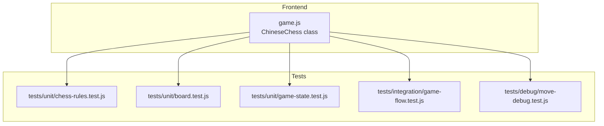
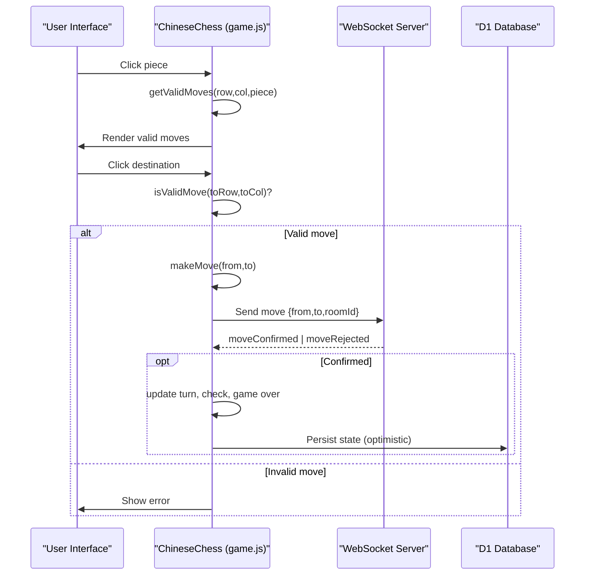
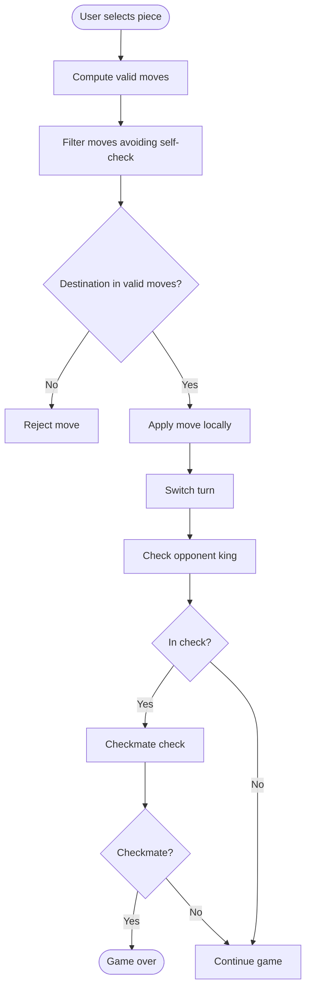
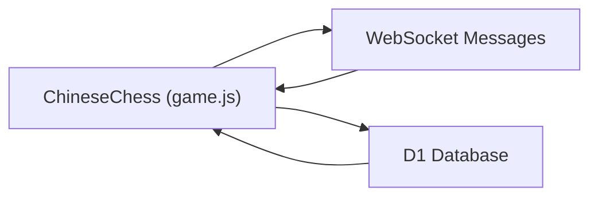

# Game Logic Implementation

<cite>
**Referenced Files in This Document**
- [README.md](file://README.md)
- [game.js](file://game.js)
- [tests/unit/chess-rules.test.js](file://tests/unit/chess-rules.test.js)
- [tests/unit/board.test.js](file://tests/unit/board.test.js)
- [tests/unit/game-state.test.js](file://tests/unit/game-state.test.js)
- [tests/integration/game-flow.test.js](file://tests/integration/game-flow.test.js)
- [tests/debug/move-debug.test.js](file://tests/debug/move-debug.test.js)
</cite>

## Table of Contents
1. [Introduction](#introduction)
2. [Project Structure](#project-structure)
3. [Core Components](#core-components)
4. [Architecture Overview](#architecture-overview)
5. [Detailed Component Analysis](#detailed-component-analysis)
6. [Dependency Analysis](#dependency-analysis)
7. [Performance Considerations](#performance-considerations)
8. [Troubleshooting Guide](#troubleshooting-guide)
9. [Conclusion](#conclusion)
10. [Appendices](#appendices)

## Introduction
This document explains the Chinese Chess (Xiangqi) rule implementation and game logic present in the repository. It covers:
- Movement validation for all piece types (將/帥, 士/仕, 象/相, 馬, 車, 炮/砲, 卒/兵)
- Special rules: flying general rule, blocking effects, river crossing mechanics
- Check and checkmate detection
- Game state management: turn tracking, move history, and termination conditions
- Board representation, coordinate systems, and piece positioning logic
- Test coverage demonstrating rule validation and edge cases
- Examples of move validation, position evaluation, and game state transitions

## Project Structure
The repository implements a client-side game logic module and comprehensive unit and integration tests. The frontend game logic file defines the board, piece movement rules, and game state transitions. Tests validate correctness across piece movement, board setup, game state, and end-to-end flow.

**Diagram sources**
- [game.js](file://game.js)
- [tests/unit/chess-rules.test.js](file://tests/unit/chess-rules.test.js)
- [tests/unit/board.test.js](file://tests/unit/board.test.js)
- [tests/unit/game-state.test.js](file://tests/unit/game-state.test.js)
- [tests/integration/game-flow.test.js](file://tests/integration/game-flow.test.js)
- [tests/debug/move-debug.test.js](file://tests/debug/move-debug.test.js)

**Section sources**
- [README.md](file://README.md)
- [game.js](file://game.js)

## Core Components
- Board representation: 10 rows × 9 columns, with piece objects containing type, color, and name.
- Piece movement logic: per-piece generators that compute legal moves, filtered by palace constraints, blocking rules, and check avoidance.
- Check detection: scans opponent threats to locate the king’s position and determines whether any threat can reach it.
- Checkmate detection: verifies whether any legal move exists for the current player to escape check.
- Game state: turn tracking, move counting, game over flag, and check indicators.

Key implementation references:
- Board initialization and rendering: [initializeBoard](file://game.js), [renderBoard](file://game.js)
- Piece movement generators: [getValidMoves](file://game.js), [getJiangMoves](file://game.js), [getShiMoves](file://game.js), [getXiangMoves](file://game.js), [getMaMoves](file://game.js), [getJuMoves](file://game.js), [getPaoMoves](file://game.js), [getZuMoves](file://game.js)
- Check and checkmate: [isKingInCheck](file://game.js), [isCheckmate](file://game.js)
- Move execution and state updates: [makeMove](file://game.js), [rollbackMove](file://game.js)

**Section sources**
- [game.js](file://game.js)

## Architecture Overview
The frontend game logic encapsulates the complete game rules and state. It validates moves locally, applies optimistic updates, and communicates with the backend via WebSocket for authoritative state and synchronization.

**Diagram sources**
- [game.js](file://game.js)
- [tests/integration/game-flow.test.js](file://tests/integration/game-flow.test.js)

## Detailed Component Analysis

### Board Representation and Coordinate System
- The board is a 10×9 grid (rows 0–9, cols 0–8).
- Pieces are represented as objects with fields: type, color, name.
- Initial setup places black pieces at row 0 and red pieces at row 9, with pawns placed accordingly.

Validation references:
- Board creation and initial piece placement: [initializeBoard](file://game.js)
- Board dimension and piece counts: [Board Initialization tests](file://tests/unit/board.test.js)

**Section sources**
- [game.js](file://game.js)
- [tests/unit/board.test.js](file://tests/unit/board.test.js)

### Piece Movement Rules

#### 將/帥 (King)
- Moves one step horizontally or vertically within the palace (3×3 area).
- Captures opponent king if no pieces are between them (flying general rule).
- Palace bounds differ by color.

References:
- Movement generator: [getJiangMoves](file://game.js)
- Flying general enforcement: [getJiangMoves](file://game.js)
- Tests: [Jiang tests](file://tests/unit/chess-rules.test.js)

**Section sources**
- [game.js](file://game.js)
- [tests/unit/chess-rules.test.js](file://tests/unit/chess-rules.test.js)

#### 士/仕 (Advisor)
- Moves one step diagonally within the palace.
- No captures or blocking effects.

References:
- Movement generator: [getShiMoves](file://game.js)
- Tests: [Shi tests](file://tests/unit/chess-rules.test.js)

**Section sources**
- [game.js](file://game.js)
- [tests/unit/chess-rules.test.js](file://tests/unit/chess-rules.test.js)

#### 象/相 (Elephant)
- Moves two steps diagonally.
- Cannot cross the river (row beyond the middle).
- Blocked by a piece located at the “eye” position.

References:
- Movement generator: [getXiangMoves](file://game.js)
- Tests: [Xiang tests](file://tests/unit/chess-rules.test.js)

**Section sources**
- [game.js](file://game.js)
- [tests/unit/chess-rules.test.js](file://tests/unit/chess-rules.test.js)

#### 馬 (Horse)
- Moves in an “L” shape (two in one direction, one perpendicular).
- Blocked if the leg square is occupied (‘horse leg’ block).

References:
- Movement generator: [getMaMoves](file://game.js)
- Tests: [Ma tests](file://tests/unit/chess-rules.test.js)

**Section sources**
- [game.js](file://game.js)
- [tests/unit/chess-rules.test.js](file://tests/unit/chess-rules.test.js)

#### 車 (Chariot)
- Moves any number of steps horizontally or vertically.
- Blocked by friendly pieces; captures enemy pieces.

References:
- Movement generator: [getJuMoves](file://game.js)
- Tests: [Ju tests](file://tests/unit/chess-rules.test.js)

**Section sources**
- [game.js](file://game.js)
- [tests/unit/chess-rules.test.js](file://tests/unit/chess-rules.test.js)

#### 炮/砲 (Cannon)
- Moves like Chariot when not capturing.
- Captures by jumping exactly one piece (friendly or enemy) between the origin and target.

References:
- Movement generator: [getPaoMoves](file://game.js)
- Tests: [Pao tests](file://tests/unit/chess-rules.test.js)

**Section sources**
- [game.js](file://game.js)
- [tests/unit/chess-rules.test.js](file://tests/unit/chess-rules.test.js)

#### 卒/兵 (Pawn)
- Moves one step forward until crossing the river.
- After crossing, can move sideways in addition to forward.
- No backward moves.

References:
- Movement generator: [getZuMoves](file://game.js)
- Tests: [Zu tests](file://tests/unit/chess-rules.test.js)

**Section sources**
- [game.js](file://game.js)
- [tests/unit/chess-rules.test.js](file://tests/unit/chess-rules.test.js)

### Special Rules and Mechanics

#### Flying General Rule
- Two Kings cannot face each other on the same file without any piece between them.
- The generator computes candidate captures along the file and filters out blocked positions.

References:
- Enforcement in [getJiangMoves](file://game.js)
- Tests: [Flying general tests](file://tests/unit/chess-rules.test.js)

**Section sources**
- [game.js](file://game.js)
- [tests/unit/chess-rules.test.js](file://tests/unit/chess-rules.test.js)

#### Blocking Effects
- Horse leg blocking: [getMaMoves](file://game.js)
- Elephant eye blocking: [getXiangMoves](file://game.js)
- Chariot/Cannon path blocking: [getJuMoves](file://game.js), [getPaoMoves](file://game.js)

**Section sources**
- [game.js](file://game.js)

#### River Crossing Mechanics
- Elephants cannot cross the river (middle row).
- Pawns gain sideways movement after crossing the river.

References:
- River checks: [getXiangMoves](file://game.js), [getZuMoves](file://game.js)
- Tests: [River-related tests](file://tests/unit/chess-rules.test.js)

**Section sources**
- [game.js](file://game.js)
- [tests/unit/chess-rules.test.js](file://tests/unit/chess-rules.test.js)

### Check and Checkmate Detection

#### Check Detection
- Locates the current player’s King.
- Scans opponent pieces to generate their raw moves and checks if any reaches the King’s position.
- Uses a temporary board context to avoid mutating the current state during evaluation.

References:
- King search: [findKing](file://game.js)
- Check detection: [isKingInCheck](file://game.js)
- Raw move generation for opponents: [getRawMoves](file://game.js)
- Tests: [Check detection tests](file://tests/unit/chess-rules.test.js)

**Section sources**
- [game.js](file://game.js)
- [tests/unit/chess-rules.test.js](file://tests/unit/chess-rules.test.js)

#### Checkmate Detection
- Iterates all pieces of the current player and generates their valid moves (filtered by leaving self-in-check).
- If any legal move exists, the position is not checkmate.
- Otherwise, the game ends in checkmate.

References:
- Checkmate logic: [isCheckmate](file://game.js)
- Valid move filtering: [getValidMoves](file://game.js)
- Tests: [Checkmate tests](file://tests/unit/chess-rules.test.js)

**Section sources**
- [game.js](file://game.js)
- [tests/unit/chess-rules.test.js](file://tests/unit/chess-rules.test.js)

### Game State Management
- Turn tracking: alternates between red and black after each valid move.
- Move history: increments move count and stores pending move for rollback.
- Game termination: ends when a King is captured or when checkmate is detected.
- Check indicator: highlights the King when in check.

References:
- Move execution and state updates: [makeMove](file://game.js), [rollbackMove](file://game.js)
- Turn indicator and messages: [updateTurnIndicator](file://game.js)
- Tests: [Game state tests](file://tests/unit/game-state.test.js)

**Section sources**
- [game.js](file://game.js)
- [tests/unit/game-state.test.js](file://tests/unit/game-state.test.js)

### Move Validation Flow
The frontend validates moves before applying them, ensuring:
- The selected piece belongs to the current player.
- The destination is among the computed valid moves.
- Applying the move does not leave the player’s King in check.

**Diagram sources**
- [game.js](file://game.js)

**Section sources**
- [game.js](file://game.js)

### Examples and Edge Cases

#### Example: Red Pawn First Move
- Validates forward movement from row 6 to row 5.
- Demonstrates initial board setup and move computation.

References:
- [move-debug tests](file://tests/debug/move-debug.test.js)

**Section sources**
- [tests/debug/move-debug.test.js](file://tests/debug/move-debug.test.js)

#### Example: Red Chariot Edge Movement
- Validates upward movement along the left/right edges.
- Demonstrates unobstructed path scanning.

References:
- [move-debug tests](file://tests/debug/move-debug.test.js)

**Section sources**
- [tests/debug/move-debug.test.js](file://tests/debug/move-debug.test.js)

#### Example: Cannon Capture with Jump
- Validates capture requiring a single intervening piece.
- Demonstrates capture-only-on-jump rule.

References:
- [Pao tests](file://tests/unit/chess-rules.test.js)

**Section sources**
- [tests/unit/chess-rules.test.js](file://tests/unit/chess-rules.test.js)

#### Example: Flying General Capture
- Validates capture of opponent King when no blocker exists on the file.

References:
- [Jiang tests](file://tests/unit/chess-rules.test.js)

**Section sources**
- [tests/unit/chess-rules.test.js](file://tests/unit/chess-rules.test.js)

#### Example: Turn Enforcement and Concurrency
- Integration tests demonstrate turn validation and optimistic locking semantics.

References:
- [game-flow tests](file://tests/integration/game-flow.test.js)

**Section sources**
- [tests/integration/game-flow.test.js](file://tests/integration/game-flow.test.js)

## Dependency Analysis
The frontend game logic depends on:
- Internal helpers for board validation and move generation.
- WebSocket messaging for multiplayer synchronization.
- Database persistence for authoritative state.

**Diagram sources**
- [game.js](file://game.js)
- [tests/integration/game-flow.test.js](file://tests/integration/game-flow.test.js)

**Section sources**
- [game.js](file://game.js)
- [tests/integration/game-flow.test.js](file://tests/integration/game-flow.test.js)

## Performance Considerations
- Move generation uses bounded loops over fixed board dimensions, resulting in constant-time overhead per piece type.
- Check detection scans up to 90 squares and evaluates raw moves per opponent piece; acceptable for small boards.
- Filtering by self-check avoids expensive simulations by testing a temporary board state.
- Optimistic UI updates reduce latency; server confirms or rejects moves to resolve conflicts.

[No sources needed since this section provides general guidance]

## Troubleshooting Guide
Common issues and resolutions:
- First move rejection: Verify the piece color and initial position; confirm the destination is among computed valid moves.
  - See [move-debug tests](file://tests/debug/move-debug.test.js)
- Turn enforcement errors: Ensure the current player matches the piece color and the game is not over.
  - See [game-flow tests](file://tests/integration/game-flow.test.js)
- Check and checkmate confusion: Confirm the King’s position and that no legal escape move exists.
  - See [chess-rules tests](file://tests/unit/chess-rules.test.js)
- River crossing violations: Validate elephant and pawn movement constraints.
  - See [chess-rules tests](file://tests/unit/chess-rules.test.js)

**Section sources**
- [tests/debug/move-debug.test.js](file://tests/debug/move-debug.test.js)
- [tests/integration/game-flow.test.js](file://tests/integration/game-flow.test.js)
- [tests/unit/chess-rules.test.js](file://tests/unit/chess-rules.test.js)

## Conclusion
The repository implements a robust Chinese Chess engine with comprehensive rule coverage, including piece movement, palace constraints, blocking effects, river mechanics, flying general rule, and check/checkmate detection. The tests validate correctness across scenarios and edge cases, while integration tests demonstrate turn enforcement and optimistic concurrency handling.

[No sources needed since this section summarizes without analyzing specific files]

## Appendices

### Piece Types and Attributes
- 將/帥: King, one-step orthogonal within palace, can capture opponent King via flying general.
- 士/仕: Advisor, one-step diagonal within palace.
- 象/相: Elephant, two-step diagonal, blocked by eye, cannot cross river.
- 馬: Horse, L-shaped, blocked by leg.
- 車: Chariot, any-step orthogonal, blocked by friendly, captures enemy.
- 炮/砲: Cannon, any-step orthogonal, captures only when jumping one piece.
- 卒/兵: Pawn, forward-only until crossing river, then can move sideways.

**Section sources**
- [README.md](file://README.md)
- [tests/unit/chess-rules.test.js](file://tests/unit/chess-rules.test.js)