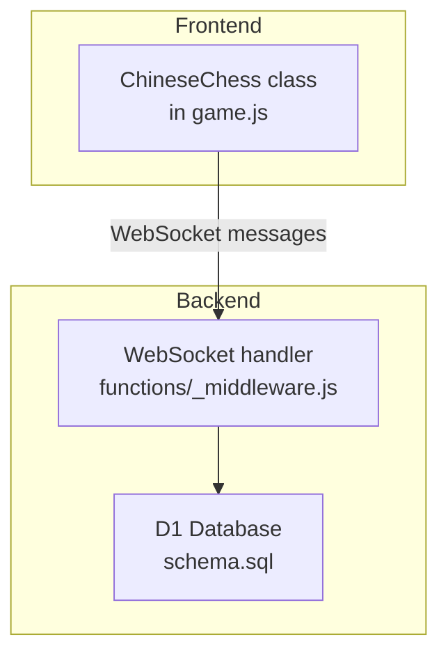
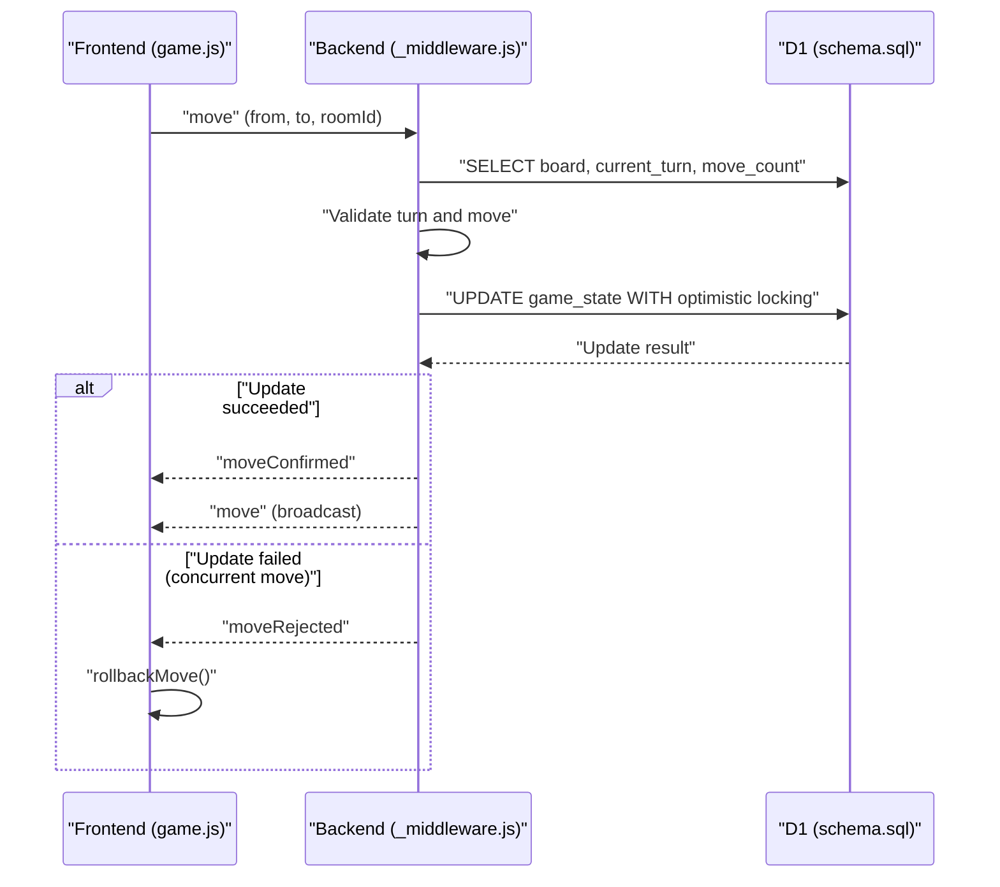
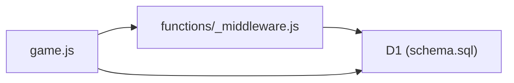

# Game State Management

<cite>
**Referenced Files in This Document**
- [game.js](file://game.js)
- [functions/_middleware.js](file://functions/_middleware.js)
- [schema.sql](file://schema.sql)
- [README.md](file://README.md)
- [tests/unit/game-state.test.js](file://tests/unit/game-state.test.js)
- [tests/integration/websocket.test.js](file://tests/integration/websocket.test.js)
- [tests/integration/database.test.js](file://tests/integration/database.test.js)
- [tests/unit/reconnection.test.js](file://tests/unit/reconnection.test.js)
</cite>

## Table of Contents
1. [Introduction](#introduction)
2. [Project Structure](#project-structure)
3. [Core Components](#core-components)
4. [Architecture Overview](#architecture-overview)
5. [Detailed Component Analysis](#detailed-component-analysis)
6. [Dependency Analysis](#dependency-analysis)
7. [Performance Considerations](#performance-considerations)
8. [Troubleshooting Guide](#troubleshooting-guide)
9. [Conclusion](#conclusion)
10. [Appendices](#appendices)

## Introduction
This document explains the complete game state management system for the Chinese Chess online game. It covers turn tracking, move counting, game termination conditions, and state persistence. It details optimistic move application, pending move rollback, and game over detection logic. It also documents state variables initialization, move validation workflow, UI state updates, move history tracking, player color assignment, room state management, WebSocket integration for state synchronization, and reconnection handling logic. Examples of state transitions, rollback scenarios, and state validation during reconnection are included.

## Project Structure
The project consists of:
- Frontend game logic and UI in a single JavaScript module
- Backend WebSocket handler and game state persistence in a Cloudflare Pages Functions middleware
- D1 database schema for rooms, game state, and players
- Tests covering unit and integration aspects

**Diagram sources**
- [game.js:1-1319](file://game.js#L1-L1319)
- [functions/_middleware.js:104-122](file://functions/_middleware.js#L104-L122)
- [schema.sql:1-42](file://schema.sql#L1-L42)

**Section sources**
- [README.md:162-175](file://README.md#L162-L175)

## Core Components
- Frontend game engine: initializes board, tracks turn, validates moves, applies optimistic updates, handles UI, and manages WebSocket lifecycle.
- Backend WebSocket service: manages rooms, persists game state, validates moves, broadcasts updates, and handles reconnection with safety checks.
- Database schema: stores rooms, game state, and players with indexes for performance.

Key responsibilities:
- Turn tracking and alternation
- Move counting and persistent counters
- Game over detection (capture of general, checkmate)
- Optimistic UI updates with rollback on rejection
- Room state management and player color assignment
- WebSocket heartbeat, polling fallbacks, and reconnection logic

**Section sources**
- [game.js:4-51](file://game.js#L4-L51)
- [functions/_middleware.js:282-351](file://functions/_middleware.js#L282-L351)
- [schema.sql:5-25](file://schema.sql#L5-L25)

## Architecture Overview
The system uses a hybrid optimistic/pessimistic model:
- Frontend optimistically renders moves and switches turns immediately.
- Backend validates moves, applies them atomically with optimistic locking, and broadcasts authoritative state.
- Frontend receives confirmations or rejections and rolls back if needed.
- Persistent state is stored in D1 with separate tables for rooms, game state, and players.

**Diagram sources**
- [functions/_middleware.js:522-683](file://functions/_middleware.js#L522-L683)
- [game.js:319-398](file://game.js#L319-L398)

## Detailed Component Analysis

### Frontend Game Engine (ChineseChess)
Responsibilities:
- Initialize board and UI state
- Track current player, selected piece, valid moves, game over flag, move count
- Manage WebSocket connection, heartbeat, reconnection, and polling
- Apply optimistic moves and roll back on rejection
- Detect check and checkmate and update UI indicators

State variables initialization:
- Board: 10 rows × 9 columns with initial piece placement
- Turn: starts with red
- Move count: starts at 0
- Game over: false
- Pending move: null
- UI state: selected piece, valid moves, check warning, connection state

Optimistic move application:
- On valid move, frontend saves previous state to pending move
- Applies move locally, switches turn, increments move count, renders board
- Sends move to backend; expects confirmation or rejection

Rollback mechanism:
- On rejection, restores previous board, turn, check state, clears pending move
- Resets selection and valid moves, re-renders UI

Game over detection:
- Capturing opponent’s general ends the game
- Check and checkmate detection updates UI and sets game over flag

UI state updates:
- Render board with pieces and valid moves
- Highlight king in check
- Update turn indicator and connection status

Reconnection handling:
- Heartbeat pings with timeouts
- Exponential backoff reconnection
- Polling for opponent presence and move updates
- Rejoin room with color and receive restored state

**Section sources**
- [game.js:57-97](file://game.js#L57-L97)
- [game.js:319-398](file://game.js#L319-L398)
- [game.js:888-1069](file://game.js#L888-L1069)
- [game.js:1075-1164](file://game.js#L1075-L1164)
- [game.js:1170-1234](file://game.js#L1170-L1234)
- [game.js:1265-1312](file://game.js#L1265-L1312)

### Backend WebSocket Service
Responsibilities:
- Accept WebSocket connections, manage heartbeat, route messages
- Room management: create, join, leave, stale cleanup
- Game logic: validate moves, apply with optimistic locking, broadcast updates
- Player management: track colors, connection status, last seen timestamps
- Reconnection: verify disconnection before allowing rejoin

Room management:
- Create room with initial board and red player as creator
- Join room assigns black player and updates room status
- Leave room updates player status and cleans up if empty

Move validation and application:
- Validate turn and piece ownership
- Compute valid moves and check move validity
- Apply move with optimistic locking using move_count
- Broadcast move and game over events

Reconnection safety:
- Reject rejoin if original player is still connected
- Update player ID and connection status on successful rejoin
- Restore board, turn, and move count to frontend

**Section sources**
- [functions/_middleware.js:131-185](file://functions/_middleware.js#L131-L185)
- [functions/_middleware.js:231-276](file://functions/_middleware.js#L231-L276)
- [functions/_middleware.js:282-443](file://functions/_middleware.js#L282-L443)
- [functions/_middleware.js:522-683](file://functions/_middleware.js#L522-L683)
- [functions/_middleware.js:1086-1146](file://functions/_middleware.js#L1086-L1146)

### Database Schema and Persistence
Tables:
- rooms: room metadata, player IDs, status
- game_state: board JSON, current turn, last move JSON, move count, updated_at, status
- players: player ID, room_id, color, connected, last_seen

Indexes:
- rooms: name, status
- players: room_id
- game_state: updated_at

Persistence model:
- Frontend persists state in D1 via backend operations
- Backend writes board, turn, last move, move count, and updated_at
- Optimistic locking prevents concurrent move conflicts

**Section sources**
- [schema.sql:5-25](file://schema.sql#L5-L25)
- [functions/_middleware.js:532-622](file://functions/_middleware.js#L532-L622)

### Move Validation Workflow
Frontend:
- Compute valid moves for selected piece
- Filter moves that would leave own king in check
- Validate click position against valid moves

Backend:
- Retrieve current game state and expected move_count
- Validate turn and piece ownership
- Compute valid moves and check move validity
- Apply move with optimistic locking; reject if another move was applied concurrently

**Section sources**
- [game.js:404-424](file://game.js#L404-L424)
- [functions/_middleware.js:576-583](file://functions/_middleware.js#L576-L583)
- [functions/_middleware.js:619-634](file://functions/_middleware.js#L619-L634)

### Game Termination Conditions
Capture of general:
- If captured piece is the general, mark game as finished and set winner

Check and checkmate:
- Detect check after move; if opponent has no legal moves, declare checkmate and finish game

**Section sources**
- [game.js:346-361](file://game.js#L346-L361)
- [functions/_middleware.js:598-608](file://functions/_middleware.js#L598-L608)
- [functions/_middleware.js:1066-1080](file://functions/_middleware.js#L1066-L1080)

### State Variables Initialization
Frontend:
- Board, current player, selected piece, valid moves, game over, color, room ID, move count
- UI and connection state, heartbeat, pending move, polling intervals

Backend:
- Initialize database tables and indexes
- Create initial board state for new rooms

**Section sources**
- [game.js:4-51](file://game.js#L4-L51)
- [functions/_middleware.js:46-98](file://functions/_middleware.js#L46-L98)
- [functions/_middleware.js:1275-1315](file://functions/_middleware.js#L1275-L1315)

### Player Color Assignment and Room State
- Creator joins as red; joining player becomes black
- Room status transitions from waiting to playing upon second player
- Players tracked with color, connection status, and last seen timestamps

**Section sources**
- [functions/_middleware.js:318-329](file://functions/_middleware.js#L318-L329)
- [functions/_middleware.js:398-404](file://functions/_middleware.js#L398-L404)

### WebSocket Communication and Synchronization
Message types:
- Room: createRoom, joinRoom, leaveRoom
- Game: move, moveConfirmed, moveRejected, moveUpdate, gameOver
- Reconnection: rejoin, rejoined
- Heartbeat: ping, pong
- Polling: checkOpponent, checkMoves

Frontend:
- Connects to /ws, sends room actions and moves
- Receives confirmations, rejections, and updates
- Manages heartbeat and reconnection

Backend:
- Validates messages and routes to handlers
- Broadcasts state to room members
- Handles disconnects and cleanup

**Section sources**
- [game.js:888-937](file://game.js#L888-L937)
- [functions/_middleware.js:242-276](file://functions/_middleware.js#L242-L276)

### Reconnection Handling Logic
Race condition prevention:
- Backend rejects rejoin if original player is still connected
- Updates player ID and connection status on successful rejoin
- Restores board, turn, and move count to frontend

Frontend:
- Attempts rejoin with room ID and color
- Receives rejoined message with restored state
- Continues play seamlessly

**Section sources**
- [functions/_middleware.js:1107-1111](file://functions/_middleware.js#L1107-L1111)
- [functions/_middleware.js:1114-1141](file://functions/_middleware.js#L1114-L1141)
- [game.js:1020-1034](file://game.js#L1020-L1034)

### Examples of State Transitions, Rollback Scenarios, and Validation During Reconnection

State transitions:
- Room creation: waiting -> playing
- Move: current_turn flips, move_count increments, last_move recorded
- Game over: status changes to finished, winner determined

Rollback scenarios:
- Backend rejects move due to invalid move or concurrent update
- Frontend restores previous board, turn, and clears pending move

Validation during reconnection:
- Backend ensures original player is disconnected before allowing rejoin
- Frontend receives restored state and resumes play

**Section sources**
- [functions/_middleware.js:398-404](file://functions/_middleware.js#L398-L404)
- [functions/_middleware.js:619-634](file://functions/_middleware.js#L619-L634)
- [game.js:381-398](file://game.js#L381-L398)
- [functions/_middleware.js:1107-1111](file://functions/_middleware.js#L1107-L1111)
- [tests/unit/reconnection.test.js:168-211](file://tests/unit/reconnection.test.js#L168-L211)

## Dependency Analysis
- Frontend depends on WebSocket for real-time updates and D1 for persistence via backend
- Backend depends on D1 for rooms, game_state, and players
- Move validation is shared between frontend and backend to ensure consistency

**Diagram sources**
- [game.js:740-808](file://game.js#L740-L808)
- [functions/_middleware.js:104-122](file://functions/_middleware.js#L104-L122)
- [schema.sql:5-25](file://schema.sql#L5-L25)

**Section sources**
- [functions/_middleware.js:104-122](file://functions/_middleware.js#L104-L122)
- [schema.sql:5-25](file://schema.sql#L5-L25)

## Performance Considerations
- Optimistic locking with move_count reduces contention and improves responsiveness
- Heartbeat and polling provide fallbacks for connectivity issues
- Database indexes on rooms, players, and game_state improve query performance
- Frontend rendering minimizes DOM updates by selectively re-rendering board and indicators

[No sources needed since this section provides general guidance]

## Troubleshooting Guide
Common issues and resolutions:
- Move rejected: verify turn ownership and move validity; frontend will rollback
- Connection lost: frontend attempts exponential backoff reconnection; heartbeat detects timeouts
- Stale room cleanup: backend removes rooms with no players or inactive players
- Reconnection race: backend prevents rejoin if original player still connected

**Section sources**
- [game.js:973-978](file://game.js#L973-L978)
- [game.js:810-836](file://game.js#L810-L836)
- [functions/_middleware.js:479-516](file://functions/_middleware.js#L479-L516)
- [functions/_middleware.js:1107-1111](file://functions/_middleware.js#L1107-L1111)

## Conclusion
The game state management system combines optimistic UI updates with authoritative backend validation and persistence. It ensures correctness through move validation, optimistic locking, and robust reconnection logic. The separation of concerns between frontend and backend, along with D1-backed persistence, provides a scalable and reliable foundation for multiplayer Chinese Chess.

[No sources needed since this section summarizes without analyzing specific files]

## Appendices

### Move History Tracking
- Last move stored as JSON with from/to positions, piece, captured piece, timestamp, and move number
- Frontend polls for move updates when WebSocket is unavailable

**Section sources**
- [functions/_middleware.js:610-617](file://functions/_middleware.js#L610-L617)
- [functions/_middleware.js:1198-1207](file://functions/_middleware.js#L1198-L1207)

### Turn Tracking and Alternation
- Frontend switches turns after valid move
- Backend enforces turn ownership and validates move ownership

**Section sources**
- [game.js:342-343](file://game.js#L342-L343)
- [functions/_middleware.js:566-574](file://functions/_middleware.js#L566-L574)

### Check and Checkmate Detection
- Frontend highlights king in check and displays warnings
- Backend computes check and checkmate deterministically

**Section sources**
- [game.js:208-229](file://game.js#L208-L229)
- [functions/_middleware.js:1031-1051](file://functions/_middleware.js#L1031-L1051)
- [functions/_middleware.js:1066-1080](file://functions/_middleware.js#L1066-L1080)

### Tests Overview
- Unit tests validate game state initialization, turn management, game over conditions, check state, move recording, player management, serialization, and room management
- Integration tests cover WebSocket connection, message handling, room creation/joining, move synchronization, heartbeat, error handling, reconnection, and disconnection
- Database tests verify table creation, room operations, game state operations, player operations, batch operations, and stale room detection

**Section sources**
- [tests/unit/game-state.test.js:56-310](file://tests/unit/game-state.test.js#L56-L310)
- [tests/integration/websocket.test.js:33-403](file://tests/integration/websocket.test.js#L33-L403)
- [tests/integration/database.test.js:54-370](file://tests/integration/database.test.js#L54-L370)
- [tests/unit/reconnection.test.js:139-593](file://tests/unit/reconnection.test.js#L139-L593)