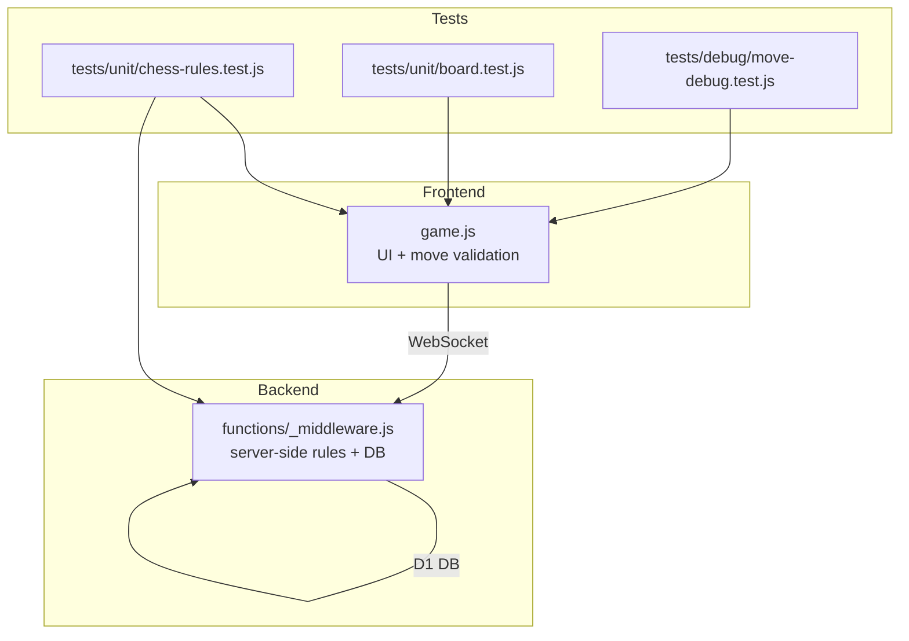
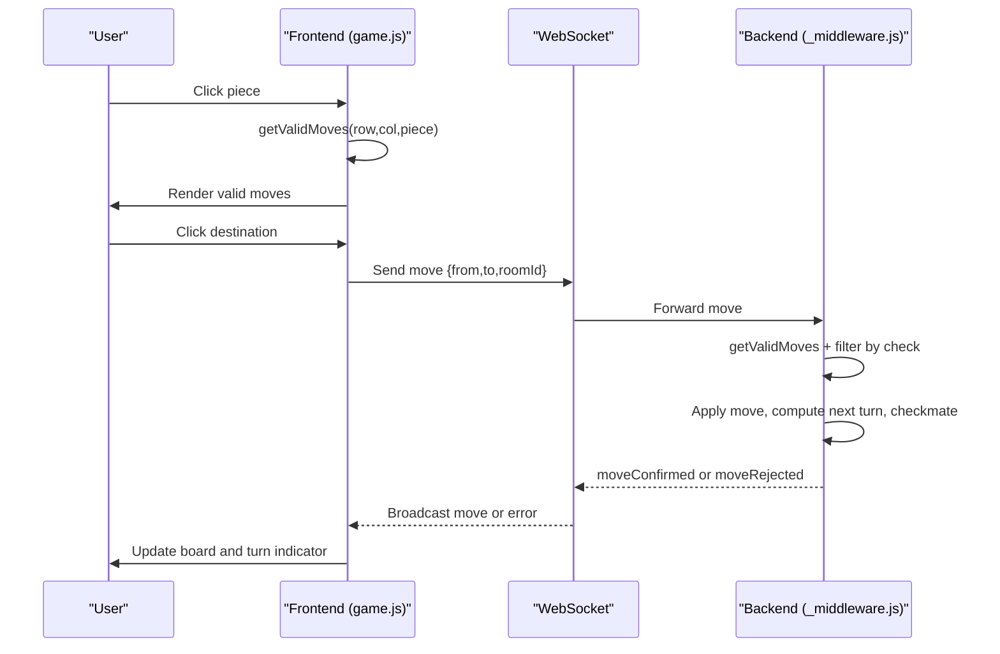
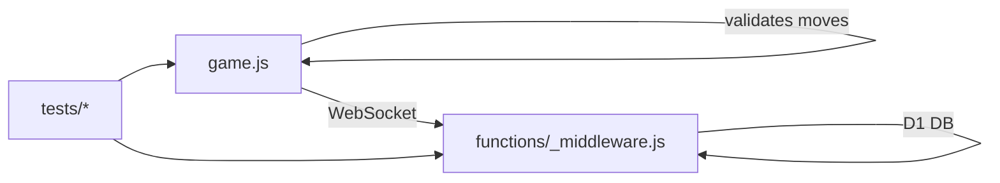

# Piece Movement Rules

<cite>
**Referenced Files in This Document**
- [game.js](file://game.js)
- [functions/_middleware.js](file://functions/_middleware.js)
- [tests/unit/chess-rules.test.js](file://tests/unit/chess-rules.test.js)
- [tests/debug/move-debug.test.js](file://tests/debug/move-debug.test.js)
- [tests/unit/board.test.js](file://tests/unit/board.test.js)
</cite>

## Table of Contents
1. [Introduction](#introduction)
2. [Project Structure](#project-structure)
3. [Core Components](#core-components)
4. [Architecture Overview](#architecture-overview)
5. [Detailed Component Analysis](#detailed-component-analysis)
6. [Dependency Analysis](#dependency-analysis)
7. [Performance Considerations](#performance-considerations)
8. [Troubleshooting Guide](#troubleshooting-guide)
9. [Conclusion](#conclusion)

## Introduction
This document explains the Chinese Chess piece movement validation logic implemented in the project. It covers the coordinate system, board boundaries, and special movement restrictions for each piece type: 將/帥 (King), 士/仕 (Advisor), 象/相 (Elephant), 馬 (Horse), 車 (Chariot), 炮/砲 (Cannon), and 卒/兵 (Soldier). It also documents the validation algorithms, position checking functions, movement filtering logic, and provides examples of valid and invalid moves with references to the actual implementation.

## Project Structure
The movement rules are implemented in two places:
- Frontend JavaScript (game.js): UI-driven validation and rendering logic for moves.
- Backend Cloudflare Pages Functions (_middleware.js): authoritative server-side validation and game state updates.

Unit tests under tests/ validate the movement rules and board state.

**Diagram sources**
- [game.js:404-428](file://game.js#L404-L428)
- [functions/_middleware.js:522-683](file://functions/_middleware.js#L522-L683)
- [tests/unit/chess-rules.test.js:1-670](file://tests/unit/chess-rules.test.js#L1-L670)
- [tests/unit/board.test.js:1-312](file://tests/unit/board.test.js#L1-L312)
- [tests/debug/move-debug.test.js:1-262](file://tests/debug/move-debug.test.js#L1-L262)

**Section sources**
- [game.js:404-428](file://game.js#L404-L428)
- [functions/_middleware.js:522-683](file://functions/_middleware.js#L522-L683)
- [tests/unit/chess-rules.test.js:1-670](file://tests/unit/chess-rules.test.js#L1-L670)
- [tests/unit/board.test.js:1-312](file://tests/unit/board.test.js#L1-L312)
- [tests/debug/move-debug.test.js:1-262](file://tests/debug/move-debug.test.js#L1-L262)

## Core Components
- Coordinate system: 10 rows (0–9) and 9 columns (0–8). Row 0 is the top (Black side), row 9 is the bottom (Red side).
- Board boundaries: All moves must stay within 0 ≤ row ≤ 9 and 0 ≤ col ≤ 8.
- Palace constraints: King and Advisor are restricted to their respective palaces:
  - Red palace: rows 7–9, cols 3–5
  - Black palace: rows 0–2, cols 3–5
- River: Between rows 4 and 5. Elephants cannot cross; Soldiers gain sideways moves after crossing.
- Movement filtering: Moves that would leave the moving player’s King in check are excluded.

Key validation functions:
- Frontend: [getValidMoves:404-424](file://game.js#L404-L424), [isValidPosition:426-428](file://game.js#L426-L428)
- Backend: [getValidMoves:755-789](file://functions/_middleware.js#L755-L789), [isValidPosition:925-949](file://functions/_middleware.js#L925-L949)

**Section sources**
- [game.js:426-428](file://game.js#L426-L428)
- [functions/_middleware.js:925-949](file://functions/_middleware.js#L925-L949)
- [tests/unit/board.test.js:273-311](file://tests/unit/board.test.js#L273-L311)

## Architecture Overview
The frontend validates moves locally for immediate feedback and renders valid moves. The backend performs authoritative validation and applies moves to persistent storage.

**Diagram sources**
- [game.js:283-317](file://game.js#L283-L317)
- [game.js:319-379](file://game.js#L319-L379)
- [functions/_middleware.js:522-683](file://functions/_middleware.js#L522-L683)

## Detailed Component Analysis

### Coordinate System and Boundaries
- Board: 10×9 grid (rows 0..9, cols 0..8).
- Palaces:
  - Red palace: rows 7–9, cols 3–5
  - Black palace: rows 0–2, cols 3–5
- River: Between rows 4 and 5 (inclusive of both sides).
- Position validity: [isValidPosition:426-428](file://game.js#L426-L428) and [isValidPosition:925-949](file://functions/_middleware.js#L925-L949) enforce bounds.

**Section sources**
- [game.js:426-428](file://game.js#L426-L428)
- [functions/_middleware.js:925-949](file://functions/_middleware.js#L925-L949)
- [tests/unit/board.test.js:273-311](file://tests/unit/board.test.js#L273-L311)

### 將/帥 (King)
Movement:
- One step orthogonally within the palace.
- Special “Flying General” rule: if the two Kings face each other directly with no intervening piece, the player can capture the opponent King by moving into the same file.

Validation highlights:
- Palace bounds enforced in [getJiangMoves:791-833](file://functions/_middleware.js#L791-L833).
- Flying General logic checks for a clear file between Kings and no blocking piece.

Examples:
- Valid: moving one step horizontally or vertically within the palace.
- Invalid: moving outside the palace or diagonally.
- Invalid: Flying General capture when blocked by a piece.

**Section sources**
- [functions/_middleware.js:791-833](file://functions/_middleware.js#L791-L833)
- [tests/unit/chess-rules.test.js:328-378](file://tests/unit/chess-rules.test.js#L328-L378)

### 士/仕 (Advisor)
Movement:
- Diagonal within the palace.

Validation highlights:
- Palace bounds enforced in [getShiMoves:835-857](file://functions/_middleware.js#L835-L857).

Examples:
- Valid: diagonal moves within the palace.
- Invalid: moving outside the palace or horizontally/vertically.

**Section sources**
- [functions/_middleware.js:835-857](file://functions/_middleware.js#L835-L857)
- [tests/unit/chess-rules.test.js:380-408](file://tests/unit/chess-rules.test.js#L380-L408)

### 象/相 (Elephant)
Movement:
- Two steps diagonally; cannot cross the river.
- Blocked if the “eye” square is occupied.

Validation highlights:
- River restriction and eye-block logic in [getXiangMoves:859-888](file://functions/_middleware.js#L859-L888).

Examples:
- Valid: diagonal move within the allowed rows for the Elephant’s color.
- Invalid: crossing the river or moving through a blocked eye.

**Section sources**
- [functions/_middleware.js:859-888](file://functions/_middleware.js#L859-L888)
- [tests/unit/chess-rules.test.js:410-443](file://tests/unit/chess-rules.test.js#L410-L443)

### 馬 (Horse)
Movement:
- L-shaped: one step orthogonal then one step perpendicular (or vice versa).
- Blocked (“Leg-Blocking”) if the square adjacent to the move is occupied.

Validation highlights:
- L-jumps and leg-block logic in [getMaMoves:890-923](file://functions/_middleware.js#L890-L923).

Examples:
- Valid: L-shaped moves with unblocked leg.
- Invalid: Horse moves with blocked leg.

**Section sources**
- [functions/_middleware.js:890-923](file://functions/_middleware.js#L890-L923)
- [tests/unit/chess-rules.test.js:445-472](file://tests/unit/chess-rules.test.js#L445-L472)

### 車 (Chariot)
Movement:
- Any number of squares orthogonally (horizontally or vertically).
- Captures by landing on an opponent piece; blocked by friendly pieces.

Validation highlights:
- Straight-line scanning in [getJuMoves:925-949](file://functions/_middleware.js#L925-L949).

Examples:
- Valid: sliding along ranks or files until blocked or capturing.
- Invalid: diagonal moves or stepping off the board.

**Section sources**
- [functions/_middleware.js:925-949](file://functions/_middleware.js#L925-L949)
- [tests/unit/chess-rules.test.js:474-515](file://tests/unit/chess-rules.test.js#L474-L515)

### 炮/砲 (Cannon)
Movement:
- Like Chariot when moving without capturing.
- Captures by jumping over exactly one piece (friendly or enemy) in the line between cannon and target.

Validation highlights:
- Jumping capture logic in [getPaoMoves:951-983](file://functions/_middleware.js#L951-L983).

Examples:
- Valid: slide without jumping; capture only when exactly one piece lies between cannon and target.
- Invalid: capture without jumping or capture with zero or more than one piece in between.

**Section sources**
- [functions/_middleware.js:951-983](file://functions/_middleware.js#L951-L983)
- [tests/unit/chess-rules.test.js:517-553](file://tests/unit/chess-rules.test.js#L517-L553)

### 卒/兵 (Soldier)
Movement:
- Forward one step until crossing the river.
- After crossing, may move sideways in addition to forward.
- Cannot move backward.

Validation highlights:
- Forward-only before river and optional sideways after river in [getZuMoves:985-1017](file://functions/_middleware.js#L985-L1017).

Examples:
- Valid: forward move before river; forward plus sideways after river.
- Invalid: backward move; sideways before crossing river.

**Section sources**
- [functions/_middleware.js:985-1017](file://functions/_middleware.js#L985-L1017)
- [tests/unit/chess-rules.test.js:555-586](file://tests/unit/chess-rules.test.js#L555-L586)

### Movement Filtering and Check Prevention
Both frontend and backend filter out moves that would leave the player’s King in check:
- Frontend: [getValidMoves:404-424](file://game.js#L404-L424) filters moves using a temporary board and [isKingInCheck:669-688](file://game.js#L669-L688).
- Backend: [getValidMoves:755-789](file://functions/_middleware.js#L755-L789) filters using [isKingInCheck:1031-1051](file://functions/_middleware.js#L1031-L1051).

This ensures no “illegal” moves are considered valid.

**Section sources**
- [game.js:404-424](file://game.js#L404-L424)
- [game.js:669-688](file://game.js#L669-L688)
- [functions/_middleware.js:755-789](file://functions/_middleware.js#L755-L789)
- [functions/_middleware.js:1031-1051](file://functions/_middleware.js#L1031-L1051)

### Validation Algorithms and Position Checking
- Position validity: [isValidPosition:426-428](file://game.js#L426-L428) and [isValidPosition:925-949](file://functions/_middleware.js#L925-L949).
- Movement generation: Piece-specific functions in both frontend and backend.
- Check detection: [isKingInCheck:1031-1051](file://functions/_middleware.js#L1031-L1051) and [isKingInCheck:669-688](file://game.js#L669-L688).

These functions are exercised by unit tests to ensure correctness.

**Section sources**
- [game.js:426-428](file://game.js#L426-L428)
- [functions/_middleware.js:925-949](file://functions/_middleware.js#L925-L949)
- [functions/_middleware.js:1031-1051](file://functions/_middleware.js#L1031-L1051)
- [tests/unit/chess-rules.test.js:588-632](file://tests/unit/chess-rules.test.js#L588-L632)

### Examples of Valid and Invalid Moves
- Red Soldier at (6,0) moving forward to (5,0) is valid; sideways before crossing is invalid.
  - Reference: [tests/debug/move-debug.test.js:129-163](file://tests/debug/move-debug.test.js#L129-L163)
- Red Chariot at (9,0) moving up to (8,0) is valid; diagonal moves are invalid.
  - Reference: [tests/debug/move-debug.test.js:166-200](file://tests/debug/move-debug.test.js#L166-L200)
- Cannon sliding horizontally without jumping is valid; capturing without a single intervening piece is invalid.
  - Reference: [tests/unit/chess-rules.test.js:517-553](file://tests/unit/chess-rules.test.js#L517-L553)
- Elephant blocked by a piece at the eye square is invalid.
  - Reference: [tests/unit/chess-rules.test.js:435-443](file://tests/unit/chess-rules.test.js#L435-L443)
- Horse with blocked leg cannot move in that direction.
  - Reference: [tests/unit/chess-rules.test.js:463-472](file://tests/unit/chess-rules.test.js#L463-L472)

**Section sources**
- [tests/debug/move-debug.test.js:129-200](file://tests/debug/move-debug.test.js#L129-L200)
- [tests/unit/chess-rules.test.js:435-472](file://tests/unit/chess-rules.test.js#L435-L472)
- [tests/unit/chess-rules.test.js:517-553](file://tests/unit/chess-rules.test.js#L517-L553)

## Dependency Analysis
- Frontend depends on backend for authoritative validation and persistence.
- Backend depends on D1 database for game state and player tracking.
- Tests depend on the movement rule implementations to validate behavior.

**Diagram sources**
- [game.js:404-424](file://game.js#L404-L424)
- [functions/_middleware.js:522-683](file://functions/_middleware.js#L522-L683)
- [tests/unit/chess-rules.test.js:1-670](file://tests/unit/chess-rules.test.js#L1-L670)
- [tests/unit/board.test.js:1-312](file://tests/unit/board.test.js#L1-L312)
- [tests/debug/move-debug.test.js:1-262](file://tests/debug/move-debug.test.js#L1-L262)

**Section sources**
- [game.js:404-424](file://game.js#L404-L424)
- [functions/_middleware.js:522-683](file://functions/_middleware.js#L522-L683)
- [tests/unit/chess-rules.test.js:1-670](file://tests/unit/chess-rules.test.js#L1-L670)
- [tests/unit/board.test.js:1-312](file://tests/unit/board.test.js#L1-L312)
- [tests/debug/move-debug.test.js:1-262](file://tests/debug/move-debug.test.js#L1-L262)

## Performance Considerations
- Movement generation is O(N) per piece where N is the number of candidate squares (bounded by board size).
- Check detection scans up to 90 squares for opponent threats; this is acceptable given small board size.
- Optimistic locking in backend prevents race conditions during concurrent moves.

[No sources needed since this section provides general guidance]

## Troubleshooting Guide
Common issues and where to look:
- Move rejected with “Invalid move”: backend move handler validates moves using [getValidMoves:755-789](file://functions/_middleware.js#L755-L789) and rejects if the destination is not among valid moves.
  - Reference: [functions/_middleware.js:576-583](file://functions/_middleware.js#L576-L583)
- Concurrent move conflict: Optimistic locking compares expected move_count; if mismatch, the move is rejected.
  - Reference: [functions/_middleware.js:619-634](file://functions/_middleware.js#L619-L634)
- Check or checkmate detection failing: verify [isKingInCheck:1031-1051](file://functions/_middleware.js#L1031-L1051) and [isCheckmateState:1066-1080](file://functions/_middleware.js#L1066-L1080).
  - Reference: [functions/_middleware.js:1031-1080](file://functions/_middleware.js#L1031-L1080)
- Frontend vs backend disagreement: ensure frontend filtering aligns with backend [getValidMoves:755-789](file://functions/_middleware.js#L755-L789).
  - Reference: [game.js:404-424](file://game.js#L404-L424)

**Section sources**
- [functions/_middleware.js:576-583](file://functions/_middleware.js#L576-L583)
- [functions/_middleware.js:619-634](file://functions/_middleware.js#L619-L634)
- [functions/_middleware.js:1031-1080](file://functions/_middleware.js#L1031-L1080)
- [game.js:404-424](file://game.js#L404-L424)

## Conclusion
The project implements robust Chinese Chess movement validation across both frontend and backend layers. The rules are consistent and tested, covering palace constraints, river crossings, special mechanics (Flying General, Horse leg-blocking, Cannon jumping), and check prevention. The tests provide concrete examples of valid and invalid moves, and the backend enforces authoritative validation with optimistic concurrency control.