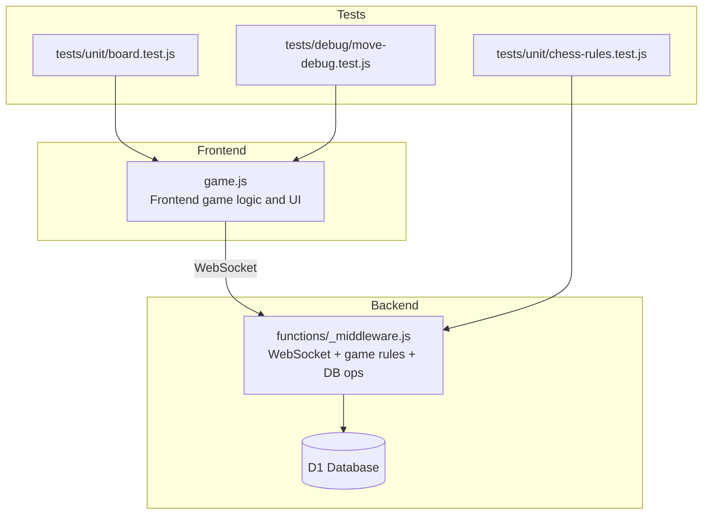
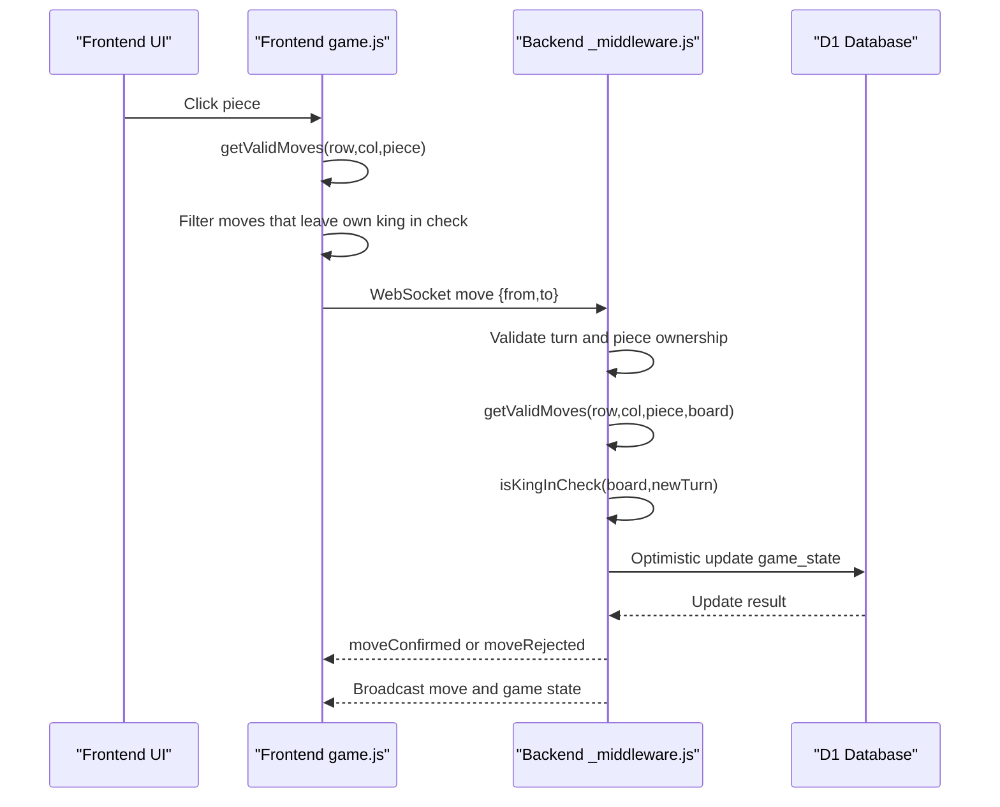
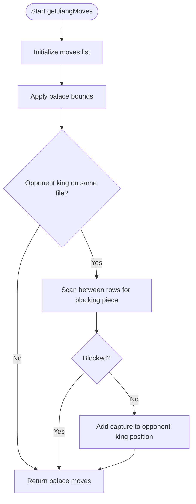
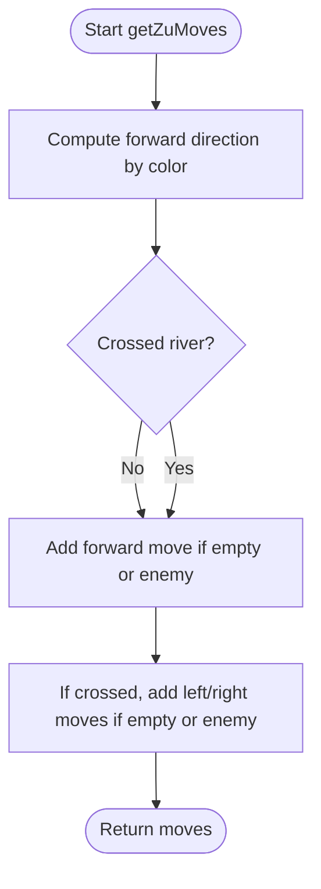
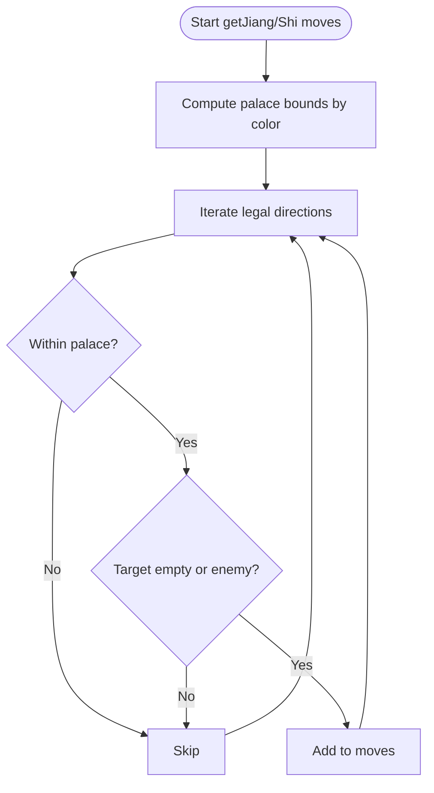
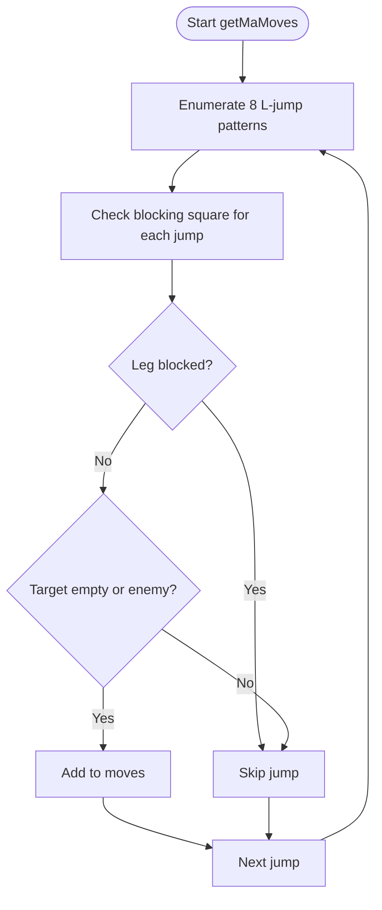
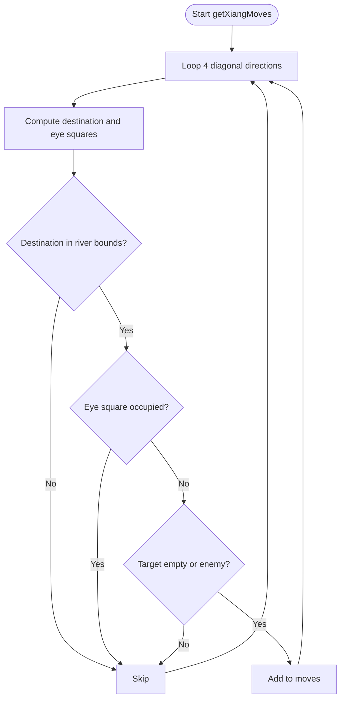
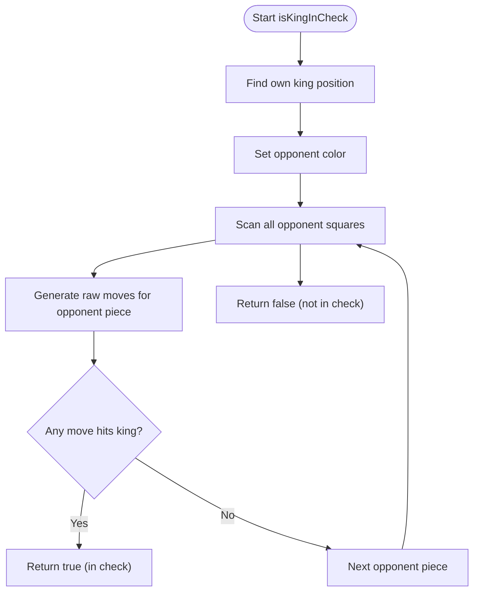
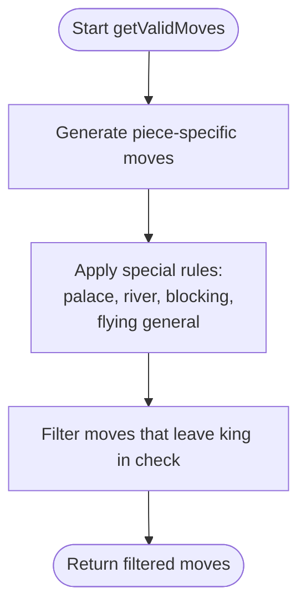
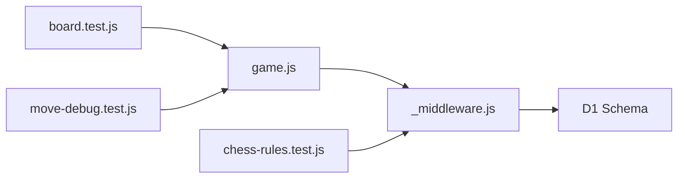

# Special Rules and Restrictions

<cite>
**Referenced Files in This Document**
- [game.js](file://game.js)
- [_middleware.js](file://functions/_middleware.js)
- [chess-rules.test.js](file://tests/unit/chess-rules.test.js)
- [board.test.js](file://tests/unit/board.test.js)
- [move-debug.test.js](file://tests/debug/move-debug.test.js)
- [README.md](file://README.md)
- [schema.sql](file://schema.sql)
</cite>

## Table of Contents
1. [Introduction](#introduction)
2. [Project Structure](#project-structure)
3. [Core Components](#core-components)
4. [Architecture Overview](#architecture-overview)
5. [Detailed Component Analysis](#detailed-component-analysis)
6. [Dependency Analysis](#dependency-analysis)
7. [Performance Considerations](#performance-considerations)
8. [Troubleshooting Guide](#troubleshooting-guide)
9. [Conclusion](#conclusion)
10. [Appendices](#appendices)

## Introduction
This document explains the Chinese Chess special rules and restrictions implemented in the project, focusing on:
- Flying general rule (將帥 cannot face each other without intervening pieces)
- River crossing mechanics for soldiers/pawns
- Piece promotion rules
- Palace movement limitations
- Blocking effects for horses (蹩馬腿)
- Elephant crossing restrictions
- Check detection algorithm
- Relationship between special rules and general movement validation

It also documents implementation details for position validation, rule enforcement, and edge case handling, with examples demonstrating rule interactions and validation outcomes.

## Project Structure
The project consists of:
- Frontend game logic and UI in a single JavaScript module
- Backend WebSocket handler and game rules in a Cloudflare Pages Functions module
- Tests validating rules and edge cases
- Database schema for persistent game state

**Diagram sources**
- [game.js:1-1319](file://game.js#L1-L1319)
- [_middleware.js:104-122](file://functions/_middleware.js#L104-L122)
- [schema.sql:1-42](file://schema.sql#L1-L42)

**Section sources**
- [README.md:1-187](file://README.md#L1-L187)
- [schema.sql:1-42](file://schema.sql#L1-L42)

## Core Components
- Frontend game controller orchestrates UI, selection, move validation, and WebSocket messaging.
- Backend WebSocket handler validates moves, enforces rules, updates state, and broadcasts events.
- Tests validate rule correctness and edge cases.

Key responsibilities:
- Position validation and board bounds checking
- Palace constraints for 將/帥 and 士/仕
- River crossing rules for 象/相 and 卒/兵
- Blocking mechanics for 馬 and 象/相
- Flying general rule enforcement
- Check and checkmate detection

**Section sources**
- [game.js:404-424](file://game.js#L404-L424)
- [_middleware.js:755-789](file://functions/_middleware.js#L755-L789)

## Architecture Overview
The frontend computes candidate moves and filters out those leaving the king in check. The backend performs authoritative validation and updates the database with optimistic locking.

**Diagram sources**
- [game.js:319-379](file://game.js#L319-L379)
- [_middleware.js:522-683](file://functions/_middleware.js#L522-L683)
- [schema.sql:15-25](file://schema.sql#L15-L25)

## Detailed Component Analysis

### Flying General Rule (將帥不能直接對面)
- Within the palace, 將/帥 moves one step horizontally or vertically.
- If two 將/帥 are aligned on the same file with no pieces between them, the side facing the opponent can capture the opposing 將/帥.
- Implementation:
  - Frontend: Detects opponent king on the same file and checks for blocking pieces between rows.
  - Backend: Same logic applied during authoritative validation.

**Diagram sources**
- [game.js:430-473](file://game.js#L430-L473)
- [_middleware.js:791-833](file://functions/_middleware.js#L791-L833)

**Section sources**
- [game.js:430-473](file://game.js#L430-L473)
- [_middleware.js:791-833](file://functions/_middleware.js#L791-L833)
- [chess-rules.test.js:360-378](file://tests/unit/chess-rules.test.js#L360-L378)

### River Crossing Mechanics for Soldiers/Pawns
- 卒/兵 move forward one step until crossing the river.
- After crossing, 卒/兵 may move sideways.
- Implementation:
  - Frontend: Calculates forward direction based on color and determines whether the river has been crossed.
  - Backend: Same logic applies during validation.

**Diagram sources**
- [game.js:623-651](file://game.js#L623-L651)
- [_middleware.js:985-1017](file://functions/_middleware.js#L985-L1017)

**Section sources**
- [game.js:623-651](file://game.js#L623-L651)
- [_middleware.js:985-1017](file://functions/_middleware.js#L985-L1017)
- [chess-rules.test.js:555-586](file://tests/unit/chess-rules.test.js#L555-L586)

### Palace Movement Limitations (將/帥 and 士/仕)
- 將/帥: One step horizontally or vertically within the palace (3x3 grid).
- 士/仕: Diagonal within the palace.
- Implementation:
  - Frontend and backend enforce palace boundaries per color.

**Diagram sources**
- [game.js:430-497](file://game.js#L430-L497)
- [_middleware.js:791-857](file://functions/_middleware.js#L791-L857)

**Section sources**
- [game.js:430-497](file://game.js#L430-L497)
- [_middleware.js:791-857](file://functions/_middleware.js#L791-L857)
- [chess-rules.test.js:328-408](file://tests/unit/chess-rules.test.js#L328-L408)

### Blocking Effects for Horses (蹩馬腿)
- 馬 moves in an L-shape and is blocked if the adjacent leg square is occupied.
- Implementation:
  - Frontend and backend compute L-jumps and check blocking squares.

**Diagram sources**
- [game.js:530-561](file://game.js#L530-L561)
- [_middleware.js:890-923](file://functions/_middleware.js#L890-L923)

**Section sources**
- [game.js:530-561](file://game.js#L530-L561)
- [_middleware.js:890-923](file://functions/_middleware.js#L890-L923)
- [chess-rules.test.js:445-472](file://tests/unit/chess-rules.test.js#L445-L472)

### Elephant Crossing Restrictions (象/相)
- 象/相 moves diagonally two steps and cannot cross the river.
- Movement is blocked if the eye square is occupied.
- Implementation:
  - Frontend and backend enforce river boundary and blocking.

**Diagram sources**
- [game.js:499-528](file://game.js#L499-L528)
- [_middleware.js:859-888](file://functions/_middleware.js#L859-L888)

**Section sources**
- [game.js:499-528](file://game.js#L499-L528)
- [_middleware.js:859-888](file://functions/_middleware.js#L859-L888)
- [chess-rules.test.js:410-443](file://tests/unit/chess-rules.test.js#L410-L443)

### Piece Promotion Rules
- 卒/兵 does not promote; it gains sideways movement after crossing the river.
- Implementation:
  - Frontend and backend compute sideways moves only after crossing.

**Section sources**
- [game.js:623-651](file://game.js#L623-L651)
- [_middleware.js:985-1017](file://functions/_middleware.js#L985-L1017)
- [README.md:109-115](file://README.md#L109-L115)

### Check Detection Algorithm
- A king is in check if any opponent piece can capture it on the next move.
- Implementation:
  - Frontend: Generates candidate moves for opponent pieces and checks if any lands on the king’s square.
  - Backend: Uses the same logic for authoritative detection.

**Diagram sources**
- [game.js:669-688](file://game.js#L669-L688)
- [_middleware.js:1031-1051](file://functions/_middleware.js#L1031-L1051)

**Section sources**
- [game.js:669-688](file://game.js#L669-L688)
- [_middleware.js:1031-1051](file://functions/_middleware.js#L1031-L1051)
- [chess-rules.test.js:588-632](file://tests/unit/chess-rules.test.js#L588-L632)

### Relationship Between Special Rules and General Movement Validation
- General movement generators compute candidate moves per piece.
- Special rules (palace, river, blocking, flying general) refine candidates.
- Final validation filters out moves that leave the player’s own king in check.

**Diagram sources**
- [game.js:404-424](file://game.js#L404-L424)
- [_middleware.js:755-789](file://functions/_middleware.js#L755-L789)

**Section sources**
- [game.js:404-424](file://game.js#L404-L424)
- [_middleware.js:755-789](file://functions/_middleware.js#L755-L789)

### Implementation Details: Position Validation and Edge Cases
- Position validation ensures moves stay within the 10-row by 9-column board.
- Edge cases handled:
  - Palaces restrict 將/帥 and 士/仕 to 3x3 grids.
  - River boundaries limit 象/相 movement.
  - Blocking prevents 馬 from jumping over adjacent pieces.
  - Flying general allows capture only when no piece blocks the file.
  - 卒/兵 cannot move backward; sideways only after crossing.

**Section sources**
- [game.js:426-428](file://game.js#L426-L428)
- [chess-rules.test.js:328-443](file://tests/unit/chess-rules.test.js#L328-L443)
- [board.test.js:273-311](file://tests/unit/board.test.js#L273-L311)

### Examples Demonstrating Rule Interactions and Validation Outcomes
- Flying general capture when unblocked:
  - 將/帥 aligned on same file with no intervening piece.
  - Outcome: Capture move included.
- Blocked flying general:
  - Intervening piece between 將/帥.
  - Outcome: No capture move.
- Horse blocked (蹩馬腿):
  - Adjacent leg square occupied.
  - Outcome: L-jump excluded.
- Elephant blocked (eye occupied):
  - Diagonal destination blocked by eye occupancy.
  - Outcome: Diagonal move excluded.
- 卒/兵 before and after river:
  - Before river: only forward.
  - After river: forward plus sideways.
  - Outcome: Different move sets depending on position.

**Section sources**
- [chess-rules.test.js:360-378](file://tests/unit/chess-rules.test.js#L360-L378)
- [chess-rules.test.js:435-442](file://tests/unit/chess-rules.test.js#L435-L442)
- [chess-rules.test.js:463-471](file://tests/unit/chess-rules.test.js#L463-L471)
- [chess-rules.test.js:571-578](file://tests/unit/chess-rules.test.js#L571-L578)

## Dependency Analysis
- Frontend depends on backend for authoritative validation and state persistence.
- Backend depends on D1 for storing rooms, game state, and players.
- Tests validate frontend and backend logic independently and together.

**Diagram sources**
- [schema.sql:5-35](file://schema.sql#L5-L35)
- [game.js:1-1319](file://game.js#L1-L1319)
- [_middleware.js:104-122](file://functions/_middleware.js#L104-L122)

**Section sources**
- [schema.sql:1-42](file://schema.sql#L1-L42)
- [README.md:1-187](file://README.md#L1-L187)

## Performance Considerations
- Move generation loops are small and bounded by board dimensions.
- Check detection scans opponent pieces; optimization could precompute opponent piece positions if needed.
- Database writes use optimistic locking to reduce contention.

## Troubleshooting Guide
Common issues and resolutions:
- Move rejected due to invalid move:
  - Cause: Candidate move not included by generator or filtered by check.
  - Resolution: Verify piece-specific generator and check filtering logic.
- Connection or heartbeat issues:
  - Cause: Network instability or timeouts.
  - Resolution: Reconnection attempts and heartbeat monitoring are built-in.
- Stale room cleanup:
  - Cause: No activity or disconnections.
  - Resolution: Backend cleans up stale rooms.

**Section sources**
- [game.js:810-836](file://game.js#L810-L836)
- [_middleware.js:191-225](file://functions/_middleware.js#L191-L225)
- [_middleware.js:479-516](file://functions/_middleware.js#L479-L516)

## Conclusion
The project implements a robust set of Chinese Chess rules with both frontend and backend enforcement. Special rules—palace constraints, river crossings, blocking mechanics, flying general capture, and check detection—are consistently enforced across the stack. Tests validate correctness and edge cases, ensuring reliable gameplay.

## Appendices

### Appendix A: Database Schema Overview
- Rooms: room metadata and player IDs
- Game state: board JSON, current turn, last move, status, move count
- Players: connection and last seen timestamps

**Section sources**
- [schema.sql:5-35](file://schema.sql#L5-L35)

### Appendix B: Example Scenarios from Tests
- Flying general capture and blocking
- Horse and elephant blocking
- 卒/兵 movement before and after river

**Section sources**
- [chess-rules.test.js:360-378](file://tests/unit/chess-rules.test.js#L360-L378)
- [chess-rules.test.js:435-442](file://tests/unit/chess-rules.test.js#L435-L442)
- [chess-rules.test.js:463-471](file://tests/unit/chess-rules.test.js#L463-L471)
- [chess-rules.test.js:555-586](file://tests/unit/chess-rules.test.js#L555-L586)