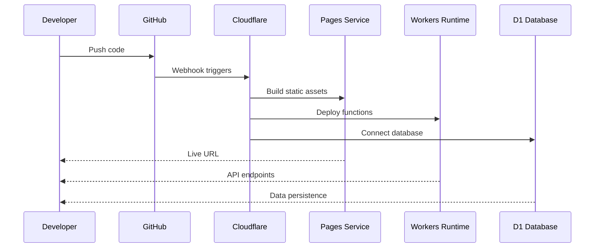

# Getting Started

<cite>
**Referenced Files in This Document**
- [README.md](file://README.md)
- [DEPLOYMENT.md](file://DEPLOYMENT.md)
- [SETUP_D1.md](file://SETUP_D1.md)
- [TROUBLESHOOTING.md](file://TROUBLESHOOTING.md)
- [scripts/local-dev-setup.sh](file://scripts/local-dev-setup.sh)
- [package.json](file://package.json)
- [wrangler.toml](file://wrangler.toml)
- [vite.config.js](file://vite.config.js)
- [functions/_middleware.js](file://functions/_middleware.js)
- [index.html](file://index.html)
- [game.js](file://game.js)
- [schema.sql](file://schema.sql)
- [tests/setup.js](file://tests/setup.js)
- [tests/unit/chess-rules.test.js](file://tests/unit/chess-rules.test.js)
</cite>

## Table of Contents
1. [Introduction](#introduction)
2. [Prerequisites](#prerequisites)
3. [Setup Options](#setup-options)
4. [Architecture Overview](#architecture-overview)
5. [Development Environments](#development-environments)
6. [Production Deployment](#production-deployment)
7. [Verification and Testing](#verification-and-testing)
8. [Troubleshooting Guide](#troubleshooting-guide)
9. [Best Practices](#best-practices)
10. [Conclusion](#conclusion)

## Introduction

Chinese Chess Online is a multiplayer Chinese Chess game built with modern web technologies that runs on Cloudflare Pages with WebSocket support for real-time multiplayer gameplay. The project combines a responsive frontend interface with a robust backend powered by Cloudflare Workers and D1 database.

The game features complete Chinese Chess rules implementation, including all piece movements (将/帥, 士/仕, 象/相, 马, 车, 炮/砲, 卒/兵), game rule validation, automatic check detection, checkmate detection, and flying general rule enforcement. Players can create or join game rooms, enjoy real-time multiplayer gameplay, and experience automatic reconnection with game state recovery.

## Prerequisites

Before setting up the Chinese Chess Online project, ensure you have the following prerequisites installed:

### Node.js and npm
- **Node.js 18 or higher**: Required for local development and build processes
- **npm**: Node package manager for dependency management

### Cloudflare Tools
- **Wrangler CLI**: Global installation required for Cloudflare deployment
- **Cloudflare Account**: Free tier available with generous limits

### Development Environment
- **Git**: For repository cloning and version control
- **Text Editor or IDE**: With JavaScript/HTML/CSS support
- **Modern Web Browser**: Latest Chrome, Edge, Firefox, or Safari for testing

**Section sources**
- [README.md:25-47](file://README.md#L25-L47)
- [scripts/local-dev-setup.sh:16-36](file://scripts/local-dev-setup.sh#L16-L36)
- [package.json:7-27](file://package.json#L7-L27)

## Setup Options

The project provides three distinct setup options to accommodate different development and deployment scenarios:

### Option 1: Local Development with Automated Script (Recommended)

The automated setup script handles all prerequisites and configurations automatically:

```bash
# Make script executable
chmod +x scripts/local-dev-setup.sh

# Run automated setup
./scripts/local-dev-setup.sh
```

The script performs the following operations:
1. **Checks Node.js version** (requires 18+)
2. **Installs npm dependencies**
3. **Verifies Wrangler CLI availability**
4. **Initializes local D1 database**
5. **Builds frontend assets**
6. **Creates necessary directories**
7. **Starts development server**

**Section sources**
- [README.md:25-47](file://README.md#L25-L47)
- [scripts/local-dev-setup.sh:1-97](file://scripts/local-dev-setup.sh#L1-L97)

### Option 2: Manual Local Development

For granular control over the setup process:

```bash
# Install dependencies
npm install

# Initialize local D1 database
npm run db:init

# Build frontend
npm run build

# Start local development server
npm run dev:local
```

**Section sources**
- [README.md:33-47](file://README.md#L33-L47)
- [package.json:14-17](file://package.json#L14-L17)

### Option 3: Frontend-Only Development

For frontend-only development without backend services:

```bash
# Install dependencies
npm install

# Start Vite development server
npm run dev
```

This option runs the frontend locally without requiring Cloudflare Workers or D1 database.

**Section sources**
- [README.md:51-61](file://README.md#L51-L61)
- [vite.config.js:5-12](file://vite.config.js#L5-L12)

## Architecture Overview

The Chinese Chess Online project follows a modern cloud-native architecture with clear separation of concerns:

```mermaid
graph TB
subgraph "Client Layer"
Browser[Web Browser]
Frontend[Frontend Application<br/>HTML/CSS/JavaScript]
end
subgraph "Cloudflare Infrastructure"
Pages[Cloudflare Pages<br/>Static Hosting]
Functions[Cloudflare Workers<br/>Functions Runtime]
D1[(Cloudflare D1)<br/>SQLite Database]
end
subgraph "Game Logic"
WS[WebSocket Handler<br/>Real-time Communication]
Rules[Chess Rules Engine<br/>Game Validation]
State[Game State Manager<br/>Room Management]
end
Browser --> Frontend
Frontend --> Pages
Pages --> Functions
Functions --> WS
Functions --> Rules
Functions --> State
Functions --> D1
WS --> Browser
State --> D1
Rules --> D1
```

**Diagram sources**
- [functions/_middleware.js:104-122](file://functions/_middleware.js#L104-L122)
- [game.js:740-800](file://game.js#L740-L800)

### Core Components

1. **Frontend Application**: Responsive HTML5/CSS3/JavaScript interface
2. **WebSocket Layer**: Real-time bidirectional communication
3. **Game Logic Engine**: Complete Chinese Chess rule implementation
4. **Database Layer**: Persistent storage via Cloudflare D1
5. **Room Management**: Multiplayer session coordination

**Section sources**
- [README.md:153-161](file://README.md#L153-L161)
- [functions/_middleware.js:46-98](file://functions/_middleware.js#L46-L98)

## Development Environments

### Local Development Environment

The local development environment provides a complete replica of the production setup:

#### Development Server Configuration
- **Port**: 8788 (default)
- **Host**: localhost
- **Hot Reload**: Enabled for rapid development
- **D1 Integration**: Local database support

#### Environment Variables
The development environment uses the following configuration:
- `pages_build_output_dir`: "public"
- `compatibility_date`: "2024-01-01"
- `database_name`: "chinachess"
- `database_id`: Generated during setup

**Section sources**
- [scripts/local-dev-setup.sh:92-93](file://scripts/local-dev-setup.sh#L92-L93)
- [wrangler.toml:7-17](file://wrangler.toml#L7-L17)
- [package.json:14](file://package.json#L14)

### Frontend-Only Development

For pure frontend development without backend dependencies:

#### Vite Configuration
- **Port**: 5173 (default)
- **Host**: true (accessible from network)
- **Output Directory**: "public"

#### Benefits
- Faster startup times
- No database requirements
- Ideal for UI/UX development
- Independent testing of frontend logic

**Section sources**
- [vite.config.js:5-12](file://vite.config.js#L5-L12)
- [README.md:51-61](file://README.md#L51-L61)

### Full-Stack Development

Full-stack development combines frontend development with backend services:

#### Features
- Real WebSocket connections
- Database integration
- Complete game logic validation
- Multiplayer room management
- Production-like environment

#### Use Cases
- Backend API testing
- Database schema validation
- WebSocket functionality verification
- End-to-end multiplayer testing

**Section sources**
- [functions/_middleware.js:131-185](file://functions/_middleware.js#L131-L185)
- [schema.sql:5-42](file://schema.sql#L5-L42)

## Production Deployment

### Cloudflare Pages Deployment

Cloudflare Pages provides seamless deployment for static assets with integrated Workers for dynamic functionality:

#### Deployment Architecture


**Diagram sources**
- [DEPLOYMENT.md:35-80](file://DEPLOYMENT.md#L35-L80)

#### Deployment Methods

##### Method 1: Cloudflare Dashboard
1. **Account Setup**: Create free Cloudflare account
2. **Repository Connection**: Connect GitHub repository
3. **Build Configuration**: Vite framework preset
4. **Automatic Deployment**: One-click deployment

##### Method 2: Wrangler CLI
```bash
# Install Wrangler globally
npm install -g wrangler

# Login to Cloudflare
wrangler login

# Create Pages project
wrangler pages project create xiaoli-chinese-chess

# Deploy
npm run build
wrangler pages deploy public --project-name=xiaoli-chinese-chess
```

**Section sources**
- [DEPLOYMENT.md:35-80](file://DEPLOYMENT.md#L35-L80)
- [README.md:62-89](file://README.md#L62-L89)

### Database Configuration

#### D1 Database Setup
```bash
# Create D1 database
wrangler d1 create chinese_chess_db

# Update wrangler.toml with database ID
# Initialize database schema
wrangler d1 execute chinese_chess_db --file=./schema.sql --remote
```

#### Database Schema
The D1 database provides three essential tables:
- **rooms**: Room metadata and status
- **game_state**: Current game board state and turn information
- **players**: Player connection and activity tracking

**Section sources**
- [SETUP_D1.md:18-74](file://SETUP_D1.md#L18-L74)
- [schema.sql:5-42](file://schema.sql#L5-L42)

## Verification and Testing

### Local Development Verification

After completing setup, verify your installation:

#### Basic Verification
1. **Open Development Server**: Navigate to `http://localhost:8788`
2. **Check Dependencies**: Ensure all npm packages are installed
3. **Database Initialization**: Verify D1 database creation
4. **Build Process**: Confirm successful frontend build

#### Testing Commands
```bash
# Run all tests
npm test

# Watch mode for development
npm run test:watch

# Coverage report
npm run test:coverage
```

**Section sources**
- [README.md:125-138](file://README.md#L125-L138)
- [tests/setup.js:1-231](file://tests/setup.js#L1-L231)

### Production Verification

#### Deployment Testing
1. **WebSocket Connectivity**: Verify real-time communication
2. **Database Access**: Confirm D1 connectivity
3. **Multiplayer Functionality**: Test room creation and joining
4. **Game State Persistence**: Validate move synchronization

#### Monitoring and Logs
- **Cloudflare Dashboard**: Monitor deployment status
- **Worker Logs**: Check for runtime errors
- **Browser Console**: Debug frontend issues

**Section sources**
- [DEPLOYMENT.md:117-124](file://DEPLOYMENT.md#L117-L124)
- [TROUBLESHOOTING.md:154-172](file://TROUBLESHOOTING.md#L154-L172)

## Troubleshooting Guide

### Common Setup Issues

#### Node.js Version Problems
**Issue**: "Node.js version too low"
**Solution**: 
```bash
# Check current version
node -v

# Install Node.js 18+ from nodejs.org
# Or use nvm for version management
```

#### Dependency Installation Failures
**Issue**: "Cannot find module" errors
**Solution**:
```bash
# Clear node_modules and reinstall
rm -rf node_modules package-lock.json
npm install

# Check npm permissions
sudo chown -R $(whoami) ~/.npm
```

#### Port Conflicts
**Issue**: Port 8788 already in use
**Solution**:
```bash
# Find process using port
lsof -i :8788

# Kill process or change port
npx wrangler pages dev public --d1=DB=chinachess --local --port 8789
```

**Section sources**
- [TROUBLESHOOTING.md:13-54](file://TROUBLESHOOTING.md#L13-L54)
- [TROUBLESHOOTING.md:34-46](file://TROUBLESHOOTING.md#L34-L46)

### Database Issues

#### D1 Database Not Found
**Issue**: "Database not configured" error
**Solution**:
1. Verify D1 database creation in Cloudflare Dashboard
2. Check `wrangler.toml` database_id configuration
3. Ensure D1 binding is configured in Pages settings

#### Schema Initialization Problems
**Issue**: Missing tables in database
**Solution**:
```bash
# Manual schema initialization
wrangler d1 execute chinese_chess_db --file=./schema.sql --remote

# Verify tables exist
wrangler d1 execute chinese_chess_db --command="SELECT name FROM sqlite_master WHERE type='table'" --remote
```

**Section sources**
- [TROUBLESHOOTING.md:58-110](file://TROUBLESHOOTING.md#L58-L110)
- [SETUP_D1.md:121-140](file://SETUP_D1.md#L121-L140)

### WebSocket and Multiplayer Issues

#### Connection Problems
**Issue**: WebSocket connection fails
**Solution**:
1. Check `_middleware.js` routing for `/ws` requests
2. Verify WebSocket upgrade headers
3. Review browser console for error details

#### Room Management Issues
**Issue**: Room not found when joining
**Solution**:
```bash
# Check database for room existence
wrangler d1 execute chinese_chess_db --command="SELECT * FROM rooms" --remote

# Verify room status and player connections
```

**Section sources**
- [TROUBLESHOOTING.md:126-153](file://TROUBLESHOOTING.md#L126-L153)
- [functions/_middleware.js:353-443](file://functions/_middleware.js#L353-L443)

### Performance and Optimization

#### Database Performance
**Issue**: Slow move synchronization
**Solution**:
1. Check D1 response times (<100ms)
2. Monitor WebSocket latency (<50ms)
3. Verify server instance health

#### Memory and Resource Usage
**Issue**: High memory consumption
**Solution**:
1. Implement proper connection cleanup
2. Monitor player disconnect handling
3. Optimize database queries

**Section sources**
- [TROUBLESHOOTING.md:237-252](file://TROUBLESHOOTING.md#L237-L252)

## Best Practices

### Development Workflow

#### Code Organization
- **Frontend**: Keep HTML/CSS/JavaScript modular
- **Backend**: Separate WebSocket handlers from game logic
- **Database**: Use prepared statements for security
- **Testing**: Maintain comprehensive test coverage

#### Security Considerations
- **Input Validation**: Always validate WebSocket messages
- **SQL Injection Prevention**: Use parameterized queries
- **Cross-Origin Requests**: Configure appropriate CORS headers
- **Error Handling**: Implement graceful error recovery

#### Performance Optimization
- **Lazy Loading**: Load resources on demand
- **Caching**: Implement appropriate caching strategies
- **Database Indexes**: Use indexes for frequently queried columns
- **Connection Pooling**: Manage WebSocket connections efficiently

### Deployment Strategies

#### Environment Separation
- **Development**: Local D1 database with minimal configuration
- **Staging**: Separate Cloudflare environment for testing
- **Production**: Full D1 database with monitoring and logging

#### Monitoring and Maintenance
- **Health Checks**: Regular system health monitoring
- **Backup Strategy**: Database backup and recovery procedures
- **Update Procedures**: Version-controlled deployment process
- **Rollback Capability**: Quick rollback to previous versions

**Section sources**
- [DEPLOYMENT.md:82-178](file://DEPLOYMENT.md#L82-L178)
- [functions/_middleware.js:46-98](file://functions/_middleware.js#L46-L98)

## Conclusion

The Chinese Chess Online project provides a comprehensive foundation for building real-time multiplayer games on modern cloud infrastructure. With its flexible setup options, robust architecture, and extensive testing capabilities, developers can quickly establish both local development environments and production deployments.

Key advantages of this setup include:
- **Complete Feature Set**: Full Chinese Chess rules implementation
- **Real-time Multiplayer**: WebSocket-based communication
- **Cloud Native**: Scalable infrastructure with automatic scaling
- **Developer Friendly**: Automated setup scripts and comprehensive documentation
- **Production Ready**: Tested deployment strategies and monitoring

Whether you're developing a simple frontend prototype or deploying a production multiplayer game, this project offers the tools and architecture needed to succeed. The modular design allows for easy extension and customization while maintaining reliability and performance.

For continued development, consider implementing additional features such as user authentication, game replay systems, ranking mechanisms, and advanced analytics to enhance the gaming experience.