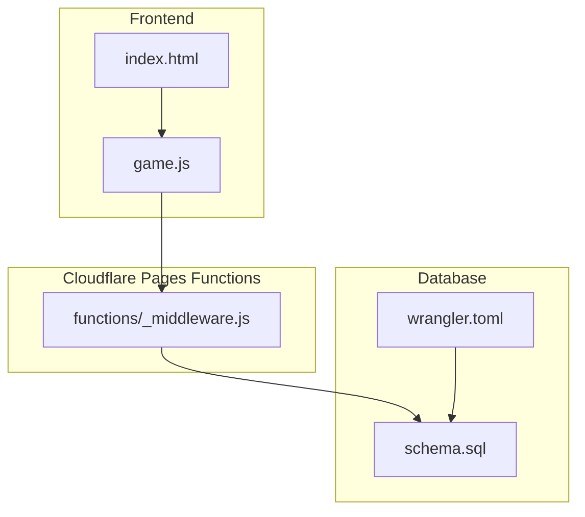
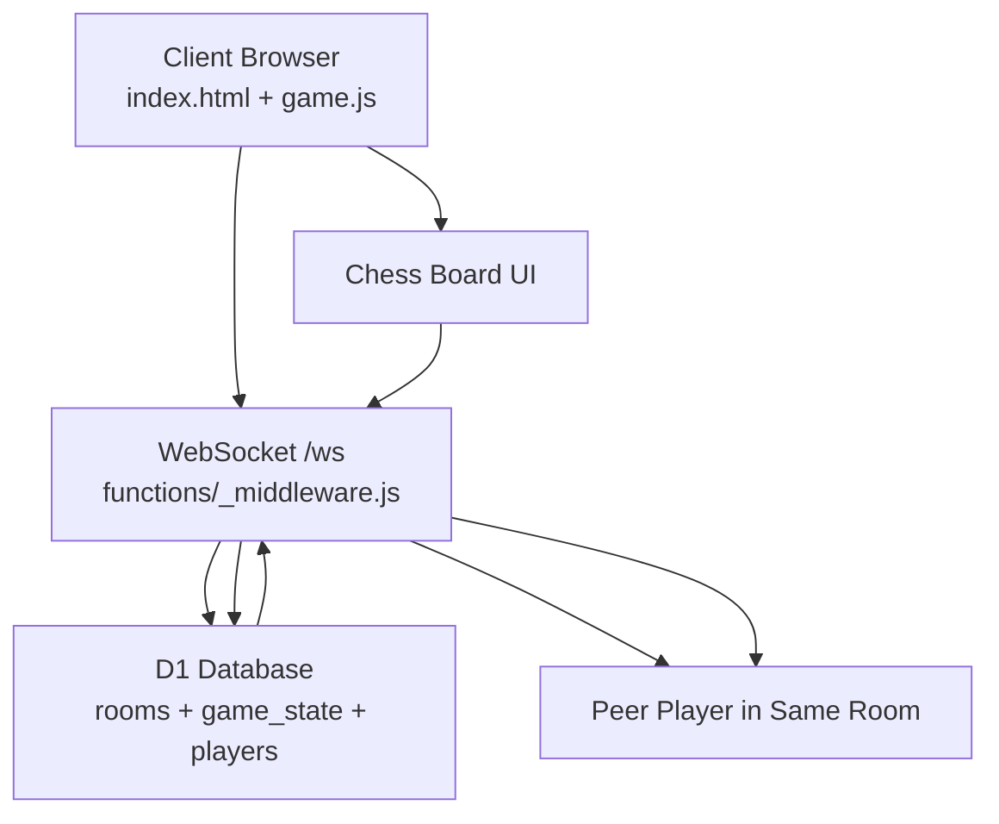
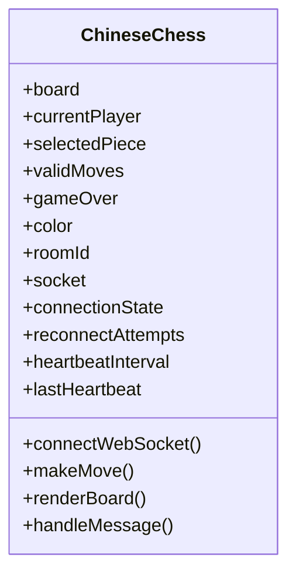
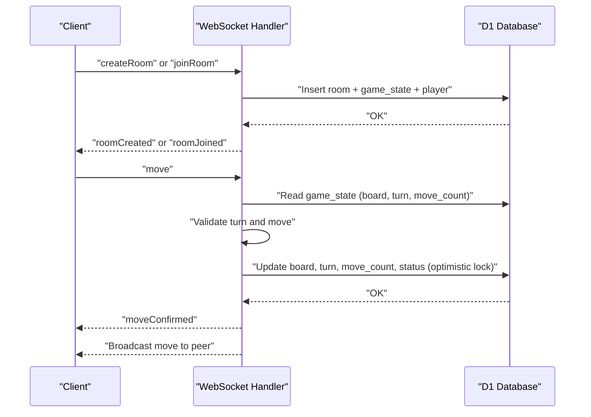
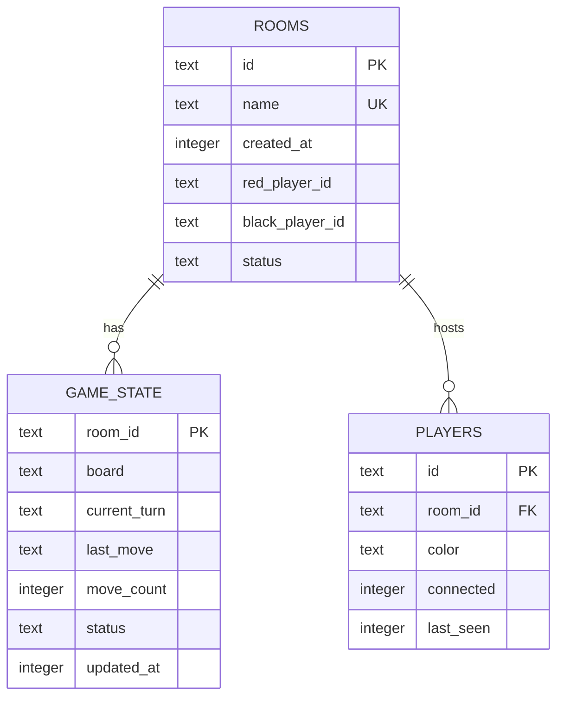
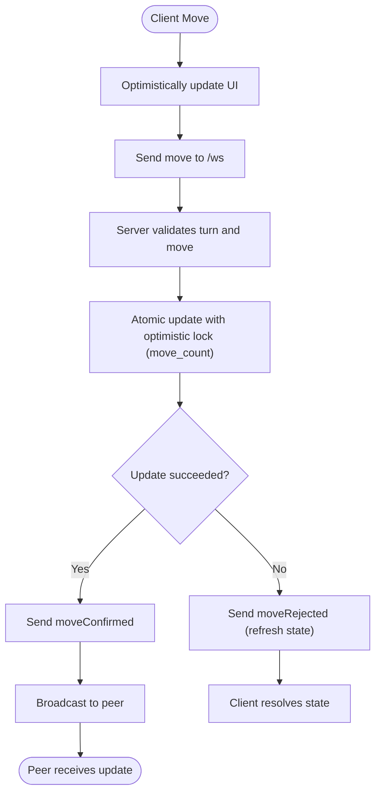
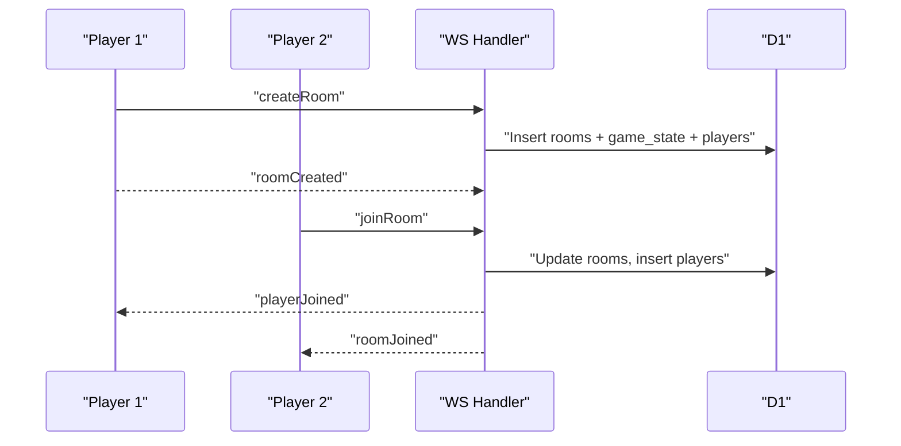
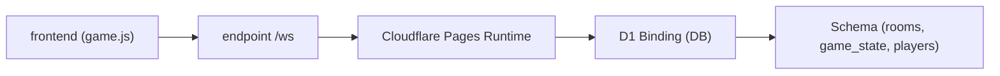

# Architecture Overview

<cite>
**Referenced Files in This Document**
- [README.md](file://README.md)
- [package.json](file://package.json)
- [wrangler.toml](file://wrangler.toml)
- [index.html](file://index.html)
- [game.js](file://game.js)
- [functions/_middleware.js](file://functions/_middleware.js)
- [schema.sql](file://schema.sql)
- [tests/integration/database.test.js](file://tests/integration/database.test.js)
</cite>

## Table of Contents
1. [Introduction](#introduction)
2. [Project Structure](#project-structure)
3. [Core Components](#core-components)
4. [Architecture Overview](#architecture-overview)
5. [Detailed Component Analysis](#detailed-component-analysis)
6. [Dependency Analysis](#dependency-analysis)
7. [Performance Considerations](#performance-considerations)
8. [Troubleshooting Guide](#troubleshooting-guide)
9. [Conclusion](#conclusion)

## Introduction
This document describes the architecture of the Chinese Chess Online system, a multiplayer game hosted on Cloudflare Pages with WebSocket real-time multiplayer support. The system comprises:
- Frontend client built with HTML5, CSS3, and vanilla JavaScript
- Cloudflare Pages Functions backend with WebSocket support
- Cloudflare D1 (SQLite) database for persistent state
- Real-time communication via WebSocket for synchronized multiplayer gameplay

Key goals:
- Provide a responsive, real-time multiplayer experience
- Maintain strong consistency for game state with optimistic UI updates and server-side validation
- Support reconnection and graceful degradation
- Scale horizontally with Cloudflare’s edge runtime

## Project Structure
The repository is organized into:
- Publicly served frontend assets under the public directory (built from index.html, style.css)
- Backend functions under functions/ (WebSocket handler and middleware)
- Database schema and initialization scripts
- Tests for integration and unit coverage

**Diagram sources**
- [index.html:1-58](file://index.html#L1-L58)
- [game.js:1-800](file://game.js#L1-L800)
- [functions/_middleware.js:104-122](file://functions/_middleware.js#L104-L122)
- [schema.sql:1-42](file://schema.sql#L1-L42)
- [wrangler.toml:14-17](file://wrangler.toml#L14-L17)

**Section sources**
- [README.md:162-175](file://README.md#L162-L175)
- [package.json:14-17](file://package.json#L14-L17)
- [wrangler.toml:10-17](file://wrangler.toml#L10-L17)

## Core Components
- Frontend client (game.js): Manages UI, local game state, move validation, WebSocket lifecycle, reconnection, and heartbeat
- Backend middleware (_middleware.js): Handles WebSocket upgrades, connection lifecycle, room management, game logic validation, broadcasting, and database operations
- Database (D1): Stores rooms, game_state, and players with indexes for performance
- Configuration (wrangler.toml): Defines Pages build output and D1 binding

Responsibilities:
- Frontend: Render board, accept user input, apply optimistic UI updates, send moves, handle reconnection
- Backend: Enforce turn order and move validity, persist state atomically, broadcast updates, manage rooms and players
- Database: Provide ACID transactions, foreign keys, and indexes for efficient queries

**Section sources**
- [game.js:4-51](file://game.js#L4-L51)
- [functions/_middleware.js:104-122](file://functions/_middleware.js#L104-L122)
- [schema.sql:5-42](file://schema.sql#L5-L42)
- [wrangler.toml:14-17](file://wrangler.toml#L14-L17)

## Architecture Overview
High-level interaction:
- The browser loads index.html and game.js
- game.js connects to /ws via WebSocket
- functions/_middleware.js accepts the WebSocket upgrade and manages per-connection state
- All game actions are validated server-side against D1-backed game_state and players
- Updates are broadcast to both players in the room

**Diagram sources**
- [index.html:10-58](file://index.html#L10-L58)
- [game.js:740-800](file://game.js#L740-L800)
- [functions/_middleware.js:131-185](file://functions/_middleware.js#L131-L185)
- [schema.sql:5-42](file://schema.sql#L5-L42)

## Detailed Component Analysis

### Frontend: game.js
- State model: Tracks board, current player, selected piece, valid moves, game over flag, player colors, room ID, move count
- WebSocket lifecycle: Connects on load, manages connection state, heartbeat, reconnection attempts, and error handling
- Optimistic UI: Applies moves locally immediately, then reconciles with server confirmation/rejection
- Move validation: Computes legal moves client-side for selection feedback; server enforces final validation
- Reconnection: Sends rejoin messages with room and color to restore state

**Diagram sources**
- [game.js:4-51](file://game.js#L4-L51)

**Section sources**
- [game.js:4-51](file://game.js#L4-L51)
- [game.js:283-398](file://game.js#L283-L398)
- [game.js:740-800](file://game.js#L740-L800)

### Backend: functions/_middleware.js
- WebSocket upgrade and per-instance connection registry
- Heartbeat management to detect idle/disconnected clients
- Room lifecycle: create, join, leave, stale cleanup
- Game logic: move validation, turn enforcement, check/checkmate detection, game over handling
- Broadcasting: notify room members of state changes
- Database operations: atomic updates with optimistic locking via move_count

**Diagram sources**
- [functions/_middleware.js:242-276](file://functions/_middleware.js#L242-L276)
- [functions/_middleware.js:522-683](file://functions/_middleware.js#L522-L683)
- [schema.sql:15-25](file://schema.sql#L15-L25)

**Section sources**
- [functions/_middleware.js:128-185](file://functions/_middleware.js#L128-L185)
- [functions/_middleware.js:231-276](file://functions/_middleware.js#L231-L276)
- [functions/_middleware.js:522-683](file://functions/_middleware.js#L522-L683)

### Database Schema and Initialization
- rooms: identifiers, name, timestamps, player IDs, and status
- game_state: serialized board, current turn, last move, move count, status, updated_at
- players: connection IDs, room references, color, connectivity, last seen
- Indexes: optimize lookups by name/status and foreign keys

**Diagram sources**
- [schema.sql:5-42](file://schema.sql#L5-L42)

**Section sources**
- [schema.sql:5-42](file://schema.sql#L5-L42)
- [functions/_middleware.js:46-98](file://functions/_middleware.js#L46-L98)

### Real-Time Communication and State Management
- Client sends moves; server validates and applies atomically
- Optimistic UI updates are corrected upon server confirmation or rejection
- Heartbeat pings/pongs keep connections alive and detect timeouts
- Reconnection uses stored room and color to restore state

**Diagram sources**
- [game.js:319-379](file://game.js#L319-L379)
- [functions/_middleware.js:619-634](file://functions/_middleware.js#L619-L634)

**Section sources**
- [game.js:319-379](file://game.js#L319-L379)
- [functions/_middleware.js:619-634](file://functions/_middleware.js#L619-L634)

### Room Management and Concurrency
- Room creation initializes board and assigns first player as red
- Joining requires availability and valid status
- Stale room cleanup prevents orphaned data
- Broadcast ensures both players receive updates

**Diagram sources**
- [functions/_middleware.js:282-351](file://functions/_middleware.js#L282-L351)
- [functions/_middleware.js:353-443](file://functions/_middleware.js#L353-L443)

**Section sources**
- [functions/_middleware.js:282-351](file://functions/_middleware.js#L282-L351)
- [functions/_middleware.js:353-443](file://functions/_middleware.js#L353-L443)

## Dependency Analysis
- Frontend depends on WebSocket endpoint (/ws) and static assets
- Backend depends on D1 binding (DB) and Cloudflare Pages runtime
- Database schema defines foreign keys and indexes for performance and referential integrity

**Diagram sources**
- [game.js:740-800](file://game.js#L740-L800)
- [functions/_middleware.js:104-122](file://functions/_middleware.js#L104-L122)
- [wrangler.toml:14-17](file://wrangler.toml#L14-L17)
- [schema.sql:5-42](file://schema.sql#L5-L42)

**Section sources**
- [package.json:14-17](file://package.json#L14-L17)
- [wrangler.toml:14-17](file://wrangler.toml#L14-L17)
- [schema.sql:5-42](file://schema.sql#L5-L42)

## Performance Considerations
- Optimistic UI reduces perceived latency; server-side validation ensures correctness
- Atomic updates with move_count provide optimistic locking to avoid race conditions
- Database indexes on frequently queried columns improve lookup performance
- Heartbeat intervals balance liveness detection with overhead
- Cloudflare’s edge runtime minimizes latency for WebSocket handling and database operations

[No sources needed since this section provides general guidance]

## Troubleshooting Guide
Common issues and remedies:
- Database not configured: Verify D1 binding in wrangler.toml and initialization logs
- Room name conflicts: Unique constraint on rooms.name; stale rooms cleaned up automatically
- Concurrent move conflicts: Optimistic lock failure triggers moveRejected; client should refresh state
- Connection drops: Heartbeat timeout closes stale connections; client reconnects with rejoin
- Stale rooms: Periodic cleanup removes rooms with no connected players and inactive players

**Section sources**
- [functions/_middleware.js:286-289](file://functions/_middleware.js#L286-L289)
- [functions/_middleware.js:304-315](file://functions/_middleware.js#L304-L315)
- [functions/_middleware.js:624-634](file://functions/_middleware.js#L624-L634)
- [functions/_middleware.js:1213-1240](file://functions/_middleware.js#L1213-L1240)
- [functions/_middleware.js:479-516](file://functions/_middleware.js#L479-L516)

## Conclusion
The Chinese Chess Online system leverages Cloudflare Pages and D1 to deliver a scalable, real-time multiplayer experience. The frontend provides responsive interactions with optimistic updates, while the backend enforces strict game logic and maintains consistency through atomic database operations and broadcasting. The architecture supports reconnection, graceful degradation, and efficient concurrency via optimistic locking and edge computing.

[No sources needed since this section summarizes without analyzing specific files]