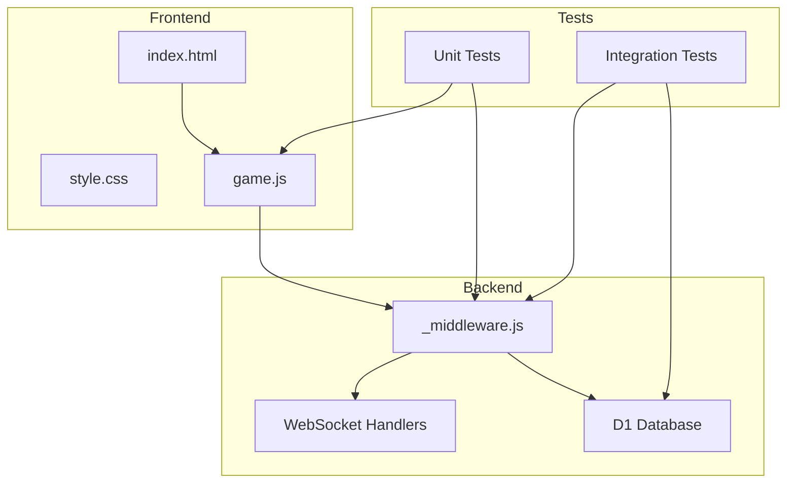
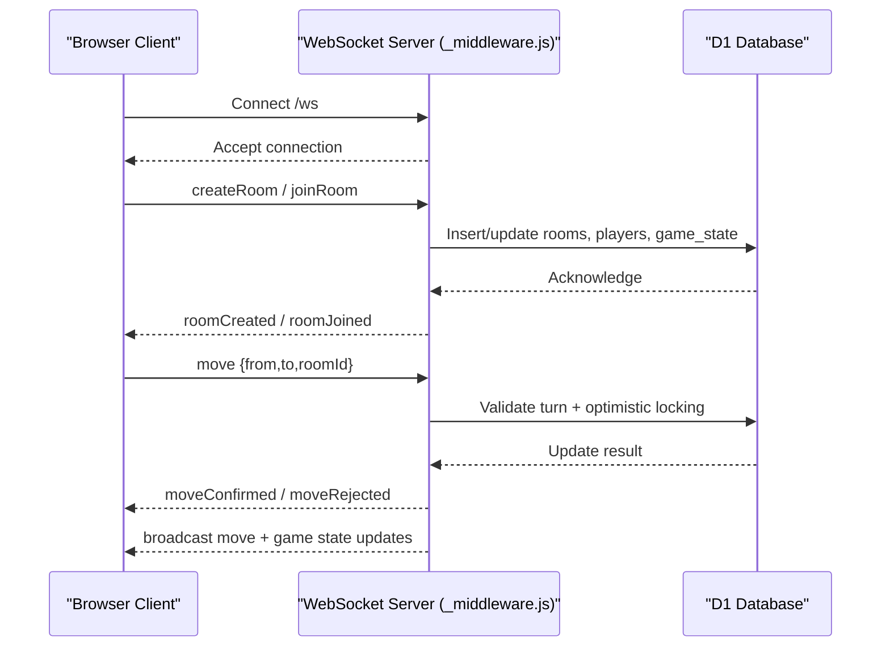
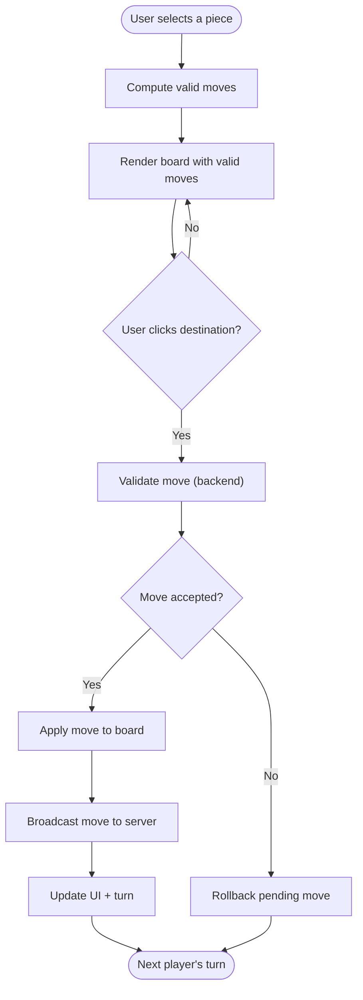
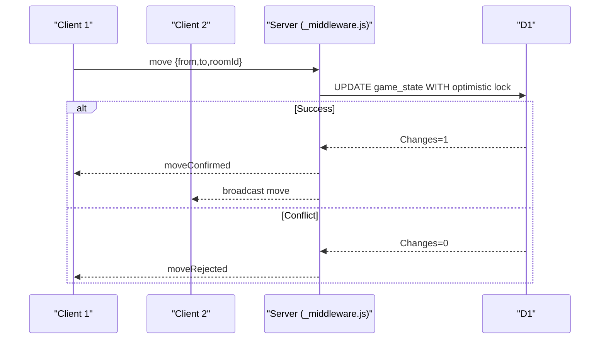
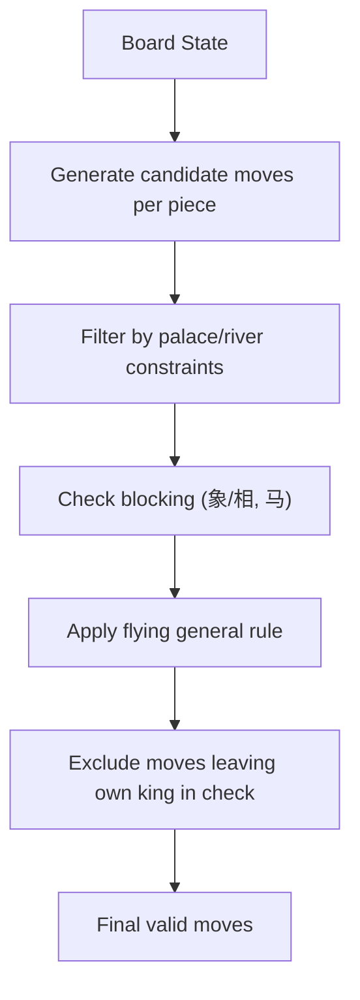
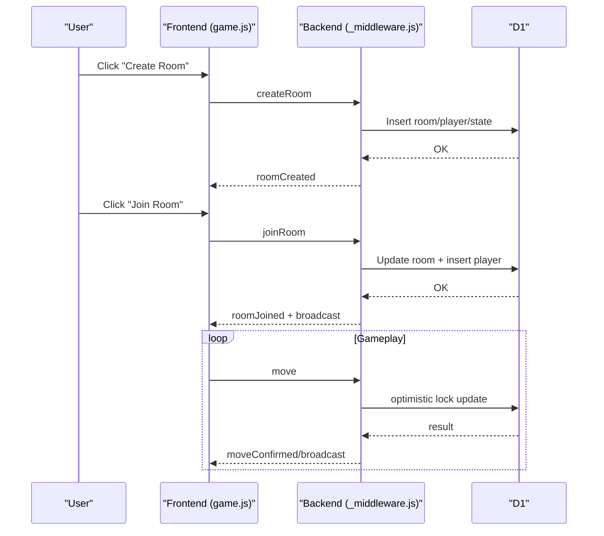
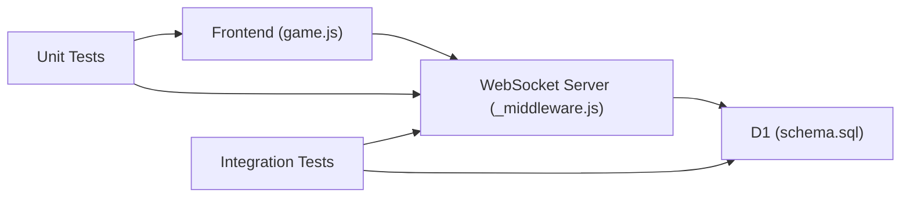

# Features and Highlights

<cite>
**Referenced Files in This Document**
- [README.md](file://README.md)
- [index.html](file://index.html)
- [style.css](file://style.css)
- [game.js](file://game.js)
- [schema.sql](file://schema.sql)
- [_middleware.js](file://functions/_middleware.js)
- [chess-rules.test.js](file://tests/unit/chess-rules.test.js)
- [board.test.js](file://tests/unit/board.test.js)
- [game-flow.test.js](file://tests/integration/game-flow.test.js)
</cite>

## Table of Contents
1. [Introduction](#introduction)
2. [Project Structure](#project-structure)
3. [Core Components](#core-components)
4. [Architecture Overview](#architecture-overview)
5. [Detailed Component Analysis](#detailed-component-analysis)
6. [Dependency Analysis](#dependency-analysis)
7. [Performance Considerations](#performance-considerations)
8. [Troubleshooting Guide](#troubleshooting-guide)
9. [Conclusion](#conclusion)

## Introduction
This document highlights the key features of the Chinese Chess Online platform, focusing on:
- Full Chinese Chess rule implementation covering all piece movements (将/帅, 士/仕, 象/相, 马, 车, 炮/砲, 卒/兵), special rules (flying general, blocking, river crossing), and game mechanics (check, checkmate detection)
- Multiplayer features including room system, real-time gameplay via WebSocket, automatic reconnection, and responsive design
- Practical examples of gameplay, UI elements, and technical innovations such as optimistic locking and heartbeat management

The platform is built with a modern stack: Cloudflare Pages for hosting, Cloudflare D1 for the database, and a lightweight frontend using HTML5, CSS3, and vanilla JavaScript. It supports both local development and production deployment.

## Project Structure
The repository is organized into frontend assets, backend functions, and tests:
- Frontend: index.html, style.css, and game.js implement the user interface and game logic
- Backend: functions/_middleware.js handles WebSocket connections, room management, move validation, and database operations
- Database: schema.sql defines the rooms, players, and game_state tables
- Tests: unit and integration tests validate rules, board logic, and end-to-end game flow

**Diagram sources**
- [index.html](file://index.html)
- [style.css](file://style.css)
- [game.js](file://game.js)
- [_middleware.js](file://functions/_middleware.js)
- [schema.sql](file://schema.sql)
- [chess-rules.test.js](file://tests/unit/chess-rules.test.js)
- [board.test.js](file://tests/unit/board.test.js)
- [game-flow.test.js](file://tests/integration/game-flow.test.js)

**Section sources**
- [README.md](file://README.md)
- [index.html](file://index.html)
- [style.css](file://style.css)
- [game.js](file://game.js)
- [_middleware.js](file://functions/_middleware.js)
- [schema.sql](file://schema.sql)

## Core Components
- Frontend game engine (game.js): Manages board rendering, piece selection, move validation, check detection, UI updates, and WebSocket communication
- Backend WebSocket service (_middleware.js): Implements room lifecycle, player matching, move validation, optimistic locking, broadcasting, and heartbeat management
- Database schema (schema.sql): Defines rooms, players, and game_state tables with indexes for performance
- Tests: Validate rules, board logic, and end-to-end game flow including concurrent move handling

Key capabilities:
- Real-time multiplayer with WebSocket messaging
- Automatic reconnection and heartbeat monitoring
- Optimistic locking to prevent concurrent move conflicts
- Responsive UI supporting desktop and mobile

**Section sources**
- [game.js](file://game.js)
- [_middleware.js](file://functions/_middleware.js)
- [schema.sql](file://schema.sql)
- [README.md](file://README.md)

## Architecture Overview
The system follows a client-server model with a WebSocket-based real-time layer and a persistent D1 database.

**Diagram sources**
- [_middleware.js](file://functions/_middleware.js)
- [schema.sql](file://schema.sql)

**Section sources**
- [_middleware.js](file://functions/_middleware.js)
- [schema.sql](file://schema.sql)

## Detailed Component Analysis

### Frontend Game Engine (game.js)
Responsibilities:
- Initialize board and UI, render pieces and valid moves
- Handle user interactions (select piece, choose destination)
- Validate moves against backend rules and show feedback
- Manage WebSocket lifecycle, heartbeat, and reconnection
- Detect and display check state and game over conditions

Highlights:
- Piece movement logic mirrors backend rules for consistency
- Optimistic UI updates with rollback capability
- Check indicator overlay and turn indicator
- Responsive layout scaling for mobile

**Diagram sources**
- [game.js](file://game.js)

**Section sources**
- [game.js](file://game.js)
- [index.html](file://index.html)
- [style.css](file://style.css)

### Backend WebSocket Service (_middleware.js)
Responsibilities:
- Manage WebSocket connections and heartbeat
- Room creation, joining, and cleanup
- Move validation and broadcasting
- Optimistic locking to prevent concurrent updates
- Game state persistence and retrieval

Key mechanisms:
- Heartbeat ping/pong to detect disconnections
- Room cleanup for stale sessions
- Optimistic locking using move_count to detect concurrent moves
- Broadcasting move updates and game events to both players

**Diagram sources**
- [_middleware.js](file://functions/_middleware.js)
- [schema.sql](file://schema.sql)

**Section sources**
- [_middleware.js](file://functions/_middleware.js)
- [schema.sql](file://schema.sql)

### Database Schema (schema.sql)
Defines three core tables:
- rooms: stores room metadata and player assignments
- players: tracks player presence and connection state
- game_state: persists board, turn, move count, and timestamps

Indexes improve query performance for room lookup, player queries, and state updates.

**Section sources**
- [schema.sql](file://schema.sql)

### Chinese Chess Rules Implementation
Both frontend and backend implement identical rule logic to ensure consistency:
- Piece movements: 将/帥, 士/仕, 象/相, 马, 车, 炮/砲, 卒/兵
- Special rules: flying general, blocking (象/相, 马), river crossing
- Game mechanics: check detection, checkmate detection, king capture win condition

**Diagram sources**
- [game.js](file://game.js)
- [_middleware.js](file://functions/_middleware.js)
- [chess-rules.test.js](file://tests/unit/chess-rules.test.js)

**Section sources**
- [game.js](file://game.js)
- [_middleware.js](file://functions/_middleware.js)
- [chess-rules.test.js](file://tests/unit/chess-rules.test.js)
- [board.test.js](file://tests/unit/board.test.js)

### Multiplayer Features
- Room system: create/join rooms, assign colors, notify opponents
- Real-time gameplay: WebSocket messages for moves, broadcasts, and game events
- Automatic reconnection: heartbeat monitoring, rejoin support, and UI feedback
- Responsive design: adaptive layouts for desktop and mobile

**Diagram sources**
- [game.js](file://game.js)
- [_middleware.js](file://functions/_middleware.js)
- [schema.sql](file://schema.sql)

**Section sources**
- [game.js](file://game.js)
- [_middleware.js](file://functions/_middleware.js)
- [schema.sql](file://schema.sql)

### Practical Examples
- Creating and joining a room: use the lobby UI to enter a room name or ID and press the respective buttons
- Making a move: click a piece to reveal valid moves (blue dots), then click a destination
- Check and checkmate: the frontend highlights the king when in check; backend detects checkmate and ends the game
- Reconnection: if the connection drops, the frontend attempts to reconnect and rejoin the room automatically

UI elements:
- Lobby screen with create/join controls and connection status
- Game board with palace lines, river text, and selectable pieces
- Turn indicator, player names/colors, and game messages

**Section sources**
- [index.html](file://index.html)
- [style.css](file://style.css)
- [game.js](file://game.js)
- [README.md](file://README.md)

## Dependency Analysis
- Frontend depends on backend WebSocket endpoints and D1 for persistence
- Backend depends on D1 for rooms, players, and game_state
- Tests depend on mocked D1 and WebSocket to validate behavior in isolation

**Diagram sources**
- [game.js](file://game.js)
- [_middleware.js](file://functions/_middleware.js)
- [schema.sql](file://schema.sql)
- [chess-rules.test.js](file://tests/unit/chess-rules.test.js)
- [board.test.js](file://tests/unit/board.test.js)
- [game-flow.test.js](file://tests/integration/game-flow.test.js)

**Section sources**
- [game.js](file://game.js)
- [_middleware.js](file://functions/_middleware.js)
- [schema.sql](file://schema.sql)
- [chess-rules.test.js](file://tests/unit/chess-rules.test.js)
- [board.test.js](file://tests/unit/board.test.js)
- [game-flow.test.js](file://tests/integration/game-flow.test.js)

## Performance Considerations
- Optimistic locking: reduces contention by allowing immediate UI updates while validating on the backend
- Heartbeat: ensures timely detection of dropped connections to minimize stale states
- Database indexing: indexes on rooms, players, and game_state improve query performance
- Lightweight frontend: minimal DOM manipulation and efficient rendering of valid moves

## Troubleshooting Guide
Common issues and remedies:
- Connection problems: verify WebSocket endpoint and heartbeat behavior; the frontend attempts reconnection and shows connection status
- Concurrent move conflicts: optimistic locking rejects conflicting moves; refresh the UI to synchronize with the authoritative state
- Stale rooms: backend cleans up rooms with no active players after a timeout
- Move validation errors: ensure the piece belongs to the current player and the move complies with all rules

**Section sources**
- [game.js](file://game.js)
- [_middleware.js](file://functions/_middleware.js)
- [game-flow.test.js](file://tests/integration/game-flow.test.js)

## Conclusion
Chinese Chess Online delivers a robust, real-time multiplayer experience with a complete rule set, responsive UI, and resilient backend. The combination of frontend validation, backend enforcement, and optimistic locking ensures a smooth and fair gaming experience across devices. Developers can extend or integrate the system using the documented APIs and schema, while casual players can enjoy intuitive controls and clear feedback during gameplay.