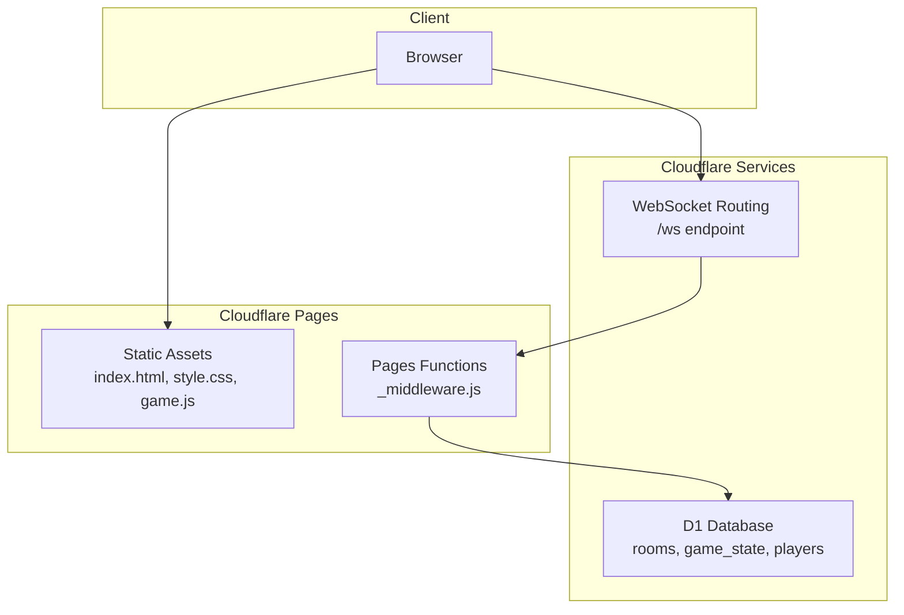

# Getting Started

<cite>
**Referenced Files in This Document**
- [README.md](file://README.md)
- [DEPLOYMENT.md](file://DEPLOYMENT.md)
- [SETUP_D1.md](file://SETUP_D1.md)
- [TROUBLESHOOTING.md](file://TROUBLESHOOTING.md)
- [scripts/local-dev-setup.sh](file://scripts/local-dev-setup.sh)
- [package.json](file://package.json)
- [wrangler.toml](file://wrangler.toml)
- [vite.config.js](file://vite.config.js)
- [schema.sql](file://schema.sql)
- [index.html](file://index.html)
- [game.js](file://game.js)
- [functions/_middleware.js](file://functions/_middleware.js)
- [vitest.config.js](file://vitest.config.js)
- [tests/setup.js](file://tests/setup.js)
</cite>

## Table of Contents
1. [Introduction](#introduction)
2. [Prerequisites](#prerequisites)
3. [Setup Options](#setup-options)
4. [Quick Start Examples](#quick-start-examples)
5. [Architecture Overview](#architecture-overview)
6. [Local Development Modes](#local-development-modes)
7. [Troubleshooting Guide](#troubleshooting-guide)
8. [Performance Considerations](#performance-considerations)
9. [Conclusion](#conclusion)

## Introduction
Chinese Chess Online is a multiplayer Chinese Chess game built to run on Cloudflare Pages with WebSocket support for real-time multiplayer gameplay. It features a complete implementation of Chinese Chess rules, responsive design, and a room-based system for playing with friends. The project supports three setup options: automated local development, manual setup, and Cloudflare deployment.

## Prerequisites
Before starting, ensure your environment meets the following requirements:
- Node.js 18+ installed
- npm (comes with Node.js)
- Wrangler CLI (required for Cloudflare deployments and local D1 development)
- Git (for cloning the repository and optional Cloudflare Pages integration)

These prerequisites are used across all setup options and are validated by the automated setup script.

**Section sources**
- [scripts/local-dev-setup.sh:16-36](file://scripts/local-dev-setup.sh#L16-L36)
- [README.md:25-47](file://README.md#L25-L47)

## Setup Options

### Option 1: Local Development (Automated Script)
The fastest way to get started locally is to use the automated setup script, which installs dependencies, initializes the local D1 database, builds the frontend, and starts the development server.

Steps:
1. Make the script executable and run it:
   - chmod +x scripts/local-dev-setup.sh
   - ./scripts/local-dev-setup.sh
2. The script performs the following actions automatically:
   - Checks Node.js and npm versions
   - Installs project dependencies
   - Initializes the local D1 database using the schema
   - Builds the frontend
   - Creates required directories for local development
3. Start the local development server:
   - npm run dev:local
4. Open your browser to http://localhost:8788

Verification:
- The development server should start without errors.
- The browser opens the game interface.
- You can create and join rooms locally.

Notes:
- The script uses Wrangler CLI for D1 initialization and local Pages development. If Wrangler is not globally installed, the script uses the project-local version.

**Section sources**
- [scripts/local-dev-setup.sh:10-97](file://scripts/local-dev-setup.sh#L10-L97)
- [README.md:25-47](file://README.md#L25-L47)
- [package.json:14](file://package.json#L14)

### Option 2: Manual Setup (Local Development)
If you prefer manual control, follow these steps to set up the project manually.

Steps:
1. Install dependencies:
   - npm install
2. Initialize the local D1 database:
   - npm run db:init
3. Build the frontend:
   - npm run build
4. Start the local development server:
   - npm run dev:local
5. Open your browser to http://localhost:8788

Alternative: Frontend-only development without backend
- To develop only the frontend without the backend:
  - npm install
  - npm run dev
  - Open your browser to http://localhost:5173

Verification:
- The development server starts successfully.
- The game loads in the browser.
- You can interact with the board and see valid moves.

**Section sources**
- [README.md:33-61](file://README.md#L33-L61)
- [package.json:8-17](file://package.json#L8-L17)
- [vite.config.js:5-12](file://vite.config.js#L5-L12)

### Option 3: Cloudflare Deployment
Deploy the project to Cloudflare Pages with WebSocket support and D1 database integration.

Steps:
1. Install Wrangler CLI globally:
   - npm install -g wrangler
2. Log in to Cloudflare:
   - wrangler login
3. Create a D1 database:
   - wrangler d1 create chinachess
4. Update wrangler.toml with your database ID:
   - Copy the database_id from the previous step and paste it into wrangler.toml under [[d1_databases]].
5. Initialize the database schema:
   - npm run db:init:remote
6. Deploy to Cloudflare Pages:
   - npm run deploy

Verification:
- The deployment completes successfully.
- Your site is live at a Cloudflare Pages URL.
- You can create rooms and play with others.

Optional: Deploy via Cloudflare Dashboard
- Connect your GitHub repository to Cloudflare Pages.
- Set the framework preset to Vite, build command to npm run build, and output directory to public.
- Save and deploy.

Production upgrade path (recommended for production):
- Use D1 for persistent storage.
- Consider Durable Objects for stateful game sessions.

**Section sources**
- [README.md:62-89](file://README.md#L62-L89)
- [DEPLOYMENT.md:35-81](file://DEPLOYMENT.md#L35-L81)
- [SETUP_D1.md:6-74](file://SETUP_D1.md#L6-L74)
- [wrangler.toml:14-33](file://wrangler.toml#L14-L33)

## Quick Start Examples

### Create a Room
1. On the lobby screen, enter a room name.
2. Click "Create Room".
3. The system assigns you as the red player and generates a room ID.

Verification:
- You see a message indicating the room was created.
- The game screen appears with your color displayed.

**Section sources**
- [README.md:93-96](file://README.md#L93-L96)
- [functions/_middleware.js:282-351](file://functions/_middleware.js#L282-L351)

### Invite Friends
1. Share the generated room ID with your friend.
2. Your friend enters the room ID on their device and clicks "Join Room".

Verification:
- Both players see each other's names and colors.
- The first move is yours (red goes first).

**Section sources**
- [README.md:93-96](file://README.md#L93-L96)
- [functions/_middleware.js:353-443](file://functions/_middleware.js#L353-L443)

### Play the First Game
1. Click a piece to select it (valid moves appear as blue dots).
2. Click a valid position to move the selected piece.
3. Take turns with your opponent until one player captures the opponent's general (将/帥) or achieves checkmate.

Verification:
- Moves synchronize in real-time.
- The turn indicator updates after each move.
- Capturing the general ends the game.

**Section sources**
- [README.md:91-97](file://README.md#L91-L97)
- [game.js:283-379](file://game.js#L283-L379)
- [functions/_middleware.js:522-683](file://functions/_middleware.js#L522-L683)

## Architecture Overview
The project consists of a static frontend served by Cloudflare Pages and a backend implemented as Cloudflare Pages Functions with WebSocket support. The backend manages rooms, game state, and real-time communication, while the frontend handles rendering and user interactions.

**Diagram sources**
- [DEPLOYMENT.md:6-22](file://DEPLOYMENT.md#L6-L22)
- [functions/_middleware.js:104-122](file://functions/_middleware.js#L104-L122)
- [schema.sql:5-42](file://schema.sql#L5-L42)

**Section sources**
- [DEPLOYMENT.md:6-22](file://DEPLOYMENT.md#L6-L22)
- [functions/_middleware.js:104-122](file://functions/_middleware.js#L104-L122)

## Local Development Modes
There are two primary local development modes:

- Automated local development with the setup script:
  - Installs dependencies, initializes D1, builds the frontend, and starts the local Pages server.
  - Accessible at http://localhost:8788.

- Frontend-only development:
  - Starts the Vite development server for the frontend only.
  - Accessible at http://localhost:5173.

Differences:
- Automated mode includes backend WebSocket handling and D1 database integration.
- Frontend-only mode does not connect to the backend and is useful for UI/UX development.

**Section sources**
- [scripts/local-dev-setup.sh:76-97](file://scripts/local-dev-setup.sh#L76-L97)
- [README.md:51-61](file://README.md#L51-L61)
- [vite.config.js:5-12](file://vite.config.js#L5-L12)

## Troubleshooting Guide

Common issues and resolutions:
- Cannot find module or dependency errors:
  - Reinstall dependencies: rm -rf node_modules package-lock.json && npm install
- Local D1 database not working:
  - Reinitialize the local database: rm -rf .wrangler/state && npm run db:init
- Port 8788 already in use:
  - Kill the process using the port or change the port: npx wrangler pages dev public --d1=DB=chinachess --local --port 8789
- Database not configured:
  - Ensure the D1 database is created and the database_id is present in wrangler.toml.
- Room not found when joining:
  - Verify the room exists and the database is accessible.
- WebSocket connection fails:
  - Check browser console for errors and ensure the backend is deployed and reachable.

Diagnostic checklist:
- D1 database created in Cloudflare Dashboard
- Database ID copied to wrangler.toml
- D1 binding configured in Pages settings
- Tables exist (rooms, game_state, players)
- Project deployed successfully
- Browser console shows WebSocket connected
- No errors in Cloudflare Functions logs

**Section sources**
- [TROUBLESHOOTING.md:13-252](file://TROUBLESHOOTING.md#L13-L252)
- [SETUP_D1.md:121-152](file://SETUP_D1.md#L121-L152)

## Performance Considerations
- Database writes: ~10-50ms
- WebSocket broadcast: <5ms
- Total latency: <100ms for move synchronization

Recommendations:
- Keep the D1 database in the same region as your users for lower latency.
- Monitor Cloudflare Dashboard analytics and logs for performance insights.
- Use the free tier initially; upgrade as usage grows.

**Section sources**
- [SETUP_D1.md:115-120](file://SETUP_D1.md#L115-L120)
- [DEPLOYMENT.md:164-169](file://DEPLOYMENT.md#L164-L169)

## Conclusion
You now have multiple pathways to set up and run Chinese Chess Online:
- Use the automated script for a quick local environment.
- Follow manual steps for granular control.
- Deploy to Cloudflare Pages for production with D1 and WebSocket support.

For ongoing development, leverage the testing suite and refer to the troubleshooting guide for common issues. Enjoy playing Chinese Chess with friends!