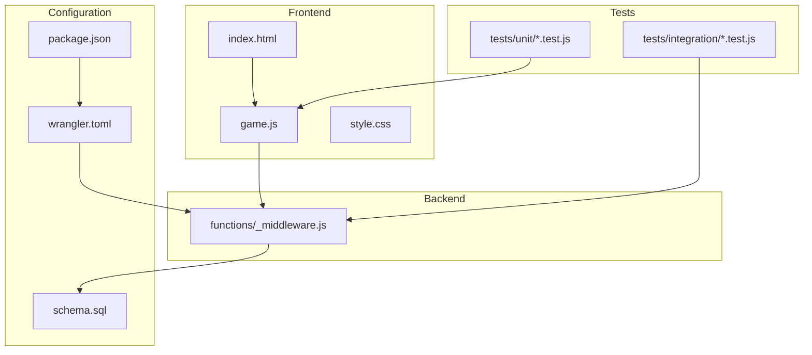
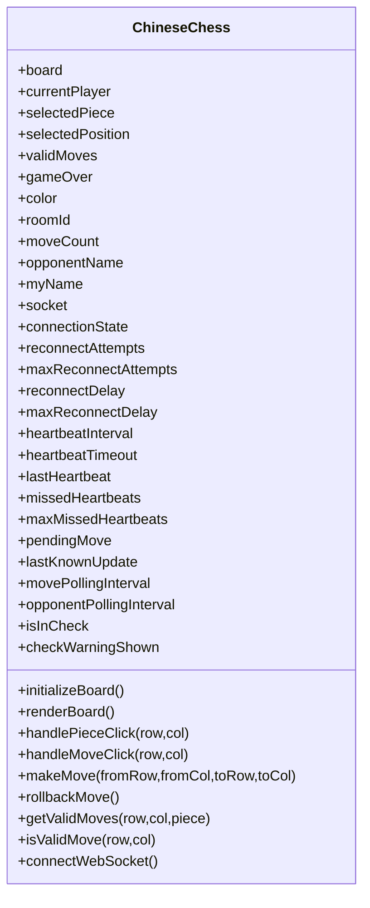
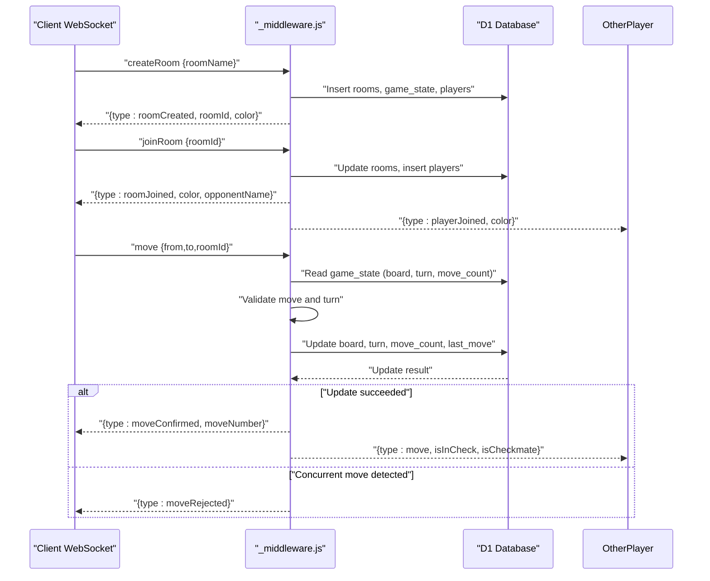
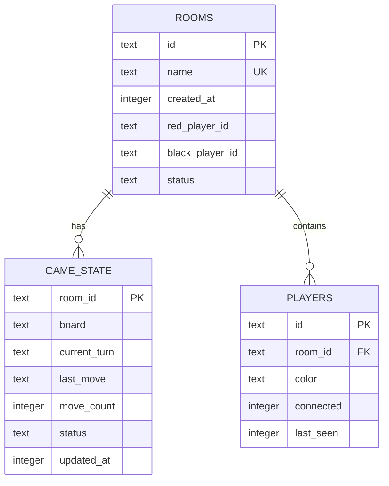
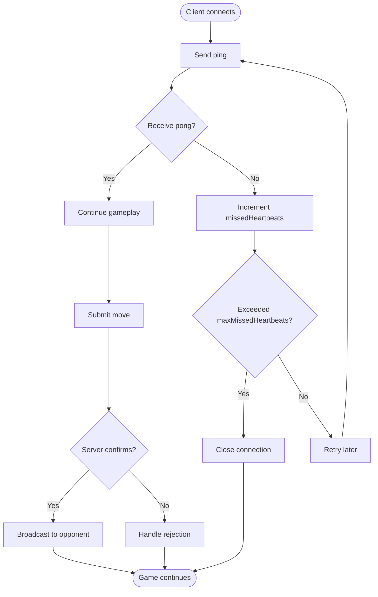
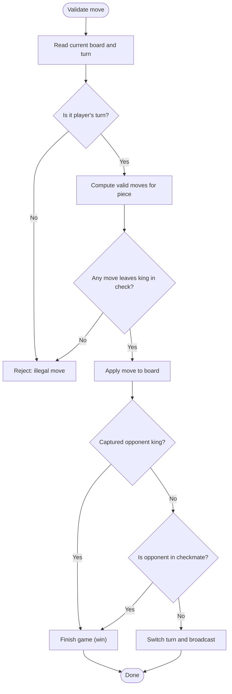
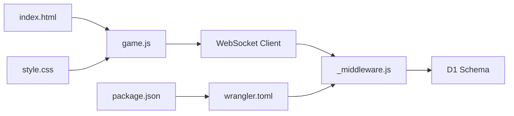

# Project Overview

<cite>
**Referenced Files in This Document**
- [README.md](file://README.md)
- [index.html](file://index.html)
- [game.js](file://game.js)
- [style.css](file://style.css)
- [functions/_middleware.js](file://functions/_middleware.js)
- [schema.sql](file://schema.sql)
- [wrangler.toml](file://wrangler.toml)
- [package.json](file://package.json)
- [tests/unit/chess-rules.test.js](file://tests/unit/chess-rules.test.js)
- [tests/integration/websocket.test.js](file://tests/integration/websocket.test.js)
- [DEPLOYMENT.md](file://DEPLOYMENT.md)
</cite>

## Table of Contents
1. [Introduction](#introduction)
2. [Project Structure](#project-structure)
3. [Core Components](#core-components)
4. [Architecture Overview](#architecture-overview)
5. [Detailed Component Analysis](#detailed-component-analysis)
6. [Dependency Analysis](#dependency-analysis)
7. [Performance Considerations](#performance-considerations)
8. [Troubleshooting Guide](#troubleshooting-guide)
9. [Conclusion](#conclusion)
10. [Appendices](#appendices)

## Introduction
Chinese Chess Online is a multiplayer Chinese Chess game hosted on Cloudflare Pages with real-time multiplayer gameplay powered by Cloudflare Pages Functions and WebSockets. It implements a complete set of Chinese Chess rules, including piece movements, check detection, checkmate detection, and the flying general rule. Players can create or join rooms, play in real time, reconnect automatically, and enjoy a responsive design that works on desktop and mobile devices.

The project emphasizes:
- Full Chinese Chess rule implementation
- Real-time multiplayer gameplay via WebSockets
- Room-based matchmaking and state synchronization
- Reconnection support with heartbeat and optimistic move conflict resolution
- Responsive UI built with HTML5, CSS3, and vanilla JavaScript
- Edge-native hosting with Cloudflare Pages and D1 database

## Project Structure
The repository is organized into frontend assets, backend functions, and supporting configuration and tests:
- Frontend: index.html, game.js, style.css
- Backend: functions/_middleware.js (routing and WebSocket handler)
- Database: schema.sql (D1 schema)
- Configuration: wrangler.toml, package.json
- Tests: unit and integration suites under tests/



**Diagram sources**
- [index.html:1-58](file://index.html#L1-L58)
- [game.js:1-800](file://game.js#L1-L800)
- [functions/_middleware.js:104-122](file://functions/_middleware.js#L104-L122)
- [schema.sql:1-42](file://schema.sql#L1-L42)
- [wrangler.toml:1-33](file://wrangler.toml#L1-L33)
- [package.json:1-28](file://package.json#L1-L28)

**Section sources**
- [README.md:162-175](file://README.md#L162-L175)
- [index.html:1-58](file://index.html#L1-L58)
- [functions/_middleware.js:104-122](file://functions/_middleware.js#L104-L122)
- [schema.sql:1-42](file://schema.sql#L1-L42)
- [wrangler.toml:1-33](file://wrangler.toml#L1-L33)
- [package.json:1-28](file://package.json#L1-L28)

## Core Components
- Frontend game engine (game.js): Implements the board, piece movement rules, UI rendering, turn logic, check detection, checkmate detection, and WebSocket client with heartbeat and reconnection.
- Backend WebSocket handler (_middleware.js): Manages WebSocket upgrades, routes messages, maintains per-connection state, handles room lifecycle, validates moves, and persists state to D1.
- Database schema (schema.sql): Defines rooms, game_state, and players tables with indexes for performance.
- Configuration (wrangler.toml): Binds D1 database and configures Pages output directory.
- UI shell (index.html + style.css): Provides lobby and game screens, responsive layout, and interactive controls.

Key features:
- Full Chinese Chess rules: piece-specific movement logic, palace constraints, river crossing rules, cannon jumping, and flying general rule.
- Real-time multiplayer: bidirectional WebSocket messaging for room actions, moves, and heartbeats.
- Room system: create/join with unique identifiers, color assignment, and broadcast notifications.
- Reconnection: heartbeat monitoring, automatic rejoin, and optimistic move conflict resolution.
- Responsive design: adaptive board sizing and touch-friendly controls.

**Section sources**
- [README.md:6-22](file://README.md#L6-L22)
- [README.md:105-122](file://README.md#L105-L122)
- [game.js:404-734](file://game.js#L404-L734)
- [functions/_middleware.js:242-276](file://functions/_middleware.js#L242-L276)
- [schema.sql:5-42](file://schema.sql#L5-L42)
- [index.html:10-58](file://index.html#L10-L58)
- [style.css:175-372](file://style.css#L175-L372)

## Architecture Overview
The system uses Cloudflare Pages for static hosting and Cloudflare Pages Functions for dynamic WebSocket handling and game state persistence via D1.

```mermaid
graph TB
Browser["Browser<br/>index.html + game.js + style.css"]
Pages["Cloudflare Pages<br/>Static Assets"]
Funcs["Cloudflare Pages Functions<br/>_middleware.js"]
D1DB["Cloudflare D1<br/>SQLite"]
Browser --> Pages
Browser --> Funcs
Funcs --> D1DB
Browser <- --> Funcs
```

**Diagram sources**
- [DEPLOYMENT.md:8-21](file://DEPLOYMENT.md#L8-L21)
- [functions/_middleware.js:104-122](file://functions/_middleware.js#L104-L122)
- [schema.sql:1-42](file://schema.sql#L1-L42)

## Detailed Component Analysis

### Frontend Game Engine (game.js)
Responsibilities:
- Initialize board and UI, render chess board and pieces
- Handle user interactions: piece selection, move validation, and move submission
- Manage WebSocket lifecycle: connection, heartbeat, reconnection, and rejoin
- Render game state: turn indicators, check warnings, and game messages
- Validate moves locally against Chinese Chess rules and optimistic UI updates

Key mechanisms:
- Board representation: 10×9 grid with piece objects
- Move validation: per-piece movement rules plus check-filtering
- WebSocket client: ping/pong heartbeat, reconnection attempts, and rejoin on reconnect
- Optimistic UI updates: immediate rendering followed by server confirmation/rejection



**Diagram sources**
- [game.js:4-51](file://game.js#L4-L51)
- [game.js:57-97](file://game.js#L57-L97)
- [game.js:150-187](file://game.js#L150-L187)
- [game.js:283-398](file://game.js#L283-L398)
- [game.js:404-734](file://game.js#L404-L734)
- [game.js:740-800](file://game.js#L740-L800)

**Section sources**
- [game.js:4-51](file://game.js#L4-L51)
- [game.js:57-97](file://game.js#L57-L97)
- [game.js:150-187](file://game.js#L150-L187)
- [game.js:283-398](file://game.js#L283-L398)
- [game.js:404-734](file://game.js#L404-L734)
- [game.js:740-800](file://game.js#L740-L800)

### Backend WebSocket Handler (_middleware.js)
Responsibilities:
- Route HTTP requests; accept WebSocket upgrades on /ws
- Maintain per-connection state and heartbeat timers
- Handle message types: createRoom, joinRoom, leaveRoom, move, ping, rejoin, resign, etc.
- Validate moves against game rules and enforce turn order
- Persist game state to D1 with optimistic locking
- Broadcast updates to room participants



**Diagram sources**
- [functions/_middleware.js:242-276](file://functions/_middleware.js#L242-L276)
- [functions/_middleware.js:522-683](file://functions/_middleware.js#L522-L683)
- [schema.sql:5-42](file://schema.sql#L5-L42)

**Section sources**
- [functions/_middleware.js:104-122](file://functions/_middleware.js#L104-L122)
- [functions/_middleware.js:131-185](file://functions/_middleware.js#L131-L185)
- [functions/_middleware.js:231-276](file://functions/_middleware.js#L231-L276)
- [functions/_middleware.js:522-683](file://functions/_middleware.js#L522-L683)

### Database Schema (schema.sql)
Tables and relationships:
- rooms: stores room metadata and status
- game_state: stores board state, turn, move count, last move, and timestamps
- players: tracks player connections and last seen timestamps

Indexes improve query performance for room name/status, player room association, and state updates.



**Diagram sources**
- [schema.sql:5-42](file://schema.sql#L5-L42)

**Section sources**
- [schema.sql:5-42](file://schema.sql#L5-L42)

### UI Shell (index.html + style.css)
- index.html: Provides lobby screen with room creation and joining, and game screen with header, chess board container, and game messages.
- style.css: Responsive layout, board rendering with palace and river visuals, piece styles, and animations for selected pieces and valid moves.

Practical example paths:
- [index.html:13-30](file://index.html#L13-L30) — Lobby screen elements
- [index.html:33-52](file://index.html#L33-L52) — Game screen elements
- [style.css:175-222](file://style.css#L175-L222) — Board lines and palace diagonals
- [style.css:224-279](file://style.css#L224-L279) — Piece and valid move styles

**Section sources**
- [index.html:13-52](file://index.html#L13-L52)
- [style.css:175-279](file://style.css#L175-L279)

### WebSocket-Based Real-Time Communication
Highlights:
- Heartbeat: periodic ping/pong to detect disconnections
- Reconnection: exponential backoff with max attempts and delays
- Rejoin: upon reconnect, client sends rejoin with room and color to restore state
- Move conflict resolution: optimistic locking via move_count prevents simultaneous moves from overwriting each other



**Diagram sources**
- [game.js:740-800](file://game.js#L740-L800)
- [functions/_middleware.js:191-225](file://functions/_middleware.js#L191-L225)
- [functions/_middleware.js:619-634](file://functions/_middleware.js#L619-L634)

**Section sources**
- [game.js:740-800](file://game.js#L740-L800)
- [functions/_middleware.js:191-225](file://functions/_middleware.js#L191-L225)
- [functions/_middleware.js:619-634](file://functions/_middleware.js#L619-L634)

### Chinese Chess Rules Implementation
The project implements full rule sets:
- Piece movements: jiang (king), shi (advisor), xiang (elephant), ma (horse), ju (chariot), pao (cannon), zu (pawn)
- Palace constraints and river crossing rules
- Cannon jumping requirement for captures
- Flying general rule enforcement
- Check and checkmate detection



**Diagram sources**
- [game.js:404-734](file://game.js#L404-L734)
- [functions/_middleware.js:755-789](file://functions/_middleware.js#L755-L789)
- [functions/_middleware.js:522-683](file://functions/_middleware.js#L522-L683)

**Section sources**
- [game.js:404-734](file://game.js#L404-L734)
- [functions/_middleware.js:755-789](file://functions/_middleware.js#L755-L789)
- [functions/_middleware.js:522-683](file://functions/_middleware.js#L522-L683)

## Dependency Analysis
- Frontend depends on:
  - game.js for logic and WebSocket client
  - index.html for DOM structure
  - style.css for rendering
- Backend depends on:
  - functions/_middleware.js for routing and WebSocket handling
  - schema.sql for D1 schema
  - wrangler.toml for D1 binding and Pages configuration
- Tests depend on:
  - unit tests for rule validation
  - integration tests for WebSocket behavior



**Diagram sources**
- [index.html:1-58](file://index.html#L1-L58)
- [game.js:1-800](file://game.js#L1-L800)
- [functions/_middleware.js:104-122](file://functions/_middleware.js#L104-L122)
- [schema.sql:1-42](file://schema.sql#L1-L42)
- [wrangler.toml:1-33](file://wrangler.toml#L1-L33)
- [package.json:1-28](file://package.json#L1-L28)

**Section sources**
- [package.json:1-28](file://package.json#L1-L28)
- [wrangler.toml:1-33](file://wrangler.toml#L1-L33)
- [functions/_middleware.js:104-122](file://functions/_middleware.js#L104-L122)
- [schema.sql:1-42](file://schema.sql#L1-L42)

## Performance Considerations
- Optimistic locking: move_count field ensures only the latest move is applied, preventing race conditions during concurrent moves.
- Database indexing: indexes on rooms(name), rooms(status), players(room_id), and game_state(updated_at) improve query performance.
- Heartbeat intervals: 30-second ping cycles with 90-second timeout balance reliability and overhead.
- Frontend rendering: minimal DOM updates by re-rendering the board and highlighting valid moves efficiently.

[No sources needed since this section provides general guidance]

## Troubleshooting Guide
Common issues and resolutions:
- WebSocket connection fails:
  - Verify /ws route is handled by _middleware.js and upgrade headers are correct.
  - Check browser console for WebSocket errors.
- Build fails:
  - Ensure dependencies in package.json are installed.
  - Confirm Vite build output directory is public.
- Rooms not working:
  - Confirm WebSocket connections are accepted and routed to _middleware.js.
  - Check that D1 binding is configured in wrangler.toml.
- Database initialization:
  - Ensure D1 schema is executed and tables exist.

**Section sources**
- [DEPLOYMENT.md:127-141](file://DEPLOYMENT.md#L127-L141)
- [wrangler.toml:13-17](file://wrangler.toml#L13-L17)
- [functions/_middleware.js:46-98](file://functions/_middleware.js#L46-L98)

## Conclusion
Chinese Chess Online delivers a complete, real-time multiplayer experience on the edge. Its architecture leverages Cloudflare Pages for static hosting, Pages Functions for WebSocket-driven real-time gameplay, and D1 for lightweight persistence. The frontend implements robust Chinese Chess rules, while the backend enforces turn order, detects check/checkmate, and resolves concurrent move conflicts. With responsive design and reconnection support, it offers a smooth, reliable gaming experience across devices.

[No sources needed since this section summarizes without analyzing specific files]

## Appendices

### Practical Examples

- Creating a room:
  - Client sends createRoom with a room name.
  - Backend creates rooms, game_state, and players entries.
  - Client receives roomCreated with roomId and color assignment.

- Joining a room:
  - Client sends joinRoom with room ID or name.
  - Backend assigns color, updates room status, and notifies both players.

- Making a move:
  - Client selects a piece and clicks a valid destination.
  - Client sends move; backend validates turn and legality.
  - Backend applies move with optimistic locking and broadcasts to opponent.

- Reconnection:
  - Client reconnects and sends rejoin with roomId and color.
  - Backend restores game state and resumes play.

**Section sources**
- [functions/_middleware.js:242-276](file://functions/_middleware.js#L242-L276)
- [functions/_middleware.js:522-683](file://functions/_middleware.js#L522-L683)
- [game.js:740-800](file://game.js#L740-L800)

### Testing Highlights
- Unit tests validate piece movement rules and check detection.
- Integration tests simulate WebSocket messages, room actions, and heartbeat behavior.

**Section sources**
- [tests/unit/chess-rules.test.js:1-670](file://tests/unit/chess-rules.test.js#L1-L670)
- [tests/integration/websocket.test.js:1-404](file://tests/integration/websocket.test.js#L1-L404)