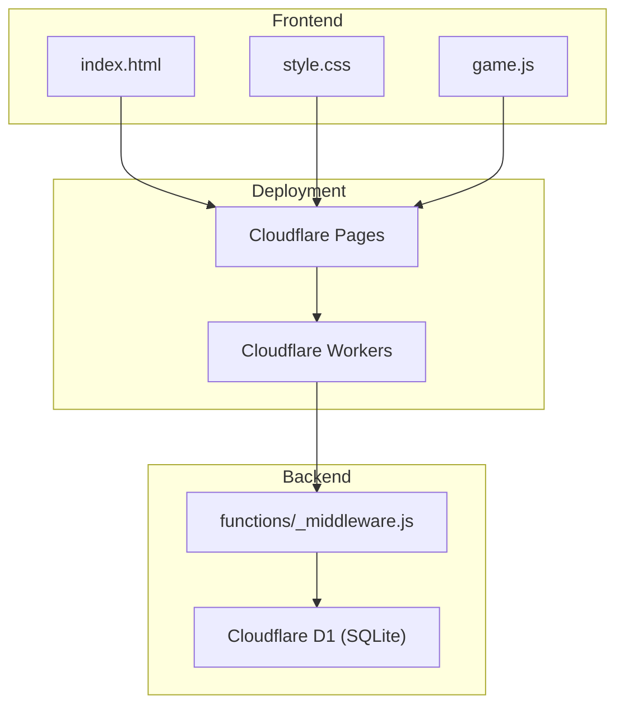
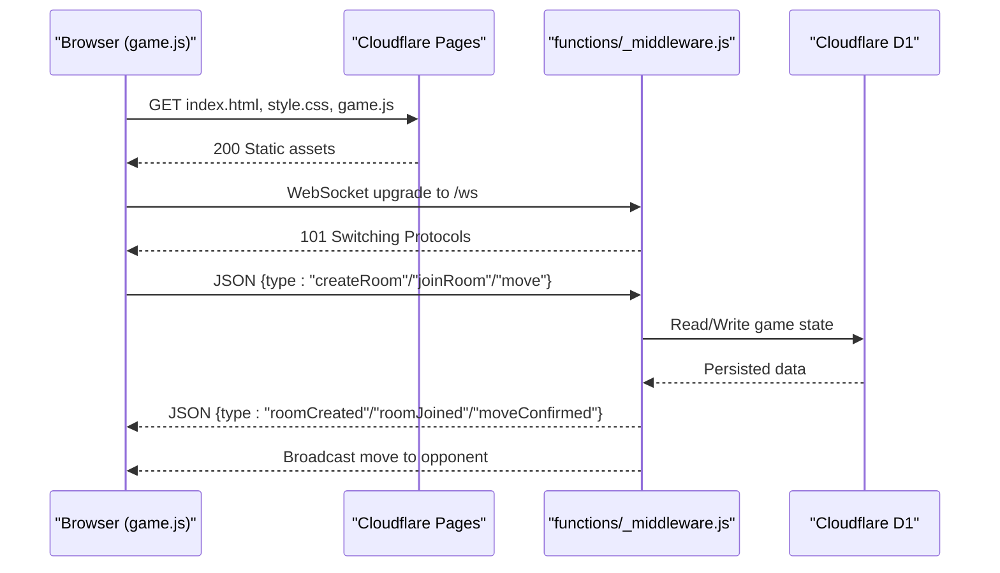
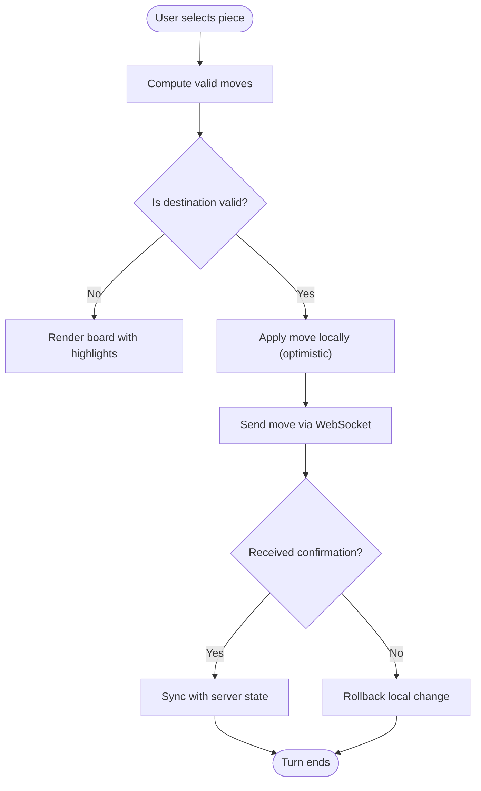
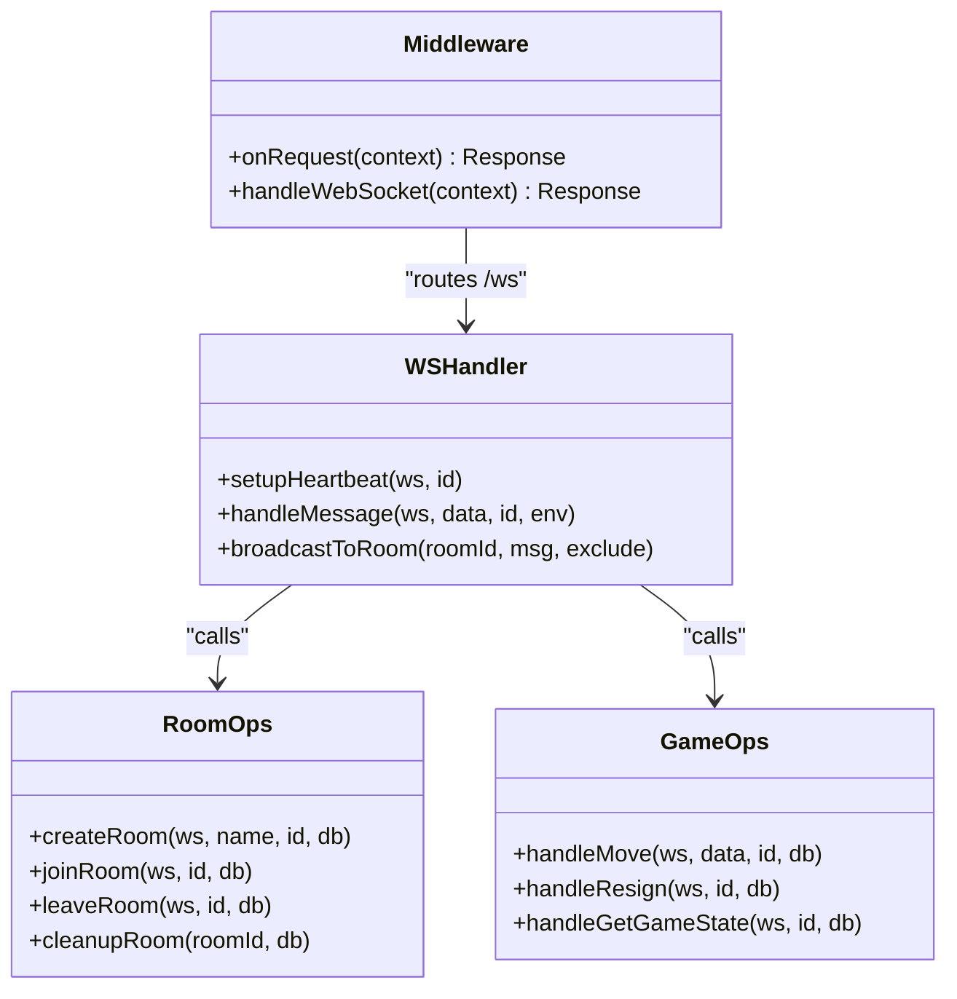
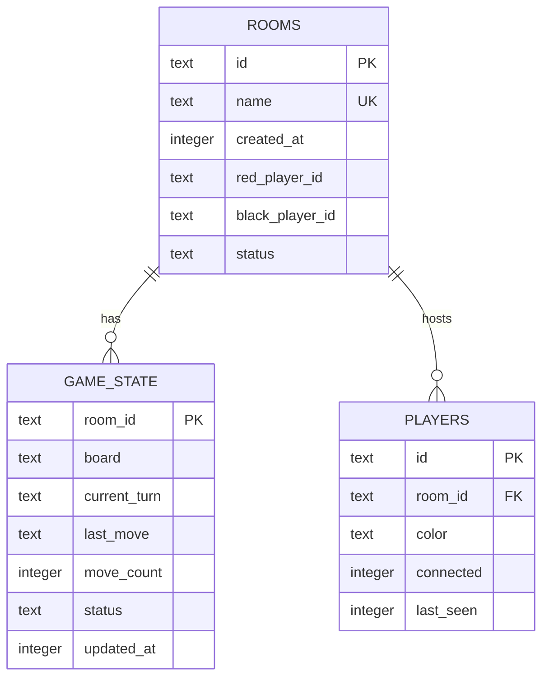
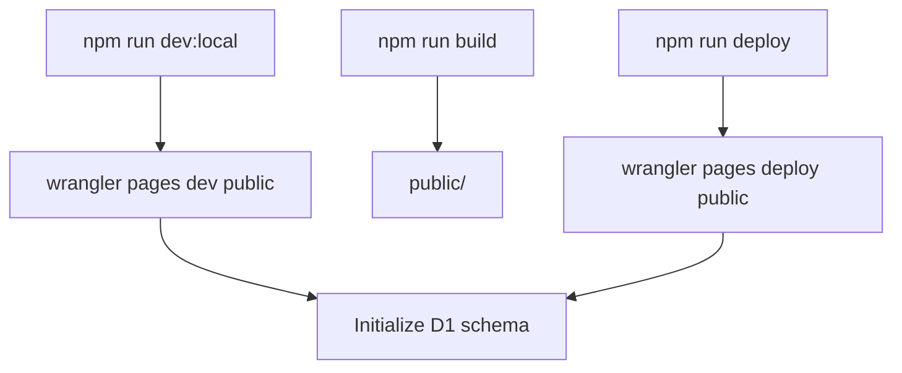
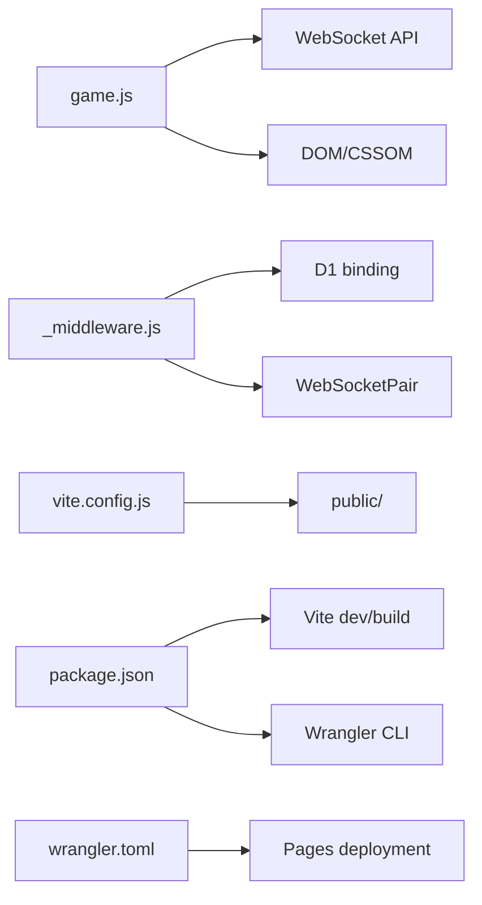

# Technology Stack

<cite>
**Referenced Files in This Document**
- [package.json](file://package.json)
- [wrangler.toml](file://wrangler.toml)
- [index.html](file://index.html)
- [game.js](file://game.js)
- [style.css](file://style.css)
- [functions/_middleware.js](file://functions/_middleware.js)
- [schema.sql](file://schema.sql)
- [DEPLOYMENT.md](file://DEPLOYMENT.md)
- [README.md](file://README.md)
- [vite.config.js](file://vite.config.js)
- [tests/integration/websocket.test.js](file://tests/integration/websocket.test.js)
- [tests/unit/chess-rules.test.js](file://tests/unit/chess-rules.test.js)
</cite>

## Table of Contents
1. [Introduction](#introduction)
2. [Project Structure](#project-structure)
3. [Core Components](#core-components)
4. [Architecture Overview](#architecture-overview)
5. [Detailed Component Analysis](#detailed-component-analysis)
6. [Dependency Analysis](#dependency-analysis)
7. [Performance Considerations](#performance-considerations)
8. [Troubleshooting Guide](#troubleshooting-guide)
9. [Conclusion](#conclusion)

## Introduction
This document describes the technology stack powering the Chinese Chess Online project. It covers frontend technologies (HTML5, CSS3, Vanilla JavaScript), backend architecture (Cloudflare Pages Functions with WebSocket support), database solution (Cloudflare D1 with SQLite), and deployment platform (Cloudflare Pages). It explains the rationale behind each choice, integration patterns, and how the stack enables real-time multiplayer functionality. Version requirements, compatibility considerations, and performance characteristics are included for both developers and users.

## Project Structure
The project follows a clear separation of concerns:
- Frontend assets (HTML, CSS, JavaScript) are built and served statically via Cloudflare Pages.
- Real-time multiplayer logic is implemented in Cloudflare Pages Functions with WebSocket support.
- Game state is persisted using Cloudflare D1 (SQLite).
- Build and deployment are orchestrated via Vite and Wrangler.

**Diagram sources**
- [index.html](file://index.html)
- [style.css](file://style.css)
- [game.js](file://game.js)
- [functions/_middleware.js](file://functions/_middleware.js)
- [schema.sql](file://schema.sql)

**Section sources**
- [README.md](file://README.md)
- [vite.config.js](file://vite.config.js)
- [wrangler.toml](file://wrangler.toml)

## Core Components
- Frontend: HTML5 semantic markup, CSS3 animations and responsive design, Vanilla JavaScript for game logic and WebSocket communication.
- Backend: Cloudflare Pages Functions handling WebSocket upgrades, room management, move validation, and broadcasting.
- Database: Cloudflare D1 (SQLite) for persistent room, game state, and player metadata.
- Build and Dev Tools: Vite for development server and bundling; Wrangler for local development and deployment; Vitest for testing.

**Section sources**
- [README.md](file://README.md)
- [package.json](file://package.json)
- [vite.config.js](file://vite.config.js)
- [wrangler.toml](file://wrangler.toml)

## Architecture Overview
The system uses a static-first architecture with dynamic WebSocket-backed multiplayer:
- Cloudflare Pages serves the static frontend.
- Incoming WebSocket connections are routed to Cloudflare Pages Functions via the middleware.
- Functions manage rooms, validate moves, persist state to D1, and broadcast updates to both players.
- The frontend renders the board, handles user interactions, and synchronizes with the backend via WebSocket.

**Diagram sources**
- [functions/_middleware.js](file://functions/_middleware.js)
- [game.js](file://game.js)
- [schema.sql](file://schema.sql)

**Section sources**
- [DEPLOYMENT.md](file://DEPLOYMENT.md)
- [functions/_middleware.js](file://functions/_middleware.js)

## Detailed Component Analysis

### Frontend: HTML5, CSS3, Vanilla JavaScript
- HTML5 defines screens for lobby and game, with semantic elements and viewport meta for responsiveness.
- CSS3 provides responsive layouts, animations (e.g., pulsing check indicator), and adaptive styles for mobile.
- Vanilla JavaScript implements:
  - Board initialization and rendering with SVG-like DOM elements.
  - Piece selection, valid move calculation, and move execution.
  - WebSocket connection lifecycle, heartbeat, reconnection, and error handling.
  - UI updates for game state, turn indicators, and messages.

**Diagram sources**
- [game.js](file://game.js)

**Section sources**
- [index.html](file://index.html)
- [style.css](file://style.css)
- [game.js](file://game.js)

### Backend: Cloudflare Pages Functions with WebSocket
- Middleware routes WebSocket requests to the WebSocket handler and serves static files otherwise.
- WebSocket handler accepts connections, manages heartbeats, and dispatches messages to handlers for room creation/joining, moves, resign, and reconnection.
- Room management persists room metadata, assigns colors, tracks connectivity, and cleans up stale rooms.
- Move validation mirrors frontend rules and uses optimistic locking to prevent race conditions.
- Broadcasting ensures both players receive updates in real time.

**Diagram sources**
- [functions/_middleware.js](file://functions/_middleware.js)

**Section sources**
- [functions/_middleware.js](file://functions/_middleware.js)

### Database: Cloudflare D1 (SQLite)
- Schema defines three tables: rooms, game_state, and players, with foreign keys and indexes for performance.
- Initialization is idempotent and executed on every request to ensure schema readiness.
- Operations include:
  - Room creation with initial board and game state.
  - Player assignment and connectivity tracking.
  - Move persistence with optimistic locking using move_count.
  - Cleanup of stale rooms and players.

**Diagram sources**
- [schema.sql](file://schema.sql)

**Section sources**
- [schema.sql](file://schema.sql)
- [functions/_middleware.js](file://functions/_middleware.js)

### Build and Deployment: Vite, Wrangler, Pages
- Vite builds static assets to the public directory and runs a dev server.
- Wrangler manages local development with Pages dev, D1 bindings, and deployment to Cloudflare Pages.
- Deployment targets Pages with a build command and output directory configured in wrangler.toml.

**Diagram sources**
- [package.json](file://package.json)
- [vite.config.js](file://vite.config.js)
- [wrangler.toml](file://wrangler.toml)

**Section sources**
- [package.json](file://package.json)
- [vite.config.js](file://vite.config.js)
- [wrangler.toml](file://wrangler.toml)
- [DEPLOYMENT.md](file://DEPLOYMENT.md)

## Dependency Analysis
- Frontend depends on browser APIs (DOM, WebSocket) and Cloudflare-hosted static assets.
- Backend depends on Cloudflare runtime APIs (WebSocketPair, D1 binding) and the database schema.
- Build pipeline depends on Vite and Wrangler for local development and deployment automation.

**Diagram sources**
- [game.js](file://game.js)
- [functions/_middleware.js](file://functions/_middleware.js)
- [vite.config.js](file://vite.config.js)
- [package.json](file://package.json)
- [wrangler.toml](file://wrangler.toml)

**Section sources**
- [game.js](file://game.js)
- [functions/_middleware.js](file://functions/_middleware.js)
- [vite.config.js](file://vite.config.js)
- [package.json](file://package.json)
- [wrangler.toml](file://wrangler.toml)

## Performance Considerations
- Edge computing: Cloudflare’s global edge minimizes latency for multiplayer interactions.
- WebSocket efficiency: Heartbeat and periodic ping/pong keep connections alive and detect failures quickly.
- Optimistic UI updates: The frontend applies moves immediately and reconciles with server confirmation, reducing perceived latency.
- Database indexing: Indexes on frequently queried columns improve room and player lookup performance.
- Static hosting: Pages delivers HTML/CSS/JS efficiently, keeping bandwidth and CPU usage low for the client.

[No sources needed since this section provides general guidance]

## Troubleshooting Guide
Common issues and resolutions:
- WebSocket connection fails: Verify the middleware routes /ws and the upgrade header is handled. Check browser console for errors.
- Build fails: Ensure the build command and output directory match configuration. Confirm dependencies in package.json.
- Rooms not working: Confirm the WebSocket handler is deployed and connections are accepted. Check for WebSocket errors in the browser console.
- Database errors: Confirm D1 binding is configured and schema initialization runs on every request.

**Section sources**
- [DEPLOYMENT.md](file://DEPLOYMENT.md)
- [functions/_middleware.js](file://functions/_middleware.js)

## Conclusion
The Chinese Chess Online project leverages a modern, serverless stack to deliver a responsive, real-time multiplayer experience. The combination of static hosting, WebSocket-backed backend, and a lightweight database provides scalability, low latency, and ease of deployment. The stack balances simplicity for developers with strong performance characteristics for users, while offering clear upgrade paths to persistent storage and advanced features.