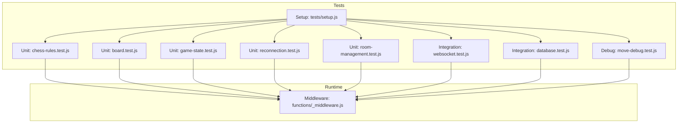
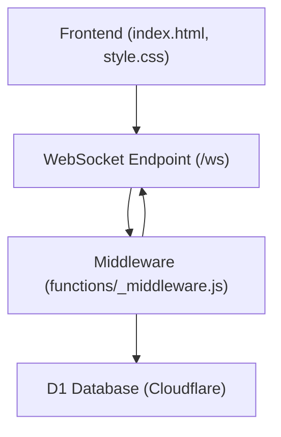
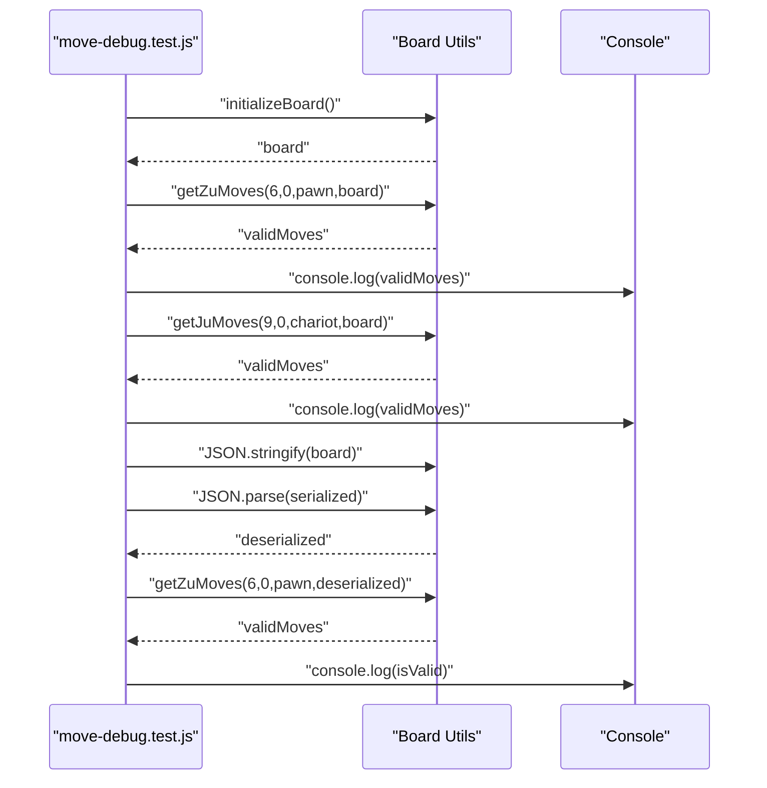
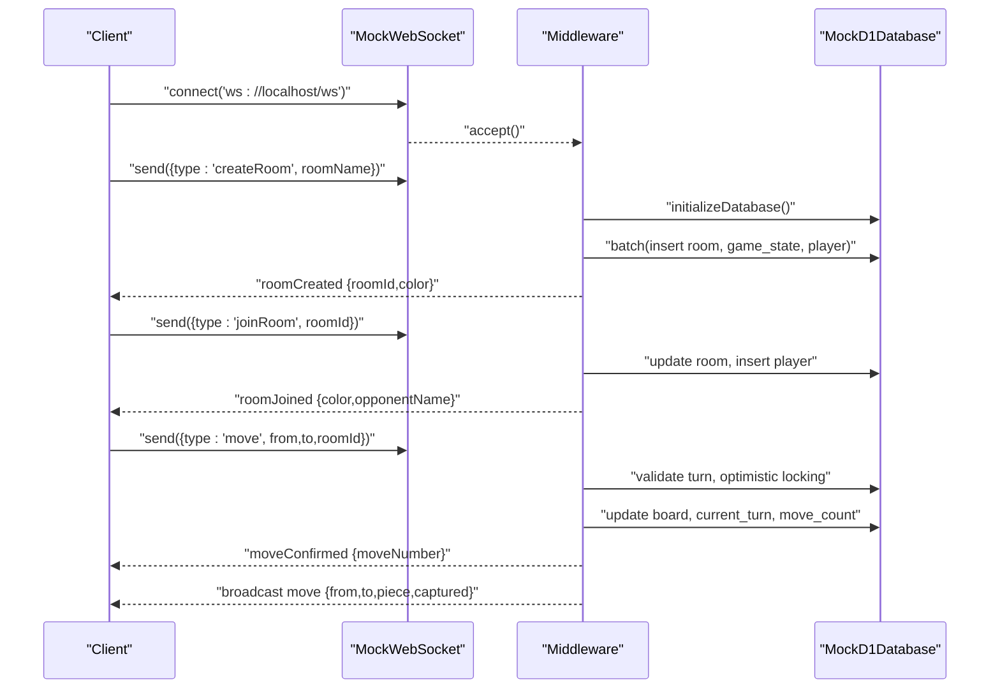
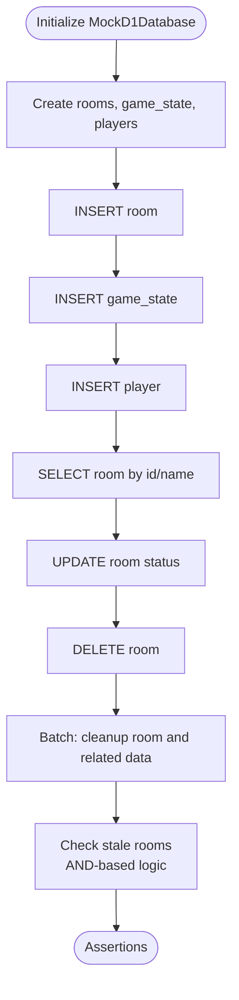
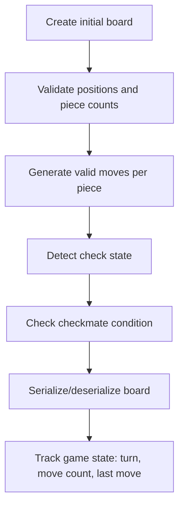
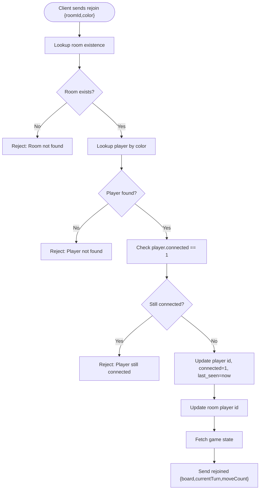
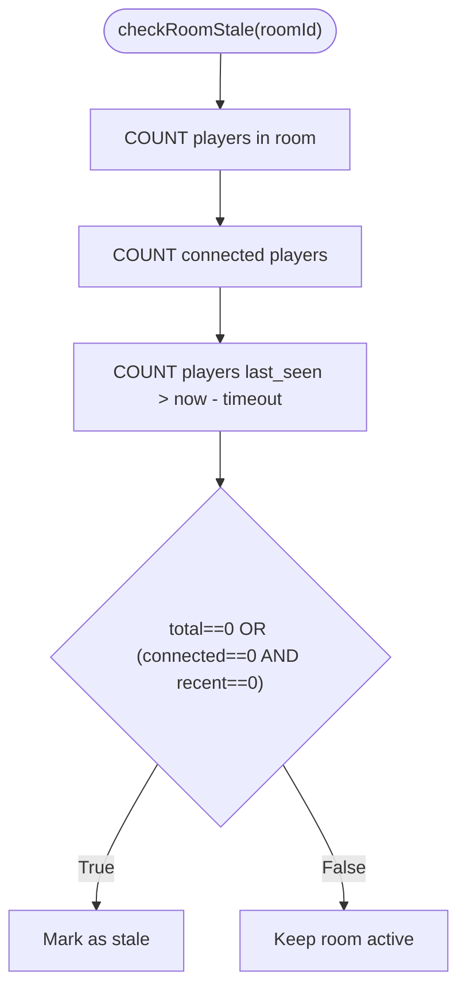
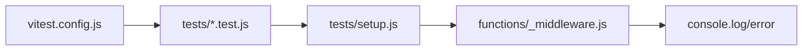

# Debugging Tools and Techniques

<cite>
**Referenced Files in This Document**
- [tests/debug/move-debug.test.js](file://tests/debug/move-debug.test.js)
- [tests/integration/websocket.test.js](file://tests/integration/websocket.test.js)
- [tests/integration/database.test.js](file://tests/integration/database.test.js)
- [tests/unit/chess-rules.test.js](file://tests/unit/chess-rules.test.js)
- [tests/unit/board.test.js](file://tests/unit/board.test.js)
- [tests/unit/game-state.test.js](file://tests/unit/game-state.test.js)
- [tests/unit/reconnection.test.js](file://tests/unit/reconnection.test.js)
- [tests/unit/room-management.test.js](file://tests/unit/room-management.test.js)
- [tests/setup.js](file://tests/setup.js)
- [vitest.config.js](file://vitest.config.js)
- [package.json](file://package.json)
- [functions/_middleware.js](file://functions/_middleware.js)
- [TROUBLESHOOTING.md](file://TROUBLESHOOTING.md)
</cite>

## Table of Contents
1. [Introduction](#introduction)
2. [Project Structure](#project-structure)
3. [Core Components](#core-components)
4. [Architecture Overview](#architecture-overview)
5. [Detailed Component Analysis](#detailed-component-analysis)
6. [Dependency Analysis](#dependency-analysis)
7. [Performance Considerations](#performance-considerations)
8. [Troubleshooting Guide](#troubleshooting-guide)
9. [Conclusion](#conclusion)
10. [Appendices](#appendices)

## Introduction
This document provides comprehensive debugging guidance for the Chinese Chess multiplayer game hosted on Cloudflare Pages. It covers testing tools, techniques, and troubleshooting approaches, focusing on console logging, breakpoint debugging, test visualization, and specialized scenarios such as move debugging. It also explains debugging techniques for asynchronous operations, WebSocket communication, and database connectivity, and outlines browser developer tools, Node.js debugging, and remote debugging techniques. Finally, it includes performance profiling, memory leak detection, and test reliability improvement strategies.

## Project Structure
The project organizes tests by scope and technology:
- Unit tests validate individual logic units (rules, board, game state).
- Integration tests validate end-to-end flows (WebSocket, database).
- Debug tests focus on diagnosing specific issues (e.g., move validation).
- A shared setup file mocks external dependencies for deterministic testing.

**Diagram sources**
- [tests/unit/chess-rules.test.js:1-670](file://tests/unit/chess-rules.test.js#L1-L670)
- [tests/unit/board.test.js:1-312](file://tests/unit/board.test.js#L1-L312)
- [tests/unit/game-state.test.js:1-311](file://tests/unit/game-state.test.js#L1-L311)
- [tests/unit/reconnection.test.js:1-594](file://tests/unit/reconnection.test.js#L1-L594)
- [tests/unit/room-management.test.js:1-446](file://tests/unit/room-management.test.js#L1-L446)
- [tests/integration/websocket.test.js:1-404](file://tests/integration/websocket.test.js#L1-L404)
- [tests/integration/database.test.js:1-371](file://tests/integration/database.test.js#L1-L371)
- [tests/debug/move-debug.test.js:1-262](file://tests/debug/move-debug.test.js#L1-L262)
- [tests/setup.js:1-231](file://tests/setup.js#L1-L231)
- [functions/_middleware.js:1-1316](file://functions/_middleware.js#L1-L1316)

**Section sources**
- [tests/debug/move-debug.test.js:1-262](file://tests/debug/move-debug.test.js#L1-L262)
- [tests/integration/websocket.test.js:1-404](file://tests/integration/websocket.test.js#L1-L404)
- [tests/integration/database.test.js:1-371](file://tests/integration/database.test.js#L1-L371)
- [tests/unit/chess-rules.test.js:1-670](file://tests/unit/chess-rules.test.js#L1-L670)
- [tests/unit/board.test.js:1-312](file://tests/unit/board.test.js#L1-L312)
- [tests/unit/game-state.test.js:1-311](file://tests/unit/game-state.test.js#L1-L311)
- [tests/unit/reconnection.test.js:1-594](file://tests/unit/reconnection.test.js#L1-L594)
- [tests/unit/room-management.test.js:1-446](file://tests/unit/room-management.test.js#L1-L446)
- [tests/setup.js:1-231](file://tests/setup.js#L1-L231)
- [vitest.config.js:1-24](file://vitest.config.js#L1-L24)
- [package.json:1-28](file://package.json#L1-L28)

## Core Components
- Vitest configuration defines test environment, coverage, and timeouts.
- Shared setup mocks WebSocket, D1 database, and DOM for deterministic tests.
- Middleware implements WebSocket handling, heartbeat, room management, and game logic with extensive logging.

Key debugging capabilities:
- Console logging for database initialization, WebSocket events, and error handling.
- Mocked environments enable isolated debugging of logic without external dependencies.
- Structured error codes and messages facilitate quick diagnosis.

**Section sources**
- [vitest.config.js:1-24](file://vitest.config.js#L1-L24)
- [tests/setup.js:1-231](file://tests/setup.js#L1-L231)
- [functions/_middleware.js:46-98](file://functions/_middleware.js#L46-L98)
- [functions/_middleware.js:131-185](file://functions/_middleware.js#L131-L185)
- [functions/_middleware.js:231-276](file://functions/_middleware.js#L231-L276)

## Architecture Overview
The system comprises:
- Frontend: HTML/CSS/JS served statically.
- Backend: Cloudflare Pages Functions handling WebSocket upgrades and routing.
- Database: D1 SQLite via Cloudflare Workers bindings.

**Diagram sources**
- [functions/_middleware.js:104-122](file://functions/_middleware.js#L104-L122)
- [functions/_middleware.js:131-185](file://functions/_middleware.js#L131-L185)

**Section sources**
- [functions/_middleware.js:104-122](file://functions/_middleware.js#L104-L122)
- [functions/_middleware.js:131-185](file://functions/_middleware.js#L131-L185)

## Detailed Component Analysis

### Move Debugging Test Case
The move debug test focuses on validating initial piece moves and board serialization. It demonstrates:
- Board initialization and verification.
- Piece movement calculations for pawns and chariots.
- JSON serialization/deserialization of board state.
- Console logging for move validation outcomes.

**Diagram sources**
- [tests/debug/move-debug.test.js:64-104](file://tests/debug/move-debug.test.js#L64-L104)
- [tests/debug/move-debug.test.js:128-164](file://tests/debug/move-debug.test.js#L128-L164)
- [tests/debug/move-debug.test.js:166-200](file://tests/debug/move-debug.test.js#L166-L200)
- [tests/debug/move-debug.test.js:202-218](file://tests/debug/move-debug.test.js#L202-L218)
- [tests/debug/move-debug.test.js:220-260](file://tests/debug/move-debug.test.js#L220-L260)

**Section sources**
- [tests/debug/move-debug.test.js:1-262](file://tests/debug/move-debug.test.js#L1-L262)

### WebSocket Communication Debugging
WebSocket tests validate connection lifecycle, message handling, room operations, and reconnection logic. They use a mock WebSocket to simulate server-side behavior and verify client-server interactions.

**Diagram sources**
- [tests/integration/websocket.test.js:33-67](file://tests/integration/websocket.test.js#L33-L67)
- [tests/integration/websocket.test.js:127-177](file://tests/integration/websocket.test.js#L127-L177)
- [tests/integration/websocket.test.js:179-226](file://tests/integration/websocket.test.js#L179-L226)
- [tests/integration/websocket.test.js:228-277](file://tests/integration/websocket.test.js#L228-L277)
- [tests/integration/websocket.test.js:344-377](file://tests/integration/websocket.test.js#L344-L377)
- [functions/_middleware.js:282-351](file://functions/_middleware.js#L282-L351)
- [functions/_middleware.js:353-443](file://functions/_middleware.js#L353-L443)
- [functions/_middleware.js:522-683](file://functions/_middleware.js#L522-L683)

**Section sources**
- [tests/integration/websocket.test.js:1-404](file://tests/integration/websocket.test.js#L1-L404)
- [functions/_middleware.js:282-351](file://functions/_middleware.js#L282-L351)
- [functions/_middleware.js:353-443](file://functions/_middleware.js#L353-L443)
- [functions/_middleware.js:522-683](file://functions/_middleware.js#L522-L683)

### Database Connectivity Debugging
Database integration tests validate table creation, room/player/game state operations, batch operations, and stale room detection. They use a mock D1 database to simulate SQL operations deterministically.

**Diagram sources**
- [tests/integration/database.test.js:12-44](file://tests/integration/database.test.js#L12-L44)
- [tests/integration/database.test.js:91-145](file://tests/integration/database.test.js#L91-L145)
- [tests/integration/database.test.js:147-201](file://tests/integration/database.test.js#L147-L201)
- [tests/integration/database.test.js:203-266](file://tests/integration/database.test.js#L203-L266)
- [tests/integration/database.test.js:268-305](file://tests/integration/database.test.js#L268-L305)
- [tests/integration/database.test.js:307-340](file://tests/integration/database.test.js#L307-L340)
- [tests/unit/room-management.test.js:44-63](file://tests/unit/room-management.test.js#L44-L63)

**Section sources**
- [tests/integration/database.test.js:1-371](file://tests/integration/database.test.js#L1-L371)
- [tests/unit/room-management.test.js:1-446](file://tests/unit/room-management.test.js#L1-L446)

### Chess Rules and Game State Debugging
Unit tests validate piece movement rules, check detection, and game state transitions. They demonstrate:
- Position validation and movement generation for each piece type.
- Check detection logic and checkmate validation.
- Turn alternation and move counting.

**Diagram sources**
- [tests/unit/chess-rules.test.js:15-55](file://tests/unit/chess-rules.test.js#L15-L55)
- [tests/unit/chess-rules.test.js:58-322](file://tests/unit/chess-rules.test.js#L58-L322)
- [tests/unit/chess-rules.test.js:328-670](file://tests/unit/chess-rules.test.js#L328-L670)
- [tests/unit/board.test.js:15-55](file://tests/unit/board.test.js#L15-L55)
- [tests/unit/board.test.js:61-66](file://tests/unit/board.test.js#L61-L66)
- [tests/unit/game-state.test.js:15-28](file://tests/unit/game-state.test.js#L15-L28)
- [tests/unit/game-state.test.js:56-80](file://tests/unit/game-state.test.js#L56-L80)

**Section sources**
- [tests/unit/chess-rules.test.js:1-670](file://tests/unit/chess-rules.test.js#L1-L670)
- [tests/unit/board.test.js:1-312](file://tests/unit/board.test.js#L1-L312)
- [tests/unit/game-state.test.js:1-311](file://tests/unit/game-state.test.js#L1-L311)

### Reconnection Flow Debugging
Reconnection tests validate the bug fix preventing simultaneous reconnections when the original player is still connected. They compare old buggy logic with the corrected AND-based stale room detection.

**Diagram sources**
- [tests/unit/reconnection.test.js:58-106](file://tests/unit/reconnection.test.js#L58-L106)
- [tests/unit/reconnection.test.js:139-211](file://tests/unit/reconnection.test.js#L139-L211)
- [tests/unit/reconnection.test.js:280-382](file://tests/unit/reconnection.test.js#L280-L382)
- [tests/unit/reconnection.test.js:459-514](file://tests/unit/reconnection.test.js#L459-L514)
- [functions/_middleware.js:1086-1146](file://functions/_middleware.js#L1086-L1146)

**Section sources**
- [tests/unit/reconnection.test.js:1-594](file://tests/unit/reconnection.test.js#L1-L594)
- [functions/_middleware.js:1086-1146](file://functions/_middleware.js#L1086-L1146)

### Room Management and Stale Room Detection
Room management tests validate stale room detection logic, emphasizing the AND-based fix to prevent incorrect cleanup of rooms with disconnected but recently active players.

**Diagram sources**
- [tests/unit/room-management.test.js:44-63](file://tests/unit/room-management.test.js#L44-L63)
- [tests/unit/room-management.test.js:99-176](file://tests/unit/room-management.test.js#L99-L176)
- [tests/unit/room-management.test.js:215-261](file://tests/unit/room-management.test.js#L215-L261)

**Section sources**
- [tests/unit/room-management.test.js:1-446](file://tests/unit/room-management.test.js#L1-L446)

## Dependency Analysis
Testing dependencies and coupling:
- All tests import a shared setup that provides mocks for WebSocket, D1 database, and DOM.
- Middleware depends on D1 bindings and WebSocketPair for runtime behavior.
- Logging spans database initialization, WebSocket message handling, and error reporting.

**Diagram sources**
- [vitest.config.js:1-24](file://vitest.config.js#L1-L24)
- [tests/setup.js:1-231](file://tests/setup.js#L1-L231)
- [functions/_middleware.js:46-98](file://functions/_middleware.js#L46-L98)

**Section sources**
- [vitest.config.js:1-24](file://vitest.config.js#L1-L24)
- [tests/setup.js:1-231](file://tests/setup.js#L1-L231)
- [functions/_middleware.js:46-98](file://functions/_middleware.js#L46-L98)

## Performance Considerations
- Database latency: D1 should respond under 100 ms; slower responses indicate network issues.
- WebSocket latency: Target under 50 ms for move synchronization.
- Server load: Monitor Cloudflare dashboard for service status during heavy loads.
- Optimistic locking: The middleware uses move_count to prevent concurrent move conflicts, reducing contention.

Practical tips:
- Profile WebSocket message throughput and broadcast latency.
- Monitor Cloudflare Functions logs for slow initialization or repeated database calls.
- Use Vitest’s built-in coverage and timeouts to detect flaky tests.

**Section sources**
- [TROUBLESHOOTING.md:237-251](file://TROUBLESHOOTING.md#L237-L251)
- [functions/_middleware.js:619-634](file://functions/_middleware.js#L619-L634)
- [vitest.config.js:20-22](file://vitest.config.js#L20-L22)

## Troubleshooting Guide
Common issues and resolutions:
- Local development: reinstall dependencies, reinitialize local D1 database, change port if busy.
- Database: verify D1 binding, check tables exist, and test connectivity via D1 dashboard console.
- WebSocket: ensure Functions are deployed, verify D1 binding, and check browser console for errors.
- Moves not syncing: verify database writes and WebSocket broadcasts; ensure both players are connected.

Diagnostic checklist:
- D1 database created and configured.
- Database ID in configuration and binding in Pages settings.
- Tables exist (rooms, game_state, players).
- Project deployed successfully.
- Browser console shows WebSocket connected.
- No errors in Cloudflare Functions logs.

**Section sources**
- [TROUBLESHOOTING.md:13-55](file://TROUBLESHOOTING.md#L13-L55)
- [TROUBLESHOOTING.md:58-110](file://TROUBLESHOOTING.md#L58-L110)
- [TROUBLESHOOTING.md:126-153](file://TROUBLESHOOTING.md#L126-L153)
- [TROUBLESHOOTING.md:173-184](file://TROUBLESHOOTING.md#L173-L184)

## Conclusion
The project’s testing and debugging ecosystem combines deterministic mocks, structured logging, and focused test suites to isolate and diagnose issues across WebSocket communication, database operations, and game logic. By leveraging console logs, breakpoint debugging, and targeted debug tests, developers can efficiently identify and resolve failures, performance bottlenecks, and intermittent issues. Adhering to the troubleshooting guide and performance recommendations ensures reliable operation in production.

## Appendices

### Testing Tools and Techniques
- Vitest: Run tests, watch mode, and coverage reports.
- Mocked environments: WebSocket, D1 database, and DOM abstractions for isolation.
- Console logging: Extensive logging in middleware for database, WebSocket, and error events.

**Section sources**
- [package.json:7-17](file://package.json#L7-L17)
- [tests/setup.js:7-62](file://tests/setup.js#L7-L62)
- [functions/_middleware.js:46-98](file://functions/_middleware.js#L46-L98)
- [functions/_middleware.js:162-179](file://functions/_middleware.js#L162-L179)

### Debugging Asynchronous Operations
- Use Vitest spies and mocks to intercept asynchronous calls.
- Assert on callback invocations and state transitions.
- Validate timing-sensitive flows (heartbeat, reconnection) with deterministic mocks.

**Section sources**
- [tests/integration/websocket.test.js:279-305](file://tests/integration/websocket.test.js#L279-L305)
- [tests/unit/reconnection.test.js:459-514](file://tests/unit/reconnection.test.js#L459-L514)

### WebSocket Communication Debugging
- Validate message types and payloads.
- Simulate connection open/close and error scenarios.
- Verify heartbeat and reconnection flows.

**Section sources**
- [tests/integration/websocket.test.js:33-67](file://tests/integration/websocket.test.js#L33-L67)
- [tests/integration/websocket.test.js:344-377](file://tests/integration/websocket.test.js#L344-L377)

### Database Connectivity Debugging
- Validate table creation and indexes.
- Test batch operations and cleanup routines.
- Verify stale room detection logic.

**Section sources**
- [tests/integration/database.test.js:12-44](file://tests/integration/database.test.js#L12-L44)
- [tests/integration/database.test.js:268-305](file://tests/integration/database.test.js#L268-L305)
- [tests/unit/room-management.test.js:44-63](file://tests/unit/room-management.test.js#L44-L63)

### Browser Developer Tools and Remote Debugging
- Open browser DevTools (F12) and inspect Console and Network tabs.
- Monitor WebSocket frames and server logs in Cloudflare Dashboard Functions Logs.
- Use breakpoints in frontend code to trace user interactions.

**Section sources**
- [TROUBLESHOOTING.md:154-172](file://TROUBLESHOOTING.md#L154-L172)

### Performance Profiling and Memory Leak Detection
- Use Vitest coverage to identify untested paths.
- Monitor Cloudflare Functions logs for long-running operations.
- Detect memory leaks by observing persistent connection growth and stale room accumulation.

**Section sources**
- [vitest.config.js:9-18](file://vitest.config.js#L9-L18)
- [functions/_middleware.js:1213-1240](file://functions/_middleware.js#L1213-L1240)
- [tests/unit/room-management.test.js:518-593](file://tests/unit/room-management.test.js#L518-L593)