# Database Integration Tests

<cite>
**Referenced Files in This Document**
- [database.test.js](file://tests/integration/database.test.js)
- [game-flow.test.js](file://tests/integration/game-flow.test.js)
- [room-management.test.js](file://tests/unit/room-management.test.js)
- [schema.sql](file://schema.sql)
- [setup.js](file://tests/setup.js)
- [_middleware.js](file://functions/_middleware.js)
- [game.js](file://game.js)
</cite>

## Table of Contents
1. [Introduction](#introduction)
2. [Project Structure](#project-structure)
3. [Core Components](#core-components)
4. [Architecture Overview](#architecture-overview)
5. [Detailed Component Analysis](#detailed-component-analysis)
6. [Dependency Analysis](#dependency-analysis)
7. [Performance Considerations](#performance-considerations)
8. [Troubleshooting Guide](#troubleshooting-guide)
9. [Conclusion](#conclusion)
10. [Appendices](#appendices)

## Introduction
This document provides comprehensive database integration testing guidance for the Chinese Chess project. It focuses on D1 database operations, room persistence, state management, and end-to-end game flow. It documents the test setup using MockD1Database, table creation patterns, data seeding strategies, room operations, game state operations, player operations, batch operations and transactions, stale room detection, error handling, and schema validation. The goal is to help developers write reliable integration tests that validate correctness, data integrity, and robustness of database-backed features.

## Project Structure
The repository organizes database-related tests under the tests directory, with supporting mocks and schema definitions:
- Integration tests for database operations and game flow
- Unit tests for room lifecycle and stale detection logic
- Mock utilities for D1 and WebSocket environments
- Database schema definition for Cloudflare D1

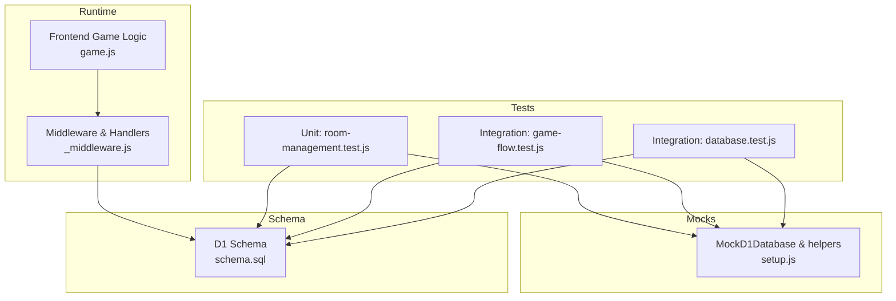

**Diagram sources**
- [database.test.js:1-371](file://tests/integration/database.test.js#L1-L371)
- [game-flow.test.js:1-749](file://tests/integration/game-flow.test.js#L1-L749)
- [room-management.test.js:1-446](file://tests/unit/room-management.test.js#L1-L446)
- [setup.js:64-170](file://tests/setup.js#L64-L170)
- [schema.sql:1-42](file://schema.sql#L1-L42)
- [_middleware.js:46-98](file://functions/_middleware.js#L46-L98)
- [game.js:1-800](file://game.js#L1-L800)

**Section sources**
- [database.test.js:1-371](file://tests/integration/database.test.js#L1-L371)
- [game-flow.test.js:1-749](file://tests/integration/game-flow.test.js#L1-L749)
- [room-management.test.js:1-446](file://tests/unit/room-management.test.js#L1-L446)
- [setup.js:64-170](file://tests/setup.js#L64-L170)
- [schema.sql:1-42](file://schema.sql#L1-L42)

## Core Components
- MockD1Database: A lightweight in-memory mock that simulates D1 operations for tests, including prepare, batch, seed, and basic SELECT/INSERT/UPDATE/DELETE semantics.
- Test tables creation: Reproducible table creation via CREATE TABLE IF NOT EXISTS for rooms, game_state, and players, mirroring the production schema.
- Data seeding: Helpers to seed test data for deterministic scenarios (e.g., rooms, players, game_state).
- Room lifecycle: Creation, joining, status transitions, and cleanup.
- Game state: Board serialization, move tracking, turn management, and optimistic locking.
- Player operations: Connection status, last_seen updates, and counting.
- Batch operations: Multi-statement execution and transaction-like cleanup.
- Stale room detection: Logic to identify rooms with no players or exclusively disconnected/inactive players.
- Error handling: Duplicate room names, missing constraints, and invalid SQL.

**Section sources**
- [setup.js:64-170](file://tests/setup.js#L64-L170)
- [database.test.js:12-48](file://tests/integration/database.test.js#L12-L48)
- [schema.sql:5-42](file://schema.sql#L5-L42)
- [room-management.test.js:44-63](file://tests/unit/room-management.test.js#L44-L63)

## Architecture Overview
The integration tests validate the end-to-end flow from frontend actions to backend handlers and database persistence. The middleware initializes D1 tables, handles WebSocket upgrades, and executes database operations for room management, game moves, and cleanup.

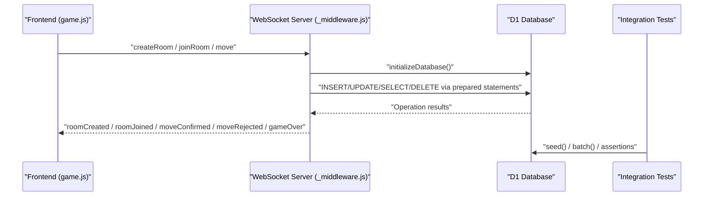

**Diagram sources**
- [_middleware.js:104-122](file://functions/_middleware.js#L104-L122)
- [_middleware.js:282-351](file://functions/_middleware.js#L282-L351)
- [_middleware.js:353-443](file://functions/_middleware.js#L353-L443)
- [_middleware.js:522-683](file://functions/_middleware.js#L522-L683)
- [game.js:740-800](file://game.js#L740-L800)
- [setup.js:79-90](file://tests/setup.js#L79-L90)

## Detailed Component Analysis

### Database Initialization and Schema Validation
- Purpose: Ensure tables exist with correct schema before running tests.
- Patterns:
  - Create rooms, game_state, and players tables with appropriate constraints and indexes.
  - Verify table existence via SELECT queries.
- Schema validation:
  - Unique room names enforced by schema.
  - Foreign keys with ON DELETE CASCADE for referential integrity.
  - Indexes on frequently queried columns.

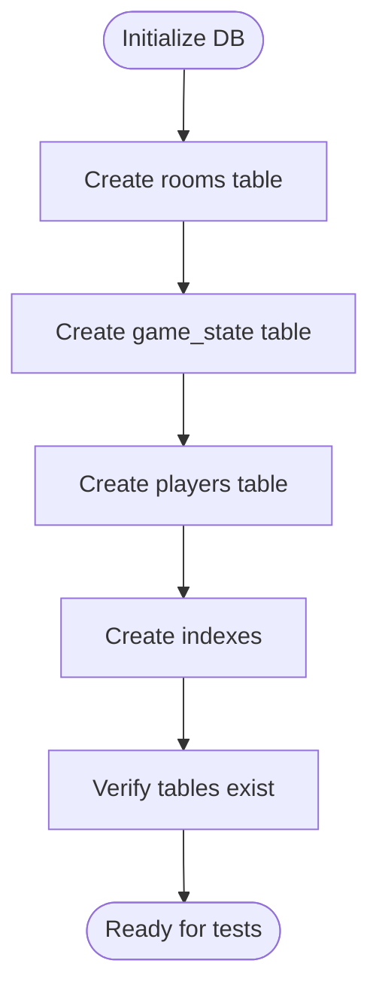

**Diagram sources**
- [database.test.js:12-44](file://tests/integration/database.test.js#L12-L44)
- [schema.sql:5-42](file://schema.sql#L5-L42)

**Section sources**
- [database.test.js:54-81](file://tests/integration/database.test.js#L54-L81)
- [schema.sql:5-42](file://schema.sql#L5-L42)

### Room Operations
- Creation: Insert room with id, name, timestamps, and initial status.
- Querying: Retrieve by id and by name.
- Status updates: Transition from waiting to playing when a second player joins.
- Deletion: Remove room records.

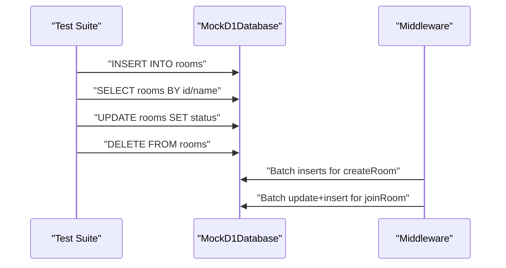

**Diagram sources**
- [database.test.js:91-145](file://tests/integration/database.test.js#L91-L145)
- [_middleware.js:322-329](file://functions/_middleware.js#L322-L329)
- [_middleware.js:399-404](file://functions/_middleware.js#L399-L404)

**Section sources**
- [database.test.js:83-145](file://tests/integration/database.test.js#L83-L145)
- [_middleware.js:282-351](file://functions/_middleware.js#L282-L351)
- [_middleware.js:353-443](file://functions/_middleware.js#L353-L443)

### Game State Operations
- Save initial state: Board JSON, current turn, move count, timestamps.
- Update after moves: Turn switching, move count increment, last_move recording.
- Optimistic locking: Compare-and-swap using move_count to prevent concurrent overwrites.

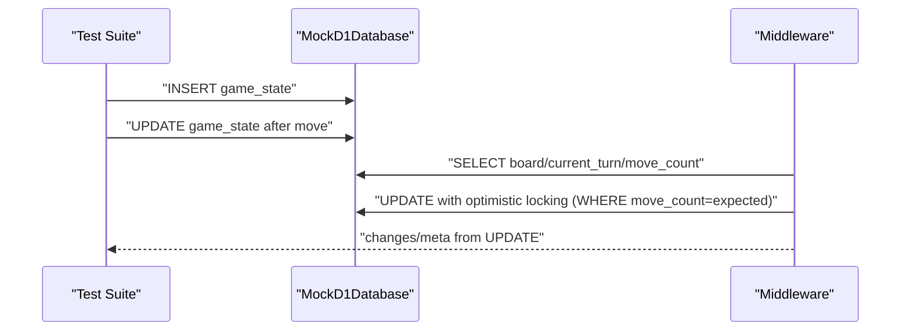

**Diagram sources**
- [database.test.js:155-201](file://tests/integration/database.test.js#L155-L201)
- [game-flow.test.js:522-683](file://tests/integration/game-flow.test.js#L522-L683)
- [_middleware.js:620-622](file://functions/_middleware.js#L620-L622)

**Section sources**
- [database.test.js:147-201](file://tests/integration/database.test.js#L147-L201)
- [game-flow.test.js:522-555](file://tests/integration/game-flow.test.js#L522-L555)
- [_middleware.js:620-622](file://functions/_middleware.js#L620-L622)

### Player Operations
- Add player to room: Insert player with room_id, color, connected flag, and last_seen.
- Connection status: Toggle connected flag on leave/disconnect.
- Counting: Query connected players for stale detection and room status.
- Cleanup: Remove player records on disconnect or room cleanup.

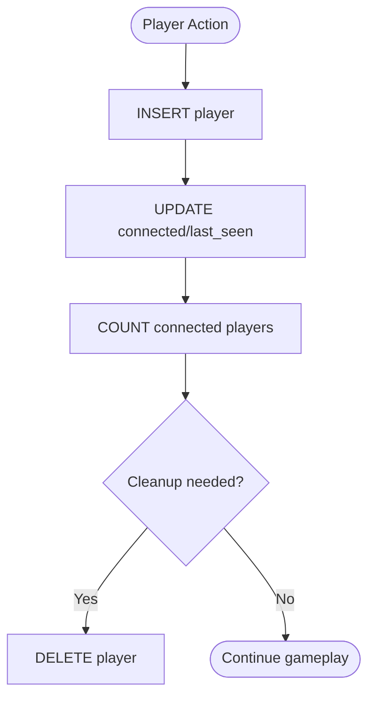

**Diagram sources**
- [database.test.js:211-266](file://tests/integration/database.test.js#L211-L266)
- [room-management.test.js:44-63](file://tests/unit/room-management.test.js#L44-L63)
- [_middleware.js:453-455](file://functions/_middleware.js#L453-L455)
- [_middleware.js:507-516](file://functions/_middleware.js#L507-L516)

**Section sources**
- [database.test.js:203-266](file://tests/integration/database.test.js#L203-L266)
- [room-management.test.js:345-413](file://tests/unit/room-management.test.js#L345-L413)
- [_middleware.js:453-455](file://functions/_middleware.js#L453-L455)
- [_middleware.js:507-516](file://functions/_middleware.js#L507-L516)

### Batch Operations and Transactions
- Multi-statement execution: Use db.batch to run multiple prepared statements atomically in intent.
- Cleanup: Cascade deletes for players, game_state, and rooms.

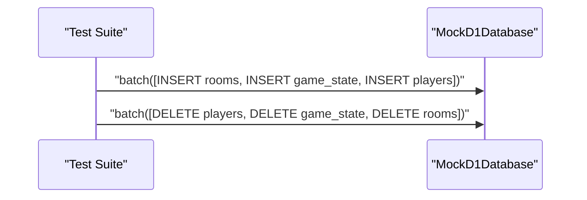

**Diagram sources**
- [database.test.js:280-304](file://tests/integration/database.test.js#L280-L304)
- [_middleware.js:322-329](file://functions/_middleware.js#L322-L329)
- [_middleware.js:499-505](file://functions/_middleware.js#L499-L505)

**Section sources**
- [database.test.js:268-305](file://tests/integration/database.test.js#L268-L305)
- [_middleware.js:322-329](file://functions/_middleware.js#L322-L329)
- [_middleware.js:499-505](file://functions/_middleware.js#L499-L505)

### Stale Room Detection
- Logic: A room is stale if no players exist OR if all players are both disconnected AND inactive.
- Tests demonstrate scenarios: no players, disconnected players, and mixed states.

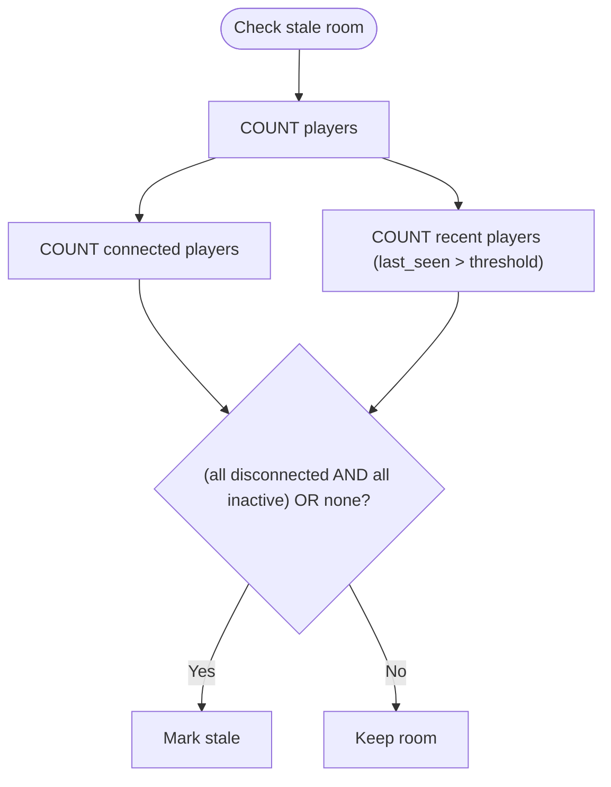

**Diagram sources**
- [room-management.test.js:44-63](file://tests/unit/room-management.test.js#L44-L63)
- [_middleware.js:479-497](file://functions/_middleware.js#L479-L497)

**Section sources**
- [room-management.test.js:99-213](file://tests/unit/room-management.test.js#L99-L213)
- [_middleware.js:479-497](file://functions/_middleware.js#L479-L497)

### Error Handling Scenarios
- Duplicate room name: Enforced by schema; tests indicate expected failure behavior.
- Missing required fields: Tests note that constraints would cause failures.
- Invalid SQL: Tests indicate graceful handling expectations.

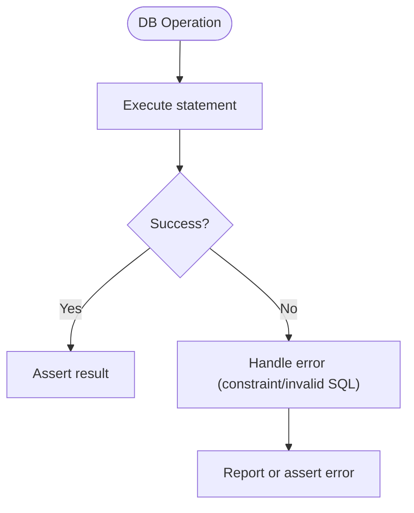

**Diagram sources**
- [database.test.js:350-370](file://tests/integration/database.test.js#L350-L370)

**Section sources**
- [database.test.js:342-370](file://tests/integration/database.test.js#L342-L370)

### End-to-End Game Flow Integration
- Creates room, assigns colors, starts game with red turn.
- Validates move sequences, turn enforcement, and state synchronization.
- Demonstrates optimistic locking and concurrent move rejection.

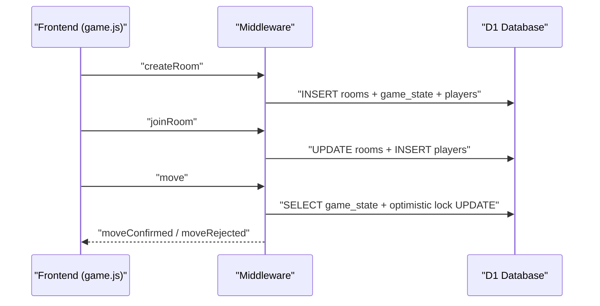

**Diagram sources**
- [game-flow.test.js:278-335](file://tests/integration/game-flow.test.js#L278-L335)
- [game-flow.test.js:522-683](file://tests/integration/game-flow.test.js#L522-L683)
- [game.js:367-379](file://game.js#L367-L379)

**Section sources**
- [game-flow.test.js:278-335](file://tests/integration/game-flow.test.js#L278-L335)
- [game-flow.test.js:522-555](file://tests/integration/game-flow.test.js#L522-L555)
- [game.js:367-379](file://game.js#L367-L379)

## Dependency Analysis
- Test setup depends on MockD1Database and helper functions for seeding and batching.
- Integration tests depend on schema.sql for table definitions and indexes.
- Middleware depends on D1 schema and implements room/game logic.
- Frontend interacts with middleware via WebSocket messages.

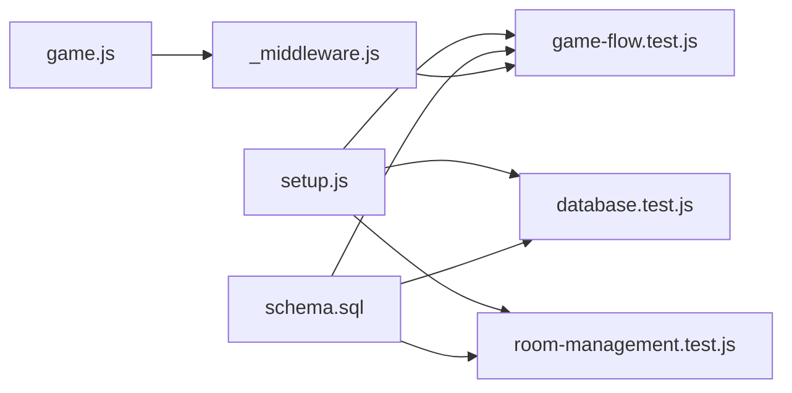

**Diagram sources**
- [setup.js:64-170](file://tests/setup.js#L64-L170)
- [database.test.js:1-371](file://tests/integration/database.test.js#L1-L371)
- [game-flow.test.js:1-749](file://tests/integration/game-flow.test.js#L1-L749)
- [room-management.test.js:1-446](file://tests/unit/room-management.test.js#L1-L446)
- [schema.sql:1-42](file://schema.sql#L1-L42)
- [_middleware.js:104-122](file://functions/_middleware.js#L104-L122)
- [game.js:740-800](file://game.js#L740-L800)

**Section sources**
- [setup.js:64-170](file://tests/setup.js#L64-L170)
- [schema.sql:1-42](file://schema.sql#L1-L42)
- [_middleware.js:104-122](file://functions/_middleware.js#L104-L122)

## Performance Considerations
- Indexes: Ensure optimal query performance for room name/status, player room_id, and game_state updated_at.
- Batch operations: Group related writes to reduce round-trips.
- JSON serialization: Board and move data stored as JSON; consider size and parsing costs.
- Stale room cleanup: Efficiently remove orphaned records to keep database size manageable.

[No sources needed since this section provides general guidance]

## Troubleshooting Guide
- Duplicate room name errors: Validate uniqueness constraints and handle stale room cleanup before retrying.
- Missing required fields: Ensure all NOT NULL columns are populated during inserts.
- Invalid SQL: Review prepared statement bindings and SQL syntax.
- Stale room detection false positives/negatives: Verify counts for connected and recent players; ensure thresholds align with intended behavior.
- Optimistic locking failures: Expect zero changes when another move has been applied concurrently; clients should refresh state and retry.

**Section sources**
- [database.test.js:350-370](file://tests/integration/database.test.js#L350-L370)
- [room-management.test.js:44-63](file://tests/unit/room-management.test.js#L44-L63)
- [_middleware.js:620-622](file://functions/_middleware.js#L620-L622)

## Conclusion
The integration tests comprehensively validate D1-backed room persistence, game state management, player lifecycle, batch operations, stale room detection, and error handling. By leveraging MockD1Database and schema-aligned table creation, the suite ensures correctness and resilience of database operations. Extending tests with additional scenarios (e.g., constraint violations, race conditions, and edge cases) will further strengthen confidence in the system.

[No sources needed since this section summarizes without analyzing specific files]

## Appendices

### Test Setup Checklist
- Initialize MockD1Database before each test.
- Create tables using the provided table creation pattern.
- Seed data for deterministic scenarios.
- Use db.batch for multi-statement operations.
- Assert expected outcomes and error conditions.

**Section sources**
- [database.test.js:57-89](file://tests/integration/database.test.js#L57-L89)
- [room-management.test.js:104-116](file://tests/unit/room-management.test.js#L104-L116)
- [setup.js:79-90](file://tests/setup.js#L79-L90)

### Schema Reference
- rooms: id (PK), name (UNIQUE), created_at, red_player_id, black_player_id, status.
- game_state: room_id (PK, FK), board, current_turn, last_move, updated_at, status, move_count.
- players: id (PK), room_id (FK), color, connected, last_seen.

**Section sources**
- [schema.sql:5-42](file://schema.sql#L5-L42)