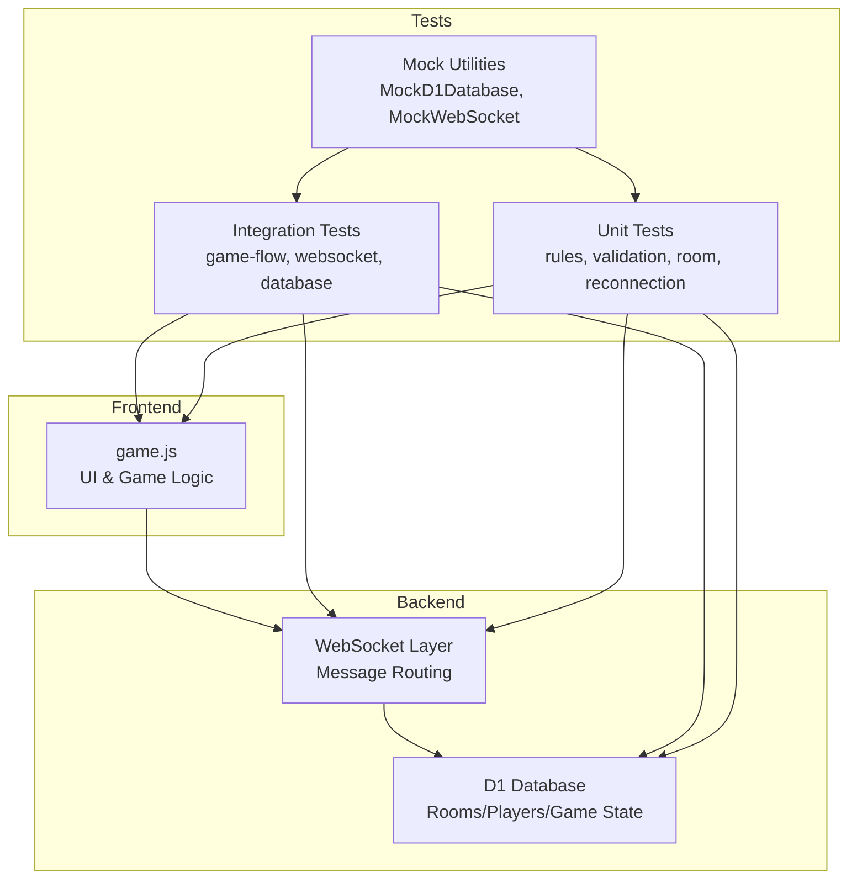
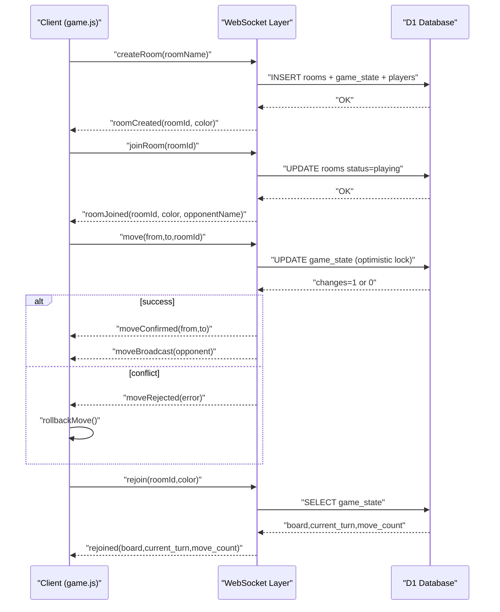
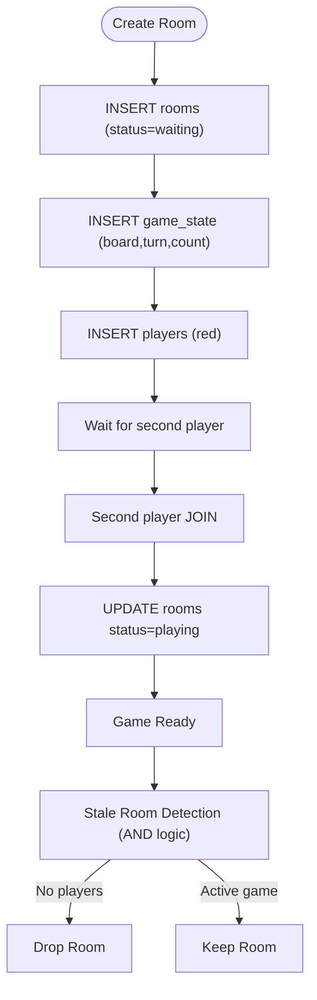
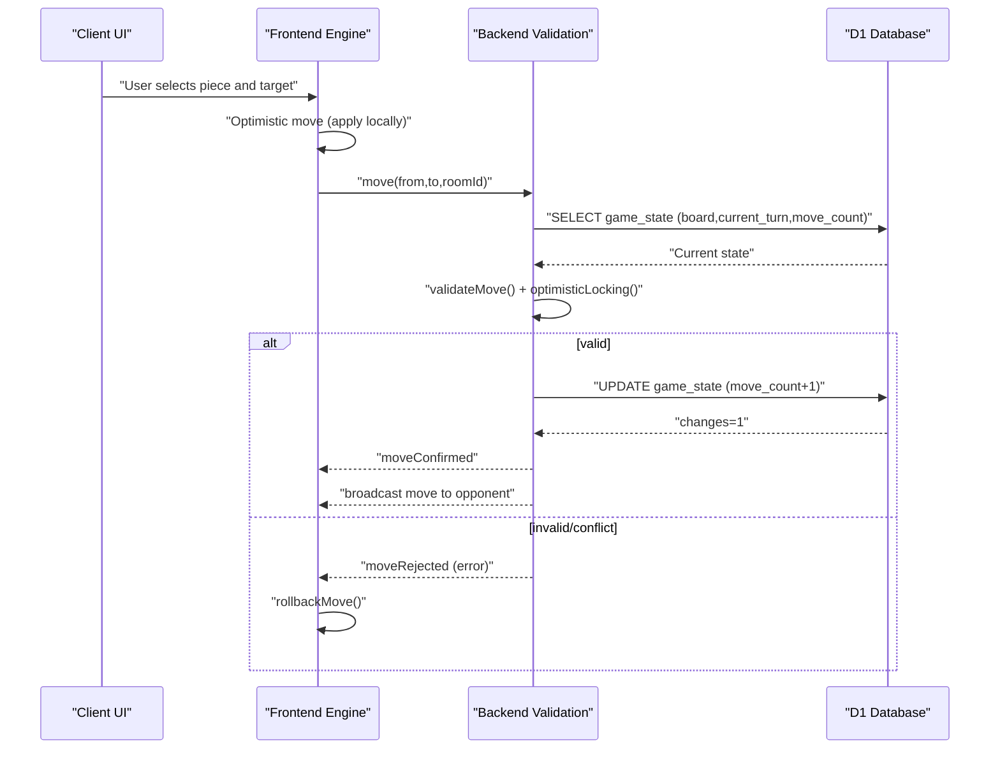
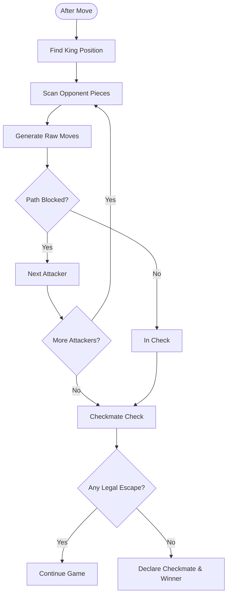
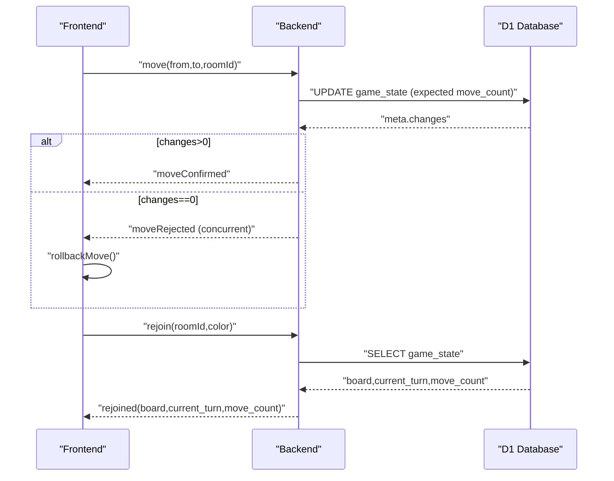
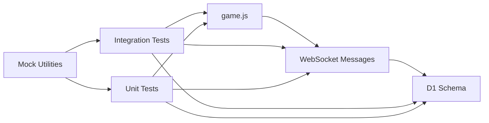

# Game Flow Integration Tests

<cite>
**Referenced Files in This Document**
- [README.md](file://README.md)
- [schema.sql](file://schema.sql)
- [game.js](file://game.js)
- [tests/integration/game-flow.test.js](file://tests/integration/game-flow.test.js)
- [tests/integration/websocket.test.js](file://tests/integration/websocket.test.js)
- [tests/integration/database.test.js](file://tests/integration/database.test.js)
- [tests/unit/chess-rules.test.js](file://tests/unit/chess-rules.test.js)
- [tests/unit/middleware-validation.test.js](file://tests/unit/middleware-validation.test.js)
- [tests/unit/room-management.test.js](file://tests/unit/room-management.test.js)
- [tests/unit/reconnection.test.js](file://tests/unit/reconnection.test.js)
- [tests/setup.js](file://tests/setup.js)
</cite>

## Table of Contents
1. [Introduction](#introduction)
2. [Project Structure](#project-structure)
3. [Core Components](#core-components)
4. [Architecture Overview](#architecture-overview)
5. [Detailed Component Analysis](#detailed-component-analysis)
6. [Dependency Analysis](#dependency-analysis)
7. [Performance Considerations](#performance-considerations)
8. [Troubleshooting Guide](#troubleshooting-guide)
9. [Conclusion](#conclusion)
10. [Appendices](#appendices)

## Introduction
This document provides comprehensive integration testing guidance for the Chinese Chess game, focusing on end-to-end game flow, player interactions, and state synchronization. It covers the complete game cycle from room initialization through player matching, turn-based gameplay, and game completion. It also documents move validation, check/checkmate detection, special rule enforcement, player coordination (turn management, state broadcasting, conflict resolution), multi-player scenarios, spectator mode considerations, replay capabilities, edge cases (draws, resignations, termination), and performance/memory/state consistency validation.

## Project Structure
The project follows a clear separation of concerns:
- Frontend game logic and UI rendering in a single JavaScript module
- Database schema for rooms, players, and game state persisted via Cloudflare D1
- Integration tests validating end-to-end flows across frontend, backend, and database
- Unit tests validating chess rules, middleware validation, room lifecycle, and reconnection logic
- Mock utilities enabling deterministic testing of asynchronous flows

**Diagram sources**
- [game.js:1-1319](file://game.js#L1-1319)
- [schema.sql:1-42](file://schema.sql#L1-42)
- [tests/integration/game-flow.test.js:1-749](file://tests/integration/game-flow.test.js#L1-749)
- [tests/integration/websocket.test.js:1-404](file://tests/integration/websocket.test.js#L1-404)
- [tests/integration/database.test.js:1-371](file://tests/integration/database.test.js#L1-371)
- [tests/unit/chess-rules.test.js:1-670](file://tests/unit/chess-rules.test.js#L1-670)
- [tests/unit/middleware-validation.test.js:1-416](file://tests/unit/middleware-validation.test.js#L1-416)
- [tests/unit/room-management.test.js:1-446](file://tests/unit/room-management.test.js#L1-446)
- [tests/unit/reconnection.test.js:1-594](file://tests/unit/reconnection.test.js#L1-594)
- [tests/setup.js:1-231](file://tests/setup.js#L1-231)

**Section sources**
- [README.md:123-175](file://README.md#L123-L175)
- [schema.sql:1-42](file://schema.sql#L1-42)
- [tests/setup.js:1-231](file://tests/setup.js#L1-231)

## Core Components
- Frontend game engine and UI renderer
  - Manages board state, piece movement, turn logic, check detection, and UI rendering
  - Implements optimistic move application and rollback on rejection
  - Handles WebSocket connection, heartbeat, polling, and reconnection
- Database schema and operations
  - Stores rooms, players, and game state with indexes for performance
  - Supports optimistic locking via move_count comparisons
- Integration tests
  - Validate full game flow: room creation/join, move validation, turn enforcement, state sync, and WebSocket messaging
- Unit tests
  - Validate chess rules, middleware validation, stale room detection, and reconnection logic

**Section sources**
- [game.js:1-1319](file://game.js#L1-1319)
- [schema.sql:1-42](file://schema.sql#L1-42)
- [tests/integration/game-flow.test.js:1-749](file://tests/integration/game-flow.test.js#L1-749)
- [tests/unit/chess-rules.test.js:1-670](file://tests/unit/chess-rules.test.js#L1-670)
- [tests/unit/middleware-validation.test.js:1-416](file://tests/unit/middleware-validation.test.js#L1-416)
- [tests/unit/room-management.test.js:1-446](file://tests/unit/room-management.test.js#L1-446)
- [tests/unit/reconnection.test.js:1-594](file://tests/unit/reconnection.test.js#L1-594)

## Architecture Overview
The integration test suite validates the end-to-end pipeline:
- Room lifecycle: create/join, status transitions, and cleanup
- Move lifecycle: validation, optimistic application, broadcasting, and conflict resolution
- State synchronization: database persistence, optimistic locking, and recovery
- Real-time communication: WebSocket messages for room events, moves, and reconnection

**Diagram sources**
- [tests/integration/game-flow.test.js:278-335](file://tests/integration/game-flow.test.js#L278-335)
- [tests/integration/websocket.test.js:127-226](file://tests/integration/websocket.test.js#L127-226)
- [tests/integration/database.test.js:147-201](file://tests/integration/database.test.js#L147-201)
- [tests/unit/middleware-validation.test.js:200-241](file://tests/unit/middleware-validation.test.js#L200-241)
- [tests/unit/reconnection.test.js:57-106](file://tests/unit/reconnection.test.js#L57-106)

## Detailed Component Analysis

### Room Lifecycle and Matching
- Room creation and joining
  - Validates room name and ID normalization
  - Assigns colors and transitions room status to playing upon second player join
  - Tracks player connections and last-seen timestamps
- Stale room detection
  - Uses AND-based logic to avoid incorrectly marking rooms as stale when players are disconnected but recently active
  - Prevents cleanup of active games and ensures robust room lifecycle management

**Diagram sources**
- [tests/integration/database.test.js:83-145](file://tests/integration/database.test.js#L83-145)
- [tests/unit/room-management.test.js:99-213](file://tests/unit/room-management.test.js#L99-213)

**Section sources**
- [tests/integration/database.test.js:83-145](file://tests/integration/database.test.js#L83-145)
- [tests/unit/room-management.test.js:99-213](file://tests/unit/room-management.test.js#L99-213)

### Turn-Based Gameplay and Move Validation
- Move validation pipeline
  - Piece presence and ownership checks
  - Turn enforcement against game state
  - Optimistic locking via move_count comparison
- Move execution and broadcasting
  - Optimistic UI update followed by server-side validation
  - Broadcast to opponent and confirmation/rejection handling
  - Rollback on rejection to maintain consistency

**Diagram sources**
- [tests/integration/game-flow.test.js:500-555](file://tests/integration/game-flow.test.js#L500-555)
- [tests/unit/middleware-validation.test.js:95-123](file://tests/unit/middleware-validation.test.js#L95-123)
- [tests/integration/websocket.test.js:228-277](file://tests/integration/websocket.test.js#L228-277)

**Section sources**
- [tests/integration/game-flow.test.js:500-555](file://tests/integration/game-flow.test.js#L500-555)
- [tests/unit/middleware-validation.test.js:95-123](file://tests/unit/middleware-validation.test.js#L95-123)
- [tests/integration/websocket.test.js:228-277](file://tests/integration/websocket.test.js#L228-277)

### Check and Checkmate Detection
- Check detection
  - Validates if opponent’s pieces can attack the king position considering all piece-specific movement rules
  - Handles blocking pieces and special rules (e.g., flying general)
- Checkmate detection
  - Verifies if any legal move exists for the king or any piece to escape check
  - Ends the game and declares a winner upon successful capture of the opposing king

**Diagram sources**
- [tests/unit/chess-rules.test.js:588-632](file://tests/unit/chess-rules.test.js#L588-632)
- [tests/integration/game-flow.test.js:608-652](file://tests/integration/game-flow.test.js#L608-652)

**Section sources**
- [tests/unit/chess-rules.test.js:588-632](file://tests/unit/chess-rules.test.js#L588-632)
- [tests/integration/game-flow.test.js:608-652](file://tests/integration/game-flow.test.js#L608-652)

### State Synchronization and Conflict Resolution
- Database state persistence
  - Saves board, current turn, move count, and updated timestamps
  - Supports batch operations for room initialization and cleanup
- Optimistic locking
  - Compares expected move_count before applying updates
  - Rejects conflicting moves and triggers client rollback
- Reconnection and recovery
  - Restores board, turn, and move count from database
  - Prevents race conditions by verifying disconnection before allowing rejoin

**Diagram sources**
- [tests/integration/database.test.js:147-201](file://tests/integration/database.test.js#L147-201)
- [tests/unit/middleware-validation.test.js:117-123](file://tests/unit/middleware-validation.test.js#L117-123)
- [tests/unit/reconnection.test.js:57-106](file://tests/unit/reconnection.test.js#L57-106)

**Section sources**
- [tests/integration/database.test.js:147-201](file://tests/integration/database.test.js#L147-201)
- [tests/unit/middleware-validation.test.js:117-123](file://tests/unit/middleware-validation.test.js#L117-123)
- [tests/unit/reconnection.test.js:57-106](file://tests/unit/reconnection.test.js#L57-106)

### Multiplayer Scenarios, Spectator Mode, and Replay
- Multiplayer scenarios
  - Room creation/joining, turn alternation, move broadcasting, and game termination
- Spectator mode
  - Conceptual extension: broadcast move updates to observers without altering game state
- Replay capabilities
  - Store last_move and move_count to reconstruct game history
  - Use move_count for optimistic locking to prevent replay conflicts

**Section sources**
- [tests/integration/game-flow.test.js:278-335](file://tests/integration/game-flow.test.js#L278-335)
- [tests/integration/websocket.test.js:228-277](file://tests/integration/websocket.test.js#L228-277)
- [schema.sql:15-25](file://schema.sql#L15-L25)

### Edge Cases: Draws, Resignations, Termination
- Draw conditions
  - Insufficient material, mutual agreement, or stalemate (if implemented) should be handled by declaring draw and ending the game
- Resignations
  - Graceful termination signaling with reason and winner declaration
- Termination scenarios
  - Checkmate detection and game over messaging
  - Disconnection handling with reconnection and state recovery

**Section sources**
- [tests/integration/websocket.test.js:379-403](file://tests/integration/websocket.test.js#L379-403)
- [tests/integration/game-flow.test.js:608-652](file://tests/integration/game-flow.test.js#L608-652)

## Dependency Analysis
The integration tests exercise the following dependencies:
- Frontend depends on WebSocket APIs and D1 database abstractions
- Backend depends on D1 for persistence and WebSocket for real-time messaging
- Tests depend on mock utilities to simulate asynchronous flows deterministically

**Diagram sources**
- [game.js:1-1319](file://game.js#L1-1319)
- [schema.sql:1-42](file://schema.sql#L1-42)
- [tests/integration/game-flow.test.js:1-749](file://tests/integration/game-flow.test.js#L1-749)
- [tests/integration/websocket.test.js:1-404](file://tests/integration/websocket.test.js#L1-404)
- [tests/integration/database.test.js:1-371](file://tests/integration/database.test.js#L1-371)
- [tests/setup.js:1-231](file://tests/setup.js#L1-231)

**Section sources**
- [tests/setup.js:1-231](file://tests/setup.js#L1-231)

## Performance Considerations
- Concurrency and optimistic locking
  - Use move_count comparisons to minimize conflicts and reduce rollbacks
- Database indexing
  - Leverage existing indexes on rooms, players, and game_state to optimize lookups
- Memory usage
  - Avoid retaining large board states unnecessarily; rely on database snapshots for recovery
- Network resilience
  - Implement heartbeat and exponential backoff for reconnection to reduce load on servers

[No sources needed since this section provides general guidance]

## Troubleshooting Guide
Common issues and resolutions:
- Concurrent move conflicts
  - Symptom: moveRejected with concurrent move error
  - Resolution: client rolls back and retries after refresh
- Stale room cleanup mistakes
  - Symptom: rooms disappearing prematurely
  - Resolution: verify AND-based stale detection logic and ensure active games are not cleaned
- Reconnection race conditions
  - Symptom: rejoin succeeds despite original player still connected
  - Resolution: enforce connection verification before allowing rejoin

**Section sources**
- [tests/integration/game-flow.test.js:500-555](file://tests/integration/game-flow.test.js#L500-555)
- [tests/unit/room-management.test.js:139-176](file://tests/unit/room-management.test.js#L139-176)
- [tests/unit/reconnection.test.js:191-211](file://tests/unit/reconnection.test.js#L191-211)

## Conclusion
The integration test suite comprehensively validates the Chinese Chess game flow, ensuring correctness of room lifecycle, move validation, turn enforcement, state synchronization, and conflict resolution. By combining frontend behavior, backend validation, and database persistence, the tests provide confidence in real-time multiplayer gameplay, reconnection, and edge-case handling.

[No sources needed since this section summarizes without analyzing specific files]

## Appendices

### Test Execution Commands
- Run all tests: npm test
- Watch mode: npm run test:watch
- Coverage: npm run test:coverage

**Section sources**
- [README.md:125-138](file://README.md#L125-L138)