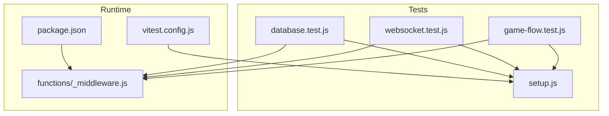
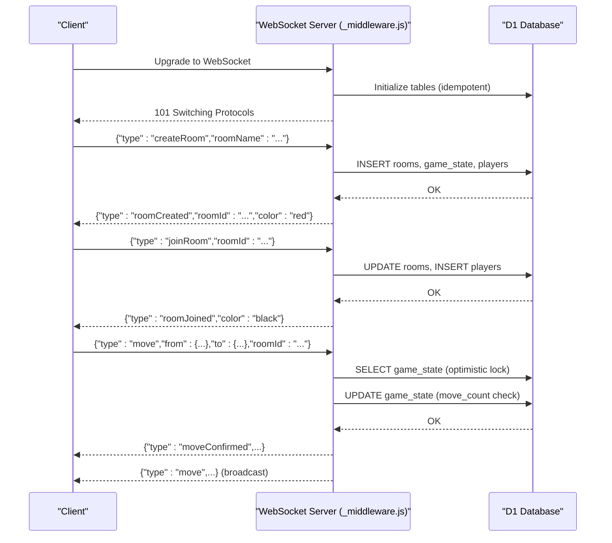
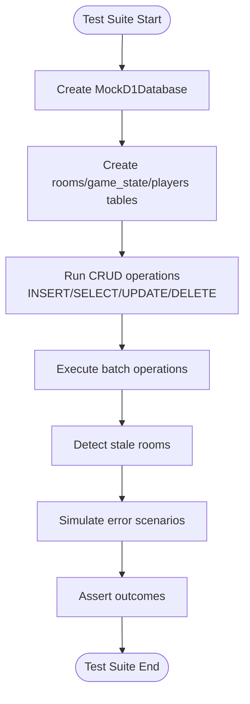
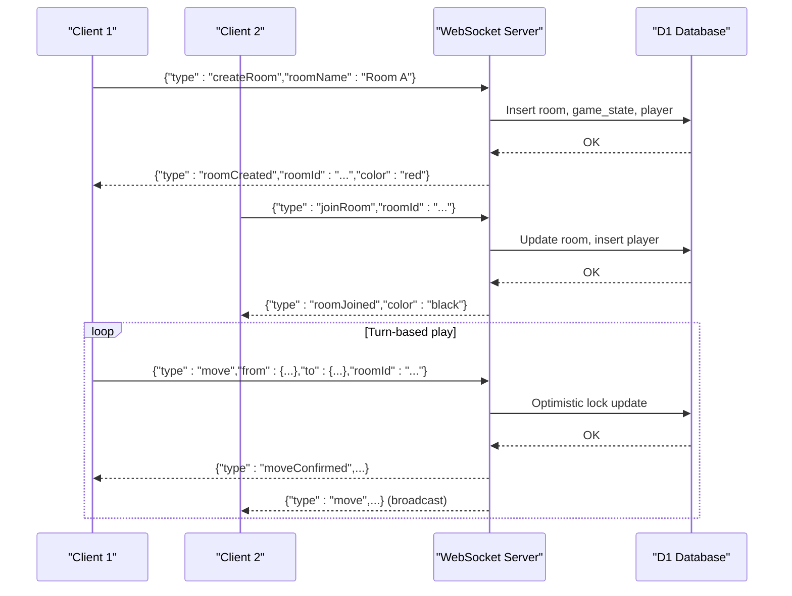
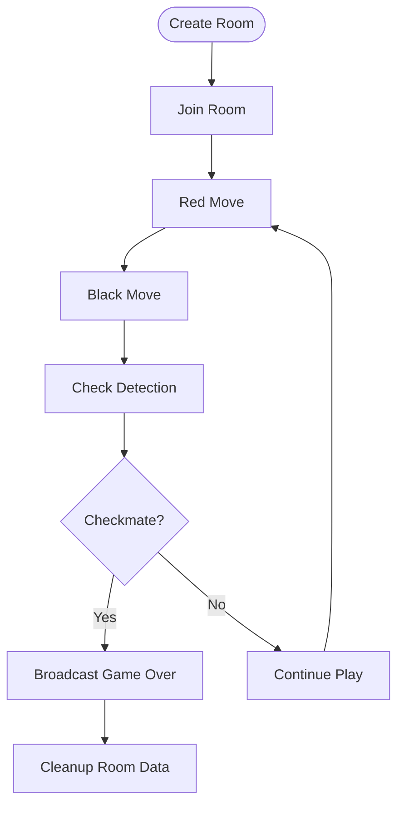
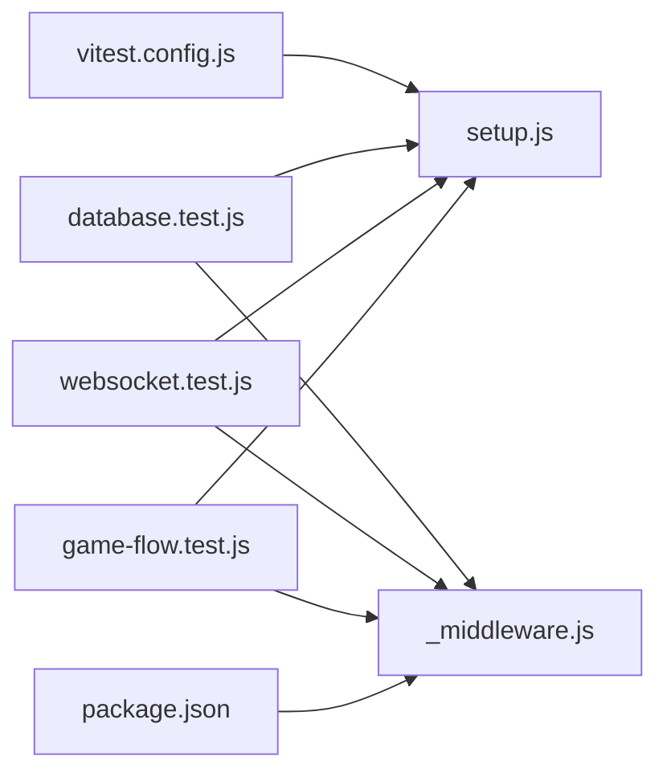

# Integration Testing

<cite>
**Referenced Files in This Document**
- [database.test.js](file://tests/integration/database.test.js)
- [websocket.test.js](file://tests/integration/websocket.test.js)
- [game-flow.test.js](file://tests/integration/game-flow.test.js)
- [setup.js](file://tests/setup.js)
- [vitest.config.js](file://vitest.config.js)
- [_middleware.js](file://functions/_middleware.js)
- [package.json](file://package.json)
</cite>

## Table of Contents
1. [Introduction](#introduction)
2. [Project Structure](#project-structure)
3. [Core Components](#core-components)
4. [Architecture Overview](#architecture-overview)
5. [Detailed Component Analysis](#detailed-component-analysis)
6. [Dependency Analysis](#dependency-analysis)
7. [Performance Considerations](#performance-considerations)
8. [Troubleshooting Guide](#troubleshooting-guide)
9. [Conclusion](#conclusion)
10. [Appendices](#appendices)

## Introduction
This document provides comprehensive integration testing guidance for the Chinese Chess project. It covers end-to-end system testing approaches, focusing on:
- Database integration tests for D1 operations, transactions, and data consistency
- WebSocket integration tests for real-time communication, message routing, and connection lifecycle
- Game flow integration tests validating complete scenarios, player interactions, and state synchronization
- Test setup patterns for database connections, WebSocket servers, and mock environments
- Strategies for data seeding, cleanup, and testing distributed system components under network failures and concurrent access

## Project Structure
The integration tests are organized under the tests/integration directory and leverage a shared test setup module that provides mock implementations for D1 and WebSocket. The Vitest configuration sets up jsdom and loads the test setup automatically.

**Diagram sources**
- [database.test.js:1-371](file://tests/integration/database.test.js#L1-L371)
- [websocket.test.js:1-404](file://tests/integration/websocket.test.js#L1-L404)
- [game-flow.test.js:1-749](file://tests/integration/game-flow.test.js#L1-L749)
- [setup.js:1-231](file://tests/setup.js#L1-L231)
- [vitest.config.js:1-24](file://vitest.config.js#L1-L24)
- [_middleware.js:104-122](file://functions/_middleware.js#L104-L122)

**Section sources**
- [vitest.config.js:1-24](file://vitest.config.js#L1-L24)
- [setup.js:1-231](file://tests/setup.js#L1-L231)

## Core Components
- MockD1Database and MockStatement: Provide deterministic, in-memory D1-like behavior for tests, including prepared statements, batch operations, and helper methods for seeding and clearing data.
- MockWebSocket: Simulates WebSocket connection lifecycle events (open, message, close, error) and supports manual triggers for testing server-side logic without a real WebSocket server.
- Test fixtures and helpers: Shared helper functions to create tables, boards, and test contexts for database and WebSocket scenarios.

Key responsibilities:
- Isolation: Each test suite initializes its own mock database instance to avoid cross-test interference.
- Determinism: Mocks return predictable results enabling repeatable assertions.
- Coverage: Tests span initialization, CRUD operations, batch operations, error handling, and end-to-end flows.

**Section sources**
- [setup.js:64-170](file://tests/setup.js#L64-L170)
- [setup.js:7-62](file://tests/setup.js#L7-L62)

## Architecture Overview
The integration tests mirror the runtime architecture: a WebSocket upgrade handler manages connections and routes messages to handlers that interact with the D1-backed game state.

**Diagram sources**
- [_middleware.js:104-122](file://functions/_middleware.js#L104-L122)
- [_middleware.js:131-185](file://functions/_middleware.js#L131-L185)
- [_middleware.js:282-351](file://functions/_middleware.js#L282-L351)
- [_middleware.js:353-443](file://functions/_middleware.js#L353-L443)
- [_middleware.js:522-683](file://functions/_middleware.js#L522-L683)

## Detailed Component Analysis

### Database Integration Tests
These tests validate D1 operations, room persistence, game state storage, player tracking, batch operations, stale room detection, and error handling.

- Initialization and schema: Verifies creation of rooms, game_state, and players tables.
- Room operations: Create, find by name, update status, delete room.
- Game state operations: Save initial state, update after moves, record last move.
- Player operations: Add player, update connection status, count connected players, remove on disconnect.
- Batch operations: Execute multiple statements atomically and clean up related data.
- Stale room detection: Detect rooms with no players or with disconnected players.
- Error handling: Duplicate room name, missing fields, invalid SQL.

**Diagram sources**
- [database.test.js:12-44](file://tests/integration/database.test.js#L12-L44)
- [database.test.js:91-145](file://tests/integration/database.test.js#L91-L145)
- [database.test.js:155-201](file://tests/integration/database.test.js#L155-L201)
- [database.test.js:211-266](file://tests/integration/database.test.js#L211-L266)
- [database.test.js:276-305](file://tests/integration/database.test.js#L276-L305)
- [database.test.js:307-340](file://tests/integration/database.test.js#L307-L340)
- [database.test.js:342-371](file://tests/integration/database.test.js#L342-L371)

**Section sources**
- [database.test.js:54-81](file://tests/integration/database.test.js#L54-L81)
- [database.test.js:83-145](file://tests/integration/database.test.js#L83-L145)
- [database.test.js:147-201](file://tests/integration/database.test.js#L147-L201)
- [database.test.js:203-266](file://tests/integration/database.test.js#L203-L266)
- [database.test.js:268-305](file://tests/integration/database.test.js#L268-L305)
- [database.test.js:307-340](file://tests/integration/database.test.js#L307-L340)
- [database.test.js:342-371](file://tests/integration/database.test.js#L342-L371)

### WebSocket Integration Tests
These tests validate WebSocket connection lifecycle, message handling, room creation/joining, move synchronization, heartbeat, error handling, reconnection, and disconnection.

- Connection lifecycle: Open, close, error simulation.
- Message handling: JSON parsing, createRoom, joinRoom, move.
- Room creation: Valid name, empty name, room ID generation.
- Room joining: Color assignment, room full/not found scenarios.
- Move synchronization: Broadcast to opponent, confirmation, rejection, turn enforcement.
- Heartbeat: Ping/Pong handling.
- Error handling: Unknown message type, malformed JSON, database errors.
- Reconnection: Rejoin request, restore game state.
- Disconnection: Notify opponent, update player status.

**Diagram sources**
- [websocket.test.js:127-177](file://tests/integration/websocket.test.js#L127-L177)
- [websocket.test.js:179-226](file://tests/integration/websocket.test.js#L179-L226)
- [websocket.test.js:228-277](file://tests/integration/websocket.test.js#L228-L277)
- [websocket.test.js:279-305](file://tests/integration/websocket.test.js#L279-L305)
- [websocket.test.js:307-342](file://tests/integration/websocket.test.js#L307-L342)
- [websocket.test.js:344-377](file://tests/integration/websocket.test.js#L344-L377)
- [websocket.test.js:379-403](file://tests/integration/websocket.test.js#L379-L403)

**Section sources**
- [websocket.test.js:33-67](file://tests/integration/websocket.test.js#L33-L67)
- [websocket.test.js:69-125](file://tests/integration/websocket.test.js#L69-L125)
- [websocket.test.js:127-177](file://tests/integration/websocket.test.js#L127-L177)
- [websocket.test.js:179-226](file://tests/integration/websocket.test.js#L179-L226)
- [websocket.test.js:228-277](file://tests/integration/websocket.test.js#L228-L277)
- [websocket.test.js:279-305](file://tests/integration/websocket.test.js#L279-L305)
- [websocket.test.js:307-342](file://tests/integration/websocket.test.js#L307-L342)
- [websocket.test.js:344-377](file://tests/integration/websocket.test.js#L344-L377)
- [websocket.test.js:379-403](file://tests/integration/websocket.test.js#L379-L403)

### Game Flow Integration Tests
These tests validate end-to-end game scenarios: create room, join, turn enforcement, move validation, optimistic locking, check/checkmate detection, and WebSocket synchronization.

- Complete game flow: Create → Join → Play → Check → Checkmate.
- Move rejection: Empty square, opponent piece, game over.
- Turn enforcement: Reject moves outside turn.
- Board synchronization: Save/load state, consistent state between players.
- Concurrent move handling: Optimistic locking with move_count comparison.
- Check detection: King under attack, path blocked.
- Checkmate detection: King captured, winner determination.
- WebSocket integration: Move messages, confirmations, rejections, game over broadcasts.

**Diagram sources**
- [game-flow.test.js:278-335](file://tests/integration/game-flow.test.js#L278-L335)
- [game-flow.test.js:337-381](file://tests/integration/game-flow.test.js#L337-L381)
- [game-flow.test.js:383-427](file://tests/integration/game-flow.test.js#L383-L427)
- [game-flow.test.js:429-498](file://tests/integration/game-flow.test.js#L429-L498)
- [game-flow.test.js:500-555](file://tests/integration/game-flow.test.js#L500-L555)
- [game-flow.test.js:557-606](file://tests/integration/game-flow.test.js#L557-L606)
- [game-flow.test.js:608-652](file://tests/integration/game-flow.test.js#L608-L652)
- [game-flow.test.js:654-748](file://tests/integration/game-flow.test.js#L654-L748)

**Section sources**
- [game-flow.test.js:278-335](file://tests/integration/game-flow.test.js#L278-L335)
- [game-flow.test.js:337-381](file://tests/integration/game-flow.test.js#L337-L381)
- [game-flow.test.js:383-427](file://tests/integration/game-flow.test.js#L383-L427)
- [game-flow.test.js:429-498](file://tests/integration/game-flow.test.js#L429-L498)
- [game-flow.test.js:500-555](file://tests/integration/game-flow.test.js#L500-L555)
- [game-flow.test.js:557-606](file://tests/integration/game-flow.test.js#L557-L606)
- [game-flow.test.js:608-652](file://tests/integration/game-flow.test.js#L608-L652)
- [game-flow.test.js:654-748](file://tests/integration/game-flow.test.js#L654-L748)

## Dependency Analysis
The integration tests depend on:
- Mock implementations for D1 and WebSocket provided by the setup module.
- Runtime middleware for WebSocket handling and D1 interactions.
- Vitest configuration for environment setup and coverage reporting.

**Diagram sources**
- [vitest.config.js:1-24](file://vitest.config.js#L1-L24)
- [setup.js:1-231](file://tests/setup.js#L1-L231)
- [database.test.js:1-10](file://tests/integration/database.test.js#L1-L10)
- [websocket.test.js:1-10](file://tests/integration/websocket.test.js#L1-L10)
- [game-flow.test.js:1-10](file://tests/integration/game-flow.test.js#L1-L10)
- [_middleware.js:104-122](file://functions/_middleware.js#L104-L122)
- [package.json:1-28](file://package.json#L1-L28)

**Section sources**
- [vitest.config.js:1-24](file://vitest.config.js#L1-L24)
- [setup.js:1-231](file://tests/setup.js#L1-L231)
- [_middleware.js:104-122](file://functions/_middleware.js#L104-L122)
- [package.json:1-28](file://package.json#L1-L28)

## Performance Considerations
- Mock overhead: Using MockD1Database and MockWebSocket avoids external dependencies and reduces flakiness, but keep test suites focused to minimize unnecessary operations.
- Batch operations: Prefer batch inserts/updates for room setup to reduce round-trips in tests.
- Optimistic locking: Tests demonstrate the optimistic locking pattern; ensure database-backed tests also validate the same behavior for realistic performance characteristics.
- Concurrency: When simulating concurrent access, limit the number of simultaneous operations in tests to avoid timeouts and resource contention.

## Troubleshooting Guide
Common issues and resolutions:
- Database initialization failures: Ensure tables are created with idempotent statements and indexes are present.
- WebSocket upgrade failures: Verify the upgrade header and path handling in the middleware.
- Message parsing errors: Validate JSON payload structure and handle malformed messages gracefully.
- Stale room cleanup: Confirm stale detection logic and cleanup procedures for rooms with no players or disconnected players.
- Optimistic locking conflicts: Expect move rejections when move_count mismatches; adjust tests to reflect expected behavior.

**Section sources**
- [_middleware.js:46-98](file://functions/_middleware.js#L46-L98)
- [_middleware.js:131-185](file://functions/_middleware.js#L131-L185)
- [_middleware.js:231-276](file://functions/_middleware.js#L231-L276)
- [_middleware.js:479-516](file://functions/_middleware.js#L479-L516)
- [websocket.test.js:307-342](file://tests/integration/websocket.test.js#L307-L342)
- [game-flow.test.js:500-555](file://tests/integration/game-flow.test.js#L500-L555)

## Conclusion
The integration tests establish a robust foundation for validating database operations, WebSocket communication, and end-to-end game flows. By leveraging deterministic mocks and structured test patterns, the suite ensures correctness, resilience, and maintainability. Extending tests to cover distributed scenarios and network failure modes will further strengthen confidence in production deployments.

## Appendices

### Test Setup and Execution
- Environment: jsdom via Vitest configuration.
- Global setup: Loads the test setup module to configure mocks.
- Scripts: Use npm scripts to run tests and coverage.

**Section sources**
- [vitest.config.js:1-24](file://vitest.config.js#L1-L24)
- [package.json:7-17](file://package.json#L7-L17)

### Mock Utilities Reference
- MockD1Database: Provides prepare, batch, seed, and clear methods for deterministic testing.
- MockStatement: Supports bind, run, first, all, and SQL extraction.
- MockWebSocket: Simulates connection lifecycle and message handling.

**Section sources**
- [setup.js:64-170](file://tests/setup.js#L64-L170)
- [setup.js:7-62](file://tests/setup.js#L7-L62)