# WebSocket Integration Tests

<cite>
**Referenced Files in This Document**
- [websocket.test.js](file://tests/integration/websocket.test.js)
- [_middleware.js](file://functions/_middleware.js)
- [game.js](file://game.js)
- [setup.js](file://tests/setup.js)
- [heartbeat.test.js](file://tests/unit/heartbeat.test.js)
- [reconnection.test.js](file://tests/unit/reconnection.test.js)
- [game-state.test.js](file://tests/unit/game-state.test.js)
- [chess-rules.test.js](file://tests/unit/chess-rules.test.js)
</cite>

## Table of Contents
1. [Introduction](#introduction)
2. [Project Structure](#project-structure)
3. [Core Components](#core-components)
4. [Architecture Overview](#architecture-overview)
5. [Detailed Component Analysis](#detailed-component-analysis)
6. [Dependency Analysis](#dependency-analysis)
7. [Performance Considerations](#performance-considerations)
8. [Troubleshooting Guide](#troubleshooting-guide)
9. [Conclusion](#conclusion)

## Introduction
This document provides comprehensive WebSocket integration testing guidance for a real-time Chinese Chess application built on Cloudflare Pages Functions. It covers connection lifecycle management, message routing, heartbeat mechanisms, automatic reconnection, timeout handling, and message protocol validation. The testing approach leverages Vitest-based unit and integration tests, along with a custom MockWebSocket and MockD1Database to simulate server-side behavior and database operations.

## Project Structure
The WebSocket integration spans three primary areas:
- Frontend client logic and UI orchestration
- Server middleware handling WebSocket upgrades, message routing, and room/game state
- Testing infrastructure simulating client/server interactions and database behavior

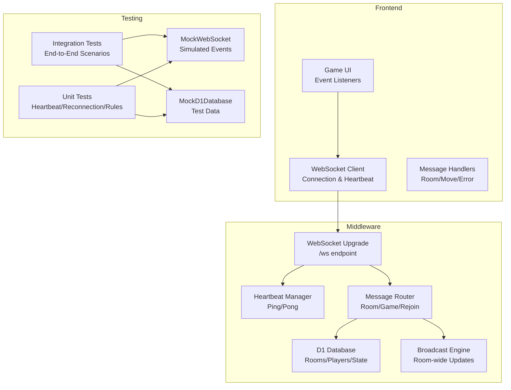

**Diagram sources**
- [game.js:740-808](file://game.js#L740-L808)
- [_middleware.js:131-185](file://functions/_middleware.js#L131-L185)
- [_middleware.js:191-225](file://functions/_middleware.js#L191-L225)
- [_middleware.js:242-276](file://functions/_middleware.js#L242-L276)
- [_middleware.js:1242-1252](file://functions/_middleware.js#L1242-L1252)
- [setup.js:8-62](file://tests/setup.js#L8-L62)
- [setup.js:64-91](file://tests/setup.js#L64-L91)

**Section sources**
- [websocket.test.js:1-404](file://tests/integration/websocket.test.js#L1-L404)
- [_middleware.js:104-122](file://functions/_middleware.js#L104-L122)
- [game.js:740-808](file://game.js#L740-L808)
- [setup.js:1-231](file://tests/setup.js#L1-L231)

## Core Components
- WebSocket client in the browser manages connection state, heartbeat, reconnection, and message handling.
- Middleware handles WebSocket upgrade, maintains per-instance connection registry, and routes messages to appropriate handlers.
- Database-backed room and game state management with optimistic locking for concurrent move handling.
- Testing utilities provide MockWebSocket and MockD1Database to simulate server behavior and database operations.

Key responsibilities:
- Connection lifecycle: accept, manage, and clean up WebSocket connections.
- Message routing: parse JSON messages and dispatch to room, game, or reconnection handlers.
- Heartbeat: periodic ping/pong to detect dead connections and trigger reconnection.
- Broadcasting: notify all room participants of game events.
- Reconnection: restore game state and player identity after disconnection.

**Section sources**
- [_middleware.js:128-156](file://functions/_middleware.js#L128-L156)
- [_middleware.js:231-276](file://functions/_middleware.js#L231-L276)
- [_middleware.js:1242-1252](file://functions/_middleware.js#L1242-L1252)
- [game.js:842-882](file://game.js#L842-L882)
- [setup.js:8-62](file://tests/setup.js#L8-L62)

## Architecture Overview
The WebSocket integration follows a request-to-WebSocket upgrade pattern, with middleware handling the upgrade and delegating message processing to dedicated handlers. The client establishes a persistent connection, periodically exchanges heartbeat messages, and relies on server-side broadcasting for real-time updates.

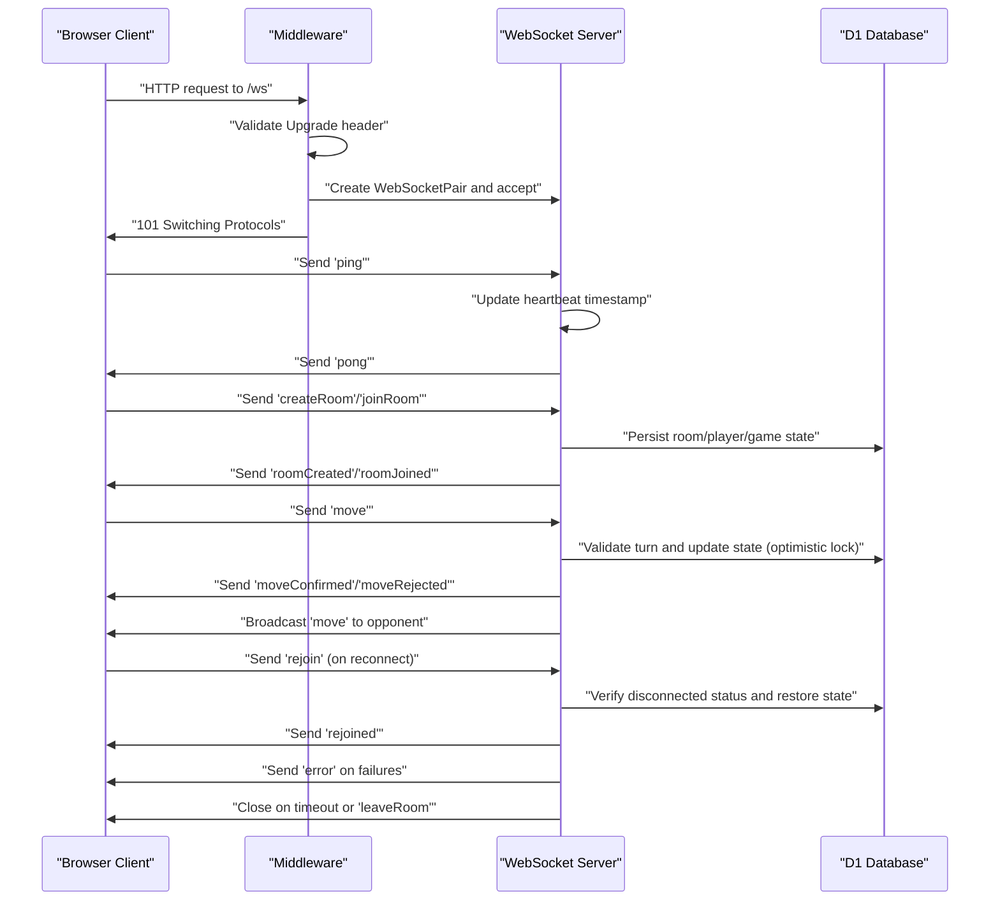

**Diagram sources**
- [_middleware.js:131-185](file://functions/_middleware.js#L131-L185)
- [_middleware.js:191-225](file://functions/_middleware.js#L191-L225)
- [_middleware.js:282-351](file://functions/_middleware.js#L282-L351)
- [_middleware.js:353-443](file://functions/_middleware.js#L353-L443)
- [_middleware.js:522-683](file://functions/_middleware.js#L522-L683)
- [_middleware.js:1086-1146](file://functions/_middleware.js#L1086-L1146)
- [game.js:888-937](file://game.js#L888-L937)

## Detailed Component Analysis

### Connection Lifecycle Management
Tests verify connection establishment, open/close events, and error handling. The middleware accepts WebSocket upgrades and initializes heartbeat timers. The client manages connection state transitions and reconnection attempts.

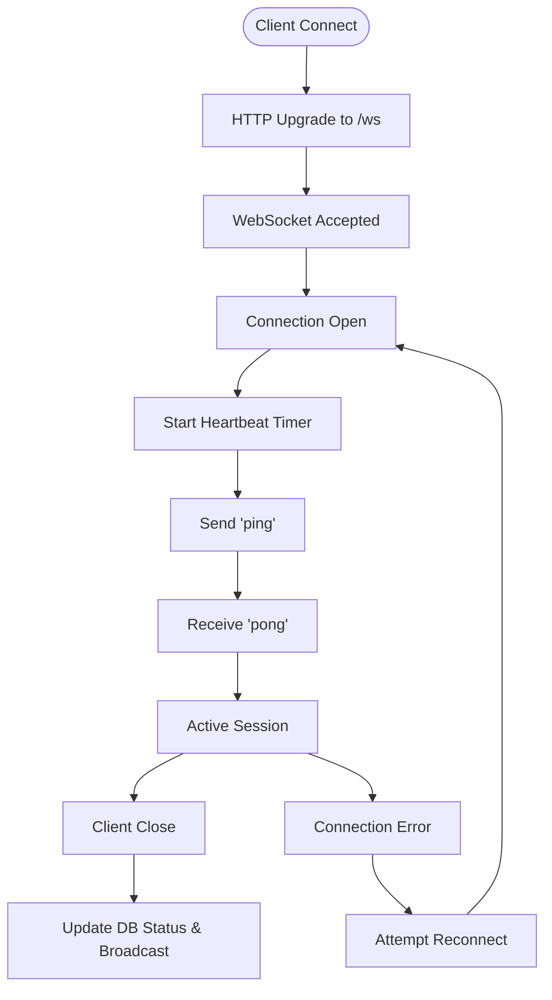

**Diagram sources**
- [_middleware.js:131-185](file://functions/_middleware.js#L131-L185)
- [_middleware.js:191-225](file://functions/_middleware.js#L191-L225)
- [game.js:810-836](file://game.js#L810-L836)

**Section sources**
- [websocket.test.js:33-67](file://tests/integration/websocket.test.js#L33-L67)
- [_middleware.js:131-185](file://functions/_middleware.js#L131-L185)
- [game.js:740-808](file://game.js#L740-L808)

### Message Routing and Protocol Validation
The middleware routes messages by type and validates payloads. Tests cover room creation/joining, move validation, and error propagation. The client sends structured JSON messages and applies authoritative server responses.

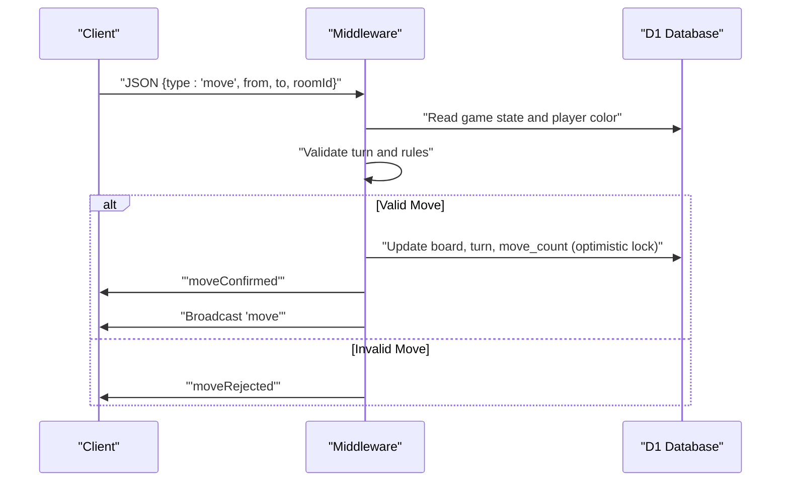

**Diagram sources**
- [_middleware.js:252-257](file://functions/_middleware.js#L252-L257)
- [_middleware.js:522-683](file://functions/_middleware.js#L522-L683)
- [websocket.test.js:228-277](file://tests/integration/websocket.test.js#L228-L277)

**Section sources**
- [websocket.test.js:69-125](file://tests/integration/websocket.test.js#L69-L125)
- [_middleware.js:242-276](file://functions/_middleware.js#L242-L276)
- [game.js:968-978](file://game.js#L968-L978)

### Heartbeat Mechanism Testing
Heartbeat ensures liveness detection and triggers reconnection when missed. The client sends periodic pings and tracks missed heartbeats. The server responds with pongs and closes idle connections beyond timeout thresholds.

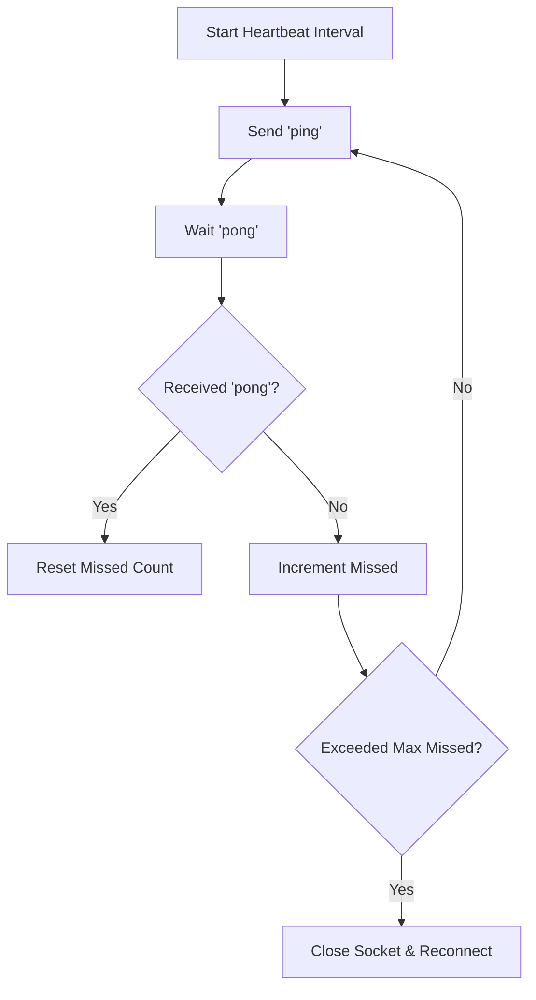

**Diagram sources**
- [heartbeat.test.js:28-63](file://tests/unit/heartbeat.test.js#L28-L63)
- [heartbeat.test.js:66-111](file://tests/unit/heartbeat.test.js#L66-L111)
- [heartbeat.test.js:355-406](file://tests/unit/heartbeat.test.js#L355-L406)
- [game.js:842-882](file://game.js#L842-L882)

**Section sources**
- [heartbeat.test.js:117-145](file://tests/unit/heartbeat.test.js#L117-L145)
- [heartbeat.test.js:147-207](file://tests/unit/heartbeat.test.js#L147-L207)
- [heartbeat.test.js:209-269](file://tests/unit/heartbeat.test.js#L209-L269)
- [heartbeat.test.js:271-313](file://tests/unit/heartbeat.test.js#L271-L313)
- [heartbeat.test.js:315-353](file://tests/unit/heartbeat.test.js#L315-L353)
- [game.js:842-882](file://game.js#L842-L882)

### Automatic Reconnection Logic
The client implements exponential backoff reconnection and restores state upon successful rejoin. The server enforces race-condition prevention by verifying the original player is disconnected before allowing reconnection.

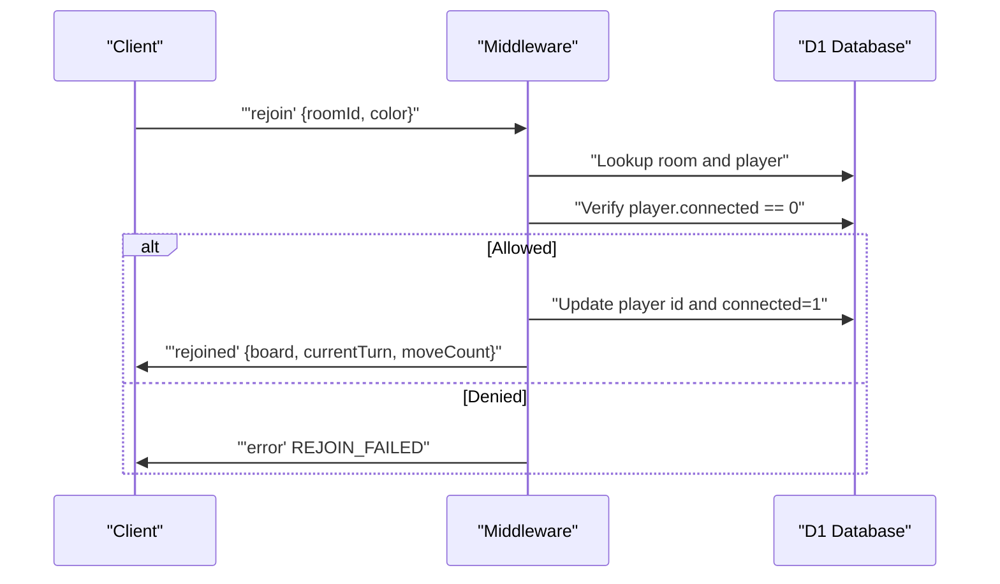

**Diagram sources**
- [reconnection.test.js:58-106](file://tests/unit/reconnection.test.js#L58-L106)
- [reconnection.test.js:139-278](file://tests/unit/reconnection.test.js#L139-L278)
- [reconnection.test.js:280-382](file://tests/unit/reconnection.test.js#L280-L382)
- [reconnection.test.js:384-514](file://tests/unit/reconnection.test.js#L384-L514)

**Section sources**
- [reconnection.test.js:139-278](file://tests/unit/reconnection.test.js#L139-L278)
- [reconnection.test.js:280-382](file://tests/unit/reconnection.test.js#L280-L382)
- [reconnection.test.js:384-514](file://tests/unit/reconnection.test.js#L384-L514)
- [websocket.test.js:344-377](file://tests/integration/websocket.test.js#L344-L377)

### Timeout Scenarios and Disconnection Handling
Timeouts close stale connections and broadcast disconnection events. The client displays appropriate UI feedback and schedules reconnection attempts.

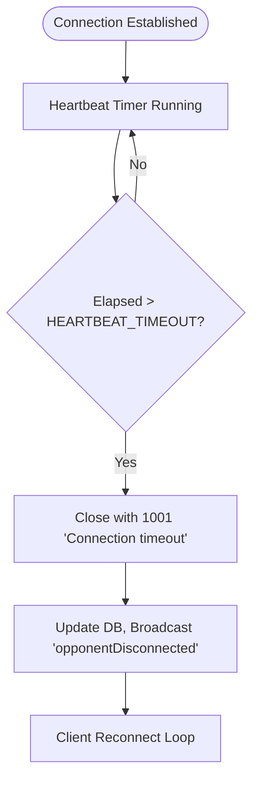

**Diagram sources**
- [_middleware.js:191-225](file://functions/_middleware.js#L191-L225)
- [_middleware.js:1213-1240](file://functions/_middleware.js#L1213-L1240)
- [game.js:810-836](file://game.js#L810-L836)

**Section sources**
- [heartbeat.test.js:271-313](file://tests/unit/heartbeat.test.js#L271-L313)
- [_middleware.js:1213-1240](file://functions/_middleware.js#L1213-L1240)
- [websocket.test.js:379-403](file://tests/integration/websocket.test.js#L379-L403)

### Message Protocol Validation
Protocol validation includes room creation/joining, move validation, and error propagation. Tests assert correct message types and payload structures.

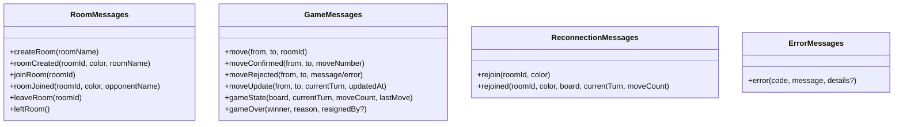

**Diagram sources**
- [websocket.test.js:127-177](file://tests/integration/websocket.test.js#L127-L177)
- [websocket.test.js:179-226](file://tests/integration/websocket.test.js#L179-L226)
- [websocket.test.js:228-277](file://tests/integration/websocket.test.js#L228-L277)
- [websocket.test.js:344-377](file://tests/integration/websocket.test.js#L344-L377)
- [websocket.test.js:307-342](file://tests/integration/websocket.test.js#L307-L342)

**Section sources**
- [websocket.test.js:127-177](file://tests/integration/websocket.test.js#L127-L177)
- [websocket.test.js:179-226](file://tests/integration/websocket.test.js#L179-L226)
- [websocket.test.js:228-277](file://tests/integration/websocket.test.js#L228-L277)
- [websocket.test.js:307-342](file://tests/integration/websocket.test.js#L307-L342)
- [websocket.test.js:344-377](file://tests/integration/websocket.test.js#L344-L377)

### Concurrent Connections and Race Condition Handling
The reconnection logic prevents race conditions by ensuring the original player is disconnected before allowing reconnection. Database queries enforce this constraint.

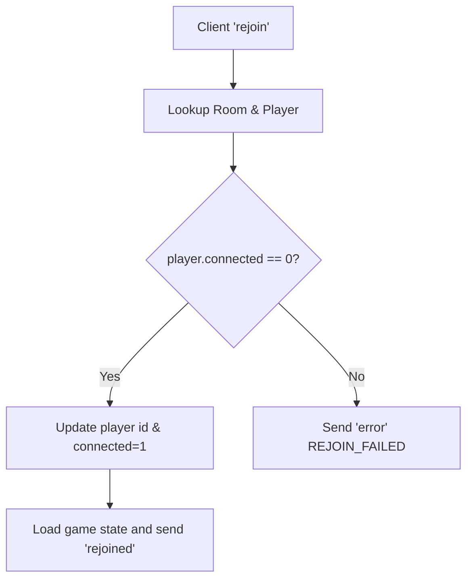

**Diagram sources**
- [reconnection.test.js:58-106](file://tests/unit/reconnection.test.js#L58-L106)
- [reconnection.test.js:191-211](file://tests/unit/reconnection.test.js#L191-L211)

**Section sources**
- [reconnection.test.js:139-278](file://tests/unit/reconnection.test.js#L139-L278)
- [reconnection.test.js:191-211](file://tests/unit/reconnection.test.js#L191-L211)

### Network Failure Simulation and Recovery
The tests simulate various failure modes: malformed JSON, unknown message types, database errors, and client-side heartbeat timeouts. The client logs errors and attempts reconnection.

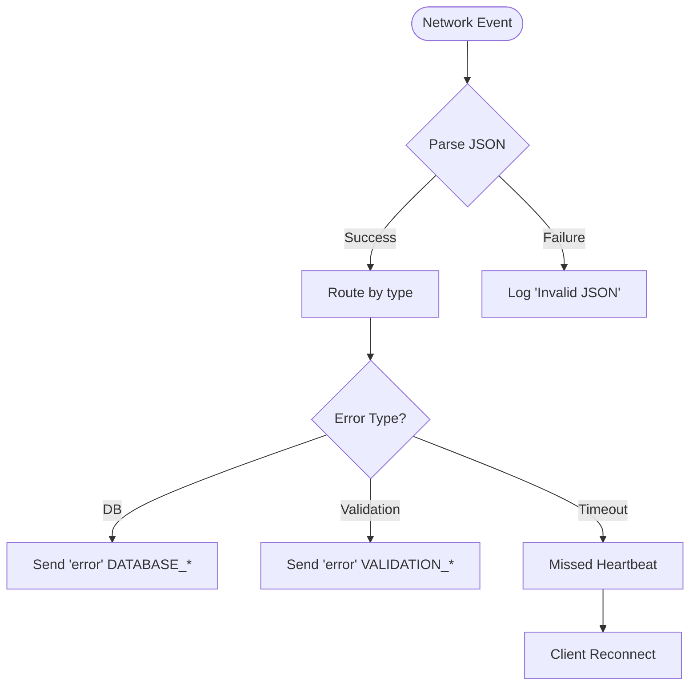

**Diagram sources**
- [_middleware.js:162-170](file://functions/_middleware.js#L162-L170)
- [heartbeat.test.js:355-406](file://tests/unit/heartbeat.test.js#L355-L406)
- [websocket.test.js:307-342](file://tests/integration/websocket.test.js#L307-L342)

**Section sources**
- [websocket.test.js:307-342](file://tests/integration/websocket.test.js#L307-L342)
- [heartbeat.test.js:355-406](file://tests/unit/heartbeat.test.js#L355-L406)

### WebSocket Frame Validation and Binary Data Handling
The tests focus on JSON text frames. Binary frame handling is not covered in the current test suite; however, the middleware expects JSON payloads and responds with JSON messages.

**Section sources**
- [websocket.test.js:76-86](file://tests/integration/websocket.test.js#L76-L86)
- [_middleware.js:162-170](file://functions/_middleware.js#L162-L170)

### Protocol Upgrade Testing
The middleware validates the Upgrade header and performs WebSocket upgrade on requests to the /ws endpoint.

**Section sources**
- [_middleware.js:115-118](file://functions/_middleware.js#L115-L118)
- [_middleware.js:131-144](file://functions/_middleware.js#L131-L144)

### Load Testing Scenarios, Connection Pooling, and Resource Cleanup
- Load testing: Use multiple MockWebSocket instances to simulate concurrent clients. Leverage the MockD1Database to batch operations and measure throughput.
- Connection pooling: The middleware maintains an in-memory connections map per instance. For horizontal scaling, consider external session stores and sticky sessions.
- Resource cleanup: Heartbeat timers are cleared on close; database updates mark players as disconnected and schedule room cleanup.

**Section sources**
- [_middleware.js:128-156](file://functions/_middleware.js#L128-L156)
- [_middleware.js:1213-1240](file://functions/_middleware.js#L1213-L1240)
- [_middleware.js:507-516](file://functions/_middleware.js#L507-L516)

## Dependency Analysis
The WebSocket integration depends on:
- Middleware for upgrade, routing, heartbeat, and broadcasting
- Database for persistent room and game state
- Client for connection management, heartbeat, and UI updates

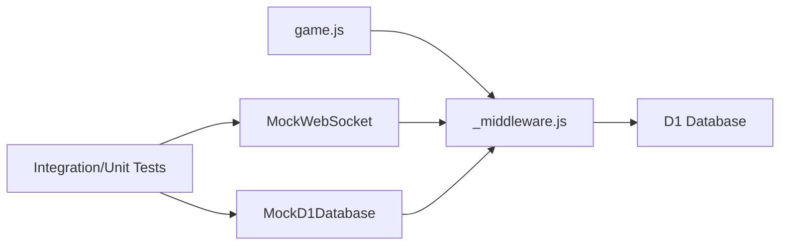

**Diagram sources**
- [game.js:740-808](file://game.js#L740-L808)
- [_middleware.js:104-122](file://functions/_middleware.js#L104-L122)
- [setup.js:8-62](file://tests/setup.js#L8-L62)
- [setup.js:64-91](file://tests/setup.js#L64-L91)

**Section sources**
- [game.js:740-808](file://game.js#L740-L808)
- [_middleware.js:104-122](file://functions/_middleware.js#L104-L122)
- [setup.js:1-231](file://tests/setup.js#L1-L231)

## Performance Considerations
- Heartbeat intervals balance responsiveness and overhead; adjust intervals based on expected network latency.
- Database operations use batched writes for room creation to minimize round trips.
- Optimistic locking reduces contention during concurrent moves; monitor conflict rates and adjust retry logic if needed.
- Broadcasting loops iterate over connections; consider partitioning rooms to reduce broadcast fanout.

## Troubleshooting Guide
Common issues and resolutions:
- Connection not upgrading: Verify Upgrade header and /ws path.
- Frequent reconnections: Investigate heartbeat timeouts and network stability.
- Move rejections: Validate move legality and turn ownership.
- Rejoin failures: Ensure original player is disconnected before allowing reconnection.

**Section sources**
- [_middleware.js:131-144](file://functions/_middleware.js#L131-L144)
- [_middleware.js:191-225](file://functions/_middleware.js#L191-L225)
- [_middleware.js:522-683](file://functions/_middleware.js#L522-L683)
- [reconnection.test.js:191-211](file://tests/unit/reconnection.test.js#L191-L211)

## Conclusion
The WebSocket integration tests comprehensively validate connection lifecycle, message routing, heartbeat mechanisms, reconnection logic, and error handling. By leveraging MockWebSocket and MockD1Database, the suite simulates realistic scenarios and ensures robust behavior under various failure modes. Extending tests to cover binary frames, concurrent load, and horizontal scaling will further strengthen the integration coverage.