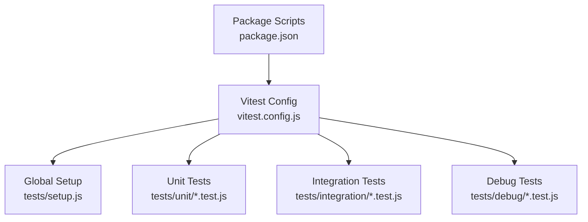
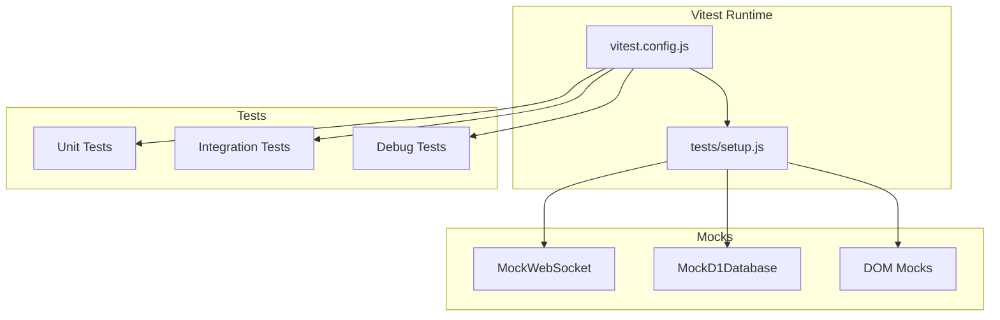
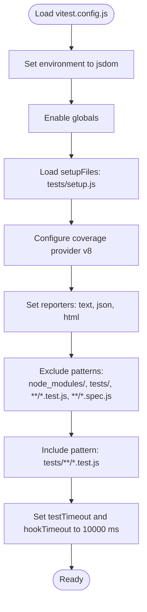
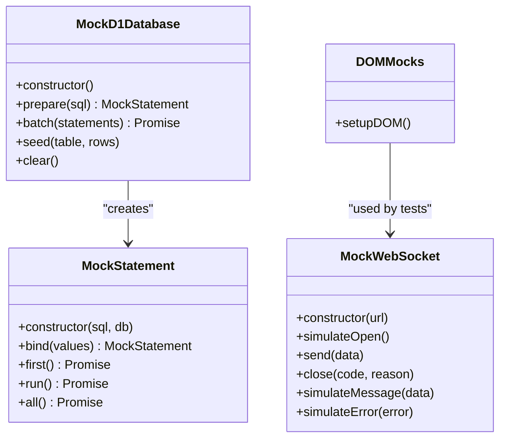
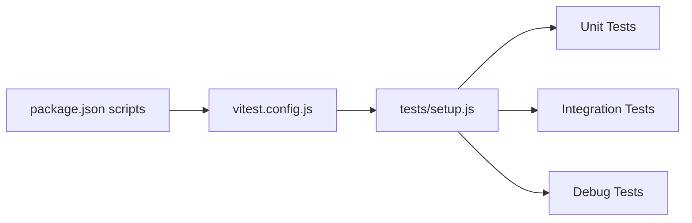

# Test Configuration

<cite>
**Referenced Files in This Document**
- [vitest.config.js](file://vitest.config.js)
- [package.json](file://package.json)
- [tests/setup.js](file://tests/setup.js)
- [tests/unit/board.test.js](file://tests/unit/board.test.js)
- [tests/unit/chess-rules.test.js](file://tests/unit/chess-rules.test.js)
- [tests/integration/database.test.js](file://tests/integration/database.test.js)
- [tests/integration/websocket.test.js](file://tests/integration/websocket.test.js)
- [tests/debug/move-debug.test.js](file://tests/debug/move-debug.test.js)
- [README.md](file://README.md)
</cite>

## Table of Contents
1. [Introduction](#introduction)
2. [Project Structure](#project-structure)
3. [Core Components](#core-components)
4. [Architecture Overview](#architecture-overview)
5. [Detailed Component Analysis](#detailed-component-analysis)
6. [Dependency Analysis](#dependency-analysis)
7. [Performance Considerations](#performance-considerations)
8. [Troubleshooting Guide](#troubleshooting-guide)
9. [Conclusion](#conclusion)
10. [Appendices](#appendices)

## Introduction
This document explains the complete test configuration and setup for the project’s testing framework. It covers Vitest configuration, environment settings, coverage reporting, timeouts, test file patterns, global setup, mock implementations, and test execution commands. It also provides guidance for watch mode, continuous integration, performance testing, parallel execution, resource management, and extending the testing framework with custom environments.

## Project Structure
The testing system is organized under the tests directory with three categories:
- unit: Pure logic tests for board, rules, and state
- integration: WebSocket and database interaction tests
- debug: Diagnostic tests for move validation and rule debugging
- setup.js: Global test setup and mocks

**Diagram sources**
- [vitest.config.js:1-24](file://vitest.config.js#L1-L24)
- [package.json:7-17](file://package.json#L7-L17)
- [tests/setup.js:1-231](file://tests/setup.js#L1-L231)

**Section sources**
- [README.md:123-151](file://README.md#L123-L151)
- [vitest.config.js:1-24](file://vitest.config.js#L1-L24)
- [package.json:7-17](file://package.json#L7-L17)

## Core Components
- Vitest configuration defines environment, global APIs, setup files, coverage, include patterns, and timeouts.
- Global setup initializes DOM mocks, WebSocket mocks, D1 database mocks, and test utilities.
- Test scripts provide run, watch, and coverage commands.

Key configuration highlights:
- Environment: jsdom
- Globals enabled
- Setup file: tests/setup.js
- Coverage provider: v8
- Reporters: text, json, html
- Exclusions: node_modules, tests, *.test.js, *.spec.js
- Include pattern: tests/**/*.test.js
- Timeouts: testTimeout and hookTimeout set to 10000 ms

**Section sources**
- [vitest.config.js:4-22](file://vitest.config.js#L4-L22)
- [package.json:11-13](file://package.json#L11-L13)

## Architecture Overview
The test architecture centers around Vitest with jsdom for DOM simulation and a custom setup module that provides mocks for WebSocket, D1 database, and DOM APIs. Tests are categorized by unit and integration, with dedicated helpers and mocks.

**Diagram sources**
- [vitest.config.js:4-22](file://vitest.config.js#L4-L22)
- [tests/setup.js:7-230](file://tests/setup.js#L7-L230)

## Detailed Component Analysis

### Vitest Configuration
- Environment: jsdom enables DOM APIs in tests.
- Globals: true allows using Vitest APIs without imports.
- SetupFiles: loads tests/setup.js for global mocks and utilities.
- Coverage:
  - Provider: v8
  - Reporters: text, json, html
  - Exclude: node_modules, tests, *.test.js, *.spec.js
- Include: tests/**/*.test.js
- Timeouts: testTimeout and hookTimeout at 10000 ms

**Diagram sources**
- [vitest.config.js:4-22](file://vitest.config.js#L4-L22)

**Section sources**
- [vitest.config.js:4-22](file://vitest.config.js#L4-L22)

### Global Test Setup and Mocks
The setup module provides:
- MockWebSocket with helpers to simulate open/close/message/error events and synchronous onopen triggering.
- MockD1Database and MockStatement simulating D1 operations (prepare, batch, first, run, all) with simple in-memory storage keyed by table names.
- DOM mocks for document/window/WebSocket/console to enable DOM-dependent unit tests.
- Utility exports: MockWebSocket, MockD1Database, MockStatement, createMockEnv, setupDOM.

**Diagram sources**
- [tests/setup.js:8-230](file://tests/setup.js#L8-L230)

**Section sources**
- [tests/setup.js:1-231](file://tests/setup.js#L1-L231)

### Test Execution Commands
- Run all tests: npm test
- Watch mode: npm run test:watch
- Coverage: npm run test:coverage

These commands are defined in package.json and integrate with Vitest configuration.

**Section sources**
- [package.json:11-13](file://package.json#L11-L13)

### Test Categories and Patterns
- Unit tests validate pure logic (board layout, piece movement rules, game state).
- Integration tests validate WebSocket communication and D1 database operations.
- Debug tests isolate and diagnose specific rule behaviors.

Examples of test categories:
- Unit: board.test.js, chess-rules.test.js, game-state.test.js
- Integration: websocket.test.js, database.test.js
- Debug: move-debug.test.js

**Section sources**
- [README.md:140-151](file://README.md#L140-L151)
- [tests/unit/board.test.js:1-312](file://tests/unit/board.test.js#L1-L312)
- [tests/unit/chess-rules.test.js:1-670](file://tests/unit/chess-rules.test.js#L1-L670)
- [tests/integration/websocket.test.js:1-404](file://tests/integration/websocket.test.js#L1-L404)
- [tests/integration/database.test.js:1-371](file://tests/integration/database.test.js#L1-L371)
- [tests/debug/move-debug.test.js:1-262](file://tests/debug/move-debug.test.js#L1-L262)

### Coverage Reporting Setup
Coverage is configured with:
- Provider: v8
- Reporters: text, json, html
- Exclusions: node_modules, tests, *.test.js, *.spec.js

This ensures coverage excludes generated artifacts and test files themselves, focusing on source code.

**Section sources**
- [vitest.config.js:9-17](file://vitest.config.js#L9-L17)

### Timeout Configuration
- testTimeout: 10000 ms
- hookTimeout: 10000 ms

These values apply to asynchronous operations and lifecycle hooks in tests.

**Section sources**
- [vitest.config.js:20-21](file://vitest.config.js#L20-L21)

### Continuous Integration Setup
To run tests in CI:
- Install dependencies
- Execute npm test for non-watch runs
- Optionally run npm run test:coverage to produce coverage reports

The repository does not include a CI configuration file; configure your CI provider to run the npm scripts defined in package.json.

**Section sources**
- [package.json:11-13](file://package.json#L11-L13)

### Performance Testing and Resource Management
- The project does not include explicit performance tests or resource limits in the configuration.
- For performance-sensitive scenarios, consider adding dedicated benchmarks or adjusting timeouts and concurrency settings as needed.

[No sources needed since this section provides general guidance]

### Extending the Testing Framework
Guidelines for custom environments and extensions:
- Add new setup files to tests/setup.js or create additional setup modules and reference them via setupFiles.
- Extend mocks for new browser APIs or backend services by adding to the setup module.
- Introduce new test categories by placing files under tests/ with the .test.js extension; they will be included automatically by the include pattern.

**Section sources**
- [vitest.config.js:8](file://vitest.config.js#L8)
- [vitest.config.js:19](file://vitest.config.js#L19)
- [tests/setup.js:1-231](file://tests/setup.js#L1-L231)

## Dependency Analysis
The test runtime depends on:
- Vitest configuration for environment, coverage, and include patterns
- Global setup for mocks and DOM environment
- Test scripts for execution commands

**Diagram sources**
- [package.json:7-17](file://package.json#L7-L17)
- [vitest.config.js:4-22](file://vitest.config.js#L4-L22)
- [tests/setup.js:1-231](file://tests/setup.js#L1-L231)

**Section sources**
- [package.json:7-17](file://package.json#L7-L17)
- [vitest.config.js:4-22](file://vitest.config.js#L4-L22)

## Performance Considerations
- Adjust testTimeout and hookTimeout in vitest.config.js if tests require longer execution windows.
- Use watch mode for iterative development: npm run test:watch.
- Keep coverage exclusions minimal to reduce report generation overhead.

[No sources needed since this section provides general guidance]

## Troubleshooting Guide
Common issues and resolutions:
- Missing DOM APIs in tests: Ensure jsdom environment is active and setupDOM is used where needed.
- WebSocket-related failures: Verify MockWebSocket usage and event simulation helpers.
- D1-related failures: Confirm MockD1Database and MockStatement are initialized and seeded as required.
- Slow tests: Increase timeouts temporarily to diagnose flakiness; then optimize logic or mocks.

**Section sources**
- [vitest.config.js:6-7](file://vitest.config.js#L6-L7)
- [tests/setup.js:179-221](file://tests/setup.js#L179-L221)
- [tests/integration/websocket.test.js:34-67](file://tests/integration/websocket.test.js#L34-L67)
- [tests/integration/database.test.js:54-81](file://tests/integration/database.test.js#L54-L81)

## Conclusion
The testing framework is configured with jsdom, global APIs, and comprehensive coverage reporting. The setup module provides robust mocks for DOM, WebSocket, and D1 database, enabling reliable unit and integration tests. Use the provided scripts for execution and watch modes, and extend the setup for custom environments as needed.

[No sources needed since this section summarizes without analyzing specific files]

## Appendices

### Appendix A: Test Execution Commands
- Run all tests: npm test
- Watch mode: npm run test:watch
- Coverage: npm run test:coverage

**Section sources**
- [package.json:11-13](file://package.json#L11-L13)

### Appendix B: Test File Patterns
- Include pattern: tests/**/*.test.js
- Exclusions: node_modules, tests, *.test.js, *.spec.js

**Section sources**
- [vitest.config.js:19](file://vitest.config.js#L19)
- [vitest.config.js:12-17](file://vitest.config.js#L12-L17)