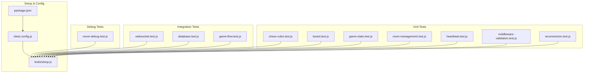
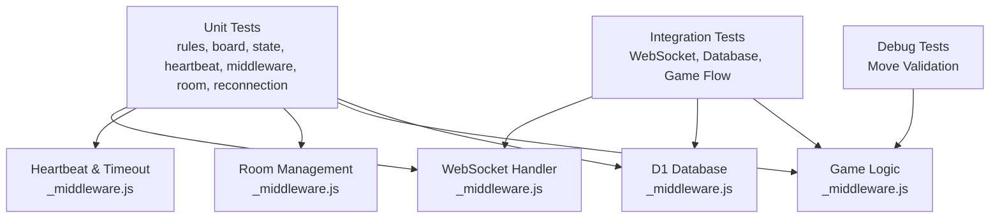
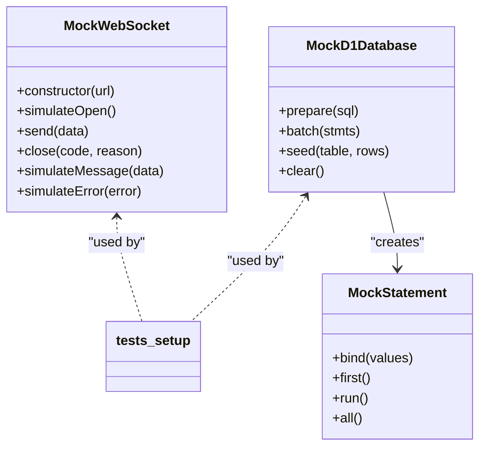
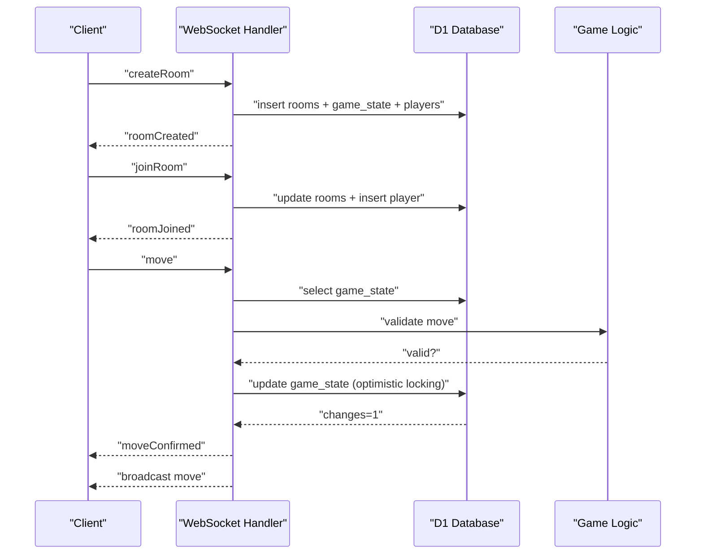
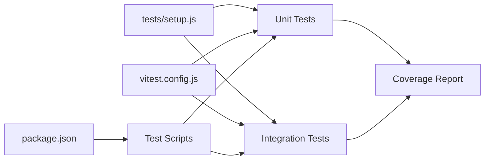

# Testing Strategy

<cite>
**Referenced Files in This Document**
- [tests/setup.js](file://tests/setup.js)
- [vitest.config.js](file://vitest.config.js)
- [package.json](file://package.json)
- [tests/unit/chess-rules.test.js](file://tests/unit/chess-rules.test.js)
- [tests/unit/board.test.js](file://tests/unit/board.test.js)
- [tests/unit/game-state.test.js](file://tests/unit/game-state.test.js)
- [tests/unit/room-management.test.js](file://tests/unit/room-management.test.js)
- [tests/unit/heartbeat.test.js](file://tests/unit/heartbeat.test.js)
- [tests/unit/middleware-validation.test.js](file://tests/unit/middleware-validation.test.js)
- [tests/unit/reconnection.test.js](file://tests/unit/reconnection.test.js)
- [tests/integration/websocket.test.js](file://tests/integration/websocket.test.js)
- [tests/integration/database.test.js](file://tests/integration/database.test.js)
- [tests/integration/game-flow.test.js](file://tests/integration/game-flow.test.js)
- [tests/debug/move-debug.test.js](file://tests/debug/move-debug.test.js)
- [_middleware.js](file://functions/_middleware.js)
</cite>

## Table of Contents
1. [Introduction](#introduction)
2. [Project Structure](#project-structure)
3. [Core Components](#core-components)
4. [Architecture Overview](#architecture-overview)
5. [Detailed Component Analysis](#detailed-component-analysis)
6. [Dependency Analysis](#dependency-analysis)
7. [Performance Considerations](#performance-considerations)
8. [Troubleshooting Guide](#troubleshooting-guide)
9. [Conclusion](#conclusion)
10. [Appendices](#appendices)

## Introduction
This document describes the complete testing strategy for the Chinese Chess project. It covers the test suite structure, unit and integration testing approaches, test configuration and setup, mocking strategies, debugging tools, coverage analysis, CI setup, execution commands, watch mode, and coverage reporting. It also provides guidelines for writing new tests and maintaining test quality, along with considerations for performance and load testing and test environment setup.

## Project Structure
The test suite is organized into three layers:
- Unit tests: Validate individual components such as chess rules, board logic, game state, middleware validations, heartbeat, room management, and reconnection logic.
- Integration tests: Validate end-to-end flows across WebSocket communication, database operations, and full game flow.
- Debug tests: Dedicated diagnostics for specific issues (e.g., move validation).

Key configuration and setup:
- Vitest configuration defines environment, coverage, test inclusion, and timeouts.
- A shared setup file provides mocks for WebSocket, D1 database, and DOM for browser-like environments.

**Diagram sources**
- [tests/unit/chess-rules.test.js:1-670](file://tests/unit/chess-rules.test.js#L1-L670)
- [tests/unit/board.test.js:1-312](file://tests/unit/board.test.js#L1-L312)
- [tests/unit/game-state.test.js:1-311](file://tests/unit/game-state.test.js#L1-L311)
- [tests/unit/room-management.test.js:1-446](file://tests/unit/room-management.test.js#L1-L446)
- [tests/unit/heartbeat.test.js:1-467](file://tests/unit/heartbeat.test.js#L1-L467)
- [tests/unit/middleware-validation.test.js:1-416](file://tests/unit/middleware-validation.test.js#L1-L416)
- [tests/unit/reconnection.test.js:1-594](file://tests/unit/reconnection.test.js#L1-L594)
- [tests/integration/websocket.test.js:1-404](file://tests/integration/websocket.test.js#L1-L404)
- [tests/integration/database.test.js:1-371](file://tests/integration/database.test.js#L1-L371)
- [tests/integration/game-flow.test.js:1-749](file://tests/integration/game-flow.test.js#L1-L749)
- [tests/debug/move-debug.test.js:1-262](file://tests/debug/move-debug.test.js#L1-L262)
- [tests/setup.js:1-231](file://tests/setup.js#L1-L231)
- [vitest.config.js:1-24](file://vitest.config.js#L1-L24)
- [package.json:1-28](file://package.json#L1-L28)

**Section sources**
- [vitest.config.js:1-24](file://vitest.config.js#L1-L24)
- [tests/setup.js:1-231](file://tests/setup.js#L1-L231)
- [package.json:1-28](file://package.json#L1-L28)

## Core Components
- Test framework: Vitest with jsdom environment.
- Coverage: v8 provider with text, json, html reporters.
- Mocks: Custom WebSocket, D1 database, and DOM helpers for browser-like testing.
- Test categories:
  - Unit: Rules validation, board logic, game state, middleware validation, heartbeat, room lifecycle, reconnection.
  - Integration: WebSocket messaging, database operations, end-to-end game flow.
  - Debug: Isolated diagnostics for move validation scenarios.

Execution commands:
- Run all tests: npm test
- Watch mode: npm run test:watch
- Coverage: npm run test:coverage

**Section sources**
- [vitest.config.js:1-24](file://vitest.config.js#L1-L24)
- [package.json:1-28](file://package.json#L1-L28)
- [tests/setup.js:1-231](file://tests/setup.js#L1-L231)

## Architecture Overview
The testing architecture aligns with the backend’s modular design:
- WebSocket handler and middleware orchestrate connection, room management, and game logic.
- Database operations are encapsulated behind D1 APIs and validated via integration tests.
- Frontend logic (game state, UI) is tested via unit tests and debug tests.

**Diagram sources**
- [_middleware.js:104-122](file://functions/_middleware.js#L104-L122)
- [_middleware.js:131-185](file://functions/_middleware.js#L131-L185)
- [_middleware.js:479-497](file://functions/_middleware.js#L479-L497)
- [_middleware.js:522-683](file://functions/_middleware.js#L522-L683)
- [_middleware.js:755-789](file://functions/_middleware.js#L755-L789)

## Detailed Component Analysis

### Unit Testing Strategy
- Chess Rules Validation: Comprehensive coverage of piece movement rules, palace constraints, river crossing, and check detection.
- Board Logic: Board initialization, piece movement, serialization/deserialization, and state validation.
- Game State: Turn management, move counting, game over conditions, check tracking, and serialization.
- Middleware Validation: Input sanitization, optimistic locking, piece and turn validation.
- Heartbeat: Server/client heartbeat intervals, timeout thresholds, and dead connection detection.
- Room Management: Room lifecycle, stale room detection (AND-based logic), room ID generation, and cleanup.
- Reconnection: Race condition prevention, state recovery, and connection ID updates.

**Diagram sources**
- [tests/setup.js:8-62](file://tests/setup.js#L8-L62)
- [tests/setup.js:65-170](file://tests/setup.js#L65-L170)

**Section sources**
- [tests/unit/chess-rules.test.js:1-670](file://tests/unit/chess-rules.test.js#L1-L670)
- [tests/unit/board.test.js:1-312](file://tests/unit/board.test.js#L1-L312)
- [tests/unit/game-state.test.js:1-311](file://tests/unit/game-state.test.js#L1-L311)
- [tests/unit/middleware-validation.test.js:1-416](file://tests/unit/middleware-validation.test.js#L1-L416)
- [tests/unit/heartbeat.test.js:1-467](file://tests/unit/heartbeat.test.js#L1-L467)
- [tests/unit/room-management.test.js:1-446](file://tests/unit/room-management.test.js#L1-L446)
- [tests/unit/reconnection.test.js:1-594](file://tests/unit/reconnection.test.js#L1-L594)
- [tests/setup.js:1-231](file://tests/setup.js#L1-L231)

### Integration Testing Strategy
- WebSocket Communication: Connection lifecycle, message handling (create/join/leave/move/rejoin), heartbeat, error handling, and reconnection.
- Database Operations: Schema initialization, room/player/game state CRUD, batch operations, stale room cleanup, and optimistic locking.
- End-to-End Game Flow: Complete flow from room creation to game completion, including turn enforcement, move validation, check/checkmate detection, and state synchronization.

**Diagram sources**
- [_middleware.js:282-351](file://functions/_middleware.js#L282-L351)
- [_middleware.js:353-443](file://functions/_middleware.js#L353-L443)
- [_middleware.js:522-683](file://functions/_middleware.js#L522-L683)
- [tests/integration/websocket.test.js:127-177](file://tests/integration/websocket.test.js#L127-L177)
- [tests/integration/database.test.js:83-145](file://tests/integration/database.test.js#L83-L145)
- [tests/integration/game-flow.test.js:278-335](file://tests/integration/game-flow.test.js#L278-L335)

**Section sources**
- [tests/integration/websocket.test.js:1-404](file://tests/integration/websocket.test.js#L1-L404)
- [tests/integration/database.test.js:1-371](file://tests/integration/database.test.js#L1-L371)
- [tests/integration/game-flow.test.js:1-749](file://tests/integration/game-flow.test.js#L1-L749)
- [_middleware.js:282-351](file://functions/_middleware.js#L282-L351)
- [_middleware.js:522-683](file://functions/_middleware.js#L522-L683)

### Debugging Tools and Techniques
- Move Debug Test: Validates initial move scenarios for pawns and chariots, logs valid moves, and ensures serialization correctness.
- Console logging: Used in debug tests to trace move validation and state transitions.
- Isolation: Separate debug test file allows focused investigation without affecting other suites.

**Section sources**
- [tests/debug/move-debug.test.js:1-262](file://tests/debug/move-debug.test.js#L1-L262)

## Dependency Analysis
- Test setup provides shared mocks and environment helpers.
- Unit tests depend on setup mocks for DOM/WebSocket/D1.
- Integration tests depend on setup mocks plus backend middleware logic.
- Coverage excludes tests and generated artifacts to focus on source coverage.

**Diagram sources**
- [tests/setup.js:1-231](file://tests/setup.js#L1-L231)
- [vitest.config.js:1-24](file://vitest.config.js#L1-L24)
- [package.json:1-28](file://package.json#L1-L28)

**Section sources**
- [tests/setup.js:1-231](file://tests/setup.js#L1-L231)
- [vitest.config.js:1-24](file://vitest.config.js#L1-L24)
- [package.json:1-28](file://package.json#L1-L28)

## Performance Considerations
- Test execution timeouts are configured to accommodate asynchronous operations (WebSocket, database).
- Mocks minimize external dependencies and improve test speed.
- Coverage reports help identify hotspots for refactoring or optimization.
- For performance/load testing beyond unit/integration scope, consider:
  - Measuring WebSocket message throughput and latency.
  - Benchmarking database write/read patterns under concurrent moves.
  - Simulating network partitions and reconnection under load.

[No sources needed since this section provides general guidance]

## Troubleshooting Guide
Common issues and resolutions:
- WebSocket connection failures: Verify MockWebSocket readiness and event simulation.
- Database operation errors: Ensure table creation and schema alignment with middleware expectations.
- Optimistic locking conflicts: Validate move_count usage and error handling for concurrent moves.
- Stale room detection: Confirm AND-based logic and player connectivity timestamps.
- Reconnection race conditions: Enforce disconnection verification before allowing rejoin.

**Section sources**
- [tests/integration/websocket.test.js:307-342](file://tests/integration/websocket.test.js#L307-L342)
- [tests/integration/database.test.js:342-370](file://tests/integration/database.test.js#L342-L370)
- [tests/unit/middleware-validation.test.js:200-241](file://tests/unit/middleware-validation.test.js#L200-L241)
- [tests/unit/room-management.test.js:99-213](file://tests/unit/room-management.test.js#L99-L213)
- [tests/unit/reconnection.test.js:139-278](file://tests/unit/reconnection.test.js#L139-L278)

## Conclusion
The test suite comprehensively validates the backend logic, frontend interactions, and end-to-end gameplay. It leverages robust mocking, clear separation of concerns across unit and integration tests, and strong coverage reporting. The debugging tools enable rapid diagnosis of edge cases. Adhering to the guidelines below will ensure continued reliability and maintainability.

## Appendices

### Test Execution Commands
- Run all tests: npm test
- Watch mode: npm run test:watch
- Coverage: npm run test:coverage

**Section sources**
- [package.json:1-28](file://package.json#L1-L28)

### Coverage Reporting
- Provider: v8
- Reporters: text, json, html
- Exclusions: node_modules, tests, *.test.js, *.spec.js

**Section sources**
- [vitest.config.js:9-18](file://vitest.config.js#L9-L18)

### Writing New Tests
Guidelines:
- Place unit tests under tests/unit/<component>.test.js.
- Place integration tests under tests/integration/<area>.test.js.
- Use the shared setup file for mocks and environment.
- Keep tests isolated and deterministic.
- Prefer descriptive describe/it names and meaningful assertions.
- Add debug tests for complex scenarios requiring iterative investigation.

**Section sources**
- [tests/setup.js:1-231](file://tests/setup.js#L1-L231)

### Continuous Integration Setup
- Configure CI to install dependencies and run npm test.
- Publish coverage reports using the configured v8 provider.
- Optionally cache node_modules and wrangler binaries for faster builds.

**Section sources**
- [package.json:1-28](file://package.json#L1-L28)
- [vitest.config.js:9-18](file://vitest.config.js#L9-L18)