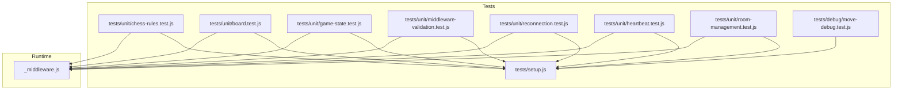
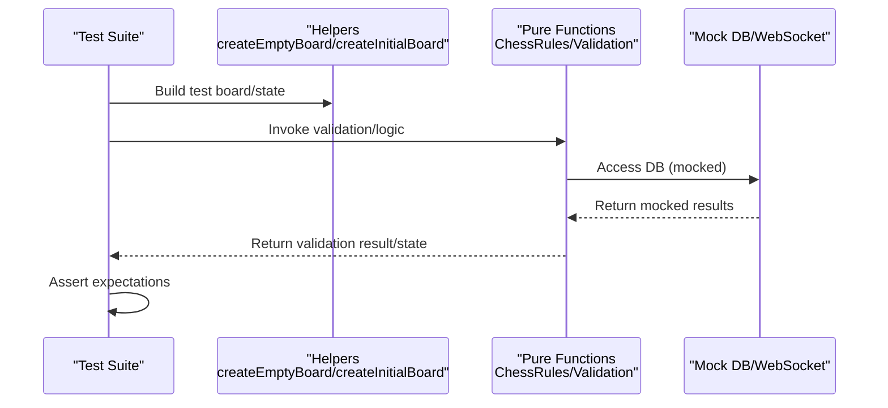
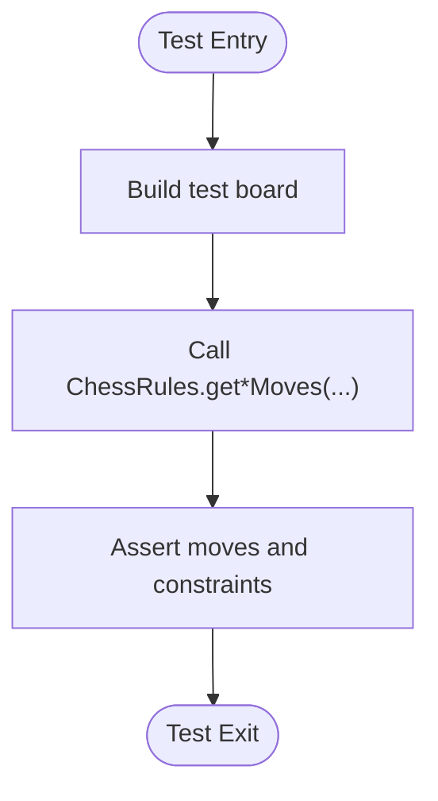
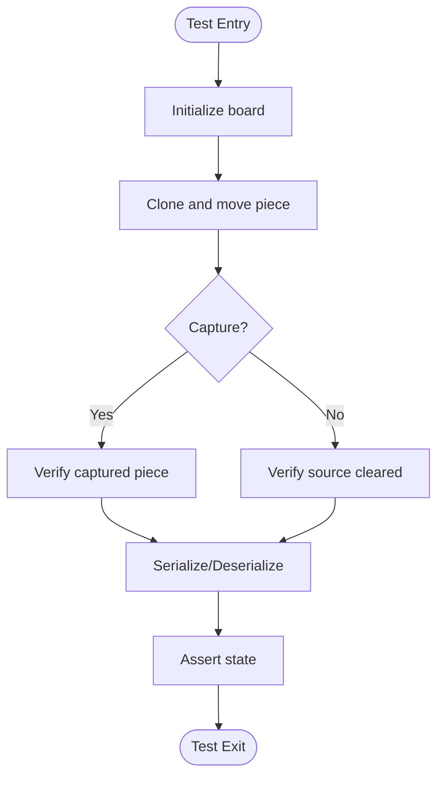
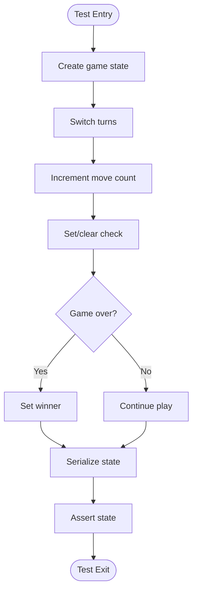
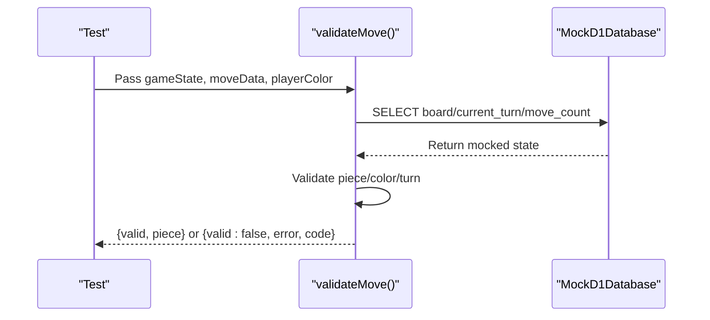
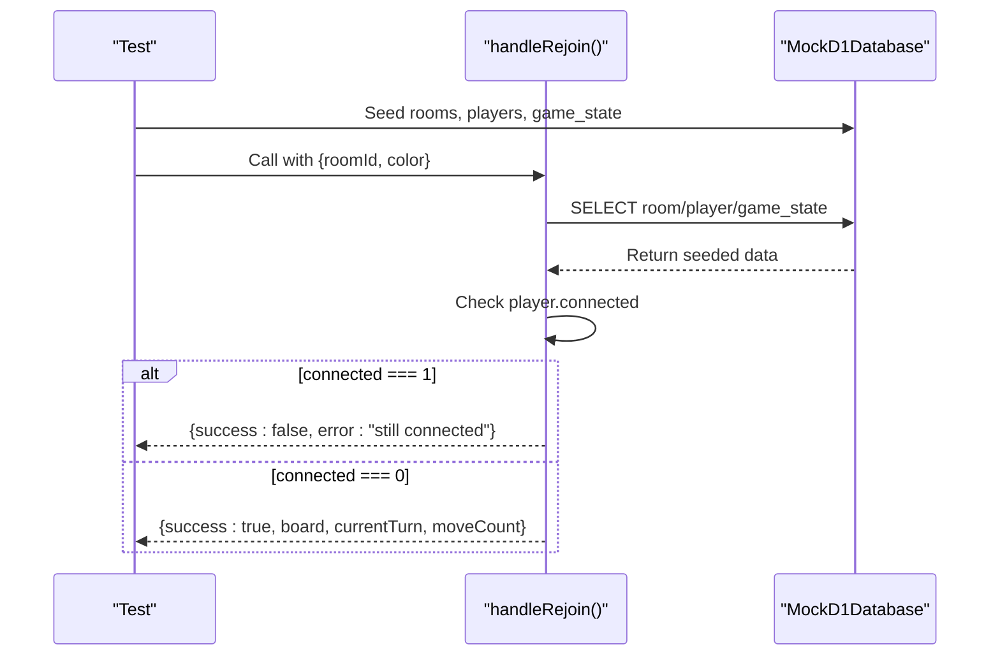
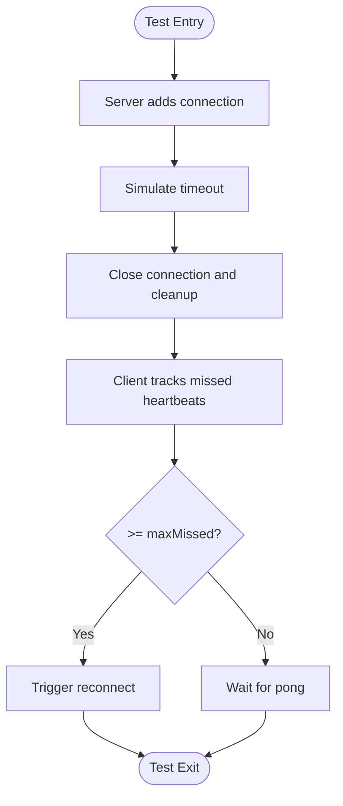
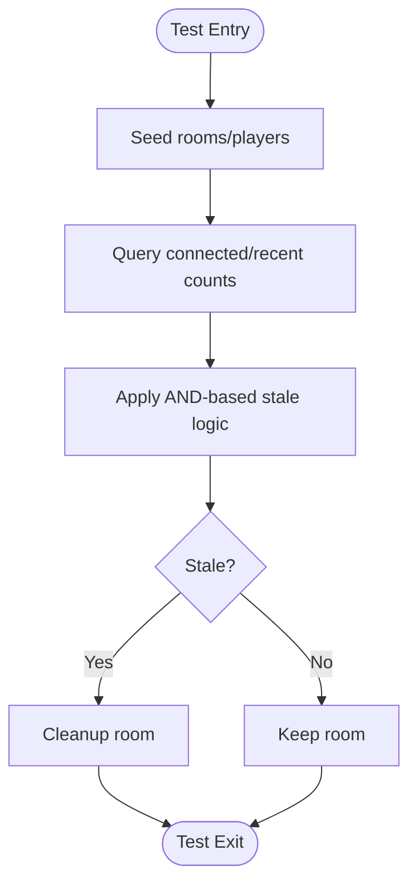
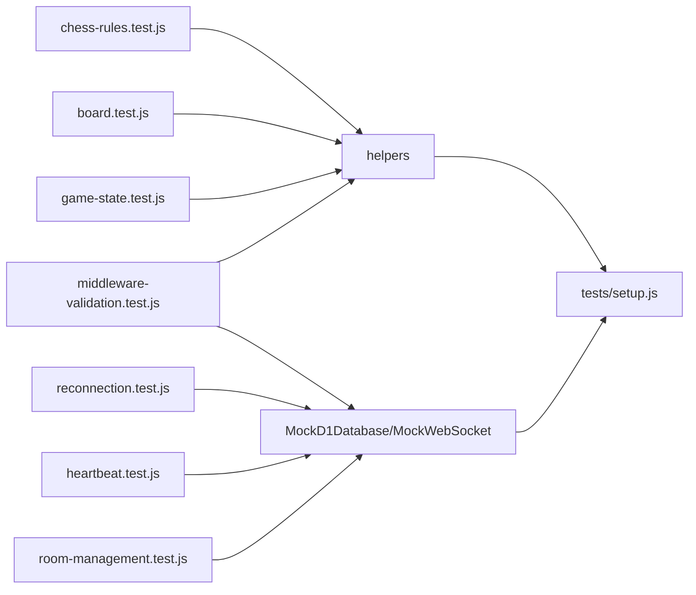

# Unit Testing

<cite>
**Referenced Files in This Document**
- [chess-rules.test.js](file://tests/unit/chess-rules.test.js)
- [board.test.js](file://tests/unit/board.test.js)
- [game-state.test.js](file://tests/unit/game-state.test.js)
- [middleware-validation.test.js](file://tests/unit/middleware-validation.test.js)
- [reconnection.test.js](file://tests/unit/reconnection.test.js)
- [heartbeat.test.js](file://tests/unit/heartbeat.test.js)
- [room-management.test.js](file://tests/unit/room-management.test.js)
- [setup.js](file://tests/setup.js)
- [vitest.config.js](file://vitest.config.js)
- [_middleware.js](file://functions/_middleware.js)
- [move-debug.test.js](file://tests/debug/move-debug.test.js)
</cite>

## Table of Contents
1. [Introduction](#introduction)
2. [Project Structure](#project-structure)
3. [Core Components](#core-components)
4. [Architecture Overview](#architecture-overview)
5. [Detailed Component Analysis](#detailed-component-analysis)
6. [Dependency Analysis](#dependency-analysis)
7. [Performance Considerations](#performance-considerations)
8. [Troubleshooting Guide](#troubleshooting-guide)
9. [Conclusion](#conclusion)
10. [Appendices](#appendices)

## Introduction
This document provides comprehensive unit testing guidance for the Chinese Chess project. It focuses on isolated component testing strategies for:
- Chess rules validation
- Board logic implementation
- Game state management
- Middleware validation (input, optimistic locking, piece/turn validation)
- Reconnection mechanisms
- Heartbeat monitoring
- Room management

It explains test structure, assertion patterns, and mocking strategies used for isolated testing, with practical examples and guidelines for writing effective unit tests while maintaining test isolation.

## Project Structure
The repository organizes unit tests under tests/unit with dedicated suites for each subsystem. Shared test utilities and mocks live under tests/setup.js. Vitest is configured to load the setup file globally and run tests with jsdom.

**Diagram sources**
- [chess-rules.test.js](file://tests/unit/chess-rules.test.js)
- [board.test.js](file://tests/unit/board.test.js)
- [game-state.test.js](file://tests/unit/game-state.test.js)
- [middleware-validation.test.js](file://tests/unit/middleware-validation.test.js)
- [reconnection.test.js](file://tests/unit/reconnection.test.js)
- [heartbeat.test.js](file://tests/unit/heartbeat.test.js)
- [room-management.test.js](file://tests/unit/room-management.test.js)
- [setup.js](file://tests/setup.js)
- [_middleware.js](file://functions/_middleware.js)

**Section sources**
- [vitest.config.js](file://vitest.config.js)
- [setup.js](file://tests/setup.js)

## Core Components
This section outlines the primary units under test and their roles in isolation.

- Chess Rules Validation
  - Validates piece movement rules, palace constraints, flying general rule, and check detection.
  - Tested via pure functions and helper boards.

- Board Logic
  - Tests board initialization, piece movement, serialization/deserialization, and state validation.

- Game State Management
  - Tracks current turn, move count, game over conditions, check state, and player metadata.

- Middleware Validation
  - Validates room identifiers/names, piece ownership, turn enforcement, and optimistic locking.

- Reconnection Mechanisms
  - Ensures reconnection fails when original player is still connected and recovers state upon success.

- Heartbeat Monitoring
  - Verifies server/client heartbeat intervals, timeout thresholds, and dead connection detection.

- Room Management
  - Implements AND-based stale room detection logic and room lifecycle transitions.

**Section sources**
- [chess-rules.test.js](file://tests/unit/chess-rules.test.js)
- [board.test.js](file://tests/unit/board.test.js)
- [game-state.test.js](file://tests/unit/game-state.test.js)
- [middleware-validation.test.js](file://tests/unit/middleware-validation.test.js)
- [reconnection.test.js](file://tests/unit/reconnection.test.js)
- [heartbeat.test.js](file://tests/unit/heartbeat.test.js)
- [room-management.test.js](file://tests/unit/room-management.test.js)

## Architecture Overview
The unit tests isolate runtime logic by mocking external dependencies (D1 database, WebSocket) and focusing on pure functions and state transitions.

**Diagram sources**
- [chess-rules.test.js](file://tests/unit/chess-rules.test.js)
- [board.test.js](file://tests/unit/board.test.js)
- [game-state.test.js](file://tests/unit/game-state.test.js)
- [middleware-validation.test.js](file://tests/unit/middleware-validation.test.js)
- [reconnection.test.js](file://tests/unit/reconnection.test.js)
- [heartbeat.test.js](file://tests/unit/heartbeat.test.js)
- [room-management.test.js](file://tests/unit/room-management.test.js)
- [setup.js](file://tests/setup.js)

## Detailed Component Analysis

### Chess Rules Validation
- Purpose: Validate piece movement rules and check detection.
- Strategy:
  - Use helper functions to construct boards for targeted scenarios.
  - Assert move sets and constraints (palace, river, blocking).
  - Validate check detection and flying general rule.
- Key helpers:
  - createEmptyBoard, createInitialBoard
  - ChessRules.get*Moves and ChessRules.isKingInCheck
- Assertion patterns:
  - toContainEqual for move coordinates
  - toBeGreaterThanOrEqual for constrained ranges
  - toBe(true/false) for boolean checks

**Diagram sources**
- [chess-rules.test.js](file://tests/unit/chess-rules.test.js)

**Section sources**
- [chess-rules.test.js](file://tests/unit/chess-rules.test.js)

### Board Logic
- Purpose: Validate board initialization, movement, serialization, and state checks.
- Strategy:
  - Clone board to avoid mutating originals.
  - Validate move semantics and capture behavior.
  - Serialize/deserialize and assert equality.
- Key helpers:
  - cloneBoard, movePiece
  - createInitialBoard
- Assertion patterns:
  - toBeNull/not.toBeNull for empty/occupied squares
  - toEqual for piece identity
  - toBe for dimensions and counts

**Diagram sources**
- [board.test.js](file://tests/unit/board.test.js)

**Section sources**
- [board.test.js](file://tests/unit/board.test.js)

### Game State Management
- Purpose: Validate game state transitions, turn alternation, and game over conditions.
- Strategy:
  - Construct minimal game state objects.
  - Simulate turn switches and move counts.
  - Track check state and winner assignment.
- Key helpers:
  - createGameState, setupCheckmateScenario, setupCheckScenario
- Assertion patterns:
  - toBe for primitive fields
  - toEqual for object fields
  - toBe(true/false) for booleans

**Diagram sources**
- [game-state.test.js](file://tests/unit/game-state.test.js)

**Section sources**
- [game-state.test.js](file://tests/unit/game-state.test.js)

### Middleware Validation
- Purpose: Validate input sanitization, optimistic locking, and piece/turn validation.
- Strategy:
  - Extract validation logic into pure functions for testing.
  - Mock D1 database and simulate update results.
  - Assert error codes and messages.
- Key helpers:
  - validateRoomId, validateRoomName, validateMove, validateOptimisticLocking
  - MockD1Database, createMockEnv
- Assertion patterns:
  - toBe(true/false) for validity
  - toContain for error messages
  - toBe for numeric codes

**Diagram sources**
- [middleware-validation.test.js](file://tests/unit/middleware-validation.test.js)
- [setup.js](file://tests/setup.js)

**Section sources**
- [middleware-validation.test.js](file://tests/unit/middleware-validation.test.js)
- [setup.js](file://tests/setup.js)

### Reconnection Mechanisms
- Purpose: Ensure reconnection fails when original player is still connected and succeeds otherwise.
- Strategy:
  - Seed mock DB with rooms, players, and game_state.
  - Simulate rejoin flow and verify state recovery.
  - Test race condition prevention.
- Key helpers:
  - handleRejoin, handleRejoinOldBuggy
  - MockD1Database seed, MockWebSocket
- Assertion patterns:
  - toBe(true/false) for success/failure
  - toEqual for recovered board/currentTurn/moveCount

**Diagram sources**
- [reconnection.test.js](file://tests/unit/reconnection.test.js)
- [setup.js](file://tests/setup.js)

**Section sources**
- [reconnection.test.js](file://tests/unit/reconnection.test.js)
- [setup.js](file://tests/setup.js)

### Heartbeat Monitoring
- Purpose: Validate heartbeat intervals, timeouts, and dead connection detection.
- Strategy:
  - Simulate server and client heartbeat managers.
  - Spy on WebSocket send to verify ping/pong.
  - Assert missed heartbeat counts and reconnection triggers.
- Key helpers:
  - ServerHeartbeatManager, ClientHeartbeatManager
  - MockWebSocket
- Assertion patterns:
  - toBeGreaterThan/LessThan for elapsed time
  - toBe(true/false) for shouldReconnect
  - toBe for constants

**Diagram sources**
- [heartbeat.test.js](file://tests/unit/heartbeat.test.js)
- [setup.js](file://tests/setup.js)

**Section sources**
- [heartbeat.test.js](file://tests/unit/heartbeat.test.js)
- [setup.js](file://tests/setup.js)

### Room Management
- Purpose: Validate stale room detection logic and room lifecycle.
- Strategy:
  - Implement AND-based stale room detection and compare with old OR-based logic.
  - Seed mock DB with rooms and players.
  - Assert cleanup behavior and room status transitions.
- Key helpers:
  - checkRoomStale, checkRoomStaleOldBuggy
  - generateRoomId
- Assertion patterns:
  - toBe(true/false) for stale flag
  - toBe for room status and counts

**Diagram sources**
- [room-management.test.js](file://tests/unit/room-management.test.js)
- [setup.js](file://tests/setup.js)

**Section sources**
- [room-management.test.js](file://tests/unit/room-management.test.js)
- [setup.js](file://tests/setup.js)

## Dependency Analysis
- Test isolation:
  - Pure functions are tested directly without runtime dependencies.
  - MockD1Database and MockWebSocket isolate external systems.
- Coupling:
  - Tests depend on shared helpers (createEmptyBoard, createInitialBoard) and mock utilities.
  - Middleware logic is partially mirrored in tests for validation scenarios.
- External dependencies:
  - Vitest environment configured via vitest.config.js with jsdom and setup file.

**Diagram sources**
- [chess-rules.test.js](file://tests/unit/chess-rules.test.js)
- [board.test.js](file://tests/unit/board.test.js)
- [game-state.test.js](file://tests/unit/game-state.test.js)
- [middleware-validation.test.js](file://tests/unit/middleware-validation.test.js)
- [reconnection.test.js](file://tests/unit/reconnection.test.js)
- [heartbeat.test.js](file://tests/unit/heartbeat.test.js)
- [room-management.test.js](file://tests/unit/room-management.test.js)
- [setup.js](file://tests/setup.js)

**Section sources**
- [vitest.config.js](file://vitest.config.js)
- [setup.js](file://tests/setup.js)

## Performance Considerations
- Prefer pure functions for chess rules and validation to minimize overhead.
- Use shallow cloning for board copies to reduce memory churn.
- Keep mock DB queries simple and deterministic to avoid flaky tests.
- Avoid excessive deep equality assertions on large serialized boards; prefer targeted checks.

## Troubleshooting Guide
Common issues and resolutions:
- Flaky optimistic locking tests
  - Ensure updateResult.meta.changes is controlled in tests.
  - Use deterministic expectedMoveCount to simulate concurrent updates.
- Stale room detection confusion
  - Remember the AND-based logic: stale if no players OR (all disconnected AND all inactive).
  - Compare with old OR-based logic to confirm fix.
- WebSocket reconnection race conditions
  - Set player.connected = 0 before reconnection attempts in tests.
  - Verify that rejoin fails when original player is still connected.
- Heartbeat timeouts
  - Adjust lastHeartbeat timestamps to exceed SERVER_HEARTBEAT_TIMEOUT or CLIENT_HEARTBEAT_TIMEOUT.
  - Ensure missedHeartbeats reaches CLIENT_MAX_MISSED_HEARTBEATS to trigger reconnect.

**Section sources**
- [middleware-validation.test.js](file://tests/unit/middleware-validation.test.js)
- [reconnection.test.js](file://tests/unit/reconnection.test.js)
- [heartbeat.test.js](file://tests/unit/heartbeat.test.js)
- [room-management.test.js](file://tests/unit/room-management.test.js)

## Conclusion
The unit tests demonstrate robust isolation through pure function testing and comprehensive mocking. They validate critical behaviors including chess rules, middleware validation, reconnection safety, heartbeat reliability, and room lifecycle. By following the outlined strategies and assertion patterns, contributors can confidently add or modify tests while maintaining stability and clarity.

## Appendices

### Test Setup Procedures
- Environment
  - Vitest runs with jsdom and loads tests/setup.js globally.
- Mock utilities
  - MockD1Database: In-memory DB with seed and simple statement execution.
  - MockWebSocket: Minimal WebSocket mock with simulateMessage and spies.
  - createMockEnv: Provides DB mock in test environment.

**Section sources**
- [vitest.config.js](file://vitest.config.js)
- [setup.js](file://tests/setup.js)

### Helper Functions and Test Data Preparation
- Board construction
  - createEmptyBoard: 10x9 grid filled with null.
  - createInitialBoard: Standard starting position.
- Movement helpers
  - cloneBoard: JSON-based deep copy.
  - movePiece: Returns new board after moving a piece.
- Validation helpers
  - validateRoomId/validateRoomName: Sanitize and normalize inputs.
  - validateMove: Piece ownership and turn validation.
  - validateOptimisticLocking: Detect concurrent updates.

**Section sources**
- [board.test.js](file://tests/unit/board.test.js)
- [middleware-validation.test.js](file://tests/unit/middleware-validation.test.js)

### Example Scenarios and Edge Cases
- Chess rules
  - Palace-bound moves, flying general capture, river crossing for pawns.
- Board logic
  - Capture scenarios, serialization correctness, empty/occupied square identification.
- Game state
  - King capture, checkmate detection, move counting, turn alternation.
- Middleware validation
  - Empty/whitespace room IDs, optimistic locking failure, wrong color piece.
- Reconnection
  - Original player still connected, missing game state fallback, connection ID updates.
- Heartbeat
  - Missed heartbeats accumulation, dead connection detection, ping/pong handling.
- Room management
  - AND-based stale detection, room cleanup, room status transitions.

**Section sources**
- [chess-rules.test.js](file://tests/unit/chess-rules.test.js)
- [board.test.js](file://tests/unit/board.test.js)
- [game-state.test.js](file://tests/unit/game-state.test.js)
- [middleware-validation.test.js](file://tests/unit/middleware-validation.test.js)
- [reconnection.test.js](file://tests/unit/reconnection.test.js)
- [heartbeat.test.js](file://tests/unit/heartbeat.test.js)
- [room-management.test.js](file://tests/unit/room-management.test.js)

### Guidelines for Writing Effective Unit Tests
- Keep tests focused on a single behavior or assertion.
- Use beforeEach to prepare minimal, deterministic state.
- Prefer pure functions and helpers to avoid external dependencies.
- Use spies (vi.spyOn) to verify interactions without side effects.
- Assert meaningful outcomes (coordinates, booleans, counts) rather than opaque objects.
- Maintain test isolation by avoiding shared mutable state between tests.
- Leverage mock utilities to simulate error conditions and edge cases.

[No sources needed since this section provides general guidance]