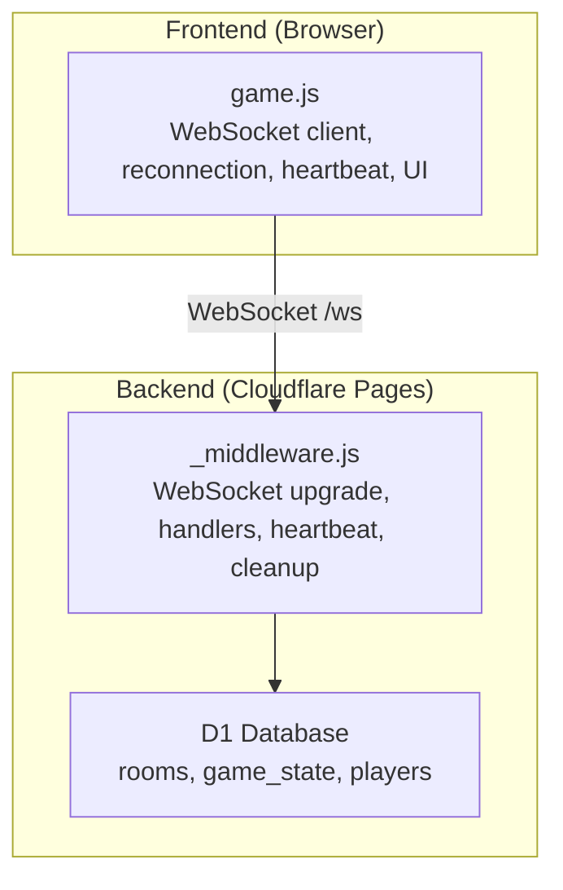
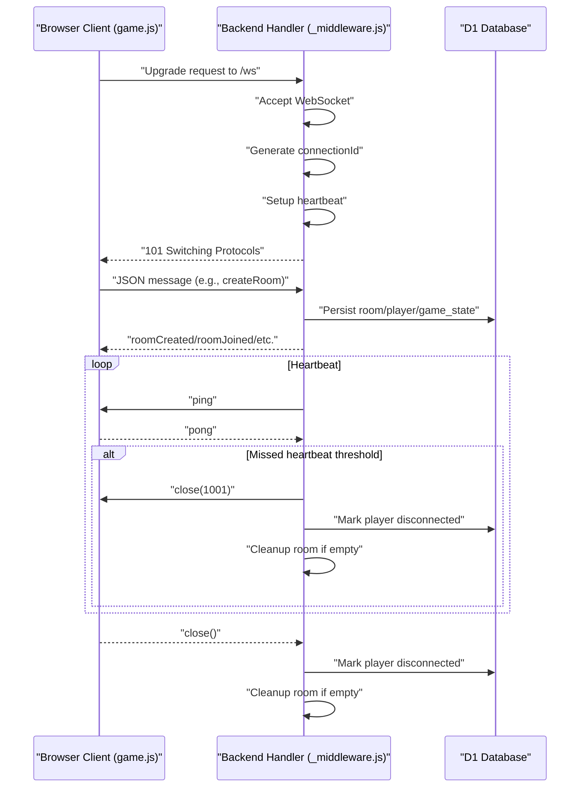
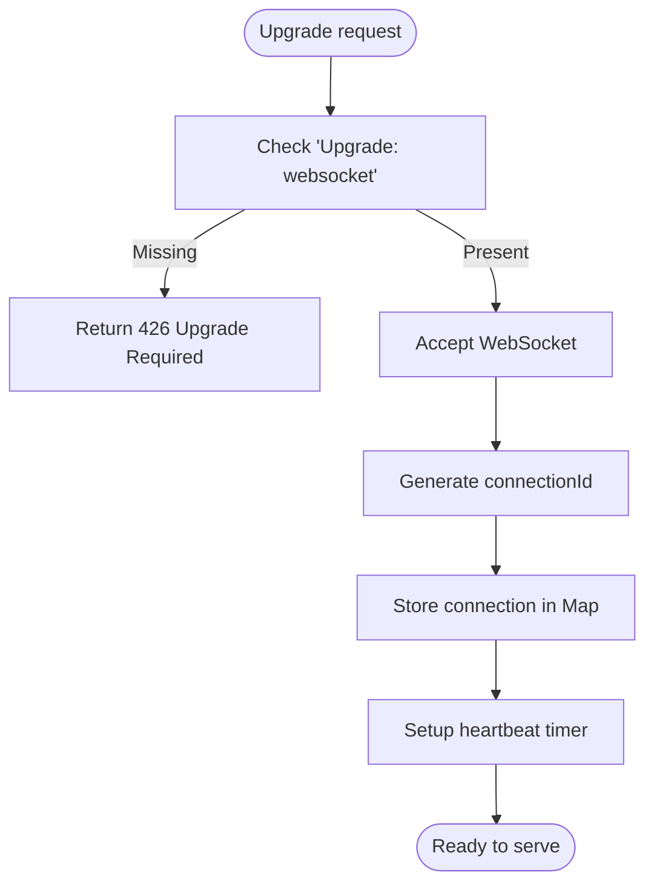
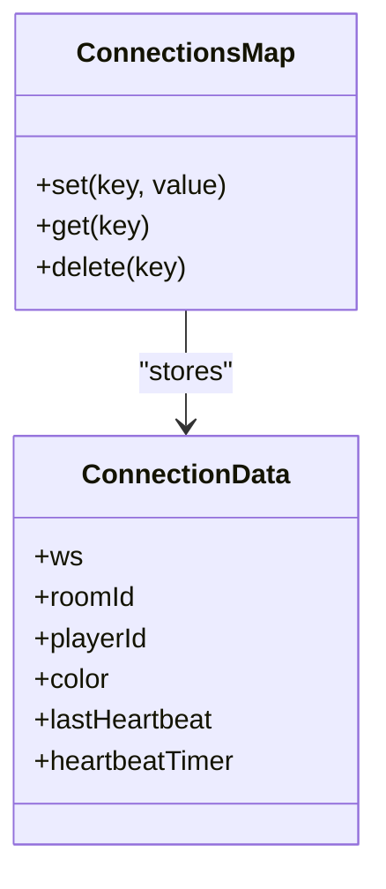
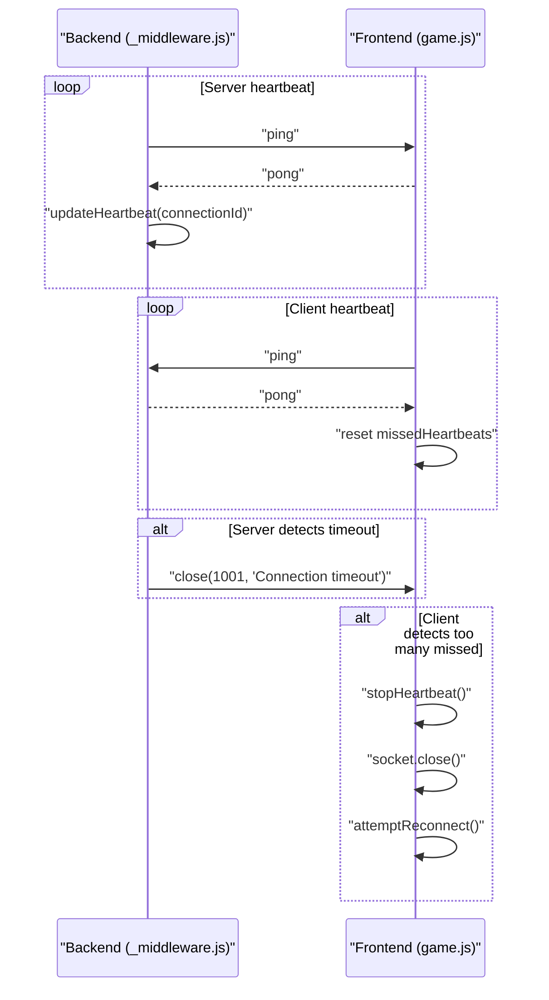
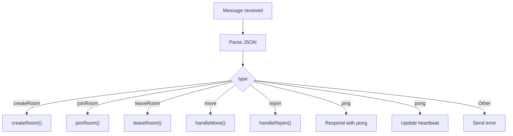
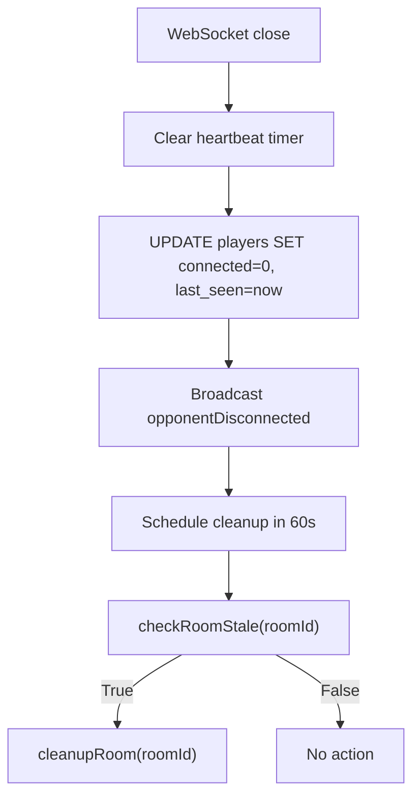
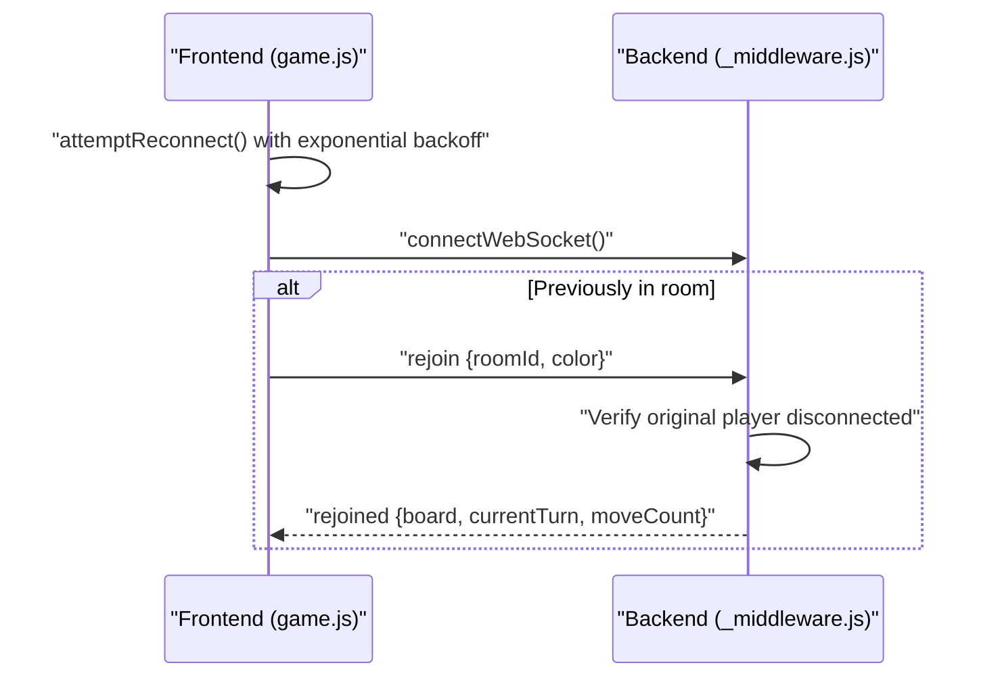
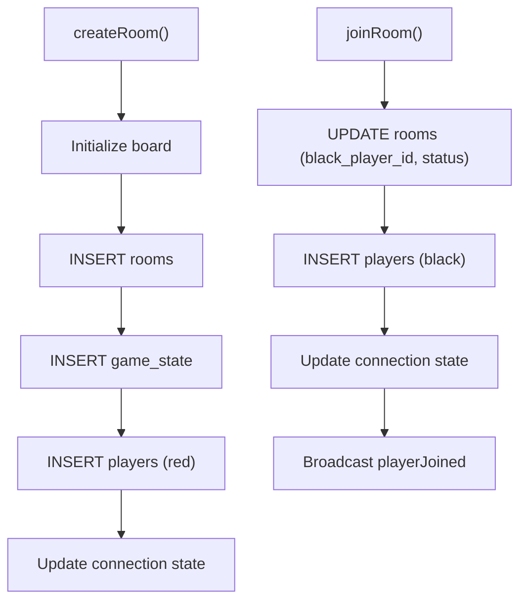
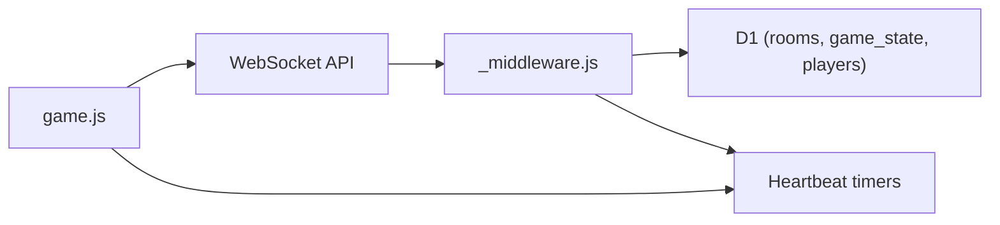

# Connection Lifecycle

<cite>
**Referenced Files in This Document**
- [_middleware.js](file://functions/_middleware.js)
- [game.js](file://game.js)
- [websocket.test.js](file://tests/integration/websocket.test.js)
- [heartbeat.test.js](file://tests/unit/heartbeat.test.js)
- [reconnection.test.js](file://tests/unit/reconnection.test.js)
- [room-management.test.js](file://tests/unit/room-management.test.js)
- [setup.js](file://tests/setup.js)
</cite>

## Table of Contents
1. [Introduction](#introduction)
2. [Project Structure](#project-structure)
3. [Core Components](#core-components)
4. [Architecture Overview](#architecture-overview)
5. [Detailed Component Analysis](#detailed-component-analysis)
6. [Dependency Analysis](#dependency-analysis)
7. [Performance Considerations](#performance-considerations)
8. [Troubleshooting Guide](#troubleshooting-guide)
9. [Conclusion](#conclusion)
10. [Appendices](#appendices)

## Introduction
This document explains the WebSocket connection lifecycle for the Chinese Chess backend and frontend. It covers the complete flow from WebSocket upgrade to connection acceptance, handshake, state management, heartbeat, cleanup, graceful disconnect, and recovery. It also includes connection pooling and scaling considerations for multiple concurrent connections.

## Project Structure
The WebSocket logic is implemented in a Cloudflare Pages Function handler and a browser-based client. The backend manages connections in memory per instance and persists room and game state in D1. The frontend maintains reconnection and heartbeat logic.

**Diagram sources**
- [_middleware.js:104-185](file://functions/_middleware.js#L104-L185)
- [game.js:740-808](file://game.js#L740-L808)

**Section sources**
- [_middleware.js:104-185](file://functions/_middleware.js#L104-L185)
- [game.js:740-808](file://game.js#L740-L808)

## Core Components
- Backend WebSocket handler: accepts upgrades, tracks connections, handles messages, manages rooms, and performs cleanup.
- Heartbeat subsystem: server-initiated pings and client-initiated pings; timeout detection and automatic disconnection.
- Connection state: connection IDs, room associations, player assignments, and player connectivity flags.
- Graceful disconnect and recovery: opponent notifications, stale room detection, and reconnection with race-condition prevention.
- Frontend client: connection lifecycle, reconnection policy, heartbeat, and polling fallbacks.

**Section sources**
- [_middleware.js:128-185](file://functions/_middleware.js#L128-L185)
- [_middleware.js:188-225](file://functions/_middleware.js#L188-L225)
- [_middleware.js:1213-1240](file://functions/_middleware.js#L1213-L1240)
- [game.js:810-836](file://game.js#L810-L836)
- [game.js:842-882](file://game.js#L842-L882)

## Architecture Overview
The backend exposes a WebSocket endpoint. On upgrade, it accepts the connection, assigns a connection ID, sets up heartbeat timers, and registers message/event handlers. The frontend connects to the same endpoint, sends room commands, and receives game events. Heartbeat ensures liveness and detects dead connections. Cleanup removes stale rooms and updates player status.

**Diagram sources**
- [_middleware.js:131-185](file://functions/_middleware.js#L131-L185)
- [_middleware.js:191-225](file://functions/_middleware.js#L191-L225)
- [_middleware.js:1213-1240](file://functions/_middleware.js#L1213-L1240)
- [game.js:842-882](file://game.js#L842-L882)

## Detailed Component Analysis

### WebSocket Upgrade and Connection Acceptance
- The backend checks for a WebSocket upgrade header and accepts the connection, creating a server-side WebSocket object and a client-side WebSocketPair.
- It generates a unique connection ID and stores connection metadata (room association, player identity, color, heartbeat timestamps) in an in-memory map.
- It sets up heartbeat and registers message/close/error handlers.

**Diagram sources**
- [_middleware.js:131-185](file://functions/_middleware.js#L131-L185)
- [_middleware.js:1263-1267](file://functions/_middleware.js#L1263-L1267)

**Section sources**
- [_middleware.js:131-185](file://functions/_middleware.js#L131-L185)
- [_middleware.js:1263-1267](file://functions/_middleware.js#L1263-L1267)

### Connection State Management
- Connection ID: generated per connection and used as the key in the in-memory connections map.
- Room associations: each connection tracks roomId, playerId, and color.
- Player assignments: on room creation/join, the backend writes player records and updates connection state.
- Player connectivity flags: stored in D1 players table; updated on connect/disconnect.

**Diagram sources**
- [_middleware.js:128-156](file://functions/_middleware.js#L128-L156)

**Section sources**
- [_middleware.js:128-156](file://functions/_middleware.js#L128-L156)
- [_middleware.js:318-337](file://functions/_middleware.js#L318-L337)
- [_middleware.js:400-412](file://functions/_middleware.js#L400-L412)

### Heartbeat Mechanism
- Server heartbeat: periodic ping sent by the backend; client responds with pong. The backend updates lastHeartbeat and closes the connection if timeout elapses.
- Client heartbeat: periodic ping sent by the frontend; backend responds with pong. The frontend resets missed heartbeat counters and triggers reconnection if thresholds are exceeded.
- Timeout detection: server uses a fixed interval and timeout; client uses a shorter interval and counts consecutive missed heartbeats.

**Diagram sources**
- [_middleware.js:191-225](file://functions/_middleware.js#L191-L225)
- [game.js:842-882](file://game.js#L842-L882)
- [heartbeat.test.js:117-145](file://tests/unit/heartbeat.test.js#L117-L145)

**Section sources**
- [_middleware.js:9-11](file://functions/_middleware.js#L9-L11)
- [_middleware.js:191-225](file://functions/_middleware.js#L191-L225)
- [game.js:31-36](file://game.js#L31-L36)
- [game.js:842-882](file://game.js#L842-L882)
- [heartbeat.test.js:117-145](file://tests/unit/heartbeat.test.js#L117-L145)

### Message Handling and Handshake
- The backend parses incoming JSON messages and dispatches to handlers for room creation, joining, leaving, moves, resign, and reconnection.
- The frontend sends rejoin on connect if it had a room and color; the backend validates and restores state.
- Ping/pong messages are handled to maintain liveness.

**Diagram sources**
- [_middleware.js:231-276](file://functions/_middleware.js#L231-L276)
- [_middleware.js:1086-1146](file://functions/_middleware.js#L1086-L1146)
- [game.js:927-933](file://game.js#L927-L933)

**Section sources**
- [_middleware.js:231-276](file://functions/_middleware.js#L231-L276)
- [_middleware.js:1086-1146](file://functions/_middleware.js#L1086-L1146)
- [game.js:927-933](file://game.js#L927-L933)

### Graceful Disconnect and Cleanup
- On close, the backend clears heartbeat timers, marks the player as disconnected, notifies opponents, and schedules cleanup of empty rooms after a delay.
- Stale room detection: a room is considered stale if there are no players or if all players are both disconnected and inactive beyond a timeout.
- Cleanup removes players, game state, and room entries.

**Diagram sources**
- [_middleware.js:1213-1240](file://functions/_middleware.js#L1213-L1240)
- [_middleware.js:479-516](file://functions/_middleware.js#L479-L516)
- [room-management.test.js:42-63](file://tests/unit/room-management.test.js#L42-L63)

**Section sources**
- [_middleware.js:1213-1240](file://functions/_middleware.js#L1213-L1240)
- [_middleware.js:479-516](file://functions/_middleware.js#L479-L516)
- [room-management.test.js:42-63](file://tests/unit/room-management.test.js#L42-L63)

### Connection Recovery and Reconnection
- The frontend attempts exponential backoff reconnection on close or error, up to a maximum number of attempts.
- On successful connect, the frontend sends a rejoin message with room ID and color; the backend validates that the original player is disconnected before allowing reconnection.
- The backend restores board state, turn, and move count to the client.

**Diagram sources**
- [game.js:810-836](file://game.js#L810-L836)
- [_middleware.js:1086-1146](file://functions/_middleware.js#L1086-L1146)
- [reconnection.test.js:139-240](file://tests/unit/reconnection.test.js#L139-L240)

**Section sources**
- [game.js:810-836](file://game.js#L810-L836)
- [_middleware.js:1086-1146](file://functions/_middleware.js#L1086-L1146)
- [reconnection.test.js:139-240](file://tests/unit/reconnection.test.js#L139-L240)

### Room Management and Broadcasting
- Room creation initializes rooms, game_state, and players with default values and assigns the first player as red.
- Room joining updates room status and inserts the second player as black.
- Broadcasting: messages are sent to all connections in the same room except the sender.

**Diagram sources**
- [_middleware.js:282-351](file://functions/_middleware.js#L282-L351)
- [_middleware.js:353-443](file://functions/_middleware.js#L353-L443)
- [_middleware.js:1242-1252](file://functions/_middleware.js#L1242-L1252)

**Section sources**
- [_middleware.js:282-351](file://functions/_middleware.js#L282-L351)
- [_middleware.js:353-443](file://functions/_middleware.js#L353-L443)
- [_middleware.js:1242-1252](file://functions/_middleware.js#L1242-L1252)

## Dependency Analysis
- Backend depends on D1 for persistent state (rooms, game_state, players).
- Frontend depends on browser WebSocket APIs and local UI state.
- Heartbeat constants are defined in both backend and frontend; tests validate alignment.

**Diagram sources**
- [game.js:740-808](file://game.js#L740-L808)
- [_middleware.js:104-185](file://functions/_middleware.js#L104-L185)
- [_middleware.js:9-11](file://functions/_middleware.js#L9-L11)

**Section sources**
- [game.js:740-808](file://game.js#L740-L808)
- [_middleware.js:9-11](file://functions/_middleware.js#L9-L11)
- [_middleware.js:104-185](file://functions/_middleware.js#L104-L185)

## Performance Considerations
- Connection storage: in-memory Map per instance; consider sharding or external session store for multi-instance deployments.
- Heartbeat overhead: periodic pings and timers; tune intervals to balance responsiveness and CPU usage.
- Broadcasting: iterating over connections to send room messages; consider partitioning rooms to reduce broadcast fanout.
- Database operations: batch writes for room creation/join; ensure indexes exist for efficient lookups.
- Scaling: Cloudflare Pages Functions scale automatically; however, stateless design favors D1 and avoids sticky sessions.

[No sources needed since this section provides general guidance]

## Troubleshooting Guide
- Connection not upgrading: verify the upgrade header is present and the path is /ws.
- Frequent timeouts: adjust heartbeat intervals and timeouts; ensure clients respond to pings promptly.
- Reconnection race condition: ensure the original player is marked disconnected before allowing rejoin.
- Stale room not cleaned: verify stale room logic considers both disconnected and inactive players.
- Frontend reconnection loops: check exponential backoff limits and maximum attempts.

**Section sources**
- [_middleware.js:131-185](file://functions/_middleware.js#L131-L185)
- [_middleware.js:191-225](file://functions/_middleware.js#L191-L225)
- [_middleware.js:1086-1146](file://functions/_middleware.js#L1086-L1146)
- [_middleware.js:479-516](file://functions/_middleware.js#L479-L516)
- [heartbeat.test.js:271-313](file://tests/unit/heartbeat.test.js#L271-L313)
- [reconnection.test.js:191-240](file://tests/unit/reconnection.test.js#L191-L240)
- [room-management.test.js:142-157](file://tests/unit/room-management.test.js#L142-L157)

## Conclusion
The WebSocket connection lifecycle integrates upgrade handling, connection acceptance, handshake, heartbeat monitoring, room management, and robust cleanup. The frontend provides resilient reconnection and heartbeat logic, while the backend enforces state consistency and prevents race conditions during reconnection. Together, these components deliver a reliable real-time gaming experience.

[No sources needed since this section summarizes without analyzing specific files]

## Appendices

### API and Message Types
- createRoom: creates a new room and assigns the creator as red.
- joinRoom: joins an existing room as black if available.
- leaveRoom: leaves the current room and updates player status.
- move: applies a move with optimistic locking and broadcasts updates.
- resign: declares resignation and ends the game.
- ping/pong: heartbeat messages.
- rejoin: reconnects a player to a room after disconnection.
- checkOpponent: polls for opponent presence.
- checkMoves: polls for recent move updates.

**Section sources**
- [_middleware.js:242-276](file://functions/_middleware.js#L242-L276)
- [_middleware.js:1086-1146](file://functions/_middleware.js#L1086-L1146)
- [game.js:888-937](file://game.js#L888-L937)

### Testing Coverage
- WebSocket integration tests cover upgrade, message handling, room creation/joining, move synchronization, heartbeat, error handling, reconnection, and disconnection.
- Heartbeat tests validate server/client timeouts and missed heartbeat counting.
- Reconnection tests enforce race-condition prevention and state recovery.
- Room management tests validate stale room detection logic.

**Section sources**
- [websocket.test.js:33-404](file://tests/integration/websocket.test.js#L33-L404)
- [heartbeat.test.js:117-467](file://tests/unit/heartbeat.test.js#L117-L467)
- [reconnection.test.js:139-594](file://tests/unit/reconnection.test.js#L139-L594)
- [room-management.test.js:42-239](file://tests/unit/room-management.test.js#L42-L239)